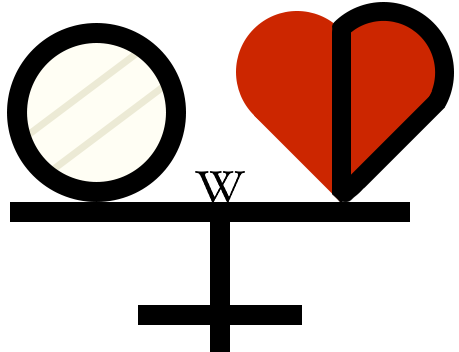

#   关于FreeODwiki 

FreeODwiki是一个由社群维护的百科全书，主题是OD/药物滥用/毒品/精神活性物质等，条目涵盖各个[具体药物的信息](药物/index.md)、药物产生的各类[主观效应](药效/index.md)、使用药物的[体验心得](报告/index.md)、药物相关的[文档和资料](文档/index.md)、精神药理学等[科学知识](文档/科学信息索引页.md)、药物[减害指南](文档/负责任的用药索引页.md)、药物相关的[技术与教学](文档/教学索引页.md)、药物与[社会的联系](文档/社会学/index.md)、药物相关的[观点与讨论](文档/观点讨论/index.md)。截至2026年5月，FreeODwiki的文档总数近2000篇，且仍在继续增加中。

FreeODwiki的目标是：为所有感兴趣的人提供一个共享知识、讨论药物议题的平台；从基于事实的视角出发，记录药物使用的各方各面；提供科普知识和可行方案，倡导以负责任的方式使用药物；保障就对意识与身体的探索方面做出知情的决定所需要的信息，并以此弘扬世俗主义、自由思想和个体自主权的理念，改变固有观念。 <!-- 模仿psywiki的  -->

本项目虽然采取百科全书的形式，但其意义远不止于百科全书：FreeODwiki将作为我们社群合作的框架，汇聚社群的力量，发展社群的文化，表达社群的声音。

无论你是有经验的开源项目合作者，还是从未接触过开源项目的新手；无论你是有经验的药物使用者，还是只是对药物话题感兴趣的读者，我们都欢迎你加入我们社区哦~

本README仍在施工中......

网站主页链接：[网站主页](index.md)

贡献指南：[贡献指南](CONTRIBUTING.md)

行为准则：[行为准则](CODE_OF_CONDUCT.md)

FOW论坛：[FOW论坛](https://github.com/SalviaSWC/FreeODwiki/discussions)(Github讨论区)

## 本站板块概述

本站由多个板块组成，下面列出目前所有的板块：

### [💊药物板块索引](药物/index.md)

药物板块的主题是具体的精神活性物质，每一个条目主要介绍该物质的基本信息、化学结构信息、精神活性信息、给药途径、给药剂量、药效时长、主观效应、伤害和滥用潜力、合法性、历史和文化等，且格式相对统一，便于大家查找。

通过给出这些信息，我们不仅希望能让读者对精神活性物质有更全面的认知，从而能够就其使用做出更知情的决定；更意图传达一个重要的理念：精神活性物质是一种错综复杂而晦涩难懂的事物，但不是禁忌话题。有关精神活性物质的知识可以被社群传递，我们更必须以负责任的态度来对待它们。

### [✏️报告板块索引](报告/index.md)

报告板块的主题是使用精神活性物质的体验报告，由用户自行投稿。有些报告条目来自其他网站，另一些则是本站的独家内容。目前，投稿的报告条目没有统一的格式，但通常包括报告者的基本数据和使用的药物及剂量，以及用药体验的叙述。我们正在努力制定一个既能满足用户表达的自由，又能更易让读者理解格式规范。

我们希望通过这些报告，能让读者对精神活性物质的有更直观的了解，并展示精神活性物质的多样性和复杂性，引导读者对这个话题产生自己的感受、得出自己的结论。

### [🧠药效板块索引](药效/index.md)

药效板块的主题是使用精神活性物质产生的主观效应，条目格式相对统一、内容相对完善。每个条目包含相应药物效应的描述、与其他药效的关系、相关药物等信息。

通过归纳精神活性物质的主观效应，我们可以为读者提供更准确和规范化的药效描述，帮助读者更好地理解精神活性物质的使用体验；同时，我们希望展示不同精神活性物质的共性与差异，让读者直观地了解精神活性物质的多样性背后的规律。

### [📚文档板块索引](文档/index.md)

文档板块聚焦于与精神活性物质相关的各种文档和资料，内容涵盖科学知识、减害指南、技术与教学、社会学、观点与讨论等多个方面。

文档板块下的条目多关注与精神活性物质间接相关的话题，条目内容与格式较多样化。以下为文档板块下的主要的子板块：

#### [💬观点讨论](文档/观点讨论/index.md)

观点讨论板块的主题是与精神活性物质相关的观点及其讨论，且仅代表作者观点。

- [FreeOD引论](文档/观点讨论/FreeOD引论.md)

#### [🏛️社会学](/文档/社会学/index.md)

社会学板块的主题是中国特定背景下的精神活性物质与社会、法律的文档。

####  [🚮补档](/文档/补档/index.md)

补档板块的主题是其他百科的补档，内容主要包括那些不再活动的其他百科。我们将这些条目重新整理后发布在本站，以供读者参考。

|  | 我们的Github仓库收获的stars |
| --------------------------------------------------------------------------------- | --------------------------- |

除非另有说明，本站的页面采用[CC-BY-SA 4.0](LICENSE)许可协议。

