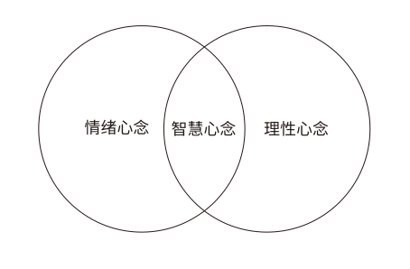
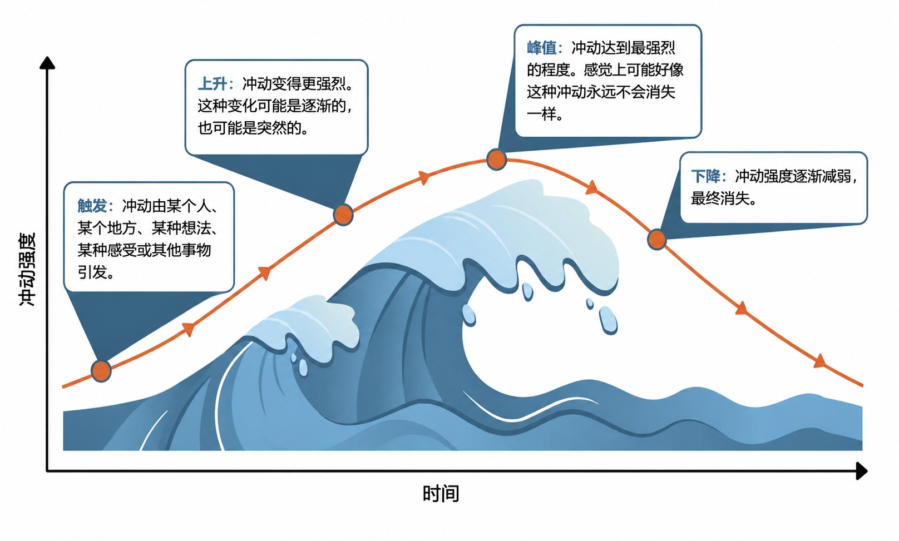

# DBT-辩证行为疗法

### 为什么是DBT？

辩证行为疗法（DBT）是一种循证心理疗法， 最初用于治疗人格障碍和人际冲突。证据表明，DBT 可用于治疗情绪障碍和自杀意念，以及改变自残和物质滥用等行为模式。DBT治疗其他疾病的有效性研究已取得丰硕成果。临床医生已使用DBT治疗抑郁症、药物和酒精滥用问题 、创伤后应激障碍（PTSD） 、创伤性脑损伤（TBI）、暴食症和情绪障碍。研究表明，DBT可能有助于缓解与情绪障碍谱系相关的症状和行为，包括自伤行为。研究还表明，DBT对性虐待幸存者和药物依赖者有效。[[1]](https://en.wikipedia.org/wiki/Dialectical_behavior_therapy)

### 关于DBT

DBT包含了一些技能，分为四个板块，分别是**正念**、**痛苦忍受**、**情绪调节**、**人际效能**。这四个板块中的技能告诉我们该如何处理自己的情绪并且不冲动地面对正在面对的情况。很多我们不期望的结果的来源是因为我们冲动行事，所以我们可以通过DBT减少我们自身的冲动。

### 正念技能

#### 正念是什么？

正念意味着关注当下，既不加以评判，也不试图改变它。这也就是说观察自己的念头、情绪和身体感受，而不陷入其中。

| 意识 | 觉察当下的念头、情绪与身体感受。其目的并非停止思考，而是要觉察自身的体验，而非迷失其中。 |
| --- | --- |
| 感受 | 觉察自己的体验，而不对其进行评判或试图改变它。例如，如果你觉察到焦虑感，只需对自己说：“我注意到自己感到焦虑。” |

正念有利于与减轻抑郁与焦虑，提升人际关系满意度；增强记忆力与专注力，减少过度思虑或强迫性念头；增强抗压能力，提升情绪管理能力

**正念的方法**

| 正念冥想 | 觉察当下的念头、情绪与身体感受。其目的并非停止思考，而是要觉察自身的体验，而非迷失其中。 |
| --- | --- |
| 正念行走 | 在行走时练习正念。首先，留意每迈出一步时身体的动作与感受。接着，将觉察范围扩展到周围环境。你看到了什么、听到了什么、闻到了什么，又有什么样的感觉？这项技巧同样可以应用于其他日常活动中。 |
| 扫描全身 | 请密切留意全身的身体感觉。从双脚开始，依次向上感知双腿、腹股沟、腹部、胸部、背部、肩膀、手臂、双手、颈部和面部。在每个部位停留 15 秒到 1 分钟。 |
| 使用感官 | 只需依次关注你的每一种感官，关注5样看到的物体、4种感受到的触觉、3种听到的声音、2种闻到的气味、1种尝到的味道。 |

#### 智慧心念

辩证行为疗法有助于我们更好地理解内心不同的层面。为此，DBT 提出我们既拥有“情绪心智”，也拥有“理性心智”。两者都能提供宝贵的信息，但当其中一方占据主导地位而压倒另一方时，问题便可能随之产生。

情绪心念大于理智心念的时候：我们充满激情，直觉敏锐。我们能够感知他人的情绪并产生共鸣；也能敏锐捕捉关于威胁、安全及重要事项的直觉，从而迅速采取行动。我们的情感体验既深刻又丰富。与此同时我们也可能因冲动行事而伤害自己、他人或人际关系；可能会忽略重要细节，或以带有偏见的方式看待事实；还可能在情绪激动时说出或做出让自己后悔的事。
理智心念大于情绪心念的时候：我们头脑冷静、务实，能够依据事实和证据客观地解决问题；通过收集并权衡相关信息，我们能做出切合实际且合理的决策，并进行批判性和逻辑性的思考。与此同时我们也可能忽视或摒弃自己的直觉、本能或情感，从而错失与他人产生共鸣及建立深层联系的良机；我们或许会感到麻木，或者行事刻板、墨守成规。

智慧心念是情绪心念与理性心念之间的平衡。在辩证行为疗法（DBT）中，智慧意味着同时兼顾情绪之心的洞见与理性之心的理智。
当遇到令人沮丧的情况时，运用情绪思维、理性思维和智慧思维这三个视角来分析问题会很有帮助。
这有助于我们吸收情绪思维和理性思维所能提供的所有信息，同时平衡二者，并以建设性的方式继续前进。

##### 练习智慧心念

| 全然活在当下 | 完全活在此时此刻。让自己全神贯注于手头正在做的事情，而不去挂念下一项任务或尚未到来的时刻。 |
| --- | --- |
| 真切地感受自己的身体 | 感受空气拂过肌肤，感受焦虑时心跳加速，以及休憩时肌肉的放松。 |
| 觉察你的内心生活 | 关注自己的内心与情绪。既不忽视情绪，也不被情绪裹挟。觉察那些流经脑海的念头。 |
| 平衡的心境 | 游走于情感与理性、存在与行动之间，达致辩证的融合。 |

运用“智慧心”（wise mind）就像是用三维视角看东西一样。
把一个物体举到脸前。试着轮流闭上一只眼睛，留意每只眼睛看到的物体图像有何细微差别。当你同时睁开双眼时，大脑会将两幅图像合二为一。于是，你便获得了一种此前不曾有过的立体感和深度感。
双眼各自看到不同的画面，但协同工作时，它们能让我们感知到深度与立体。
同样地，我们心智的不同部分运作方式各异，但若能协同运作，便能让我们汲取洞察力与智慧。

例如：
“情绪心念”充满情感、同理心与直觉。
“理性心念”擅长逻辑与务实思考。
“智慧心念”能平衡两者，让我们明智地选择符合自身真正价值观的行动。

又如：
“存在心念”充满好奇并专注于当下，它能抽离出来观察自己的念头，视其为大脑产生的产物。
“行动心念”以目标和行动为导向，沉浸在自己的念头中，将其视为关于世界的客观事实及决策依据。
“智慧心念”能平衡两者，让我们既能熟练地投入当下之事，又能保持对自己及自身偏见的觉察。

##### 练习智慧心念的方法：

• 一次只将感官完全专注于一件事上。敞开其他的感觉，体验完整的过程。例如，泡茶时缓慢完成每一个步骤：感受茶香，观察茶叶浸泡时水色的变化，享受杯身传来的温热感，并细细品味茶的风味。
• 一次只将注意力完全集中在当下这一刻。无论正在做什么（例如洗碗），都要专注在这一刻。下一刻终会到来，但在那一刻真正来临之前，不要提前把注意放在其中，比如说不要在洗碗时去想洗锅或扫地的事。
• 避免忽视或忽略生活中的事件。细细品味微小的乐趣，比如忙碌一天后坐下来休息。同时，也要将注意力投向艰难时刻，比如收到一封令人担忧的邮件。
• 通过练习增强你的“意愿”力量。当有事需要完成时，练习以充沛的精力与全神贯注的态度去投入。全身心地投入到任务中去。
• 练习扩展你的注意力。关注呼吸，跟随它在体内的流动。将觉知扩展到身体：你的姿势如何？面部表情怎样？身体哪里紧绷？同时保持对呼吸和身体的觉察。进一步将感觉扩展到周围环境：你能听到什么？看到什么？同时将呼吸、身体和周围环境保持在觉察之中。

### 痛苦忍受技能

#### TIPP

当你被强烈的情绪淹没时，TIPP技巧可以帮助身体进入更放松的状态。在情绪动荡的时刻，不妨运用其中的策略从而重新获得平稳的情绪。

| Temperature温度 | 降低体温能减缓心率和呼吸，从而将注意力从强烈的情绪和侵入性思维中转移开来。 | 屏住呼吸，将面部短暂浸入冷水中，重复 2-3 次。也可以：• 洗冷水澡。• 用冰袋或冰块冷敷皮肤，但是应避免过多的低温刺激。• 用湿布冷敷面部或颈部。 |
| --- | --- | --- |
| Intensive exercise剧烈运动 | 高强度运动能减轻压力，并增加大脑中内啡肽等令人愉悦的化学物质的分泌。 | 做 15 分钟的中等强度运动，注意不要过度，例如：• 快走或慢跑。• 游泳或骑自行车。• 跳绳或做开合跳。 |
| Paced breathing有节奏地呼吸 | 有节奏的呼吸能增加氧气摄入，并降低血压和心率。 | 1. 用鼻子吸气，默数4下。2. 屏住呼吸，默数7下。3. 用嘴呼气，默数8下。4. 重复几次。 |
| Progressive muscle relaxation渐进式肌肉放松 | 肌肉的收紧与放松有助于身体释放压力，从而触发放松反应。 | 1. 采取舒适的坐姿或卧姿。2. 绷紧双脚肌肉，保持5秒钟。3. 在缓慢放松这些肌肉的同时，说出“放松”二字。4. 依次对小腿、大腿、腹部、背部、胸部、手臂和面部重复上述步骤。 |

#### IMPROVE：改善此刻

| Imagery想象 | 想象一个远离烦恼的宁静之地。你看到了什么、听到了什么、闻到了什么？或者生动地想象你当前面临的挑战得到圆满解决的情景。比如调动各种感官，想象自己在海滩上放松休憩；在脑海中演练一次原本令人紧张的对话，想象它进展顺利。 |
| --- | --- |
| Meaning意义 | 你能从当前的处境中发现或创造出什么意义吗？思考一下，如何利用当下的经历来获得感悟或帮助他人。例如列出你所经历的困境中任何积极的方面；列出你能从这次经历中获得成长的方式。 |
| Prayer祈祷 | 用祈祷来接受你无法掌控的事情，或寻求指引来应对困境。与更高的力量或你内心的智慧连接：祈祷；列出五件让你心怀感激的事情；冥想。 |
| Relaxation放松 | 找一个安静的地方，练习你选择的放松技巧。如果发现注意力又回到了让你担忧的事情上，请温和地将其拉回到练习中来：练习深呼吸，进行渐进式肌肉放松，练习瑜伽。 |
| One thing in the moment一次做一件事 | 全身心投入到一项简单或重复性的活动中。这可以是做家务，也可以是计数或背诵等脑力活动，比如：拔除杂草；整理衣物；背诵一首诗；从100开始倒数。 |
| Vacation度假 | 暂时放下烦恼，做些有趣或有益身心的事。这能让你恢复活力，并在重回日常事务时带来全新的视角。比如去徒步旅行；阅读感兴趣的内容；观看一部喜欢的电影。 |
| Encouragement鼓励 | 试着做自己最坚定的支持者，不断对自己重复那些鼓舞人心的话语。请务必选择一句让你感到发自内心、并能激励你继续前行的短语。“我能行！” “我曾经挺过来了，这次也一定能挺过去。” “会好起来的。” |

#### ACCEPTS：接受情绪

| Activities活动 | 做一些需要思考和集中注意力的事情。你可以读一本书；写日记；完成工作或学校作业；参加体育运动。 |
| --- | --- |
| Contributing贡献 | 不只关注自己，而同时关注他人或其他事物。你可以问问朋友今天过得怎么样；给别人做一份礼物；写一张充满心意的卡片。 |
| Comparisons比较 | 试着将你的处境与更糟糕的情况做个比较，以此来调整心态。回想一下你曾经遭受更大痛苦的时刻，或者想想那些处境比你更艰难的人。 |
| Emotions情感 | 采取行动，产生一种能与你当下的痛苦情绪相抗衡的新相反情绪。感到悲伤？那就看一部搞笑电影。感到焦虑？那就听听舒缓的音乐。感到愤怒？那就去散散步。 |
| Pushing away推开 | 试着将你的情绪想象成与你分离的事物。想象一下，把你烦恼的事情放进一个盒子里，用胶带封好，然后埋到地底。 |
| Thoughts想法 | 让你的思绪保持忙碌，这样你就没有余暇去纠结那些痛苦的感受。你可以从1000开始，每次减7往下倒数。 |
| Sensations感受 | 制造安全的身体感觉，以转移注意力，缓解令人不安的情绪。你可以手里握一块冰块；吃点酸的或辣的食物；或者用橡皮筋弹一下手腕。 |

#### 冲浪

“冲浪”（Urge surfing）是一种管理不良行为的技巧。与其屈服于某种冲动，不如像冲浪者驾驭海浪那样，顺势“驾驭”这股冲动。过了一会儿，冲动便会自行消退。

这一技巧可用于戒除或减少吸毒、酗酒、赌博及其他不良行为，也可用于应对愤怒时“情绪爆发”等不良反应。

如何练习“冲动冲浪”
 1. 觉察到自己正产生某种冲动。
 2. 留意自己的想法和感受，不要试图改变或压抑它们。但是要注意的是，在经历冲动时感到些许不适是正常的。
 3.提醒自己：产生冲动是正常的，这是对成瘾和习惯的自然反应；冲动只是一种感觉，而非必须付诸行动的指令；我可以带着这种感觉，同时选择不采取行动；感到些许不适也无妨，我不必非要改变这种状态；冲动是暂时的。就像其他任何感觉一样，它终会自行消退。

其他技能
 管理诱发因素：运用应对技巧来削弱诱发因素的影响力。提前了解会引发反应的事物，并针对每种情况准备好相应的策略或应对技巧。例如：感到压力时深呼吸，感到饥饿时进食，身处高风险环境时离开该地。
 延迟想法、分散注意力：做点别的事来转移注意力，摆脱这种冲动。每拖延一分钟，冲动自行减弱的可能性就会增加。例如：散步、听音乐、给朋友打电话、看书、练习一项爱好

### 人际效能技能

#### DEAR MAN：亲爱的

“DEAR MAN（亲爱的）”这一缩写代表了一种在社交场合中满足自身愿望与需求的策略。当你先明确了自己想向对方提出的具体请求时，这种方法的效果是最好的。
