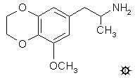

# 120 [MEDA](/药物/MEDA.md)

[上一个](/文档/PiHKAL/pihkal119.md) [返回](/文档/PiHKAL/index.md) [下一个](/文档/PiHKAL/pihkal121.md)

**3-甲氧基-4,5-乙二氧基苯丙胺**

|  |
| --- |

**合成：** 将 50 g 3,4-二羟基-5-甲氧基苯甲醛溶于 100 mL 蒸馏丙酮中，加入 70 g 溴化乙烯和 58 g 研细的无水 K2CO3。混合物回流 5 天。然后将其倒入 1.5 L H2O 中，并用 4x100 mL CH2Cl2 萃取。合并萃取液并除去溶剂，得到残留物，在 19 mm/Hg 下蒸馏。在 203-210 °C 范围内收集的几个馏分自发结晶，合并后得到 18.3 g 3-甲氧基-4,5-乙二氧基苯甲醛，为白色固体，熔点为 80-81 °C。取少量样品与等重量的丙二腈溶于乙醇中，滴加几滴三乙胺处理，从乙醇中得到 3-甲氧基-4,5-乙二氧基苯亚甲基丙二腈，为淡黄色晶体，熔点为 153-154 °C。

将 1.50 g 3-甲氧基-4,5-乙二氧基苯甲醛溶于 6 mL 乙酸中，用 1 mL 硝基乙烷和 0.50 g 无水乙酸铵处理，并在蒸汽浴上保持 1.5 小时。向冷却的混合物中小心加入 H2O，直到观察到第一次永久性浑浊，一旦开始结晶，就以允许生成额外晶体的速度加入更多的 H2O。当额外的 H2O 导致残留浑浊时，停止加水，并将烧杯在冰温下保持数小时。过滤除去产物，并用少量 50% 乙酸洗涤，得到 0.93 g 1-(3-甲氧基-4,5-乙二氧基苯基)-2-硝基丙烯，为暗黄色晶体，熔点为 116-119 °C。分析样品从甲醇中重结晶后的熔点为 119-121 °C。

在惰性气氛下，将 6.8 g 氢化铝锂 (LAH) 在 500 mL 无水 Et2O 中的悬浮液搅拌并加热至温和回流。在 0.5 小时内加入溶于温热 Et2O 中的总计 9.4 g 1-(3-甲氧基-4,5-乙二氧基苯基)-2-硝基丙烯。保持回流 6 小时，然后冷却反应混合物，并通过小心加入 400 mL 1.5 N H2SO4 来破坏过量的氢化物。分离两个澄清相，通过加入饱和 Na2CO3 溶液将水相调节至 pH 6。过滤除去少量不溶物，将澄清滤液加热至 80 °C。向其中加入 9.2 g 苦味酸（90% 纯度）溶于 100 mL 沸腾乙醇的溶液，并让澄清混合物在冰浴中冷却。刮擦器壁产生苦味酸盐的黄色晶体。过滤该盐使其脱离水环境，用 50 mL 5% NaOH 处理，并搅拌直至苦味酸完全转化为可溶性钠盐形式。然后用 3x100 mL CH2Cl2 萃取，合并萃取液，并在真空下除去溶剂。残留物重 6.0 g，将其溶于 100 mL 无水 Et2O 中，并通入干燥的 HCl 气体至饱和。过滤除去形成的白色固体，并在 50 mL 微湿的丙酮下研磨，得到 4.92 g 3-甲氧基-4,5-乙二氧基苯丙胺盐酸盐一水合物 (MEDA)，为白色晶体。

**给药剂量：** 大于 200 mg。

**药效时长：** 未知。

**延伸和评论：** 有时候，上帝会以意想不到的美妙方式微笑。在发现了 MMDA 的活性后，"科学"的做法是将它与当时已知的另一种"拟精神病"苯丙胺（即 1962 年时的 TMA）进行比较。比较它们的结构，唯一的区别是 TMA 的两个相邻甲氧基被一个 5 元环（称为亚甲二氧基环）所取代。

接下来该怎么做？某种反常的灵感建议将这个环的大小增加到一个 6 元环，即乙二氧基（或二恶烯）同系物。好吧，如果你认为获取肉豆蔻醛很困难，那与获取这种 6 元对应物相比简直不值一提。但我费尽周折，确实制造出了足以品尝和评估的量。正是在这里，我得到了神圣的信息！没有活性！！所以，与其像西西弗斯那样被永远注定要将更大的环推上我的精神高地，我允许自己去追求另一条道路。这条信息是："不要改变基团。让它们保持原样，而是重新安置它们的位置。" 这直接导致了 TMA-2 及其故事的诞生。

这里可以顺便提一下几个题外话。在 MEDA 幸运的无活性被确立之前，7 元环对应物，3-甲氧基-4,5-三亚甲二氧基苯丙胺 (MTMA) 基本上通过相同的程序制备而成。上述 3-甲氧基-4,5-二羟基苯甲醛与三亚甲基溴反应得到 3-甲氧基-4,5-三亚甲二氧基苯甲醛，为白色固体，其丙二腈衍生物的熔点为 134-135 °C；该醛与硝基乙烷反应得到熔点为 86-87 °C 的硝基丙烯；这与 LAH 反应再次先以苦味酸盐形式分离，最终得到 MTDA 盐酸盐（熔点 160-161 °C）。在被放弃之前，已经在高达 8 毫克的剂量下进行了品尝（没有活性，但也未预期有活性）。此外，最初曾尝试合成一个五元环（亚甲二氧基），并在其上伸出一个甲基。这种乙叉基同系物只进行到了醛的阶段。3,4-二羟基-5-甲氧基苯甲醛与 1,1-二溴乙烷在含有无水碳酸钾的丙酮中反应，得到了微量的双组分混合物产物。通过在制备型气相色谱系统中进行数十次单独进样将其分离，分离出的两个组分中的第二个足以证明（通过 NMR 光谱）它是所需的 3-甲氧基-4,5-乙叉二氧基苯甲醛。从预先制备的邻苯二酚醛的二钾盐或铅盐出发，什么也没得到。随着 MEDA 被发现没有活性，所有这些都被放弃了。

在 [MDA](/药物/MDA.md) 条目下有一些关于沿此路线（使用不同方法）成功化学合成的评论，即当不存在甲氧基时。这些化合物是 EDA 和 IDA。但药理学仍然不那么令人兴奋。

---

[上一个](/文档/PiHKAL/pihkal119.md) [返回](/文档/PiHKAL/index.md) [下一个](/文档/PiHKAL/pihkal121.md)