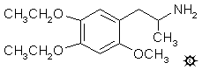

# 121 [MEE](/药物/MEE.md)

[上一个](/文档/PiHKAL/pihkal120.md) [返回](/文档/PiHKAL/index.md) [下一个](/文档/PiHKAL/pihkal122.md)

**4,5-二乙氧基-2-甲氧基苯丙胺**

|  |
| --- |

**合成：** 向 166 g 波旁醛 (bourbonal) 溶于 1 L 甲醇的溶液中，加入 66 g KOH 颗粒溶于 300 mL H2O 的溶液。然后加入 120 g 溴乙烷，混合物在蒸汽浴上回流 3 小时。反应通过加入三倍体积的 H2O 淬灭，并通过加入 25% NaOH 使其呈强碱性。用 3x300 mL CH2Cl2 萃取，合并的萃取液在真空下除去溶剂。剩下 155 g 3,4-二乙氧基苯甲醛，为液态油状物，其红外光谱与伊士曼柯达公司的商业样品完全相同（除略微潮湿外）。

将 194 g 3,4-二乙氧基苯甲醛溶于 600 g 冰乙酸的溶液置于一个可以磁力搅拌的烧瓶中，并根据需要用外部冰浴冷却。以一定的速度加入总计 210 g 40% 过氧乙酸（在乙酸中），使得在冰冷却下，放热反应从未使内部温度升至 26 °C 以上。在添加所需的 2 小时内，反应呈现深红色。反应结束时，通过加入三倍体积的 H2O 淬灭混合物，并通过加入固体 Na2CO3（需要 700 g）中和剩余的酸度。该水相用 CH2Cl2 萃取数次，合并的萃取液在真空下除去溶剂。残留物是中间体甲酸酯和终产物酚的混合物。将其悬浮在 800 mL 10% NaOH 中，并在蒸汽浴上保持 1.5 小时。冷却后，用 CH2Cl2 洗涤一次（丢弃），然后用 HCl 酸化。形成了产物酚的强烈水合复合物，让人想起 3-乙氧基-4-甲氧基苯酚遇到的问题。这分三部分处理。整个酸化的水相用 Et2O (3x200 mL) 萃取，蒸发后得到 80 g 油状物。水合团块分别在沸腾的 CH2Cl2 下研磨，蒸发后得到额外的 30 g 油状物，来自团块的水性母液用 2x200 mL CH2Cl2 萃取，除去溶剂后又提供了 10 g。合并这些粗酚馏分并在 1.5 mm/Hg 下蒸馏。在相当多的前馏分之后，在 158-160 °C 沸腾的馏分是无水产物 3,4-二乙氧基苯酚。它是一种澄清的琥珀色油状物，重 70.0 g。即使是最轻微的接触 H2O，甚至是潮湿的空气，也会产生固体水合物，熔点为 63-64 °C。这种酚可用于合成 MEE（本配方）或用于制备 EEE（见单独配方）。将 2.0 g 这种酚溶于 5 mL CH2Cl2 的溶液用 15 mL 正己烷稀释。用 2 g 异氰酸甲酯处理，随后加入几滴三乙胺。约 5 分钟后，形成 3,4-二乙氧基苯基-N-甲基氨基甲酸酯的白色晶体，熔点为 90-91 °C。

将 26.6 g 3,4-二乙氧基苯酚溶于 50 mL 甲醇的溶液与另一份含有 9.6 g KOH 颗粒溶于 200 mL 热甲醇的溶液混合。然后加入 21.4 g 碘甲烷，混合物在蒸汽浴上回流 2 小时。然后将其倒入 3 倍体积的水中淬灭，用 25% NaOH 调至强碱性，并用 3x150 mL CH2Cl2 萃取。合并的萃取液蒸发溶剂后得到 19.3 g 1,2-二乙氧基-4-甲氧基苯（3,4-二乙氧基苯甲醚），为澄清的淡琥珀色油状物，冷却后固化。熔点为 20-21 °C。

将 32.0 g N-甲基甲酰苯胺和 36.2 g 三氯氧磷的混合物静置直至呈深红色（约 0.5 小时）。向其中加入 18.3 g 1,2-二乙氧基-4-甲氧基苯，放热反应在蒸汽浴上加热 2.5 小时。然后将其倒在 600 mL 碎冰上，深色油状物质缓慢开始颜色变浅，质地变轻。形成了轻油，继续搅拌后变为结晶。转化完成后，通过过滤除去固体，抽吸除去尽可能多的 H2O 后，得到 26.9 g 粗醛。在多孔板上压制的少量样品的熔点为 87.5-88.5 °C。将整批湿润产物从 50 mL 沸腾甲醇中重结晶，冷却、过滤并风干后，得到 17.7 g 4,5-二乙氧基-2-甲氧基苯甲醛，为蓬松的灰白色晶体，熔点为 88-88.5 °C。将 1.0 g 该醛和 0.5 g 丙二腈溶于温热无水乙醇的溶液用 3 滴三乙胺处理。立即形成晶体，过滤并风干至恒重。产物 4,5-二乙氧基-2-甲氧基苯亚甲基丙二腈为亮黄色结晶材料，重 1.0 g，熔点为 156-157 °C。

向 14.7 g 4,5-二乙氧基-2-甲氧基苯甲醛溶于 46 g 冰乙酸的溶液中，加入 8.0 g 硝基乙烷和 5.0 g 无水乙酸铵。混合物在蒸汽浴上加热 2 小时，颜色逐渐变深红。向热的澄清溶液中加入少量 H2O 产生轻微浑浊，让其在室温下静置过夜。析出一批橙色晶体，过滤并风干。得到 7.0 g 1-(4,5-二乙氧基-2-甲氧基苯基)-2-硝基丙烯，为鲜艳的橙色晶体，熔点为 89-90.5 °C。通过从乙酸（熔点 89-90 °C）和正己烷（熔点 90-90.5 °C）中试验性重结晶，使其更紧密，但并未改善。分析 (C14H19NO5) C,H。

在 He 气氛下，向 5.0 g LAH 在 400 mL 无水 Et2O 中的温和回流悬浮液中，通过让冷凝的 Et2O 滴入含有硝基苯乙烯的分流索氏提取器套管中，加入 6.5 g 1-(4,5-二乙氧基-2-甲氧基苯基)-2-硝基丙烯。这有效地逐滴加入了温热的硝基苯乙烯饱和溶液。保持回流 5 小时，反应混合物用外部冰浴冷却。通过小心加入 400 mL 1.5 N H2SO4 破坏过量的氢化物。当水层和 Et2O 层最终变澄清时，将它们分离，将 100 g 酒石酸钾钠溶于水相部分。然后加入 NaOH 水溶液直至 pH >9，用 3x200 mL CH2Cl2 萃取。在真空下除去溶剂产生灰白色油状物，将其溶于无水 Et2O 并通入无水 HCl 气体至饱和。形成的 4,5-二乙氧基-2-甲氧基苯丙胺盐酸盐 (MEE) 晶体非常细且过滤缓慢，但最终分离出重 5.4 g 的白色粉末，熔点为 178.5-180 °C。分析 (C14H24ClNO3) C,H,N。

**给药剂量：** 大于 4.6 mg。

**药效时长：** 未知。

**延伸和评论：** 在知道乙氧基取代会导致什么方向的结果之前，曾对 MEE 进行过早期试验。进行了一系列渐进式试验，直到剂量达到 4.6 毫克，完全没有任何中枢效应。

在构效关系研究中，有一种本能是根据所需活性是增加还是减少，将改变视为成功或失败。但是，如果人们将乙氧基取代 TMA-2 上的甲氧基看作是一种降低有效性的方法，那么 4-位变成最差的位置（MEM 与 TMA-2 等效），5-位也许没那么差（MME 几乎一样强），而 2-位是目前为止最好的（EMM 就效力而言完全出局）。换句话说，在 2-位和 5-位的比较中，加长 5-位导致活性适度损失，而加长 2-位的任何东西都是最具破坏性的。以此作为预测的基础，那么 MEE（与 MEM 的区别仅在于 5-位取代基的加长）可能仅比 MEM 活性稍低，而且由于 MEM 与 TMA-2 大致相同，MEE 极有可能在不高于 25 至 50 毫克区域的剂量下显示活性。在所有二乙氧基同系物中，它是最有希望探索的一个。

这让我想起了我的英雄马克·吐温的一句名言。我喜欢科学，因为它能从如此微不足道的事实投资中，给予人们如此丰厚的猜想回报。

---

[上一个](/文档/PiHKAL/pihkal120.md) [返回](/文档/PiHKAL/index.md) [下一个](/文档/PiHKAL/pihkal122.md)