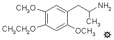

# 122 [MEM](/药物/MEM.md)

[上一个](/文档/PiHKAL/pihkal121.md) [返回](/文档/PiHKAL/index.md) [下一个](/文档/PiHKAL/pihkal123.md)

**2,5-二甲氧基-4-乙氧基苯丙胺**

|  |
| --- |

**合成：** 将 83 g 波旁醛（bourbonal，也称为乙基香兰素，或香兰醛，或简称 3-乙氧基-4-羟基苯甲醛）溶于 500 mL 甲醇的溶液，用 31.5 g KOH 颗粒（85% 纯度）溶于 250 mL H2O 的溶液处理。然后加入 71 g 碘甲烷，混合物在回流条件下保持 3 小时。全部加入 3 倍体积的 H2O 中，并加入 25% NaOH 使其呈碱性。水相用 5x200 mL CH2Cl2 萃取。合并这些萃取液并在真空下除去溶剂，得到 85.5 g 产物 3-乙氧基-4-甲氧基苯甲醛残留物，熔点为 52-53 °C。当该产物从正己烷中重结晶时，其熔点为 49-50 °C。当使用相同的反应物在相当无水的环境中使用甲醇 KOH 进行反应时，主要产物是缩醛，3-乙氧基-α,α,4-三甲氧基甲苯。这是一种白色闪光产物，很容易从正己烷中结晶，熔点为 44-45 °C。酸水解将其转化为上述正确的醛。在甲基化过程中加入足够的水完全避免了这种副产物。将 1.0 g 该醛和 0.7 g 丙二腈溶于 20 mL 温热无水乙醇的溶液，当用几滴三乙胺处理时，立即呈现黄色，并在几分钟后形成晶体。过滤并用乙醇洗涤，得到亮黄色 3-乙氧基-4-甲氧基苯亚甲基丙二腈晶体，熔点为 141-142 °C。

将 125.4 g 3-乙氧基-4-甲氧基苯甲醛在 445 mL 乙酸中的充分搅拌溶液用 158 g 40% 过氧乙酸（在乙酸中）处理，添加速率控制在冰冷却下内部温度不超过 27 °C。添加大约需要 45 分钟。然后将反应混合物倒入约 3 L H2O 中。生成了一些晶体，通过过滤除去。保留母液。固体物质在湿润时重 70 g，是粗甲酸酯。少量从环己烷中重结晶两次，提供熔点为 63-64 °C 的 3-乙氧基-4-甲氧基苯基甲酸酯参考样品。大部分这种粗甲酸酯溶于 200 mL 浓 HCl 中，得到深紫色溶液。用水淬灭，沉淀出蓬松的棕褐色固体，即水合酚类产物，重约 35 g，熔点在 80-90 °C 范围内。上述过滤的母液用 Na2CO3 中和，然后用 3x100 mL Et2O 萃取。除去溶剂得到约 80 g 残留物，是不纯的甲酸酯（含有一些未氧化的醛）。向其中加入 500 mL 10% NaOH，深色混合物在蒸汽浴上加热数小时。冷却后，强碱性溶液用 CH2Cl2 洗涤，然后用 200 mL Et2O 处理，这会析出一种沉重的半固体块，该块在两相中基本上都不溶。这又是粗制的水合酚。Et2O 相蒸发后得到第三批固体。这些实际上可以从甲醇/H2O 中重结晶，但熔点始终很宽。当置于蒸馏条件下时，H2O 最终被从水合物中赶出，产物 3-乙氧基-4-甲氧基苯酚在 0.8 mm/Hg 下于 180-190 °C 作为澄清油状物蒸馏出来。该产物 45.1 g，给出了良好的 NMR 光谱，在稀 CCl4 中显示出位于 3620 cm-1 的单一 OH 谱带，支持芳环上的 OH 基团未与相邻氧原子缔合。试图在 D2O 中获得 NMR 光谱立即形成了不溶性水合物。这种酚可用作 MEM（见下文）或 EEM（见单独配方）的起始原料。

向 12.3 g 3-乙氧基-4-甲氧基苯酚溶于 20 mL 甲醇的溶液中，加入 4.8 g 片状 KOH 溶于 100 mL 热甲醇的溶液。向该澄清溶液中加入 10.7 g 碘甲烷，混合物在蒸汽浴上回流 2 小时。然后将其倒入 3 倍体积 H2O 中，用 10% NaOH 调至强碱性，并用 3x100 mL CH2Cl2 萃取。在真空下从合并的萃取液中除去溶剂，得到 9.4 g 琥珀色油状物，其自发结晶。1,4-二甲氧基-2-乙氧基苯的熔点为 42-43.5 °C，无需进一步纯化即可用于下一步。

将 17.3 g N-甲基甲酰苯胺和 19.6 g 三氯氧磷的混合物静置 0.5 小时，产生深紫红色。向其中加入 9.2 g 1,4-二甲氧基-2-乙氧基苯，混合物在蒸汽浴上保持 2 小时。然后将其倒在碎冰上，在机械搅拌下，深色油相缓慢变得越来越结晶。最终通过过滤除去，提供棕色固体垫，显示熔点为 103.5-106.5 °C。全部溶于 75 mL 沸腾甲醇中，冷却后析出 2,5-二甲氧基-4-乙氧基苯甲醛的细小晶体，呈浅棕褐色，风干至恒重后重 8.5 g，熔点为 108-109.5 °C。通过气相色谱法寻找理论上可能的另外两种位置异构体的证据，但未发现。NMR 光谱显示两个对位质子为干净的单峰，没有暗示其他异构体的噪音。GC 显示单一峰（对于重结晶产物），但母液显示有污染，证明是 N-甲基甲酰苯胺。将 0.3 g 样品与 0.3 g 丙二腈一起溶于 10 mL 温热无水乙醇中，并用一滴三乙胺处理。立即形成黄色，随后在 1 分钟内析出细小的黄色针状晶体。过滤和风干得到 0.25 g 2,5-二甲氧基-4-乙氧基苯亚甲基丙二腈，熔点为 171-172 °C。

将 7.3 g 2,5-二甲氧基-4-乙氧基苯甲醛溶于 25 g 冰乙酸的溶液，用 3.6 g 硝基乙烷和 2.25 g 无水乙酸铵处理，并在蒸汽浴上加热。两小时后，澄清溶液用等体积的 H2O 稀释，并在冰桶中冷却。形成大量橙色晶体，通过过滤除去。1-(2,5-二甲氧基-4-乙氧基苯基)-2-硝基丙烯的干重为 4.8 g，熔点为 120-124 °C。分析样品从甲醇中重结晶后的熔点为 128-129 °C。分析 (C13H17NO5) C,H。

在 He 气氛下，向 3.3 g LAH 在 400 mL 无水 Et2O 中的温和回流悬浮液中，通过让冷凝的 Et2O 滴入含有硝基苯乙烯的分流索氏提取器装置中，加入 4.3 g 1-(2,5-二甲氧基-4-乙氧基)-2-硝基丙烯，从而有效地将其温热饱和乙醚溶液加入氢化物混合物中。添加耗时 2 小时。保持回流 5 小时，然后用外部冰浴将反应混合物冷却至 0 °C。通过小心加入 300 mL 1.5 N H2SO4 破坏过量的氢化物。当水层和 Et2O 层最终变澄清时，将它们分离，将 100 g 酒石酸钾钠溶于水相部分。然后加入 NaOH 水溶液直至 pH >9，然后用 3x100 mL CH2Cl2 萃取。从合并的萃取液中蒸发溶剂产生几乎白色的油状物，将其溶于 100 mL 无水 Et2O 并通入无水 HCl 气体至饱和。析出 2,5-二甲氧基-4-乙氧基苯丙胺盐酸盐 (MEM) 的白色结晶固体，重 3.1 g，熔点为 171-172.5 °C。分析 (C13H22ClNO3) C,H,N。

**给药剂量：** 20 - 50 mg。

**药效时长：** 10 - 14 小时。

**定性评论：** （服用 20 mg）我感到有些身体不适，但这不正是告诉我们要做的功课，而不是材料的属性吗？我的突破是在第二天（这似乎是 MEM 的运作方式，即先是能量和扩展，第二天是洞察力），这对我有最高的价值和重要性。我得到了一种处理我阴暗面的方法。这可不是小礼物。我独自完成了这一切，结果立竿见影。我非常感激。

（服用 20 mg，在服用 120 mg MDMA 后 1.5 小时）过渡非常平滑，没有明显的 MDMA 体验缺失。我觉得没那么需要说话，但与他人的亲密感得以保持。体验继续变得更加深刻和欣快，在下午的后半段，我祈祷它不要停止。它一直持续到午夜，伴随着美妙的感觉、良好的能量和许多欢笑。在接下来的几天里，它几乎没有减弱，留给我一种持久改变的感觉，一周后仍有重要的见解浮现在脑海中。

（服用 25 mg，在服用 120 mg MDMA 后 2 小时）我发现一般的声音都很让人分心。不，它们彻头彻尾地让人恼火。我可能处于一种内省的情绪中，但我真的想独自一人。完全没有身体问题。感觉很好。我产生了一些颜色变化和一些图案移动。不多，但我也没有怎么探索它。之后的酒会当然非常愉快。汤是一大乐趣。那硬面包很好吃。这种材料显然不会引起厌食，或者至少我克服了可能存在的任何厌食症。

（服用 30 mg）我在三十分钟内意识到了这一点，并在接下来的一小时内从那里缓慢发展到几乎 [+++](shulgin_rating_scale.shtml)。有视觉现象，有一些颜色增强，尤其是明亮和黑暗部分的显著增强。衰退的最初迹象出现在大约六小时，但在又过了六小时后，仍有一些东西在起作用。确实是缓慢的衰退。

（服用 50 mg）进入体验时我知道昨天是非常疲惫和紧张的一天。我在前十分钟内就感觉到了这种材料，这是我感觉过的最快的。上升很快，在第一个小时里，我倾向于带有明显感官色彩的向内幻想。有一种持续的恶心感从未离开过我，它与一种良好的向外表达和清晰感形成了奇怪的对比，后者在内向的第一个小时后成功地占据了主导地位。睡眠很困难，但第二天平静而清晰。

（服用 50 mg）能量充沛，最好投入到活动中。清晰的成像，思考。强烈而宁静。愉悦感和一些欣快感。我感到需要保持移动。很难静止不动。

（分两部分服用 70 mg）40 毫克的效果被昨天早上的另一次药物实验所减弱，我从未超过 +1。有一种色情的性质，触觉敏感度也许不像 [2C-B](/药物/2C-B.md) 那样细腻，但它确实存在。在 2 小时点，额外 30 毫克增加了身体冲击（明显的震颤和敏感），但不知何故精神上没有增加多少。我被昨天的事妥协了。

**延伸和评论：** MEM 既是一种有价值且具有戏剧性的化合物，也是一种发挥了分水岭作用的药物。所有可能的三甲氧基苯丙胺（TMA 类）的完成表明，其中只有两种结合了积极迷幻效果的可靠性和相当高的效力。TMA-2 和 TMA-6 都是珍宝，都在相似的剂量下具有活性，并且都提供了乞求被其他东西取代的甲氧基。最初的焦点在 TMA-2 上，部分原因是所需的合成化学更为人所知，部分原因是我较早发现了它的活性。但在 TMA-2 中有三个完全不同且独特的甲氧基可供研究。一个在 2-位，一个在 4-位，一个在 5-位。似乎最明显的事情是让它们每一个都加长一个碳原子。用乙氧基代替甲氧基。顺着环从 2-位到 4-位再到 5-位，可以遵循使用 M 代表甲氧基，E 代表乙氧基的逻辑命名模式。那么，首先要比较的一组将是 EMM、MEM 和 MME。在这三者中，只有 MEM 在戏剧性和效力方面名列前茅。但是，当这一点变得明显时，我已经完成了二乙氧基可能性（EEM、EME 和 MEE）以及三乙氧基同系物 EEE。随着发现 4-位是神奇的杠杆点，并且 2-位和 5-位的同系物显然不那么有趣，所有的重点都指向了这个目标，这导致了许多 4-取代家族的出现，这些家族现在已知具有高效力，并被许多人认为具有个人价值。

经常有人问我，为什么要如此强调效力？只要有效水平远低于其中毒水平，服用多少化合物又有什么关系呢？好吧，从某种意义上说，这就是原因所在。没有任何指南说明这些化合物中任何一种在人体内的实际中毒水平可能是多少。根本没有办法确定这一点。只有少数几种在动物身上进行了 LD-50 水平的探索。它们中的大多数彼此相似，即在小鼠中具有相对较低的毒性，而在大鼠中具有相对较高的毒性。但这种毒性似乎与人的效力无关。因此，如果人们可以推断它们对人类的风险（从毒性角度来看）大致相同，那么剂量越低，安全性就越高。也许吧。在没有任何事实依据的情况下，这是一个合理的操作假设。

许多关于 MEM 效果的报告都是在不久前服用了有效剂量的 MDMA 的实验中得出的。许多研究人员已经形成了一个概念，即通常随 MDMA 体验发展而来的轻松和安静可以减轻其他迷幻药有时会出现的一些令人不安的身体症状。这可能部分归因于熟悉地进入一个改变的地方，部分归因于通常完全起效所需的剂量减少。与其他许多迷幻药相比，MEM 似乎有更多的试验使用了这种组合。

---

[上一个](/文档/PiHKAL/pihkal121.md) [返回](/文档/PiHKAL/index.md) [下一个](/文档/PiHKAL/pihkal123.md)