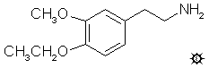

[上一个](/文档/PiHKAL/pihkal122.md) [返回](/文档/PiHKAL/index.md) [下一个](/文档/PiHKAL/pihkal124.md)

# 123 [MEPEA](/药物/MEPEA.md)

**3-甲氧基-4-乙氧基苯乙胺**

|  |
| --- |

**合成：** 将 10.0 g 3-甲氧基-4-乙氧基苯甲醛溶于 150 mL 硝基甲烷的溶液用 1.7 g 无水乙酸铵处理，并在蒸汽浴上加热 1 小时。在真空下除去过量的硝基甲烷，产生松散的黄色结晶块，过滤并用冷甲醇适度洗涤。将由此获得的 8.0 g 湿润黄色晶体溶于 50 mL 剧烈沸腾的乙腈中，从少量不溶物（可能是乙酸铵残留物）中倾析出来，并在冰浴中冷却。过滤除去由此获得的晶体，用 2x5 mL 冷乙腈洗涤，并风干至恒重。4-乙氧基-3-甲氧基-β-硝基苯乙烯的产量为 6.3 g 美丽的黄色晶体。

在 He 气氛下，用外部冰浴将 2.3 g LAH 在 70 mL 无水 THF 中的溶液冷却至 0 °C。在充分搅拌下逐滴加入 2.3 mL 100% H2SO4，以尽量减少炭化。随后加入 6.2 g 3-乙氧基-4-甲氧基-β-硝基苯乙烯在无水 THF 中的溶液。再搅拌几分钟后，在蒸汽浴上将温度升至温和回流，然后再次将全部冷却至 0 °C。通过小心加入异丙醇，随后加入足够的 10% NaOH 来破坏过量的氢化物，使氧化物呈现白色颗粒状，并确保反应混合物呈碱性。过滤反应混合物，并用 THF 充分洗涤滤饼。合并滤液和洗涤液，并在真空下除去溶剂。残留物溶于稀 H2SO4 中。用 2x75 mL CH2Cl2 洗涤，除去残留的黄色。剩余的水相用 NaOH 碱化，并用 3x75 mL CH2Cl2 萃取。合并这些萃取液并在真空下除去溶剂。残留物在 108-115 °C、0.4 mm/Hg 下蒸馏，得到 4.2 g 流动的无色液体。将其溶于 12 mL 异丙醇中，用 60 滴浓 HCl 中和，并用 100 mL 无水 Et2O 稀释。析出细小的白色结晶产物，通过过滤、乙醚洗涤和风干除去后，得到 3.8 g 3-甲氧基-4-乙氧基苯乙胺盐酸盐 (MEPEA)。

**给药剂量：** 300 mg 或更高。

**药效时长：** 短。

**定性评论：** （服用 120 mg）我大概处于 [+1](shulgin_rating_scale.shtml)，一种非常轻微的轻盈感，完全没有任何身体意识。再过一个小时，我又完全回到了基线。

（服用 300 mg）发生的任何变化都在一小时结束时完成了。效果非常安静，非常愉快，非常轻微。这里没有任何迷幻的东西，而是一种温和的情绪提升。没有感官增强或其他预期的变化。

**延伸和评论：** 这是极少数只有两个取代基却显示出即使是一丝中枢活性的苯乙胺之一。还有一个有趣的故事。我接到了一个完全不认识的人打来的电话，他叫 Stanislov Wistupkin，说他发现了一些新的迷幻药，想和我分享。其中两个是简单的苯乙胺，一个在 4-位有一个乙氧基，另一个在那里有一个烯丙氧基。他说，两者都是情绪提升剂，活性在 100 到 300 毫克之间。其中一个是这种材料，这里称为 MEPEA，另一个是 3-甲氧基-4-烯丙氧基苯乙胺，或 MAPEA。当我亲自见到他时，他给了我一份非常了不起的出版物，这是大约十年前由一个名叫 Leminger 的人撰写的，此人现已去世。全是捷克语，但毫无疑问，就在第三页上，有 MEPEA 和 MAPEA 的结构，并声明它们在 100 到 300 毫克之间具有活性。我还没有制造烯丙氧基化合物，但我觉得它也可能是一种类似于乙氧基的温和情绪提升剂。

这些材料最吸引人的延伸将是苯丙胺衍生物，即具有 3-甲氧基和 4-位上某种小而简洁基团的东西。MEPEA 和 MAPEA 的直接类似物将是 3-甲氧基-4-乙氧基-（和 3-甲氧基-4-烯丙氧基）-苯丙胺。同样有趣的还有 4-羟基类似物。这将是一种很容易从香兰素制得的化合物，香兰素是我们厨房橱柜中最令人愉快的香料之一，它与精油丁香酚和异丁香酚直接相关。这种苯丙胺化合物已经被合成，但在人体中仍未被探索。

几年前，意大利的法医文献中出现了一份报告，称查获了一个小的半透明胶囊，内含 141 毫克白色粉末，据称是一种新型致幻药物。这被证明含有 DOM 的类似物，3-甲氧基-4-甲基苯丙胺，或 MMA。意大利当局没有提及每个剂量单位所含的净重，但已发现 MMA 在人体内的活性水平在 40-60 毫克范围内。该化合物显然可能非常令人烦躁，且药效持久。

在介绍 MEPEA 和 MAPEA 的捷克出版物中，还有关于 escaline (E)、proscaline (P) 和烯丙氧基类似物 (AL) 的描述。这些在人体内都有活性，并已在其他地方记录。这是我所能找到的唯一一份来自 Otakar Leminger 实验室的关于迷幻药物的出版资料。这位化学家是什么样的人？他在工业界工作多年，直到退休时才发表了这个小小的瑰宝。他住在乌斯季 (Usti)，位于布拉格正北方的拉贝河 (Labe) 畔（这条河一进入德国就被称为更著名的易北河 (Elbe)）。是否还有他发现但从未发表的其他珍宝？年轻的 Wistupkin 是他的学生吗？在捷克北部某个农舍的阁楼里，是否还有未被发现的 Otakar Leminger 的笔记？我向迷幻药物领域一位几乎不为人知的探索者致以衷心的敬意。

---

[上一个](/文档/PiHKAL/pihkal122.md) [返回](/文档/PiHKAL/index.md) [下一个](/文档/PiHKAL/pihkal124.md)