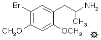

# 124 [META-DOB](/药物/META-DOB.md)

[上一个](/文档/PiHKAL/pihkal123.md) [返回](/文档/PiHKAL/index.md) [下一个](/文档/PiHKAL/pihkal125.md)

**5-溴-2,4-二甲氧基苯丙胺**

|  |
| --- |

**合成：** 2,4-二甲氧基苯丙胺 ([2,4-DMA](/药物/2,4-DMA.md)) 与单质溴的反应直接生成 5-溴-2,4-二甲氧基苯丙胺，其以氢溴酸盐形式分离，熔点为 204.5-205.5 °C，产率为 67%。已发表的熔点也有 180-181 °C。

**给药剂量：** 50 - 100 mg。

**药效时长：** 5 - 6 小时。

**延伸和评论：** 可用的合成信息非常少，而且其中一些是相互矛盾的。医学文献中的最初人体报告仅称，约 100 毫克的剂量产生的效果与 MDA 产生的效果相似。该化合物的原创者在最近的出版物中修改了体验的质量和化合物的效力。40 毫克的剂量，在经过一小时的诱导期后，产生了一种模糊的不安，最初被解释为阈值迷幻效果。在 60 到 90 毫克的剂量范围内，产生了焦虑感和偏执幻想，以及明显的毒性迹象，如潮红、心悸以及偶尔的恶心、呕吐和腹泻。任何迷幻效果似乎都被药物更明显的毒性作用所掩盖。有人告诉我，他们的最终结论是该药物在 50 至 60 毫克范围内似乎有毒。我没有亲自探索过 DOB 的这种位置异构体。

溴在邻位的 DOB 位置异构体是 4,5-二甲氧基-2-溴苯丙胺，毫不奇怪地被称为 ORTHO-DOB。它是由 2-溴-4,5-二甲氧基苯甲醛与硝基乙烷缩合得到熔点为 105-106 °C 的 1-(2-溴-4,5-二甲氧基苯基)-2-硝基丙烯制成的。还原成苯丙胺必须在低温下进行，并且仅使用等摩尔量的氢化铝锂，以尽量减少溴基团的还原去除。2-溴-4,5-二甲氧基苯丙胺 (ORTHO-DOB) 的盐酸盐熔点为 214-215.5 °C，氢溴酸盐熔点为 196-197 °C 或 210 °C。两者均有报道。从 [3,4-DMA](/药物/3,4-DMA.md) 直接溴化的产率显然非常糟糕。我不认为该化合物曾进入人体试验。

还有另外三种已知的二甲氧基苯丙胺异构体，每一种都在化学上探索了其与单质溴的反应性。对于 2,3-DMA，形成了 5-Br-2,3-DMA 和 6-Br-2,3-DMA 的混合物；对于 2,6-DMA，形成了 3-Br-2,6-DMA；对于 3,5-DMA，产生了 2-Br-3,5-DMA 和 2,6-二溴产物的混合物。[2,5-DMA](/药物/2,5-DMA.md) 的溴化当然是合成 4-Br-2,5-DMA 或 DOB 的首选程序，参见 DOB。这些位置异构体均未曾进入人体试验，但 3-Br-2,6-DMA 和碘代对应物已被探索作为潜在的放射性氟载体进入大脑。这都在 [3,4-DMA](/药物/3,4-DMA.md) 配方中进行了讨论。

---

[上一个](/文档/PiHKAL/pihkal123.md) [返回](/文档/PiHKAL/index.md) [下一个](/文档/PiHKAL/pihkal125.md)