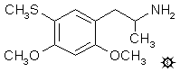

[上一个](/文档/PiHKAL/pihkal124.md) [返回](/文档/PiHKAL/index.md) [下一个](/文档/PiHKAL/pihkal126.md)

# 125 [META-DOT](/药物/META-DOT.md)

**2,4-二甲氧基-5-甲硫基苯丙胺**

|  |
| --- |

**合成：** 向搅拌良好的 27 g 1,3-二甲氧基苯中，在 15 分钟内逐滴加入 29 g 浓 H2SO4。继续搅拌 1 小时，然后将混合物缓慢倒入 250 mL 饱和 K2CO3 水溶液中。过滤除去形成的沉淀，并在 125 °C 下干燥，得到 59.6 g 粗制 2,4-二甲氧基苯磺酸钾。将其研细，取 30 g 用 35 g 三氯氧磷处理，混合物在蒸汽浴上加热 2 小时。冷却至室温，然后倒在 300 mL 碎冰上。全部融化后，用 2x150 mL Et2O 萃取。合并萃取液，用饱和盐水洗涤，在真空下除去溶剂得到残留物，该残留物固化。由此获得 14.2 g 2,4-二甲氧基苯磺酰氯，为白色固体，熔点为 69-72 °C。取一小部分与浓氢氧化铵一起加热得到相应的磺酰胺，从乙醇中重结晶后，产生白色针状晶体，熔点为 165.5-166.5 °C。

向搅拌并温和回流的 11 g LAH 在 750 mL 无水 Et2O 中的悬浮液中，加入 13.2 g 2,4-二甲氧基苯磺酰氯的 Et2O 溶液。保持回流 48 小时，然后用冰水外部冷却，通过缓慢加入 600 mL 10% H2SO4 破坏过量的氢化物。分离各相，水相用 2x200 Et2O 萃取。合并有机相，用 200 mL H2O 洗涤一次，并在真空下除去溶剂。通过加入并随后除去 CH2Cl2 对残留物进行共沸干燥。蒸馏残留物得到 8.0 g 2,4-二甲氧基苯硫酚，为无色油状物，在 0.5 mm/Hg 下沸点为 89-92 °C。

向 7.8 g 2,4-二甲氧基苯硫酚溶于 40 mL 无水乙醇的溶液中，加入 4 g 85% KOH 溶于 65 mL 乙醇的溶液。随后加入 5 mL 碘甲烷，混合物保持回流 30 分钟。将其倒入 200 mL H2O 中，并用 3x50 mL Et2O 萃取。合并的萃取液用连二亚硫酸钠水溶液洗涤一次，然后在真空下除去有机溶剂。蒸馏残留物得到 8.0 g 2,4-二甲氧基硫代苯甲醚，为无色油状物，在 0.6 mm/Hg 下沸点为 100-103 °C。

向已在蒸汽浴上短暂加热的 15 g 三氯氧磷和 14 g N-甲基甲酰苯胺的混合物中加入 7.8 g 2,4-二甲氧基硫代苯甲醚。反应在蒸汽浴上再加热 20 分钟，然后倒入 200 mL H2O 中。继续搅拌直至不溶物变得完全松散且呈颗粒状。过滤除去这些物质，用水洗涤，尽可能吸干，然后从沸腾的甲醇中重结晶。产物 2,4-二甲氧基-5-(甲硫基)苯甲醛为灰白色固体，重 8.6 g。它可以以两种多晶型形式中的任何一种获得，这取决于晶体出现时醛在甲醇中的浓度。一种熔点为 109-110 °C，其指纹红外光谱包括 691、734、819 和 994 cm-1 处的峰。另一种熔点为 124.5-125.5 °C，主要指纹峰位于 694、731、839 和 897 cm-1。分析 (C10H12O3S) C,H。

将 8.2 g 2,4-二甲氧基-5-(甲硫基)苯甲醛溶于 30 mL 硝基乙烷的溶液用 1.8 g 无水乙酸铵处理，并在蒸汽浴上加热 4 小时。在真空下除去过量的硝基乙烷得到有色残留物，用甲醇稀释后结晶。粗产物从沸腾乙醇中重结晶，过滤、洗涤并风干至恒重后，得到 8.3 g 1-(2,4-二甲氧基-5-甲硫基苯基)-2-硝基丙烯，熔点为 112-113 °C。分析 (C12H15NO4S) C,H,N。

将 6.5 g LAH 在 250 mL 无水 THF 中的悬浮液置于 N2 气氛下，磁力搅拌并加热至回流。逐滴加入 8.0 g 1-(2,4-二甲氧基-5-甲硫基苯基)-2-硝基丙烯溶于 50 mL THF 的溶液。反应混合物保持回流 18 小时。恢复至室温后，通过加入 6.5 mL H2O 溶于 30 mL THF 的溶液来破坏过量的氢化物。然后加入 6.5 mL 3N NaOH，随后再加入 20 mL H2O。过滤除去松散的白色无机盐，滤饼用额外的 50 mL THF 洗涤。合并滤液和洗涤液，在真空下除去溶剂，得到残留物进行蒸馏。游离碱在 0.1 mm/Hg 下沸点为 125-128 °C，为白色油状物，静置后固化。它重 5.1 g，熔点为 47-48.5 °C。将其溶于 50 mL 异丙醇中，用浓 HCl 中和（直到润湿的通用 pH 试纸显示深红色），并用无水 Et2O 稀释至浑浊点。发生自发结晶，过滤、用 Et2O 洗涤并风干后，得到 2,4-二甲氧基-5-甲硫基苯丙胺盐酸盐 (META-DOT)，熔点为 140.5-142 °C。分析 (C12H20ClNO2S) C,H,N。

**给药剂量：** 大于 35 mg。

**药效时长：** 未知。

**定性评论：** （服用 35 mg）整个下午都有一种模糊的意识，这种东西可能被称为一种稀薄感。可能有一些短暂的心血管刺激，但没有什么完全可信的。这充其量只是一个阈值水平。

**延伸和评论：** 同样，正如对 ORTHO-DOT 的研究一样，META-DOT 的活性显然将远低于这些异构体中最有趣的 PARA-DOT（ALEPH-1，或简称 ALEPH）。在直肠高温测定法中（该方法通过观察化合物对实验动物体温的影响并与已知迷幻药进行比较来计算化合物的迷幻潜力），将三种 DOT 与 DOM 进行了比较。结果与在人体中发现的活性（或活性丧失）一致。PARA-DOT 的活性约为 DOM 的一半，但 ORTHO-DOT 和此处描述的化合物 META-DOT 的活性分别下降了 50 倍和 30 倍。这些动物研究似乎确实给出了与其他已知迷幻药物相符的合理结果，因为麦司卡林的效力比 DOM 低 1000 多倍，而 LSD 的效力比 DOM 高约 33 倍。

我对这种兔子直肠高温测定法持某种怀疑态度。据推测，人们可以通过体温升高的曲线来判断一种化合物是兴奋剂还是迷幻药，并通过体温升高的程度来判断其效力。但是，将热电偶推入受束缚兔子的后端这一概念不知何故并不吸引我。我宁愿通过人体研究来确定这两个参数。

---

[上一个](/文档/PiHKAL/pihkal124.md) [返回](/文档/PiHKAL/index.md) [下一个](/文档/PiHKAL/pihkal126.md)