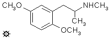

[上一个](/文档/PiHKAL/pihkal125.md) [返回](/文档/PiHKAL/index.md) [下一个](/文档/PiHKAL/pihkal127.md)

# 126 [METHYL-DMA](/药物/METHYL-DMA.md)

**DMMA；2,5-二甲氧基-N-甲基苯丙胺**

|  |
| --- |

**合成：** 向搅拌的 28.6 g 甲胺盐酸盐溶于 120 mL 甲醇的溶液中，加入 7.8 g 2,5-二甲氧基苯基丙酮，随后加入 2.6 g 氰基硼氢化钠。根据需要加入 HCl 以保持 pH 值约为 6。反应在 24 小时内完成，但允许再搅拌 3 天。将反应混合物倒入 600 mL H2O 中，用 HCl 酸化（HCN 释放，小心），并用 3x100 mL CH2Cl2 洗涤。加入 NaOH 水溶液，使溶液呈强碱性，然后用 3x100 mL CH2Cl2 萃取。在真空下从合并的萃取液中除去溶剂，得到 8.3 g 澄清的灰白色油状物，在 0.25 mm/Hg 下于 95-105 °C 蒸馏。将 6.5 g 无色馏分溶于 25 mL 异丙醇中，用浓 HCl 中和，然后用无水 Et2O 稀释至浑浊点。随着晶体形成，分小批加入额外的 Et2O，每次添加之间允许澄清结晶。总共使用了 200 mL Et2O。过滤、Et2O 洗涤并风干后，得到 6.2 g 2,5-二甲氧基-N-甲基苯丙胺盐酸盐 (METHYL-DMA)，为细小的白色晶体，熔点为 117-118 °C。与 [2,5-DMA](/药物/2,5-DMA.md)（114-116 °C）的混合熔点降低至 96-105 °C。另一种合成方法给出了相同总产率的相同产物，但从 [2,5-DMA](/药物/2,5-DMA.md) 开始。它需要两个合成步骤。游离碱胺在苯中使用迪安-斯塔克分水器与甲酸转化为结晶甲酰胺，该中间体用 LAH 还原为 METHYL-MDA。

**给药剂量：** 250 mg 以上。

**药效时长：** 未知。

**定性评论：** （服用 250 mg）大约 45 分钟时有轻微的感觉异常，皮肤表面有一种意识，好像被冷风吹过。但仅此而已。三个小时后，如果我曾经进入过状态的话，现在我已经完全退出了。晚上我测试了 120 毫克的 MDMA，它几乎没有产生阈值效应，所以这两种材料可能相互拮抗。

**延伸和评论：** 这是一个很难在药物选集中归类的化合物。出于某种原因，它引起了几位独立的、安静的研究人员的兴趣，多年来我收集了一些有趣的报告。一个人告诉我，他在高达 60 毫克的剂量下什么也没感觉到。另一个人在 50 毫克时发现了阈值，并在 150 和 200 毫克时都有完整而彻底的体验。还有一个人描述了两起涉及不同个体的事件，静脉注射 0.2 mg/Kg，大概是 15 或 20 毫克。两人都声称在几分钟内有了真正的意识，一人是生殖器刺痛，另一人是脊柱中有奇怪的存在感。两名受试者均报告体温和血压升高。据报道，这种影响被认为持续了许多小时。

一种药物的代谢物与另一种药物的结构趋同，这是一个有趣且可能具有启发性的现象。在 [4-MA](/药物/4-MA.md) 下，提到了一种广泛用于治疗哮喘和其他过敏性疾病的支气管扩张剂。这种化合物 2-甲氧基-N-甲基苯丙胺以通用名甲氧那明 (methoxyphenamine) 而闻名，还有各种商品名，其中 Orthoxine (Upjohn) 最为人所知。甲氧那明的典型剂量约为 100 毫克，每天可以使用几次。它显然不会引起血压变化，仅有轻微的心脏刺激。它在人体内的主要代谢物之一是在分子 5-位具有羟基的类似物。这种酚胺，5-羟基-2-甲氧基-N-甲基苯丙胺，与 METHYL-DMA 仅差一个甲基；它可以被甲基化以完成合成，或者 METHYL-DMA 可以去甲基化以形成这种酚。这两种反应在体内发生都有大量的先例。当显示出明显不同作用的药物原则上可以在单一结构上代谢相交时，这总是很有趣。人们不禁想知道那个共同中间体的药理学究竟是什么。

还有三种已知迷幻药的 N-甲基同系物值得一提，但实际上不值得单独列出配方。这是因为它们只进行了最粗略的测定，我是通过个人通信了解到的。这三种都是通过用 LAH 还原母体伯胺的甲酰胺合成的。METHYL-TMA（或 N-甲基-3,4,5-三甲氧基苯丙胺）在几次试验中最高达到 240 毫克，仅在这个最高水平提到了一些精神障碍。METHYL-TMA-2（或 N-甲基-2,4,5-三甲氧基苯丙胺）在高达 120 毫克的剂量下进行了试验，没有任何效果。METHYL-TMA-6（或 N-甲基-2,4,6-三甲氧基苯丙胺）在高达 30 毫克的剂量下进行了试验，显然也没有效果。这些是我从别人那里听到的报告，但我没有亲身经历过。我可以根据个人经验描述的那些都作为单独的配方列出。文献中已经制备和表征了许许多多其他的 N-甲基同系物，尚待品尝。然而，到目前为止，看到的唯一一致的事情是，随着 N-甲基化，迷幻药的效力降低，但兴奋剂的效力似乎保持得相当好。

---

[上一个](/文档/PiHKAL/pihkal125.md) [返回](/文档/PiHKAL/index.md) [下一个](/文档/PiHKAL/pihkal127.md)