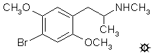

[上一个](/文档/PiHKAL/pihkal126.md) [返回](/文档/PiHKAL/index.md) [下一个](/文档/PiHKAL/pihkal128.md)

# 127 [METHYL-DOB](/药物/METHYL-DOB.md)

**4-溴-2,5-二甲氧基-N-甲基苯丙胺**

|  |
| --- |

**合成：** 向 6.0 g 2,5-二甲氧基-N-甲基-苯丙胺游离碱（参见 METHYL-DMA 下的配方）溶于 30 mL 冰乙酸的溶液中，在充分搅拌下逐滴加入 5.5 g 溴溶于 15 mL 乙酸的溶液。反应变得相当热，并变成深色。再搅拌 45 分钟后，将混合物倒入 200 mL H2O 中，并用少量连二亚硫酸钠处理，这使反应颜色变浅。加入 20 mL 浓 HCl，反应混合物用 2x100 mL CH2Cl2 洗涤，除去大部分颜色。水相用 25% NaOH 调至碱性，并用 3x100 mL CH2Cl2 萃取。在真空下从合并的萃取液中除去溶剂，得到 1.8 g 油状物，将其溶于 10 mL 异丙醇中，用浓 HCl 中和，并用 100 mL 无水 Et2O 稀释。未获得晶体，而是得到油状且有些颗粒状的不溶性下层相。倾析出 Et2O，残留物通过在 3x100 mL Et2O 下研磨进行洗涤。将最初倾析出的物质与三次洗涤液合并，并静置数小时。产物 4-溴-2,5-二甲氧基-N-甲基苯丙胺盐酸盐 (METHYL-DOB) 作为细小的白色晶体析出，过滤并风干后重 0.3 g，熔点为 149-150 °C。Et2O 不溶性残留物最终凝固成淡粉色块状物，在几毫升丙酮下研细。过滤和风干得到第二批产物，为 0.9 g 淡紫色固体，熔点为 143-145 °C。

**给药剂量：** 大于 8 mg。

**药效时长：** 可能相当长。

**定性评论：** （服用 8.0 mg）在一小时二十分钟时，我突然感到头晕目眩。一小时后，我必须说效果是真实的，而且总体上很好。我感到恍惚——没有什么有形的东西。再过几个小时，我仍然有意识。我的牙齿有些摩擦感，由于过去三个小时情况一直很稳定，这证明药效将是持久的。有很多身体效应可能在欺骗我，让我以为自己产生了一些精神效应。在第六个小时，我发现这几乎完全是身体上的。我的牙齿紧咬，身体普遍紧张，我的反射似乎被夸大了，瞳孔放大。所有这些迹象在第八个小时都有所减轻，并且不妨碍第十二个小时的睡眠。目前没有进一步尝试的欲望。精神 (+) 身体 (++)。第二天，有轻微的毒性残留印象。

（服用 10 mg）没有什么迷幻效果，但身体非常难受。第二天（24 小时后）我对 5 毫克的裸盖菇素产生了严重的反应。

**延伸和评论：** 上面提到的 10 毫克 METHYL-DOB 之后服用 5 毫克裸盖菇素，引发了一些有趣的推测。当两种迷幻药物服用间隔太近时，通常看到的模式是第二次体验的效果不如预期。这就是药理学中常见的耐受性。两次接触可能是同一种药物，也可能是两种通常具有某些共同特性的不同药物。就好像受体部位的精灵有点累了，需要一段时间来休息和恢复。当需要重复完全有效性时，使用者通常会增加所用药物的剂量。这是迷幻药领域的内置保护措施之一，即在一次体验之后，你必须等待一段时间才能消除已经产生的抗性。

衡量不同药物之间共享的耐受程度（称为交叉耐受）可用于估计其作用机制的相似性。换句话说，如果 A 和 B 被身体视为相似，那么正常有效剂量的 A 将使次日正常有效剂量的 B 比预期更弱。或者根本没有活性。B 对 A 也会起到同样的作用。如果两种药物在体内的作用方式不同，通常看不到交叉耐受。这在 MDMA 和 MDA 中已有描述，也是它们通过明显不同的机制起作用这一论点的基础。一个人连续几天使用被认为是有效剂量的 MDMA，就会对该药物失去所有反应。他对它的作用产生了耐受。但在对 MDMA 完全耐受时接触有效剂量的 MDA，却对 MDA 产生了正常反应。这些药物没有交叉耐受性，身体将它们识别为不同的个体。

但是，一种药物促进或夸大另一种药物的效果被称为增强作用 (potentiation)，这可能是大脑或身体内发生动态变化的线索。在这里，虽然承认只有一份报告，但 METHYL-DOB 不知何故使受试者对相当低剂量的裸盖菇素变得敏感。但我从各处听说过其他类似的报告。有人告诉我一个实验，使用 DOM 的右旋异构体（这是无活性的光学异构体），其水平毫不奇怪地没有任何影响。第二天，研究人员对所谓的“劣质”大麻产生了严重反应。在 TOMSO 的配方下评论了类似的增强形式，其中一种无活性药物和极少量的酒精加在一起产生了意想不到的强烈中毒。但请注意，在这些案例中的每一个，都是苯乙胺与非苯乙胺相互作用（裸盖菇素是吲哚，大麻是非生物碱萜烯类物质，酒精就是酒精）。

关于 METHYL-DOB 的底线是，与其他 N-甲基化迷幻药一样，它的效力大大降低，可能不值得追求。

---

[上一个](/文档/PiHKAL/pihkal126.md) [返回](/文档/PiHKAL/index.md) [下一个](/文档/PiHKAL/pihkal128.md)