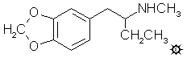

# 128 [METHYL-J](/药物/METHYL-J.md)

[上一个](/文档/PiHKAL/pihkal127.md) [返回](/文档/PiHKAL/index.md) [下一个](/文档/PiHKAL/pihkal129.md)

**MBDB；EDEN；2-甲氨基-1-(3,4-亚甲二氧基苯基)丁烷；N-甲基-1-(1,3-苯并二氧杂环戊烯-5-基)-2-丁胺**

|  |
| --- |

**合成：** 将 0.12 g 氯化汞溶于 180 mL H2O 的溶液加入到 5 g 切成 1 英寸方块的铝箔中，汞齐化进行 0.5 小时。倾析出灰色的浑浊水相，所得铝用 2x200 mL H2O 洗涤。尽可能摇干后，依次加入 7.6 g 甲胺盐酸盐溶于等重量 H2O 的溶液、23 mL 异丙醇、18.3 mL 25% NaOH、6.72 g 1-(3,4-亚甲二氧基苯基)-2-丁酮（其制备见 J 的配方），最后加入 44 mL 额外的异丙醇。偶尔摇动混合物，并根据需要进行外部冷却，以保持温度低于 50 °C。还原完成后（没有残留金属铝，只有灰色污泥），过滤并用甲醇洗涤残留物。合并滤液和洗涤液，在真空下除去有机挥发物，残留物用 100 mL Et2O 处理，并用 2x50 mL 3 N HCl 萃取。合并的水提取液用 3x100 mL CH2Cl2 洗涤后，用过量的 25% NaOH 碱化，并用 5x50 mL CH2Cl2 萃取。用无水 MgSO4 干燥这些萃取液并除去溶剂，得到残留物，在 88 °C、0.08 mm/Hg 下蒸馏，得到无色油状物，将其溶于异丙醇并用浓 HCl 中和。过滤除去析出的固体，用 Et2O 洗涤并风干，得到 6.07 g 2-甲氨基-1-(3,4-亚甲二氧基苯基)丁烷盐酸盐 (METHYL-J 或 MBDB)，为白色晶体，熔点为 156 °C。分析 (C12H18ClNO2) C,H,N。在甲醇中使用氰基硼氢化钠，用甲胺盐酸盐对丁酮进行还原胺化，得到了相同的产物，但产率较低。

**给药剂量：** 180 - 210 mg。

**药效时长：** 4 - 6 小时。

**定性评论：** （服用 210 mg）总体来说非常、非常友好，非常安静的效果。我可以轻松阅读，但看大多数书里的图片相对没有意义。有明显的减压效果，以至于真的太麻烦而不愿着手做任何事情。就是没有动力，但这甚至都不让人感到困扰。我喜欢它吗？是的，非常喜欢。不过感觉我才刚刚开始探索它。我会考虑在治疗中使用这种材料吗？嗯，当然，值得一试。减压效果会很好，在某些方面比 MDMA 更好，但在治疗环境中，共情和直觉水平仍有待探索。我觉得它们可能稍微低一些。

（服用 210 mg）起效迅速。20 分钟警觉，30 到 35 分钟达到 [+2.5](shulgin_rating_scale.shtml)。没有身体症状，即咬牙、没有胃部问题。良好的视觉增强；睁眼——鲜艳的色彩——闭眼没有视觉效果。没有我在 MDMA 中得到的（并享受的）“静默之锥”，否则如果我盲测，我不确定我能否分辨出是哪一种。

（服用 210 mg 和 50 mg 补充剂）味道极其糟糕。怀疑我在 5 分钟内得到某种类型的警报（我在 MDMA 中经常很快得到），在 30 分钟时，相当突然地发展出全面的兴奋感。很难描述这种兴奋。我怀疑是缺乏描述这种现象的语言。我会将其描述为有点像酒精兴奋，但没有混乱、口齿不清、蹒跚等致残的副作用。兴奋感从未比那个 30 分钟的点更强烈，并且在一小时后明显下降，我服用了 50 mg 补充剂。我享受这种兴奋。我对这种材料感到放松。然而，它似乎没有 MDMA 相同的品质，因为它不那么刺激，而且几乎没有视觉活动。我和别人交谈，但发现很容易躺下来放松。最后有一些下巴紧咬，在高峰期我有相当大的眼球震颤，我可以控制。体验结束后，我不太想喝酒（把它作为乙醇的替代品出售！）。

（服用 210 mg 和 70 mg 补充剂）我在 20 分钟时开始感到冲击，迅速增加。非常像 MDMA，只是中毒感更强烈。除此之外症状相同：强烈的欣快感，我称之为恩典的感觉，柔软的皮肤，声音，年轻的外表，热烈的讨论，与他人非常亲密的感觉。我在不到一个半小时的时候开始明显下降，但我推迟到一小时五十分钟才补充。它并没有让我回到最初的中毒状态。然而，它非常好，非常像 MDMA。唯一的区别似乎是更安静，不像补充 MDMA 那样倾向于说话。我的结论：似乎是 MDMA 的极佳替代品，下次可能会尝试稍微低一点的量，更早补充。

**延伸和评论：** 一位熟悉小组实验 MDMA 外在表现的观察者认为，尽管大多数受试者在比较 METHYL-J 与 MDMA 时给予了好评，但缺乏后者的一些自发性、温暖和清晰的亲密感。探索的剂量范围非常窄，证明了反应的一致性。典型的补充剂（如果有的话）是 70 毫克或更少，就在两小时点之前。这表明其时间进程与 MDMA 相似，效力约为其三分之二。

在 BDB（或 J）的配方中，存在权衡使用代号 MBDB 与使用 METHYL-J 的争论。但是我所称的 Muni Metro 这种 H、I、J、K 命名方式的来源是什么？

首先，一点当地特色。在旧金山，有一个名为 S.F. Municipal Metropolitan System 的公共交通系统，它整合了一个地下有轨电车系统，该系统出现在地面上并与公交网络连接。许多有轨电车线路呈扇形穿过城市，到达被称为 Avenues 的外围区域。这些线路按顺序字母命名。有 J Church 街线、K Ingelside 线、L Taraval 线、M Ocean 线和 N Judah 线。在涉及延长脂肪链的药理学复合物中，建议的名称中有两个巧合的基准。那些没有 α-取代基的（胺基 α 位没有碳原子，苯乙胺类）最初被称为 H 化合物。H 代表“homopiperonylamine”（高胡椒基胺）。而第一个具有 α-乙基的（胺基 α 位有两个碳原子）通常被称为“Jacobamine”，以纪念一位启动合成车轮的著名化学家。

很明显，当那个 α-位有一个碳原子时，你正好处于没有碳和两个碳的中间。而在字母表中有一个字母正好位于 H 和 J 的中间。那就是 I。所以，一种自然的命名模式形成了。I 化合物已经以 MDA、MDMA 和 MDE 等名称为人所知，所以 I、METHYL-I 和 ETHYL-I 没有任何吸引力。但是对于新的 α-乙基化合物，为什么不叫它们 J 化合物呢？如果它的氮上有一个甲基，它就是 METHYL-J，如果它有一个乙基，它就是 ETHYL-J。在下一个更长的组中，位于 α-位的 3 碳丙基成为 K 家族，位于那里的 4 碳丁基成为 L 家族。如果氮原子被甲基或乙基取代，每一个都有其 METHYL 和 ETHYL 前缀。瞧，正如法语所说。Muni Metro 系统。更简单。

---

[上一个](/文档/PiHKAL/pihkal127.md) [返回](/文档/PiHKAL/index.md) [下一个](/文档/PiHKAL/pihkal129.md)