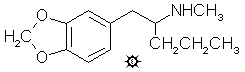

[上一个](/文档/PiHKAL/pihkal128.md) [返回](/文档/PiHKAL/index.md) [下一个](/文档/PiHKAL/pihkal130.md)

# 129 [METHYL-K](/药物/METHYL-K.md)

**2-甲氨基-1-(3,4-亚甲二氧基苯基)戊烷；N-甲基-1-(1,3-苯并二氧杂环戊烯-5-基)-2-戊胺**

|  |
| --- |

**合成：** 通过向 14 g 镁屑在 500 mL 无水 Et2O 中的充分搅拌悬浮液中逐滴加入 68 g 正丁基溴，在无水 Et2O 中制备丁基溴的格氏试剂。当放热反应停止后，在 1 小时内加入 60 g 胡椒醛溶于约 100 mL Et2O 的溶液。放热添加完成后，反应混合物回流数小时，然后冷却并通过加入稀 HCl 分解。分离各相，水相用 2x75 mL CH2Cl2 萃取。合并有机相，在真空下除去溶剂后，得到 84 g 1-羟基-1-(3,4-亚甲二氧基苯基)戊烷，为黄色液体。无需进一步纯化即可用于随后的脱水步骤。

将 52 g 粗制 1-羟基-1-(3,4-亚甲二氧基苯基)戊烷和 2 g 粉状 KHSO4 的混合物用火焰加热，直至不再有明显的水生成。所得深色流动油状物在 100-110 °C、0.3 mm/Hg 下蒸馏，得到 29.5 g 1-(3,4-亚甲二氧基苯基)-1-戊烯，为淡黄色液体。这无需进一步纯化即可用于随后的氧化步骤。

向 120 mL 90% 甲酸中，在充分搅拌下加入 15 mL H2O，随后加入 23 mL 35% H2O2。向该混合物（用外部冰浴冷却）中加入 24 g 粗制 1-(3,4-亚甲二氧基苯基)-1-戊烯溶于 120 mL 丙酮的溶液，速度要慢，以保持内部温度不超过 35 °C。添加结束时，通过在蒸汽浴上短暂加热将温度升至 45 °C，然后让反应混合物在环境温度下静置并搅拌数小时。在真空下除去所有挥发物，浴温保持在 45 °C。残留物溶于 30 mL 甲醇中，然后加入 200 mL 15% H2SO4，混合物在蒸汽浴上保持 1.5 小时。然后加入额外的 300 mL H2O，并用 2x250 mL 石油醚/乙酸乙酯 (5:1) 混合物萃取。合并萃取液，在真空下除去溶剂，得到残留物，在 115-120 °C、0.3 mm/Hg 下蒸馏。这种淡黄色液体重 13.5 g，经 TLC 检测基本上是纯的 1-(3,4-亚甲二氧基苯基)-2-戊酮。

向 5.0 g 切成 1 英寸方块的铝箔中，加入 150 mg HgCl2 溶于 200 mL H2O 的溶液。短暂加热混合物，直到出现明显的活性汞齐化迹象，例如铝表面出现细小气泡并开始形成灰色无定形固相。倾析出 HgCl2 溶液，铝用 2x200 mL 额外的 H2O 洗涤。尽可能摇干后，依次加入 10 g 甲胺盐酸盐溶于 10 mL H2O 的溶液、27 mL 异丙醇、22 mL 25% NaOH、5.0 g 1-(3,4-亚甲二氧基苯基)-2-戊酮，最后加入额外的 50 mL 异丙醇，并在每次添加之间充分旋涡搅拌。定期在蒸汽浴上加热混合物，以保持反应速率处于剧烈沸腾状态。当所有铝被消耗完后，过滤冷却的混合物，并用甲醇洗涤固体。合并的滤液和洗涤液在真空下除去溶剂。残留物溶于稀 H2SO4 并用 2x75 mL CH2Cl2 洗涤。再次用 25% NaOH 碱化后，用 2x100 mL CH2Cl2 萃取，合并的萃取液在真空下除去溶剂。残留物在 105-110 °C、0.3 mm/Hg 下蒸馏，得到 2.7 g 无色液体。将其溶于 15 mL 异丙醇中，用浓 HCl 中和，并用 75 mL 无水 Et2O 稀释，这允许延迟出现细小的白色晶体。过滤除去，用 Et2O 洗涤，并风干，得到 2.45 g 2-氨甲基-1-(3,4-亚甲二氧基苯基)戊烷盐酸盐 (METHYL-K)，为白色产物，熔点为 155-156 °C。分析 (C13H20ClNO2) C,H。

**给药剂量：** 大于 100 mg。

**药效时长：** 未知。

**定性评论：** （服用 100 mg）没有效果。我很忙，完全兴奋，直到凌晨 3 点才睡，但这可能与 Me-K 无关。

**延伸和评论：** 以戊烷链为基本骨架的这口井似乎快干涸了。METHYL-J 在这个水平上已经显示出许多暗示和线索，主要是身体上的，如脚冷和轻微的乳突压力，表明活性就在眼前。但 METHYL-K 没有给出这样的暗示。未甲基化的同系物 2-氨基-1-(3,4-亚甲二氧基苯基)戊烷 (K) 也已制成，通过在甲醇中用乙酸铵和氰基硼氢化钠对 1-(3,4-亚甲二氧基苯基)-2-戊酮进行还原胺化。它是一种白色结晶固体，熔点 202-203 °C，但仅在评论中给出，因为从未启动过其人体测定。分析 (C12H18ClNO2) C,H。另一方面，N-乙基同系物 2-乙氨基-1-(3,4-亚甲二氧基苯基)戊烷 (ETHYL-K) 以其自己的配方输入，因为已经开始对其进行测试。

在这个 Muni Metro 系列中探索的最长链是六碳己基链，逻辑上它是 L 系列，算是 Taraval 线的终点（解释见 METHYL-J 下）。所有 L 化合物的中心化合物是酮 1-(3,4-亚甲二氧基苯基)-2-己酮，它是通过 (n)-戊基溴的格氏试剂与胡椒醛反应生成 1-羟基-1-(3,4-亚甲二氧基苯基)己烷，用硫酸氢钾脱水成烯烃，然后用过氧化氢和甲酸氧化成 L-酮制备的，L-酮是一种橙色液体，沸点为 125-135 °C (0.3 mm/Hg)。该酮在甲醇中用乙酸铵和氰基硼氢化钠还原胺化，生成 2-氨基-1-(3,4-亚甲二氧基苯基)己烷盐酸盐 (L)，为白色结晶产物，熔点为 157-158 °C。分析 (C13H20ClNO2) C,H。并且该酮在异丙醇中用甲胺盐酸盐和汞齐化铝还原胺化，生成 2-甲氨基-1-(3,4-亚甲二氧基苯基)己烷盐酸盐 (METHYL-L)，为白色结晶产物，熔点为 139-141 °C。分析 (C14H22ClNO2) C,H。用乙胺盐酸盐以类似方式还原该酮生成 2-乙氨基-1-(3,4-亚甲二氧基苯基)己烷 (ETHYL-L)。该系列均未作为迷幻或致幻（entactogenic）材料进行探索。

---

[上一个](/文档/PiHKAL/pihkal128.md) [返回](/文档/PiHKAL/index.md) [下一个](/文档/PiHKAL/pihkal130.md)