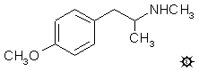

[上一个](/文档/PiHKAL/pihkal129.md) [返回](/文档/PiHKAL/index.md) [下一个](/文档/PiHKAL/pihkal131.md)

# 130 [METHYL-MA](/药物/METHYL-MA.md)

**PMMA；DOONE；4-MMA；4-甲氧基-N-甲基苯丙胺**

|  |
| --- |

**合成：** 将 20 g 甲胺盐酸盐溶于 150 mL 热甲醇的溶液用 10.0 g 4-甲氧基苯基丙酮处理并磁力搅拌。恢复至室温后，加入 5.0 g 氰基硼氢化钠，随后根据需要小心加入 HCl 以保持 pH 值约为 6。反应几天后完成，将混合物倒入 800 mL H2O 中。用 HCl 酸化（HCN 释放！），并用 3x75 mL CH2Cl2 洗涤，除去大部分黄色。加入 25% NaOH 使反应混合物呈强碱性，并用 3x75 mL CH2Cl2 萃取。在真空下从合并的萃取液中除去溶剂，10.3 g 残留物在 0.3 mm/Hg 下蒸馏。将 75-90 °C 蒸馏出的 9.7 g 无色油状物溶于 50 mL 异丙醇中，用 4.5 mL 浓 HCl 中和，然后用 100 mL 无水 Et2O 稀释。生成闪闪发光的 4-甲氧基-N-甲基苯丙胺盐酸盐 (METHYL-MA 或 DOONE) 晶体，用 Et2O 洗涤并风干至恒重后重 11.0 g，熔点为 177-178 °C。同样的碱可以通过在三乙胺存在下用氯甲酸乙酯作用于 [4-MA](/药物/4-MA.md) 制成氨基甲酸酯，或用甲酸作用制成甲酰胺。然后可以用 LAH 将这些还原为相同的最终产物。

**给药剂量：** 大于 100 mg。

**药效时长：** 短。

**定性评论：** （服用 110 mg）一小时后，我的脉搏超过 100，我强迫性地打哈欠。有一些眼部肌肉干扰，有点像 MDMA 的身体方面，但没有任何中枢效应。但所有心血管方面的暗示都在那里。到第四个小时，我几乎回到了基线，但打哈欠仍然是其中的一部分。我可能会在同一水平重复此操作，但要持续密切监测身体。

**延伸和评论：** 为什么会对这种特定化合物感兴趣？比较作为伯胺的活性化合物及其 N-甲基同系物的记录表明，一般来说，兴奋剂成分可能会保持，但“迷幻”贡献通常会大大减少。当然，MDMA 是一个例外，但这种特定化合物是一种独一无二的东西，无论如何都违反了所有规则，我将其从此类推理中剔除。而且由于 [4-MA](/药物/4-MA.md) 是一种相当强劲的兴奋剂，几乎没有任何感官火花，为什么还要费心去研究 N-甲基化合物呢？

出于一个完全愚蠢和浪漫的原因。当 MDMA 的故事在 1985 年年中成为头版新闻时，Doonesbury 的漫画家兼作者 Gary Trudeau 制作了一个为期两周的专题，在一个由 12 幅连环画组成的搞笑序列中，以幽默且几乎（但不完全）直接的方式表现了它。1985 年 8 月 19 日，他让 Baby Doc 学院院长 Duke 介绍了来自南加州大学的药物设计团队，即一对才华横溢的双胞胎 Albie 和 Bunny Gorp 博士。他们向热情的会议生动地展示了他们的新药“Intensity”仅仅是去除了两个氧原子之一的 MDMA。其中一人手里拿着分子模型说：“瞧，像海盐一样合法。” 那么，去除了一个氧原子的 MDMA 是什么？它是 4-甲氧基-N-甲基苯丙胺或 METHYL-MA，据双胞胎称，这应该给人的另一个自我以实质的错觉。所以，我叫它 Doonesamine，或者简称为 DOONES。也许这也是弗兰克·赫伯特科幻小说《沙丘》(Dune) 的同音词，书中神奇的药物“香料”使使用者的意识状态发生了最显著的改变。

这幅漫画展示是第一次在全国范围内提及“策划药”一词，也许这为仅仅一年后通过的《1986 年受控物质类似物执行法案》提供了意想不到的支持。这项故意含糊不清的立法规定，给予、服用甚至持有意图服用任何以任何方式改变意识状态的药物均为重罪。这是政府当局为在绝望的情况下维持控制形象而做出的可耻和绝望的努力。

社论够多了。回到历史技术细节。实际上，METHYL-MA 是一种经过充分研究的药物，至少在动物身上是这样。在小鼠和大鼠中，它是产生紧张症状态的异常有效的药物。由 METHYL-MA 的秘密合成引发的动物研究表明，确实存在运动刺激和一些中枢效应，但这些效应不知何故与简单的苯丙胺类药物不同。实验者的结论是，基于其结构与 [4-MA](/药物/4-MA.md) 的相似性及其在某些动物物种中产生紧张症的倾向，以及使用它可能会出现意想不到的神经化学变化的可能性，不鼓励进行人体实验。我也得出了同样的结论，但在我的案例中，这是基于一个更简洁的观察：我试过了，我不喜欢它。

简要评论一下甲氧基苯丙胺的两种 N,N-二甲基同系物。一种是 4-甲氧基-N,N-二甲基苯丙胺，4-MNNA。这种材料是通过用二甲胺对 4-甲氧基苯基丙酮进行还原胺化制成的，是一种无色油状物，在 70-85 °C (0.3 mm/Hg) 下蒸馏。相应的 2-甲氧基-N,N-二甲基苯丙胺也是类似制备的。2-MNNA 也是一种无色油状物，具有相同的沸点。它们都用 18F 标记的次氟酸乙酰酯进行了氟化（产率分别为 3% 和 6%），但在寻找脑血流指示剂的过程中，都没有对它们进行进一步的研究。

---

[上一个](/文档/PiHKAL/pihkal129.md) [返回](/文档/PiHKAL/index.md) [下一个](/文档/PiHKAL/pihkal131.md)