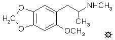

# 131  [METHYL-MMDA-2](/药物/METHYL-MMDA-2.md)

**2-甲氧基-N-甲基-4,5-亚甲二氧基苯丙胺**

|  |
| --- |

**合成：** 将 17.4 g 电解铁粉在 100 g 冰乙酸中的悬浮液在蒸汽浴上加热，直到出现最初的气泡和反应迹象，约 60 °C。然后分小批加入 9.2 g 1-(2-甲氧基-4,5-亚甲二氧基苯基)-2-硝基丙烯（其制备见 MMDA-2）在 40 g 温热冰乙酸中的悬浮液。反应极其放热。颜色尽可能变浅后，加入足以完全消除残留黄色的额外铁量。在允许反应混合物恢复至室温的同时保持机械搅拌。全部倒入 800 mL H2O 中，过滤除去不溶物。这些不溶物交替用 H2O 和 CH2Cl2 洗涤，分离合并的滤液和洗涤液，水相用 3x100 mL CH2Cl2 萃取。合并所有有机相，用 2x75 mL 5% NaOH 洗涤（除去大部分颜色），并在真空下除去溶剂。8.7 g 残留物在 90-105 °C、0.2 mm/Hg 下蒸馏，得到 6.7 g 2-甲氧基-4,5-亚甲二氧基苯基丙酮，为淡黄色油状物。

向磁力搅拌的 30 g 甲胺盐酸盐溶于 150 mL 温热甲醇的溶液中，加入 6.5 g 2-甲氧基-4,5-亚甲二氧基苯基丙酮，随后加入 3.0 g 氰基硼氢化钠。根据需要加入浓 HCl 以保持混合物的 pH 值约为 6。反应完成后，将其加入 1 L H2O 中，并用 25% NaOH 调至强碱性。用 3x100 mL CH2Cl2 萃取，合并的萃取液依次用 2x100 mL 稀 H2SO4 萃取。该水相用 CH2Cl2 洗涤，用 NaOH 碱化，并用 3x100 mL CH2Cl2 萃取。在真空下从这些合并的萃取液中除去溶剂，得到 8.7 g 琥珀色油状物。在 110-125 °C、0.25 mm/Hg 下蒸馏，得到 5.1 g 无色油状物。将其溶于 30 mL 异丙醇中，用约 3 mL 浓 HCl 中和，并用 60 mL 无水 Et2O 稀释。澄清溶液缓慢析出白色晶体，过滤并风干，得到 4.2 g 2-甲氧基-N-甲基-4,5-亚甲二氧基苯丙胺盐酸盐 (METHYL-MMDA-2)，熔点为 168-169 °C。分析 (C12H18ClNO3) C,H。

**给药剂量：** 大于 70 mg。

**药效时长：** 未知。

**定性评论：** （服用 70 mg）可能是一个阈值——令人愉快但无法对其进行表征。

**延伸和评论：** 由于未甲基化同系物的有效剂量在 25 至 50 毫克范围内，正如这里讨论的其他 N-甲基化材料一样，这种 N-甲基化合物的活性再次降低。迄今为止报告的最高剂量为 70 毫克，无法估计活性水平可能是多少，或者一旦达到该水平，效果的质量会如何。

这是唯一作为 N-甲基衍生物进行探索的 MMDA 类似物。还制造了一种取代度更高的类似物，即 DMMDA 的 N-甲基衍生物。异欧芹脑 (Isoapiole)（其制备见 DMMDA）用甲酸和过氧化氢氧化成酮（2,5-二甲氧基-3,4-亚甲二氧基苯基丙酮，从甲醇中析出的固体，熔点 75-76 °C），该酮与甲胺和汞齐化铝进行还原胺化，生成 2,5-二甲氧基-N-甲基-3,4-亚甲二氧基苯丙胺氢溴酸盐一水合物 (METHYL-DMMDA 或 DMMDMA)，为白色结晶固体，熔点 91-92 °C。盐酸盐是吸湿性固体。分析 (C13H22BrNO5) C,H。上述酮也用于合成另一种甲基化的 DMMDA，在 β-碳上。这在 DMMDA 本身下有描述。DMMDMA 尚未启动评估计划，如果所需的剂量在 100 毫克以上的某个地方，我也不会感到惊讶。我确信答案可能在不久的将来就会揭晓。全世界有数量惊人的不引人注目的化学探索者，他们在私人实验室里做着他们的合成工作。他们确实是内心太空的宇航员。

---

[上一个](/文档/PiHKAL/pihkal130.md) [返回](/文档/PiHKAL/index.md) [下一个](/文档/PiHKAL/pihkal132.md)