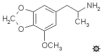

# 132 [MMDA](/药物/MMDA.md)
[上一个](/文档/PiHKAL/pihkal131.md) [返回](/文档/PiHKAL/index.md) [下一个](/文档/PiHKAL/pihkal133.md)

**3-METHOXY-4,5-METHYLENEDIOXYAMPHETAMINE (3-甲氧基-4,5-亚甲二氧基苯丙胺)**

|  |
| --- |

**合成：**（从原儿茶醛出发）将 18 g 工业级原儿茶醛（3,4-二羟基苯甲醛）溶于 200 mL 温乙酸中，过滤除去所有不溶物，得到深色但澄清的溶液。在充分搅拌下，加入 20 g 单质溴。反应自发升温至约 30 °C，并在约 5 分钟内出现固体。继续搅拌 1 小时，然后过滤除去形成的浅灰色固体，并用乙酸轻微洗涤。将这些固体在蒸汽浴上风干，直至没有乙酸气味。产物 3-溴-4,5-二羟基苯甲醛重 11.7 g，熔点为 222 °C。

向 11.7 g 3-溴-4,5-二羟基苯甲醛溶于 36 mL DMSO 的溶液中，加入 29 g 二碘甲烷，随后加入 20.8 g 无水碳酸钾。在蒸汽浴上加热 3 小时，加入 1 L 水中，用氢氧化钠调至强碱性，然后用 3x100 mL 二氯甲烷萃取。合并萃取液，用水洗涤，并在真空下除去溶剂。深棕色半固体残留物进行蒸馏，主馏分（6.0 g）在 0.3 mm/Hg 下于 120-130 °C 馏出。将其从 35 g 沸腾甲醇中重结晶，得到 1.3 g 3-溴-4,5-亚甲二氧基苯甲醛，为类白色结晶固体，熔点为 123-124 °C。

将 2.2 g 3-溴-4,5-亚甲二氧基苯甲醛和 3.6 mL 环己胺的混合物置于蒸馏瓶中，加热至 100 °C 使其溶解，然后用明火加热直至明显有水生成。随后将其置于高真空下以除去生成的水和过量的环己胺，产物在 0.2 mm/Hg 下于 120-125 °C 蒸馏。得到 2.4 g 该醛与胺形成的希夫碱，熔点为 86-96 °C。从 5 倍体积的甲醇中重结晶分析样品，得到 3-溴-4,5-亚甲二氧基苯亚甲基-N-环己胺，为白色固体，熔点为 97.5-98.5 °C。分析值 (C14H16BrNO2) H；C：计算值，54.20；实测值，53.78。

将 2.2 g 3-溴-4,5-亚甲二氧基苯亚甲基-N-环己胺（上述希夫碱）溶于 50 mL 无水乙醚的溶液置于氦气氛围中，磁力搅拌，并用干冰/丙酮浴冷却。出现白色细微结晶相。随后加入 5.2 mL 1.55 M 正丁基锂的正己烷溶液（细微固体溶解），随后加入 4.0 mL 硼酸三丁酯。恢复至室温后，用 20 mL 饱和硫酸铵水溶液淬灭反应。分离乙醚/己烷层，用额外的硫酸铵溶液洗涤，然后在真空下除去挥发物。将残留物溶于 100 mL 50% 甲醇中，用 2 mL 30% 过氧化氢处理，旋摇 15 分钟后，用 10 g 硫酸铵溶于 50 mL 水的溶液淬灭。此水相（pH 约 8）用 2x50 mL 二氯甲烷萃取，合并萃取液并在真空下除去溶剂，残留物溶于温稀盐酸中。待所有残留物溶解后（加热几分钟即可），将溶液冷却至室温并用 2x50 mL 二氯甲烷萃取。合并这些有机相，依次用 2x50 mL 5% 氢氧化钠萃取。合并的水相部分用盐酸酸化，随后用 2x50 mL 二氯甲烷萃取，蒸发溶剂后，得到残留物，在 0.25 mm/Hg 下于 140-150 °C 蒸馏，得到 3-羟基-4,5-亚甲二氧基苯甲醛。将其从甲苯 (40 mL/g) 中重结晶，得到 0.46 g 类白色产物，熔点为 134-134.5 °C。分析值 (C8H6O4) C,H。

将 0.44 g 3-羟基-4,5-亚甲二氧基苯甲醛溶于 10 mL 干丙酮的溶液用 0.5 g 碘甲烷和 0.5 g 粉末状无水碳酸钾处理，并回流 6 小时。真空下除去所有挥发物，残留物溶于水，用氢氧化钠调至强碱性，并用 3x50 mL 二氯甲烷萃取。除去溶剂得到肉豆蔻醛（熔点 133-134 °C），将其从己烷中重结晶，最终产率为 0.42 g，熔点 134-135 °C。对于两个具有相同熔点的连续产物必须小心。与上述未甲基化酚的混合熔点会显著降低，而与真实样品的混合熔点则不会。

将 9.8 g 肉豆蔻醛溶于 35 mL 冰乙酸的溶液用 5.3 mL 硝基乙烷和 3.2 g 无水乙酸铵处理，并在蒸汽浴上加热 1.5 小时。取出后，在充分搅拌下加水至刚好不出现浑浊，加入产物硝基苯乙烯晶种，并使其缓慢冷却至室温。过滤除去形成的亮黄色固体，用少量乙酸水溶液洗涤，并尽可能抽干溶剂。该物质在多孔板上压干后，熔点为 107-110 °C。从 60 mL 沸腾乙醇中重结晶，过滤并风干后，得到 5.1 g 1-(3-甲氧基-4,5-亚甲二氧基苯基)-2-硝基丙烯，为浅黄色固体，熔点为 109-110 °C。

将 7.5 g 氢化铝锂在 500 mL 无水乙醚中的悬浮液进行磁力搅拌，并在惰性气氛中加热至温和回流。冷凝的乙醚从带有分流回流冷凝器的索氏提取器套管中浸提出总计 9.8 g 的 1-(3-甲氧基-4,5-亚甲二氧基苯基)-2-硝基丙烯。这实际上是将硝基苯乙烯作为温热的饱和乙醚溶液加入到反应介质中。加完后，继续回流 5 小时，然后冷却反应混合物，并通过加入 400 mL 1.5 N 硫酸（最初 20 mL 逐滴加入并充分搅拌）破坏过量的氢化物。分离各相，向水相中加入足够的饱和碳酸钠水溶液，使 pH 值升至约 6.0。将其加热至 80 °C，并通过粗孔烧结玻璃漏斗过滤以除去一些不溶性细粉。将澄清滤液加热至接近沸腾，并用 10.2 g 90% 苦味酸溶于 110 mL 沸腾乙醇的溶液处理。苦味酸盐晶体立即在边缘形成，随着反应瓶在冰浴中冷却，整个反应物凝固成黄色晶体块。过滤除去这些晶体，用少量 80% 乙醇洗涤，风干得到 14.0 g MMDA 的苦味酸盐，熔点为 182-184 °C。从小样乙醇中重结晶，熔点降至 179-181 °C。将此盐用 30 mL 5% 氢氧化钠处理，并将红色溶液从一些不溶物中倾析出来。额外的水和氢氧化钠有效地溶解了所有物质，所得碱性水相用 3x50 mL 二氯甲烷萃取。合并的萃取液在真空下除去溶剂，残留物溶于 200 mL 无水乙醚中，并通入无水氯化氢气体至饱和。有大量白色晶体沉淀析出，过滤除去，用乙醚洗涤，风干得到 6.37 g 3-甲氧基-4,5-亚甲二氧基苯丙胺盐酸盐 (MMDA)，熔点为 190-191 °C。分析值 (C11H16ClNO3) Cl。

（从肉豆蔻油出发）小心蒸馏肉豆蔻油（或肉豆蔻衣油）可以分离出多种纯度不等的化合物。在约 1.0 mm/Hg 下沸点在 110-115 °C 范围内的馏分是肉豆蔻醚（3-甲氧基-4,5-亚甲二氧基烯丙基苯）。它构成了原始商业油的约 7%，并且在其原始分离形式中，获得的纯度为 87%。主要的污染物是榄香脂素（3,4,5-三甲氧基烯丙基苯）。将 100 g 肉豆蔻醚溶于 100 g 无水乙醇的溶液用 200 g 固体氢氧化钾处理，并在蒸汽浴上加热过夜。在真空下除去挥发物，向残留物中加水，并用 3x100 mL 二氯甲烷萃取，合并萃取液除去溶剂后，得到粗制异肉豆蔻醚（顺式和反式异构体的混合物）残留物。蒸馏该产物，在 1 mm/Hg 下沸点为 125-130 °C 的馏分得到 63 g 异肉豆蔻醚，为淡黄色油状物，会自发结晶。熔点为 41.5-42.5 °C。提纯这些固体相关的部分损失是由于形成了顺式异构体的异肉豆蔻醚，它是一种油状物。

将 50 g 异肉豆蔻醚溶于含有 24 g 吡啶的 300 mL 干丙酮溶液剧烈搅拌，并用冰浴冷却至 0 °C。向其中加入预冷至 0 °C 的 54 g 四硝基甲烷。继续搅拌整整 2 分钟，然后加入 16.8 g 氢氧化钾溶于 300 mL 水的冷溶液淬灭反应。继续搅拌直至温度再次降至接近 0 °C。过滤除去产物。用二氯甲烷萃取滤液并除去溶剂，提供了额外的硝基苯乙烯，合并产量为 50.7 g，由于存在少量游离肉豆蔻醛，熔点为 103 °C。从甲醇中重结晶产生 1-(3-甲氧基-4,5-亚甲二氧基苯基)-2-硝基丙烯，熔点为 109-110 °C。该材料完全足以用于上述还原制备 MMDA。将此硝基丙烯转化为肉豆蔻醛是上述冗长合成的替代方法），并可用于制备 LOPHOPHINE。

将 50 g 1-(3-甲氧基-4,5-亚甲二氧基苯基)-2-硝基丙烯和 26 g 外消旋 α-甲基苄胺的混合物在蒸汽浴上加热。混合物逐渐形成澄清溶液，并稳定放出硝基乙烷。当反应变得平静时，加入 20 mL 浓盐酸溶于 100 mL 水的混合物。反应混合物完全溶解，随着温度继续升高，生成的肉豆蔻醛结晶析出，突然固化。过滤除去该产物，当与通过己烷萃取滤液获得的第二批晶体合并时，得到 36.9 g 肉豆蔻醛。熔点为 128-129 °C，经己烷重结晶后升至 133-134 °C。

**给药剂量：** 100 - 250 mg。

**药效时长：** 中等。

**定性评论：** （100 mg）一小时后我感到完全放松。就像我在漂浮一样。味觉没有明显影响，这种放松和镇定的感觉很像小剂量的 LSD，也许是 20 微克。瞳孔有些放大，晚上我有点焦躁不安，稍微有点累。我睡得很好，醒来时精神焕发，心情愉快。

（100 mg）它似乎需要 45 分钟才起效，然后来得很突然，好像我的眼球被拉出来，整个头都在膨胀。很快一种寒冷的感觉袭来，伴随着颤抖——但这并不令人不快。大约两个小时后，我的状态似乎是一种共情和被动，一种非个人的同情。音乐听起来很假，像罐头音乐，很刺耳，与人声形成鲜明对比，人声听起来丰富、饱满、清晰且悦耳。

（150 mg）我们在河口的沙滩上，在劈开的红木上晒海藻。有轻微的恶心，轻微的痉挛，然后我的视野开始亮起来。仍然有眩晕感，但只在睁开眼睛时才有，还有沉重感和时间拉长的感觉；胸部麻木，就像服用了阿片类药物一样。有几何图案，但我闭上眼睑上的过多光线干扰了这一点。闪闪发光的钻石镶嵌的海浪在舞蹈，运动和美感在增加。内心出现了更多的风景。这是这类药物的一个很好的入门药物，可以尽可能温和地熟悉药物状态。这种物质的作用似乎比这类药物中的其他药物温和得多；也许更像大麻或裸盖菇素。几乎没有偏执狂。我注意到两种类型的幻觉：一种是严格视网膜的，更微小，受光线影响，聚焦在视网膜或眼睑前方的光线上；另一种是位于视觉通道深处和枕叶的，更大、更全局、像梦一样，当它变得坚实的时候，非常戏剧化且令人难忘，就像在冥想中一样。

（210 mg）MMDA 味道很糟糕。苦涩的生物碱味道之后是明显的化学实验室味道，就像旧橡胶管的味道。大约 45 分钟内似乎什么也没发生，然后突然好像一个铁砧降落在你的头上；你感到迷失方向，倾向于稍微退出社交接触。这种药物让人感到不适的程度比麦斯卡林轻。效果肯定达到了高潮，随后是令人愉快的余辉。显然没有严重的运动协调问题。MMDA 产生那种“周日下午”的感觉，想躺下来享受生活；一种“躺平”的奢华感觉。视觉场景中的颜色没有增强（除了脸上有些绿色的色调），但闭上眼睛后，幻觉似乎是真实的 3D，就像看电影一样。起初这些梦是黑白的，但后来颜色开始出现。首先出现黄绿色和洋红色，然后是蓝色，最后是红色。起初我看到了赌桌上的大数字，然后是人。MMDA 似乎将梦境带到了意识层面；是潜意识和意识之间的桥梁。

（225 mg）大约 20 分钟后，我对我的手有一种奇怪的意识——不是感觉它们就在那里，而是我被它们以某种方式吸引住了。然后我开始感到恐惧，一种极度的孤独体验。我脸朝下躺着（对我来说这是一个抑郁的姿势）。接下来我在和学校的孩子们（一个图像）或其他老师说话。这非常生动。学校里的场景比我周围真实的场景更生动。那些人更真实。在实验过程中，我现在其实非常困。在我有过的任何经历中，这最像是一系列容易记住的梦。当它结束时，我觉得好像睡了很长时间——我上床睡觉，经历了一系列非常生动、多彩和真实的梦境状态。

**延伸和评论：** 早期 MMDA 试验中的几位受试者反复使用的短语是“脑中电影”。显然，最丰富的效果是在闭眼时获得的。这是我在 1962 年首次完成的化合物，并将其命名为 MMDA，当我听说加州大学洛杉矶分校的药理学教授 Gordon A. Alles 博士（他在洛杉矶拥有自己的私人实验室）也在 1962 年合成了它，也将其命名为 MMDA，并开始探索它时，我已经开始探索它了。我们约好见面分享想法，但他于 1963 年去世，享年 62 岁。

这是一种可能是肉豆蔻药理作用促成因素的物质。这种香料的主要精油是肉豆蔻醚，它是 MMDA 最容易的来源。据报道，让这种油通过兔子的肝脏会在该动物体内生成 MMDA。这两种分子在结构上的唯一区别是氨的元素。肉豆蔻醚加上氨生成 MMDA。肉豆蔻醚的另一种天然来源是欧芹油，它也是芹菜脑的极佳来源，在 DMMDA 条目下提到过。20 世纪 60 年代流传的一个谣言说欧芹能让你兴奋，其起源可能在于肉豆蔻醚存在的报道，加上肉豆蔻醚是 MMDA 的主要来源。与肉豆蔻醚（一种精油）的关系导致 MMDA 被归类为一种“精油苯丙胺”。这些关系在 TMA 条目下有进一步阐述。

当 FDA 发布危险药物公告时（在 20 世纪 60 年代中期），人们正在谈论 MMDA，实际上它刚刚通过 Koch Light Industries 在英国上市。但在我所知范围内，它从未出现在街头，所以它被卷入邪恶药物清单纯粹是时机不佳的巧合。MMDA 和目前臭名昭著的 MDMA 之间首字母缩写的相似性，在大众媒体中引起了不小的混乱。它们仍然是完全独立且完全不同的药物。

[上一个](/文档/PiHKAL/pihkal131.md) [返回](/文档/PiHKAL/index.md) [下一个](/文档/PiHKAL/pihkal133.md)