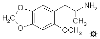

# 133 [MMDA-2](/药物/MMDA-2.md)

[上一个](/文档/PiHKAL/pihkal132.md) [返回](/文档/PiHKAL/index.md) [下一个](/文档/PiHKAL/pihkal134.md)

**2-METHOXY-4,5-METHYLENEDIOXYAMPHETAMINE (2-甲氧基-4,5-亚甲二氧基苯丙胺)**

|  |
| --- |

**合成：** 将 11.5 g 氢氧化钾颗粒 (85%) 溶于 75 mL 乙醇的溶液用 25 g 芝麻酚处理，随后加入 27 g 碘甲烷。将其在蒸汽浴上回流。20 分钟内明显有盐生成，回流共维持 4 小时。在真空下除去溶剂，残留物倒入 400 mL 水中。用盐酸酸化，并用 3x150 mL 二氯甲烷萃取。合并的萃取液用 3x100 mL 5% 氢氧化钠洗涤，去除了大部分颜色。在真空下除去溶剂，得到 24.0 g 3,4-亚甲二氧基苯甲醚，为淡琥珀色油状物。

将 56.4 g 三氯氧磷和 49.1 g N-甲基甲酰苯胺的混合物静置 40 分钟，然后倒入装有 64 g 3,4-亚甲二氧基苯甲醚的烧杯中。立即发生放热反应，颜色变深并产生气泡。在蒸汽浴上加热 1 小时，然后在极剧烈搅拌下倒入 1 L 水中。深棕色相非常不透明，然后颜色突然变浅，生成细微的淡黄色固体。继续搅拌 2 小时，然后过滤除去这些晶体。将此粗产物从 400 mL 沸腾甲醇中重结晶，过滤、洗涤并风干至恒重后，得到 44.1 g 2-甲氧基-4,5-亚甲二氧基苯甲醛，熔点为 110-111 °C。气相色谱显示最终产物中仅可见一种位置异构体，但用二氯甲烷萃取原始母液，真空蒸发溶剂后，产生 2 g 红色油状物，在 OV-17 色谱柱上显示两个较早的峰。这与 Vilsmeier 甲酰化反应可能产生的两种替代位置异构体各约 1% 的情况一致。

将 43 g 2-甲氧基-4,5-亚甲二氧基苯甲醛溶于 185 g 硝基乙烷的溶液用 9.3 g 无水乙酸铵处理，并在蒸汽浴上加热 4.5 小时。在真空下除去过量的硝基乙烷，得到自发结晶的残留物。借助 200 mL 冷甲醇机械洗出这些固体，过滤回收鲜艳的橙色晶体，风干至恒重。得到 35.7 g 1-(2-甲氧基-4,5-亚甲二氧基苯基)-2-硝基丙烯，熔点为 166-167 °C。从异丙醇中重结晶并未改善这一点。蒸发甲醇洗液中的溶剂得到黄色固体（4.6 g，熔点 184-186 °C），经 THF/己烷重结晶后，熔点为 188-190 °C。化学电离质谱（异丁烷，0.5 托）显示其分子量为 416，是硝基苯乙烯、醛和氨各一分子的 C20H20N2O8 加合物，这经常作为非常不溶的杂质出现在乙酸铵催化的醛-硝基乙烷缩合反应中。

在惰性气氛下，向 36 g 氢化铝锂在 1 L 无水四氢呋喃中的回流悬浮液中，加入 44.3 g 1-(2-甲氧基-4,5-亚甲二氧基苯基)-2-硝基丙烯的热四氢呋喃溶液。溶解度很低，因此必须在滴液漏斗上使用加热灯以保持溶液澄清以便加入。加入需要 2 小时，回流维持 36 小时。然后将反应混合物在冰浴中冷却，并根据放热情况依次加入 36 mL 水、36 mL 15% 氢氧化钠，最后加入 108 mL 水。过滤除去颗粒状固体，并用四氢呋喃洗涤。合并的滤液和洗液在真空下除去溶剂，得到 58.8 g 淡琥珀色油状物。将其溶于 100 mL 异丙醇中，用浓盐酸中和（需要 20 mL），并用 500 mL 无水乙醚稀释。需要更多的异丙醇以防止出现油相。待结晶产物完全形成后，过滤除去，用异丙醇/乙醚洗涤，最后用乙醚洗涤。风干得到 31.1 g 2-甲氧基-4,5-亚甲二氧基苯丙胺盐酸盐 (MMDA-2)，熔点为 186-187 °C。

**给药剂量：** 25 - 50 mg。

**药效时长：** 8 - 12 小时。

**定性评论：** （25 mg）有一些不太令人愉快的刺耳效果——这不是最平滑的药物。时长：1.5 小时起效（午饭后服用），急性期 3 到 4 小时，11 小时时服用速可巴比妥以停止残留效应以便入睡。偶尔从 5 到 10 小时有急性腹部不适，类似胀气痛但无法排便。腹部肌肉紧绷且坚硬。这大约每小时发生一次，持续约 15 分钟。相当不愉快。

（30 mg）45 分钟时出现了第一个微妙的迹象，缓慢的发展使得变化易于吸收，但难以量化。我的意识确实增强了。没有任何东西被扭曲，因此不会导致误解。这将是一个很好的材料，用来向某人介绍那种起效慢、消退慢的体验。任何人在这个剂量下服用这种药物，都不可能有糟糕的体验。这非常像一种缓慢的 MDA，也许是 80 毫克的那种，而且同样完全可控。这个化合物的 N-甲基化是必须尝试的。

（40 mg）该化学物质主要是一种视觉增强剂，只有极少量的视觉扭曲。视网膜活动是轻微且非威胁性的。该化学物质似乎促进了移情交流，情绪感觉强烈而纯净。谈话流畅，没有抑制或防御。体验伴随着厌食。没有阳痿。有一些不安的运动，随着锻炼（散步和玩飞盘）而消散。第二天醒来感觉精力充沛，没有肌肉僵硬，头脑清醒。我会重复这次体验。

（50 mg）我在 40-60 分钟内起效，轻松且缓慢，但在精神达到 [\+3](shulgin_rating_scale.shtml) 之前身体先达到了。前 2-3 小时的精神状态很奇怪——我称之为“高内华达山脉”——现实、冷静、不友善。一些黑暗区域持续存在。看了《老博士的马戏团》的后半部分，整个感觉从色情变成了情色。令人愉快。有些幻想。消退时，入睡困难。身体感觉出乎意料地耗尽。腿像橡胶一样，字迹颤抖。

**延伸和评论：** 熟悉这两种物质的受试者经常将这种材料与 MDA 进行比较。但是很难将理智化的东西与感受到的东西区分开来。对化学结构的认识当然立即显示出其极其相似。它是完整的 MDA 分子，增加了一个甲氧基。对于非化学家来说，名字本身 (MMDA-2) 代表了第二种可能的甲氧基-MDA。当然，与 MDA 共有的一项特性是关于其作用质量的各种意见。有些人非常喜欢它，有些人一点也不喜欢。确实制备了 N-甲基同系物，以便与 N-甲基 MDA（即 MDMA）进行直接评估比较。

MMDA-2 的苯乙胺类似物已通过上述苯甲醛与硝基甲烷缩合（在乙酸中用乙酸铵催化，得到等重量的深橙色晶体硝基苯乙烯，从乙酸乙酯重结晶熔点 166-167 °C），随后用氢化铝锂还原（在乙醚中）制备。产物 2-甲氧基-4,5-亚甲二氧基苯乙胺盐酸盐 (2C-2) 熔点为 218-219 °C。在高达 2.6 毫克的剂量下未观察到任何效果，但未进行更高剂量的试验。4-碳同系物也同样制备（从醛和硝基丙烷出发，但使用过量 100% 的乙酸叔丁铵作为试剂，异丙醇作为溶剂，得到橙色晶体，从甲醇重结晶熔点 98-99 °C），随后还原（在乙醚中用氢化铝锂）得到 1-(2-甲氧基-4,5-亚甲二氧基苯基)-2-氨基丁烷盐酸盐 (4C-2)，熔点为 172-174 °C。这种材料甚至从未被品尝过。

然而，MMDA-2 的 Tweetio 同系物已被品尝过。这就是 2-乙氧基-4,5-亚甲二氧基苯丙胺，或 EMDA-2。芝麻酚的烯丙基醚（3,4-亚甲二氧基-烯丙氧基苯）重排为 2-烯丙基酚，随后转化为乙醚。与四硝基甲烷反应得到硝基苯乙烯中间体，熔点为 120-121 °C。EMDA-2 的最终盐酸盐熔点为 188-188.5 °C。据报道，在 135 毫克时，会出现闭眼视觉现象，颜色强烈。总持续时间与 MMDA-2 相似（约 10 小时），并有睡眠障碍的报道。在 185 毫克时，感觉增强，有“美妙的闭眼视觉（颜色令人难以置信），注意力集中，但有明显的身体刺痛和冲击感。”从开始到结束的时间跨度约为 12 小时，但之后证明无法入睡。因此，该同系物的效力约为 MMDA-2 的三分之一。

[上一个](/文档/PiHKAL/pihkal132.md) [返回](/文档/PiHKAL/index.md) [下一个](/文档/PiHKAL/pihkal134.md)