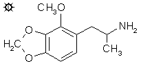

# 134 [MMDA-3a](/药物/MMDA-3a.md)

[上一个](/文档/PiHKAL/pihkal133.md) [返回](/文档/PiHKAL/index.md) [下一个](/文档/PiHKAL/pihkal135.md)

**2-METHOXY-3,4-METHYLENEDIOXYAMPHETAMINE (2-甲氧基-3,4-亚甲二氧基苯丙胺)**

|  |
| --- |

**合成：** 向 100 g 2,3-二羟基苯甲醚溶于 1 L 干丙酮的溶液中，加入 110 g 粉末状无水碳酸钾，随后加入 210 g 二碘甲烷。将其在蒸汽浴上加热至回流。突然出现固相，然后维持温和回流三天，在此期间最初形成的大部分重质固体重新溶解。过滤反应混合物以除去不溶性盐，并用热丙酮洗涤这些盐。合并的母液和洗液在真空下除去溶剂，留下固体残留物。用几份沸腾的己烷浸出该残留物。合并这些浸出液，并在真空下除去溶剂，得到 53.6 g 2,3-亚甲二氧基苯甲醚，为白色晶体，具有强烈的辛辣气味。

将 120 g N-甲基甲酰苯胺和 137 g 三氯氧磷的混合物在环境温度下孵育 0.5 小时，然后加入 53 g 粗制 2,3-亚甲二氧基苯甲醚。深色反应混合物在蒸汽浴上加热 2 小时，然后倒入装满碎冰的烧杯中。搅拌直至水解完全，过滤除去分离出的黑色、几乎结晶的粘稠物。用乙二醇琥珀酸酯柱在 190 °C 下对 53.6 g 粗产物进行气相色谱分析。出现三个峰且基线分离。7.8 分钟处的主峰占产物的 82%，为 2-甲氧基-3,4-亚甲二氧基苯甲醛。12.0 分钟处的次峰占产物的 16%，为位置异构体 4-甲氧基-2,3-亚甲二氧基苯甲醛。微量组分 (2%) 位于中间（9.5 分钟处），为肉豆蔻醛。两种主要苯甲醛的熔点差异足以作为鉴别手段。主要产物直接从黑色粘稠物中通过沸腾环己烷反复萃取获得，除去溶剂后，得到 33.1 g 黄色产物。将其从沸腾环己烷中再重结晶一次，得到 24.4 g 2-甲氧基-3,4-亚甲二氧基苯甲醛，为淡黄色晶体，熔点为 103-105 °C。合并母液，并在真空下除去所有挥发物后，产生琥珀色固体，重结晶后提供淡黄色晶体。将其从环己烷中再结晶一次，得到 4.1 g 4-甲氧基-2,3-亚甲二氧基苯甲醛，熔点为 85-86 °C。后一种异构体用于合成 MMDA-3b。

向 3.5 g 2-甲氧基-3,4-亚甲二氧基苯甲醛溶于 14 g 乙酸的溶液中，加入 1.4 g 无水乙酸铵和 2.3 mL 硝基乙烷。将混合物加热至回流并保持 35 分钟。然后加入 40 mL 水淬灭，析出橙色胶状固体。过滤除去，并从 50 mL 沸腾甲醇中重结晶。在冰浴中冷却几小时后，过滤除去亮黄色晶体，用甲醇洗涤并风干至恒重，得到 2.15 g 1-(2-甲氧基-3,4-亚甲二氧基苯基)-2-硝基丙烯。熔点为 106-107 °C。从乙醇中重结晶将熔点提高至 109.5-110.5 °C。

将 2.2 g 氢化铝锂在 300 mL 无水乙醚中的悬浮液在惰性气氛下加热至温和回流。回流冷凝液通过含有 1.95 g 1-(2-甲氧基-3,4-亚甲二氧基苯基)-2-硝基丙烯的改良索氏提取器套管，在 0.5 小时内将其作为饱和乙醚溶液有效地加入到反应混合物中。混合物保持回流 16 小时。用冰浴冷却至 0 °C 后，通过加入 1.5 N 硫酸破坏过量的氢化物。分离各相，水相用 2x100 mL 乙醚洗涤。向水相中加入 50 g 酒石酸钾钠，随后加入足够的 25% 氢氧化钠使 pH >9。然后用 3x100 mL 二氯甲烷萃取，并真空除去合并萃取液中的溶剂。残留的白色油状物溶于 250 mL 无水乙醚中，并通入无水氯化氢气体至饱和。产生一批 2-甲氧基-3,4-亚甲二氧基苯丙胺盐酸盐 (MMDA-3a) 的白色微晶，过滤除去，用乙醚洗涤，并风干至恒重 1.2 g。熔点为 154-155 °C。

**给药剂量：** 20 - 80 mg。

**药效时长：** 10 - 16 小时。

**定性评论：** （20 mg）我大约在一小时后意识到有感觉，又过了一小时，我发现自己突然陷入了奇妙的昆虫世界。就在一堆砖头旁边，我看到了一只尺蠖，我带着极大的温柔和耐心把它捡起来，观察它的前足和后足，最后把它放回去，看着它适应环境。砖头上还有一只蜘蛛，我不由自主地看着它活动。我很感激自己没有被观察。时间过得很慢，我觉得我应该有意地放慢动作，以免让自己精疲力竭。

（40 mg）这在服药后一到两小时之间发展起来，有相当大的身体震颤。说话将能量向外引导，我开始意识到周围有一个视觉上闪闪发光的世界。我开始下降得太快了；如果能去到更高的地方会很有趣。到傍晚时分，我只剩下一些残留的身体过敏意识，还有轻微的腹泻。我完全不确定该把这种药比作什么。它很温和。

（60 mg）有柔和的视觉效果——睁着眼睛东西在动，闭着眼睛音乐很棒。似乎有一些持久的兴奋，但这并没有妨碍睡眠。然而，第二天早上，我仍然处于药效中。一种很好的化合物。

**延伸和评论：** MMDA-3a 这个术语感觉很复杂，但这个代号是有原因的。如前所述，MMDA 是甲氧基 (Methoxy, M)、亚甲二氧基 (Methylenedioxy, MD) 和苯丙胺 (Amphetamine, A) 的首字母缩写。对于一个苯丙胺分子，有六种方法可以将这两个基团连接到芳香环上。数字 1-6 已经被分配给将三个甲氧基连接到苯丙胺分子上的六种方法（对于三甲氧基苯丙胺，TMA 系列），我决定对其亚甲二氧基对应物遵循相同的惯例。然而，有两个 #3（甲氧基和亚甲二氧基可以以两种不同的方式连接到一排的三个氧原子上，而三个甲氧基只能以一种方式连接），并且不可能有 #6（因为亚甲二氧基必须具有两个相邻的氧，而在 TMA-6 的 2,4,6-取向中找不到这样的氧）。因此，有两个可能的 MMDA-3，将其中的一个命名为“a”而另一个命名为“b”就变得合理，甚至必要了。“a”取向天然存在于精油 croweacin（1-烯丙基-2-甲氧基-3,4-亚甲二氧基苯）中。因此，这允许 MMDA-3a 被归类为一种“精油苯丙胺”，因为它原则上可以通过体内肝脏胺化产生。但在实验室中，croweacin 肯定不是此合成中实用的起始原料。

我听说过一些临床试验在相当高的水平上探索了 MMDA-3a，但我没有明确的引语可以提供，细节也很粗略。三次 80 毫克的试验，和一次 100 毫克的试验，都在体验的数量和质量上与 100 微克的 LSD 进行了比较。然而，发生了两件可能与这些试验有关也可能无关的事件；一名受试者在实验五天后有自发的“高峰体验”，另一名受试者进行了象征性的自杀企图。

而且，与 MMDA-2 一样，MMDA-3a 的 2-碳“苯乙胺”类似物和 4-碳 RARIADNES 类似物都已制备。苯乙胺类似物是通过将 7.6 g 上述苯甲醛与硝基甲烷缩合（在乙酸中用乙酸铵催化，得到 5.4 g 硝基苯乙烯，从甲醇重结晶熔点 115.5-116.5 °C），随后用氢化铝锂还原（在乙醚中）制备的。产物 2-甲氧基-3,4-亚甲二氧基苯乙胺盐酸盐 (2C-3a) 熔点为 143-145 °C。进行了一系列主观评估，有报告称在 40 至 120 毫克范围内有边缘效应。在 40 毫克时，也许有一点精神振奋剂的迹象；在 65 毫克时，情绪愉快；在 80 毫克时，大约在一个半小时的时候注意到短暂的感觉异常刺痛，在 120 毫克时，大约在一小时的时候差不多，然后就什么都没有了。在三倍剂量范围内这种效果变化如此温和的事实表明，这种化合物作为抗抑郁药可能有一定的价值。如果知道它是否阻断血清素再摄取将会很有趣！

4-碳类似物也同样制备（从醛和硝基丙烷出发，但使用过量 100% 的乙酸叔丁铵作为试剂，异丙醇作为溶剂，得到亮黄色晶体，从 25 倍体积的沸腾甲醇中重结晶熔点 105.5-106.5 °C），随后还原（在乙醚中用氢化铝锂）得到 1-(2-甲氧基-3,4-亚甲二氧基苯基)-2-氨基丁烷盐酸盐 (4C-3a)，熔点为 183-185 °C，此前在 173 °C 烧结。这种材料在高达 3.5 毫克的剂量下被品尝过，未发现任何异常。没有进行任何更高剂量的试验。

[上一个](/文档/PiHKAL/pihkal133.md) [返回](/文档/PiHKAL/index.md) [下一个](/文档/PiHKAL/pihkal135.md)