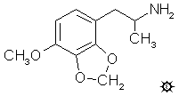

# 135 [MMDA-3b](/药物/MMDA-3b.md)

[上一个](/文档/PiHKAL/pihkal134.md) [返回](/文档/PiHKAL/index.md) [下一个](/文档/PiHKAL/pihkal136.md)

**4-METHOXY-2,3-METHYLENEDIOXYAMPHETAMINE (4-甲氧基-2,3-亚甲二氧基苯丙胺)**

|  |
| --- |

**合成：** 将 7.0 g 98% 纯度（通过 GC）的 4-甲氧基-2,3-亚甲二氧基苯甲醛（其制备见 MMDA-3a）溶于 30 mL 冰乙酸的溶液用 5 mL 硝基乙烷和 3 g 无水乙酸铵处理，并在蒸汽浴上加热 3.5 小时。向热溶液中加水至浑浊，然后偶尔搅拌使其冷却至室温。形成适量的黄色晶体，过滤除去，用乙酸水溶液洗涤并风干至恒重。得到 4.6 g 1-(4-甲氧基-2,3-亚甲二氧基苯基)-2-硝基丙烯，熔点为 95-102 °C。从乙醇中重结晶将其收紧至 97-101.5 °C。红外光谱与其位置异构体 1-(2-甲氧基-3,4-亚甲二氧基苯基)-2-硝基丙烯完全不同。

将 7.0 g 氢化铝锂在 1 L 无水乙醚中的悬浮液在惰性气氛下加热至温和回流。回流冷凝液通过含有 6.15 g 1-(4-甲氧基-2,3-亚甲二氧基苯基)-2-硝基丙烯的索氏提取器套管，从而将硝基丙烯作为饱和溶液有效地加入。混合物保持回流 16 小时。用冰浴冷却至 0 °C 后，通过加入 800 mL 1.5 N 硫酸破坏过量的氢化物。分离各相，水相用 2x100 mL 乙醚洗涤。向此相中加入 175 g 酒石酸钾钠，随后加入足够的 25% 氢氧化钠使 pH >9。然后用 3x100 mL 二氯甲烷萃取，并真空除去合并萃取液中的溶剂。残留的灰白色油状物重 5.4 g，溶于 250 mL 无水乙醚中并通入无水氯化氢气体至饱和。产生一批略带粘性的白色固体，最终变成颗粒状且松散。过滤除去，用乙醚洗涤，风干得到 5.56 g 4-甲氧基-2,3-亚甲二氧基苯丙胺盐酸盐 (MMDA-3b)，熔点为 196-199 °C。来自丙醇的小样熔点为 199-200 °C，来自硝基甲烷/甲醇 (5:1) 的样品熔点为 201-202 °C。

**给药剂量：** 大于 80 mg。

**药效时长：** 未知。

**定性评论：** （60 mg）确实有效。定性上像 MDA；定量上可能较少。

（80 mg）并不比 60 mg 更有效。

**延伸和评论：** 关于 MMDA-3b 在人体中的活性，目前所知就这些。非常非常少。据我所知，从未尝试过超过 80 毫克的剂量，而且上述试验是在 20 多年前进行的。毫无疑问，3b 的效果不如 3a，但没人能说出差多少。文献陈述它是三倍低效，但这仅仅基于刚好高于阈值水平的相对反应。这里的效果与 MMDA-3a 在 20 毫克时报道的效果大致相似，但由于是由不同的人报告的，因此很难准确比较。科学文献中绝对没有关于 MMDA-3b 的动物研究报告。而且 MMDA-3b 的 2-碳或 4-碳类似物甚至都没有被制备出来。

剩下的已制备的 MMDA 类似物是 2,3,6-异构体。流程图从芝麻酚（3,4-亚甲二氧基苯酚）开始，用碘甲烷甲基化，使用丁基锂和 N-甲基甲酰苯胺转化为醛（将新基团直接置于两个氧原子之间，得到 2,3-亚甲二氧基-6-甲氧基苯甲醛），与硝基乙烷反应生成硝基苯乙烯，并在乙醚中用氢化铝锂还原。产物 6-甲氧基-2,3-亚甲二氧基苯丙胺盐酸盐 (MMDA-5) 在人体中几乎未被探索。我听到一份报告说 30 毫克有适度的活性，但不是特别愉快的体验。另一个人告诉我他尝试了 15 毫克，但他忘了提到是否有任何效果。我自己还没试过。但是，我屈服于实验药理学家的压力，为他们的动物行为研究的“Y 轴”提供一个数字。所以我对自己说，如果这个在 30 毫克有效，而麦斯卡林在 300 毫克有效，为什么不说它是麦斯卡林活性的 10 倍呢？所以我这么说了。但我对这个数字绝对没有信心。

如果说 MMDA-5 的信息稀少，看看位置异构体 MMDA-4，我在其类似物 TMA-4 下讨论过。这里一无所知，因为该化合物本身就是未知的。还没有人找到制造它的方法。

[上一个](/文档/PiHKAL/pihkal134.md) [返回](/文档/PiHKAL/index.md) [下一个](/文档/PiHKAL/pihkal136.md)