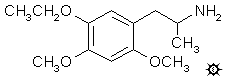

# 136 [MME](/药物/MME.md)

[上一个](/文档/PiHKAL/pihkal135.md) [返回](/文档/PiHKAL/index.md) [下一个](/文档/PiHKAL/pihkal137.md)

**2,4-DIMETHOXY-5-ETHOXYAMPHETAMINE (2,4-二甲氧基-5-乙氧基苯丙胺)**

|  |
| --- |

**合成：** 将 166 g 乙基香兰素（4-乙氧基-3-甲氧基苯甲醛）溶于 600 mL 冰乙酸中，并安排好可以持续进行磁力搅拌，并根据需要用外部冰浴冷却。然后以允许温度保持在 25 °C 的速率，在持续使用冰浴的情况下，共加入 218 g 40% 过乙酸的乙酸溶液。温度不应低于 23 °C（反应停止），但绝对不能超过 29 °C（反应无法控制）。添加大约需要 1.5 小时。反应结束时，加入 3 倍体积的水，并用固体碳酸钾中和所有酸。将大约 3 L 黑色粘稠物用 2x400 mL 沸腾乙醚萃取，合并并蒸发后，得到 60 g 黑色油状物，这是一种主要含有中间体甲酸酯和产物酚的混合物。将其用 300 mL 10% 氢氧化钠处理，并在蒸汽浴上加热 1 小时。冷却后，用 2x150 mL 二氯甲烷洗涤（丢弃），用盐酸酸化，并用 3x200 mL 乙醚萃取。合并的萃取液用 2x200 mL 饱和碳酸氢钠洗涤，然后在真空下除去乙醚。残留的黑色油状物 41.3 g 在 1.0 mm/Hg 下蒸馏，得到 140-145 °C 沸腾的馏分，为淡琥珀色油状物，会结晶。分离出的 4-乙氧基-3-甲氧基苯酚重 29.1 g。分析样品的熔点为 45.5-46 °C。该产物可用于合成 MME（见下文）或用于合成 EME（见单独配方）。将 0.5 g 该苯酚和 0.5 g 异氰酸甲酯溶于含有 1 mL 二氯甲烷的 10 mL 己烷溶液中，用三滴三乙胺处理。大约 1 小时后，自发形成白色晶体 4-乙氧基-3-甲氧基苯基 N-甲基氨基甲酸酯，熔点为 104-105 °C。

将 14 g 蒸馏过的固体 4-乙氧基-3-甲氧基苯酚溶于 20 mL 甲醇的溶液用 5.3 g 氢氧化钾溶于 100 mL 热甲醇的溶液处理。然后加入 11.9 g 碘甲烷，混合物在回流温度下保持 2 小时。反应以 3 倍体积的水淬灭，加入 1 倍体积的 5% 氢氧化钠使其呈强碱性，并用 2x150 mL 乙醚萃取。合并萃取液并在真空下除去溶剂，得到 9.7 g 2,4-二甲氧基-1-乙氧基苯，为澄清、类白色油状物，GC 显示为单峰。这种醚的可接受的替代合成方法是 2,4-二甲氧基苯酚的乙基化，这在 TMA-4 的配方中有描述。折射率为 nD25 = 1.5210。

将 17.3 g N-甲基甲酰苯胺和 19.6 g 三氯氧磷的混合物在室温下静置直至产生强烈的红色（约 0.5 小时）。然后加入 9.2 g 2,4-二甲氧基-1-乙氧基苯，混合物在蒸汽浴上加热 2 小时。将黑色粘稠产物倒在 800 mL 碎冰上，并进行机械搅拌。深色逐渐褪去变成黄色溶液，然后开始形成黄色晶体。静置过夜后，过滤除去这些晶体并尽可能抽干，得到 16 g 湿的粗产物。将其溶于 100 mL 沸腾甲醇中，冷却后析出蓬松的白色晶体 2,4-二甲氧基-5-乙氧基苯甲醛。干重为 8.8 g，熔点为 107-108 °C。母液经 GC 检视未显示异构体醛，但在原始水过滤的二氯甲烷萃取物中可见少量异构体的迹象。从甲醇母液中作为第二批获得的 0.7 g 醛样品与 0.5 g 丙二腈一起溶于 20 mL 热乙醇中。加入 3 滴三乙胺几乎立即生成亮黄色晶体，过滤和乙醇洗涤后为 1.4 g，熔点为 134-135.5 °C。从甲苯中重结晶得到 2,4-二甲氧基-5-乙氧基苯亚甲基丙二腈的分析样品，熔点为 135-136 °C。

将 6.7 g 2,4-二甲氧基-5-乙氧基苯甲醛溶于 23 g 冰乙酸的溶液用 3.3 g 硝基乙烷和 2.05 g 无水乙酸铵处理。混合物在蒸汽浴上加热 2.5 小时。向冷却的溶液中加入少量水产生凝胶，这是起始醛和产物硝基苯乙烯的混合物。倾析出溶剂，并在甲醇下研磨，得到黄色固体，熔点为 76-84 °C。从 30 mL 沸腾甲醇中重结晶，过滤并风干后，得到 4.3 g 黄色固体，熔点为 90-92 °C。仍然存在明显的醛，最终通过再次从甲苯中重结晶除去。产物 1-(2,4-二甲氧基-5-乙氧基苯基)-2-硝基丙烯为亮黄色晶体，熔点为 96-97 °C。分析样品在真空中干燥 24 小时以完全驱除顽固残留的微量甲苯。分析值 (C13H17NO5) C,H。

在氦气氛围下，向 1.6 g 氢化铝锂在 120 mL 无水乙醚中的温和回流悬浮液中，通过让冷凝乙醚滴入含有硝基苯乙烯的分流索氏提取器套管中，加入 2.1 g 1-(2,4-二甲氧基-5-乙氧基苯基)-2-硝基丙烯。这有效地将温热的硝基苯乙烯饱和溶液逐滴加入到反应混合物中。继续回流 6 小时，将反应瓶冷却至 0 °C 后，通过小心加入 1.5 N 硫酸破坏过量的氢化物。当水层和乙醚层最终澄清时，将它们分离，并在水相部分溶解 40 g 酒石酸钾钠。然后加入氢氧化钠水溶液直至 pH >9，然后用 3x200 mL 二氯甲烷萃取。真空蒸发溶剂产生 1.6 g 琥珀色油状物，将其溶于 300 mL 无水乙醚中并通入无水氯化氢气体至饱和。立即出现白色浑浊，随后生成油状固体，进一步通入氯化氢后变成细微、松散的白色粉末。过滤除去，用乙醚洗涤，风干得到 1.6 g 2,4-二甲氧基-5-乙氧基苯丙胺盐酸盐 (MME)，熔点为 171-172 °C。分析值 (C13H22ClNO3) C,H,N。

**给药剂量：** 40 mg 及以上。

**药效时长：** 大概 6 - 10 小时。

**定性评论：** （40 mg）在一小时的时候有一个真正的阈值，在第二小时，当我走在第 24 街时，有一个实在的 [1\+](shulgin_rating_scale.shtml)。到第三小时，它达到或略低于 [\+\+](shulgin_rating_scale.shtml)，如果再强烈一点，可能会有一系列有趣的效应。我在第 5 小时意外腹泻，到第 6 小时我在恢复，到第 8 小时我基本上恢复了。这一天非常令人鼓舞，必须在 50 或 60 毫克下重新尝试。

**延伸和评论：** 这是极少数我实际上冒险（并夺走）实验动物生命的化合物之一。我仍然对那个科学神话印象深刻，即没有动物支持数据，药理学研究实际上是不可接受的。我可以进入大学的一个实验小鼠群落。我给一只小鼠注射了 300 mg/Kg 的剂量，腹腔注射。这听起来很科学。但这真正的意思是，我用左手抓住小鼠的颈背，然后翻转手，使小鼠腹部朝上。我用无名指按住后腿以保持相对不动。通常这时以前没有尿的地方会有一些尿液明显可见。我拿了一个装有极细针头的注射器，里面装着大约 8 毫克溶于极少量水溶液的 MME，把针头推入小鼠大约肚脐的位置（如果能看到小鼠肚脐的话），然后我把针头往回拉一点，这样针头末端除了腹膜的松散褶皱外什么都没有。然后我推入注射器柱塞，有效地将水溶液喷射到肠道周围的区域。我把小鼠扔回笼子，观察。在这种情况下，小鼠进入了一系列抽搐性痉挛（行话称为阵挛），五分钟后它死了。

被杀戮的欲望点燃，我抓起另一只小鼠，用 175 mg/Kg 的剂量钉住它。6 分钟内死亡。另一只 107 mg/Kg。5 分钟内死亡。另一只 75 mg/Kg。嗯，它看起来病了一会儿，有些颤抖，然后似乎好多了。最后一场谋杀狂欢。我以 100 mg/Kg 腹腔注射了 5 只小鼠，看着其中 4 只在 20 分钟内死去。我手里拿着唯一的幸存者，走到实验室外面，把它放生在山坡上。它跑掉了，我再也没有见过它。

以七条我永远无法挽回的宝贵生命为代价，我学到了什么？屁都没学到。也许 LD-50 在 60 或 80 mg/Kg 左右。这是针对小鼠的，不是针对人的。我打算服用 300 微克这种完全未经测试的化合物作为初始试验剂量，无论 LD-50 是 600 mg/Kg 还是 6 mg/Kg，对我来说都没有区别。我还是服用了我的试验剂量，绝对没有任何效果，我再也没有杀过另一只小鼠。不，那完全是不诚实的。去年冬天有田鼠入侵，从厨房水槽下垃圾桶后面的地板洞里钻上来，我堵住了洞，但也放了一些捕鼠器。我抓住了几只。但再也不会为了能够说“这种化合物在小鼠中的 LD-50 为 70 mg/Kg”这样简单而愚蠢的理由去杀生了。谁在乎？为什么要杀生？

但是，这项关于 MME 的简单研究得出了两件非常有价值的事情。一件当然是它是一种活性化合物，因此值得进一步关注。另一件更重要的是，作为 TMA-2 的三种可能的乙氧基同系物之一，它的活性低于 MEM。第三种可能的乙氧基化合物是 EMM，正如本书其他地方会发现的那样，它的活性甚至更低。因此，只有 MEM 保持了 TMA-2 的效力，正是这一最初的观察真正将我的注意力集中在 4-位的重要性上。

[上一个](/文档/PiHKAL/pihkal135.md) [返回](/文档/PiHKAL/index.md) [下一个](/文档/PiHKAL/pihkal137.md)