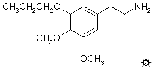

# 137 [MP](/药物/MP.md)

**METAPROSCALINE; 3,4-DIMETHOXY-5-(n)-PROPOXYPHENETHYLAMINE (间丙氧基麦斯卡林；3,4-二甲氧基-5-(n)-丙氧基苯乙胺)**

[上一个](/文档/PiHKAL/pihkal136.md) [返回](/文档/PiHKAL/index.md) [下一个](/文档/PiHKAL/pihkal138.md)

|  |
| --- |

**合成：** 混合 96 g 5-溴香兰素和 90 mL 25% 氢氧化钠。溶液几乎完全溶解时，突然有大量沉淀析出。用 200 mL 水稀释。然后加入 300 mL 二氯甲烷、85 g 碘甲烷和 3 g 癸基三乙基氯化铵。非均相混合物剧烈搅拌 2 天。分离有机相，水相用 100 mL 二氯甲烷萃取一次。合并有机相和萃取液，用水洗涤，真空除去溶剂。残留物重 46.3 g 并自发结晶。将其从 40 mL 甲醇中重结晶，得到 34 g 3-溴-4,5-二甲氧基苯甲醛，为白色晶体，熔点为 60.5-61 °C。从母液中获得了额外的 4 g 产物。上述水相酸化后，经异丙醇/丙酮重结晶，得到 13.2 g 回收的 5-溴香兰素，熔点为 166-169 °C。

将 38.7 g 3-溴-4,5-二甲氧基苯甲醛和 17.2 g 环己胺的混合物用明火加热至约 120 °C，直至看起来没有水为止。将残留物置于真空 (0.2 mm/Hg) 下并在 146-160 °C 蒸馏，得到 44.6 g 3-溴-N-环己基-4,5-二甲氧基苯亚甲基亚胺，为澄清油状物，不结晶。红外光谱中的亚胺伸缩振动在 1640 cm-1 处。分析值 (C15H20BrNO2) C,H。

将 31.6 g 3-溴-N-环己基-4,5-二甲氧基苯亚甲基亚胺溶于 300 mL 无水乙醚的溶液置于氦气氛围中，磁力搅拌，并用干冰/丙酮浴冷却。然后在 2 分钟内加入 71 mL 1.55 M 的正丁基锂的正己烷溶液。反应混合物变浑浊，形成浅色沉淀，在进行到一半时似乎最重。搅拌保持容易，并继续搅拌 10 分钟。然后一次性加入 35 mL 硼酸丁酯。沉淀溶解，搅拌的溶液恢复至室温。然后加入 200 mL 含有 20 g 硫酸铵的水溶液。分离乙醚层，用饱和硫酸铵溶液洗涤，并在真空下除去有机溶剂。残留物溶于 250 mL 70% 甲醇中，分次加入 14 mL 30% 过氧化氢。该反应放热非常剧烈，继续搅拌 1 小时。然后将反应混合物加入 500 mL 水中，析出白色固体。将该中间体 N-环己基-3,4-二甲氧基-5-羟基苯亚甲基亚胺的小样品从甲醇中重结晶为白色晶体，熔点为 148-149 °C，红外光谱显示 C=N 键在 1635 和 1645 cm-1 处为双峰。将这些湿固体悬浮在 200 mL 5% 盐酸中，并在蒸汽浴上加热 1 小时。继续搅拌直至反应再次恢复室温，然后用 2x100 mL 二氯甲烷萃取。合并这些萃取液，依次用 2x75 mL 稀氢氧化钠萃取。水相萃取液用盐酸重新酸化，并用 2x100 mL 二氯甲烷重新萃取。合并这些萃取液，真空除去溶剂，得到棕色粘稠油状残留物。在 0.2 mm/Hg 下于 105-120 °C 蒸馏，得到 8.8 g 3,4-二甲氧基-5-羟基苯甲醛作为馏出物，凝固成白色晶体。从甲苯/己烷中重结晶得到熔点为 64-65 °C 的样品。文献熔点有几个，范围从约 60 °C 到约 70 °C。

将 4.7 g 3,4-二甲氧基-5-羟基苯甲醛溶于 75 mL 丙酮的溶液用 6.0 g 粉末状碘化钾、16 mL (21 g) 溴丙烷和 7.0 g以此细粉末状无水碳酸钾处理，该混合物在蒸汽浴上回流 15 小时。将反应混合物加入 1 L 水中，调至强碱性，并用 3x100 mL 二氯甲烷萃取。合并萃取液，用 5% 氢氧化钠洗涤，真空除去溶剂，得到 8.8 g 黄色油状物，无疑含有碘丙烷。该残留物在 0.15 mm/Hg 下于 133-145 °C 蒸馏，得到 4.5 g 3,4-二甲氧基-5-(n)-丙氧基苯甲醛，为白色油状物，不结晶。有明显的釜残。通过 TLC（硅胶，二氯甲烷为展开剂）可见，该产物明显不纯，含有一种次要的、移动较慢的组分，不是起始苯酚。将少量不纯的醛与对甲氧基苯胺熔融产生结晶苯胺，经稀酸水解后，产生不含此杂质的醛样品。但由于该样品也保持油状，因此在以下制备中使用了上述粗产物。

向 3.8 g 3,4-二甲氧基-5-(n)-丙氧基苯甲醛溶于 50 mL 硝基甲烷的溶液中，加入 0.5 g 无水乙酸铵。将其回流 50 分钟。真空除去过量的硝基甲烷，向残留物中加入 2 倍体积的沸腾甲醇。将热溶液从一些残留的不溶物中倾析出来，冷却后自发结晶。过滤除去这些固体，用甲醇少量洗涤并风干，得到 3.3 g 3,4-二甲氧基-β-硝基-5-(n)-丙氧基硝基苯乙烯黄色晶体，熔点为 79-81 °C。从甲醇或环己烷中重结晶既没有提高熔点，也没有使产物从熔体中可见的残留乳光中释放出来。分析值 (C13H17NO5) C,H。

将 1.5 g 氢化铝锂在 30 mL 无水四氢呋喃中的溶液在氦气下冷却至 0 °C 并剧烈搅拌。逐滴加入 1.0 mL 100% 硫酸，随后在 5 分钟内逐滴加入 2.3 g 3,4-二甲氧基-β-硝基-5-(n)-丙氧基硝基苯乙烯溶于 10 mL 无水四氢呋喃的溶液。混合物在 0 °C 下搅拌一会儿，然后在蒸汽浴上加热回流。再次冷却后，逐滴加入异丙醇破坏过量的氢化物，随后加入约 10 mL 10% 氢氧化钠，足以将固体转化为白色颗粒状。过滤除去这些固体，滤饼用异丙醇洗涤，合并母液和滤液，真空除去溶剂得到琥珀色油状物。将该残留物加入 75 mL 稀硫酸中，产生胶状不溶相，用刮刀物理除去。水相用 3x50 mL 二氯甲烷洗涤。然后用 25% 氢氧化钠使其呈碱性，并用 2x75 mL 二氯甲烷萃取。从这些合并的萃取液中除去溶剂，残留物在 0.2 mm/Hg 下于 106-116 °C 蒸馏，得到 1.3 g 无色液体产物。将其溶于 4 mL 异丙醇中，用约 20 滴浓盐酸中和，并在持续搅拌下缓慢加入 4 倍体积的无水乙醚稀释。白色结晶盐自发析出，过滤分离，先用异丙醇洗涤，再用乙醚洗涤，风干得到 1.3 g 3,4-二甲氧基-5-(n)-丙氧基苯乙胺盐酸盐 (MP)，熔点为 170-171 °C。分析值 (C13H22ClNO3) C,H。

**给药剂量：** 大于 240 mg。

**药效时长：** 未知。

**定性评论：** （160 mg）在三到四小时的时候可能有一些干扰，但即使有也非常轻微。

（240 mg）没有任何效果。

**延伸和推断：** 将间位氧上的碳链从两个延长到三个（从间乙氧基麦斯卡林到间丙氧基麦斯卡林）导致活性丧失，这阻碍了在分子的这个特定点上的进一步探索。异丙基类似物（3,4-二甲氧基-5-(i)-丙氧基苯乙胺，metaisoproscaline, MIP）已经开始并进行到醛的阶段，但随着发现间丙氧基麦斯卡林没有活性而被放弃。还有其他事情要做。

[上一个](/文档/PiHKAL/pihkal136.md) [返回](/文档/PiHKAL/index.md) [下一个](/文档/PiHKAL/pihkal138.md)