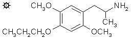

# 138 [MPM](/药物/MPM.md)

**2,5-DIMETHOXY-4-(n)-PROPOXYAMPHETAMINE (2,5-二甲氧基-4-(n)-丙氧基苯丙胺)**

[上一个](/文档/PiHKAL/pihkal137.md) [返回](/文档/PiHKAL/index.md) [下一个](/文档/PiHKAL/pihkal139.md)

|  |
| --- |

**合成：** 向 68 g 2,5-二甲氧基苯甲醛溶于 250 mL 已加热至 25 °C 并充分搅拌的冰乙酸溶液中，逐滴加入 86 g 40% 过乙酸溶液（在乙酸中）。反应放热，加料速度取决于将内部温度维持在 28 °C 几度以内的需要。根据需要使用外部冷却。添加耗时 1 小时，当反应明显完成时（温度不再升高），将整个反应混合物加入 3 倍体积的水中。用固体碳酸钾中和过量的酸。深色溶液用 3x100 mL 乙醚萃取，合并萃取液，真空除去溶剂，得到 59 g 粗制甲酸 2,4-二甲氧基苯酯。将其悬浮在 200 mL 10% 氢氧化钠中，混合物在蒸汽浴上加热 1 小时。冷却后，反应混合物用 2x200 mL 二氯甲烷洗涤，用盐酸酸化，并用 3x200 mL 二氯甲烷萃取。合并萃取液并在真空下除去溶剂。残留 47.4 g 2,5-二甲氧基苯酚，颜色为深琥珀色，但澄清且流动。经 GC 分析均质，NMR 完全正确。无需进一步纯化即可使用。

向 3.08 g 2,5-二甲氧基苯酚溶于 20 g 甲醇的溶液中，加入 1.26 g 片状氢氧化钾溶于 20 g 热甲醇的溶液。然后加入 2.46 g 正溴丙烷，混合物在蒸汽浴上回流 2 小时。将其在 5 倍体积的水中淬灭，用 10% 氢氧化钠调至强碱性，并用 3x100 mL 二氯甲烷萃取。从合并的萃取液中除去溶剂，留下 2.0 g 1,4-二甲氧基-2-(n)-丙氧基苯，为澄清、琥珀色油状物。红外光谱适当，不存在苯酚，该残留物无需进一步纯化或表征即可用于以下反应。

将 3.5 g N-甲基甲酰苯胺和 4.0 g 三氯氧磷的混合物在室温下保持 0.5 小时，产生深红色。向其中加入 2.0 g 1,4-二甲氧基-2-(n)-丙氧基苯，混合物在蒸汽浴上保持 1.75 小时。然后将其倒在 400 mL 碎冰上，保持剧烈搅拌直至深色复合物完全分解。让此水性混合物静置过夜，过滤除去形成的粗醛固体，水洗，并尽可能抽干。将此 2.0 g 湿材料从 20 mL 沸腾甲醇中结晶，过滤并干燥至恒重后，得到 1.4 g 2,5-二甲氧基-4-(n)-丙氧基苯甲醛，为红褐色固体，熔点为 97-98 °C。向该结晶的甲醇母液中加入一克丙二腈和几滴三乙胺。最终加入少量水促进晶体分离，取出后熔点为 150-152 °C。从甲苯中重结晶得到金色的苯亚甲基丙二腈晶体，熔点为 153.5-155 °C，但熔体保持微浑浊。

向 1.4 g 2,5-二甲氧基-4-(n)-丙氧基苯甲醛和 0.65 g 硝基乙烷溶于 4.4 g 冰乙酸的溶液中，加入 0.4 g 无水乙酸铵，混合物在蒸汽浴上加热 5 小时。加入适量的水并用玻璃棒摩擦产生晶种。反应混合物用约 5 mL 水稀释，接种，并在室温下静置过夜。生成结晶产物，过滤除去并风干。从而获得 0.6 g 1-(2,5-二甲氧基-4-(n)-丙氧基苯基)-2-硝基丙烯，为橙黄色晶体，熔点为 83-84 °C。向母液中加水提供了额外的 0.3 g 橙色固体，证明主要是未反应的起始醛。

在氦气氛围下，向搅拌的、温热的 0.5 g 氢化铝锂在 20 mL 无水乙醚中的悬浮液中，加入溶于少量无水乙醚的 0.6 g 1-(2,5-二甲氧基-4-(n)-丙氧基苯基)-2-硝基丙烯。混合物加热并搅拌几小时，用 30 mL 1.5 N 硫酸分解过量的氢化物。分离两层，并在水相部分溶解 15 g 酒石酸钾钠。然后加入氢氧化钠水溶液直至 pH >9，然后用 3x50 mL 二氯甲烷萃取。真空除去溶剂得到 0.7 g 琥珀色油状物，将其溶于无水乙醚中并通入无水氯化氢气体至饱和。没有晶体形成，因此真空除去乙醚，留下的残留物凝固成晶体，该晶体不再溶于乙醚。然而，它们非常溶于氯仿。将其在干乙醚下研磨，过滤除去，风干得到 0.35 g 2,5-二甲氧基-4-(n)-丙氧基苯丙胺盐酸盐 (MPM)，熔点为 123 - 125 °C。

**给药剂量：** 30 mg 或更多。

**药效时长：** 可能很短。

**定性评论：** （15 mg）这仅仅是勉强达到阈值。充其量是边缘性的醉酒感。这个水平产生的反应比 11 mg 的 MEM 试验要少，所以丙氧基的效力下降了。四个半小时后，无论那一点点感觉是什么，我都已经脱离了。

（30 mg）到第二个小时中期，我达到了有效的 +1。我无法确定其性质——闭上眼睛就会消失，如果我在看戏剧或电影也会消失。看看它能发展到什么程度会很有趣。第七个小时，完全清醒。

**延伸和评论：** TMA-2 和 MEM 的 4-丙氧基同系物显然活性较低，这使我不愿在这个方向上投入太多精力。制备了另外三种这种模式的材料，要么显示活性更低，要么根本没有进行测定。这些是 4-异丙氧基异构体 (MIPM)、(n)-丁氧基同系物 (MBM) 和 (n)-戊氧基同系物 (MAM)。它们几乎不值得单独列出配方，因为它们的制备方式都与描述 MPM 的方式相似。

对于 MIPM 的制备，上述苯酚 2,5-二甲氧基苯酚在甲醇氢氧化钾中用溴代异丙烷异丙基化，得到油状的 2,5-二甲氧基-1-(i)-丙氧基苯。这在标准 Vilsmeier 条件下形成苯甲醛，从己烷中熔点为 77-78 °C，并产生熔点为 171.5-173 °C 的黄色丙二腈衍生物。来自乙酸中硝基乙烷的硝基苯乙烯呈橙色，从甲醇或己烷中熔点为 100-101 °C。这在乙醚中用氢化铝锂还原，得到 2,5-二甲氧基-4-(i)-丙氧基苯丙胺盐酸盐 (MIPM)。分离出的盐的性质很奇怪（溶于丙酮但不溶于水），微量分析的碳值偏低。分子结构具有令人愉悦的吸引力，苯丙胺侧链和异丙氧基侧链的原子显示出完全的反射对称性。但是手头实际产品的性质一点吸引力都没有，也从未开始任何测定。

对于 MBM 的制备，起始苯酚在甲醇氢氧化钾中用正溴丁烷烷基化为 2-(n)-丁氧基-1,4-二甲氧基苯。苯甲醛从甲醇中熔点为 79.5-81 °C，并形成熔点为 134.5-135 °C 的丙二腈衍生物。来自醛和乙酸中硝基乙烷的硝基苯乙烯从甲醇中结晶，熔点为 71-72 °C。在乙醚中用氢化铝锂还原得到不溶于乙醚、溶于氯仿的产物 4-(n)-丁氧基-2,5-二甲氧基苯丙胺盐酸盐 (MBM)，熔点为 128-130 °C。该产品通过了所有结构完整性测试，并开始了测定。在高达 12.0 毫克的水平下，未注意到任何效果。

至于 MAM 的制备，使用了完全相同的顺序，只是使用了正溴戊烷。苯甲醛从甲醇中结晶，熔点为 79-80 °C，并形成亮黄色的丙二腈衍生物，熔点为 103-104 °C。硝基苯乙烯纯品熔点为 57-58.5 °C，但证明很难与醛分离。最终产物 4-(n)-戊基-2,5-二甲氧基苯丙胺盐酸盐 (MAM) 通过在乙醚中用氢化铝锂还原获得，熔点为 125-127 °C。在高达 16 毫克的剂量下进行了测定，在这个水平下，在 2 小时点注意到胸部和头部有沉重感，但没有心血管紊乱和散瞳。这被称为无效水平，尚未尝试更高的水平。

[上一个](/文档/PiHKAL/pihkal137.md) [返回](/文档/PiHKAL/index.md) [下一个](/文档/PiHKAL/pihkal139.md)