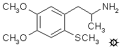

# 139 [ORTHO-DOT](/药物/ORTHO-DOT.md)

[上一个](/文档/PiHKAL/pihkal138.md) [返回](/文档/PiHKAL/index.md) [下一个](/文档/PiHKAL/pihkal140.md)

**4,5-DIMETHOXY-2-METHYLTHIOAMPHETAMINE (4,5-二甲氧基-2-甲硫基苯丙胺)**

|  |
| --- |

**合成：** 向 26.4 g 在无溶剂条件下磁力搅拌的藜芦醚中，在 20 分钟内分批加入 50 g 氯磺酸。反应放热，并放出大量氯化氢。将所得深色混合物倒在 400 mL 碎冰上，待全部融化后，用 2x150 mL 二氯甲烷萃取。真空除去溶剂得到残留物，凝固成结晶块。粗制 3,4-二甲氧基苯磺酰氯重 37.1 g，熔点为 63-66 °C。重结晶将其提高至 72-73 °C。与氢氧化铵反应得到磺酰胺，从乙醇中析出无色针状晶体，熔点为 132-133 °C。

将精细研磨的 3,4-二甲氧基苯磺酰氯 (33 g) 加入装有加热套和回流冷凝器的 2 L 圆底烧瓶中的 900 mL 碎冰中。然后加入 55 mL 浓硫酸，并在剧烈机械搅拌下，分小份加入 50 g 锌粉。加热该混合物直至发生剧烈反应，并继续回流 1.5 小时。冷却至室温并从倾析出未反应的金属锌后，水相用 3x150 mL 乙醚萃取。合并的萃取液用饱和盐水洗涤一次，真空除去溶剂。残留物蒸馏得到 20.8 g 3,4-二甲氧基苯硫酚，在 0.4 mm/Hg 下沸点为 86-88 °C。

将 10 g 3,4-二甲氧基苯硫酚溶于 50 mL 无水乙醇的溶液在氮气氛围下保护以隔绝空气。加入 5 g 85% 氢氧化钾溶于 80 mL 乙醇的溶液。随后加入 6 mL 碘甲烷，混合物回流 30 分钟。将其倒入 200 mL 水中，并用 3x50 mL 乙醚萃取。合并的萃取液用连二亚硫酸钠水溶液洗涤一次，然后真空除去有机溶剂。残留物蒸馏得到 10.3 g 3,4-二甲氧基硫代苯甲醚，在 0.4 mm/Hg 下沸点为 94-95 °C。产物为无色油状物，静置后结晶。熔点为 31-32 °C。

向在蒸汽浴上短暂加热过的 15 g 三氯氧磷和 14 g N-甲基甲酰苯胺的混合物中，加入 8.2 g 3,4-二甲氧基硫代苯甲醚，放热反应在蒸汽浴上再加热 20 分钟，然后倒入 200 mL 水中。继续搅拌直至不溶物变得完全松散和颗粒状。过滤除去，用水洗涤，尽可能抽干，然后从 100 mL 沸腾乙醇中重结晶。产物 4,5-二甲氧基-2-(甲硫基)苯甲醛为类白色固体，重 8.05 g，熔点为 112-113 °C。分析值 (C10H12O3S) C,H。

将 2.0 g 4,5-二甲氧基-2-(甲硫基)苯甲醛溶于 8 mL 硝基乙烷的溶液用 0.45 g 无水乙酸铵处理，并在蒸汽浴上加热 4.5 小时。真空除去过量溶剂得到红色残留物，将其溶于 5 mL 沸腾甲醇中。自发形成结晶产物，从 25 mL 沸腾甲醇中重结晶，冷却、过滤和风干后，得到 1.85 g 1-(4,5-二甲氧基-2-甲硫基苯基)-2-硝基丙烯，为亮橙色晶体，熔点为 104-105 °C。分析值 (C12H15NO4S) C,H,N。

将 1.3 g 氢化铝锂在 50 mL 无水四氢呋喃中的悬浮液置于惰性气氛下并磁力搅拌。达到回流条件后，逐滴加入 1.65 g 1-(4,5-二甲氧基-2-甲硫基苯基)-2-硝基丙烯溶于 20 mL 四氢呋喃的溶液。反应混合物保持回流 18 小时。恢复至室温后，通过加入 1.3 mL 水溶于 10 mL 四氢呋喃的溶液破坏过量的氢化物。然后加入 1.3 mL 3N 氢氧化钠，随后加入额外的 3.9 mL 水。过滤除去松散的无机盐，滤饼用额外的 20 mL 四氢呋喃洗涤。合并滤液和洗液，真空除去溶剂，得到淡黄色油状残留物。将其溶于 20 mL 异丙醇中，用 0.9 mL 浓盐酸中和，并用 200 mL 无水乙醚稀释。从而形成 1.20 g 4,5-二甲氧基-2-甲硫基苯丙胺盐酸盐 (ORTHO-DOT)，为淡黄色结晶产物。熔点为 218-219.5 °C，从乙醇中重结晶得到白色产物，熔点升至 222-223 °C 并分解。分析值 (C12H20ClNO2S) C,H,N。

**给药剂量：** 大于 25 mg。

**药效时长：** 未知。

**定性评论：** （25 mg）模糊的意识，感觉有什么事情即将发生。清淡的食物吃下去不舒服。到下午晚些时候绝对什么都没有了。充其量是阈值。

**延伸和评论：** 这种材料，ORTHO-DOT，可以看作是 TMA-2 的硫同系物，硫原子位于分子 2-位氧原子的位置。这种化合物在什么水平可能显示活性完全未知，但无论在哪里，其剂量都大于 PARA-DOT 异构体 ALEPH-1（或 ALEPH），后者在 10 毫克时完全有效（ALEPH 可以看作是 TMA-2 的硫原子位于分子 4-位氧原子的位置）。基于这种结构很容易制造很多变体，但何必呢？ALEPH 是更具吸引力的结构操作候选者。

[上一个](/文档/PiHKAL/pihkal138.md) [返回](/文档/PiHKAL/index.md) [下一个](/文档/PiHKAL/pihkal140.md)