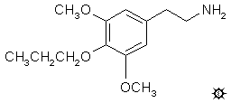

# 140 [P](/药物/P.md)

**PROSCALINE; 3,5-DIMETHOXY-4-(n)-PROPOXYPHENETHYLAMINE (丙氧基麦斯卡林；3,5-二甲氧基-4-(n)-丙氧基苯乙胺)**

|  |
| --- |

**合成：** 将 5.8 g 高丁香腈（其合成见 E 条目）、100 mg 癸基三乙基碘化铵和 10 g 正溴丙烷溶于 50 mL 无水丙酮的溶液用 6.9 g 精细研磨的无水碳酸钾处理，并保持回流 10 小时。向混合物中再加入 5 g 正溴丙烷，并继续回流 48 小时。过滤混合物，固体用丙酮洗涤，合并滤液和洗液，真空除去溶剂。残留物悬浮在酸化水中，并用 3x175 mL 二氯甲烷萃取。合并的萃取液用 2x50 mL 5% 氢氧化钠洗涤，一次用稀盐酸洗涤（这使萃取液颜色变浅），然后真空除去溶剂，得到 9.0 g 深黄色油状物。将其在 0.3 mm/Hg 下于 132-142 °C 蒸馏，得到 4.8 g 3,5-二甲氧基-4-(n)-丙氧基苯乙腈，为澄清黄色油状物。分析值 (C13H17NO3) C H N。

将 4.7 g 3,5-二甲氧基-4-(n)-丙氧基苯乙腈溶于 20 mL 四氢呋喃的溶液用 2.4 g 粉末状硼氢化钠处理。向此充分搅拌的悬浮液中逐滴加入 1.5 mL 三氟乙酸。放热反应产生剧烈的气体释放。继续搅拌 1 小时，然后全部倒入 300 mL 水中。用稀硫酸小心酸化，并用 2x75 mL 二氯甲烷洗涤。水相用稀氢氧化钠调至碱性，用 2x75 mL 二氯甲烷萃取，合并萃取液，真空除去溶剂。残留物在 0.3 mm/Hg 下于 115-125 °C 蒸馏，得到 1.5 mL 无色油状物，将其溶于 5 mL 异丙醇中，用 27 滴浓盐酸中和，并用 25 mL 无水乙醚稀释，得到 1.5 g 3,5-二甲氧基-4-(n)-丙氧基苯乙胺盐酸盐 (P)，为壮观的白色晶体。用于还原腈的催化氢化过程（见 E 条目）对这种材料也成功了。熔点为 170-172 °C。分析值 (C13H22ClNO3) C,H,N。

**给药剂量：** 30 - 60 mg。

**药效时长：** 8 - 12 小时。

**定性评论：** （30 mg）丙氧基麦斯卡林使我的痛觉变得迟钝，并使其他感官真正敏锐起来。一切感觉都很柔软、干净、清晰。我能感觉到我的手接触到的每一根头发。我感到非常放松和自在。我知道在适当的情况下，这种材料会导致不受抑制的色情行为。

（35 mg）整个实验非常安静。没有眼球震颤，没有厌食，闭眼视觉效果微不足道。头几个小时我有点不安，有点颤抖，然后变得昏昏欲睡。我会再做一次吗？大概不会。除了对快感性质的猜测外，它似乎没有提供任何东西。快感令人愉快，但相当平淡无奇。

（40 mg）对我来说，有一种深深的平静和满足感。欣快感在几个小时内增强，并持续了一整天，使这成为我有过的最愉快的经历之一。和其他人聊天、开玩笑真是太棒了。然而，我有点失望的是，没有增强的清晰度，也没有深刻的领悟。没有发现任何问题。没有动力去讨论任何严肃的事情。如果我有任何异议，那也是针对名字，而不是药理学。

（60 mg）中毒的发展在几个小时内完成。我觉得身体的影响多于精神的影响，因为有相当大的易怒性。这大概应该是最大剂量了。尽管感觉很醉，但我的思维似乎很直。效果在第五个小时就已经减弱了，但直到第十二个小时之后才能入睡。第二天没有宿醉。

**延伸和评论：** 捷克斯洛伐克文献中隐藏着一份非常早期的报告，描述了丙氧基麦斯卡林的人体使用情况，描述了高达 80 毫克的实验。在这些剂量下，据报道做梦有些困难，即使在 12 小时后残留效应仍然明显。

丙氧基麦斯卡林的苯丙胺同系物，3,5-二甲氧基-4-(n)-丙氧基苯丙胺是一种未经探索的化合物。其合成无法通过类似于 P 的描述来实现。相反，丁香醛的丙基化得到 3,5-二甲氧基-4-(n)-丙氧基苯甲醛，随后与硝基乙烷偶联，并将形成的硝基苯乙烯用氢化铝锂还原，这将是合乎逻辑的过程。按照 E 条目下的推理，该碱基的首字母缩写将是 3C-P，我猜它在 20 到 40 毫克范围内是有效的，并且是一种迷幻剂。

[上一个](/文档/PiHKAL/pihkal139.md) [返回](/文档/PiHKAL/index.md) [下一个](/文档/PiHKAL/pihkal141.md)