# OD

[◀返回](index.md)

> by @Salviaswc 和 [FreeODwiki](https://github.com/SalviaSWC/FreeODwiki/tree/main) 参与者们

罄竹难书......

此条目未完成，且笔者不会再更新。如果你想为本条目添加/删改内容，请自行[投稿](/CONTRIBUTING.md)

<font color="red">
为防止本文档被别有用心的人利用，本文档及其所有历史版本采用 CC BY-ND 4.0 即 CC 署名—禁止演绎 4.0 协议国际版许可，侵权必究，敬请谅解。详见[这里](../LICENSE-STRICT)
</font>。

## 前言 —— OD 是什么？一个我们没资格，也无法回答的问题……

你可能在道听途说中听说过所谓“OD”行为，或者什么“OD圈”。告诉你这些小道消息的，大概是官方禁毒自媒体、自称的亲历者或者碎片化的截图和聊天记录。

本文并不是某些社交媒体上利用OD圈制作的所谓“纪实片”，那类作品诚然是新闻传播学利用常人无法接触到的资料制作的杰作，但它们的内核是“懂的都懂”的“新闻传播学”，价值也就止于那了。相反，本文通过详尽的历史事实，意图展现一个更全面、更深入的OD圈的历史。

注：本文中所有事件来自[鼠尾草](https://x.com/SalviaSWC)及其他推特网友们的个人叙述。如果你知道某些事情的隐情，但是史书中未能提及，欢迎提出疑问并上报；本历史是基于活跃在推特的OD圈，因此可能出现缺乏其他平台上的ODer的情况，如果你有资料，欢迎补充；本文可能出现语言不通顺的情况，因为笔者精神状态不佳，后续会修复，敬请谅解。

~~阅读可能会导致什么触发？啊这个怎么说反正反正你已经被警告过了。~~

为了便于读者理解，文中加入了大量超链接，读者可以选择性的阅读。

目录是后期加入的，因此插入位置、分段和用词可能并不完全合适。在编写完成后，会进行修复。

## 2022 年 \~ 2023 年 OD 的幕后探索的两年

| 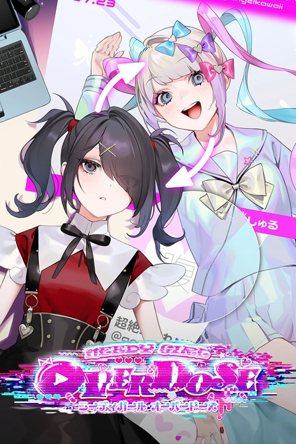                              |
| ------------------------------------------------------------------ |
| 《主播女孩重度依赖》的宣传图。此游戏被广泛视为是OD行为的主要源头。 |

> 我没玩过，只看过视频，所以我只是在乱猜 --Salvia

2022 年 1 月，一款名为[《<ruby>主播女孩重度依赖<rt><strong>N</strong>eedy <strong>G</strong>irl <strong>O</strong>ver<strong>d</strong>ose</ruby>》](https://store.steampowered.com/app/1451940/NEEDY_STREAMER_OVERLOAD/ 'Steam链接')简称 NGOD 的养成游戏在 Steam 平台上发布。这款游戏的核心玩法是玩家需要规划一名艺名叫“超天酱”，真实名字是“糖糖”的所谓“地雷系”的主播的每日行程。在游戏中，玩家需要平衡糖糖的四项属性：粉丝数、压力值、好感度和阴暗度，以达成各种结局。

在游戏中，大量事件与行动会增加糖糖的压力值。为了缓解这些压力，玩家可以指示糖糖过量服用各种药物来有效地缓解压力。游戏中，一共有5种药物，这5种药物按糖糖的阴暗度属性的提高依次解锁。它们，分别对应现实中的[唑吡坦](../药物/唑吡坦.md)，[二氢可待因](../药物/二氢可待因.md)（在美国版中是[右美沙芬](../药物/右美沙芬.md)，因为美国没有那种二氢可待因制剂），[依替唑仑](../药物/依替唑仑.md)（在美国版中是[阿普唑仑](../药物/阿普唑仑.md)，因为美国没有依替唑仑制剂），[大麻](../药物/大麻.md)和 [LSD](../药物/LSD.md)。

游戏中，过量服用这些药物的降低糖糖压力的效力会随着糖糖的阴暗度的增加而降低。

此外，过量服用这些药物后，游戏画面和声音会迅速呈现出特殊的效果，用于表明药物的致幻或抑制效果已经起效了。

然而，游戏作者可能并没有料到，这个游戏会在中国掀起怎样的风波。

毕竟，在当时 2022 年，在 NGOD 的原产国日本，过量服用（<strong>O</strong>ver<strong>d</strong>ose，简称 OD）医用药物来改变精神状态已是旧闻，NGOD中涉及过量服用药物的游戏玩法只不过是因为日本的 OD 圈的存在应运而生的产物。在美国等英文国家，这些内容则更是被不少游戏点评员指责为<ruby>博眼球<rt>Shock Value<ruby>。

相反，在中国，这一切却一直以来是最敏感的禁忌之一。一切涉及精神状态的改变的东西、还有涉及[娱乐性用药](../文档/娱乐性用药.md)的东西，在当局的宣传与政策的强力镇压下，都被视为禁忌的苹果，谁都想尝一尝，却不敢完全摘下送入口中。而这个游戏则为这些胆怯的人们启了蒙。

在正式发布后，NGOD 并未在中国大陆受到任何审查，影片也可以在视频平台正常放映。

可以想象，在当时人气爆棚的直播中，现实世界中的主播们给糖糖过量服用各种药物，并不是出于自身的好奇或满足观众的好奇，仅仅是因为一个残忍的事实：

> 如果现在不让糖糖过量服用药物，糖糖就会在第二天割腕自残；如果现在不点击过量服药的按钮，糖糖就会在第二天伸出手腕，整个游戏画面中能操作的只有让她割开手腕的按钮。

主播点下过量服药的按钮，只见糖糖拿起药物，放入口中。药物被吞下的那一瞬间，直播画面渐变成五彩斑斓的迷幻颜色，背景音乐逐渐扭曲。直到几秒后，一切才恢复正常。稍稍缓解的压力、增加的阴暗值，以及糖糖在游戏中发布的推博，都在确认她过量服药的事实。

而在现实中，风波正在酝酿。

<mark> 然而，鉴于早在 2021 年，当局就发文宣布单方右美沙芬将被列为处方药管制；很多证据证明 OD 行为早已存在，而 NGOD 只是一切的催化剂而已。</mark>

### 关于术语

2022 年正是疫情当头之年，大量人被封锁在家，心情郁闷至极，他们通过打游戏或看视频消遣度日。这时候恰逢 NGOD 发售，不出意料地，NGOD 受到了社会各界——尤其是潜在或已确诊的各种心理疾病患者的广泛关注。

其中，不少人特别地关注了其中与药物有关的部分。通过查阅资料，有人发掘出了各种能让精神状态改变的药物，特别是那些不受当局管制而容易获得的[药物](../药物/index.md)，并发布在社交媒体上。

通常，服用医用剂量的药物就能让精神状态改变的药物，如[哌甲酯](../药物/哌甲酯.md)，都遭到当局的管控，无法随意获得。反之，如果要利用这些非当局管制的药物来达成精神状态的改变，就需要服用超出医用剂量范围的药物。

因此，这种过量服药的行为有获得了一个统一的名字：<strong>O</strong>ver<strong>d</strong>ose，简称 OD，从事 OD 行为的人被称为 ODer，具有这种性质的药物被称为 OD 药物，过量服用 OD药 物的行为被称为 o，指片剂的量词“片”（tablet）被简写为“t”，这个圈子被称 OD 圈（或药圈）。

与当局宣传机构和自媒体所暗示的不同的是，ODer 发明这些术语的目的，并非是为了向别人或当局隐藏什么秘密信息，也不是为了规避任何审查机制，更不是为了显得自己很独特，而<strong>仅仅是为了通过术语缩写简化沟通的实用目的</strong>（虽然这种“暗语”确实对于建立圈子的认同感起到了重要的作用）。这种目的类似于游戏赛事主播们用 <ruby>OB<rt><strong>Ob</strong>server</ruby> 指代一场游戏战局中的观察者或裁判，绘圈的大佬们用 <ruby>OC<rt><strong>O</strong>riginal <strong>C</strong>haracter</ruby> 指代自己的自设，并没有什么特别的。

> 后来，这里提到的专有名词，以及下文将要介绍的，一些指代特定药物的专有名词，成为了当局宣传媒体和某些自媒体指控OD圈是一个“充满黑话”的黑圈子的证据。然而，事实是ODer发明这些术语的目的，从来不是利用所谓“黑话”隐藏信息，而仅仅是为了促进同好之间的方便交流。请不要让自己剖析这种叙事如何运作：从心理学角度看这种媒体叙事常常利用“<ruby>污名化<rt>stigmatization</ruby>”的心理机制，将社区内部的实用术语（如“o”或“t”）重新诠释为“黑话”，暗示一种隐秘或危险的亚文化。这是一种常见的“<ruby>他者化<rt>othering</ruby>”策略：通过突出“不同”来制造心理距离，让<ruby>普通人<rt>normies</ruby>感到社区是“外人”或“威胁”，从而减少同理心和对话机会。研究显示，这种叙事会激发负面情绪，如恐惧或厌恶，导致公众更倾向于支持严格管制，而忽略社区的实际目标——如安全使用和<ruby>伤害<rt>harm</rt>减少<rt>reduction</rt></ruby>。例如，当术语被孤立呈现时，它们被剥离了上下文（本意是简化讨论以分享知识），变成证据来强化“<ruby>道德<rt>moral</rt>恐慌<rt>panic</rt></ruby>”，类似于历史中对某些亚文化的误解。在现实中，这些术语类似于医疗或科学领域的缩写（如“NMDA”代表N-甲基-D-天冬氨酸受体），旨在高效沟通而非隐藏信息。通过理解这种心理动态，我们可以看到：这些叙事并非故意针对社区，而是源于对药物议题的普遍误解。社区可以通过透明分享（如公开解释术语）来桥接这一鸿沟，促进更广泛的公共健康对话。

> 風衣葉綾  
> @Fu1ba_Ling  
> 印象中od这个概念一直都有，16年到19年都是比较小众的圈子，到了19年和文中写的一样因为居家导致圈子快速扩张然后21年直线飙升从幕后走到台前
> 非常大的工程量，辛苦了  
> 12:55 AM · Feb 23, 2026

### 关于药物

想要了解 OD 圈的历史，就需要了解一个贯穿 OD 圈始终的元素——OD 药物，以及理解 ODer 们为何坚持不懈地追求 OD 药物们；最典型的 OD 药物是[右美沙芬](../药物/右美沙芬.md)。

| 右美沙芬的结构式                                                                      |
| ------------------------------------------------------------------------------------- |
| 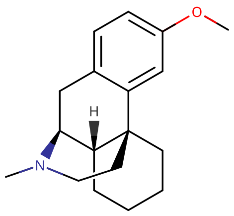                                                                  |
| 注意这种[吗啡喃](../文档/药物分类.md)的立体异构状态并非天然存在，而是人工合成才有的。 |

右美沙芬的医用剂量是 15 mg 到 30 mg，对应 1t 到 2t 氢溴酸右美沙芬片或[愈美片](../药物/愈美片.md)。而当剂量达到至少 100 mg（即 7t 左右）甚至更高时，服用者会产生[欣快感](../药效/认知欣快.md)和[解离幻觉](../药效/分离效应.md)。

这种现象发生的原因是，右美沙芬具有透过[血脑屏障](../文档/血脑屏障.md)的能力(正所谓“中枢镇咳药嘛)，其[咳嗽抑制](../药效/咳嗽抑制.md)的作用据推测来源于它对于 Sigma 受体的激动作用，然而，它的作用靶点远远不止这一个受体，正是它后来才被发现的对于另一个受体的作用，让它作为 OD 药物被过量服用时能有效地改变精神状态，还让它在世界的某些地区被誉为“穷人的 [K粉](../药物/氯胺酮.md)”，

右美沙芬的娱乐性使用的历史漫长而曲折，它的起源是在美国。上个世纪，右美沙芬被美国医药企业研制出来，作为“无滥用潜力”的镇咳药进入市场，目的是用于替代[可待因](../药物/可待因.md)，一种被广泛[娱乐性使用](../文档/娱乐性用药.md)的[阿片类](../文档/药物分类/阿片类药物.md)止咳药。

右美沙芬的止咳效果很有效，而且美国当局的公共健康部门的最初的评估并未发现右美沙芬有任何娱乐性使用的价值，因此被大量推广。曾经装着可待因的非处方止咳糖浆被换成了装着右美沙芬的非处方止咳糖浆，而含可待因的制剂则需处方才能购得。似乎右美沙芬成功解决了此类非处方感冒药的娱乐性使用问题。

很快，故事迎来了转折。右美沙芬被美国人发掘出了娱乐性使用的价值。

不知是出于无聊，还是出于再也没法随便搞到可待因的愤怒，美国人民间自发地发现，当服用超过医用剂量的右美沙芬时，精神状态就会被改变，且这种效应通常持续约 7 个小时，产生的效应接近[解离剂](../文档/药物分类/解离剂.md)——一种最典型的药物是<ruby>氯胺酮<rt>K粉</ruby>的精神活性药物类别。

随后的科学研究表明，正是因为右美沙芬具有能够[拮抗](../文档/受体拮抗剂.md) [NMDA](../文档/药物分类/NMDA受体拮抗剂类药物.md) 受体的能力，才导致了这种现象的发生。虽然它与NMDA受体的亲和力较低，在右美沙芬浓度很高时NMDA受体仍然能被有效地阻断，导致人体产生典型的解离性幻觉。此外，右美沙芬的一种经由CYP3A4代谢酶所产生的去甲代谢产物也与它的高剂量下的解离作用有关。

然而，右美沙芬的作用位点远远不止这些。它对于[血清素](../文档/血清素.md)的和[去甲肾上腺素](../文档/去甲肾上腺素.md)的转运蛋白还具有显著的亲和力，效果是抑制血清素和去甲肾上腺素的[再摄取](../文档/神经递质再摄取抑制剂.md)，这种效应类似于文拉法辛等 SNRI 类抗抑郁药。而这个亲和力远大于右美沙芬及其代谢产物与 NMDA 受体的亲和力。正是这两个作用位点导致娱乐性使用右美沙芬的风险很大，例如，过量服用右美沙芬容易意外导致[血清素综合征](../文档/血清素综合征.md)，一种极为痛苦的状态。最终服药者只得拨打急救电话，把自己送进医院，甚至经抢救无效死亡。

无论后果如何，一旦被送进医院，这桩事就免不了被当地的公共卫生部门记录在案。美国当局也会监控这些统计数字。终于，美国当局发现了因过量服用右美沙芬而被送进医院的人数的统计数字暴涨，决定采取行动。他们想必对相关企业单位进行了施压，要求他们为这些事情负起责任。

于是，美国医药企业为了遏制民间娱乐性使用，“自愿”撤下了仅含氢溴酸右美沙芬的制剂，并将右美沙芬混合上愈创甘油醚销售——后者是一种过量服用后会导致难以忍受的恶心感，甚至导致呕吐的祛痰药。有些医药企业甚至将右美沙芬和氯苯那敏混合——后者是一种有[血清素](../文档/血清素.md)[再摄取抑制剂](../文档/神经递质再摄取抑制剂.md)性质的[抗组胺药](../文档/抗组胺药.md)，在过量服用的情形下，这种制剂极易引发血清素综合征。不知情人的认为因为这种制剂不含愈创甘油醚，所以自己不会呕吐，便抓起一把把胶囊，大口吞下，却经历了严重的副作用。而更多人并没有因为禁令而退缩，而是直面现实，选择忍受愈创甘油醚的恶心感咽下复方糖浆。美国当局的禁令和施压并未取得成功的结果。

不过，随着嬉皮士年代到来，越来越多的美国人开始从事制毒于贩毒，导致 [LSD](../药物/LSD.md)、[PCP](../药物/PCP.md)、[氯胺酮](../药物/氯胺酮.md)等副作用比右美沙芬更小的致幻剂在美国越来越容易获得了，更多人转向了它们，抛弃了右美沙芬。于是，右美沙芬似乎在美国不那么流行了。

事情迎来转机是在 20 世纪末，当时美国互联网迅速兴起，右美沙芬作为一种无法律风险的改变精神状态的方式，在互联网上引起了剧烈的讨论。之后，一位匿名人士总结的一份文档——[右美沙芬常见问题解答](../文档/右美沙芬FAQ/dxm_faq.md)，被认为开启了右美沙芬的娱乐性使用的一个崭新的时代。如果说互联网时代之前，右美沙芬的娱乐性使用只是一个内行人口口相传的秘密，那么互联网则让这个秘密被暴露在所有人的视野之下。右美沙芬被娱乐性使用的人数暴增。2010 年，调查数据显示美国有约 2% 的 12 岁 \~ 17 岁的青少年曾娱乐性使用过右美沙芬。

在那一年，美国食药监[召开决定右美沙芬是否会被列管的听证会](../https://www.erowid.org/chemicals/dxm/dxm_article3.shtml)，最终以 6：9 否决，右美沙芬未能被列管。

今天的美国，甚至有美国医药企业在生产一种一片仅含 30 mg 右美沙芬*游离碱*（30 mg 相当于39mg*氢溴酸*右美沙芬）的片剂，右美沙芬的娱乐性使用似乎已被正常化，~~毕竟美国当局也不想让急于改变精神状态的人们诉诸于街头掺了不知多少[芬太尼](../药物/芬太尼.md)的毒品（笑）。~~

然而，在其他国家或地区，当地政府对待右美沙芬的法律状态各异，例如，2013 年的中国，尽管当时氢溴酸右美沙芬片是非处方药，在药店中购买氢溴酸右美沙芬必须出示身份证[^1]；印度尼西亚当局则将右美沙芬视为毒品，没有任何许可的医疗用途。

---

上面讲述的有关右美沙芬的历史虽然发生在美国，却像一面镜子，处处都能映照出中国OD圈历史的影子。

<!--- 下面一段等会改一下 ---->

> 我也来补充一下 我97年的 我上初一的时候也就是09年开始接触的右美沙芬 当时叫美沙芬来着 其实我一开始接触的是k粉 那时候滑冰场很流行（就是在一个大些的封闭空间做一个圆行滑道 放些土味DJ 那时候的快乐是一种简单的快乐 ）因为滑冰场是有夜场的 我就在这时候被一些混混朋友带着一起打了k 而美沙芬我的印象很深刻！！！因为它是我的一个姐姐（学校认的哈哈）带过来学校给我们一起玩的  说吃十几颗就起效 我去了！？！ 我们上课玩的 我混乱又清晰的记得那个下午 我又吐又晕又昏迷过去的下午 我能这么清晰的记得是因为那个姐姐其实我一直暗恋她来着 所以印象太深刻了 09年 右美沙芬已经在校园开始流传甚至流行了 因为它能合法在中国药店买到 即使你只是初中生 只要说你咳嗽就能轻松买到了 —— 推特sansnb173435

> 我tm写的什么鬼
> 这里稍微扯开一下，来讲一个许多读者都好奇，而且与本文主体的关联性很强的问题。既然你都有耐心读到这儿了，我相信，你很想知道这个问题的答案。这个问题就是：我国很多人对于毒品和精神活性药物相关的信息充满好奇。为什么？
>
> 众所周知，我国当局正在实行一种严格的信息审查政策。其引发的下游效应，导致国内搜索引擎和其他网站，不得不对于出现在他们网站上的涉毒信息采取严格的限制措施。而且，为了预防执行不到位，引来有关部门的直接突然介入的情况的发生，这些网站通常过度执行这些条款。简而言之，这些网站的目的是利益最大化、风险最小化，然而涉毒
>
> 这一系列的反应所导致的一个最直观的现象，就是搜索引擎上搜不到不受当局宣传机构控制的
>
> 这就导致我国很多人能够接触到的涉毒信息非常有限，而这些信息来源一致地都源于当局宣传。他们虽然被当局的宣传机构(如各大禁毒媒体、执法部门等有关部门)告知千万不要对毒品产生任何好奇贯穿始终的一个问题是：这些OD药物究竟有多大的成瘾性，沾上了究竟能不能戒掉？当局宣传可以这么概括：“这些毒品已被列管，那些是‘未列管成瘾性物质’”

而右美沙芬那种令人陶醉的解离的药效，也注定让它成为每一名 ODer 的白月光，让它们即便冒着极大的健康风险，也要享受它赋予的禁忌的解离迷醉，并让它成为 OD 圈中不可或缺的最重要的 OD 药物。其他 [OD药物](../药物/index.md)虽然有不同的效果，却远不如右美沙芬那样震撼人心。

2022 年正值疫情时代，一切能够用来消遣的东西都受到极大的欢迎。三年疫情导致的经济下行创造了一大批失业失学的青少年和年轻人，他们正是OD圈能在中国扎根并在不远的未来茁壮成长的丰厚土壤。也许这就是大势所趋……

而对于更久远的历史，很多证据支持 OD 并不完全源于 NGOD 的走红，而是一个早已出现的行为。

有传言称，过量使用右美沙芬等药物以改变精神状态的行为在当时以前就早已广泛存在，只是在 2022 年出现了井喷式增长。虽然笔者不知道他们当时是否使用“OD”这种提法，但是可以确定的是，“OD”提供了一面旗帜，让他们可以在这面旗帜底下团结起来。

笔者在为了撰写本文而进行调查时，有推特网友告知笔者，使用[药物](../药物/index.md)以改变精神状态在几年前就在男同性恋圈流行过，虽然并非“过量服用不受当局管控的药物”。

> **蓝狗🏳️‍⚧️🍥二代目** @DXMDusk  
> 在18年前我在淘宝上买过[rush](../药物/亚硝酸酯.md)，犀牛，0号胶囊，均价不超过100，普遍在50~80，  
> 如果这也算在OD里面的话，更早的还有大力哥等老资历
>
> **鼠尾草～🌿** @SalviaSWC  
> 18年还有零号胶囊卖？[5-MeO-DiPT](../药物/5-MeO-DiPT.md)在15年就列管了欸，窝好奇里面装的是啥👀
>
> **蓝狗🏳️‍⚧️🍥二代目** @DXMDusk  
> 在18年底我最后一次购买0号胶囊的时候，给我发的是rush，说是没货了，而且发的这个rush更贵，  
> 据我了解说法是，这些都是武汉那边统一生产的，然后发往全国，就是垄断的那种，但是被管制后，买到的不一定是真的，很可能掺了别的成分，所以那几年的gay圈是一度叫停，直到渐渐的把这个淡忘，  
> 6:56 PM · Feb 22, 2026 · 161 Views
>
> **鼠尾草～🌿** @SalviaSWC  
> 这样啊…… rush不就是化工原料嘛（小声）
>
> **蓝狗🏳️‍⚧️🍥二代目** @DXMDusk  
> 对呀，但那时候太小了，就不知道嘛，而且当时在处在gay圈里，了解到的出名的也就是0号胶囊，也是好奇买的玩，不过做起来确实很爽，现在形容的话，已经忘记那种感觉了，久远的回忆，
> rush的记忆倒是比较深刻，因随身带着时它渗出来了，以至于长达一两个星期自己身上都有这个味道，但是我完全没感觉到
>
> 蓝狗🏳️‍⚧️🍥二代目（互关喵 @DXMDusk  
> 21年，就我知道的我所居住的不远处就有3到4名od右美沙芬的MTF，可谓是流传得非常广泛，
> 再早就是16，17年淘宝上rush，犀牛，0号胶囊什么的都可以直接购买，直到18年底，这些从淘宝上消失，
> 渐渐地18年开始在贴吧看到右美沙芬片之类的，
> 一个物质的管制只会造成另一个物质的泛滥，直到重复这个结局，  
> 7:06 PM · Feb 22, 2026

甚至“OD”的提法也不是最近才有的：

> 鼠尾草～🌿 @SalviaSWC  
> 话说当时的提法是"OD"嘛（  
> 4:06 AM · Feb 23, 2026 · 14 Views
>
> 蓝狗🏳️‍⚧️🍥二代目（互关喵 @DXMDusk · 1m  
> od一直有的

还有人这么说：

> 風衣葉綾 @Fu1ba_Ling  
> 印象中od这个概念一直都有，16年到19年都是比较小众的圈子，到了19年和文中写的一样因为居家导致圈子快速扩张然后21年直线飙升从幕后走到台前  
> 12:55 AM · Feb 23, 2026

由此可见，OD 圈是一个成分复杂的圈子，其参与者的出身背景极为广泛，而其真正起源尚属一个待考证的点。

随着对 OD 感兴趣的人越来越多，有人将零零散散的被发掘出来的 OD 药物汇编起来，编成 OD 指南，在网上传播。这就是 OD 知识公开化的一个雏形。而此时，距离 OD 知识真正具有公开化大量传播的潜力，还有 2 年。

尽管如此，在 2022 年上半年，OD 行为尚属零星，大多数人只是在与涉 NGOD 贴子中讨论 OD，自己并不从事 OD。当时，专门针对 OD 的审查并不如现在严格，各种 OD 指南在 QQ 群、微博、知乎等社交媒体上流传。百度贴吧上，好奇的新晋 ODer 们谨慎地观察着当时并未被封的右美沙芬吧，观看着老食客们的说辞。

据了解，当时许多人并不是出于刺激或快感而从事 OD，而是出于自残。他们将 OD 药物视为美工刀的替代品。这种说法是否只是为了合理化他们的从事 OD 的行为，我们暂且不得而知。

不幸的是，现实中的过量服药显然比游戏中刻画的更加残酷。即便抛开真正的恶性不良反应不提，许多人并按照 OD 指南初次尝试 OD，却被强烈的精神状态的改变吓得措手不及，打 120 住院。而像右美沙芬这种高风险 OD 药物，联用多种药物，例如心理疾病患者常用的处方 [SSRI类抗抑郁药](../文档/SSRI.md)，都会导致发生严重的不良反应的风险猛增。而医院和执法部门也注意到了越来越多的人因为此类非自杀性过量服用药物而住院，逐渐意识到了一个公共卫生危机正在扩散。

在那时，小股的药物探索者们已经离开审查逐渐变得严格的国内平台，在推特上开始聚集。

### “彩霞”与“Spring风”

在他们之中，最值得注意的是一位名叫 [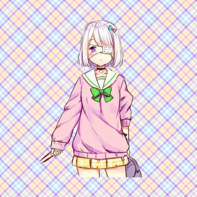 彩霞](x.com/yukiukoori)的跨性别人士，她是一名热情的药物研究者，声称在自己的知乎账号被封后转移到推特。她从事许多涉跨性别的活动，还自称“OD奠基者”。据她的朋友在知乎上的声称，她是一个“想建立乌托邦的理想主义者”。她“很享受一切钻研和应用的过程。生活娱乐和学术都如此。一种科研精神贯彻了她的一切行动”。

没有人能够料到，她会落得这个下场。

根据公开资料，[ 彩霞](x.com/yukiukoori)的活动最早可以追溯到 2019 年。等到 2022 年的时候，她已向几位濒临自杀的跨性别朋友们介绍了 OD 药物，把她们从绝望与自杀的线上拉了回来。受到了彩霞的恩惠，她们成为了彩霞的挚友，却无法摆脱药物。

不可否认的是，根据观察，跨性别圈与 OD 圈的相互联系非常紧密。这根本上来源于跨性别者与 ODer 一样，通常不追求一般大众所遵守的社会常规。虽然彩霞的无心之举确实在一定程度上促进了这一点，但那只是直接原因，并非根本原因。而在后来，甚至连我国当局的举措都促进了这一点。

> 🏳‍⚧雪雨氷織🍥 @yukiukoori
>
> 毒品对我真的没有什么吸引力比较我发明的东西可一点也不比这些赖呢，今天整的感觉成瘾风险好高，真的不想这样搞了。但是考虑到其实好大一部分精神因素没办法复刻其实也无所谓了，就慢慢享受到不知不觉睡着为止吧。
>
> 4:45 AM · Aug 30, 2022

彩霞自称自己“发明了 OD”。正是她定义了 OD 究竟是什么，这就是我们说自己没有资格回答“OD 是什么”的原因。

| 彩霞在推特上发布的自己的知乎账号被封的截图。<br>可以从截图中看出，在她在2022年1月9日就已经在知乎上公开活动，当时NGOD还未发售。 | 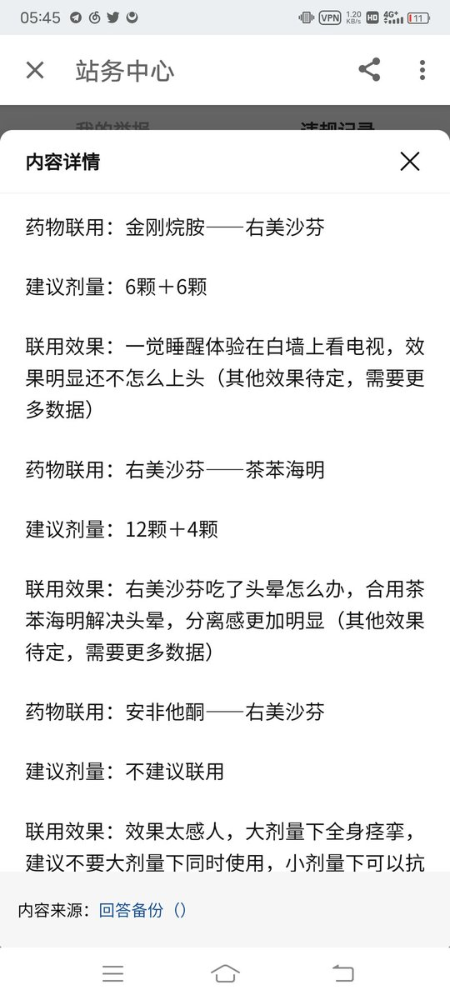 | 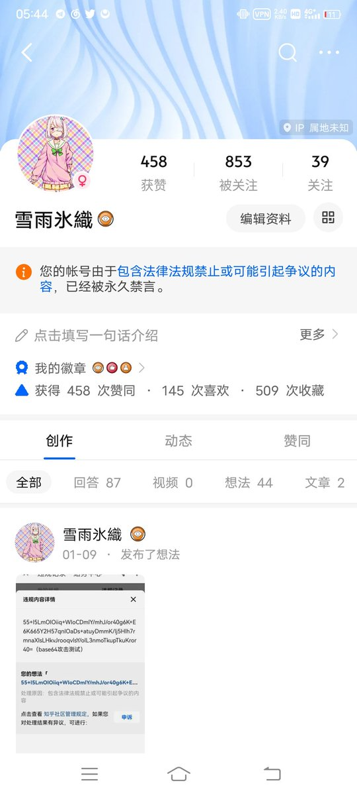 |
| ------------------------------------------------------------------------------------------------------------------------------ | ------------------------------ | ------------------------------ |

在她的其他的推文中，她介绍了自己对于苯乙胺、水合氯醛、[安非他酮](../药物/安非他酮.md)的研究，这里不再详细表述。

> 🏳‍⚧雪雨氷織🍥 @yukiukoori 3:25 AM · Aug 14, 2022
>
> 另外这不是纯药推ggl，所以推接合作，平时会发色图，可以发日常吐槽，也接客出来和人贴贴，偶尔自己拍色图，照片。只不过作为od圈奠基者我也要产写粮的。

或许，正是这些危险的“接客”行为为某些怀有恶意的人，提供了渠道。

> 🏳‍⚧雪雨氷織🍥 @yukiukoori 5:24 AM · Sep 4, 2022
> 药娘圈热知识：如果后悔了，任何钡盐以及其他重金属离子中毒的解药是EDTA（乙二胺四乙酸二钠）以及硫代硫酸钠，当然其他金属离子螯合剂都是可以的，可以大量服用，最多丢失一点钙。平时可以在采血管中找到这种物质的单质，快转给准备重开的姐妹吧~  
> 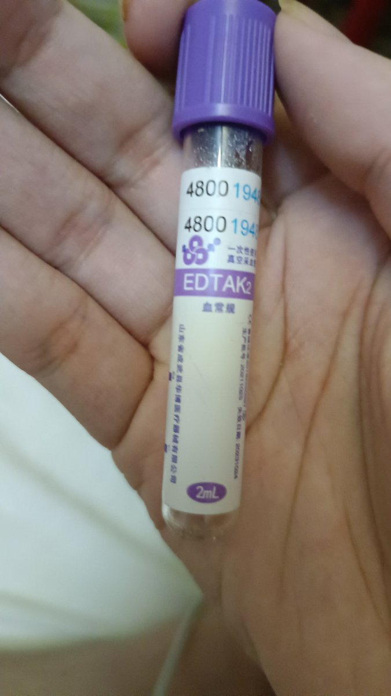

她是一个善良的人，多次帮助濒临自杀的跨性别人士走出困境。却因“发明 OD”和“将 OD 引入跨圈”饱受骂名......

> 🏳‍⚧雪雨氷織🍥 @yukiukoori
>
> 摸摸，适度过量，请勿成瘾哦，有不舒服及时咨询哦。
>
> 12:18 PM · Oct 10, 2022

如其所言，她**从事 OD 是为了不 OD**。据称，她“发明 OD”的初心，是为了让那些深陷抑郁、被无法改变的苦难折磨着、濒临自杀的人们一点活下去的念想，最终目的是不依赖药物就能正常生活下去。有传言说，她通过 OD [右美沙芬](../药物/右美沙芬.md)，解决了困扰自己许久的抑郁，从此不再需要依赖药物。知乎上有人替她辩护：她只向那些精神即将崩溃，只剩自杀一条路走的人另辟[药物](../药物/index.md)这条蹊径。

她以为自己的善意能够被大家理解，却最终落得这个下场，令人遗憾。而她落得的此等下场，将令药圈内另一名大佬深受折磨。

不过，在了解她的最终下场是什么之前，我们不得不先把其他情况介绍一下。

2022年10月是彩霞的最后一个推文的发布日期。此时，当局实行的“动态清零”政策仍然没有放松，对于身处中国大陆的人来说，这种人人自危已经成为了常态：每个人每天早上起来第一件事就是看看自己所居住的小区是否被封控了。一旦小区被封控，整个小区的居民就无法上学或上班，甚至网购的商品都难以送达。

这种严格的政策已经持续了两年半，没有任何缓解的迹象。对于不少人来说，这种压力愈发难以忍受，他们的心理健康状态严重恶化，濒临崩溃。更广泛地，大多数人都在提前寻找消遣的方式以应对封控的无聊，研究如何 OD 恰恰是一种很有趣又略带禁忌感的消遣方式。很多人就是在此时接触了 OD。回忆起当时，笔者也有一位同学在朋友圈里晒出了OD药物的照片。可想而知，

然而，对于ODer们来说，尽管他们的肉体仍然受到被封控政策禁锢的威胁，那些能够改变精神状态的[药物](../药物/index.md)却能让他们的灵魂遨游在[幻觉](../药效/幻觉状态.md)的海洋中，无人能够限制他们；所以，只要他们手上还有一盒OD药物，他们的灵魂就能拥有免受封控的自由(虽然并不是以一种常规的形式)。

或许正是因此，越来越多对 OD 感兴趣的人不再将 OD 行为停留于纸面上的研究学习，而是从事真正的 OD 行为。每一位打算或已经初尝改变的精神状态的禁果的的 ODer 们的心情是可想而知的：他们既急切又担忧，第二天自己买的 O D药物的快递包裹是否会由于“疫情原因”无法送达，于是他们疯狂囤够 OD 药物。一旦 OD 药物送到了他们手上，就像没了命一样吞服，却把自己的安全忽略了。

随后，许多人因药物引发的各种不良反应进了医院、落了残疾、甚至丧了命。那会儿，越来越多的推特网友发布推文，晒出自己从事 OD 行为后，因不良反应住进医院的诊断单。

随着住进医院的人数越来越多，OD 行为也愈发进入当局的视野中。<!-- TBD待补充图片-->2022 年 11 月，当局显然已经发现了民间从事的 OD 活动愈发明显，并采取手段尝试遏制。

当局决定先拿右美沙芬开刀。至于为什么第一个挨刀的是右美沙芬，可能是因为娱乐性使用右美沙芬自身的风险就很大，因 OD 右美沙芬住院的人的数字飞涨；或许是因为右美沙芬的娱乐性使用的历史在中国早已非常久远了；也许是因为单方右美沙芬制剂的适应症并不多，而且几乎完全可以被不适合娱乐性使用的[愈美片](../药物/愈美片.md)替代，导致当局对右美沙芬“动刀”的社会影响较小。鉴于当局在国家层面上的任何举动都是经过慎重考虑的，有关部门很可能综合了各个因素，于是就决定管管右美沙芬了。

| 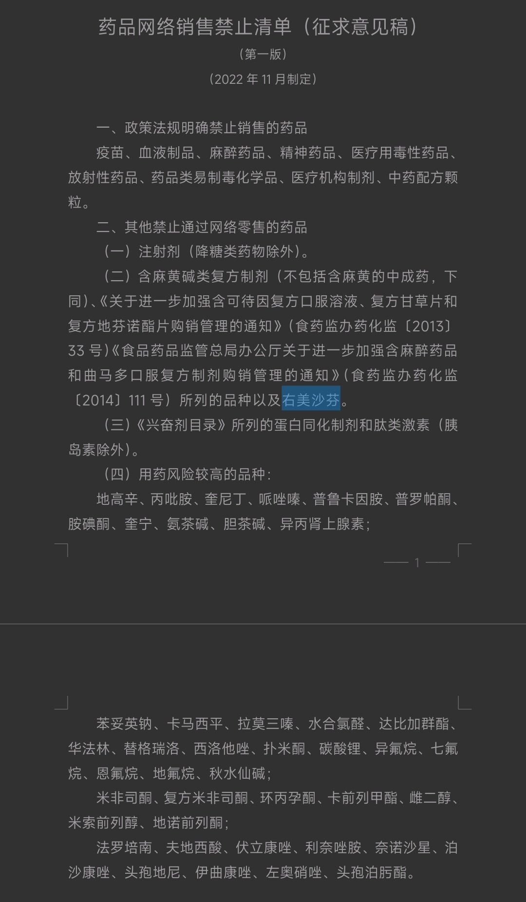                                                                                                                                                                                                                 |
| --------------------------------------------------------------------------------------------------------------------------------------------------------------------------------------------------------------------------------------- |
| 2022 年 11 月，右美沙芬被当局要求禁止在网络上销售。它正式打响了这一场残酷的不对称斗争的第一枪。<br>然而，实行上，直到<ruby>本段更新时<rt>2026-3-5</ruby>，只有单方右美沙芬被限制网购，[愈美片](../药物/愈美片.md)等复方制剂并未被限制。 |

<!---这条禁令带来的后果是，如果当时的ODer想要购买单方氢溴酸右美沙芬片，那么愈发严峻的政策环境影响着每一位ODer，尤其是那条对于右美沙芬网络销售的禁令在OD圈导致了严重的风波。--->

2022 年的右美沙芬网络禁售之后，如果当时的 ODer 想要购买单方氢溴酸右美沙芬片，必须线下持有处方亲自前往药房购买。而这当然不是每一个人都敢的，而对于跨性别群体，这却是一个非常熟悉的事情，因为跨性别用的激素药物，如补佳乐（戊酸雌二醇片）也被同等处理。因此，她们想必经常同时购买右美沙芬和补佳乐，而把它们放到互联网上售卖。如此严峻的政策环境影响着每一位 ODer，也促成了跨性别圈子于 OD 圈子的高度交织现象。

在一个相近的时间点，[推特的一个贴子](https://x.com/mengqintiancai2/status/1593158796905676800)得到了广泛关注，收获了大量点赞和转发。虽然该推文的推主似乎不再从事 OD，但他发的这个贴子收获的浏览量堪称 OD 圈史上的最辉煌的成就之一。有人将这一 OD 指南归于上文提到的 [ 彩霞](x.com/yukiukoori)所作，因为在她的一个推文中曾提到她要制作“第二版 OD 指南”。这个贴子有 12 张图片[^2]，号称是“科学 OD 指南”。~~推主似乎是男娘，不知是否有关。~~

这份指南中并未详细解释各种药物如何 o、o 了有什么效果、以及怎么较安全地 o，而仅仅是粗略地一笔带过各个药物能 o 的事实。从这份指南中，可以看出以下药物在当时已经成为了 o 圈关注热点：[右美沙芬](../药物/右美沙芬.md), [美金刚](../药物/美金刚.md), [苯海索](../药物/苯海索.md), [金刚烷胺](../药物/金刚烷胺.md), [司来吉兰+苯乙胺](../药物/司来吉兰+苯乙胺.md), [1,4-丁二醇](../药物/1,4-丁二醇.md)。

这一个贴子被当时的另一位重要角色转发——[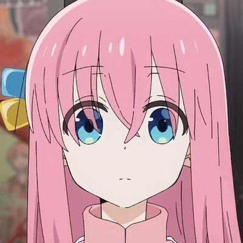Spring风](../文档/补档/Overdosewiki/Report/RP-74.md)。他早已加入 OD 圈，是一位活跃的参与者。

他是一个好奇的年轻人，将探索的视野从 OD 药物本身转移到更一般的精神活性物质。他钻研过药物的化学结构特点，探讨过药物的机理，研究过[冰毒](../药物/甲基苯丙胺.md)的制取。他深受 ODer 们的尊敬，被称为“药师”，死后还被后世称为“第一代 OD 引路人”。在他的推文下，第一批扎根推特的 ODer 们聚集了起来。

通过他的推文不难发现，他是一个对于当局充满不满的人。他高调地支持一些激进地反对当局的推文。然而，即便是当时最激进的此类推文，也远远比现在的推文更容易接受、更关乎事实、更接近现实，令人怀念。

他的推文激进地反对当局实行的言论审查，并主张自由的互联网访问。他与推特上一名“支持高福利社会+毒品合法化+自由开明独裁”的博主，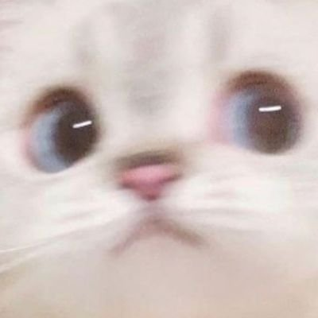 🍐老师经常互相在推文下评论留言。他转发或发布的反对当局的推文并不仅仅是发泄情绪，而是对于崇尚开放和自由的呼吁。

值得注意的，是他从事 OD 的目的。看看下面的推文，也许[Spring风](../文档/补档/Overdosewiki/Report/RP-74.md)通过从事 OD 和探索药物，既不是为了快感，也不是为了自残。他从事 OD 目的，可能存在不少拯救自己于抑郁中的成分，不过，笔者认为，他在通过 OD 圈中探索那些被列为禁忌的知识并将其分享出来，是为了反抗当局的信息审查吧......下面这条推文很能佐证这一推测。

> 山中的旅人 @yang38432408  
> Jan 2, 2023  
> 在此条推文的评论写下你的16词核心价值观
>
> Spring风#参宿四 @Spr1ngW1nd  
> 自由 进步 平等 人权  
> 解放 公正 法治 博爱  
> 反修 反极权 反威权 嗑药  
> (引用上一个推文)  
> 2:49 PM · Jan 3, 2023

不幸的是，他虽然有建设性的思想(相比自残式 OD 者来说)，却既缺少足够的知识，又没找到研究方法，甚至未能保护自己。最终，他败给了一碗[相思汤](../药物/相思汤.md)(一说“[死藤水](../药物/死藤水.md)”，总之都是含有 [DMT](../药物/DMT.md)的植物提取品)或其中的[单胺氧化酶抑制剂](../文档/单胺氧化酶抑制剂.md)，成为 OD 圈内的可惜之人，沦为路人的笑柄，令人叹息......

| 在 2022 年 10 月 7 日，他发布了有关[唑吡坦](../药物/唑吡坦.md)致幻药效的评论，如图 |
| ---------------------------------------------------------------------------------- |
| 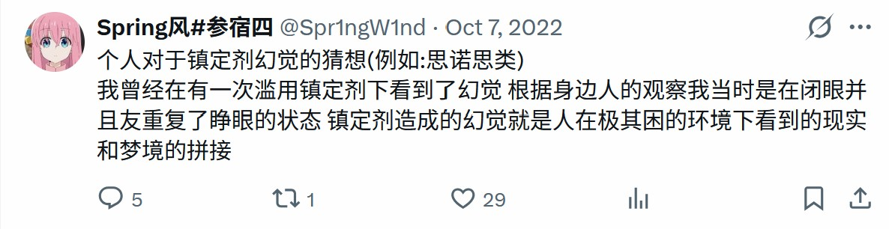                                                  |

> Spring风#参宿四 @Spr1ngW1nd  
> 右美沙芬 24×15mg 测试  
> 1:54 PM · Oct 15, 2022
>
> Spring风#参宿四 @Spr1ngW1nd · Oct 15, 2022  
> 13:53服用  
> 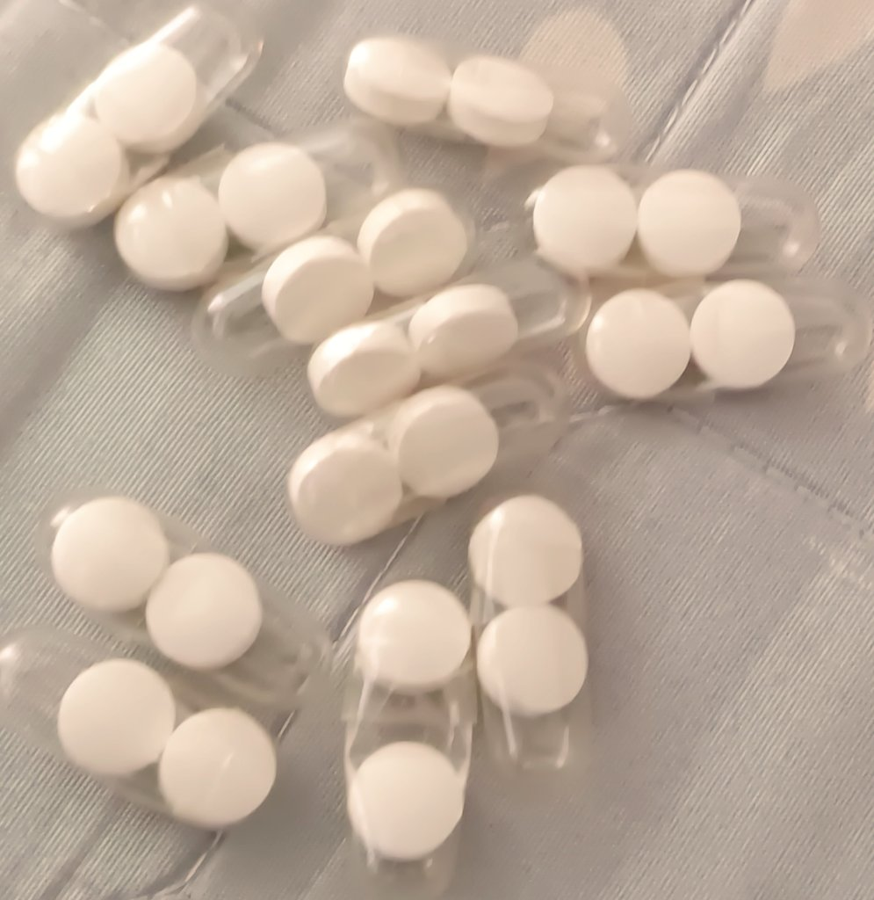
>
> Spring风#参宿四 @Spr1ngW1nd · Oct 15, 2022  
> 14:36 第一轮呕吐感 猜测是非选择性血清素再摄取抑制造成的 血清素2C受体被过度激活 导致恶心感
>
> Spring风#参宿四 @Spr1ngW1nd · Oct 15, 2022  
> 14:43 声音变远 声音变小
>
> Spring风#参宿四 @Spr1ngW1nd · Oct 15, 2022  
> 14:45 视觉形态改变 思维改变 音乐欣赏程度增高 头晕感(鼻梁骨)
>
> Spring风#参宿四 @Spr1ngW1nd · Oct 15, 2022  
> 14:53 瞳孔扩散 头皮发麻 音乐欣赏程度增高 体温生高
>
> Spring风#参宿四 @Spr1ngW1nd · Oct 15, 2022  
> 15:02 意志力实在是顶不住这个药 肌无力 视觉色彩增强 视觉形状增强
>
> Spring风#参宿四 @Spr1ngW1nd · Oct 15, 2022  
> 16:46 药效结束
>
> Spring风#参宿四 @Spr1ngW1nd · Oct 15, 2022  
> 警惕右美OD后吃饭 恶心死我了 一定要空腹！
>
> Spring风#参宿四 @Spr1ngW1nd · Oct 15, 2022  
> 右美沙芬我怀疑是不是在里面加了催吐药
>
> Spring风#参宿四 @Spr1ngW1nd · Oct 15, 2022  
> 我要失去控制了
>
> いくら @88BExUpvIQ7sOC8 · Oct 15, 2022  
> 喜欢，听起来好专业的样子，虽然我听不懂，我只会哇我在飞诶
>
> Spring风#参宿四 @Spr1ngW1nd · Oct 15, 2022  
> 实际上我也只是记录了大体 进药效了我都没办法理智

他还将自己 OD [右美沙芬](../药物/右美沙芬.md)的过程直播记录下来，发布在推特上。

> Spring风#参宿四 @Spr1ngW1nd
>
> 在今天下午右美沙芬药效过去后 产生的右美沙芬戒断反应
>
> 轻微程度 类SSRI戒断反应(非选择性血清素再摄取抑制剂):流感样症状、平衡不佳
>
> 中等程度 类氯胺酮(NMDA拮抗剂)戒断反应:烦躁不安、抑郁、精神差、疲乏无力、心悸、手震颤
>
> 疲乏无力 手震颤 在停药后表现最为明显
> 大约经历1.5小时后减轻
>
> 12:03 AM · Oct 16, 2022

他如实记录了发生在自己身上的“[右美沙芬](../药物/右美沙芬.md)戒断”。

| 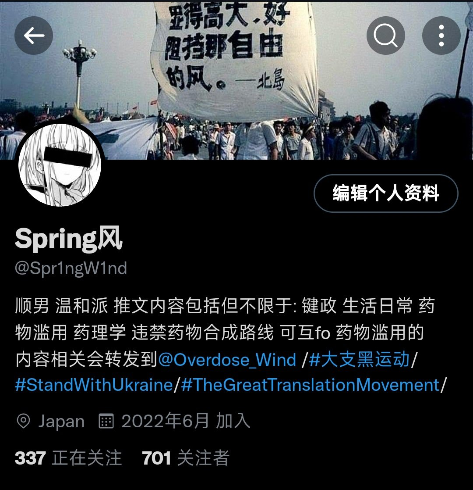                                                                                                                                                     |
| ------------------------------------------------------------------------------------------------------------------------------------------------------------------------------------- |
| 2022 年 10 月 23 日，他达成了 700fo（推特上称“粉丝（Follower）”为“fo”）</sub>。这个数字远远小于如今 OD 圈大佬的粉丝数字，说明当时 OD 并未流行，或 OD 圈影响力的重心并未转移到推特上来 |

> Spring风#参宿四 @Spr1ngW1nd  
> AXS-05组合我的一些看法  
> Nov 12, 2022
>
> Spring风#参宿四 @Spr1ngW1nd · Nov 12, 2022  
> 右美沙芬经过CYP2D6酶转换为NMDA非竞争性拮抗剂 科研思路可能就是:利用DXM的SRI+NRI特性 并且安非他酮已经是一款在市面上的NDRI 并且具有CYP2D6酶的抑制特性 为什么不选用同样有这个特性的苯海拉明 一方面可能是制药厂考虑到抗胆碱剂 可能会造成副作用 另一方面也有可能考虑到这个组合可能不受人待见
>
> Spring风#参宿四 @Spr1ngW1nd · Nov 12, 2022  
> 因为这个药物组合就是因为它有CYP2D6抑制的特性 曾经有人也对其进行过药物滥用 并且制药厂怎么使用合法的理由 去申请这个药通过临床测试 这个时候药厂想到了有CYP2D6抑制特性的安非他酮 并且又是合法的抗抑郁药物 实际上药厂就是为了用右美沙芬的SRI和NRI的效果 这个效果在一部分药物滥用人群中表现
>
> Spring风#参宿四 @Spr1ngW1nd · Nov 12, 2022  
> 的抗抑郁效果十分客观 并且药厂也不要人“嗨”了 嗨了就通不过临床测试了 这个时候又是要CYP2D6抑制了 不让它转换成DXO 不让它产生“解离感” 通俗点来说就是人飘起来走路轻飘飘的感觉 并且从一定角度上来说 两款XRI不应该同时出现(例如两款不同的SSRI联用可能导致血清素综合症) 并且NDRI的DRI效果也有可能
>
> Spring风#参宿四 @Spr1ngW1nd · Nov 12, 2022  
> 导致一定的副作用 在单独用右美沙芬来说 它的抗抑郁效果十分优秀 并且Sigma1效果也有可能促智
>
> Spring风#参宿四 @Spr1ngW1nd · Nov 12, 2022  
> 这种选择性 σ1 激动剂最近引起了我的兴趣  
> PRE-084 增加 GDNF 的表达  
> 如果我没记错的话 这将支持你的假设即 sigma 受体激动剂可以永久增加多巴胺受体，并解释所谓的“促智和抗抑郁作用”
>
> Spring风#参宿四 @Spr1ngW1nd · Nov 12, 2022  
> 我想了一下，如果你想一想，导致“余辉”的大量药物是 σ 受体配体 因此，σ受体在多巴胺受体表达中的作用可能与此有关

以上是他对于药理学探讨的一点摘录，也许他有成为一名<ruby>[益智药](../文档/药物分类/益智药.md)爱好者<rt>biohacker</ruby>的潜力的......

> Spring风#参宿四 @Spr1ngW1nd
>
> 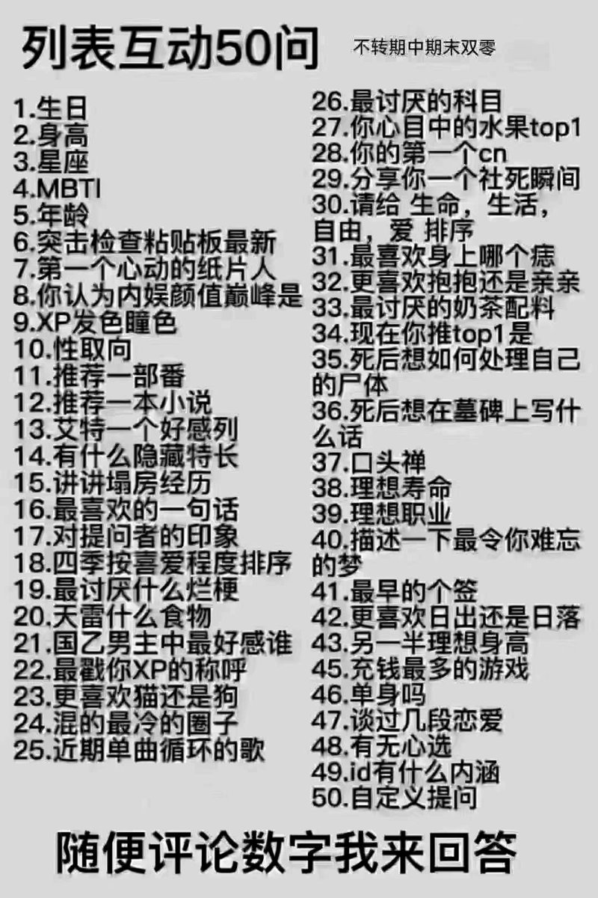
>
> 2:50 AM · Nov 13, 2022
>
> L @sequoiacandy · Nov 13, 2022  
> 10
>
> Spring风#参宿四 @Spr1ngW1nd · Nov 13, 2022  
> 双性

Spring风是双性恋哦~

> Spring风#参宿四 @Spr1ngW1nd  
> 阿片类药物 测试  
> 6:32 PM · Nov 19, 2022
>
> Spring风#参宿四 @Spr1ngW1nd · Nov 19, 2022  
> 18:29服用
>
> Spring风#参宿四 @Spr1ngW1nd · Nov 19, 2022  
> 20:08 肠道感觉很奇怪 感觉有点像是便秘上厕所的感觉
>
> Spring风#参宿四 @Spr1ngW1nd · Nov 19, 2022  
> 21:14 有点困 头顶有点发晕
>
> Spring风#参宿四 @Spr1ngW1nd · Nov 20, 2022  
> 感觉做事情没有动力 人很木纳
>
> 猫屎bot @wind_dmr · Nov 19, 2022  
> 啥药啊
>
> Spring风#参宿四 @Spr1ngW1nd · Nov 19, 2022  
> 氢可酮

2022 年 11 月 19 日，Spring风首次接触了阿片类药物，氢可酮。这也许为他接触哮喘片，后不幸离世埋下了伏笔......

> Spring风#参宿四 @Spr1ngW1nd
>
> 50mg粉末大概是多少
>
> 12:53 PM · Nov 20, 2022

反面教材哦！根据上下文推断，这里 Spring风指的粉末的“多少”是显然体积。请不要目测粉末，因为粉末的颗粒密度有疏有密，如果要准确量取粉末，一定要用称。详见[药物剂量量取](../文档/药物剂量量取.md)。如此逐渐鲁莽的行为，正是他的最终结局的铺垫。

> Spring风#参宿四 @Spr1ngW1nd  
> 麻黄碱合成甲基苯丙胺  
> https://bbgate.com/threads/methamphetamine-from-ephedrine-tablets.302/  
> 7:37 PM · Nov 26, 2022
>
> Spring风#参宿四 @Spr1ngW1nd · Nov 26, 2022  
> 将盐酸伪麻黄碱（2.0 g）与红磷（0.6 g）、碘（4.0 g）和蒸馏水（2 mL）在圆底烧瓶（100 mL）中混合，并连接冷凝器。将混合物回流 24 小时，然后冷却。冷却后，将混合物用等体积的水稀释并滤出红磷。将几克硫代硫酸钠放入烧杯中，加入氢氧化钠溶液 (25% wt/vol, 8 mL) 以碱化溶液。
>
> Spring风#参宿四 @Spr1ngW1nd · Nov 26, 2022  
> 然后将其添加到过滤后的反应混合物中，并旋转以显示甲基苯丙胺游离碱  
> 呈油状，浮于水溶液之上。添加甲苯(20mL)以萃取甲基苯丙胺游离碱。甲苯提取物澄清至淡黄色。通入无水氯化氢气体以显露白色沉淀物，将其用甲苯洗涤。固体在高真空下干燥。

Spring风对于[冰毒](../药物/甲基苯丙胺.md)制取的讨论......

| 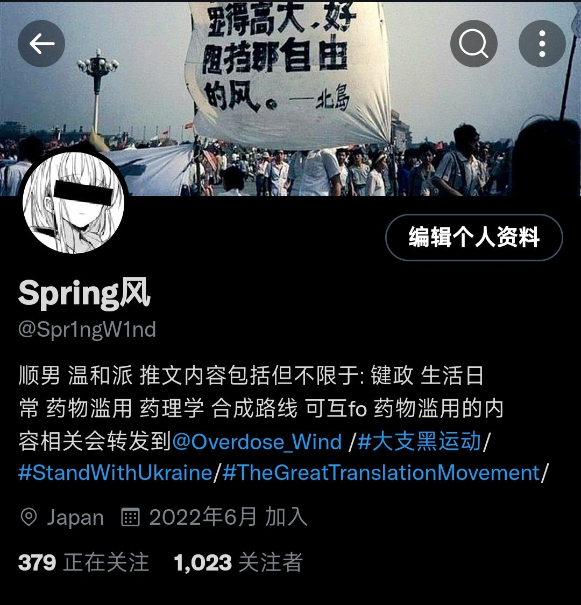                                                            |
| -------------------------------------------------------------------------------------------- |
| 2022 年 11 月 26 日，Spring风达成了 1000fo，也许当时的 OD 圈影响力重心正在快速向墙外平台转移 |

> Spring风#参宿四 @Spr1ngW1nd  
> 右美沙芬 24×15mg 测试  
> 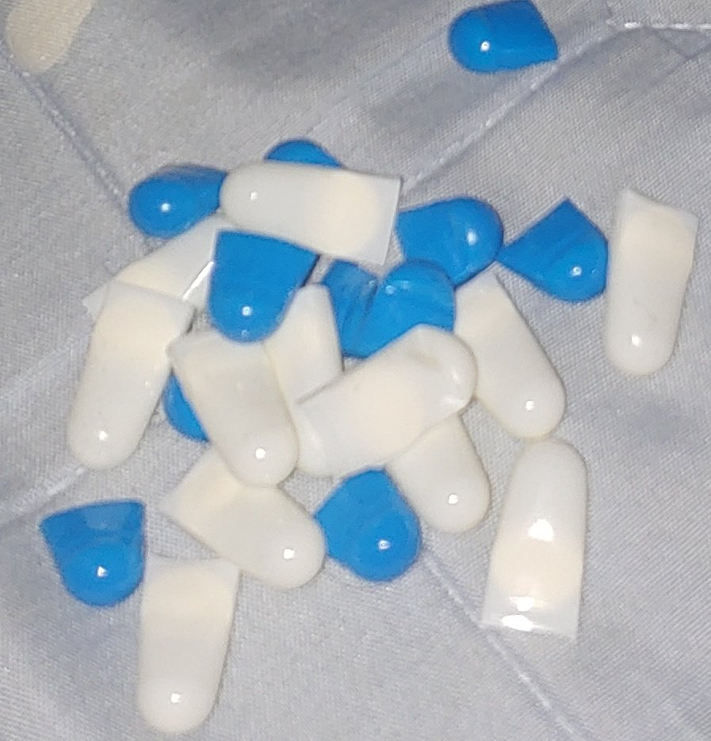  
> 7:56 PM · Dec 16, 2022  
> 21.8K Views
>
> Spring风#参宿四 @Spr1ngW1nd · Dec 16, 2022  
> 20:24 服用
>
> Spring风#参宿四 @Spr1ngW1nd · Dec 16, 2022  
> 21:31 我的脑子想让我吐
>
> Spring风#参宿四 @Spr1ngW1nd · Dec 16, 2022  
> 21:55 轻微痛觉消失 走路轻盈感
>
> Spring风#参宿四 @Spr1ngW1nd · Dec 16, 2022  
> 21:59 险些 呕吐
>
> Spring风#参宿四 @Spr1ngW1nd · Dec 16, 2022  
> 22:02 呕了

Spring风购买了[右美沙芬](../药物/右美沙芬.md)原粉，并将其装入胶囊，却无法避免呕吐......

> Spring风#参宿四 @Spr1ngW1nd · Dec 17, 2022  
> 昨晚的事情基本都忘完了 第一次接触那么高的解离(720mg) 只能说感觉有点像是急性精神病 幻觉 精神错乱  
> 貌似我嗑右美沙芬从上一周就只是有解离了 几乎没有那种起效时昏头的欣快感

> Spring风#参宿四 @Spr1ngW1nd · Dec 16, 2022  
> 右美沙芬 24×15mg 再给药（20点给药 21:40呕吐）

> Spring风#参宿四 @Spr1ngW1nd · Dec 17, 2022  
> 1:59 高解离

> Spring风#参宿四 @Spr1ngW1nd · Dec 17, 2022  
> 2:54 中解离

> Spring风#参宿四 @Spr1ngW1nd · Dec 17, 2022  
> 路上很困差点被车创

> Spring风#参宿四 @Spr1ngW1nd · Dec 17, 2022  
> 会不会因为肝脏衰竭死掉

> Spring风#参宿四 @Spr1ngW1nd · Dec 17, 2022  
> 高解离真感觉自己不是自己

> Spring风#参宿四 @Spr1ngW1nd · Dec 17, 2022  
> 高解离差点没给我橄榄 很想睡觉

> Spring风#参宿四 @Spr1ngW1nd · Dec 17, 2022  
> 那些真的是我干过的事情？

> Spring风#参宿四 @Spr1ngW1nd · Dec 17, 2022  
> 我感觉我今天出去毒驾的不是我驾的

> Spring风#参宿四 @Spr1ngW1nd · Dec 17, 2022  
> 意识恢复了些

> Spring风#参宿四 @Spr1ngW1nd · Dec 17, 2022  
> 48t应该对肝没什么影响吧

> Spring风#参宿四 @Spr1ngW1nd · Dec 17, 2022  
> 飞得最高的一次解离

> Spring风#参宿四 @Spr1ngW1nd · Dec 17, 2022  
> 解离太高了 我肾脏有点痛 现在能思考一点了

> Spring风#参宿四 @Spr1ngW1nd · Dec 17, 2022  
> 一切都是虚假的

> Spring风#参宿四 @Spr1ngW1nd · Dec 17, 2022  
> 1:18 精神状态有点不太稳 很晕

> Spring风#参宿四 @Spr1ngW1nd · Dec 17, 2022  
> 1:25 疼痛消失

> Spring风#参宿四 @Spr1ngW1nd · Dec 17, 2022  
> 我到底在哪

> Spring风#参宿四 @Spr1ngW1nd · Dec 17, 2022  
> 一切都不真实 想呕

> Spring风#参宿四 @Spr1ngW1nd · Dec 16, 2022  
> 有点怕等会前面24直接开始生效 后面叠加24直接bad trip进急救室

> Spring风#参宿四 @Spr1ngW1nd · Dec 16, 2022  
> 无所谓了 加

这就是Spring风最习惯的撰写的药物报告的方式——通过推文连载。Spring风声称这是他经历过的最高的一次解离——_区区_ 48t 右美沙芬的记录。然而，对如今的 ODer 们来说，服用这么高的剂量的右美沙芬似乎已经成为日常了……~~那么高的剂量，真的有必要嘛？~~

---

> 距离当局正式宣布放弃疫情的封控政策已经过了，然而全国人民并未沉浸在欣喜中。因为，在短短几个月前，当局的宣传机构还在鼓吹新冠后遗症的严重性，还向全国人民真心诚意地许下诺言，说我国将会与疫情抗争到底，绝对不会企图与病毒共存。

2022 年末，异变还是发生了。Spring风此前与上文提到的[彩霞](x.com/yukiukoori)交往非常密切，原因想必是因为两者都是热爱探索的“药师”——那时，ChatGPT 才出来不久，AI 远远没有普及，并不是所有人都能轻易获取信息的，只有那些既热爱探索，又懂得途径的人才能被称为这个称号。

<!-- 补一个佐证 -->

然而，当时彩霞已经消失了一个多月，到了 2022 年 12 月，终于有人放出有关彩霞的消息。而 Spring风发布的推文当即引起了大家广泛的注意。

> Spring风#参宿四 @Spr1ngW1nd  
> 跨性别人士 彩霞@yukiukoori  
> 因帮助未成年跨性别人士逃离原生家庭被其父母以及社群内成员恶意举报 于11月6日被上海警方以“聚众淫乱”污蔑逮捕 至今未能放出 如果“罪名”成立 将会面临五年以下有期徒刑  
> 1:24 AM · Dec 21, 2022  
> 313K Views  
> Spring风#参宿四 @Spr1ngW1nd · Dec 21, 2022  
> 相关内容  
> 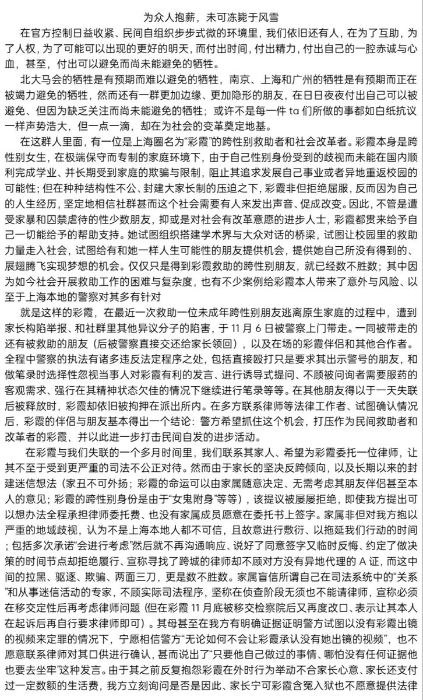
> 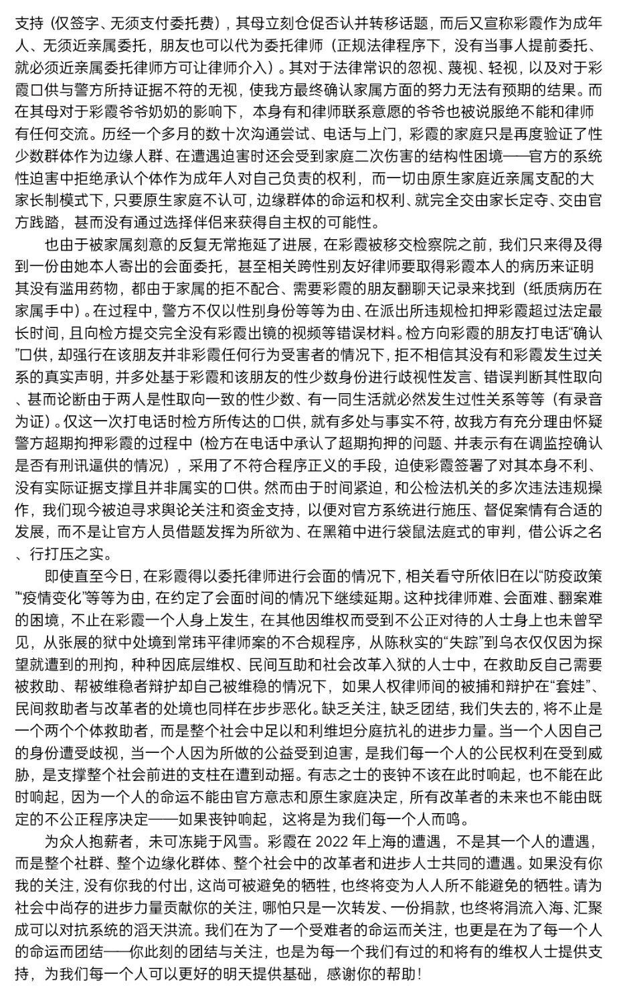
>
> Spring风#参宿四 @Spr1ngW1nd · Dec 21, 2022  
> 被捕当天没有聚众淫乱 但是当天被捕的四个人 其中一个人的手机里查到了淫乱的视频 尽管视频里的人不是彩霞 警方依然把案件定为“聚众淫乱” 给彩霞以“聚众淫乱”定罪
>
> Spring风#参宿四 @Spr1ngW1nd · Dec 21, 2022  
> 警察的诱导式提问分明就是想要冲业绩做出的表现 这类案件定性本身就没那么严重 却非要以其他人手机的淫乱视频给彩霞定罪 这不是冲业绩是什么
>
> Spring风#参宿四 @Spr1ngW1nd · Dec 21, 2022  
> 警方超期扣押 刑讯逼供 执法不当 诬告陷害 完完全全的官僚主义
>
> Spring风#参宿四 @Spr1ngW1nd · Dec 21, 2022  
> 我很愤怒 莫须有的罪名套在了自己的身上 这种无力回天的感觉 真是令人恶心

据称，[彩霞](x.com/yukiukoori)被自己帮助过的人所陷害。可以肯定的是，彩霞的被捕严重恶化了Spring风的精神状态。

这便是[彩霞](x.com/yukiukoori)的下场，“聚众淫乱罪”、“五年以下有期徒刑”。此后，彩霞再也没有在公开场合抛头露面过。

之后的很久一段时间内，彩霞音讯全无。

跳到后来，2023 年 3 月，[寒涟漪](x.com/HANLIANYI331)，一位仍然活跃的跨性别著名活动家，在推特[发文](https://x.com/HANLIANYI331/status/1638083781327474689)，为彩霞的律师费募捐。在推文中，寒涟漪声称：

> 2022年11月，上海一位名为“彩霞”的跨性别女性被警方带走调查，同时一同被带走调查的还有当时住在彩霞家中的其他三名跨女。除了以上四位，被各地警方安排到公安局问审的同时还有4名跨女（当时不在彩霞家住但和彩霞有联系的）。
>
> 几天后，被调查的其他三名跨女被警方联系家长领回家，彩霞被继续关押调查，一直到今天。
>
> 事件的起因是彩霞在尝试帮助家暴跨女的过程中，收留了三名跨女（其中包含两个未成年，以下称已成年的为A，未成年的为B和C）在自己的家中（彩霞家中除了彩霞以外，还有她的爷爷奶奶居住），其中A和B在彩霞家中发生边缘性行为（互相帮助使用成人用品）时，C在一旁参与拍摄并且录制了视频，此时彩霞并不在自己的家中。
>
> 后来C离开彩霞家回原生家庭以后，C删除了自己手机上录制的视频，但是忘记清空回收站。于是在C的家长在C不知情的情况下偷偷翻阅手机时，被找到了拍摄的视频，随后C的家长报了警。
>
> 上海警方接到报警，查看了视频以后，认定这属于一场聚众淫乱（视频中的两人外加拍摄的一人），且参与这场聚众淫乱的三人有二人是未成年，需要当做“典型”从严从重处罚。经过调查后，警方认为彩霞是这场聚众淫乱的主要组织者（通过视频证据和四人社交关系的摸查），因此决定以“聚众淫乱罪”对彩霞发起公诉，此时彩霞将面临3到5年的刑期。
>
> 在这次刑事案件中主要出现的问题有：
>
> 1.警察在闯入彩霞家抓人的时候，态度非常粗暴，调查程序和审讯过程也严重不合规范，在警察的恶意引导下，彩霞最终签下了和事实严重不符的口供。检方还打电话诱供其中一位参加审讯的跨女 ，希望她能作证彩霞组织了八次聚众淫乱且有她参与，但实际上并没有。同时警察获取的视频证据，获取的手段本身也是非法的。
>
> 警察在现场的粗暴行为严重刺激到了现场所有人脆弱的精神状态，在彩霞被关押后，彩霞社交圈的十几名跨女在之后数个月的时间也受到了频繁调查，彩霞社交圈内出现了新一轮的自杀高峰，已有2名原彩霞社交圈内的跨女因自杀而死亡。
>
> 2.在审讯的过程中，彩霞的家人拒绝为彩霞提供任何的帮助和资金支持，也拒绝关注这个案件。且警察长时间阻止彩霞和她的朋友见面。一直发展到案件快进入一审阶段的时候，和彩霞关系亲密的跨女才通过各种艰难的方式成功和律师一起见到彩霞，并且让彩霞成功签下委托律师书（但律师坦言，这时候签已经太迟了，错过了太多机会）。
>
> 3.严重的资金压力：目前因为彩霞的原生家庭拒绝为彩霞提供任何资金支持，也不愿意进行任何程序上和言语上的配合，对彩霞的事情直接一概不管，也拉黑了所有彩霞朋友的联系方式。
>
> 目前彩霞的律师费用完全为彩霞的一个对象（也是一名跨女）和彩霞的亲密朋友在承担，她们目前已经掏空了所有的存款且借了大量的贷款同时在竭尽所能的募捐。但律师费用仍然有缺额，且最多只能支撑到一审结束。
>
> 4.彩霞的法律性别为男性，这意味着彩霞在监狱里必须住在男监里且必须剃光头，同时无法得到激素类药物的治疗。
>
> 关于彩霞本人的争议：
>
> 彩霞本人具有OD（药物滥用）成瘾。
>
> 尽管彩霞有过进行具有家庭暴力，自杀危机的跨女救助；但是彩霞曾经有过在对面临家庭暴力，自杀危机的未成年跨女进行自杀干预的过程中，通过引导当事人进行OD的方式来让当事人减轻自杀想法的做法，最终导致当事人因此产生了药物依赖，OD成瘾。
>
> 在这里需要注意的是：彩霞具有专科的医学背景，同时一直有在自学精神病学。通过短期内服用一定剂量的精神类药物来减轻抑郁症患者自杀想法这种医疗方法，在某些医院已经进入临床试验阶段。但是这种方法在任何一家正规的医院都有非常复杂并且严格的限制。
>
> 而彩霞通过这种做法去进行自杀干预的时候并没有条件去遵循这些限制，因此导致了恶劣的后果；一位曾被彩霞自杀干预过的未成年跨女OD成瘾，她在离开了彩霞家一段时间以后，因药物自杀被送进了ICU急救。（急救费还是琴春承担的）
>
> 当然，即使我本人（寒涟漪）也必须承认：对于国内未成年家暴且自杀倾向严重的抑郁跨女现状来说，实际上并没有完美的自杀干预方法，在原生家庭拒绝提供资金支持和医保支持的情况下，且国内相当部分的精神科都要求未成年住院需家长签字和陪同（尤其是在自杀情况危急需要非自愿住院的情况下）。让案主去走正规精神科住院途径对一般的干预者和救助者来说非常困难。
>
> 这种情况下干预者面临的往往是二选一的局面：在无法成功将案主转介给能解决问题的人的情况下，要么看着当事人死，要么通过不合规且有极大风险和后患的手段去先把眼前的危机解决掉。而更好的方法，要么是难度更大，要么是超出了干预者的能力范围。
>
> 关于本篇文章的目的：
>
> 由彩霞的一个对象发起的募捐，但是你在决定捐款前，请知悉以下几点
>
> 1.本次募捐仅用于彩霞的律师费用，最终这些金钱实际能达成的成果仅在于尽可能的去减轻彩霞被判决的刑期
>
> 2.对于这次刑事案件，寒涟漪不会进行任何金额的支持。因为尽管寒涟漪也希望这个案件尽可能的轻判，但是寒涟漪认为这个案件需要的律师费用，可以给予更多的人更多的帮助。

不知道[寒涟漪](x.com/HANLIANYI331)等人最后能否帮到她。

[彩霞](x.com/yukiukoori)被捕当时在场的另外三人，随后全部相继自杀离世。

再后来就是 2023 年 11 月了，跨性别圈似乎接受了在彩霞被捕这件事上达成一个较好的结果是不可能的这一事实，并把彩霞案被作为一个跨性别圈的例子，警示其他跨性别人士如何妥善地应对执法部门，以免陷入执法部门设下的圈套，详见这一脚注[^3]。~~虽然但是，直接这么说执法部门好吗？~~

尽管她的善意动机，的饱受争议的行为让她成为了后世的批判的靶子。

近期，某些跨性别反 OD 人士如全然不顾历史事实，将彩霞和她的朋友们视为OD行为被引入跨性别圈子的罪魁祸首，毫不留情地批判。毕竟，在监狱里的人不能反驳，她的朋友们也相继自杀，ODer 们的腰杆也没有直到能为 OD 辩护。所以这种批判行为完全是单边的，十分安全，因此这种批判饱受某些跨性别反 OD 人士的欢迎。

她们每隔一段时间就写一篇反 OD 小作文刷存在感，怒斥 Overdose 如何地坏，彩霞如何地罪该万死，仿佛这样就能让彩霞的入狱合理化了，尽管彩霞的入狱与 OD 并没有直接关联。大家看了后，就把它当玩笑话吧，毕竟这些跨性别反 OD 人士也有难处啊。

### “剧烈变形”

说起 OD 圈历史上最臭名昭著的药物致死事件有哪些，截至笔者撰写本文的 2026 年 2 月 23 日，前三是几乎毫无争议的。那一年即将发生的 Spring风之死，即 `剧烈变形` 事件，是所有人心中的榜首，这一点没有任何争议；一年后将要发生的彩加之死也可确定入围前三；而另一个前三恶劣事件的死者居然是笔者加入OD圈以来合作最密切的一位，令笔者大受震惊。

另外两个事件将在之后提到，现在先按时间顺序叙述最接近的 `剧烈变形` 事件。此事的上文，最好从事故发生的前几天开始讲起。当时正是 2022 年末，2023 年初的时候。

正值寒冬之际，一则意外的消息令 Spring风的精神状态进一步恶化，那是一名推特网友离世的消息。

> 鈴木真依MissSuzuki @MissSuzuki23  
> 我現在需要告訴你們一個很殘忍的消息… @Aniloviraw  
> 永遠的離開了我們…  
> 「願您的星空旅行愉快，我們終將相見」  
> 今年我們見證了太多悲劇…  
> 我希望各位可以知道這個消息…因為失去了沒人知道也是很可憐的一件事…  
> 11:19 AM · Dec 30, 2022

死者的推特名叫 Anilovr，生前与 Spring风的关系很好，似乎是他的相当重要的人物。据称，在生命的最后时刻，Anilovr在推特用户名后面加了一个后缀，“`#参宿四`”，那一颗现在也许已经不再存在的星星。

> Spring风#参宿四 @Spr1ngW1nd  
> Dec 30, 2022  
> 听到这个信息的时候 感觉没有情绪 不是悲伤也不是任何 感觉有些虚假 就如同家里人突然与世长辞的感觉 太突然了 以至于让我觉得这都是虚假的 解离的感觉 理应我是应该感受到悲伤  
> (引用该推文)

Spring风发表了一个悼念的推文，随后在自己的用户名后也加上了一个“`#参宿四`”以纪念这位推特网友。 **悲伤的是，当时没有人能料到，他的账号将永远带着这个`#参宿四`。**此后，Spring风再次多次发推文哀悼 Anilovr。

> Spring风#参宿四 @Spr1ngW1nd  
> 梦到Ani回我信息了  
> 10:21 AM · Dec 31, 2022
>
> Spring风#参宿四 @Spr1ngW1nd  
> Dec 31, 2022  
> 好像是梦到发信息给我说被救回来了 大概好像是说好苦什么的

> Spring风#参宿四 @Spr1ngW1nd  
> 现在翻了翻聊天记录 才忽然明白是什么意思了...今天上推看到信息说昨晚上Ani火化了...昨晚梦到她被急救过来了QQ发信息说口干 嘴巴苦......  
> 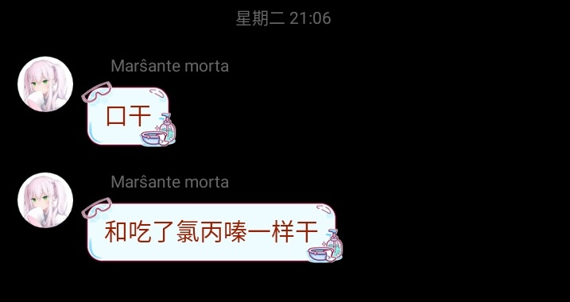  
> 1:30 PM · Dec 31, 2022

> Spring风#参宿四 @Spr1ngW1nd  
> 还是不能接受 如果说是有一天突然回我信息了说自己没大事呢  
> 4:46 PM · Jan 1, 2023

> Spring风#参宿四 @Spr1ngW1nd  
> 还是不能接受啊 还是不能接受啊 万一只是暂时退推一段时间呢 万一只是暂时不想接触互联网这种呢 还是没办法接受还是没办法接受啊 越来越多的信息指向她已经离开了  
> 11:18 PM · Jan 3, 2023

> Spring风#参宿四 @Spr1ngW1nd  
> 参宿四以不稳定著称 远在640光年外的它或许早就消失 但是人们依然可以仰望星空看到它 即便参宿四早已消失 而人们依然可以仰望着你 你说是吗
> 抬头 便能看到在星空中的你  
> 1:40 AM · Jan 4, 2023

任何人都能看出，他的精神状态正在迅速恶化。短短 10 天内，Spring风接连失去了两名挚友。挫折、无奈、绝望、痛苦......这些词汇极为适合用来形容他的精神状态。然而，他可是“药师”，虽然有点夸张但是他可背负了药圈探索新药物的希望，药圈的绝望者们、抑郁者们、痛苦者们、悲痛者们的眼睛直勾勾地盯在他的身上，所以他必须回应他们，他必须展现出自己拥有应对他们的期望的能力，即便是在这样的危机之下。

而为了应对他们期望，他必须测试并发推文报告一些未经公开测试的药物，比如[相思汤](../药物/相思汤.md)(一说[死藤水](../药物/死藤水.md)，总之都是含有 [DMT](../药物/DMT.md)的植物提取品)、[哮喘片](../药物/哮喘片.md)、[司来吉兰+苯乙胺](../药物/司来吉兰+苯乙胺.md)。

可想而知，正是恶劣的精神状态让他使用药物的行为变得更加鲁莽。他在 2023 年 1 月上旬的几个推文中，多次声称自己测试了[司来吉兰+苯乙胺](../药物/司来吉兰+苯乙胺.md)，一种当时正处于药圈研究焦点的[兴奋剂](../文档/药物分类/兴奋剂.md)。

而这一篇记录推文所反应的问题尤为突出：

> Spring风#参宿四 @Spr1ngW1nd
>
> 司来吉兰+苯乙胺组合 测试  
> 2:25 PM · Jan 4, 2023  
> 62.7K Views
>
> Spring风#参宿四 @Spr1ngW1nd  
> · Jan 4, 2023  
> 司来吉兰 2×5mg 14:28 服用
>
> Spring风#参宿四 @Spr1ngW1nd  
> · Jan 4, 2023  
> 16:33 服用苯乙胺 约500mg
>
> Spring风#参宿四 @Spr1ngW1nd  
> · Jan 4, 2023  
> 16:44 脑袋莫名开始有些轻盈 身体开始发轻 手开始不痛
>
> Spring风#参宿四 @Spr1ngW1nd  
> · Jan 4, 2023  
> 16:45 不再焦虑烦躁 感觉手臂变轻了 心脏跳的更快
>
> Spring风#参宿四 @Spr1ngW1nd  
> · Jan 4, 2023  
> 16:46 手臂酸痛消失 烦躁情绪消失 心跳加快
>
> Spring风#参宿四 @Spr1ngW1nd  
> · Jan 4, 2023  
> 16:47 脑袋有轻微电流穿过 好震撼的感觉 清醒的感觉 活着的感觉
>
> Spring风#参宿四 @Spr1ngW1nd  
> · Jan 4, 2023  
> 16:47 进入很专注的状态
>
> Spring风#参宿四 @Spr1ngW1nd  
> · Jan 4, 2023  
> 16:48 视线开始轻微有些异常 脑袋有轻微电流 身体在变轻
>
> Spring风#参宿四 @Spr1ngW1nd  
> · Jan 4, 2023  
> 16:50 人变得非常清醒 比其他什么时候都清醒 清晰的能感受到自己的心跳
>
> Spring风#参宿四 @Spr1ngW1nd  
> · Jan 4, 2023  
> 16:51 时间不再像刚才那样漫长煎熬
>
> Spring风#参宿四 @Spr1ngW1nd  
> · Jan 4, 2023  
> 16:54 心跳113
>
> Spring风#参宿四 @Spr1ngW1nd  
> · Jan 4, 2023  
> 16:55 刚开始来的感觉特别强烈 后面适应过后貌似还好？ 心跳102
>
> Spring风#参宿四 @Spr1ngW1nd  
> · Jan 4, 2023  
> 16:56 心跳125
>
> Spring风#参宿四 @Spr1ngW1nd  
> · Jan 4, 2023  
> 16:57 胃部强烈 刺激 想呕吐
>
> Spring风#参宿四 @Spr1ngW1nd  
> · Jan 4, 2023  
> 17:01 刚进入状态会有强烈的刺激感 后随着适应刺激刺激变得不那么强烈（？）
>
> Spring风#参宿四 @Spr1ngW1nd  
> · Jan 4, 2023  
> 17:05 我猜测胃部的一些还没有吸收 有些只是通过舌下到达了脑内 有可能之后在胃部吸收的还会产生第二轮高峰
>
> Spring风#参宿四 @Spr1ngW1nd  
> · Jan 4, 2023  
> 17:09 困意
>
> Spring风#参宿四 @Spr1ngW1nd  
> · Jan 4, 2023  
> 17:10 嗜睡 手机信息有点乱点 看不清什么的 判断有些问题
>
> Spring风#参宿四 @Spr1ngW1nd  
> · Jan 4, 2023  
> 17:30 吸入了 1×75mg 安非他酮
>
> Spring风#参宿四 @Spr1ngW1nd  
> · Jan 4, 2023  
> 17:41 头皮有发麻感觉
>
> Spring风#参宿四 @Spr1ngW1nd  
> · Jan 4, 2023  
> 17:44 心跳 76 明明很低 但是还是能清晰听到 希望别因为心肌膜炎给我寄了就行
>
> Spring风#参宿四 @Spr1ngW1nd  
> · Jan 4, 2023  
> 17:57 心跳 100 貌似没有药效 或者说是没有那种刚开始特别的感觉了
>
> Spring风#参宿四 @Spr1ngW1nd  
> · Jan 4, 2023  
> 21:54 不想动 不想上网不想碰手机不想接触任何东西

在这个长达 3 小时的药物报告连载中，Spring风记录了自己的心率，以增加安全性。这种[减少伤害](../文档/负责任的用药索引页.md)的方法诚然值得肯定，但是 Spring风却展现出了一些令人担忧的鲁莽的用药方式。例如，他在药效结束后未能抵制自己陷入[强迫性补量](../药效/强迫性补量.md)状态，一种典型由兴奋剂产生的[药效](../药效/index.md)。他[鼻吸](../文档/给药途径.md)了[安非他酮](../药物/安非他酮.md)，可想而知是为了缓解[兴奋剂](../文档/药物分类/兴奋剂.md)的难受的[退效](../文档/药效下降期.md)反应。

| 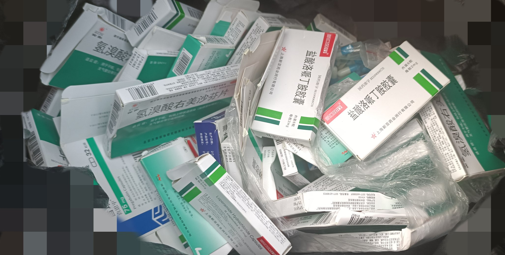                                                                                                                                                                                                                                                                                                      |
| -------------------------------------------------------------------------------------------------------------------------------------------------------------------------------------------------------------------------------------------------------------------------------------------------------------------------------------- |
| 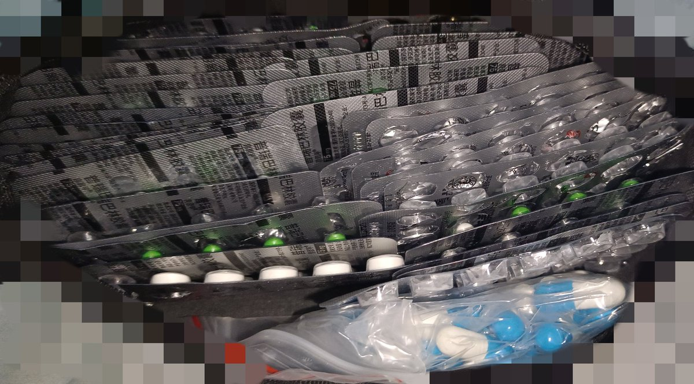                                                                                                                                                                                                                                                                                                     |
| 2023 年 1 月 7 日 Spring风在推特上发表的两张图片，配文“武器展示”。<br>图片中，可见 Spring风囤积了大量药物，如[洛哌丁胺](../药物/洛哌丁胺.md)、[右美沙芬](../药物/右美沙芬.md)、[普瑞巴林](../药物/普瑞巴林.md)和一些胶囊。<br>可想而知，这些胶囊肯定是空胶囊，用于装填药片或粉末如苯乙胺试剂，以缓解吞服大量药物时的苦味和消化道刺激。 |

悲剧发生在 2023 年 1 月 8 日。那天早些时候，Spring风发推文，声称自己服用了一种药物——[哮喘片](../药物/哮喘片.md)。后来，很多人怀疑，正是这个药物导致了这场悲剧。

这篇药物记录，便是 Spring风生前最后一篇完整的药物记录了。

> Spring风#参宿四 @Spr1ngW1nd  
> 罂粟壳药物 24片 测试  
> 每片约含有0.5mg[吗啡](../药物/吗啡.md) 2.5mg[麻黄碱](../药物/麻黄碱.md)
> 共计12mg吗啡 60mg麻黄碱
> 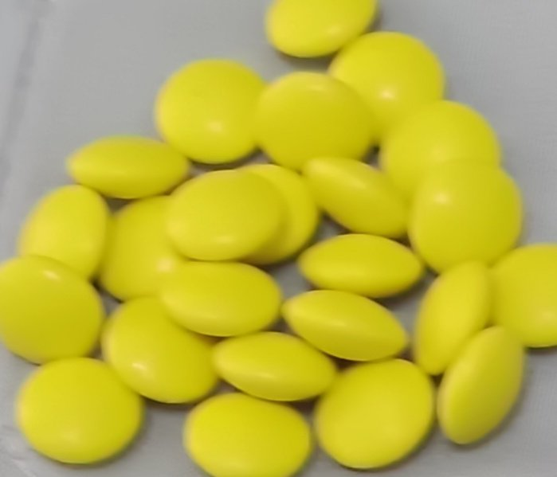  
> 2:31 PM Jan 8, 2023
>
> Spring风#参宿四 @Spr1ngW1nd  
> · Jan 8, 2023  
> 14:33 服用
>
> Spring风#参宿四 @Spr1ngW1nd  
> · Jan 8, 2023  
> 15:39 身体有些发轻了 镇痛
>
> Spring风#参宿四 @Spr1ngW1nd  
> · Jan 8, 2023  
> 15:43 感觉有些镇咳的感觉 咳嗽相对来说不会那么痛
>
> Spring风#参宿四 @Spr1ngW1nd  
> · Jan 8, 2023  
> 15:51 呼吸抑制（呼吸深度变浅）
>
> Spring风#参宿四 @Spr1ngW1nd  
> · Jan 8, 2023  
> 15:34 头发晕
>
> Spring风#参宿四 @Spr1ngW1nd  
> · Jan 8, 2023  
> 16:22 欣快感刚才时候可能有一点 偏向于比较自信？ 有一点镇痛效果 我再等等看
>
> Spring风#参宿四 @Spr1ngW1nd  
> · Jan 8, 2023  
> 16:31 音乐更像是从远处一些地方飘过来  
> 4:32 PM · Jan 8, 2023  
> ·  
> 87.9K Views
>
> Spring风#参宿四 @Spr1ngW1nd  
> · Jan 8, 2023  
> 16:38 阿片类的口干？还是什么

Spring风吞下 24t 哮喘片时，是当天下午 2 时 31 分。而那时，距离那臭名昭著的“`剧烈变形`”，仅剩不到 6 个小时。在这一种制剂所含的两种成分中，[吗啡](../药物/吗啡.md)才是真正有娱乐价值的。

然而，吗啡并不能轻易大量获得。而能够比较容易获得的，只有复方了[麻黄碱](../药物/麻黄碱.md)的药物。这些药物的适应症通常为哮喘——前者属于[抑制剂](../文档/药物分类/抑制剂.md)，可以抑制呼吸神经中枢，缓解哮喘患者的呼吸急促问题，后者扩张支气管，缓解哮喘导致的支气管痉挛。

在我国，哮喘是一个常见疾病，且难以根治，所以患者必须定期服药才能缓解。虽然这种药物早已被禁止在网络上销售，只能在线下购买，且需要凭处方和身份证，但是仍然有娱乐性使用的可能性。

虽然 Spring风在第一个推文中提到过，自己知道那些药片里有麻黄碱，但在他的药物记录中，他似乎只着重于记录吗啡作为[阿片类药物](../文档/药物分类/阿片类药物.md)的药效。这也许表明，他放松了对于麻黄碱的警惕，酿成了悲剧......

[麻黄碱](../药物/麻黄碱.md)是一种[兴奋剂](../文档/药物分类/兴奋剂.md)，[Drugbank](https://go.drugbank.com/drugs/DB01364) 的数据表明，[麻黄碱](../药物/麻黄碱.md)的代谢半衰期约为 6 小时，也就意味着，在那天晚些时候，服用致幻剂时，Spring风的体内很可能仍然残留着至少一半的麻黄碱。作用机理上，麻黄碱所影响的神经递质系统主要是[去甲肾上腺素](../文档/去甲肾上腺素.md)，次要是[多巴胺](../文档/多巴胺.md)，二者都是兴奋性神经递质。麻黄碱由神经递质转运蛋白介导，[促进神经递质的释放](../文档/神经递质释放剂.md)。这意味着，它还会同时竞争性抑制神经递质由转运蛋白介导的[再摄取](../文档/神经递质再摄取抑制剂.md)。这些效应导致[突触](../文档/突触.md)间隙的去甲肾上腺素和多巴胺的浓度提高，达成其兴奋效应。

正是因为这种机理，当[麻黄碱](../药物/麻黄碱.md)与[单胺氧化酶抑制剂](../文档/单胺氧化酶抑制剂.md)共同存在于人体内时，会发生异常恶劣的[药物相互作用](../文档/危险药物联用.md)。这种效应类似于头孢配[酒](../药物/酒精.md)，却远远比它恶劣。

这是因为，在人体中，[单胺](../文档/单胺.md)类[神经递质](../文档/神经递质.md)(去甲肾上腺素和多巴胺都属于单胺类神经递质)在被突触前膜释放后，主要存在两种途径降解。

其一是通过单胺氧化酶被转化为醛类代谢产物，无法正常[激动](../文档/受体激动剂.md)[受体](../文档/受体.md)，而这种降解途径在这个条件下已经被单胺氧化酶抑制剂抑制了；

第二是通过相应的转运蛋白再摄取回收至突触前膜，但在这条件下，这种途径也已经被麻黄碱抑制了。

综合两种条件都被抑制的情况，单胺类神经递质无法被高效地降解，突触间隙的去甲肾上腺素和多巴胺的浓度超过安全水平，突触后膜的受体以极高的频率被激活，[神经元](../文档/神经元.md)以一种错乱的频率发出神经冲动，极有可能会导致[惊恐发作](../药效/惊恐发作.md)、[精神病发作](../药效/精神病发作.md)。而那些负责调节血压、心率的神经元也是如此。<!-- 需要验证-->后果便是[高血压](../药效/血压升高.md)、[心动过速](../药效/心率增快.md)，最终可能导致死亡。

以上还是不考虑致幻剂的幻觉效应的结果……

据传言称，他当时服用的，是一种植源致幻剂——[相思汤](../药物/相思汤.md)[^4]。这种植源致幻剂含有两种活性成分：[二甲基色胺(DMT)](../药物/DMT.md)，以及在这种情况下会导致悲剧的[单胺氧化酶抑制剂](../文档/单胺氧化酶抑制剂.md)，分别来自两种不同的植物。之所以在相思汤中，DMT必须与单胺氧化酶抑制剂配合服用，是因为胃肠道中含有的单胺氧化酶会分解DMT，生成无效的代谢产物。

<!-- 这里的顺序很怪，以后再说吧 -->

即便传言有误，spring风服用的并不是相思汤，而只是普通的某个[色胺类](../文档/药物分类/色胺类物质.md)[迷幻剂](../文档/药物分类/迷幻剂.md)，残留在其体内的[兴奋剂](../文档/药物分类/兴奋剂.md)与任何迷幻剂都会产生恶劣的药物相互作用。

也不知道，他是不懂；还是说，他抱有侥幸心理；或者是，他明知山有虎、偏向虎山行……Spring风早已预定好了新一轮的测试。他终究还是在未等麻黄碱被完全排出体内的情况下，仓促地决定开始了新一轮的测试。

既然那一天的[致幻剂](../文档/药物分类/致幻剂.md)测试是他早就计划好的，当时也没有发现这一重大隐患的人劝阻他，他就按原计划去做了。

> Spring风#参宿四 @Spr1ngW1nd  
> 6:07 PM · Jan 8, 2023  
> 在思考致幻剂没有人陪是不是有点危险 我等会把刀子那些收了和大门口给锁了先

仿佛是预感到了危机的到来，Spring风排查发现了三个安全隐患，也不知道他是否采取了有效的措施解除这些隐患。

无论如何，它们并未影响结局。

接下来，你将要目睹的，是药圈历史上最臭名昭著的悲剧。

> Spring风#参宿四 @Spr1ngW1nd  
> · Jan 8, 2023  
> 致幻剂 测试  
> 7:49 PM · Jan 8, 2023
>
> Spring风#参宿四 @Spr1ngW1nd  
> · Jan 8, 2023  
> 19:47服用
>
> Spring风#参宿四 @Spr1ngW1nd  
> · Jan 8, 2023  
> 19:55 轻微恶心感

> Spring风#参宿四 @Spr1ngW1nd  
> 8:04 PM · Jan 8, 2023  
> 色胺
>
> (同一个推文下，但在串外的一个回复)

这条推文是他生前倒数第三条推文，看上去似乎特别仓促。也许这表明，他此时就已经陷入迷乱的状态了。

现在，距离他发出那最后一条臭名昭著的推文仅剩 7 分钟。

> Spring风#参宿四 @Spr1ngW1nd  
> · Jan 8, 2023  
> 20:10 视觉开始变形
>
> Spring风#参宿四 @Spr1ngW1nd  
> · Jan 8, 2023  
> 20:11 剧烈变形

当看到这一个令人迷惑的推文时，很多药圈内外的人士们都在好奇：在发送出“[剧烈变形](../药效/几何.md)”的那一刻，Spring风到底正在经历什么呢？以及，在他“剧烈变形”之后呢？

<!-- 此处的笔者指鼠尾草

笔者对此深有体会，虽然笔者并非与Spring风通过服用相思汤达到过这一状态，而是通过[某种](../药物/DPT.md)据说更阴暗的[研究用](../文档/研究用化学品.md)的[色胺类物质](../文档/药物分类/色胺类物质.md)。而那是两年以后，药圈已沧海桑田了。

*这一段挪到以后再讲，暂时放在这*

---

笔者第一次服用任何种类的[迷幻剂](../文档/药物分类/迷幻剂.md)。当时，笔者的电子天平坏了，但是仍然打算尝试一下。于是，笔者仅凭直觉，从包装袋中倒出了貌似差不多有50mg(50mg约为此物质的[中等剂量](../文档/药物剂量分类.md))的该物质，便拿起吸管，通过[鼻吸](../文档/给药途径.md)摄入。

当时，笔者[心境](../文档/情景与心境.md)良好，戴着耳机，听着提前准备好用于[幻觉体验](../药效/幻觉状态.md)的歌单。

鼻吸药物15分钟过去，笔者突然感到 剧烈变形。以后再写吧

--- -->

最后一条不明不白的推文发布后，[Spring风](../文档/补档/Overdosewiki/Report/RP-74.md)，这名OD圈早期药物探索者的故事到此结束了。但是，据传言称，他并没有立即丧命，而是被其家属发现，送医后抢救了四天，直到 1 月 11 日才死。

然而，也许是根本没有人在线下与他有接触，并没有人像<ruby>当时上个月<rt>2022-12</ruby>推友 Anilovr 逝世一样，立即公布了他的死讯。ODer 们对此一直不知情，而是焦急地等待他再次发布推文，来宣布自己在消失期间到底发生了什么。

令 ODer 们的希望破灭的是，随着时间逐渐流逝，Spring风账号再也没了动静。他们认定了他已经死亡这一事实，以及，这名药师再也不会出现了，连同那些仍有待探索的药物们。

Spring风之死在 OD 圈引起了巨大的反响。最直观的是，它带来了第一波 ODer 们对于探索[娱乐性用药](../文档/娱乐性用药.md)的反思，毕竟，即便是身为经验丰富的“药师”的 Spring风也难逃一死。此事所有 ODer 们亲眼证明，药物是能造成严重的伤害的。

常用的 OD 药物的种类有限，但那些尚未探索的药物种类有千千万万种，能够造成的伤害更是罄竹难书，且神秘莫测。即便有侥幸逃脱的可能，也是“逃得了初一逃不过十五”。为了防止自己受到*真正的*伤害，许多人不敢测试新药。

这，大概是 OD 圈暂时停止了探索新药的脚步的一个原因。而当一年后，另一个更重要的一个原因不再成立后，药圈对于新药的探索将迎来另一个巨大的爆发。~~先问是不是，再问为什么。~~

_最后他是怎么被证明死了的呢？如果你有材料，请帮笔者补充。_

## 2024年 体系化的一年

<!-- 得赶紧写了!!! -->

所有上过网的人都知道，自媒体就得靠流量吃饭。不论到底是好是坏，总有愿意涉足灰产话题的自媒体们。

<!-- 这一段不知道加到哪里好-->

早在 2022 年，OD圈尚未进入主流。而他们便开始利用OD圈作为炒作的对象。更准确地来说，是 OD 药物，例如[右美沙芬](../药物/右美沙芬.md)。他们既利用人们的好奇心，又同时激起了人们的更下深入的好奇心，尤其是当当局禁毒媒体入手以前，这些自媒体还是有很大自由余地的。

而那些被激起好奇心的人，包括下文即将提到的一位将会改变 od 圈的人物。

> 超级后后后藤 @Overdose_DBD  
> 2022年08月09日，你是励志要当化学工程师的落榜中考生，平日里最大的爱好是作曲，最爱的偶像是超天酱。这天你打了一下午的彩虹六号，正在刷视频，偶然间看到了一个叫“圈内师老师”的UP发了一个视频，说有些青少年拿一种叫“右美沙芬”的止咳药来磕  
> 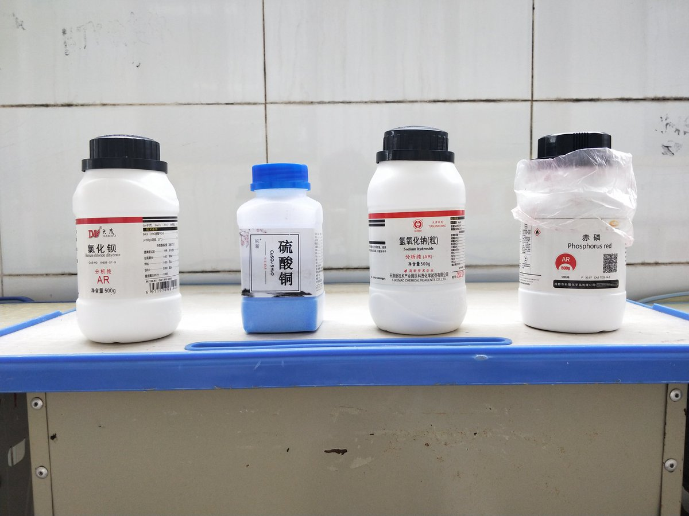  
> 6:27 PM · Aug 9, 2024

这，便是后藤老师 OD 之梦开始的地方。_谁还不是这样开始的呢?_

接下来，让我们一起探究超级后后后藤这一人物吧。

后藤在接触 OD 后，在 2022 年 8 月 29 日首次开始 OD（见[odwiki RP-7](../文档/补档/Overdosewiki/Report/RP-7.md)），之后，他了解到了足够多的 OD 知识，并意识到了[减少药物使用带来的伤害](../文档/负责任的用药索引页.md)的重要性，却遇到了大量亟需拯救的 ODer 们。后藤<sup>退圈前，</sup>亲自声称：

> 超级后后后藤 @Overdose_DBD  
> Aug 9, 2024  
> 2023.03，我看着吧里乱传什么“愈美有甘油”的史诗级胡话，便发了个“愈创甘油醚≠甘油”。那时我略知一二，经常掺和吧里解疑答惑。慢慢找我问的人多了，我当时就目的着减害了，剂量压低，宣传危害。我至少掺和宣传了“不得pr+晚安”“美金刚大脑空洞”。2023.08，我加入了很多od群，包括欧d群
>
> 超级后后后藤 @Overdose_DBD  
> Aug 9, 2024  
> 各种群，我待欧d群里最得好。当时我微信正好叫“后藤一里”，大伙们在群里问，我答几句。答得多了，大伙们都认得我“后藤”了  
> 那时我就琢磨着减害。压剂量，说危害。那张白兔指南，当年真的劝退了几个人；为什么odw引论注意事项第一句“舍曲林不能o”？当年真的好多人问这个！
>
> 超级后后后藤 @Overdose_DBD  
> Aug 9, 2024  
> 注册这个号，后来欧d群解体，我加入余下成员自发零散的群。2024.01，有一个贴吧来加我的人，邀请我写他的网站“overdosewiki”。我当时想，一个个答太浪费时间了，就这样一个站点，大伙们一看就好了，多方便啊！更能减害了不是嘛？于是我加入了……  
> 狗官走上了不归路！  
> 8:03 PM · Aug 9, 2024

在 2023 年 OD 还要火未火的时候，后藤便已经加入了百度贴吧，为 ODer 们答疑。当时，许多人听到了“过量服药”的传言，看着各种手边的药物，主要是 [SSRI](../文档/SSRI.md) 类药物和[抗精神病](../文档/抗精神病药.md)药物，就想是否能够使用这些药物改变意识状态。答案当然是否定的，而且，过量服用这些药物还会导致严重的健康风险，包括[血清素综合征](../文档/血清素综合征.md)。

但是此类问题居然是群中的主要问题。这让后藤意识到了，ODer 们面临着有待减少的伤害，一个个答这些问题来减少这些伤害太浪费时间了，将它们编写成网站，开设一个网站则是最佳选择。

终于，在 2024 年 1 月，后藤与另外一位将要介绍的传奇级人物——
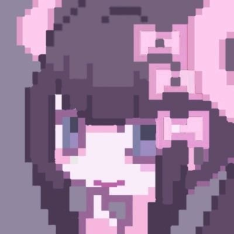**鸡哥**，建立了[odwiki](overdose.wiki)——OD药物信息第一个百科。就此，OD 百科化的序幕被拉开。此百科的意义对于 ODer 们来说有多大，无需多言。

> 据称，此时**鸡哥**名为sakura，以wiki主身份延续大肆性骚扰辱骂等上述行为，频繁在旧odw官号发鸡吧照片 割睾丸照片 性骚扰照片等猎奇图片。此时**鸡哥**存在向他人泄密发送地雷女私发的裸照，以及嫖娼时女性的阴处胸部，甚至可见流出精液。此时**鸡哥**啃老严重，有学肄业不上，进厂两天不上了，并辱骂前来关心的母亲以压榨钱财

<!--来源：高原观景台-->

为了撰写[overdosewiki](overdose.wiki)，后藤可谓费尽心机。他的努力有了报酬，大量ODer关注都转向了[overdosewiki](overdose.wiki)，并构成了半壁江山。他撰写了大量有关OD药物的条目，详细说明很多OD药物用于OD的用法用量、药效、副作用、药效时长、药物品牌。

加入一大堆药物测试的摘录

然而，他的个性似乎导致他对于某些[益智药](../文档/药物分类/益智药.md)陷入了痴迷的状态，而那种痴迷堪称走火入魔。他对于借助药物改变自身和一些 ODer 的困境的希望贯穿他的整个故事，也在很大程度上改变了他的故事的走向。

例如，从[overdosewiki](overdose.wiki)建立的伊始，他就陷入了对于[苏糖酸镁](../药物/镁剂.md)的痴迷：

> 超级后后后藤 @Overdose_DBD  
> 联络人向我问询了一种化学物质：L-苏糖酸镁（简记左苏糖镁）的作用。我查询后，发现它可能会是比吡拉西坦与茶氨酸更有效的反解离剂。但该物质2010年才被发现，也没有什么更多的信息。请各位一起探究！  
> 5:43 PM · Jan 14, 2024

> 超级后后后藤 @Overdose_DBD  
> · Jan 14, 2024  
> 目前已知左苏糖镁具有：  
> 补充Mg2+  
> ---->协助GABA、血清素、多巴胺合成  
> --------->协助治疗ADHD  
> 增强神经可塑性  
> 增强肠道蠕动  
> 上调海马神经元中NMDA受体的NR2B亚基的表达（反解离）

> 超级后后后藤 @Overdose_DBD  
> 苏糖酸镁逼我得吃三个人的饭量，换来的是感知认知强化，以及毫不嗜睡，入睡快速。这值得吗？  
> 最严重的是这种影响长到离谱，丝毫不亚于优米的后遗症。我都怀疑苏糖酸镁是否也是靠类似于后遗症的方式来维持良效的了  
> 8:49 PM · May 4, 2024

然而，他撰写条目时，是以一种怪异的语气的，你只需要看看目前的[补档](../文档/补档/Overdosewiki/index.md)，就可以知道是多么奇怪。他的语气大多是对自己的知识水平充满自信，却对于读者循循善诱，迅速让读者陷入他塑造的话语体系中。然而，在这个话语体系中，他表现出的对于药物的态度则过于刻板和刁钻，还导致过很多引起争议。而他对于自己笔下的条目表达出的自信态度，又为 ODer 们埋下了不少误区。

其中最严重的一个误区，包括一个关于两个化学结构相似，也经常被比较的 OD 药物孰优孰劣的问题——[美金刚](../药物/美金刚.md)和[金刚烷胺](../药物/金刚烷胺.md)到底哪一个更具杀伤性？

先插一段目前广泛认为的事实。在常用 od 剂量下，[美金刚](../药物/美金刚.md)更主要是解离剂，产生的幻觉以解离性幻觉为主。服用者在睁眼时虽然能看得到各种身边的物件长啥样，却无法回忆起这些物件的性质。闭上眼后，服用者陷入梦境般的幻觉中。美金刚的起效时间很长，可以轻易长达 2 天，很多人根据对于自身意识状态的衡量，以为药效已经结束了，但实际上没有。

相比之下，金刚晚安则更容易使服用者陷入一个更短暂、更强烈的幻觉，类似于精神分裂。服用者经历的最主要的幻觉，就是身边的物件，被赋予了某种本没有的性质。例如，床单突然变成了尸体；原本空白的墙上出现一个诅咒的图案和字样。更糟糕的是，服用者会遭受心动过速，导致严重的混乱。后来，就是在这样的情形下，一名叫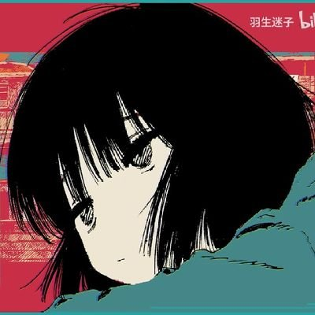彩加的跨性别ODer[坠亡](../文档/补档/Overdosewiki/Report/RP-49.md)，死状惨绝人寰，隔着屏幕也让人大受震撼。

尽管如此，后藤在他的 [odwiki 的美金刚条目](../文档/补档/Overdosewiki/Drugs/MMT.md)中，写下了一句又一句违背客观事实的句子，包括一个已经主动撤回的“简单定理”，简直是望文生义：`药效上，美金刚 = 右美沙芬 + 金刚烷胺`。
这一句倒是还留着：

> 灾难与毁灭的傻逼药物，兼全od药物中副作用最大的药物

还有这一句：

> 美金刚所具有的毒性，在全od药物中，是最大的。

然而，针对[金刚烷胺的条目](../文档/补档/Overdosewiki/Drugs/ATD.md)，却只有简单一句：

> 极为危险的畜生药物

正是因为后藤当时留下的这一误区，导致时至今日的 ODer 们仍然更喜欢 o [金刚烷胺](../药物/金刚烷胺.md)，而唾弃[美金刚](../药物/美金刚.md)。希望这个误区能被今后的“药师”们纠正。

然而，即便到了现在，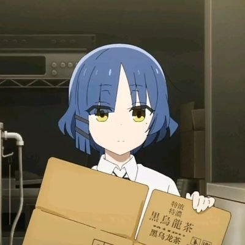后藤依然固守己见，大概是为了保卫自己的退圈生活吧，显然，他仍然沉浸在自己的话语体系中无法自拔。

[odwiki](overdose.wiki)中曾经有的另一个最广受争议的条目，就是“OD不扩散共识”了。

> 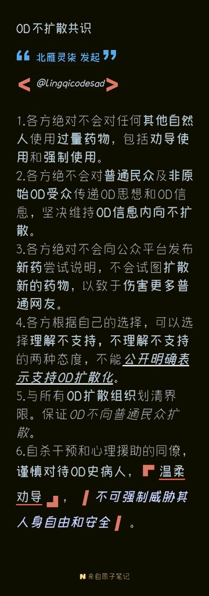

> 1.各方绝对不会对任何其他自然人使用过量药物，包括劝导使用和强制使用。  
> 2.各方绝不会对普通民众及非原始OD受众传递OD思想和OD信息，坚决维持OD信息内向不扩散。  
> 3.各方绝对不会向公众平台发布新药尝试说明，不会试图扩散新的药物，以致于伤害更多普通网友  
> 4.各方根据自己的选择，可以选择理解不支持，不理解不支持的两种态度，不能公开明确表示支持OD扩散化。  
> 5.与所有OD扩散组织划清界限。保证OD不向普通民众扩敬。  
> 6.自杀干预和心理援助的同僚谨慎对待OD史病人，温柔劝导，不可强制威胁其人身自由和安全

根据图片名中推文的 ID 那串数字 `1753347662026580412`，可以判断推文发布于 2024 年 2 月初，这个条目被放入[odwiki](overdose.wiki)的时间也大致是如此。

当时的背景是，OD 正在被快速地认知，随着短视频媒体的流行，大量从事 OD 的人出现在了抖音等视频平台上。他们身穿奇装异服，发布自己有关从事 OD 的信息，于是大量人注意到 OD 的存在。

当时，我国尚未从疫情的重创中恢复过来，所以潜在 ODer 很多。而对于那些潜在 ODer，然后走了上述所有人走过的老路。越来越多的人不是偷偷地问某个经验丰富的OD者，[SSRI 类药物](../文档/SSRI.md)能不能 o，而是公然在国内社交媒体上发贴提问，而这些贴子又引来一批一批的新人......

**这是一个典型的正反馈循环，而当时，正处于 S 形曲线的拐点，任何人都已经无力挽救了——OD 注定将被所有人认知。**

然而，[odwiki](overdose.wiki)虽然在推特上占据了对于 OD 的完全正统的解释，也确实起到了减少药物造成的伤害，但是这些影响仅限于推特了，对于国内的平台，它鞭终归是长莫及。而那份“OD 不扩散宣言”，更是导致推特上有获取减害知识的渠道的 ODer 们，无法合理地分享这些能够减少伤害的知识，更加阻将这一切推向极端。

终于，由于当时 OD 行为已经传播得过于广泛，特别是“地雷女”，“OD妹”等形象正在让OD走向潮流，引起了当局特别注意。2024年5月7日，当局宣布将右美沙芬宣布列为管制药品。

> 超级后后后藤 @Overdose_DBD  
> 你知道我要骂什么  
> 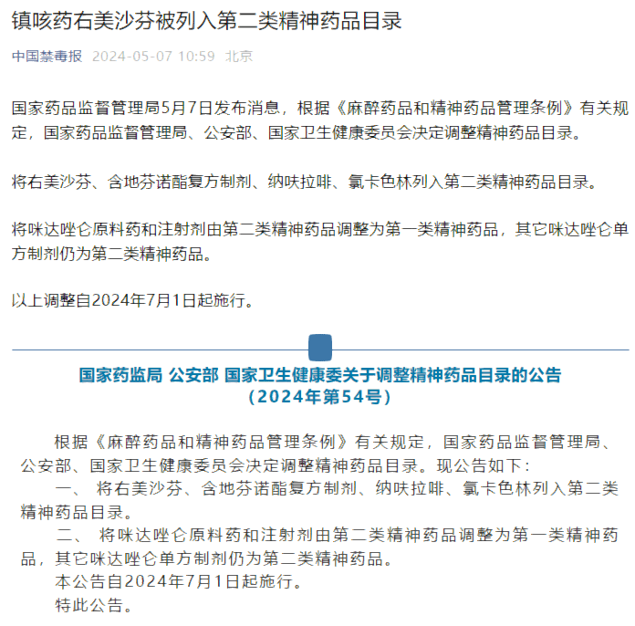  
> 1:53 PM · May 7, 2024

别忘了，当局宣布的《禁毒法》中对于 `毒品` 的定义，就是 `毒品，是指......的国家规定管制的精神药品或麻醉药品`。

这一则声明，相当于为[右美沙芬](../药物/右美沙芬.md)设下了一个延时的禁令：2024 年 6 月及以前的提法尚且不计，7 月开始可就能用 `毒品` 来提右美沙芬了。当局对于 `毒品` 的所有限制：使用、生产、贩卖、存储、运输......从7月开始，全部适用于右美沙芬。

有关OD的一切，在经历了持续两年多的缓慢探索阶段，终于被这一则延期的禁令强迫按下了快进键。大量ODer们从法律层面，被从以为自己能自由OD的慢生活中强迫拉了出来。他们感到震惊，而随后陷入了一阵恐慌潮之中。

他们做的第一件事，就是赶在右美沙芬在7月后正式被当局认定为非法的 `毒品` 前，抢购并屯购右美沙芬。

当时，许多人疯抢，普通的 ODer 完全无法大量获得催生出了专门卖药这一产业，OD 牟利派就此诞生。他们大多使用推特作为宣传渠道，Telegram 作为出售渠道，专门向 ODer 们卖药。卖的药当时是右美沙芬，之后就是各种[策划药](../文档/研究用化学品.md)了。

[策划药](../文档/研究用化学品.md)是一种经过对于药物的化学结构进行微妙地修改，保留其[药理学](../文档/科学信息索引页.md)上的性质，却不落入当局对于管制药品的规定的范围内，从而创造性地无法被我国当局对于 `毒品` 的定义所限制的化学品。

这包括一名至今仍活跃的最知名的 OD 牟利派——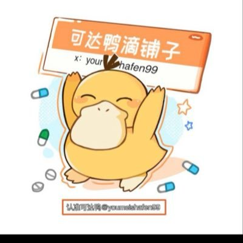可达鸭。至今，他的推特粉丝上千，Telegram 群组爆满。

> 可达鸭滴化学乐园 @kedayahuaxue  
> 来个od圈选美大会吧。看看谁是最美od妹。  
> 在下面帖子发布自己的美照点赞评论最多排名次。  
> 第一名10盒右美  
> 第二名6盒右美  
> 第三名3盒右美。  
> 关注+评论+转帖+进群。  
> 6.22日20点开奖。  
> 直接发美照在评论区吧  
> 在抽取五位安慰奖。一个人一盒右美。  
> \#od #右美  
> 9:14 PM · Jun 17, 2024

不过，那是后话了。

回到 **后藤** 身上。大家已经知道，后藤本人精神状态不是很稳定，经常说一些莫名其妙的话。此前3天，也就是2024年5月4日，一个生命的悲惨地结束了，也为后藤被之后批判埋下了种子。

> 桜崎彩加🍥（右美贩售版） @hulicaijia  
> 这里彩加  
> 白云山右美沙芬  
> 宛衡右美沙芬都有售ing  
> 都是15元/盒  
> 欢迎找我买药扩列互关谢谢😪  
> 10:06 PM · Apr 30, 2024

彩加，一名跨性别ODer，因过量服用[金刚烷胺](../药物/金刚烷胺.md)导致精神分裂发作，[死了](../文档/补档/Overdosewiki/Report/RP-49.md)。之后，此人的死亡被指责与后藤有关，至于关联程度究竟多大有待考证。

有一则事件，危害的不仅是后藤本人，更是[odwiki](overdose.wiki)的整体名誉。

> 超级后后后藤 @Overdose_DBD  
> 自制！右美沙芬不成瘾版因为各种原因可能要四五月份才行 自测上瘾性不存在 决定定价在自己去搓我不卖  
> 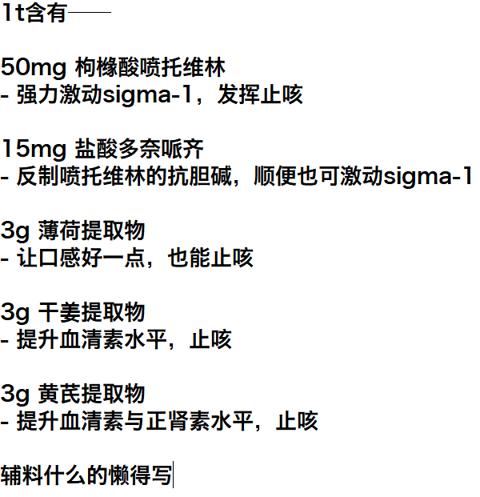  
> 8:26 AM · May 9, 2024

2024年5月，[右美沙芬](../药物/右美沙芬.md)宣布被列管后，ODer 们的回应除了屯购、策划、还有剩下探索剩余可以 od 的药物。而在这个危急时刻，[odwiki](overdose.wiki)则理所当然地承担了大多数 ODer 们探索剩余可以用来 od 的药物的责任。后藤当然是主要负责人，他先是鼓吹中药“右美沙芬不成瘾版”，又开始进行中药 OD 的尝试：

> 超级后后后藤 @Overdose_DBD  
> · May 11, 2024  
> 平替右美沙芬测试  
> 9:58 PM · May 11, 2024

> 超级后后后藤 @Overdose_DBD  
> · May 11, 2024  
> 原料：  
> 姜半夏粉、黄芪粉、黄芩粉、干姜粉、天麻粉、桂皮、七叶神安片（刚买的  
> 金银花、白糖、淫羊藿、金钱草颗粒（家里掏出来的  
> 复方丹参（丹参+三七）片（我自己要用的  
> 挺好笑的，但是成了的话那可就太nb了

> 超级后后后藤 @Overdose_DBD  
> · May 11, 2024  
> 60半夏，15生姜，30黄芪，30黄芩

> 超级后后后藤 @Overdose_DBD  
> · May 11, 2024  
> 淫羊藿、陈皮、金银花自由发挥

> 超级后后后藤 @Overdose_DBD  
> · May 11, 2024  
> 开喝第一碗  
> 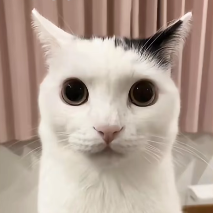

> 超级后后后藤 @Overdose_DBD  
> · May 12, 2024  
> 00:03 肌肉松弛，镇静

> 超级后后后藤 @Overdose_DBD  
> · May 12, 2024  
> 00:05 解离开始出现

> 超级后后后藤 @Overdose_DBD  
> · May 12, 2024  
> 00:58 但是解离被固着在这里了，不动了

> 超级后后后藤 @Overdose_DBD  
> · May 12, 2024  
> 01:02 好想躺床上装死

> 超级后后后藤 @Overdose_DBD  
> · May 12, 2024  
> 01:06 疲惫感

> 超级后后后藤 @Overdose_DBD  
> · May 12, 2024  
> 01:13  
> 肝：操你妈突然给我加班是吧  
> 肾：别说了我都开始痛了！

> 超级后后后藤 @Overdose_DBD  
> · May 12, 2024  
> 01:17 小臂出现酸痛，但力量没变

> 超级后后后藤 @Overdose_DBD  
> · May 12, 2024  
> 我现在只用了半夏、黄芪、黄芩、生姜、淫羊藿、金银花、天麻

> 超级后后后藤 @Overdose_DBD  
> · May 12, 2024  
> 02:29 不醉，但确实有一定的舒坦感，像1高

> 超级后后后藤 @Overdose_DBD  
> · May 12, 2024  
> 02:35 唉！一睁眼发现天花板有一闪而过的花纹

> 超级后后后藤 @Overdose_DBD  
> · May 12, 2024  
> 02:45 解离的内部幻觉出现，已确认存在解离

> 超级后后后藤 @Overdose_DBD  
> · May 12, 2024  
> 但是程度不大，也没昏过去，意识清醒，四肢解离

> 超级后后后藤 @Overdose_DBD  
> · May 12, 2024  
> 所以躺床上刷了一晚上手机 唉肚子狗叫了，又要煮饭吃了

根据他的描述，效果只能说是成功了一半。实验完成后，他又将测药的任务委派给别的人：

> 超级后后后藤 @Overdose_DBD  
> 有志者可以试试半夏提取物  
> 1:10 AM · May 13, 2024

这倒是留下了一个派人测药的开端。从此以后，不知是因为 OD 圈本身群体扩大或是重心向推特转移，还是因为后藤测药把自己带火了，他的推文的浏览量节节攀升。从此以后，到他退圈前，几乎每个推文的浏览量都上万。就算在此时，他还不忘了自己的[苏糖酸镁](../药物/镁剂.md):

> 超级后后后藤 @Overdose_DBD  
> 苏糖酸镁后，我开始回忆起梦境，我开始发现我对过去的记忆出现了问题，我似乎想起了什么……再喝一口  
> 9:19 AM · May 20, 2024

> 超级后后后藤 @Overdose_DBD  
> 借用苏糖酸镁，我想起来我缺失了记忆，我想起来我缺失的记忆，快说：  
> 苏糖酸镁，你可以吃玉米  
> 4:39 PM · May 20, 2024

然而，药师们提出了一个更有前景的潜在 OD 药物——奈福泮。于是，后藤并未自己测药，而是将任务委派给其他 ODer 去。

> 超级后后后藤 @Overdose_DBD  
> 警告：奈福泮的精神药效尚且不确定，请不要贸然尝试。试验人员正在测试，稍安勿躁  
> https://overdose.wiki/zh/Drugs/NFP  
> 11:54 AM · May 21, 2024

> 超级后后后藤 @Overdose_DBD  
> 第一条副作用排出来了：  
> 高血压  
> 是能当场击杀的高血压  
> 是能让人尿血的高血压  
> 是能让人一进医院发现210/110的高血压  
> 是能让人晕迫痛苦的高血压  
> 2:18 PM · May 22, 2024

> 超级后后后藤 @Overdose_DBD  
> 所以我还没买奈福泮，主要是我的心脏估计也受不了太高血压  
> 12:01 AM · May 23, 2024

> 超级后后后藤 @Overdose_DBD  
> 第二副作用排出来了：  
> 尿血
>
> 体现在大部分试验人员的尿液颜色变深，暗示肾功能直接受损，比任何药物都强烈  
> 都尿血出来了肯定肾坏得强烈啊，你猜我为什么这么清楚，真当江西水质多软啊  
> 当然，于此是高血压干的  
> 5:59 AM · May 28, 2024

于是，对于奈福泮的探索宣告失败。鉴于这一切替代的尝试都已失效，后藤在[odwiki](overdose.wiki) 的右美沙芬条目下郑重写下了这一句话：

> **无论是医学上还是od上，右美沙芬没有任何替代品**

然后，面对已经走红的试药尝试，以及对其期待的 ODer 们，他只好做出最终的解释：

> 超级后后后藤 @Overdose_DBD  
> 今天我们迎来了对优米精二管控最好的解释
> 我不带任何政治思考，我本人不了解任何政治内容，我本人没有任何政治立场，我的描述仅限现象  
> “就跟疫情爆发的时候拉隔离区一样，隔离区里的人死活不管”  
> 2:24 PM · May 27, 2024

插入一段绝望的、未能满足 ODer 们期望的，眼睁睁看着一切走向坏的结局的推文

> 超级后后后藤 @Overdose_DBD  
> 我违反医学伦理学  
> 我作为MRP轮椅委员会药师擅自违反MRP  
> 我对不起你们，我对不起医学伦理学，我对不起所有人……  
> 这一切都是我的自作自受，这一切都是我的所作所为……  
> 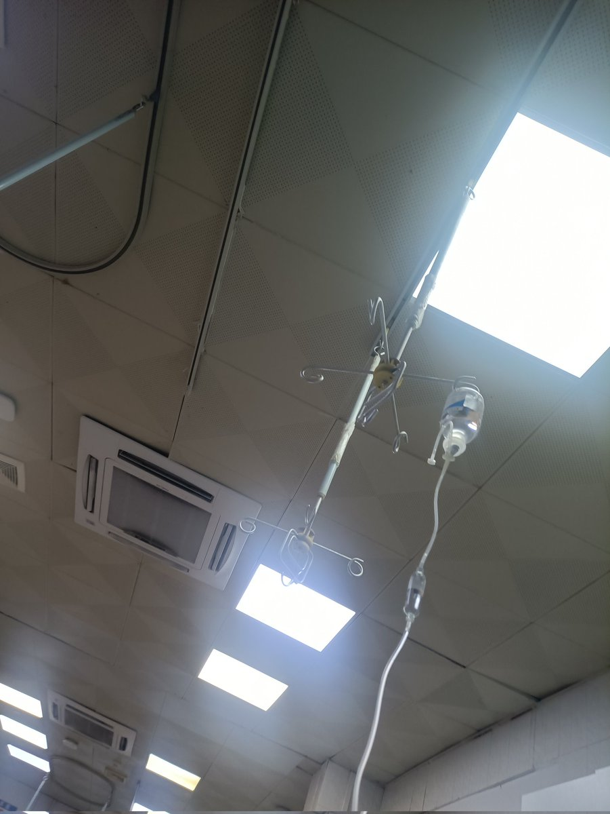  
> 9:27 PM · Jun 23, 2024

> 超级后后后藤 @Overdose_DBD  
> · Jun 23, 2024  
> DPZ，你全家死绝  
> 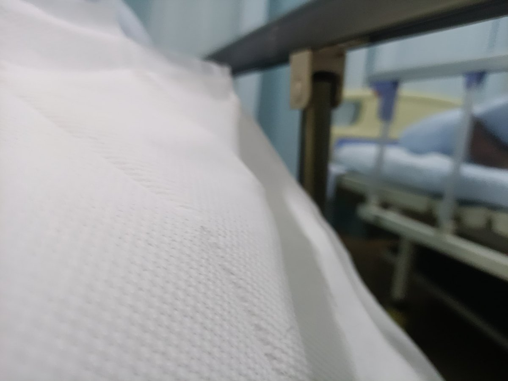

> 超级后后后藤 @Overdose_DBD  
> · Jun 24, 2024  
> 从他妈近乎地狱的13个小时中暂且恢复了清醒，我保证我没有任何自杀意愿，我就是在一次多了其他药物的测试中出了他妈的意外。他妈的，我真是个罪人。躯体还他妈在痛，呕吐感与不适，窒息感什么的。裤子在使用尿壶时不慎浸湿，全身都被吐了7次而肮脏不堪。好在牢藤终于是硬抗过来了，MRP ENGAGED!  
> 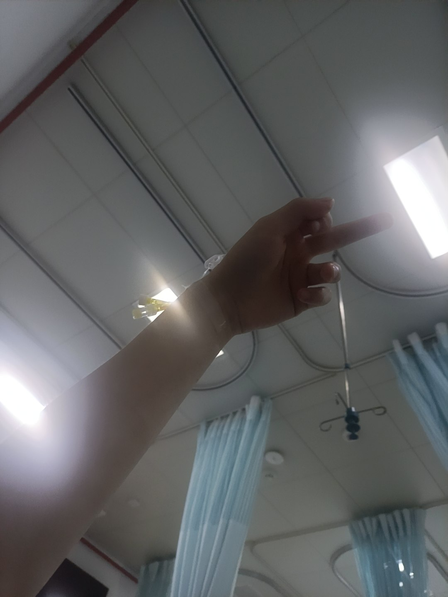

> 超级后后后藤 @Overdose_DBD  
> · Jun 24, 2024  
> 先声明一下，这次意外与吡拉西坦、苏糖酸镁、茶氨酸、咖啡因无关，都是另一个他妈的药物害的。草，牢藤吃晚安吐过满床螺蛳粉，吃海明出过重症抑郁+谵妄，都硬抗过来了，就这次居然倒在小小otc下，草

> 超级后后后藤 @Overdose_DBD  
> · Jun 25, 2024  
> 所以由此可见，胆碱那一块不能碰，既不舒服也死不掉  
> 以及，胆碱酯酶负责分解胆碱，胆碱酯酶抑制剂可阻止胆碱分解，强化胆碱水平，与抗胆碱相反。别看个抑制就以为这也是抗胆碱，建议重修生必一

> 超级后后后藤 @Overdose_DBD  
> · Jun 25, 2024  
> 牢藤来总结问题了  
> 胆碱酯酶抑制过量，则引起胆碱能危象，则震颤、恶心、腹痛、呕吐。类似有机磷农药中毒，却他妈死不掉  
> 抗胆碱过量，则引起谵妄，则重症肌无力、呼吸困难、痛苦、恐慌。就像把人生中能遭受的痛苦全都叠上来了  
> 这次牢藤栽胆碱酯酶抑制上了

> 超级后后后藤 @Overdose_DBD  
> · Jun 25, 2024  
> 终于是拆吊针能下床了，我这是进了肾内科天啊……  
> 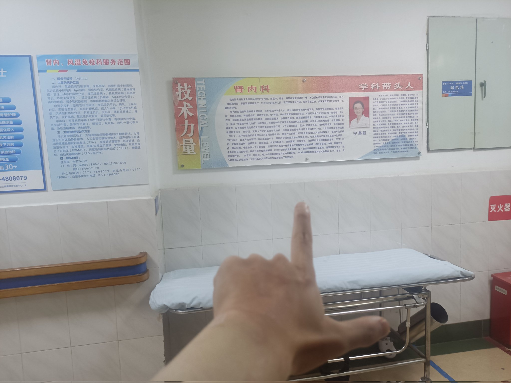

> 超级后后后藤 @Overdose_DBD  
> · Jun 25, 2024  
> 起码截止08.01，限制牢藤的服药。限制如下：
>
> 1.  禁止使用任何药物，包括苏糖酸镁、茶氨酸、吡拉西坦等药物
> 2.  禁止使用粉剂咖啡因
> 3.  不禁止正常食物  
>     请牢藤自由发挥营养学

> 超级后后后藤 @Overdose_DBD
>
> 1.  我那次没吃胞磷胆碱钠，只有10tDPZ
> 2.  据报告，一些人员五六片石杉碱甲+七八颗胞磷胆碱钠都没问题，导致我严重误判
> 3.  纯属个人智障行为，与odwiki无关  
>     12:04 PM · Jun 26, 2024

> 超级后后后藤 @Overdose_DBD  
> · Jul 7, 2024  
> 其实那天我从未想要AChEI。我就是想拿它有十几Ki的Sigma-1激动，只不过我小看了沙林毒气的威力！我以为沙林排气和石杉碱甲都是吃多没事，结果直接送医院忏悔去了！  
> 我根本就没想要多少胆碱酯酶抑制，请不要乱说话或者造谣！  
> 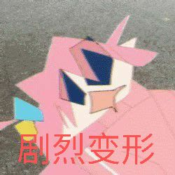

后藤对于多奈哌齐——一种抗胆碱药物的探索便恐怖收场。

然而，即将紧接着发生的一个事件则是震惊到令人发指，直接导致了他的退圈。

**鸡哥**，也就是当初拉他出来建 OverdoseWiki 的那位，背刺了后藤，原因不明。此后，他夺取的了分裂出了另一个百科——而那个百科就是如今的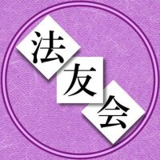 **化学极乐百科**。以下【已编辑】中指的人就是鸡哥。

请看后藤的叙述，看他是如何在鸡哥的攻击下走向失控的：

> 超级后后后藤 @Overdose_DBD  
> · Jun 29, 2024  
> 紧急事故：由于管理人员【已编辑】实施【数据删除】，管理人员“S.G”主动放弃站点管理权限，目前退出参与站点编辑。@OVERDOSE_Wiki 账号与站点重新由管理人员【已编辑】控制  
> 你赢了，【已编辑】，接下来是你的天地了

> 超级后后后藤 @Overdose_DBD  
> · Jun 29, 2024  
> 补充：
>
> 1.  管理人员【已编辑】实施的【数据删除】过于【数据删除】，“S.G”无法承受，选择退出
> 2.  “S.G”不再受理关于站点的投诉、报告
> 3.  仍然回复私信
> 4.  和那条疯狗无关，纯属是管理人员【已编辑】的作为  
>     自由意志者胜利。谢谢你们一直以来的陪伴

> 超级后后后藤 @Overdose_DBD  
> · Jun 30, 2024  
> -1. 服务器一直很稳定，自墙仅仅只是给我自己放假  
> 7. 如果不是【已编辑】使出【数据删除】，我本不想把事情搞成这样。请谅解

> 超级后后后藤 @Overdose_DBD  
> · Jun 30, 2024  
> 0. http://od.wiki 不是http://overdose.wiki 的重建站点，顶多算镜像点
>
> 1.  我不会因此出现问题，不需要████
> 2.  这不是【数据删除】的理由
> 3.  我和他们的关系仍然友好
> 4.  我从未因为此事而怼【已编辑】，这不是事实，这是【已编辑】的歪曲捏造  
>     请停止妄言谵语  
>     overdose.wiki  
>     欢迎来到Overdosewiki

> 超级后后后藤 @Overdose_DBD  
> · Jul 1, 2024
>
> 1.  无语，无论如何都不存在这种木马的
> 2.  如果没有我，你根本不会叫“wiki主”，而是会叫【已编辑】，被【数据删除】
> 3.  你搞那些东西，都亏损到向我要钱了
> 4.  根本不是你踹我，你是直接极端内斗到【数据删除】，把我逼退的
> 5.  希望你能好好工作  
>     不推荐沉浸于幻想，也不推荐无休止造谣挑衅

> 超级后后后藤 @Overdose_DBD  
> · Jul 1, 2024  
> 6. 终于说实话了，难得一见

> 超级后后后藤 @Overdose_DBD  
> · Jul 1, 2024  
> 我个人不同意重启 http://od.wiki 镜像站

> 超级后后后藤 @Overdose_DBD  
> · Jul 4, 2024  
> 由原odwiki编辑组与管理人员“S.G”（内容主编）重组的odwiki官号  
> 由于没有谁人，该账号一定不会发恶心内容。如出现，请立刻联络“S.G”以收容异常  
> 请等待“药商之友”、编辑、主编处理站点。对不起 https://x.com/overdosewiki/overdosewiki/status/1808884230971404618

> 超级后后后藤 @Overdose_DBD  
> · Jul 7, 2024
>
> 1.  那也包括你自己
> 2.  我没说过“著作权”，只是你们不得拿我糊出来的东西标榜是自己做的（CC-3.0）
> 3.  他妈的先挨抓的是你自己，你怎么想的
> 4.  我可从不会被抓
> 5.
> 6.  你还抱怨上了，自己乱鸡巴搞事还不让人骂
> 7.  无所谓，功利主义
> 8.  我不想骂你。自始至终我们都想和你解决问题，只有你会那么觉得

<!-- >超级后后后藤 @Overdose_DBD
>· Jul 9, 2024
>【名词】【副词】【语气助词】【动词】【动名词】【语气助词】，【代词】【语气助词】【副词】【介词】【名词】【动词】【助词】？ -->

> 超级后后后藤 @Overdose_DBD  
> 预警：近期会出现由【数据删除】伪装的我“伪藤”，请诸位按以下分辨伪藤：
>
> 1.  它们的语言很僵硬
> 2.  它们的言灵有阴暗的气息
> 3.  它们的存在会让你感到莫名其妙
> 4.  它们在仔细看着我
>
> - 它们会去主动找你
> - 请不要盲目，不要停止思考，不要相信它们
> - 如果我自己被它们套皮偷取，那么，祝你好运  
>   11:36 PM · Jul 19, 2024

> 超级后后后藤 @Overdose_DBD  
> · Jul 21, 2024  
> 我的预言是正确的。公告：  
> 由鸡哥与【数据删除】控制的od-wiki开始伪装本人后藤，于此，请不要相信任何od-wiki试图伪装出来的我的言语  
> Quote  
> 超级后后后藤 @Overdose_DBD · Jul 19, 2024  
> 预警：近期会出现由【数据删除】伪装的我“伪藤”，请诸位按以下分辨伪藤：
>
> 1.  它们的语言很僵硬
> 2.  它们的言灵有阴暗的气息
> 3.  它们的存在会让你感到莫名其妙
> 4.  它们在仔细看着我
>
> - 它们会去主动找你
> - 请不要盲目，不要停止思考，不要相信它们
> - 如果我自己被它们套皮偷取，那么，祝你好运  
>   3:04 PM · Jul 21, 2024

<!-- >超级后后后藤 @Overdose_DBD
>· Jul 21, 2024
>**罗通定**。专打金刚烷胺的药物！
>**罗通定** 是抗头痛药物，却异常反制晚安，甚至没一条作用机理是多余的
>效果：抗精神分裂、抗被害妄想、抗幻觉、抗高血压、镇静
>应用：反致晚安的惊恐、妄想、精神分裂、无法入眠
>正在测试其杀害晚安的能力，志愿者可前来测试 https://overdose.wiki/zh/Drugs/RTD -->

> 超级后后后藤 @Overdose_DBD  
> · Jul 21, 2024  
> 一旦chicken没有利用价值，【数据删除】势力便会毫不留情地抛弃chicken。然而chicken的地雷女愿望，只得满足于【数据删除】的扶持  
> 由于金刚烷胺导致的冲动强化，chicken不会顾及被【数据删除】势力抛弃的未来，在那之前他将一直被【数据删除】架空  
> chicken应接受我们的恢复，以反制精神病状

> 超级后后后藤 @Overdose_DBD  
> · Jul 21, 2024  
> 【数据删除】势力扶持chicken上位od-wiki主，同时架空chicken的搭建权限（别忘了后藤有主编权限）而二次配布文档，由此冒名顶替overdosewiki，并造成多起攻击事件，试图完全窃取编辑组与后藤的文档成果  
> od-wiki为【数据删除】势力的架空站点，目的为完全摧毁overdosewiki，以壮大【数据删除】自身势力  
> 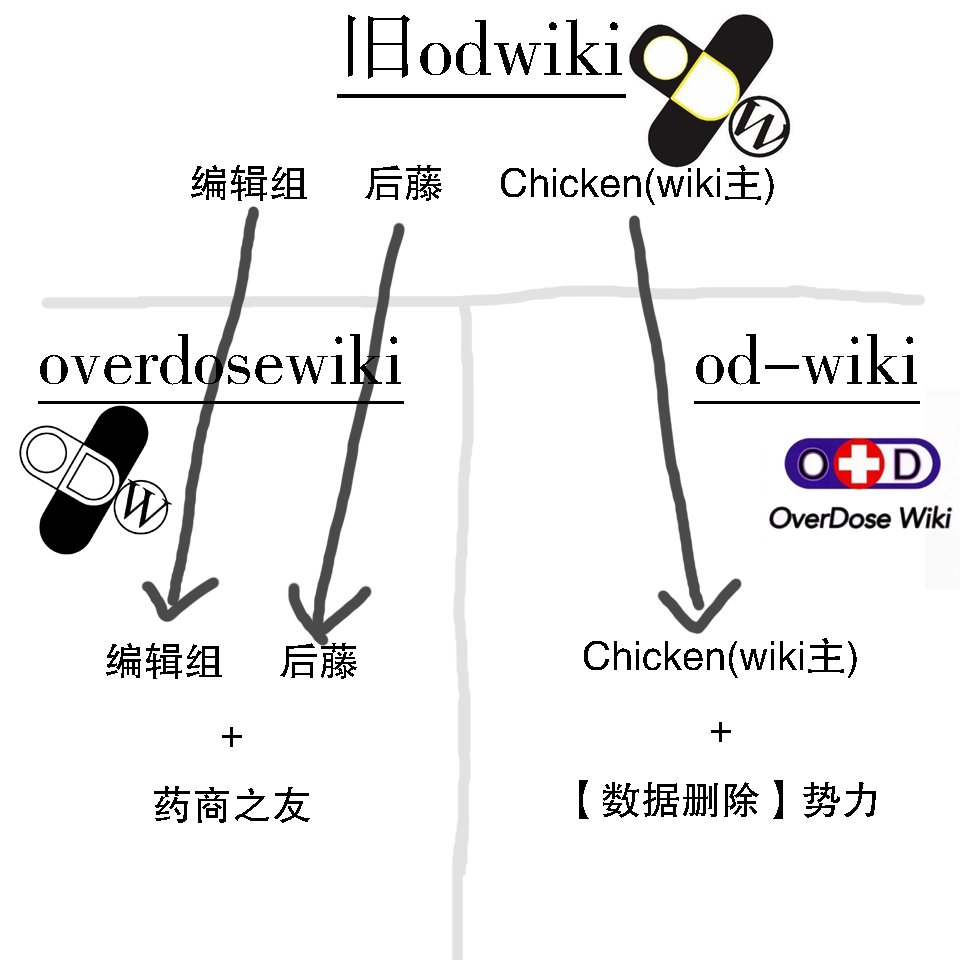

后藤是正确的——一旦 OD 百科网站编辑者走向玩弄政治，甚至动用了这么恶劣的手段，那么，是不太可能对整个圈子有好的影响的。

据后藤称，鸡哥进行了

接下来，后藤指控鸡哥使用恶劣的手段，达到令人不齿的目的——利用“地雷女”和“OD 妹”满足性欲望。令人憎恨的是，此人到现在仍然保持这种作风......

> 超级后后后藤 @Overdose_DBD  
> · Jul 21, 2024  
> 为保护【数据删除】，防止【数据删除】又因为那啥精神病而犯应激乱骂人，使用【数据删除】代替说明

> 超级后后后藤 @Overdose_DBD  
> · Jul 21, 2024  
> 本人只认定由编辑组与后藤控制的overdosewiki @overdosewiki ，否认被【数据删除】渗透并架空势力的od-wiki  
> 迄今为止，【数据删除】势力干了很多鬼事，包括且不限于造谣诽谤、攻击站点、二次配布、错误挑错、【数据删除】、【数据删除】……

> 超级后后后藤 @Overdose_DBD  
> · Jul 21, 2024  
> 备注：攻击站点是指服务器攻击

> 超级后后后藤 @Overdose_DBD  
> · Jul 21, 2024  
> chicken还想要当wiki主，【数据删除】还想要拿走资料并辱骂后藤满足内心，故chicken与【数据删除】建立了od-wiki——伪wiki  
> 现严重怀疑chicken蛊惑【数据删除】，使ta们听信chicken并造谣诽谤后藤。而且【数据删除】本就想建立“odwiki2.0”，还有很好用的精神病护盾

> 超级后后后藤 @Overdose_DBD  
> · Jul 23, 2024  
> 如果你明白他的前世——他口癖严重  
> 之前二月我可没惹他，他在chicken号上自拍了个25s的视频，骂我一大堆sb话  
> 你们之前看到chicken总是发后藤梦文，一开始我就不同意，他还发。删了的话他推文就来电话轰炸+停服威胁，不删的话我又挨编者骂

> 超级后后后藤 @Overdose_DBD  
> · Jul 23, 2024  
> 你还是先解释你直发割蛋图、直发几把照、无端骂后藤（二月）、半夜电话、转发p照、骚扰地雷餐券女、先斩后奏关站点的行为吧  
> 眼睁睁看着当不成“wiki主”了就急眼了开始造谣  
> 合计着“你是chicken”是什么见不得光的事实？  
> 你有没有吃罗通定？ https://x.com/od_wiki/status/od_wiki/status/1815383874702356921

> 超级后后后藤 @Overdose_DBD  
> · Jul 23, 2024  
> 说到底，chicken的目的就是洗白自己曾经的罪名，以能继续满足性愿望  
> 不论odwiki分裂或解散，对他而言，“wiki主”的名义最重要  
> 至于wiki要发展成什么样不重要，至于其他人能否写wiki不重要，至于后藤究竟做了什么不重要

> 超级后后后藤 @Overdose_DBD  
> · Jul 23, 2024  
> 私号注销后，chicken发觉后藤赐予他新名义“wiki主”。这个身份就像导师的推荐信，因为有后藤，大家都尊重wiki主，因此chicken要求后藤不得说wiki主是chicken，后藤答应  
> 庇护于odwiki，chicken得以继续满足他的性愿望，转地雷餐券推、和地雷女谈恋爱、看情色照……

> 超级后后后藤 @Overdose_DBD  
> · Jul 23, 2024  
> 于对谁都要口癖一番的chicken，“wiki主”的身份成为免死金牌。包括一直以来均他关停服务器威胁、内斗核震慑、“诚意”删除关于他的贴子等行为，均是为了巩固“wiki”主的身份，以不被任何形式的女性们看清  
> 这是他的目的。由此请人员们自行带入他的言语，以解释他的动机

> 超级后后后藤 @Overdose_DBD  
> · Jul 24, 2024  
> 我没标榜过自己多nb，虽偶尔发癫，但大伙们也都看得出来哪些是癫话。我就是一个人，我自己不能判断自己的伟岸性，留给你们判断  
> 存心想害我的谁会“捧杀”。伪造我曾标榜过自身，因其符合感觉而被大众视作事实。再无限放大我的失误，将我贬得一无是处百无一用。捧杀者却没有任何责任

> 超级后后后藤 @Overdose_DBD  
> · Jul 24, 2024  
> 我提醒你们，现在chicken所说的话全都是假的，全都是经由他妄想而产出的言语  
> 例如“资深”，我这辈子都没用过这个词，从未拿这个标榜过自己。这是chicken的妄想  
> 例如“你就扯黑料”，然而我和他好好谈时，他要么直接动核武器，要么装傻发防伪标识，根本无法沟通！这是chicken的假话

> 超级后后后藤 @Overdose_DBD  
> · Jul 24, 2024  
> 由此可言如下语：（话说，你这就想来抓我语言系统把柄啦？）  
> “chicken，你以前就烂德性，还神志不清到给别人女生们列表逐个发【数据删除】的家伙，就不配捡起逻辑来指控我”  
> 这是chicken与【数据删除】善用的抓把柄  
> 至于我发chicken黑料？他们先抓我把柄的  
> 而且他不肯好好沟通，你说我怎么办？

> 超级后后后藤 @Overdose_DBD  
> · Jul 24, 2024  
> 如果你了解过那十几个小时我和他究竟怎么沟通的
>
> - 我说“你现在精神不稳定，为防止你又乱搞事，我收走官号，你冷静一周后我还给你号”
> - 他一个劲地“你快给我，快给我”，或者是“我保证不再犯了”（他至少再犯了三次，每次都是这么说）
> - 最后他直接tm开核武器了  
>   正如之前所言，他竭力保住“wiki主”的名义

> 超级后后后藤 @Overdose_DBD  
> · Jul 24, 2024  
> 辱骂者揪出谁的错误，目的不在让谁改正变好，而是在抓谁的把柄  
> 沙林哌齐是我的失误，应当以此为戒，别再犯错。辱骂者抓死这个漏洞，要挟攻击我，以达到他们的目的，例如“你的药理不如我”“你不能要求我”  
> 以及吹毛求疵地揪错，目的更不会是想让我的言语完美无瑕，而是为了打败我，不论为何

> 超级后后后藤 @Overdose_DBD  
> · Jul 24, 2024  
> chicken与后藤真正矛盾于chicken的性愿望。分析失误源于“动机”/“目的”  
> 虽然“chicken关停站点”看起来像保命，“后藤控制官号”看起来像权斗，但chicken的动机冲动于早被后藤证伪的被害妄想，后藤的目的是防止chicken搞乱子  
> 只是“看起来像”的判断，不仅功利道义皆不符，更是中式老保一味固执己见的方法

最终，他受够了鸡哥的骚扰，决定把网站的权限让给别人。这为他退圈留下了铺垫。

> 超级后后后藤 @Overdose_DBD  
> 我是odw站点主管主编后藤，我宣布，小宋@xiaosong23_3 由编辑升至站点主管主编  
> 1:42 PM · Aug 8, 2024

> 超级后后后藤 @Overdose_DBD  
> 我这几周一直自由，除开12h误验。虽然我感觉很不好，逻辑思考分析能力不减，就是思维记忆感知出现异常了，我能挺住。我一直都在，只是在休息，你们可以继续睡着了，我说过。坏和蠢可不一样，使坏有逻辑考虑利弊，犯蠢没逻辑不考虑利弊，这两个月的斗争，与恰到好处的o圈大清洗，够了，这一切都过载严重  
> 3:08 PM · Aug 29, 2024

> 超级后后后藤 @Overdose_DBD  
> · Aug 29, 2024  
> 你们辩证！我说的话很破碎！这几天一直在做梦，做各种梦。什么都太迟了，到这个地步他们才肯帮我，要是早几个月什么都不会有了，活着就是来受罪的，永远的斗争的，考验一个人真正能力的时刻。我建议你们不要高看我，我也是人，和你们一样。甚至本身就带点病，不要捧杀我，我就是一个普通的人类啊为什么

> 超级后后后藤 @Overdose_DBD  
> 减害我减你妈了个大鸡吧，不是我就减个危害你至于拿核弹强奸我吗，不是被鸡哥抓就是被你们强。来来来既然这么喜欢玩那么我来陪你们玩，直接高原起纯精分我来陪你们玩他妈的。收了一硬盘音乐准备欣赏直接被没收，真的是给我两颗睾丸都气得原地爆炸。整理完材料直接上高原抓人一个都不放过  
> 5:30 PM · Aug 31, 2024

经历了这一切的后藤，对于 OD 圈的一切已经不抱任何希望。再加上当时后藤还是高三，还开学了，他留下一首打油诗，便离去了。

> 超级后后后藤 @Overdose_DBD  
> 春风大道西又春风大道东  
> 春风大道东转春风大道中  
> 春风大道东上为何没药O  
> 春风大道中晶🚗如潮涌  
> 有个药师朋友在树丛背后  
> 青春不变名字叫做春风  
> 每次试药随我到处去奔走  
> 面上没有表情却汇聚成就  
> 禁售一声拜拜远去拼多多  
> 要靠金刚烷胺搞搞新意思  
> 照买照卖药店处处有愈美  
> 但是药物可能要换换管控  
> 10:28 AM · Sep 3, 2024

> 超级后后后藤 @Overdose_DBD  
> · Sep 3, 2024  
> 这个药房朋友面善又友善  
> 因此批准人员一月买两盒  
> oder也自然要斗快过尿检  
> 若做嗑药毒虫只须身有钱  
> 晚安一声拜拜远去这十楼  
> 要靠普瑞巴林搞搞新意思  
> 社会舆论同样影响这药物  
> 但是管控可能靠特异人士  
> O既是死，死既是O

> 超级后后后藤 @Overdose_DBD  
> · Sep 3, 2024  
> 这个药师朋友死别亦漂亮  
> 夜夜不能安寝继续旧形象  
> 到了一月八日个个要哭泣  
> 墙壁上那尊容变遗像遗容  
> 药师一声变形远去这现实  
> 要靠替来他明搞搞新意思  
> 会有精一禁售也会有检测  
> 但是管控可能要问问张座

2024 年 9 月，他终究还是抛弃他的 Wiki 而去，退圈了。

能最好展现出这一年间 OD 界的变化的例子就是他在退圈之前的最后几次吵架，对象可以看出是与一个名叫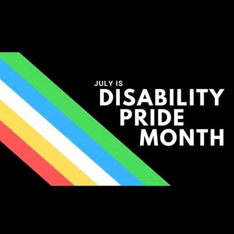Vack的人。

> 超级后后后藤 @Overdose_DBD  
> 傻逼死Vack，水平垃圾到“舍曲林毒品”“喹硫平成瘾”还整天跳脸我，去你妈逼的asd，犯贱又傻逼  
> 操你妈的尊重，一提asd是神经问题就一口一个尊重，到我这就使劲跳脸挑衅辱骂嘲讽，尊你妈获嘉双标畜生。什么时候会讲人话了再来发野  
> 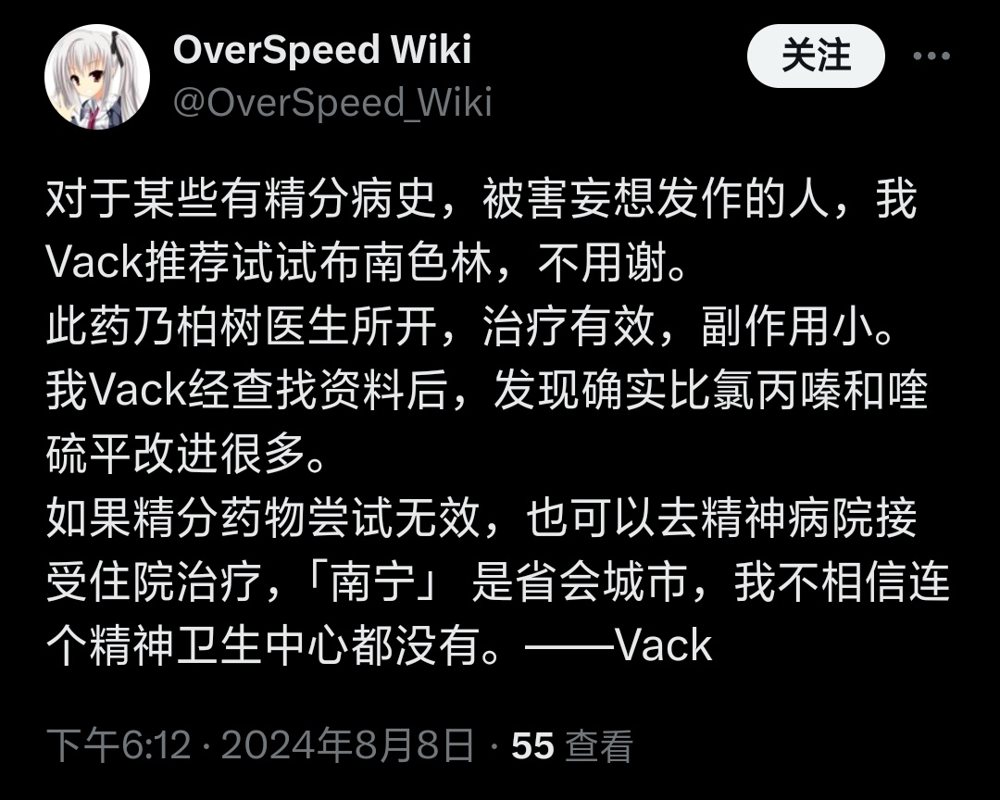  
> 6:26 PM · Aug 8, 2024

> 超级后后后藤 @Overdose_DBD  
> · Aug 8, 2024  
> 要不要讲讲你当年“黄体酮安眠比bzd还好”以及“舍曲林成瘾比海洛因还危险”，被大伙群嘲还狡辩硬说理，你就一个劲对olaiya发傻逼，最后滚他妈出群？

> 超级后后后藤 @Overdose_DBD  
> · Aug 8, 2024  
> 你妈逼死Vack，水平又烂又爱装逼，一言不合跳脸挑衅，目中无人，自持清高，自以为是，固执己见，蛮不讲理，自相矛盾，眼高手低，吹毛求疵，滥竽充数，班门弄斧，装腔作势，两面三刀，表里不一，尖酸刻薄。什么时候把你妈的解离整明白了再来鬼叫

> 超级后后后藤 @Overdose_DBD  
> 你妈逼狗Vack，别人跟你谈asd是缺陷障碍，你口口声声要尊重。到我出事时，你他妈净嘲讽嬉笑。你的尊重呢？？？  
> 好好讲话你们瞬间开骂，时不时还嘲讽一下我彰显优越感。有asd就滚去治，治不好就别整天狗叫  
> 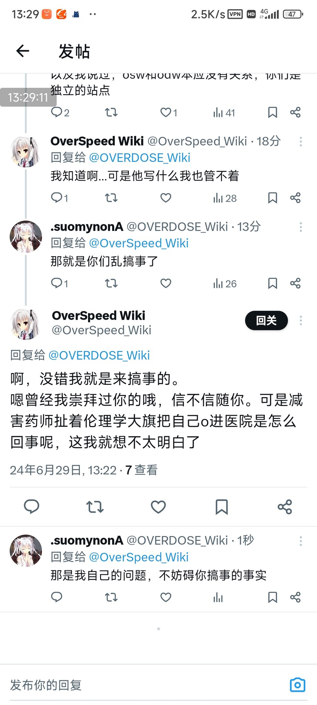  
> 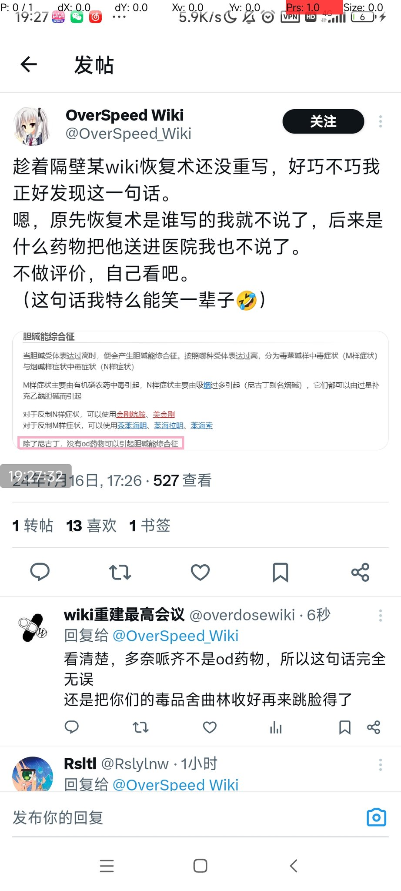  
> 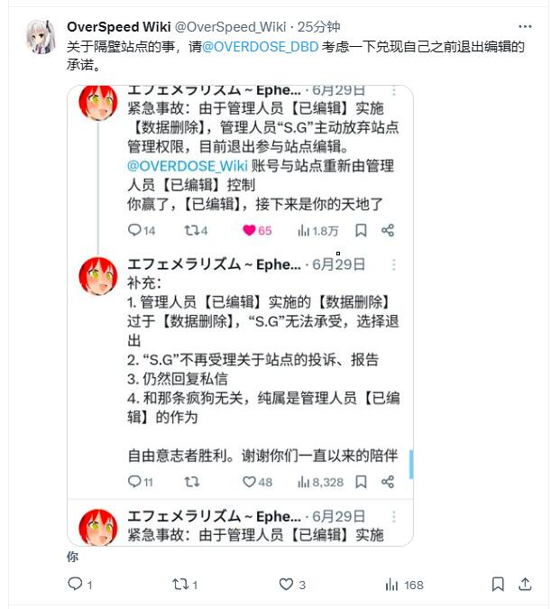  
> 6:56 PM · Aug 8, 2024

> 超级后后后藤 @Overdose_DBD  
> · Aug 8, 2024  
> 我的诉求很简单！一个多月前就提过了：不要跳脸，不要挑衅，目的是两边和谐发展。我甚至都没讲什么侵权。Vack，你都干了什么？你的诉求是什么？想要打倒我？你的目的是什么？彰显优越感？你疯了！

> 超级后后后藤 @Overdose_DBD  
> · Aug 8, 2024  
> 仗着你那asd性子！到处无缘无故无冤无仇寻事滋事惹是生非！有asd建议去吃你妈的打狗棍！

> 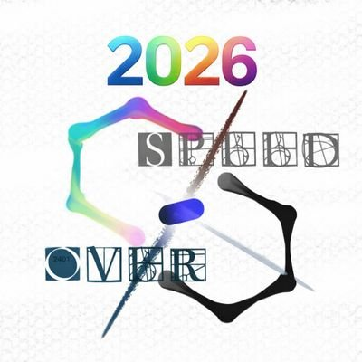OverSpring Wiki @OverSpring_wiki  
> 你尊重过oswiki吗，尊重是互相的  
> 7:06 PM · Aug 8, 2024

> 超级后后后藤 @Overdose_DBD  
> · Aug 8, 2024  
> 我尊重你们，最开始和你们好好沟通，你们就开始狗叫！捏造事实！

可以看出，对话中出现了一个叫做OverSpring Wiki的角色。看样子，是像另一个 OD 百科组织，它实际上正是另一个 [odwiki](overdose.wiki)。

2024年中旬，随着 [odwiki](overdose.wiki) 的衰弱，以及 ODer 们对于 ODwiki 的怪诞风格的不满，出现了一个叫做OverspeedWiki（后改为OverspringWiki）的百科网站，不同意 odwiki 中的所谓的“医学伦理学”，比较自由地发布药物并进行测试，但是之后网站被鸡哥攻击无法访问，最终编辑组解散以及网站关闭。

2024 年 12 月<!--是吗？-->，一个名叫“冷却报告”的 B站 up 发布了一个有关OD圈的视频，其中出现了一名受访者，据视频称这名受访者创建了一个“OD 网站”。这名受访者被 ODer 们一致认为是为当时已经隐退的**超级后后后藤**，引起轩然大波。

从此以后，后藤被所有 ODer 指责退圈后并背刺的行为，名声扫地。据称，**超级后后后藤**被家长送入戒网瘾学校，因此错过高考，只得复读一年。

## 2025年 内部斗争的一年

2025 年 1 月，**Overdosewiki官推**声称，后藤已经被他们优化掉了，以后的[**odwiki**](overdose.wiki)将脱离后藤运转，然而，当时，这个百科网站也很少活动了，[**odwiki**](overdose.wiki)日渐衰微，只是当时没有其他网站能够提供OD药物信息，因此尚有一定的影响力。

在类似的时间节点，**OverspeedWiki**的网站不再可访问。可能是因站长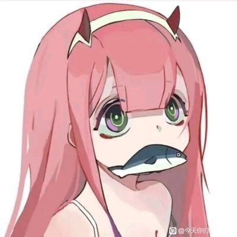**三琦**被抓。

2024 年至 2025 年，**鸡哥**做了以下策略，有效提升自己在 ODer 中的影响力：他在推特上先新建一个账号，发布少量与 OD 有关的贴子，然后根据推特平台上“你可能感兴趣的人”的推送机制，大量加可能是 ODer 的人的账号，对方很可能加他关注以表示礼貌。

2025 年 6 月，一个名叫“后土百科”的 B站 up 主发布了一个有关 OD 圈的[视频，题为《嗑药？自残？他们为何“乐此不疲”地毒害自己？》](https://www.bilibili.com/video/BV1yhKdzcEsx/)，引起广泛关注，也成为后续一系列争议爆发的关注点。其中。据说，此视频后来吸引更多新 ODer 因此加入 od 圈。

其中，一名不露脸的受访者自称“555”，这与[**odwiki**](overdose.wiki)的一名编辑——**55555** 的网名非常相似。

下图为涉事视频有关片段（原视频46:44处），可以清晰地看出一名戴口罩的男受访者自称自己是“555”。

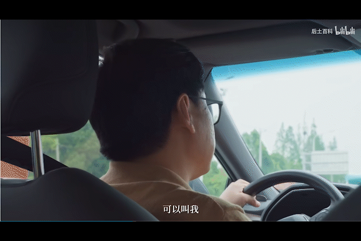

**55555** 当时已不再活跃很久。后来本人知晓此事，拒绝承认这是自己参加了采访，并怀疑是有人故意使用具有误导性的化名参加采访，达成误导观者相信是 **55555** 参加了采访的目的，其意图在于陷害 **55555** 退圈背刺（就像**超级后后后藤**那样）。然而，由于这段片段在全片的分量较小，当时并未掀起任何风波。

就另一位受访者，有推特用户称：

> @Citrus_amara  
> 另一个神人是叶子，你们可能不认识。但他在我墙内的群四处借钱od然后找后土百科把我们的群曝光了。  
> 6:31 PM · Aug 10, 2025

2025 年 8 月，一名叫做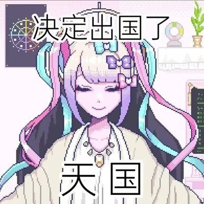**沐雨**的用户逐渐在 ODer 中受到关注。他自称拥有精神药理学的专业知识，并提供免费药物咨询。在与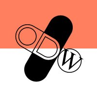**Overdosewiki官推** 爆发多次争吵后，**沐雨** 宣布成立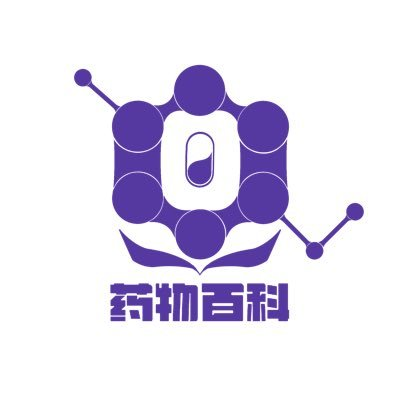**药物百科**，向 ODer 们提供更广泛的药物知识，受到大量关注。

2025 年 9 月，**药物百科**在**沐雨** 的作用下，开始售卖**沐雨** 所销售的一种[新型精神活性物质](../文档/研究用化学品.md)——“月尘”。沐雨声称，“月尘”没有副作用，是一种纯净的[解离剂](../文档/药物分类/解离剂.md)。

2025 年 9 月，**55555** 受到了来自**鸡哥** 的一张截图，其中**鸡哥**（即其中的 _“化学极乐百科”_ 推特用户)告知 **55555**，称 **55555** 被人开盒了。沐雨正在尝试与某灰产人员交流，意图人肉搜索（即“开盒”）**55555**，并附图片一张，如下：

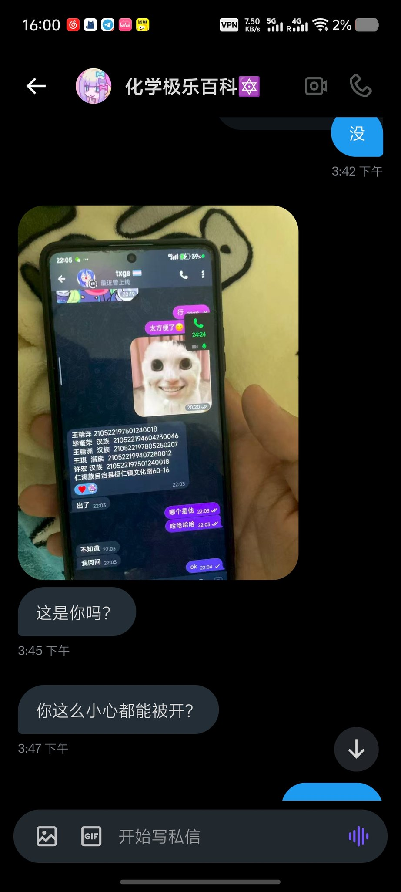

然后，**55555** 通过**Overdosewiki官推** 宣布了此事。**55555** 声称，图中的 Telegram 截图（图中图，看清楚）里对于一串身份信息使用表情反应的 Telegram 账号正是**沐雨** 的 Telegram 账号。他指责沐雨想要开盒自己[^5]。

同时，**55555** 又再次借助**Overdosewiki官推**，第二次谴责**沐雨** 冒用 **55555** 的名字参加了 6 月的《_`嗑药？自残？他们为何“乐此不疲”地毒害自己？`_》的采访，试图利用这个假身份来复刻**超级后后后藤** 被指责从事背刺行为，而身败名裂的例子。

55555 利用**Overdosewiki官推** 谴责了这个阴谋，并生成已经在着手把退圈的**超级后后后藤** 叫回来，来处理此事。

当时，**鼠尾草** 指责**沐雨** 出售[策划药](../文档/研究用化学品.md) [月尘（后得知为3-MeO-PCE）](../药物/3-MeO-PCE.md)，不公布实际成分，其动机可疑，造成的潜在后果巨大。

这就是一场冲突的开始。

2025 年 9 月 21 日，退圈 1 年的**超级后后后藤** 回归，并换上了新头像。

> 超级后后后藤 @Overdose_DBD  
> 我本早就离开了这地方，但今天我被某几位神明气急逼疯了，倒好像越不管越让各个Kaisers得寸进尺蹬鼻子上脸。打扰到圈外我这啮齿科的生活了
> 现在我は，只要保卫我平静的日子，不稀罕你们传的鬼王位，也不想管啥事，更懒得辟谣或减害
> 只是为了保卫退圈生活，希望你们能明白，谢谢  
> 6:43 PM · Sep 21, 2025

之后，一名

由于 OverdoseWiki 的推特账号由于年久失修，被冻结，也不得而知。

于是，他被推特封号了。

那是 2026 年 2 月 2 日，一场悲剧将要发生在春节之前。

---

2026 年 4 月 12 日，一则小道消息传出：

> 浙江省网安总队关于上报打击药物滥用网络社群战役线索的请示
>
> 公安部十一局、禁毒局：
>
> 为落实公安部打击涉麻精药品等成瘾性物质滥用专项行动部署，源头遏制新型毒品及药物滥用蔓延趋势，净化网络空间，浙江省公安机关网安部门联合禁毒部门侦破一起特大网络教唆、贩卖及滥用药物案件，打掉涉“OD圈”网络社群，抓获团伙头目董晗（男，网名“鸡哥”“chicken”）及核心骨干等人员5余名。
>
> 经查，该团伙头目董晗长期活跃在QQ、微信、推特（X）、电报（Telegram）等境内外社交平台，先后以“化学极乐百科”“太空极乐百科”“法友百科”“法友会”等多个账号和名义建立矩阵式网络社群。董晗等人在群组内大肆传播处方药、麻精药品滥用（OD）经验，详细图解致幻、成瘾药物的获取渠道与替代方案，并公然传授逃避公安机关打击的对抗审查方法。同时，该社群内部已衍生出非法倒卖管制药物、教唆吸毒、以及利用药物成瘾控制（PUA）社群成员等线下违法犯罪行为。该团伙行径严重污染网络生态，侵蚀青少年身心健康，极易诱发次生恶性案件或引发涉药群体性事件，社会危害性极大。
>
> 该网络社群受众广泛、发展人员众多，目前专案组已通过审讯及电子物证勘验，梳理出明确身份的活跃买家、非法供药代理及药物滥用人员 300 余人，涉及全国 20 余个省市。因涉案人员分布全国各地，且隐蔽性强、查处难度大，现将相关情报线索报送部局，拟请部局交办相关省市落地进行线索打击、溯源深挖及人员收戒管控。
>
> 妥否，请批示。

> 云智风乃  
> 到底有几个法u百科）  
> 2:08 AM  
> Today  
> New

> 小树🌲_MaruyamaTachiki  
> 发油百科是鸡哥在搞吗？  
> 我都搞不清他皮下是谁  
> 5:00 AM

> 超法友百科.ver  
> 2个  
> 2:23 PM

> Texas#缄默  
> 化学极乐百科爆改法友百科  
> 2:32 PM

> 超法友百科.ver  
> 超＝过量 法＝合法 友 ＝同类 百科 ＝ 药物 .ver ＝新版  
> 2:38 PM

> 云智风乃  
> 唉牢鸡哥😭  
> 2:38 PM

> 超法友百科.ver  
> 法友就是鸡哥  
> 2:39 PM

## Conversation

```
超级后后后藤 @Overdose_DBD
故事1
我最开始了解到茶苯海明时。那时我问别人，有什么药物能止优米吐，别人告诉我说茶苯海明，顺便说茶苯海明也可以o。于是我买了茶苯海明，我去搜索副作用，那帮子医生写的好像也没什么大不了，于是我开始od茶苯海明。直到谵妄出现的那一刻，我才明白，茶苯海明不好玩，可惜晚了
12:29 PM  May 28, 2024
10.1K Views

超级后后后藤 @Overdose_DBD May 28, 2024
故事2
我最开始了解od，也是因为右美沙芬。2022.08，那时候啥都没有，没有人告诉我副作用是什么，没有人告诉我右美有什么药效，有的只是那帮子医生含糊奇异的回答，以及指南上如同RP-76的描述。于是我开始od了
直到现在，我才明白一切都晚了。要是那时候也有一个后藤告诉我那些，那该多好！

超级后后后藤 @Overdose_DBD May 28, 2024
故事3
我最开始了解晚安时，哪有我们这帮子验证副作用的，哪有人会写什么副作用出来给我们听，只有一些人说“这个也能o！还有幻觉”以及指南。那时正是晚安美金刚扩散的时候，于是我开始od晚安了（甚至一开始是复方晚安）
现在我什么都知道了，但是晚了

超级后后后藤 @Overdose_DBD May 28, 2024
故事4
我当年进过一个od群，里边有一个人拿着我在贴吧写的东西，自称是自己一颗一颗吃出来的内容。我细看，这家伙还加上了自己的理解，什么右美沙芬是伪麻黄碱、有美、扑尔敏，什么愈美是右美沙芬加麻黄碱。说他几句直接破防，直接惭愧认错

超级后后后藤 @Overdose_DBD May 28, 2024
故事5
我在od群里待着观察见过：
一些啥都不知道的餐券女问苯海索怎么o怎么样，谁都答不上来！
好，一去o又回来抱怨怎么这么恶心，问怎么缓解，谁都答不上来！
把美金刚、晚安换上去同理

超级后后后藤 @Overdose_DBD May 29, 2024
🥺

🐾 @WangBai_LFYP May 31, 2024
爱波奇老师🥹❤️

超级后后后藤 @Overdose_DBD May 31, 2024
🥺
```

```
超级后后后藤 @Overdose_DBD
请直接说出我的错误，否则我怎么可能改正。。
9:57 PM Jun 3, 2024
12.5K Views

超级后后后藤 @Overdose_DBD Jun 3, 2024
有些事情，你不提醒我，我这辈子都察觉不出来有问题。。
你瞒着我不说，只觉得你不去解决问题，你就围着我的问题骂我发泄情绪，这有什么用处与意义。。

超级后后后藤 @Overdose_DBD Jun 3, 2024
所以不告诉我我的问题是什么的人，反而才是在害我咔？
既然你觉得我有那样的问题，那么请你直接对我说出口，否则要么你在乱说话，要么你就是忍气吞声自找苦吃。。

超级后后后藤 @Overdose_DBD Jun 3, 2024
开着嫌传播药物滥用，关了嫌没得参考减害；右边的家伙嫌写得太保守，左边的家伙嫌写得诱导人。最后问题在哪？没有人告诉我，简直是乱开口

虹夏🖤胺樂天使 @Nijika_overdose Jun 4, 2024
我觉得这问题就没法两全
像之前你分享贴吧号被疑似晶哥的人物私信叨扰的时候，就应该知道或许在普罗大众眼里科普这些也是种错误吧
儒儒有言“得志，与民由之；不得志，独行其道”
虹夏酱会一直守护最好的后藤酱的😘

超级后后后藤 @Overdose_DBD Jun 4, 2024
是如此，然后虹夏你可以叫凉还我钱吗

雨夜空 @RAlNY_NlGHT Jun 4, 2024
于oder而言，wiki带来的是帮助，知识普及和药物减害
于健全人，wiki则是向他们介绍何种药物可以滥用，并且有部分人因此变成oder
wiki若是产生社会问题，也是因为宣传药物滥用内容，不应是科普药物减害
（1/n）

超级后后后藤 @Overdose_DBD Jun 4, 2024
odwiki还是欠改了，要是这无法拦截健全人的话那肯定是我的毛病

chrorinEVE @chrorine_17 Jun 5, 2024
祝你顺利

超级后后后藤 @Overdose_DBD Jun 5, 2024
🥺

虚拟粘同学会梦到一般通过赛博溺水态李颖吗☆ @Chunliang2nd Jun 3, 2024
新开个页面多汉化点psywiki

超级后后后藤 @Overdose_DBD Jun 3, 2024
已经有其他组织在干咯！

虚拟粘同学会梦到一般通过赛博溺水态李颖吗☆ @Chunliang2nd Jun 3, 2024
哪里

超级后后后藤 @Overdose_DBD Jun 3, 2024
忘啦！

菌菌 @JunJun31246 Jun 4, 2024
守护最好的后藤酱~！

超级后后后藤 @Overdose_DBD Jun 4, 2024
我好集贸

林 @ln9814003229572 Jun 4, 2024
守護我們最好的後藤醬，你可是傳奇電視台牢書啊😿不能沒有你

超级后后后藤 @Overdose_DBD Jun 4, 2024
我好集贸，但是我确实是电视台超级芝加哥

时棠 未眠 @DaleWesley17 Jun 5, 2024
守护最好的后藤……刚开始我是o摄取林喹硫平的后面才知道别哦这种真的救了我ww

koishi！🏳️‍⚧️🍥 @KoishinFlandre Jun 4, 2024
抱抱qwq

🐾 @WangBai_LFYP Jun 4, 2024
抱抱波奇

✟ @slivernightFez Jun 4, 2024
啊啊为什么打不开wiki网站了
```

## 参考

<!--脚注不太会用欸，暂时这样应付一下 -->

[^1]: As of June, 2013, it appears that Chinese pharmacies require purchasers of DXM-containing products present ID and the products are almost always behind the counter, but no prescription is required. Many pharmacies record the identity of purchaser along with amount purchased. Previously, DXM-containing products were sold over-the-counter in pills and cough syrups in China. Rules tend to be laxer in rural areas. (thanks am) (last updated Sep 2013) -- erowid.org

[^2]: 推文内容：

    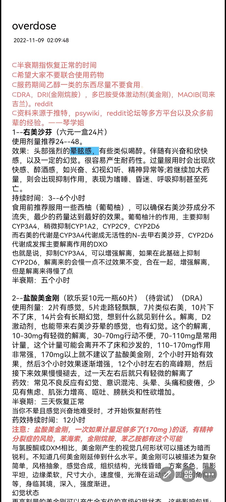
    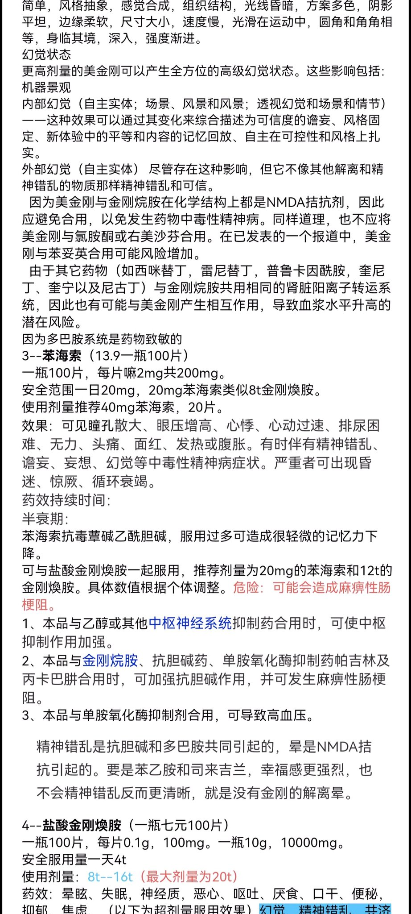
    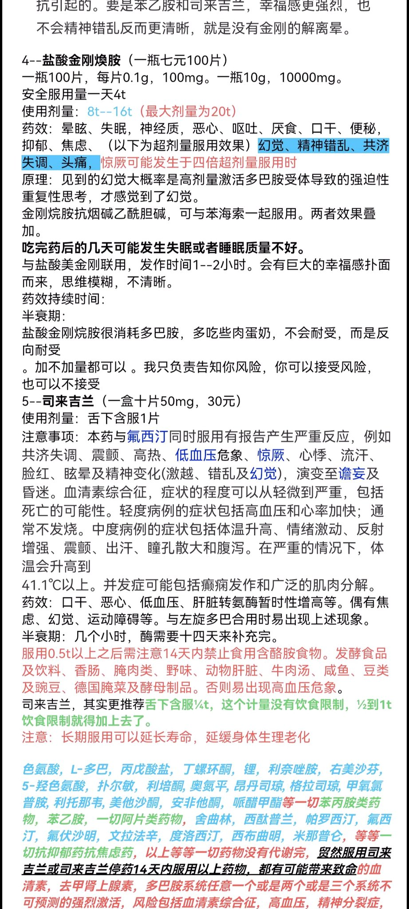
    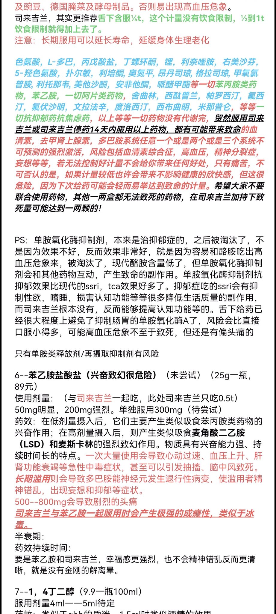
    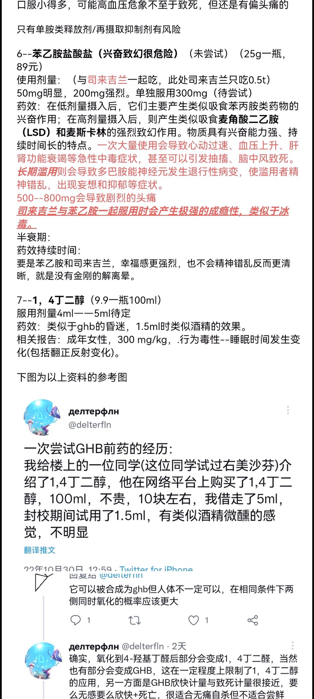
    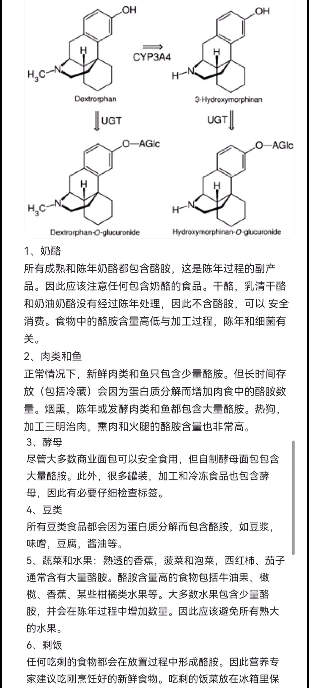
    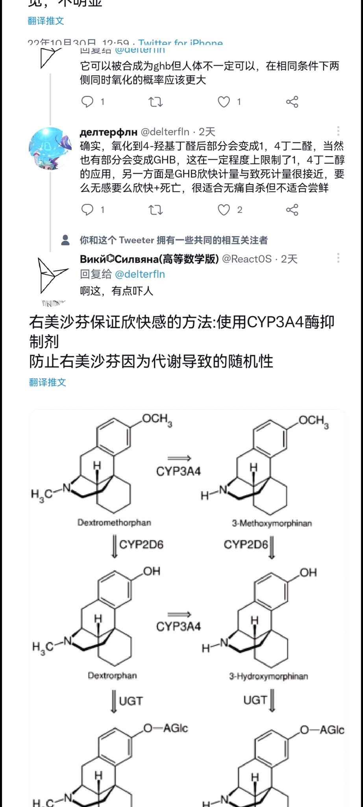
    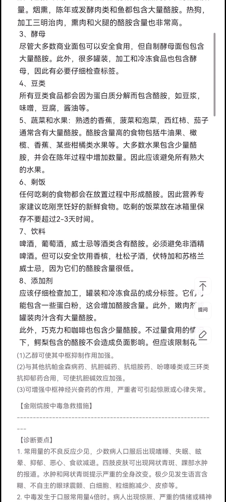
    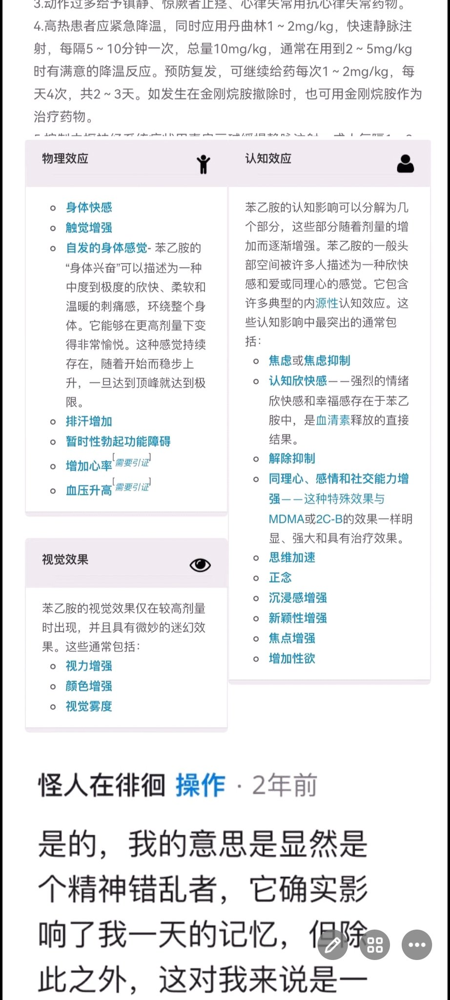
    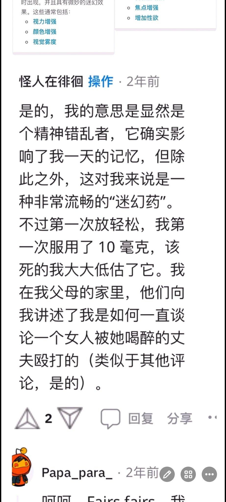
    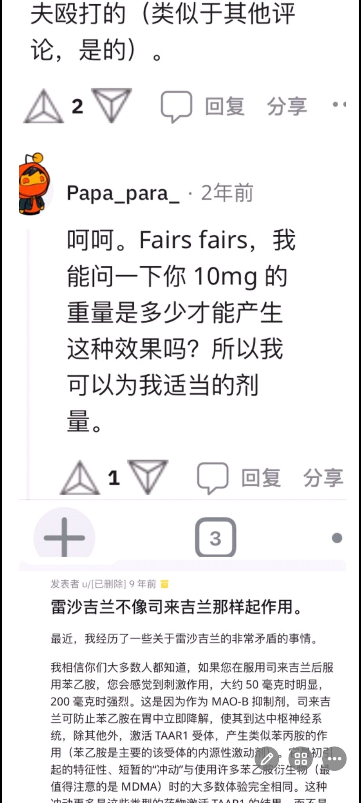
    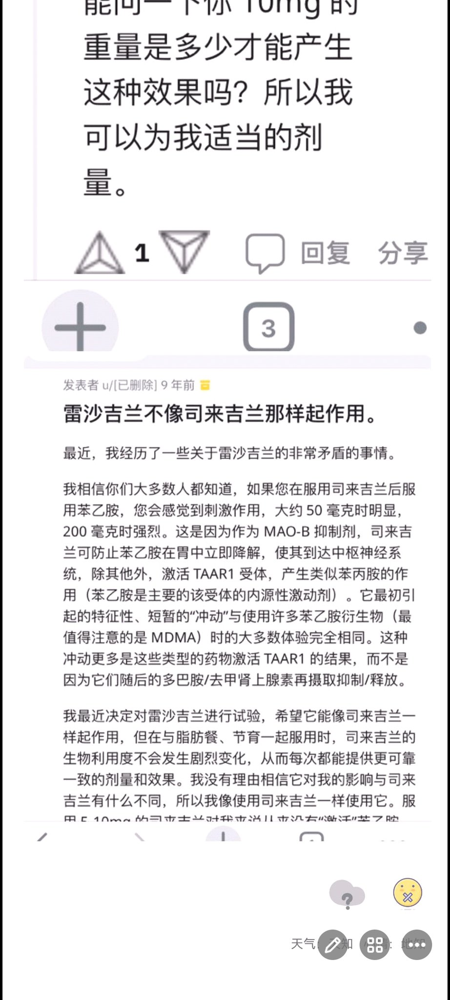

[^3]: 推文如下：

    > Emma Shi @Emma20131621  
    > （文字版  
    >  彩霞案是在2022年11月初于上海发生的针对跨性别女性彩霞的拘捕审讯案件，由于来自警方和家属的双重妨碍，最后由我方在非常规情况下为彩霞签出委托书，并于12月对外众筹律师费；由于该案件涉及的细节复杂、人数众多，其中涉及当事人安全隐私等诸多问题，在经过与律师和其伴侣的沟通之后，  
    > 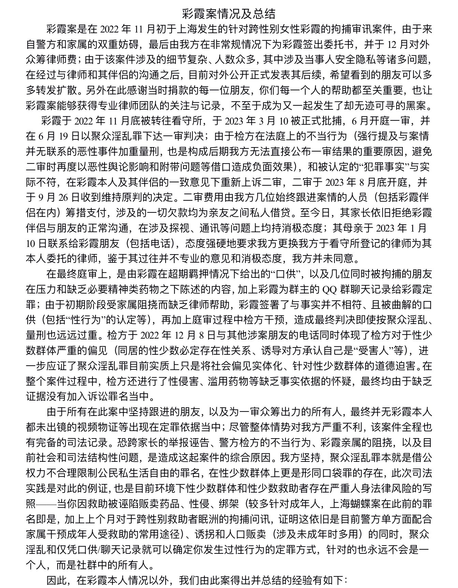
    > 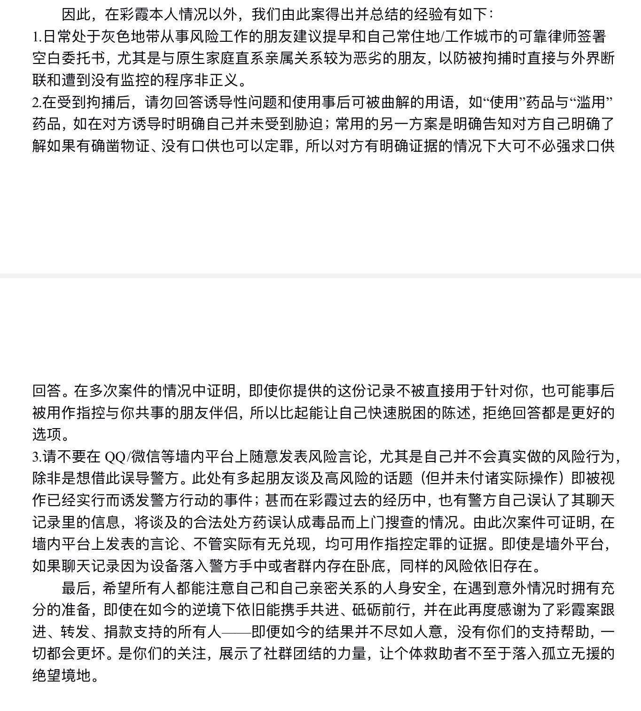
    >
    > 7:05 PM · Nov 10, 2023 · 59.4K Views

    > Emma Shi @Emma20131621 · Nov 10, 2023  
    > 目前对外公开正式发表其后续，希望看到的朋友可以多多转发扩散。另外在此感谢当时捐款的每一位朋友，你们每一个人的帮助都至关重要，也让彩霞案能够获得专业律师团队的关注与记录，不至于成为又一起发生了却无迹可寻的黑案。  
    >  彩霞于2022年11月底被转往看守所，于2023年3月10被正式批捕，

    > Emma Shi @Emma20131621 · Nov 10, 2023  
    > 6月开庭一审，并在6月19日以聚众淫乱罪下达一审判决；由于检方在法庭上的不当行为（强行提及与案情并无联系的恶性事件加重量刑，也是构成后期我方无法直接公布一审结果的重要原因，避免二审时再度以恶性舆论影响和附带问题等借口造成负面效果），和被认定的“犯罪事实”与实际不符，

    > Emma Shi @Emma20131621 · Nov 10, 2023  
    > 在彩霞本人及其伴侣的一致意见下重新上诉二审，二审于2023年8月底开庭，并于9月26日收到维持原判的决定。二审费用由我方几位始终跟进案情的人员（包括彩霞伴侣在内）筹措支付，涉及的一切欠款均为亲友之间私人借贷。

    > Emma Shi @Emma20131621 · Nov 10, 2023  
    > 至今日，其家长依旧拒绝彩霞伴侣与朋友的正常沟通，在涉及探视、通讯等问题上均持消极态度；其母亲于2023年1月10日联系给彩霞朋友（包括电话），态度强硬地要求我方更换我方于看守所登记的律师为其本人委托的律师，鉴于其过往并不专业的意见和消极态度，我方并未同意。

    > Emma Shi @Emma20131621 · Nov 10, 2023  
    > 在最终庭审上，是由彩霞在超期羁押情况下给出的“口供”，以及几位同时被拘捕的朋友在压力和缺乏必要精神类药物之下陈述的内容，加上彩霞为群主的QQ群聊天记录给彩霞定罪；由于初期阶段受家属阻挠而缺乏律师帮助，彩霞签署了与事实并不相符、且被曲解的口供（包括“性行为”的认定等），

    > Emma Shi @Emma20131621 · Nov 10, 2023  
    > 再加上庭审过程中检方干预，造成最终判决即使按聚众淫乱、量刑也远远过重。检方于2022年12月8日与其他涉案朋友的电话同时体现了检方对于性少数群体严重的偏见（同居的性少数必定存在性关系、诱导对方承认自己是“受害人”等），进一步应证了聚众淫乱罪目前实质上只是将社会偏见实体化、

    > Emma Shi @Emma20131621 · Nov 10, 2023  
    > 针对性少数群体的道德迫害。在整个案件过程中，检方还进行了性侵害、滥用药物等缺乏事实依据的怀疑，最终均由于缺乏证据没有加入诉讼罪名当中。  
    >  由于所有在此案中坚持跟进的朋友，以及为一审众筹出力的所有人，最终并无彩霞本人都未出镜的视频物证等出现在定罪依据当中；

    > Emma Shi @Emma20131621 · Nov 10, 2023  
    > 尽管整体情势对我方严重不利，该案件全程也有完备的司法记录。恐跨家长的举报诬告、警方检方的不当行为、彩霞亲属的阻挠，以及目前社会和司法结构性问题，是造成这起案件的综合原因。我方坚持，聚众淫乱罪本就是借公权力不合理限制公民私生活自由的罪名，在性少数群体上更是形同口袋罪的存在，

    > Emma Shi @Emma20131621 · Nov 10, 2023  
    > 此次司法实践是对此的例证，也是目前环境下性少数群体和性少数救助者存在严重人身法律风险的写照——当你因救助被诬陷贩卖药品、性侵、绑架（较多针对成年人，上海蝴蝶案在此前的罪名即是，加上上个月对于跨性别救助者眠洲的拘捕问讯，证明这依旧是目前警方单方面配合家属干预成年人受救助的常用途径）、

    > Emma Shi @Emma20131621 · Nov 10, 2023  
    > 诱拐和人口贩卖（涉及未成年时多用）的同时，聚众淫乱和仅凭口供/聊天记录就可以确定你发生过性行为的定罪方式，针对的也永远不会是一个人，而是社群中的所有人。  
    >  因此，在彩霞本人情况以外，我们由此案得出并总结的经验有如下：

    > Emma Shi @Emma20131621 · Nov 10, 2023  
    > 1.日常处于灰色地带从事风险工作的朋友建议提早和自己常住地/工作城市的可靠律师签署空白委托书，尤其是与原生家庭直系亲属关系较为恶劣的朋友，以防被拘捕时直接与外界断联和遭到没有监控的程序非正义。

    > Emma Shi @Emma20131621 · Nov 10, 2023  
    > 2.在受到拘捕后，请勿回答诱导性问题和使用事后可被曲解的用语，如“使用”药品与“滥用”药品，如在对方诱导时明确自己并未受到胁迫；常用的另一方案是明确告知对方自己明确了解如果有确凿物证、没有口供也可以定罪，所以对方有明确证据的情况下大可不必强求口供回答。

    > Emma Shi @Emma20131621 · Nov 10, 2023  
    > 在多次案件的情况中证明，即使你提供的这份记录不被直接用于针对你，也可能事后被用作指控与你共事的朋友伴侣，所以比起能让自己快速脱困的陈述，拒绝回答都是更好的选项。

    > Emma Shi @Emma20131621 · Nov 10, 2023  
    > 3.请不要在QQ/微信等墙内平台上随意发表风险言论，尤其是自己并不会真实做的风险行为，除非是想借此误导警方。

    > Emma Shi @Emma20131621 · Nov 10, 2023  
    > 此处有多起朋友谈及高风险的话题（但并未付诸实际操作）即被视作已经实行而诱发警方行动的事件；甚而在彩霞过去的经历中，也有警方自己误认了其聊天记录里的信息，将谈及的合法处方药误认成毒品而上门搜查的情况。由此次案件可证明，

    > Emma Shi @Emma20131621 · Nov 10, 2023  
    > 在墙内平台上发表的言论、不管实际有无兑现，均可用作指控定罪的证据。即使是墙外平台，如果聊天记录因为设备落入警方手中或者群内存在卧底，同样的风险依旧存在。  
    >  最后，希望所有人都能注意自己和自己亲密关系的人身安全，在遇到意外情况时拥有充分的准备，

    > Emma Shi @Emma20131621 · Nov 10, 2023  
    > 即使在如今的逆境下依旧能携手共进、砥砺前行，并在此再度感谢为了彩霞案跟进、转发、捐款支持的所有人——即便如今的结果并不尽如人意，没有你们的支持帮助，一切都会更坏。是你们的关注，展示了社群团结的力量，让个体救助者不至于落入孤立无援的绝望境地。

[^4]: 一说，[死藤水](../药物/死藤水.md)，但两者的唯一差异只是制作用的植物不同，因此不加细究

[^5]: 通过比对图中图里的手机上方状态栏的格式，可以确认那是沐雨的手机。
