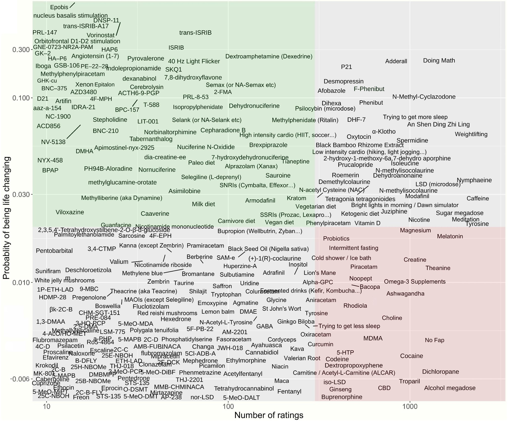
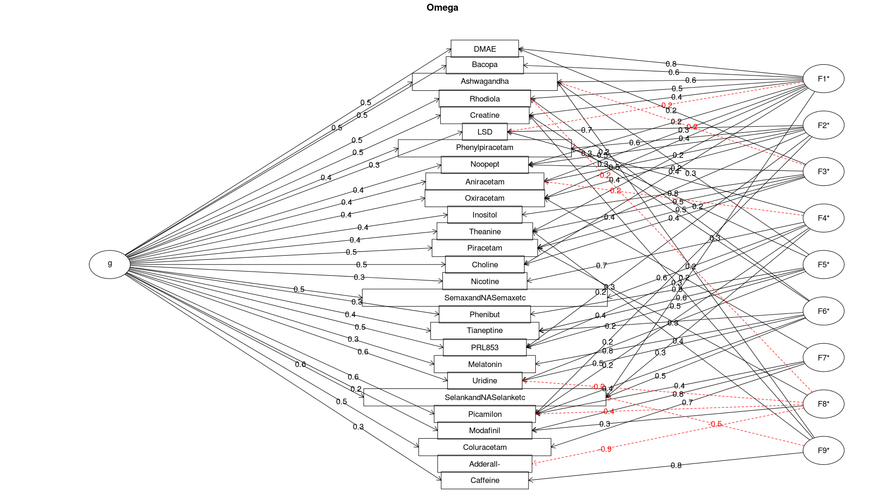
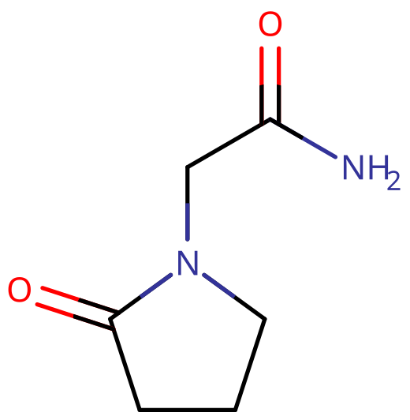
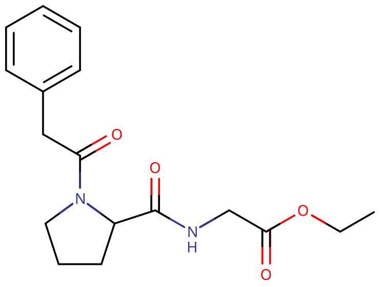

# 益智药

[◀返回](index.md)

**益智药**（Nootropic，亦称 **促智药**、**聪明药**、**神经增强剂** 和 **认知增强剂**）是那些据称可以改善健康个体认知功能的物质，比如增强记忆力、动力、注意力和集中力。[^1] [^2] 人们认为益智药是通过改变大脑神经化学物质（即神经递质、酶和激素）的供应量、改善大脑的氧气供应，或者刺激神经生长来发挥作用的。

|               |
| ------------------------------------------------ |
| 横轴：受访者数量 纵轴：给生活带来益处的可能性 |

Nootropic 这个词是在 1972 年由罗马尼亚心理学家兼化学家 Corneliu E. Giurgea 创造。[^3] [^4] 它源自希腊语中的 νοῦς（_nous_，意为「精神」）和 τρέπειν（_trepein_，意为「弯曲」或「转动」）。[^5] Giurgea 博士提出了以下标准来判断一种物质是否符合「益智药」的描述：

- 增强学习和记忆功能
- 在设定了干扰条件（例如施用致忘剂）时，能改善习得行为
- 必须具有神经保护作用
- 毒性必须极低，几乎没有副作用

不过呀，现在这个词在流行语境下的含义已经不再要求必须满足所有这些标准了。

|                                                                                                      |
| :-----------------------------------------------------------------------------------------------------------------------------------------------------------: |
| 来自 [2016 年调查](http://slatestarcodex.com/2016/03/01/2016-nootropics-survey-results/)的益智药评分[因子分析](https://en.wikipedia.org/wiki/Factor_analysis) |

## 分类

益智药有很多个分类，也有一些不属于任何特定分类的化合物。其中最著名且应用最广泛的是拉西坦类物质，其原型就是[吡拉西坦](../../药物/吡拉西坦.md)。它是1964年第一种被认可的益智药。拉西坦类物质都共有一个 2-吡咯烷酮环。其他的拉西坦类益智药还包括阿尼西坦、奥拉西坦、苯基吡拉西坦和考路西坦。

第二类益智药化合物是合成肽，最常见的例子是 [Noopept](../../药物/noopept.md) 。虽然它不属于拉西坦类，但由于作用方式相似，通常被归为一类。

|  |  |
| :---------------------------: | :-------------------------: |
|           吡拉西坦            |           Noopept           |

由于益智药科学还处于起步阶段，目前正在合成一些新的化合物，比如 IDRA-21、PRL-8-53、unifiram、sunifiram 等等，它们无法整齐地归入某个结构分类里。此外，其中一些化合物的副作用、剂量、危险的相互作用等信息目前几乎还是未知的，一定要小心！

## 主观效应

> _**免责声明：** 下面列出的效应引用了 [**主观效应索引**](../../药效/index.md)（**SEI**），这是一套基于匿名用户报告和本站贡献者个人分析的开放研究文献。因此，应当以健康的怀疑态度来看待它们。_
>
> _另外值得注意的是，这些效应不一定会以可预测或可靠的方式发生，尽管高剂量更容易诱发全谱系的效应。同样地，**不良反应** 随剂量增加而变得越来越可能，并可能包括 **成瘾、严重伤害或死亡** ☠。_

这种效应在它专门的条目里有定义：

- **[思维加速](../../药效/思维加速.md)**
- **[思维连通性](../../药效/思维连通性.md)**
- **[专注力强化](../../药效/专注力强化.md)**
- **[动机增强](../../药效/动机增强.md)**
- **[记忆增强](../../药效/记忆增强.md)**
- **[兴奋](../../药效/兴奋.md)**
- **[焦虑抑制](../../药效/焦虑抑制.md)**
- **[清醒](../../药效/清醒.md)**

## 示例

### [拉西坦类物质](拉西坦类物质.md)

- 阿尼西坦
- 考路西坦
- 法索西坦
- 奈非西坦
- [奥拉西坦](../../药物/Oxiracetam.md)
- [苯基吡拉西坦](../../药物/Phenylpiracetam.md)
- [吡拉西坦](../../药物/吡拉西坦.md)
- [普拉西坦](../../药物/Pramiracetam.md)

### 阿非尼类

- [艾捉非尼](../../药物/艾捉菲尼.md)
- [阿莫达非尼](../../药物/Armodafinil.md)
- [N-甲基二氟莫达非尼](../../药物/N-甲基二氟莫达非尼.md)
- [莫达非尼](../../药物/莫达非尼.md)

### 营养素

- [Alpha-GPC](../../药物/Alpha-GPC.md)
- [酒石酸氢胆碱](../../药物/酒石酸氢胆碱.md)
- 胞磷胆碱
- 肌酸
- SAM-e
- 酪氨酸

### Ampakines

- IDRA-21

### 其他

- [5-HTP](../../药物/5-HTP.md)
- 槟榔碱
- 睡茄（Ashwagandha）
- [布罗曼坦](../../药物/布罗曼坦.md)
- [咖啡因](../../药物/咖啡因.md)
- 可替宁
- [加兰他敏](../../药物/加兰他敏.md)
- 石杉碱甲
- [L-茶氨酸](../../药物/茶氨酸.md)
- [美金刚](../../药物/美金刚.md)
- N-乙酰半胱氨酸
- 尼古丁
- [Noopept](../../药物/noopept.md)
- [普罗林丹](../../药物/Prolintane.md)
- [苦茶碱](../../药物/Theacrine.md)
- [噻奈普汀](../../药物/噻奈普汀.md)
- [Alpha-GPC](../../药物/Alpha-GPC.md)

## 另见

- [负责任的用药索引页](../负责任的用药索引页.md)
- [药物全索引](药物全索引.md)
- [共情剂](共情剂.md)
- [兴奋剂](兴奋剂.md)
- [抑制剂](抑制剂.md)
- [致幻剂](致幻剂.md)

## 外部链接

- [Nootropic (Wikipedia)](https://en.wikipedia.org/wiki/Nootropic)
- [Nootropics / Smart Drugs (Erowid)](https://www.erowid.org/smarts/)
- [Nootropic (Examine.com)](https://examine.com/supplements/nootropic/)

### 讨论

- [/r/Nootropics (Reddit)](https://www.reddit.com/r/Nootropics/)

## 参考文献

[^1]: Frati, P., Kyriakou, C., Rio, A. D., Marinelli, E., Vergallo, G. M., Zaami, S., Busardo, F. P. ["Smart Drugs and Synthetic Androgens for Cognitive and Physical Enhancement: Revolving Doors of Cosmetic Neurology"](https://www.eurekaselect.com/article/63921). _Current Neuropharmacology_. **13** (1): 5–11.

[^2]: Lanni, C., Lenzken, S. C., Pascale, A., Del Vecchio, I., Racchi, M., Pistoia, F., Govoni, S. (1 March 2008). ["Cognition enhancers between treating and doping the mind"](https://www.sciencedirect.com/science/article/pii/S1043661808000273). _Pharmacological Research_. **57** (3): 196–213. [doi](http://en.wikipedia.org/wiki/Digital_object_identifier):[10.1016/j.phrs.2008.02.004](https://doi.org/10.1016%2Fj.phrs.2008.02.004). [ISSN](http://en.wikipedia.org/wiki/International_Standard_Serial_Number) [1043-6618](https://www.worldcat.org/issn/1043-6618).

[^3]: Gazzaniga, Michael S. (2006). _The Ethical Brain: The Science of Our Moral Dilemmas (P.S.)_. New York, N.Y: Harper Perennial. p. 184. [ISBN](http://en.wikipedia.org/wiki/International_Standard_Book_Number) [0-06-088473-8](http://en.wikipedia.org/wiki/Special:BookSources/0-06-088473-8).

[^4]: Giurgea C (1972). "[Pharmacology of integrative activity of the brain. Attempt at nootropic concept in psychopharmacology] ("Vers une pharmacologie de l'active integrative du cerveau: Tentative du concept nootrope en psychopharmacology")". _Actual Pharmacol (Paris)_ (in French). **25**: 115–56. [PMID](http://en.wikipedia.org/wiki/PubMed_Identifier) [4541214](https://www.ncbi.nlm.nih.gov/pubmed/4541214).

[^5]: ["nootropic | Definition of nootropic in English by Oxford Dictionaries"](https://en.oxforddictionaries.com/definition/nootropic). _Oxford Dictionaries | English_. Retrieved 2018-07-19.
