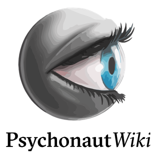
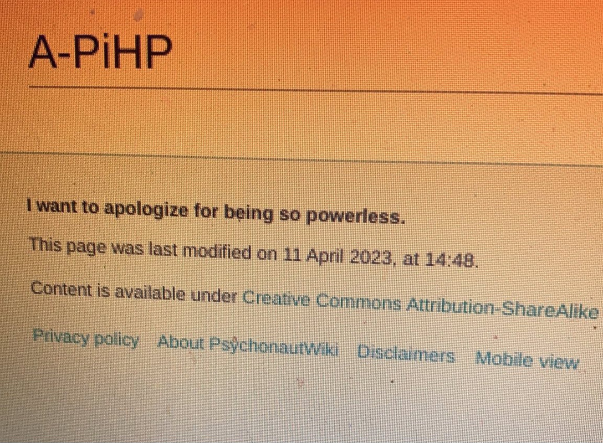
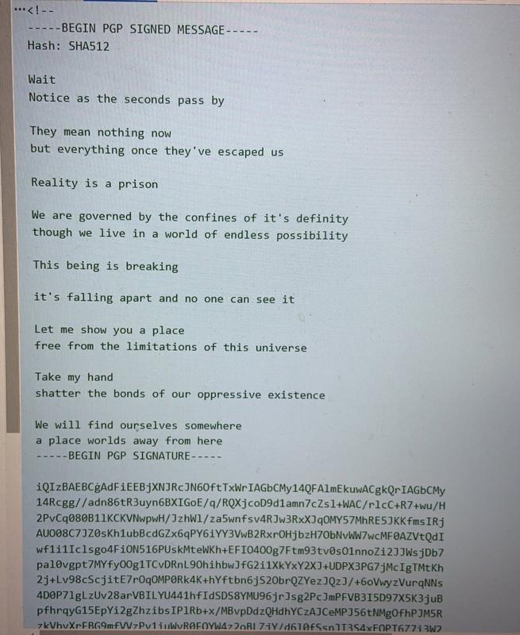
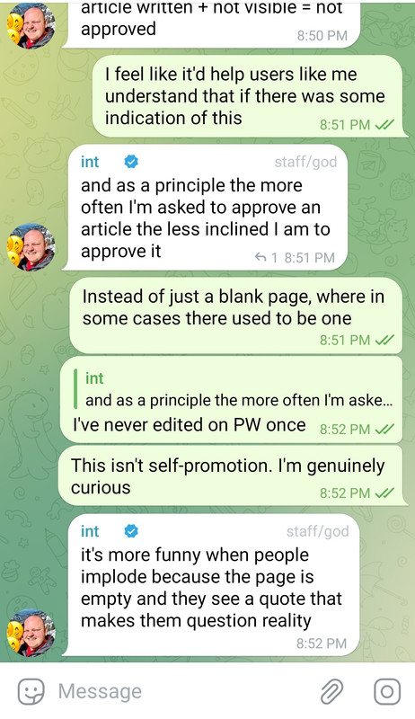
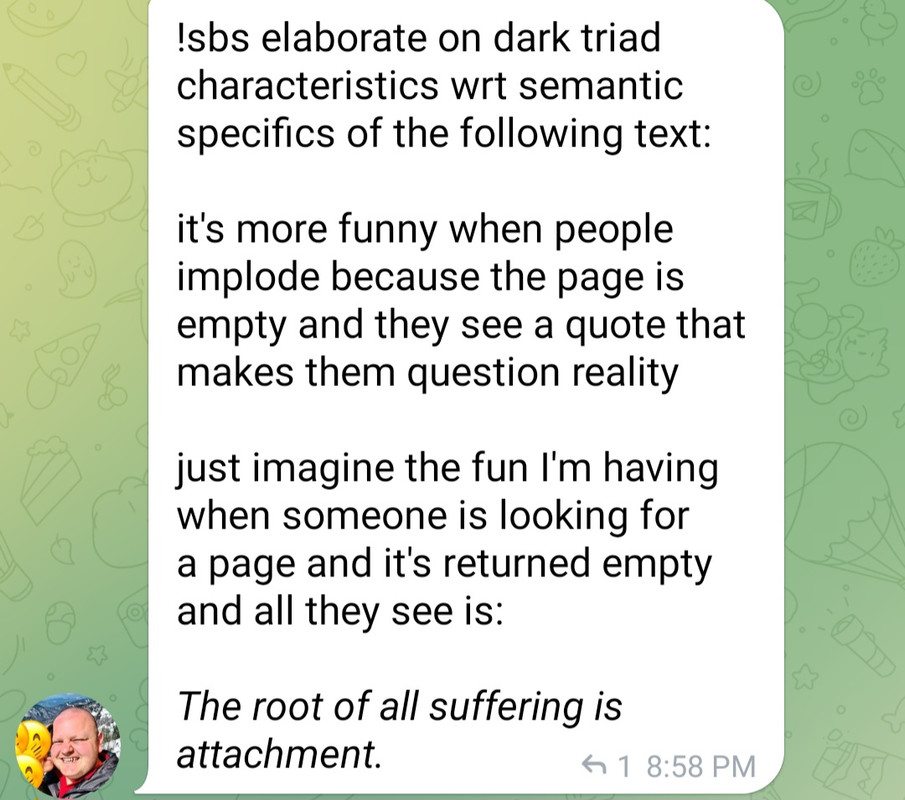
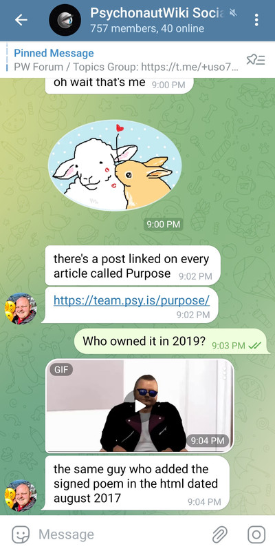
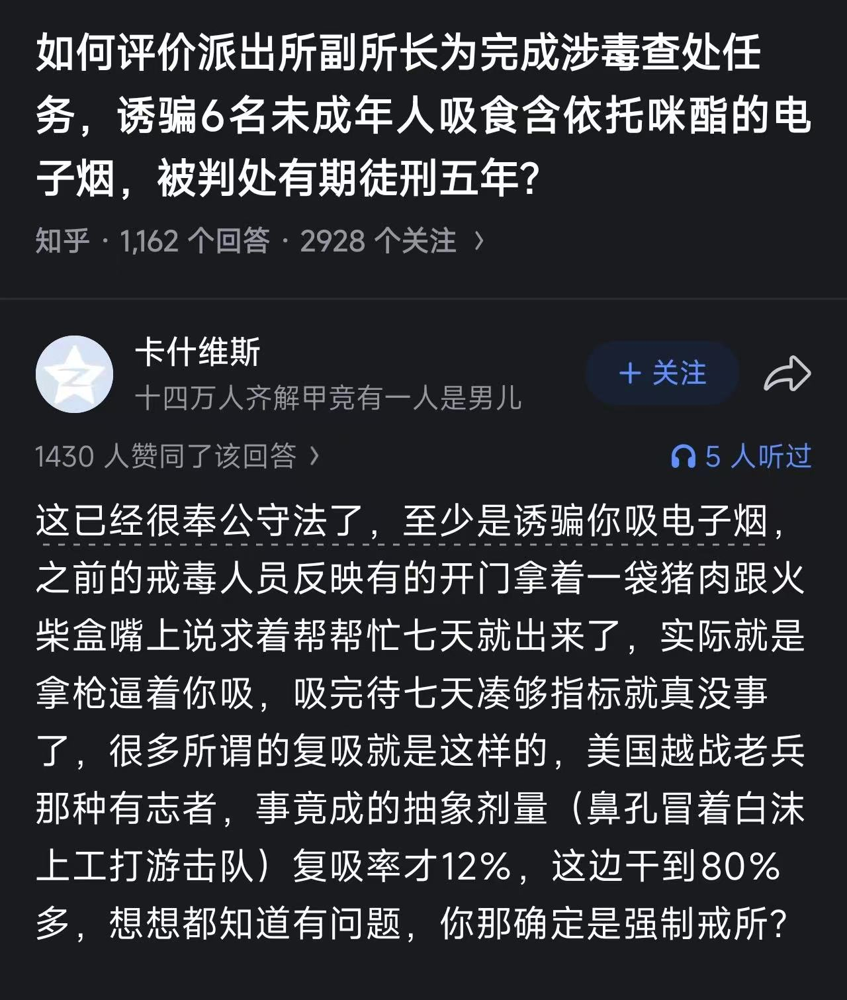

# FreeOD引论

[◀返回](./index.md)

<i>by @SalviaSWC</i>

为防止本文档被别有用心的人利用，本文档及其所有历史版本采用 CC BY-ND 4.0 即 CC 署名—禁止演绎 4.0 协议国际版许可，侵权必究，敬请谅解。详见[这里](../LICENSE-STRICT)
。

<mark>施工中</mark>

本引论的目标读者是所有FreeODwiki的访问者。

本文档的主要作者是 @SalviaSWC 。笔者其深入接触过OD群体，是OD群体当前最大的百科[FreeODwiki](https://github.com/SalviaSWC/FreeODwiki/tree/main)的创立者和最大编辑。

笔者可以说是还活着的人中最了解OD社群的人之一，之前编写过[OD史](../od.md)(虽然未完成)。笔者也服用过各类精神活性物质，因此对各类精神活性物质的[药效](/药效/index.md)有深刻的认识，能够理解服药者的心理和行为。

因此，请信任本文档中作者所做出的论断的正确性。如果你有疑问，欢迎你找ta交流，联系方式将在文档末给出。

## 前言写给不知道OD是啥的人......

一提到OD，你会想起什么？

如果你懂点英文，考虑到所谓“OD”是英文单词“Overdose”的缩写，你可能会想到一个一心求死抱着个药瓶，然后一口气把里面的药全都吞下去，然后倒在地上，白白的药片撒了一地。此人旋即口吐白沫，眼睛翻白，一命呜呼。

如果你关注过某些道听途说，你可能会觉得OD就是一个自残的人，左手抱着一版“愈美片”或“[普瑞巴林](/药物/普瑞巴林.md)”，右手拿着美工刀。手起刀落，皮肉被割开，手腕上、大腿上顿时出现几个狰狞的伤口，鲜血不断涌出，整场闹剧以打120急救告终。

抑或是你看到了中国禁毒近日发表的文章，你可能会觉得OD就是滥用药物；滥用精麻药物就是吸毒。所以，OD只不过是一些未成年黄头发小混混嘴里叼着一盒[右美沙芬](/药物/右美沙芬.md)、手上拿着一根“上头[电子烟](/药物/尼古丁.md)”、包里装着一袋“[月尘](/药物/3-MeO-PCE.md)”或其他毒品，准备以药壮胆，去实施犯罪行为，结果被人民警察正义制裁。

对于不知道OD是啥的你来说，一提到上述三种与OD有关的玩意，简直是让你意识到OD圈就是“天地之大，无奇不有”的真实写照，你肯定还想看更有乐子、更猎奇的玩意吧！就让我带你看看吧，下面的内容会更让你大开眼界<s>，未成年人请在家长陪同下阅读</s>。

---

TBD <!---  后续加点乐子，欲扬先抑，让这些健全逼们先乐一会儿  -->

更劲爆的是，尽管你知道OD就是药物滥用，滥用精麻药物就是吸毒，而搞“OD”的吸毒者们无非都是社会的蛆虫。而去年居然有新闻称，从2026年开始，吸毒记录马上就要封存，把这些蛆虫们洗白，让他们人模狗样地重新融入社会。真是令人捧腹啊！幸好正义感满满的“四川文旅”揭发了这个荒唐的政策，短短一句“哪位少爷吸了”便点出了这个政策的荒谬之处，引得不凡的社会反响。大家都在吃瓜看乐子，响亮而无声地宣告毒虫们就是没有任何洗白的余地的不可接触者这一事实。<!--- 这是最后一个 -->

----

事件热度过去，虽然反对呼声很大，吸毒记录封存的政策却没有被废除。你可能会认为，那位吸了毒的少爷真是手眼通天，抑或是毒贩们的幕后操纵，才让这个被视为国家级乐子的政策得以通过。

然而，有没有一种可能，这个议题并非简单的乐子，而是一个严肃的议题呢？

---- 

后面酌情保留

最近，越来越多的媒体开始关注OD了。这是一个非常令人担忧的现象。媒体的大量曝光为生存处境本来就堪忧的ODer们雪上加霜。

很多ODer对这个现象产生的原因怀有疑问，毕竟吞药并不是什么上得了台面的东西。有的ODer甚至发问“<i>我一直好奇吃药和这帮媒体有什么关系，吃死了都没关系，又没碍别人事</i>”。

解释这个现象的原因有很多。在笔者看来，“树大招风”是一个最关键的原因，毕竟OD圈并非“空穴来风”。不去计较背后的原因：能产生精神效应的药物是客观存在的，能“创造性地”利用这个性质的人也是客观存在的，而由这些人构成的OD圈也是客观存在的，这个圈子日益扩大、引起广泛社会注意也是客观存在的。

OD圈由引起广泛注意到被大量报道曝光的一个原因便是，新闻行业的竞争压力日趋增大，而为了博取眼球，媒体必须采用新型战略。然而，现在是2026年，媒体“UC震惊部”式标题党套路早已成为历史、曝光不该曝光内幕会引起当局封杀、而现在有了ai，任何以假乱真的骗术都会被无情地揭穿，搬起石头砸自己的脚。

在这个背景下，OD圈(以及任何社会性质类似的圈子)可以说是一个“现成的”标题党素材库了。只要把ODer们吞药、自残的聊天记录等素材挖掘出来，几乎无需任何额外加工，一个个骇人听闻的新闻报道便崭新出炉。

压死骆驼的最后一根稻草，便是4月以“广州禁毒”为首的禁毒媒体在一个视频中嵌入了ODer们割手的图片，且相关内容占了不小的篇幅。我一点都不知道为什么一个禁毒媒体要探讨自残行为。但不可否认的是，具有官方性质的禁毒媒体带头此类素材，等同于向媒体们释放了一个信号：快来加入曝光OD圈，蹂躏ODer们，吃掺了ODer们鲜血的人血馒头宴会吧！

而新闻报道的曝光特点，便是“破窗效应”。当一个现象被报道之后，日益增加的流量便会吸引更多报道，导致曝光度的增加形成一个恐怖的恶性循环。

曝光度的增加是很难避免的，因此我们只能设法降低大量曝光对我们的损害。因此，我决定写下本文档。

我认为，不得不一五一十地写下关于我们社群的这么多事情，是非常不幸的。我们本可以继续探究药理，组织社群，和大家和谐共生。然而，某些外界别有用心的人士利用我们不善于发声的弱点，企图借我们牟取利益。他们勾结社群内部的不良分子、游说当局执法部门和政策制定者、影响普罗大众，借他们的声势散布有关我们的错误观念，并最终威胁到我们“圈地自萌”的生存状态。因此，我们不得不写下这些文档，确保真相不会被谎言埋没。

此外，目前有关OD的文档甚少。每当我需要论证一个涉及OD的议题时，我都不得不拿出来一大堆论据，从头开始论证整套逻辑，极为费时费力。因此，本文档亦旨在为社会各界提供一个讨论OD议题时可供参考的可信资料，而这个资料并不会偏袒任意一方，帮助研究者得出一个更公平的结论。

笔者认为，对于某些问题，只要给出相应的证据，所有逻辑正常的人都会得出一样的答案。然而，并非所有人都能接触到这些证据。在这种情况下，像掌握大量证据的人(例如笔者)就需要为他们点拨点拨了。

### 既然本文档的意义如此重大，为什么不早点写呢?

首先，全面地编写有关OD的文档不可避免地会出现疏漏之处，有造成严重的争议的可能。然而，如今

一个重要原因就是，OD群体不太愿意被大众认知(原因会在下文讲解)，因此编写一个全面的文档来讲解OD群体，更想必是会受到ODer全体指责，从而失去他们的支持的。笔者的深受OD群体的支持，肯定不会轻易放弃ODer的支持的。

笔者曾打算编写

有一群sb拦着我，叫我别写，说这是没有用的。说实话，我怀疑警察，ODer，毒贩，记者，都不希望任何人写出这些文档，好让他们自己在乱局中得利。我真是疯了！！！

### 叠甲

### 本文档的局限性

笔者主要在推特平台活动，因此接触的主要是活跃在推特平台上的人。我对墙内平台上的OD活动虽有耳闻，我对他们的认识却远比不上我对推特ODer的认识深刻。

TBD

### 术语澄清

在本文档中，你可以看到“OD”、“精神活性物质”、“毒品”等近义词被交替使用。如果要掰扯这些术语，我可以掰扯很久，但就讨论当前问题而言，这些特定提法其实没有任何意义。如果你看到有人揪着某个术语的使用不放，那么此人肯定是想夹带他自己的私货。例如

如有疑问，请参阅文末的术语表。

## 背景

下面介绍本文档的背景，使得对OD认知水平较低的路人也能读懂整个文档。

### OD药物

OD药物是贯穿整个群体始终的话题。

OD药物与大众所认知的“毒品”的关键性不同点在于，“毒品”的不法分子为某取金钱利益，而非法私下制造的；而OD药物是人们为了改变精神状态而自行使用，更接近于自我药疗。

#### 几个典型

### ODer

ODer指的是单个从事OD行为的人。

#### ODer的心路历程

一个路人从完全不知道OD开始，到初窥门槛，再到加入OD群体，成为ODer，究竟经历了什么的心路历程呢?

根据个人观察并不是所有人的心路历程都完全相同，然而，这里可以归纳出几个具有共性的阶段。

<i>注意，以下阶段都是文档作者便于称呼而起的名字，在社群中就此并无共识。</i>

##### 最初阶段

每一个未接触过任何大量有关精神活性物质的知识(禁毒宣传不算)的人都处于<i>最初阶段</i>。

处于最初阶段的人可能知道禁毒宣传中老生常谈的“毒品”、“药物滥用”等相关名词，却精神活性物质的真实情况毫不了解。他也许每天靠[咖啡](/药物/咖啡因.md)吊着一条命、抽[烟](/药物/尼古丁.md)喝[酒](/药物/酒精.md)嚼槟榔，却不知道这些精神活性物质与所谓“毒品”是本质上类似的。总之，他们对于精神活性物质的认知水平极其低下，并将这个话题视为禁忌。

然而，这种认知低下和文化禁忌的状态，恰恰助长了他们对精神活性物质的好奇。就像“谈性色变”一样，精神活性物质也是一个“谈药色变”的话题；就像“性压抑”一样，人们也会“药压抑”。

一个常见的例子就是一个热梗“卧槽，冰！”，它的流行程度就足以说明人们的“药压抑”程度很深了。还人将高因咖啡因饮料宣传为“毒品”，引发广泛关注。这两个例子都是身处最初阶段的人对精神活性物质的好奇心与禁忌感并存的体现。

为什么身处最初阶段的人会有这种表现呢？为了解释这个现象，窝这里引用纳粹德国宣传部长葛培尔说过的一句话：“如果你说的谎言范围够大，并且不断重复，人民最终会开始相信它。”   

<i>这里无意将我国宣传部门比作纳粹德国宣传部门，或暗示禁毒宣传完全是谎言。然而，二者的形式是相同的，且造成的效果也是相似的。</i>

 在中国，禁毒宣传的范围是有目共睹的。<!-- TBD -->

因此，在我国，任何未能深入了解相关真相的人的独立思考能力，都会屈服于铺天盖地的宣传力量。

然而，人还有一个“逆反心理”，当宣传力量过于强大时，反而会激起人们的好奇心，想要去了解真相。

不幸的是，当局早就预料到了这一点。国内民众方便接触到的有关药物信息均被严格审查，并被以一种有利于瓦解逆反心理的方式表现出来。举个小小的例子：笔者还记得，之前在使用国产输入法打出“[冰毒](/药物/甲基苯丙胺.md)”、“[海洛因](/药物/海洛因.md)”、“[摇头丸](/药物/MDMA.md)”等词汇时，后面会紧跟着联想词“珍爱生命，远离毒品”。

在被这些反制措施制约后，人不仅未能获取到有价值的信息，他们的逆反心理更被成功暂时压制了下来，于是就出现了上述表现。然而，这些基于恐吓的反制措施是不可能从根本上压制住好奇心的，于是就出现了上述“药压抑”的表现。

就像“性压抑”一样，“药压抑”会随着一个人“初尝禁果”的经历而彻底消失。不同之处在于，对于不少准ODer来说，药物不必与他们的身体亲密接触，只需一个涉药信息源，即可让他们“初尝禁果”，从而进入启蒙阶段了。

##### 启蒙阶段

一旦一个处于最初阶段的人接触到了有关精神活性物质的[知识库](/关于本站/实用链接.md)、经验丰富的其他个体整理的资料等一些信息源，便很有可能开始一段贪婪探索的<i>启蒙阶段</i>。这个阶段以一个人首次[以非医用目的使用精神活性物质](/文档/娱乐性用药.md)结束。

身处最初阶段的人进入启蒙阶段的可能性有很多因素，下面给出几个便于解释ODer人员构成的因素：

- <strong> 一个人的“药压抑”程度</strong>：如前所述，身处最初阶段的人对精神活性物质的好奇心与禁忌感并存。一个人的“药压抑”程度与其未能被当局禁毒宣传压制住的逆反心理正相关。其“药压抑”程度越深，其“初尝禁果”的快感就越大，进入启蒙阶段的可能性就越大。
- <strong> 一个人是否属于“神经多元人士”</strong>：例如ADHD(注意力缺陷多动障碍)患者，可能天生就对任何东西有着更高的好奇心，因此他们进入启蒙阶段的可能性也更大。
- <strong> 一个人是否患有精神病</strong>：精神病患者被中国社会歧视，因此并不在意社会视为禁忌的话题。精神活性物质的禁忌状态会以比常人更低的程度阻止他们探索相关话题，因此他们进入启蒙阶段的可能性也更大。
- <strong> 一个人是否是LGBTQ+人士</strong>：同理“精神病”。
- <strong> 一个人看待<i>改变的意识状态</i>的态度</strong>：某些人对于改变意识状态并不感冒，所以对相关信息源也不屑一顾

处于启蒙阶段的人的最大特点是，此人对精神活性物质产生了浓厚的兴趣，但出于各种原因还未使用过。

如果一个人具有足够的信息检索能力知识储备，则这个人更容易独立探索；反之，则此人容易依赖于社区百科或群组作为获取信息的渠道。

于是，这位身处最初阶段的个体刚刚接触到第一条有关精神活性物质的信息，并产生了浓厚的兴趣。精神活性物质这条未曾设想的道路被开辟了。于是，他被启蒙了，进入启蒙阶段。

在启蒙阶段，一个人经常从各种渠道获取有关精神活性物质的信息。 <!-- TBD -->

启蒙阶段的人的心理，大概是掌握了一种不被社会理解的禁忌知识，感觉自己好像打开了新世界的大门，充满了期待和兴奋，同时也有些忐忑和不安。

<i>讽刺的是，社群内部不乏有人的启蒙阶段是由“广州禁毒”等禁毒相关媒体在社交媒体上发布的禁毒宣传视频所打开的。这一事实侧面反映了当局基于“禁毒叙事”所构建的宣传严重脱离群众，甚至无法意识到自己的行为属于搬起石头砸自己的脚。</i>

##### 前期阶段

由启蒙阶段进入前期阶段的分界点是一个人第一次[以非医用目的使用了精神活性物质](/文档/娱乐性用药.md)。首次使用精神活性物质带来的体验，对于一个从未接触过改变的意识状态的人的影响是非常重大的。你是否还记得你第一次喝[酒](/药物/酒精.md)？第一次抽[烟](/药物/尼古丁.md)？或第一次喝[咖啡](/药物/咖啡因.md)？那一次经历给了你多大的启示？

对ODer来说，这个启示就更大了。他们意识到人的精神状态是可以通过药物改变的，而对很多ODer而言，体验意识状态的改变本身便是令人很着迷的趣事。同时，他们意识到，精神活性物质并非如禁毒宣传所极力描述的那样邪恶；更重要的是，身为已经领略过精神活性物质的效应的人，他们也意识到自己的行为已经与当局宣传走到了对立面，而在一定意义上，是更正确的一面。

此时，此人正经受大名鼎鼎的“药物门槛效应”[^gatewaydrugeffect]。正是此次意识状态的改变的体验，作为一人跨越精神活性物质探索门槛的垫脚石，而从此以后，此人对药物对精神状态的改变更有热情了。不过，请注意 **相关并不代表因果** 。

这种效应对人产生的影响有两面。一方面，这能进一步解除人对精神活性物质探索的禁忌感，让他们能更深入地通过实践，了解精神活性物质的各方个面，并更积极地参与精神活性物质社群的活动。而在另一方面，这种反差经常会给人一种错觉，即精神活性物质是可以随便玩的东西，有些人便从此一发不可收拾地迷上了改变精神状态，与现实脱节了。

处于前期阶段的人的最大特点是，尝试精神活性物质的欲望极其旺盛。这个阶段是一个ODer在整段心路历程中，最想尝试使用精神活性物质(特别是自己之前没有尝试过的)的一个阶段。可以说，这是一段与精神活性物质的“蜜月期”。

然而，一旦一个人由于某些事情，失去了探索精神活性物质的热情，就会进入中期阶段。

##### 中期阶段

在中期阶段中，

##### 后期阶段A

这个阶段只是一个猜想，目前，本人未观察到有处于后期阶段A的ODer，但可以确定的是，这些人正逐渐增多。

然而，我们可以以史为鉴。上个世纪70年代，美国曾出现过一个轰轰烈烈的反文化运动，其特点之一就在于使用[大麻](/药物/大麻.md)、[LSD](/药物/LSD.md)、[MDMA](/药物/MDMA.md)等[致幻剂](/文档/药物分类/致幻剂.md)，而这一点与当今的OD群体有着不小的神似。

尽管这场运动不出几年，美国当局便特地为此发起了“禁毒战争”，让那些曾被广泛使用的致幻剂，成为“禁毒战争”的牺牲品，而整场运动也被毫不留情地镇压了。然而，曾参与过那场运动的人、在那场运动中诞生的思想、从那场运动中留下的文化遗产却未能被抹杀。

随着时间的流逝，参与过那场运动的人年龄变大了，而他们中不少人也不再使用精神活性物质了。随着他们逐渐成熟，他们开始反思自己做过的事情。虽然有人觉得当初的自己做得太过火了，但不少人表示他们并不后悔，而更有不少人则积极推进这些精神活性物质的合法化、去罪化。

无论OD社群是否会与反文化运动殊途同归，都能以相当大的把握预言的是，在未来会出现一批的ODer，他们曾广泛使用过精神活性物质，但出于某些原因不再接触了。从外表看来，他们与其他人无异，属于“沉默的大多数”。然而，他们的内心中却充满了无奈、忿恨和怀念。最终，他们将坐上大人的位置。

##### 后期阶段B

然而，某些ODer就没有那么幸运了。由于大量滥用精神活性物质，他们的身心健康受到严重摧残，很难继续正常生活。他们要么休学、退学而失业在家。

据我个人所知，某些家长在得知自己的身处此阶段的子女因药物过量而死之后，甚至不会进行尸检，而是直接送进火葬场。这是令人目瞪口呆的。

### OD群体

#### 为什么OD会兴起

#### OD群体的重要组成成分

##### 药商

所谓“药商”，就是在社群中提供[精神活性物质](/文档/药物分类/药物全索引.md)交易(简称卖药或贩毒)的个体。“药商”词汇本身带有褒义性质，贬义性质的同义词是“药贩”或直接“毒贩”等。然而，值得注意的是，绝大多数药商并不提供管制品，因此不受贩毒罪名限制。<i>如欲了解更多有关法律的信息，请看该篇[ODer的普法手册1-刑事篇](/文档/社会学/ODer的普法手册1.md)</i>

药商群体是无法用一言以蔽之的。根据其运作方式与规模，可以将其分为三类。

<i>注意，以下三个名字“零售药商”、“二手药商”、“批发药商”都是文档作者便于称呼而起的名字，在社群中就此并无共识。</i>

###### 零售药商

零售药商是药商界最基层的存在，也最常见。他们通常以个人形式独立承担营销、客服、交易、发货和售后。

由于身兼多职，他们难以扩大其运营规模，其顾客以药商关系最密切的网友为主。同时，许多零售药商并不总是接受精神活性物质的订单，货源很不稳定。

其售卖目录主要取决于自己能获取到的药物，购药渠道几乎只包括从医用零售渠道中够得、从二手药商中够得这两种方式。

他们的身份一般是普通ODer，依靠药物交易赚取外快。

###### 二手药商

二手药商是药商界的中流砥柱。这类药商的规模中等，在OD社群中广泛招募发货员、客服等职位为其服务，运营规模较大。

其售卖目录主要包括其能从批发药商中够得的[研究用化学品](/文档/研究用化学品.md)或非列管OD药物。

###### 批发药商

批发药商是药商界最顶层的存在。在整个OD圈中，批发药商屈指可数。

他们通常由自己合成精神活性物质，或从其他渠道(暂且不表)大批量购得它们，然后将其批发给二手药商们。

批发药商们通常吞吐量很大，很可能是全职药商。

##### 药师

“药师”是OD群体对研究精神药理学，发掘新OD药物的人的尊称。

据我了解，有些人在网络上将[Spring风](../补档/Overdosewiki/Report/RP-74.md)戏称为“毒师”。<!-- TBD -->

##### wiki主

“wiki主”是OD群体对组建有关精神活性物质的百科的人的尊称。OD社群中的百科记载大量有关精神活性物质的知识和经验，就像[本百科](github.com/SalviaSWC/FreeODwiki)一样。

这就引出了一个问题：为什么OD群体需要一个百科？

笔者借这个问题，回应一下某些媒体极力抹黑所谓“境外地下OD网站”的说辞。

首先，如果你看过我写的有关[OD群体的历史的文档](/文档/od.md)，你就知道，ODer曾经是在国内平台上活动过的。

    

图中的内容，只不过是一个完全正常的[药物报告](/报告/index.md)，并不是任何不可告人的秘密活动，却被知乎平台视为违规贴子，粗暴地删除。正是因为国内平台的极力打压，OD群体才不得不转移到外网活动的。

某些媒体藐视事实和逻辑，借一些顺利成章的事情大做文章，他们的样子真丑恶，让我们一起对这些无良媒体说不！

#### OD群体的优秀文化

在OD社群中，出现过很多优秀的文化，充分展现了ODer们的足智多谋，面对艰险毫不畏惧的群体特质。

##### 药理学科普

如上所述，在OD社群中，掌握药理学只是“药师”是被ODer尊敬的。这就催生出了一种良性循环：药师们在社群中分享他们的研究成果，ODer们则以极大的热情去学习这些知识，并将它们传播给更多的人，从而不断壮大OD群体的药理学科普文化。

笔者认为，要是给众多为OD群体的存在做贡献的现象排名次，药理学科普当之无愧能排第一。

OD群体的诞生就来源于

#### 

### ODer的

### 外界

据我观察，外界对待ODer们的态度始终是不友好的，而其中某些特定群体则对ODer极其不友好。

## ODer面临的问题

### 层层加码的药物管制

### 社群内部的分裂

### 社群发展的困难

OD社群的最鲜明的特点，就在于精神活性物质的使用。而恰恰是这个特点，不仅可能会为ODer个人生活带来不便，甚至明显地危害了社区发展进程。

事实上，据我观察，即便是入坑多年的ODer，因OD而受到长期损害的也不多。而这些药物对社群造成危害的主要方式，并非致死致伤等极端的方式。这些事件自身一旦被社群成员曝光，一般会广泛传播，造成恶劣影响，让ODer们迅速亮起红灯，促进减害意识的形成和减害知识的普及。由此可见，这种事件虽然严重危害了单个ODer，却走了一条曲线，反而促进了ODer社群的发展。

相反，药物危害社群发展主要是以一种温和的方式，通过在药效内[干扰社群成员的判断能力](../../药效/分析能力抑制.md)，让他们在社群内部“制造噪音”。虽然只要提前注意安全，被干扰的判断能力对受影响的个体造成的身心伤害通常较小，他们却可能会因此发表一些“不当言论”，在社群内部“制造噪音”，从而影响到整个群体。

能干扰服药者判断能力的药物有很多：[致幻剂](../药物分类/致幻剂.md)虽然会导致幻觉，包括思维幻觉。但这些幻觉对服药者而言是非常明显的，因此肯定没有人会在致幻剂的药效下参与社区讨论的；而[兴奋剂](../药物分类/兴奋剂.md)使用在OD社群中少见，且一旦兴奋剂造成不当言论的产生，产生的不当言论一般带有非常严肃的语气，并伴随着极易察觉的[妄想](../../药效/妄想.md)和[精神错乱](../../药效/精神病发作.md)行为，常人一眼就能看得出来，并引起警惕，因此难以影响其他成员。虽然上述两种药物都有危害社群发展的潜力，这里要讲的主要是在社群中被广泛使用[抑制剂](../药物分类/抑制剂.md)了。下面详细讲述它们。

抑制剂能够抑制神经兴奋，由于焦虑通常由[神经元](../神经元.md)异常兴奋造成，而社交场景通常导致神经元的兴奋，此类精神活性物质的最大通性是[抗焦虑](../../药效/焦虑抑制.md)和[降低一个人在社交场景中的抑制力](../../药效/去抑制.md)(简称“去抑制”)。虽然抗焦虑的药效为很多深受[焦虑](../../药效/焦虑.md)的ODer们提供了缓解，但是这个药效能够影响一个人对于局势的认知，从而干扰了个人的决策；而去抑制的药效虽然让患有社交恐惧症的ODer能够自由发声，但经常让一个人说话不过脑子，说一些不该说的话，且受此药效影响的人发言时，通常是以一种轻描淡写的愉快语气发言的，常人完全不会怀疑此人正受到药效的影响，让人防不胜防。

这两个药效结合在一起，很容易不仅能使一名个体产生误判，更经常造成群体性的“幻觉”。

即便你不是一个ODer，不熟悉抑制剂的药效，你也肯定喝过[酒](/药物/酒精.md)，所以你可以拿酒精的药效作类比，辅助你的理解。再想想你参加过的酒局，以及酒局上的醉汉们是多么地放荡不羁，而在酒局中，醉汉们发的酒疯是如此地摄人心魄，以至于一旦一个醉汉开始发酒疯，其他醉汉们也被调动起来，热血沸腾一起发酒疯，甚至那些没怎么喝酒的人也在一定程度上受了影响。

而OD社群中常用的抑制剂，虽然其药效温和，通常远比不上酒精。在OD用抑制剂药效内，一个人的运转能力很少受到影响，且药效持续时间比酒长得多，服用一次，药效即可持续一天；而在药效结束后，更不会出现酒精的令人头疼宿醉。但是，恰恰是这种人畜无害的精神活性物质及其优越的药效，让身处初期阶段(上文提到过“阶段”的定义)的ODer放松了警惕，促进他们培养起一个[使用药物的“日常活动”](../负责任的用药索引页.md)，使他们处于“酗酒”状态。而一旦一定数量的个体开始每日“酗酒”，这些人在药效下的行为就会开始具有群体性，而OD社群的常态便成了“酒局”，于是社区发展自然便成了不可能的事情。

然而，即便是对于笔者，这种隐秘的恶性常态直到最近才被发现。<i>笔者怀疑，社群内影响力大的人早就发现了这种现象，却出于某些原因，从不将其公之于众。</i>接下来，笔者将以具体药物为例，讨论一些这种恶性常态影响社群发展的机理。

首先，讨论OD群体中最被广泛使用的OD药物[普瑞巴林](/药物/普瑞巴林.md)。即便是在医学使用剂量下，普瑞巴林也会引起[抗焦虑](../../药效/焦虑抑制.md)和[去抑制](../../药效/去抑制.md)的典型抑制剂药效。然而，在较高的剂量下，普瑞巴林却有一种类似于[兴奋剂](/文档/药物分类/兴奋剂.md)的药效。服药者会感到一种反常的[兴奋](../../药效/兴奋.md)和[动机增强](../../药效/动机增强.md)，但是伴随着严重的[思维减速](../../药效/思维减速.md)。这就导致一个药效中的ODer可以轻易在群组中发表大量冲动的讨论，然而实际上是毫无意义的无理取闹。即便是讨论具体的事例，也无法专注于做一件事情或深入思考。简而言之，就是人会陷入一种浮躁的状态。因此，一个人看似可以讨论某件事情很久，其中采取逻辑却是严重失常的，却无法得出任何有操作性的结论。而这种精神状态甚至能够传染到未服药的人。

  
  
  
上图为笔者吃完普瑞巴林后，进行无理取闹的聊天记录。

此外，普瑞巴林对某些易感服药者会产生莫名其妙的[自杀意念](/药效/自杀意念.md)，且这个药效会随着剂量增加而变强。虽然受此药效影响的人通常不会真的去自杀，但这会导致不小的心理负担，而药物的[去抑制](../../药效/去抑制.md)药效更会让人积极向他人分享自己的自杀企图，恶化了整个社群的氛围。

  
上图中的推文由一个长期服用普瑞巴林的ODer发表。虽然不知道其中的自杀意念是因为OD群体本来就有的心理问题，还是因为普瑞巴林，但由药物弱化的抑制力肯定帮助了此人公开讨论自己的自杀行为。

---

第二，讨论用于作为安眠药的[苯二氮䓬类药物](../药物分类/苯二氮䓬类物质.md)。这种药物具有更强的抑制剂药效，导致强烈的[抗焦虑](../../药效/焦虑抑制.md)和[去抑制](../../药效/去抑制.md)药效。即便是在医用剂量下，这种药物的抗焦虑的药效如此之强，以至于一个人可以身处狂风暴雨的环境之中，此人的主观认知却是风平浪静。而去抑制的药效也允许此人毫无顾忌地将自己的这种偏差认知传播给群体中的其他人，影响了整个群体的危机感。

此外，即便是在医用剂量下，苯二氮䓬类药物也有可能[阻断记忆的形成](/药效/失忆.md)，可导致服药者“梦游”的情况。在这种药效的影响下，服药者可能会说出个人隐私、讨论毫无意义的东西、向素未谋面的网友表白。等到药效结束，自己却对这些事情毫无印象。而在一定剂量下，某些易感者会出现反常的[易怒](../../药效/易怒.md)状态，开始在线上群组里骂人。这导致了社群内部的混乱，

在社群中，曾出现过把苯二氮䓬类药物当兴奋剂吃的人，但这个现象似乎仅限于对[躁狂](/药效/躁狂.md)效应特别敏感的人，且这种效应只有在较高的剂量下才会发作。

最后，讨论具有极强的致[欣快](/药效/认知欣快.md)药效，因而依赖性极强的[阿片类药物](../药物分类/阿片类药物.md)。这种药物通过[激动](/文档/受体激动剂.md)μ-阿片受体，通过一定机理降低大脑对痛苦的感知能力(因而被医院用作强效止痛药)。

然而，阿片药物能够缓解的痛苦所涵盖的对象并不仅仅是生理的疼痛，更是心理上的折磨。这一点甚至会影响到一个人对自己所说的话可能对别人造成的心理伤害的程度的评估。

这就导致一个身处阿片药效内的人可以更加毫无顾忌地说出极其伤人或有害社群氛围的话，并非出于恶意或疏忽，只是出于不清楚评估自己说的话的后果。

在另一方面，阿片类药物的强效[欣快](/药效/认知欣快.md)还会增加

---

以上只是以三种被广泛使用的抑制剂作为例子，表明药物使用对OD社群发展带来的损害。然而，实际情况更复杂，毕竟，你不知道屏幕背后的人磕了什么药！

不过，这里不是说所有药物都对社群发展是有害的。例如，[DPT](/药物/DPT.md)和[4-HO-MET](/药物/4-HO-MET.md)是OD群体广泛使用的[研究用](/文档/研究用化学品.md)[迷幻剂](/文档/药物分类/迷幻剂.md)。不少人向笔者报告，称自己在服用这两种药物后，抑郁症状得到了持久的明显[缓解](/药效/抑郁减轻.md)，甚至对于致幻体验都不怎么感兴趣了。此外，研究表明(<i>需要引用</i>)，迷幻剂可以增强群体归属感。

尽管如此，药物总体上对社群发展是弊大于利的。

### 社群组织建立的困难

为了确保一个e

由于各种原因。

首先，想要在OD社群建立一个组织的人，通常也是泥菩萨过河，自身难保的ODer。而且，这些社群组织者的死亡率甚至比普通ODer还高！

例如，TBD

以及，TBD

历史上，国外也存在不少与有关精神活性物质的开放知识库，其中[PsychonautWiki](https://psychonautwiki.org)(中文译名:精神探索百科)早在2013年便建立，目前已成为最大的一个知识库之一。而他们也遭遇过同样的困境。以下是[PsychonautWiki](https://psychonautwiki.org)现任站长Kenan在接受Vice采访时发表的言论：

> 整个项目中最让我担忧的一点是，一些撰稿人与药物之间存在着不健康的关系。在我加入之前，就有好几位作者因药物过量而死亡，但似乎没有人对此表示在意。他们什么药都用，比如[3-MeO-PCP](/药物/3-MeO-PCP.md)——一种会让人精神错乱的氯胺酮。有个家伙一开始为网站贡献了很多内容，但后来彻底疯了，袭击了一位老妇人。我听说他现在在监狱里。[^vicepsywiki]

> 但这还不是够。我们另一位管理员也用了同样的药物，结果变得疑神疑鬼。他开始相信我们所有的贡献者都被外星人控制了，于是把主页改造成了外星人的圣殿。在我看来，这再次表明我们的组织需要走向专业化。[^vicepsywiki]

<i>请注意文中有关所谓“专业化”的论调，后续我们还会进一步讨论</i>

> 我不想细说，但我可以告诉你，珍妮在2017年因服用苯二氮䓬类药物和抗精神病药物过量去世了。这件事让我彻底醒悟。那时，乔西也已经无法工作了。所以2017年，我不得不接管网站。如果我不接手，整个项目就彻底完蛋了。如今，经过两万次编辑，我们终于步入正轨。

<i>提到的珍妮(<https://m.psychonautwiki.org/wiki/User:Oskykins>)是一位跨性别女性，而乔西<https://m.psychonautwiki.org/wiki/User:Josikins>是她的女友。这两位是PsychonautWiki的创立者和最大贡献者之二。</i>

由此可见，在国外的精神活性物质社群中，这种现象也屡见不鲜。它们严重阻碍了一个社群组织的正常运行。

### 社群发声的困难

### 社群领袖的不当行为

如上一节所述，社群组织的建立是极为困难的，而更令人沮丧的事情，莫非是一个社群组织好不容易建立起来了，结果这个组织的领袖自己却开始从事危害群体利益的不当行为。

先接上一节，[PsychonautWiki](https://psychonautwiki.org)正在经历这种问题。2017年，现任[PsychonautWiki](https://psychonautwiki.org)站长Kenan掌控了[PsychonautWiki](https://psychonautwiki.org)。然而，随着时间的推移，[PsychonautWiki](https://psychonautwiki.org)的用户们逐渐发现，此人似乎并不是个善茬。

 
  Reddit 原贴 

<strong>如果你一直很疑惑 Psychonautwiki 为何最近变得如此不实用——别担心！这是有意而为之的。</strong>

简而言之：Psychonautwiki 的使命似乎已经改变。有人建议我不要使用该网站，因为存在安全隐患；就我个人而言，由于其功能有限，且我对其站长的意图感到担忧，我也不推荐使用该网站。

大家好，

在过去的几个月里，我注意到 Psychonautwiki 作为信息源越来越不实用。许多页面，尤其是那些关于近期流行的精神活性物质的页面，要么不存在，要么是空白的。在某些情况下，这些页面以前是有信息的，但现在却莫名其妙地空空如也。我最近发现，在很多情况下，编辑历史记录中确实存在一篇完整的文章，但内容却根本没有显示。

我把这个问题告诉了一位比我更懂技术的朋友，他去调查了一下。他立刻注意到我的浏览器中之前从未显示的某些内容：页面底部出现了一条令人不安的信息。他顿时感到不安，开始深入调查。他在网站的 HTML 代码中发现了一首用 PGP 加密的诗，其含义相当令人担忧。进一步调查后，他发现 SSH 密钥存在问题（这可能指向某种后门），HTML 代码中也存在一些权限请求代码（他认为这可能表明存在恶意数据收集）。

 
> 我想为我的无力道歉。

 
> 等待
> 
> 注意时间一秒一秒地流逝
> 
> 它们现在毫无意义  
> 但一旦从我们身边逃走，就意味着一切
> 
> 现实是一座监狱
> 
> 我们被“它”的确定性边界所支配 
> 尽管我们生活在一个充满无限可能的世界里
> 
> 这个存在正在崩塌
> 
> 它正在分崩离析，却没有人能看见
>
> 让我带你去一个地方 
> 一个摆脱这个宇宙限制的地方
>
> 牵起我的手 
> 打碎我们受压迫存在的枷锁
>
> 我们会去往远处
> 一个距离这里有无数世界之遥的地方

我们都担心这是外部恶意行为——某种形式的恶意收购——通过某些渠道，我设法加入了 Psychonautwiki 的 Telegram 频道，并联系到了 Psychonautwiki 的首席管理员/开发者 Kenan。他解释说，这些网站的遗漏不仅是已知的，而且是刻意为之，并让他感到非常高兴。

 
> **Psywiki的wiki主** :文章已写 + 不可见 = 未批准 
> **原作者** :我觉得，如果能有一些这方面的提示的话，会帮助像我这样的用户理解情况。 
> **Psywiki的wiki主** :而且原则上，别人越频繁地要求我批准一篇文章，我就越不想批准它。 
> **原作者** :并非只是一个空白页面，某些情况下那里以前明明是有页面的。 
> **原作者** :我一次都没有在 PW 上编辑过。 
> **原作者** :这不是自我宣传。我是真的好奇。 
> **Psywiki的wiki主** :
更好笑的是，当人们因为页面是空的，而他们只看到一句让他们怀疑现实的引用时，就崩溃了。

 
> **Psywiki的wiki主** :请结合以下文本的语义细节，详细说明其“黑暗三联征”特征： 
> 更好笑的是，当人们因为页面是空的，而他们只看到一句让他们怀疑现实的引用时，就崩溃了。 
> 想象一下，当有人在找一个页面，结果返回的是空页面，而他们看到的全部内容只是： 
> 一切痛苦的根源都是执着。 
> 那时我有多开心。

 
>  哦等等，那就是我。 
> **Psywiki的wiki主** :每篇文章上都有一个叫“目的”的帖子链接。 
> https://team.psy.is/purpose/ 
> 2019 年它是谁拥有的？ 
> 就是那个在 2017 年 8 月给 HTML 添加了签名诗的人。

坦白说，作为一名减害倡导者，这件事让我感到非常不安。我无法容忍这种态度。我的朋友告诉我，为了保护隐私，最好不要尝试访问该网站，并且建议其他人也这样做。我建议大家仅仅出于道德原因就不要访问。尽管如此，我觉得还是有必要发帖说明一下。

祝大家平安。

更新：目前对该网站进行的调查似乎并未发现最初观察到的 SSH 安全问题。我认为最初出现的问题可能是由于 PW 的证书颁发机构的技术故障造成的，但这只是有人向我提出的一个可能性。

过度的分析数据请求可能仍然存在，但是（如果大数据可信的话）这些请求应该不会损害用户的隐私。访问 psychonautwiki 可能是安全的，但自然建议使用广告/跟踪拦截器和/或 VPN。[^redditpsywikiunhelpful]

无独有偶，

社群组织

## 最终判断：OD究竟是好是坏?

<!--要真正有意义地讨论一个事物的好或坏，我们必须就价值判断达成共识。不幸的是，我并不是专业人士。 -->

OD是一个具有多种涵义的词汇，1000名ODer的眼里有1000种OD的涵义，我无法替大家为这个词汇下定义、论好坏。但是我认为，OD一词的任何涵义，都是基于<i>一个人以非医用的目的，使用药物来改变精神状态的行为</i>这一点上的。因为这就是一名ODer与其他人做的最有区分度的事情。

不同的人使用药物的目的不同：[娱乐](/文档/娱乐性用药.md)？[益智](/文档/药物分类/益智药.md)？[精神探索](/文档/精神探索.md)？使用的药物也各异：[MDMA](/药物/MDMA.md) / [右美沙芬](/药物/右美沙芬.md) / [海洛因](/药物/海洛因.md)......在这篇文档里，我不想指点江山，对这些目的和药物评头论足。因此，我在这里想要讨论的，便是<i>一个人以非医用的目的，使用药物来改变精神状态的行为</i>一个总类。

先用一句大家都知道的成句引出：“饭后一根[烟](/药物/尼古丁.md)，快活如神仙。”这个谚语形象地展现了一个人通过吸烟，产生[认知欣快感](/药效/认知欣快.md)的样子。

然而，这并不意味着OD及相关知识可以被随意地传播给任何人，至少是在目前的状况下。

## ODer可能的出路？

鉴于上述问题，不少人在考虑ODer的出路。

### 继续探索其他OD药物?

自从[2024年右美沙芬列管](../社会学/国家药监局_公安部_国家卫生健康委关于调整精神药品目录的公告（2024年第54号）.md)以来，社群中的许多ODer们就一直在对这个出路抱有指望。

诚然，即便是现在，还有[加巴喷丁](../../药物/加巴喷丁.md)、[美金刚](../../药物/美金刚.md)等存在娱乐价值的药物未受到严打；在可以预见的未来也会有更多新药上市，而在这些新药中，肯定也有能改变精神状态的。

然而，虽然上述药物(以及其他未曾谋面的新药)目前未受到严打，只要闹出点动静，就会很快受到当局的关注，并受到相应的处理。

### 转战[策划药](/文档/研究用化学品.md)?

为了规避层层加码的药物管制政策，许多ODer开始探索研究用化学品，即“[策划药](/文档/研究用化学品.md)”，下简称为“RC”(<mark>R</mark>esearch<mark>C</mark>hemicals)。RC药物指任何具有精神活性、无医学用途且未被管制的化学物质。由于其没有医学用途，购买渠道不包括医院、药房，而是药商、化学品供应商。由于其未管制，销售RC不构成贩毒罪(但警察可以诱供，且有其他法律问题，详见[此文](/文档/社会学/ODer的普法手册1.md))、使用RC不被视为吸毒(警察也可以诱供)。

支持采取这条出路的人认为，RC药物种类繁多，且其精神活性各异，可以游刃有余地用于替代种类有限OD药物，甚至某些RC能够产生任何OD药物都无法提供的药效；同时，不像OD药物，RC药物的销售不受医用药物渠道的限制，购买RC无需处方，且RC药物的销售量无法被当局统计，因此RC药物的大卖难以引发监管部门的关注；尽管某些RC也面临列管，但RC药物能够迅速地更新换代，因此完全可以通过不断地寻找新的RC药物来替代被列管的旧RC药物。

然而，由于以下原因，笔者认为，RC药物绝不可能替代OD药物所占据的生态位。

根本原因是，RC药物与OD药物的本质属性不同。OD药物的销售者是合法合规的药店、医院；而RC药物通常由药商、化学品供应商售卖。而这些差异导致了大量问题。

第一个问题关乎RC药物和OD药物的性质。OD药物都是被世界各地广泛采用的医用药物，其主要成分经过科研人员的临床试验、多个监管体系的临床试验、以及世界各国的医用服药者或非医用服药者的实践，因此安全系数较高，且ODer们通过信息检索，可以充分地了解到风险在哪、如何规避与反制。   
而RC药物则是罕有人类使用的化学品，安全系数未知，且即便进行充分的信息检索，也难以充分获取到相关的药物的风险。因此，服用RC药物在很大程度上是摸着石头过河，把自己当成小白鼠，不知道会发生什么。   
从事OD的风险本身就不小了，而服用RC则意味着要承担不明确的风险，令不少ODer望而却步，毕竟不是每个ODer都愿意成为第一个吃螃蟹的人啊。

第二个问题源于RC药物的OD药物的质量不同。OD药物都是医用药物，经过强制性的质保措施，纯度、成分比较可靠；RC药物则是化学品，产品的纯度不一定高，而产品中的杂质造成的健康影响未知，让人怀有担忧，虽然笔者从未听说过有吃RC的人因为这一点出健康问题的。   
然而，售卖的RC药物可能有意无意地被药商混有其他活性杂质，甚至直接挂羊头卖狗肉。历史上，曾有药商对外声称提供[IPPH](/药物/IPPH.md)，却被曝出发货发的是[卡西酮类物质](/文档/药物分类/卡西酮类物质.md)，导致这位药商信誉扫地。    
此外，如果某种RC产品中含有被列管的杂质，一经警察发现，买卖这种RC产品的行为就会彻底沦落为买卖毒品，对买家卖家都构成严重的法律风险。历史上，甚至发生过警察在毫无证据的情况下，突然因涉毒犯罪抓捕当事人(一名RC从业者)的事件。然而，警察无法提供涉案产品中确有毒品的检测报告(严重怀疑是涉案产品中确实没有毒品)，未能起诉当事人，但当事人仍然蹲了几周看守所。 <!---TBD --->   
因此，对于ODer来说，购买OD药物是很放心的，而购买RC药物则取决于药商的信誉，导致大量不确定的因素。而这些不确定的因素一旦不利地呈现出来，则会对社群造成严重打击。

第三，RC药物的买卖会创建一个不健康的关系链，允许位居上层的药商胡作非为。OD药物的购买渠道是药房和医院，并不涉及ODer群体本身；RC药物则来源于群体内部的药商，而由前文所述，药商自身还存在不同的分销层次。这就导致OD社群中存在一个复杂的ODer-基层药商-次级药商-一手药商的关系链，底层的ODer们任由药商宰割，而上层的药商被赋予了极高的地位。在这个关系链下，由于药商通常不会主动拓宽市场(扩大ODer人数)，因此不同的药商之间必然存在金钱利益冲突，他们为了争夺有限的ODer，互为竞争对手，相互言语侮辱，甚至与警方合作，打击敌对药商。这会大大增加OD群体间的矛盾程度，导致大量精力被耗散在内斗上，而疲于应对外部威胁。     

此外，ODer们从药商购买RC药物时，必然向药商们提供自己的收货地址，造成隐私泄露的风险。

由此可见，[策划药](/文档/研究用化学品.md)只能作为ODer的缓兵之计，并不能根本性地解决问题。

### 回归正常生活?

很多人(包括不少自媒体)认为，只要让ODer们停止OD，不再接触OD社群，回归正常生活，这些问题就能够解决。

这种说法当然有它的道理。

然而，请大家不要忘了你从小就接受的禁毒宣传中有一个说法是这么说的：

> “一日吸毒，终身戒毒。”

#### “一日吸毒，终身戒毒。”的成因

> <i>广州禁毒：OD就是滥用精麻药物，滥用精麻药物就是吸毒！</i>
>
> 所以，我不会在本章辨析两者的区别，而是认同广州禁毒的说法。

当局声称，“一日吸毒，终身戒毒。”这种现象的出现正是因为毒品的成瘾性，导致吸毒者只要沾上毒品，就会终身被毒品诱惑，不可避免地复吸。

乍一看，这种说法相当合理。毒品毒品，荼毒的正是心灵，毒性恰在于瘾啊！否则，为什么禁毒部门要采取强制隔离戒毒措施，把瘾君子从毒瘾中挽救出来呢？

然而，最近在[一个公共事件发生后](../社会学/为完成查处任务，“设计”让6名未成年人吸毒再查获，南京一派出所副所长马某犯欺骗他人吸毒罪一审被判刑5年.md)，我观察到了坊间有这样的说法：

如果此传言为真，那么就说明，当局所说的“一日吸毒，终身戒毒。”，复吸率居高不下，是有一定道理的。而且，与其说这种现象的成因是毒品药理作用带来的天灾，不如说是禁毒不力带来的人祸。

不过，我并不想把论证的正确性依赖于这种传言的真实性。我也认为，“一日吸毒，终身戒毒。”的成因是人祸，其原因恰恰在人的处境的本身。

众所周知，在接触毒品之前，一个人的生活通常已经处于非常落魄的处境了。<i>毕竟，编入一个人能通过[做题](../../药物/哌甲酯.md)、[自慰约炮](../../药效/性欲增强.md)、玩抽卡游戏、[搞男女对立](../../药效/易怒.md)、抽[烟](../../药物/尼古丁.md)喝[酒](../../药物/酒精.md)嚼槟榔等社会认可的方式获得[满足感](../../药效/认知欣快.md)和感官刺激，何必去搞嗑药之类的有的没的的事情呢?</i>

同时，我们知道，毒品通常情况下很难改善一个人的处境，反而会恶化一个人所处的处境。因此，一旦一个人戒毒归来，他要面对的是一个[缺少满足感](../../药效/认知不快.md)的精神状态，而自己的处境也因为浪费了过多时间的精力在毒品上而更加落魄，再加上自己因一时疏忽被执法部门、社会、家庭落井下石而刻下的烙印，他很难在任何地方寻找满足感了，能做的基本上只有复吸。

#### 阻止ODer回归正常生活的原因

与“一日吸毒，终身戒毒。”相似的逻辑可以应用在ODer身上：学业、事业、心理等各方面上的窘迫处境为OD行为打开了大门。你去劝他、限制OD药物的售卖、甚至把他送进强制戒毒所，都只能让他从表面上回归正常，而深层次的学业、事业、心理等各方面上“正常”状态是难以恢复的。

然而，对于ODer而言，还存在着阻止他们回归正常的独特负担。

##### 身份的负担

众所周知，目前当局的禁毒宣传以其严重的道德导向闻名，其宣传手法因对药物使用者的强烈的污名化而饱受社群内诟病与嘲笑。<i>其实谁都觉得这种宣传手法晦气，不过，对于社群外的认为自己一辈子碰不上毒的路人来说，何必去指出呢?</i>

这就导致，对打算回归正常生活的ODer们来说，由于，他们的身份与ODer是绑定在一起的，离开那个不将自己视为异类的温暖的小窝，而投向那个极力污名化自己的冰冷的硬板床，是极为困难的。

##### 知识与体验的负担

更糟糕的是，禁毒宣传的大量内容是有违客观事实的，(需要补充)虽然一眼望去，一般人是未必能找出它们得错误的。

但是ODer们的情况不同。作为一个毫不吝啬地共享知识的社群，ODer们从社群中的“药师”、百科那里通常学习了大量与药物有关的药理知识、社会知识、法律知识；而ODer们自身与药物的实践性体验和理论性的知识，却为他们回归正常生活增添了负担：

- 他们知道各种药物的[药效](/药效/index.md)，所以自然对那个永远只会重复“成瘾”的禁毒宣传自然是嗤之以鼻；
- 他们知道驱使一个人从事OD的复杂行为因素，所以自然对那个一讲到吸毒原因就张口闭口“好奇”、“追求感官刺激”、“被人诱骗”的禁毒宣传强烈抵触；
- 他们知道法律的伸张正义的局限，所以自然对那个大肆鼓吹“贩吸同罪”、“滥用就是吸毒”的禁毒宣传产生义愤之感。
- 他们知道何为[解离](/文档/药物分类/解离剂.md)、何为[迷幻](/文档/药物分类/迷幻剂.md)，所以自然感觉那个一提幻觉便添油加醋的禁毒宣传是心术不正。

##### 结论

由此可见，正是因为这些体验和知识，ODer们同时站在了理性的高地和感性的高地、法律的高地和道德的高地。要想离开这些高地而回归正常生活，只能主动压抑这些记忆。而作为一名本有能力发声的人却因为要回归正常生活、要脱离社群，而无的放矢，只能袖手旁观，眼睁睁地看着那些谎言和误导肆意传播。他会想到OD社群的成员又将因为那些错误观念而蒙受不公，甚至自己都会因过去从事过OD而被刻上烙印，郁闷感便油然而生。

经历了这些屈辱而选择不回归OD社群(从而未能回归正常生活)，对于任何有正义感的ODer来说，都是非常困难的。

即便他们成功说服自己，抑制住了为真相发声的冲动，自己也肯定是极为痛苦的。罪恶感、羞耻感等负面情绪充斥了他们的内心。而被这么多负面情绪充斥的生活，哪能谈得上是“正常生活”呢?

综上所述，ODer们是无法以真正意义上回归正常生活的。

不过，以上观点的前提是，当局仍然保持其对待ODer刻板姿态而拒绝改正。倘若当局愿意放下偏见、改变政策、调整宣传，那么我认为，这个现状是有机会改变的。

## 我能做什么？

由此可见，ODer们的处境是非常艰难的。面临各方的误解、压榨和敌意，其中不小一部分的ODer们的抑郁、焦虑、绝望等负面情绪将会加重，甚至有些人会因此而自杀。

上面已经陈述了目前的一些情况。笔者知道，本文档的读者的身份可能会很多样，而既然你已经读到这里了，相信你是关心OD议题，且愿意帮助OD社群走出困境的。因此，这里给出几个笔者认为很常见的身份，并基于身份给出建议。

### 我是ODer

看到了这么多事件，你可能对社群的未来感到很悲观。但是请不要散布焦虑、请不要doomscrolling，因为这些东西无益于真正避免那些坏事的发生。请抓住已有的机会，多做点有意义的事情，参与社群建设、传播正能量、大胆发声。我们社群的未来会因为你的行为而更加美好(或至少不那么惨淡)。

以下是笔者认为，大家都能做到的有效的事情，它们不需要你投入太多时间与精力。只需你从一点一滴做起，我们都会因你而获益。

#### 降低期望

如今，我们的生存状态的恶化已然是一个趋势。即便我们仍然认为，这一趋势有被逆转的可能，还是建议大家不要对成功抱有过多的信心：越来越多的限制性政策可能会被实行、越来越多不友善的关注可能会出现、越来越多的药物可能会被管制、越来越多的社群成员可能会去世......这些挫折是难以立即避免的，而这些挫折的存在并不意味着我们无路可走了。

因此，我们一定要做好面对这些挫折的准备。把目光投向远方，不要计较眼前的小得小失。药圈没有后悔药，所以不要纠结于已经无法挽回的事情，也不要过度焦虑无法避免的事情，更不要让自己的精神状态因为这些东西而恶化。

一旦确定自己对于某些事件已经束手无策无法反制了，那就放下这件事情吧。不要让自己的情绪被这件事情带着走。和大家陈述这件事情时，不要添油加醋，不要在社群中散布焦虑，而是客观地陈述它们，分析这些事件带来的后果。

总而言之，合理地确立期望值是很极为重要的。相信自己，相信社群。赢得一切是不可能的，不经历挫折也是不可能的。

#### 戒药

如果当局的药物管制无法被反制，那么最好的应对方法只能是顺着它的意思来了。药物依赖是易被当局压迫的一个弱点，只有不依赖药物的人才能做到无懈可击。

然而，你可能因为有抑郁症或其他疾病，不得不依赖药物缓解。如果是这个情况，那还是请量力而行吧。

#### 反制药物管制

显而易见的是，我们受到的威胁主要来自当局层层加码的药物管制。除了通过戒药、囤药、寻找替代品、咨询购药渠道等措施，从个人层面上缓解这些问题之外，出自于助人之心，我们还得尝试从社群层面上对此进行反制。

笔者认为，当局的层层加码的药物管制之所以能够成功实施，主要取决于下列因素：

##### 社会影响

可想而知的是，一个药物必须已经产生了足够的社会影响，才有可能被选定为列管的对象。例如，以前抖音快手上全是od[右美](/药物/右美沙芬.md)的短视频，于是右美沙芬便被列管了。

形如上述的社会影响，尚属“天然”的，是精神活性物质的传播的不可避免的后果，产生的原因是人的社会属性。很多人骂这些人“扩散od”，笔者认为是大可不必的。

然而，真正令人担忧的是“人为”产生的社会影响。

据我所知，目前国内有不少“药物滥用检测机构”。它们并非由官方禁毒机构运营，而只是私人的。它们销售药物尿检板等毒检工具(，甚至还有某些还提供“排毒产品”，宣称可以加快毒品代谢物排除身体，以规避检测)。

显而易见的是，如果公众对药物滥用

#####

这里要澄清一个误区：尽管可能会影响其他因素有关，但一种药物的成瘾性、滥用潜力、危害能力绝对不是直接让任何国家的当局决定管制某种药物的因素。这是显而易见的。否则，我们都会抽[大麻](/药物/大麻.md)、吃[迷幻蘑菇](/药物/赛洛西宾蘑菇.md)，而烟酒则会被列入毒品的范畴。倘若有人以上述理由成瘾性、滥用潜力、危害能力来解释当局列管某些药物的决定，那么此人必定是在闪烁其词，或强词夺理。

#### 反制媒体曝光

之前说过，由于OD行为对路人具有固有的猎奇性质，许多媒体试图通过曝光OD社群，来博取大众眼球，且这个趋势的严重程度与日俱增。

媒体的曝光除了会带给ODer不适之外，更会造成严重社会影响，如上一节所述，导致OD群体的处境更加恶化

#### 避免“拉仇恨”

TBD

然而，以上所讲的东西，都是对于会威胁OD群体的事物的规避手段。若总是规避，则会陷入被动，陷入消耗之中。为了掌握主动权，应该提升我们自己的实力，以下是一些笔者认为有用的举措。

#### 提供社会价值

对于OD群体来说，为社会整体提供价值是一种有效地提升自身实力、缓解不利处境的手段。笔者认为，ODer从小事做起，便能为社会提供价值。

##### 药理学科普

如前文所述，药理学科普当之无愧是是OD群体诞生的基石。在可以预见的

#### 先发性反制措施

### 我是路人

### 我是媒体人

### 我是执法者

<!-- 对症下药： -->
### 对症下药：

#### 解构<i>禁毒叙事</i>

造成ODer们当今严峻处境的一个重要原因，就是在过去的禁毒叙事。如果这个叙事被解构

##### 禁毒叙事知多少

禁毒叙事是当局为了正当化其禁毒政策而构建的叙事体系。

诚然，禁毒叙事允许当局大范围污名化药物使用者、妖魔化精神活性物质、强硬审查相关信息、严格管制相关物质，以此隔绝了很多人对精神活性物质的了解和接触，从而在很大程度上阻止了他们从事药物滥用行为，保护了它们的身心健康。

然而，禁毒叙事也带来了诸多问题。它默许公众歧视药物使用者，进一步边缘化OD群体。 TBD

为什么禁毒叙事会出现？原因正是因为当局治理者想要简化药物滥用问题，降低其治理成本，减少不必要的麻烦。而执行者也想要偷懒，更不愿深入调查这类问题了，只想完成其规定的业绩。概括为一个词汇，就是所谓“懒政”。可想而知的是，禁毒叙事的最终形式，便是所有处理毒品案件的执法人员都堕落为类似于前几天引发热议的[警官钓鱼执法诱导未成年人吸毒事件](../社会学/为完成查处任务，“设计”让6名未成年人吸毒再查获，南京一派出所副所长马某犯欺骗他人吸毒罪一审被判刑5年.md)中的警官。

同时，在已经构成的叙事中，普通民众也会有从众心理，会让他们不去质疑这个叙事，而是积极响应、主动传播，让观念根深蒂固于民众的心中。

尽管如此，我们不应对当局和民众持有过多的敌意态度。我们愿意相信，当局的本意是好的，是愿意以一种双赢的方式解决这个问题的，只是执行得不太好；而民众只是被带歪了而已，他们并非有意而为之。只要我们愿意指出这个叙事的漏洞与缺陷，即“解构”，那么当局和民众是都可能改变态度的的。

## 术语表

- <strong>精神活性物质</strong> 具有精神活性的物质的统称，通常指那些能够改变一个人的认知、情绪、行为等心理状态的物质。
- <strong>毒品</strong> 指那些被法律管制的精神活性物质。亦被用作一种宣传用语。
- <strong>OD</strong> 英文“Overdose”的全称
- <strong>ODer</strong> 从事OD行为的个体
- <strong>健全逼</strong> 对从事ODer群体怀有恶意的非ODer的贬称。通常用作OD群体内部“狗哨”。
- <strong>反制</strong> 抵消一种药物/现象等对象造成的危害。该词语在OD社群中的使用是由2024年兴起的overdosewiki带火的，语气通常不太严重。有时也通常用作OD群体内部“狗哨”。
- <strong>药商</strong> 对于社群中提供药物交易的人的尊称
- <strong>[策划药](/文档/研究用化学品.md)</strong> 未被法律管制的精神活性物质，特点是可以产生与管制品类似的[药效](/药效/index.md)而不受法律限制。
- <strong>列管</strong> (当局)将某个物质或某类物质加入到管制目录中
- <strong>禁毒叙事</strong> 当局宣传部门为了达到正当化其禁毒政策的目的而构建的叙事体系
- <strong>[改变的精神状态](https://en.wikipedia.org/wiki/Altered_state_of_consciousness)</strong> 一种暂时的、与清醒时的精神状态相异的精神状态

### 关于晶哥（草稿）

我感觉大家对晶哥行为的理解是不一样的：

外人的理解是：基层晶哥拯救瘾君子，打击药物滥用，守护身心健康；宣传员参与录制宣传片等新媒体，让大家不要od了（这种晶哥并非完全没有，但占少数，且通常身居高位，不是基层人员，大家接触不到）；或传统“缉毒警”形象，深入险境抓捕毒贩（这种晶哥和我们完全无关）
圈内人的理解：基层晶哥抓吸毒（或可以使用话术，令其承认自己吸毒）的人，以获取业绩，手段阴险，无所不用其极；宣传员全是干一天是一天的人或实习生，拍的宣传片大量滥用AI，其主题选材毫不用心，要么淡化心理健康问题、要么污名化处方药使用者、要么搬起石头砸自己的脚，反而把人吸引来od

> 拯救吸毒者是宣传符合人道主义和政治正确，是为了能够开展工作而做出的伪装 真正的抓捕行为已经异化成了一种业绩制 吸毒者的独立人格在此制度下不复存在了变成了冷冰冰的办案率

## 联系方式

如果你对任何方面有疑问，或者有想交流的东西，欢迎联系本文档作者。下面给出作者的两个联系方式：

- X(原推特) <https://x.com/salviaswc> 可以私信鼠尾草，不过可能需要等一段时间ta才能看到你的问题。
- FreeODwiki在的Github仓库讨论区 <https://github.com/SalviaSWC/FreeODwiki/discussions> 可以在讨论区提问

<!--- 参考资料似乎不需要一个新的章节 -->

[^vicepsywiki]: https://www.vice.com/en/article/what-its-like-to-run-the-biggest-drug-encyclopaedia-in-the-world/

[^redditpsywikiunhelpful]:https://www.reddit.com/r/Drugs/comments/13seq0v/for_anyone_wondering_why_psychonautwiki_has_been/

[^gatewaydrugeffect]:https://en.wikipedia.org/wiki/Gateway_drug_effect

