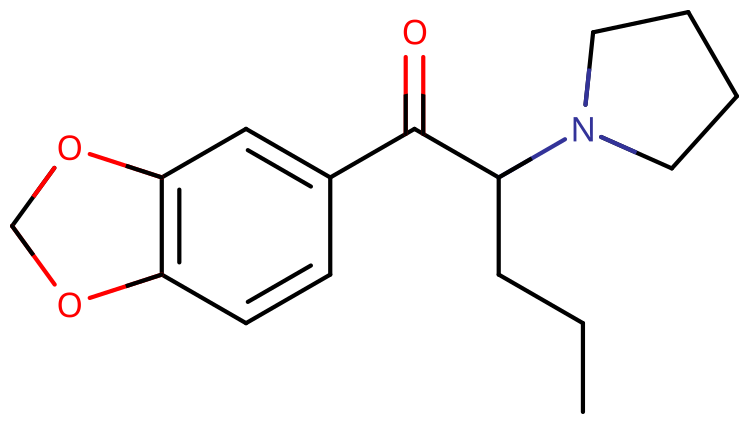

# MDPV

[◀返回](index.md)

!!! warning "MDPV 导致[精神病](../药效/精神病发作.md)、[躁狂](../药效/躁狂.md)和成瘾的概率比其他兴奋剂要高出很多"

    因为它持续时间特别长、效力极强，而且具有强迫性，我们强烈不建议在高剂量下滥用这种物质，也不要连续多天使用，或者和其他已知会增加精神病风险的药物一起混用。MDPV 是几种作为“[浴盐](<https://en.wikipedia.org/wiki/Bath_salts_(drug)>)”在美国和欧洲出售的[策划药](../文档/研究用化学品.md)之一；在 2009 年 9 月到 2013 年 8 月这四年间，欧盟（EU）报告了令人担忧的大量与 MDPV 相关的死亡案例，居然达到了 99 起。[^1]

| 化学信息     | 亚甲基二氧吡咯戊酮（MDPV）                                                                                                                  |
| ------------ | ------------------------------------------------------------------------------------------------------------------------------------------- |
| 结构式       |                                                                                                                        |
| 分子式       | C16H21NO3                                                                                                  |
| CAS 号       | 687603-66-3                                                                                                                                 |
| **化学命名** |                                                                                                                                             |
| 常用名称     | 亚甲基二氧吡咯戊酮（MDPV）、Bath Salts（浴盐）、丧尸浴盐、Monkey Dust（猴尘）[^2]、NRG-1                                                    |
| 取代名称     | 3,4-Methylenedioxypyrovalerone                                                                                                              |
| 系统命名     | 1-(1,3-Benzodioxol-5-yl)-2-(pyrrolidin-1-yl)pentan-1-one                                                                                    |
| **类别归属** |                                                                                                                                             |
| 精神活性分类 | _[兴奋剂](../文档/药物分类/兴奋剂.md) / [共情剂](../文档/药物分类/共情剂.md)_                                                               |
| 化学分类     | _[卡西酮类物质](../文档/药物分类/卡西酮类物质.md) / [亚甲双氧基苯类物质](../文档/药物分类/亚甲双氧基苯类物质.md) / [吡咯戊酮](吡咯戊酮.md)_ |

| [**给药途径**](../文档/给药途径.md) | 🔽 [口服](../文档/给药途径.md) |
| ----------------------------------- | ------------------------------ |
| [**剂量**](../文档/给药剂量.md)     |                                |
| [阈值](../文档/药物剂量分类.md)     | 2 mg                           |
| [轻微](../文档/药物剂量分类.md)     | 4 \~ 8 mg                      |
| [中等](../文档/药物剂量分类.md)     | 8 \~ 14 mg                     |
| [强烈](../文档/药物剂量分类.md)     | 14 \~ 25 mg                    |
| [严重](../文档/药物剂量分类.md)     | 25 mg +                        |
| [**药效时长**](../文档/药效时长.md) |                                |
| [总时长](../文档/药效时长.md)       | 2 \~ 7 小时                    |
| [药效发作](../文档/药效时长.md)     | 15 \~ 30 分钟                  |
| [药效达峰](../文档/药效时长.md)     | 1 \~ 4 小时                    |
| [药效褪去](../文档/药效时长.md)     | 0.5 \~ 2 小时                  |
| [药效残余](../文档/药效时长.md)     | 2 \~ 48 小时                   |

| [相互作用](#Dangerous_interactions) |             |
| ----------------------------------- | ----------- |
| 酒精                                | ⚠️ 谨慎联用 |
| MXE                                 | ⛔ 严禁联用 |
| 解离剂                              | ⚠️ 谨慎联用 |
| 右美沙芬                            | 💔 联用危险 |
| MDMA                                | 💔 联用危险 |
| 兴奋剂                              | 💔 联用危险 |
| 25x-NBOMe                           | ⛔ 严禁联用 |
| 25x-NBOH                            | ⛔ 严禁联用 |
| 曲马多                              | 💔 联用危险 |
| 单胺氧化酶抑制剂                    | ⛔ 严禁联用 |

- !!! warning "警告"

        由于个体体重、耐受性、新陈代谢和个人敏感度的差异，请务必从低剂量开始。参见[负责任的用药部分](../文档/负责任的用药索引页.md)。

    !!! info "[免责声明](../关于本站/免责声明.md)"

        本站的[给药剂量](../文档/给药剂量.md)信息收集自用户和[相关资源](../文档/科学信息索引页.md)，仅供教育目的使用。这不是医疗建议，应与其他来源核实以确保准确性。

**3,4-亚甲双氧基吡咯戊酮** 是一种[卡西酮类物质](../文档/药物分类/卡西酮类物质.md)和[吡咯戊酮](吡咯戊酮.md)类别的新型、鲜为人知的[兴奋剂](../文档/药物分类/兴奋剂.md)物质。它被认为是效力最强、最猛烈的兴奋剂之一。据信 MDPV 主要作为一种[去甲肾上腺素](../文档/去甲肾上腺素.md)-[多巴胺](../文档/多巴胺.md) [再摄取抑制剂](../文档/神经递质再摄取抑制剂.md)（NDRI）发挥作用。

MDPV 最早是在 1960 年代由勃林格殷格翰的一个团队开发的。[^3] 当时声称它有潜力成为外消旋苯丙胺的替代品，尽管与苯丙胺相比确实显示出一些优良特性，例如毒性降低，但最终还是没有被开发成药物。[^4]

直到 2004 年左右，MDPV 之前一直是一种默默无闻的兴奋剂，据报道那是它第一次作为[策划药](../文档/研究用化学品.md)向公众提供。贴有“浴盐”标签且含有 MDPV 的产品以前曾在美国的加油站和便利店作为娱乐性药物出售，就像 [Spice 和 K2](../文档/药物分类/合成大麻素类物质.md) 作为香料出售的营销策略一样。

主观效应包括[兴奋](../药效/兴奋.md)、[去抑制](../药效/去抑制.md)、[性欲增强](../药效/性欲增强.md)、[食欲抑制](../药效/食欲抑制.md)和强烈的[欣快感](../药效/认知欣快.md)。

已经有多起心理和身体伤害事件归因于 MDPV 的使用，包括异常多的死亡案例。九个欧洲国家报告称，在 2009 年 9 月至 2013 年 8 月期间，共有 107 起非致命中毒事件和 99 起经分析确认与 MDPV 相关的死亡事件。[^1]

## 化学

MDPV，即 3,4-亚甲双氧基吡咯戊酮，是一种合成的[卡西酮](../文档/药物分类/卡西酮类物质.md)和[吡咯戊酮](../文档/药物分类/吡咯戊酮类物质.md)类兴奋剂。MDPV 是 1960 年代开发的化合物 [α-PVP](α-PVP.md) 的 3,4-亚甲双氧基环取代类似物，后者曾用于治疗慢性疲劳和作为一种厌食药，但引起了滥用和依赖问题。[^3]

然而，尽管有一些共同的结构特征，MDPV 的效果与其他的亚甲双氧基苯烷基胺衍生物（如 [MDMA](MDMA.md) 几乎没有相似之处，它主要产生经典的兴奋剂效果，只有轻微的共情特质。[^5]

MDPV 在结构上与卡西酮（恰特草中发现的一种活性生物碱）、MDMA、甲基苯丙胺和其他附表 I 的苯乙胺类物质有关。MDPV 和该类别中的其他一些物质一样，是一种中枢神经系统（CNS）兴奋剂。据报道，MDPV 也具有致幻效果。[^6]

## 药理学

据信 MDPV 主要作为一种强效的[去甲肾上腺素](../文档/去甲肾上腺素.md)-[多巴胺](../文档/多巴胺.md) [再摄取抑制剂](../文档/神经递质再摄取抑制剂.md)（NDRIs）发挥作用。去甲肾上腺素和多巴胺的再摄取减少，导致这两种[儿茶酚胺](../文档/神经递质.md) [神经递质](../文档/神经递质.md)在[突触间隙](../文档/神经递质.md)（即[神经元](../文档/神经递质.md)之间的间隙）中的浓度升高。

这种抑制的结果是，多巴胺能和去甲肾上腺素能信号在接收神经元的多巴胺和去甲肾上腺素受体上的浓度升高，突触后效应也随之增强并延长。血清素也起作用，虽然程度要小得多。大脑中神经递质浓度的突然增加被认为是 MDPV 产生快感的原因。

由于主要具有再摄取抑制特性而不是释放特性，MDPV 在作用方式上可能更像[可卡因](可卡因.md)或[哌甲酯](哌甲酯.md)，而不是[苯丙胺](苯丙胺.md)。[^7] 相比之下，苯丙胺主要作为激动剂，通过激活 TAAR1 受体间接释放多巴胺和去甲肾上腺素。

## 主观效应

!!! info "[免责声明](../关于本站/免责声明.md)"

    _下列效应引用自 [**主观效应索引**](../药效/index.md)（**SEI**），这是一个基于轶事用户报告和个人分析的开放研究文献。因此，应带着健康的怀疑态度来看待它们。_

    _同样值得注意的是，这些效应不一定会以可预测或可靠的方式发生，尽管较高的剂量更可能引发全方位的效应。同样，**不良反应** 随着剂量的增加变得越来越可能，可能包括 **成瘾、严重伤害或死亡** ☠。_

- ### **[躯体效应](../药效/躯体效应.md)** 
    - **[兴奋](../药效/兴奋.md)**
    - **[耐力增强](../药效/耐力增强.md)**
    - **[心律异常](../药效/心律异常.md)**
    - **[心率增快](../药效/心率增快.md)**：较高剂量的 MDPV 会导致心率和血压显著且通常危险地升高。
    - **[肌肉收缩](../药效/肌肉紧张.md)**
    - **[肌肉痉挛](../药效/肌肉痉挛.md)**
    - **[食欲抑制](../药效/食欲抑制.md)**
    - **[头痛](../药效/头痛.md)**
    - **[味觉幻觉](../药效/幻觉.md)**
    - **[腹泻](../药效/腹泻.md)**：一些用户报告在 MDPV 药效下经历[腹泻](../药效/腹泻.md)，但这似乎是一个相对少见的效应。
    - **[恶心](../药效/恶心.md)**：一些用户报告在 MDPV 药效下经历[恶心](../药效/恶心.md)，但这似乎是一个相对少见的效应。
    - **[不宁腿综合征](../药效/不宁腿.md)**

- ### **[听觉效应](../药效/听觉效应.md)** 
    - **[听觉扭曲](../药效/听觉效应.md)**
    - **[幻听](../药效/幻听.md)**

- ### **药效残余** 

    兴奋剂体验消退期间发生的效果，与高峰期发生的效果相比，通常感觉消极且不舒服。这通常被称为下头（comedown），是由于神经递质耗尽造成的。其效应通常包括：

    - **[焦虑](../药效/焦虑.md)**
    - **[认知疲劳](../药效/认知疲劳.md)**
    - **[抑郁](../药效/抑郁.md)**
    - **[易怒](../药效/易怒.md)**
    - **[动机抑制](../药效/动机抑制.md)**
    - **[思维减速](../药效/思维减速.md)**
    - **[清醒](../药效/清醒.md)**

    值得注意的是，如果是强迫性地重复用药，许多用户认为 MDPV 的药效残余会明显更加令人不快。[^8] [^9]

- ### **[认知效应](../药效/认知效应.md)** 

    MDPV 的一般认知效应可以描述为与其他典型兴奋剂相似。在中等剂量下，MDPV 的上头感被描述为具有欣快感和轻微的共情作用，导致动机、社交能力、性欲和注意力增加。然而，较高剂量的 MDPV 会加剧许多负面影响，如焦虑和思维混乱；在极高剂量或持续使用下，妄想和精神病变得很可能发生。[^10]

    - **[焦虑](../药效/焦虑.md)**
    - **[认知欣快](../药效/认知欣快.md)**
    - **[强迫性补量](../药效/强迫性补量.md)**：MDPV 在这一效应上极强；研究表明，即使负面影响超过了正面影响，一些用户最终还是会重复用药。[^11] [^12]
    - **[困惑](../药效/混乱.md)**：这种效应在较高剂量和长时间不睡觉后很明显。
    - **[创造力增强](../药效/创造力增强.md)**
    - **[妄想](../药效/妄想.md)**：这种效应也可以在高剂量下表现出来。
    - **[自我膨胀](../药效/自我膨胀.md)**
    - **[共情、爱和社交能力增强](../药效/共情、爱和社交能力增强.md)**：MDPV 在这方面的效果与 MDMA 相似，但较弱。
    - **[专注力增强](../药效/专注力增强.md)**
    - **[性欲增强](../药效/性欲增强.md)**
    - **[动机增强](../药效/动机增强.md)**
    - **[偏执](../药效/偏执.md)**
    - **[耐力增强](../药效/耐力增强.md)**
    - **[精神病](../药效/精神病发作.md)**：据了解，高剂量的 MDPV 比大多数其他兴奋剂更频繁地诱发精神病状态。
    - **[时间扭曲](../药效/时间扭曲.md)**：这可以描述为感觉时间在加速，比平时清醒时过得快得多。
    - **[思维加速](../药效/思维加速.md)**
    - **[思维组织](../药效/思维组织.md)**：主要在轻微到中等剂量下观察到。
    - **[思维混乱](../药效/思维混乱.md)**：这种效应在较高剂量下表现出来并加剧。
    - **[清醒](../药效/清醒.md)**：高剂量下报告有强烈的清醒感，并且在长时间使用后可持续数小时。

### 体验报告

目前我们的[报告索引](../报告/index.md)中没有关于该物质效果的体验报告。你可以在[本站 Github 仓库](https://github.com/SalviaSWC/FreeODwiki)提交你自己的体验报告。

其他的体验报告可以在这里找到：

- [Erowid Experience Vaults: MDPV](https://erowid.org/experiences/subs/exp_MDPV.shtml)

## 毒性和伤害潜力

MDPV 在人类使用方面的历史相对较短，在 2004 年之前很少有人提及使用它。尽管曾经被认为是现有兴奋剂的潜在替代品，且毒性风险较低，但几十年来并未在临床环境中对人类 MDPV 给药进行过广泛研究。尽管如此，最近几项关于长期使用 MDPV 导致持续性精神病的案例研究显示，接受某些[抗精神病药](../文档/抗精神病药.md)和一线[抗组胺药](../文档/药物分类/抗组胺药.md)治疗的个体恢复率很高。[^13] 目前尚无关于 MDPV 对人脑神经毒性的确切数据。

社区中尝试过 MDPV 的人的轶事证据表明，如果只是单独低剂量服用并且偶尔使用，该物质没有相关的负面健康影响（但不能完全保证）。

体外和体内研究的数据表明，MDPV 具有与[甲基苯丙胺](甲基苯丙胺.md)和[可卡因](可卡因.md)相似的特性；事实上，MDPV 在许多方面比这两种兴奋剂更有效力。[^14] MDPV 使用引起的多巴胺和去甲肾上腺素的过度兴奋，加上 MDPV 可能无法产生补偿性的血清素能活动，为该药物引发诸多敌对和精神病反应创造了条件。在应急响应情况中已经目睹了这些敌对倾向，并且过去在一名受 MDPV 影响的个人恶意攻击一名无辜路人后，也在电视上得到了广泛报道。目前尚不确定该人是否有任何预先存在的精神障碍，或者他是否受到任何其他药物的影响。

### 致死剂量

MDPV 的确切致死剂量尚不清楚，也没有在人类中进行过正式研究。作为参考，一份报告根据尸检结果将一名 39 岁男性的致死剂量定为 0.4 微克每毫升或更高，[^15] 但这个数据个体差异过大，变量太多样化，无法从中得出任何有意义的信息。可以通过气相色谱-质谱法或液相色谱-质谱法定量血液、血浆或尿液中的 MDPV，以确认住院患者的中毒诊断或为法医死亡调查提供证据。在娱乐性使用该药物的人群中，血液或血浆 MDPV 浓度预计在 10 \~ 50 μg/L 范围内，在中毒患者中 > 50 μg/L，在急性过量受害者中 > 300 μg/L。[^16]

### 依赖性和滥用潜力

比其他兴奋剂更甚的是，长期使用 MDPV 可以被认为具有高度成瘾性，并且具有很高的滥用潜力，能够导致某些用户产生心理依赖。当成瘾发展时，如果一个人突然停止使用，可能会出现渴望和戒断反应。成瘾是 MDPV 用户面临的严重风险，因为它很容易导致强迫性补量，并导致非常令人不快的下头症状。

### 精神病

主条目：[兴奋剂精神病](../文档/兴奋剂精神病.md)

用户报告表明，与绝大多数兴奋剂相比，长期滥用或单次过量服用 MDPV 可能更容易导致[精神病](../药效/精神病发作.md)。MDPV 的精神病症状可能包括[幻听](../药效/幻听.md)、[视幻觉](../药效/幻觉.md)、伤害自己的冲动、严重的[焦虑](../药效/焦虑.md)、[躁狂](../药效/躁狂.md)、自大、[偏执妄想](../药效/妄想.md)、[困惑](../药效/混乱.md)、攻击性增加和[易怒](../药效/易怒.md)。

### 危险的相互作用

!!! warning "警告"

    _许多精神活性物质在单独使用时相对安全，但与某些其他物质联用可能会突然变得危险甚至危及生命。_

    _请务必进行独立研究（例如 [Google](https://www.google.com)、[DuckDuckGo](https://www.duckduckgo.com)、[PubMed](https://pubmed.ncbi.nlm.nih.gov/)），确保多种物质的组合是安全的。部分列出的相互作用来自 [TripSit](https://combo.tripsit.me)。_

- **[兴奋剂](../文档/药物分类/兴奋剂.md)**：MDPV 与其他[兴奋剂](../文档/药物分类/兴奋剂.md)结合使用可能有危险，因为它会将[心率](../药效/心率增快.md)和[血压](../药效/血压升高.md)提高到危险水平。
- **[25x-NBOMe](../文档/药物分类/2,5-二甲氧基苯乙胺类物质.md) & [25x-NBOH](../文档/药物分类/2,5-二甲氧基苯乙胺类物质.md)**：25x 化合物具有高度刺激性，对身体造成负担。应严格避免与 MDPV 结合使用，因为存在过度[兴奋](../药效/兴奋.md)和心脏负担的风险。这可能导致[血压升高](../药效/血压升高.md)、[血管收缩](../药效/血管收缩.md)、惊恐发作、[思维循环](../药效/思维循环.md)、[癫痫发作](../药效/癫痫发作.md)，在极端情况下会导致心力衰竭。
- **[酒精](酒精.md)**：将酒精与[兴奋剂](../文档/药物分类/兴奋剂.md)结合使用可能很危险，因为存在意外过度中毒的风险。兴奋剂会掩盖酒精的[抑制剂](../文档/药物分类/抑制剂.md)作用，而大多数人是用这种作用来评估自己的醉酒程度的。一旦兴奋剂药效消退，[抑制剂](../文档/药物分类/抑制剂.md)作用将不再受阻，这可能导致断片和严重的[呼吸抑制](../药效/呼吸抑制.md)。如果混合使用，用户应严格限制自己每小时只喝一定量的酒精。
- **[右美沙芬](右美沙芬.md)**：应避免与[右美沙芬](右美沙芬.md)结合使用，因为它对[血清素](../文档/血清素.md)和[去甲肾上腺素](../文档/去甲肾上腺素.md) 再摄取有抑制作用。这会增加[惊恐发作](../药效/惊恐发作.md)和高血压危象的风险，或者如果与血清素释放剂（[MDMA](MDMA.md)、[Methylone](Methylone.md)、[4-MMC](4-MMC.md) 等）结合使用，会有[血清素综合征](../文档/血清素综合征.md)的风险。仔细监测血压，避免剧烈体力活动。
- **[MDMA](MDMA.md)**：当存在其他[兴奋剂](../文档/药物分类/兴奋剂.md) 时，MDMA 的任何神经毒性作用都可能增加。还存在血压过高和心脏负担（心脏毒性）的风险。
- **[MXE](MXE.md)**：一些报告表明，与 MXE 结合使用可能会危险地增加血压，并增加[躁狂](../药效/躁狂.md)和[精神病](../药效/精神病发作.md)的风险。
- **[解离剂](../文档/药物分类/解离剂.md)**：这两类物质都有导致[妄想](../药效/妄想.md)、[躁狂](../药效/躁狂.md)和[精神病](../药效/精神病发作.md) 的风险，结合使用时这些风险可能会成倍增加。
- **[兴奋剂](../文档/药物分类/兴奋剂.md)**：MDPV 与其他[兴奋剂](../文档/药物分类/兴奋剂.md)（如[可卡因](可卡因.md)）结合使用可能有危险，因为它们会将[心率](../药效/心率增快.md)和[血压](../药效/血压升高.md)提高到危险水平。
- **[曲马多](曲马多.md)**：众所周知，曲马多会降低癫痫发作阈值 [^17]，与兴奋剂结合使用可能会进一步增加这种风险。
- **[MDMA](MDMA.md)**：当与[苯丙胺](苯丙胺.md)和其他兴奋剂结合使用时，MDMA 的神经毒性作用可能会增加。
- **[单胺氧化酶抑制剂](../文档/单胺氧化酶抑制剂.md)**：这种组合可能会将多巴胺等神经递质的量增加到危险甚至致命的水平。例子包括[骆驼蓬](骆驼蓬.md)、[_Banisteriopsis caapi_](死藤水.md) 和一些[抗抑郁药](../文档/药物分类/抗抑郁药.md)。[^18]
- **[可卡因](可卡因.md)**：这种组合可能会增加心脏负担。

## 法律地位

2014 年 9 月，欧洲理事会决定，成员国应在 2015 年 10 月 2 日之前对 MDPV 实施控制措施和刑事处罚。[^19]

- **中国大陆**：MDPV 属于《非药用类麻醉药品和精神药品目录》中的管制物质[^32]，任何制造、贩卖、运输、吸食行为均属‌违法犯罪‌。
- **澳大利亚**: 在西澳大利亚州，MDPV 根据 1964 年毒药法案已被禁止，截至 2012 年 2 月 11 日，它已被列入 1964 年毒药法案附录 A 附表 9 中。西澳大利亚州检察长宣布，任何打算出售或供应 MDPV 的人都将面临最高 100,000 美元的罚款或 25 年监禁。用户面临 2000 美元的罚款或两年监禁。因此，任何被发现持有 MDPV 的人都可能被指控持有、出售、供应或意图出售或供应。[^20]
- **奥地利**: 自 2019 年 6 月 26 日起，根据 SMG（Suchtmittelgesetz Österreich），持有、生产和销售 MDPV 均属违法。[^21]
- **比利时**: 截至 2013 年 3 月 20 日，MDPV 是受管制物质。[^1]
- **巴西**: 生产、销售或持有 MDPV 均属违法，因为它被列入 Portaria SVS/MS nº 344。[^22]
- **保加利亚**: 截至 2011 年 2 月，MDPV 受麻醉物质管制法管制。[^1]
- **加拿大**: 2012 年 6 月 5 日，加拿大卫生部长 Leona Aglukkaq 宣布 MDPV 将被列入管制药物和物质法案附表 I，该法案于 2012 年 9 月 26 日通过成为法律。[^23]
- **克罗地亚**: MDPV 是受管制物质。[^1]
- **塞浦路斯**: MDPV 是 B 类受管制物质，因为它包含在卡西酮类物质兜底条款中。[^1]
- **捷克共和国**: MDPV 是受管制物质。[^1]
- **丹麦**: MDPV 是受管制物质。[^1]
- **爱沙尼亚**: 截至 2010 年 11 月 29 日，MDPV 是受管制物质。[^1]
- **芬兰**: MDPV 在芬兰被明确列为受管制物质（截至 2010 年 6 月 28 日被列为附录 IV 物质）。[^24]
- **法国**: 截至 2012 年 8 月 2 日，MDPV 是受管制物质。[^1]
- **德国**: 截至 2012 年 7 月 26 日，MDPV 受 Anlage II BtMG（_麻醉品法，附表 II_）[^25] 管制。[^26] 未经许可制造、持有、进口、出口、购买、销售、采购或分发它是违法的。[^27]
- **匈牙利**: MDPV 是附表 A 受管制精神药物。[^1]
- **爱尔兰**: 自 2010 年 5 月 11 日起，MDPV 受滥用药物法案涵盖。[^1]
- **意大利**: 截至 2011 年 12 月 29 日，MDPV 是受管制物质。[^1]
- **拉脱维亚**: MDPV 是受管制物质。[^1]
- **卢森堡**: 截至 2012 年 7 月 30 日，MDPV 是受管制物质。[^1]
- **挪威**: 截至 2013 年 2 月 14 日，MDPV 是受管制物质。[^1]
- **波兰**: MDPV 是受管制物质。[^1]
- **斯洛伐克**: 截至 2011 年 3 月 1 日，MDPV 是附表 I 受管制精神药物。[^1]
- **斯洛文尼亚**: MDPV 是受管制物质。[^1]
- **瑞典**: MDPV 是受管制物质。[^1] 在瑞典，一名 33 岁的男子因持有在刑事定罪前获得的 250 克 MDPV，被上诉法院 Hovrätt 判处六年监禁。[^28]
- **瑞士**: MDPV 是受管制的物质，在 Verzeichnis D 中被明确命名。[^29]
- **土耳其**: MDPV 是受管制物质。[^1]
- **英国**: 由于卡西酮类物质兜底条款，MDPV 在英国是 B 类药物。[^30]
- **美国**: 2011 年 10 月 21 日，MDPV 成为 DEA 联邦附表药物。DEA 发布了为期一年的 MDPV 临时禁令，将其归类为附表 I 物质。2011 年 12 月 8 日，根据合成药物管制法案，美国众议院投票禁止 MDPV 和各种其他以前在商店合法销售的合成药物。[^31]

## 另见

- [负责任的用药](../文档/负责任的用药索引页.md)
- [研究用化学品](../文档/研究用化学品.md)
- [兴奋剂](../文档/药物分类/兴奋剂.md)
- [卡西酮类物质](../文档/药物分类/卡西酮类物质.md)
- [吡咯戊酮](../文档/药物分类/吡咯戊酮类物质.md)
- [α-PVP](α-PVP.md)
- [普罗林坦（Prolintane）](Prolintane.md)

## 外部链接

- [MDPV (Wikipedia)](https://en.wikipedia.org/wiki/Methylenedioxypyrovalerone)
- [MDPV (PsychonautWiki)](https://psychonautwiki.org/wiki/MDPV)
- [MDPV (Erowid Vault)](https://erowid.org/chemicals/mdpv/mdpv.shtml)
- [MDPV (Isomer Design)](https://isomerdesign.com/PiHKAL/explore.php?id=2143)
- [MDPV (Drugs-Forum)](https://drugs-forum.com/wiki/MDPV)

### 讨论

- [MDPV Megathread (Bluelight)](http://www.bluelight.org/vb/threads/278421-MDPV-Megathread)

## 参考文献

[^1]: ["MDPV: EMCDDA–Europol Joint Report on a new psychoactive substance: MDPV (3,4-methylenedioxypyrovalerone)"](http://www.emcdda.europa.eu/system/files/publications/819/TDAS14001ENN_466653.pdf) (PDF). European Monitoring Centre for Drugs and Drug Addiction. Retrieved December 27, 2019.

[^2]: ["Monkey dust "epidemic" causing drug users to experience violent hallucinations"](https://www.newsweek.com/what-monkey-dust-bath-salt-mpvd-drug-causing-epidemic-violent-hallucinations-1068295). _Newsweek_ (in English). 10 August 2018. Retrieved 17 August 2018.

[^3]: Koppe, H., Ludwig, G., Zeile, K. (1969). [_1-(3',4'-methylenedioxy-phenyl)-2-pyrrolidino-alkanones-(1)_](https://patents.google.com/patent/US3478050/en). US Patent US3478050A.

[^4]: World Health Organization (2014). "MDPV (3,4-methylenedioxypyrovalerone) Review Report". _Expert Committee on Drug Dependence, 36th Meeting_. <http://www.who.int/medicines/areas/quality_safety/4_13_Review.pdf?ua=1>

[^5]: [_MDPV - TripSit wiki_](https://wiki.tripsit.me/wiki/MDPV)

[^6]: Drug Enforcement Administration (2013). "MDPV (3,4-Methylenedioxypyrovalerone)". _Office of Diversion Control_. <https://www.deadiversion.usdoj.gov/drug_chem_info/mdpv.pdf>

[^7]: World Health Organization (2014). "MDPV (3,4-methylenedioxypyrovalerone) Review Report". _Expert Committee on Drug Dependence, 36th Meeting_. <http://www.who.int/medicines/areas/quality_safety/4_13_Review.pdf?ua=1>

[^8]: [_MDPV - Erowid Exp - "Personal Research Comedown Guide"_](https://erowid.org/experiences/exp.php?ID=98601)

[^9]: [_MDPV - Erowid Exp - "Seemingly Real Paranoid Hallucination Hell"_](https://erowid.org/experiences/exp.php?ID=91741)

[^10]: [_MDPV - Erowid Exp - "Psychosis"_](https://www.erowid.org/experiences/exp.php?ID=78382)

[^11]: Watterson LR, Kufahl PR, Nemirovsky NE, Sewalia K, Grabenauer M, Thomas BF, et al. (March 2014). ["Potent rewarding and reinforcing effects of the synthetic cathinone 3,4-methylenedioxypyrovalerone (MDPV)"](//www.ncbi.nlm.nih.gov/pmc/articles/PMC3473160). _Addiction Biology_. **19** (2): 165–74. [doi](http://en.wikipedia.org/wiki/Digital_object_identifier 'wikipedia:Digital object identifier'):[10.1111/j.1369-1600.2012.00474.x](//doi.org/10.1111%2Fj.1369-1600.2012.00474.x). [PMC](http://en.wikipedia.org/wiki/PubMed_Central 'wikipedia:PubMed Central') [3473160](//www.ncbi.nlm.nih.gov/pmc/articles/PMC3473160). [PMID](http://en.wikipedia.org/wiki/PubMed_Identifier 'wikipedia:PubMed Identifier') [22784198](//www.ncbi.nlm.nih.gov/pubmed/22784198).

[^12]: Coppola M, Mondola R (January 2012). "3,4-methylenedioxypyrovalerone (MDPV): chemistry, pharmacology and toxicology of a new designer drug of abuse marketed online". _Toxicology Letters_. **208** (1): 12–5. [doi](http://en.wikipedia.org/wiki/Digital_object_identifier 'wikipedia:Digital object identifier'):[10.1016/j.toxlet.2011.10.002](//doi.org/10.1016%2Fj.toxlet.2011.10.002). [PMID](http://en.wikipedia.org/wiki/PubMed_Identifier 'wikipedia:PubMed Identifier') [22008731](//www.ncbi.nlm.nih.gov/pubmed/22008731).

[^13]: World Health Organization (2014). "Studies concerning MDPV hospitalization" (pp. 19–25). _Expert Committee on Drug Dependence, 36th Meeting_. <http://www.who.int/medicines/areas/quality_safety/4_13_Review.pdf?ua=1>

[^14]: World Health Organization (2014). "MDPV In-vivo statistics". _Expert Committee on Drug Dependence, 36th Meeting_. <http://www.who.int/medicines/areas/quality_safety/4_13_Review.pdf?ua=1>

[^15]: Wyman, J. F., Lavins, E. S., Engelhart, D., Armstrong, E. J., Snell, K. D., Boggs, P. D., Taylor, S. M., Norris, R. N., Miller, F. P. (1 April 2013). ["Postmortem Tissue Distribution of MDPV Following Lethal Intoxication by "Bath Salts""](https://academic.oup.com/jat/article-lookup/doi/10.1093/jat/bkt001). _Journal of Analytical Toxicology_. **37** (3): 182–185. [doi](http://en.wikipedia.org/wiki/Digital_object_identifier 'wikipedia:Digital object identifier'):[10.1093/jat/bkt001](//doi.org/10.1093%2Fjat%2Fbkt001). [ISSN](http://en.wikipedia.org/wiki/International_Standard_Serial_Number 'wikipedia:International Standard Serial Number') [0146-4760](//www.worldcat.org/issn/0146-4760).

[^16]: Baselt, R. C. (2014). _Disposition of toxic drugs and chemicals in man_ (Tenth edition). Biomedical Publications. [ISBN](http://en.wikipedia.org/wiki/International_Standard_Book_Number 'wikipedia:International Standard Book Number') [9780962652394](http://en.wikipedia.org/wiki/Special:BookSources/9780962652394 'wikipedia:Special:BookSources/9780962652394').

[^17]: Talaie, H.; Panahandeh, R.; Fayaznouri, M. R.; Asadi, Z.; Abdollahi, M. (2009). "Dose-independent occurrence of seizure with tramadol". _Journal of Medical Toxicology_. **5** (2): 63–67. [doi](http://en.wikipedia.org/wiki/Digital_object_identifier 'wikipedia:Digital object identifier'):[10.1007/BF03161089](//doi.org/10.1007%2FBF03161089). [eISSN](http://en.wikipedia.org/wiki/International_Standard_Serial_Number#Electronic_ISSN 'wikipedia:International Standard Serial Number') [1937-6995](//www.worldcat.org/issn/1937-6995). [ISSN](http://en.wikipedia.org/wiki/International_Standard_Serial_Number 'wikipedia:International Standard Serial Number') [1556-9039](//www.worldcat.org/issn/1556-9039). [OCLC](http://en.wikipedia.org/wiki/OCLC 'wikipedia:OCLC') [163567183](//www.worldcat.org/oclc/163567183).

[^18]: Gillman, P. K. (2005). ["Monoamine oxidase inhibitors, opioid analgesics and serotonin toxicity"](<https://bjanaesthesia.org/article/S0007-0912(17)34956-5/fulltext>). _British Journal of Anaesthesia_. **95** (4): 434–441. [doi](http://en.wikipedia.org/wiki/Digital_object_identifier 'wikipedia:Digital object identifier'):[10.1093/bja/aei210](//doi.org/10.1093%2Fbja%2Faei210). [eISSN](http://en.wikipedia.org/wiki/International_Standard_Serial_Number#Electronic_ISSN 'wikipedia:International Standard Serial Number') [1471-6771](//www.worldcat.org/issn/1471-6771). [ISSN](http://en.wikipedia.org/wiki/International_Standard_Serial_Number 'wikipedia:International Standard Serial Number') [0007-0912](//www.worldcat.org/issn/0007-0912). [OCLC](http://en.wikipedia.org/wiki/OCLC 'wikipedia:OCLC') [01537271](//www.worldcat.org/oclc/01537271). [PMID](http://en.wikipedia.org/wiki/PubMed_Identifier 'wikipedia:PubMed Identifier') [16051647](//www.ncbi.nlm.nih.gov/pubmed/16051647).

[^19]: ["Council Implementing Decision on subjecting 25I-NBOMe, AH-7921, MDPV and methoxetamine to control measures"](https://op.europa.eu/o/opportal-service/download-handler?identifier=025bb164-4937-11e4-a0cb-01aa75ed71a1&format=pdfa1a&language=en&productionSystem=cellar&part=). _Official Journal of the European Union_. Office for Official Publications of the European Communites (published October 1, 2014). September 25, 2014. pp. 22–26. [OCLC](http://en.wikipedia.org/wiki/OCLC 'wikipedia:OCLC') [52224955](//www.worldcat.org/oclc/52224955). L 287.

[^20]: Office of the Premier of Western Australia (February 9, 2012). [_Media Statements - Emerging drug, MDPV banned in WA_](https://www.mediastatements.wa.gov.au/Pages/Barnett/2012/02/Emerging-drug,-MDPV-banned-in-WA.aspx). Retrieved August 17, 2018.

[^21]: Bundesgesetzblatt für die Republik Österreich (June 26, 2019). Suchtmittelgesetz (SMG) Änderung. <https://www.ris.bka.gv.at/Dokumente/BgblAuth/BGBLA_2019_II_167/BGBLA_2019_II_167.pdfsig>

[^22]: <http://portal.anvisa.gov.br/documents/10181/3115436/%281%29RDC_130_2016_.pdf/fc7ea407-3ff5-4fc1-bcfe-2f37504d28b7>

[^23]: News, C. B. C., [_"Bath salts" drug ingredient banned in Canada_](https://www.cbc.ca/news/politics/bath-salts-drug-ingredient-banned-in-canada-1.1174926), CBC News

[^24]: Finlex: huumausaineina pidettävistä aineista, valmisteista ja kasveista annetun valtioneuvoston asetuksen liitteen IV muuttamisesta | <http://www.finlex.fi/fi/laki/alkup/2010/20100596>

[^25]: ["Anlage II BtMG"](https://www.gesetze-im-internet.de/btmg_1981/anlage_ii.html) (in German). Bundesministerium der Justiz und für Verbraucherschutz. Retrieved December 19, 2019.

[^26]: ["Sechsundzwanzigste Verordnung zur Änderung betäubungsmittelrechtlicher Vorschriften"](http://www.bgbl.de/xaver/bgbl/start.xav?startbk=Bundesanzeiger_BGBl&jumpTo=bgbl112s1639.pdf) (PDF) (in German). Bundesanzeiger Verlag. Retrieved December 19, 2019.

[^27]: ["§ 29 BtMG"](https://www.gesetze-im-internet.de/btmg_1981/__29.html) (in German). Bundesministerium der Justiz und für Verbraucherschutz. Retrieved December 19, 2019.

[^28]: Hovrätten skärper straff i MDPV-dom | <http://www.nt.se/nyheter/?articleid=6057819>

[^29]: ["Verordnung des EDI über die Verzeichnisse der Betäubungsmittel, psychotropen Stoffe, Vorläuferstoffe und Hilfschemikalien"](https://www.admin.ch/opc/de/classified-compilation/20101220/index.html) (in German). Bundeskanzlei [Federal Chancellery of Switzerland]. Retrieved January 1, 2020.

[^30]: [_The Misuse of Drugs Act 1971 (Amendment) Order 2010_](https://www.legislation.gov.uk/uksi/2010/1207/made)

[^31]: News, A. B. C., [_House Votes to Ban "Spice," "Bath Salts"_](https://abcnews.go.com/Blotter/house-votes-ban-fake-marijuana-fake-cocaine/story?id=15116235)

[^32]: [三部门联合发布最新版《非药用类麻醉药品和精神药品目录》](https://www.mps.gov.cn/n6557558/c10150600/content.html)．中华人民共和国公安部．2025-07-28
