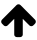
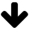
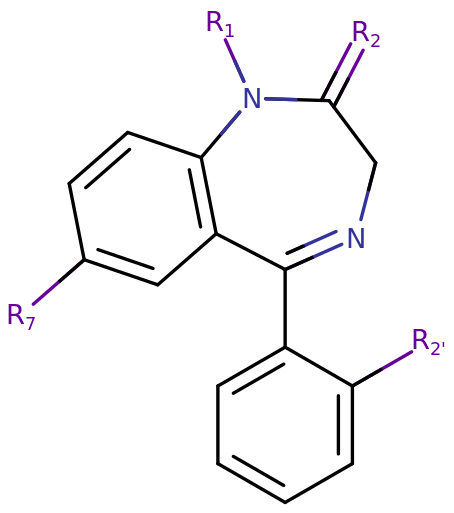
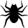
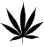
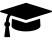
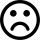

# 药物索引

[◀返回主页](../index.md)

注：本页面是一个药物的快速索引，为了方便理解，有所取舍。寻找详细的索引，请看[药物分类](../文档/药物分类/index.md)或者[药物全索引](../文档/药物分类/药物全索引.md)

**注意，我们真心希望您能够安全 od**

## [兴奋剂](../文档/药物分类/兴奋剂.md) 

|     | 药物                                                                                                                                                                                                                          |
| --- | ----------------------------------------------------------------------------------------------------------------------------------------------------------------------------------------------------------------------------- |
| ◆   | [_麻黄碱_](麻黄碱.md)🌱、[伪麻黄碱](伪麻黄碱.md)🍃、[安非他酮](安非他酮.md)💊 、<ruby>[咖啡因](咖啡因.md)<rt>国内被滥用最多的瘾品</ruby>☕、<ruby>[尼古丁](尼古丁.md)🚬<rt>成瘾性最强的合法瘾品</rt></ruby>                   |
| ◆◆  | <ruby>[哌甲酯](哌甲酯.md)<rt>专注达/利他林</ruby>🎯、<ruby>[苯丙胺](苯丙胺.md)<rt>思必得/阿德拉</ruby>⚡、<ruby>[利右苯丙胺](利右苯丙胺.md)<rt>即将上市</rt></ruby>、<ruby>[莫达非尼](莫达非尼.md)<rt>夜鹰</ruby>🦅           |
| ◆◆◆ | <mark>[司来吉兰+苯乙胺](司来吉兰+苯乙胺.md)</mark>🔬、<ruby>[甲基苯丙胺](甲基苯丙胺.md)<rt>卧槽、冰！</ruby>🧊、<ruby>[MDMA](MDMA.md)<rt>摇头丸</ruby>🕺、[可卡因](可卡因.md)🥶 、<ruby>[MDPV](MDPV.md)<rt>浴盐</rt></ruby>🧂 |

## [抑制剂](../文档/药物分类/抑制剂.md) 

#### [苯二氮䓬类（或类似物）](../文档/药物分类/苯二氮䓬类物质.md)  抑制剂

|     | 药物                                                                                                                                                                                                                                                                                                              |
| --- | ----------------------------------------------------------------------------------------------------------------------------------------------------------------------------------------------------------------------------------------------------------------------------------------------------------------- |
| ◆   | 硝西泮😴                                                                                                                                                                                                                                                                                                          |
| ◆◆  | <mark>[_氯硝西泮_](氯硝西泮.md)</mark>❄️、<ruby>[阿普唑仑](阿普唑仑.md)<rt>Xanax</ruby>🛏️、[咪达唑仑](咪达唑仑.md)、<ruby><mark>[_唑吡坦_](唑吡坦.md)</mark><rt>思诺思 糖糖o的安神片</ruby>🌜、奥沙西泮、[地西泮](地西泮.md)💤、[劳拉西泮](劳拉西泮.md)、[扎来普隆](扎来普隆.md)🌙、[(右)佐匹克隆](佐匹克隆.md)🪄 |
| ◆◆◆ | <ruby>[依替唑仑](依替唑仑.md)<rt>糖糖od的处方药</ruby>🍭、<ruby>[氟硝西泮](氟硝西泮.md)<rt>蓝精灵</ruby>🔷、[三唑仑](三唑仑.md)🌀                                                                                                                                                                                 |

#### [阿片类](../文档/药物分类/阿片类药物.md)抑制剂

|     | 药物                                                                                                                                                                                                                                         |
| --- | -------------------------------------------------------------------------------------------------------------------------------------------------------------------------------------------------------------------------------------------- |
| ◆   | <ruby><mark>[二氢可待因](./二氢可待因.md)</mark><rt>白兔bron 糖糖od的非处方药</ruby>🐇、含阿片粉的[复方甘草片](复方甘草片.md)🌺、[洛哌丁胺](洛哌丁胺.md)👅、[噻奈普汀](噻奈普汀.md)                                                          |
| ◆◆  | <ruby>[_羟考酮_](羟考酮.md)<rt>奥施康定</ruby>💊、[吗啡](吗啡.md)💉、<ruby>[美沙酮](美沙酮.md)<rt>戒毒饮料成分</ruby>🧪、<ruby>[芬太尼](芬太尼.md)<rt>美国的最爱</ruby>🩹、[曲马多](曲马多.md)🏥、<ruby>[可待因](可待因.md)<rt>紫水</ruby>🍇 |
| ◆◆◆ | [海洛因](海洛因.md)🕳️                                                                                                                                                                                                                        |

#### 其他抑制剂

|     | 药物                                                                                           |
| --- | ---------------------------------------------------------------------------------------------- |
| ◆   | [酒精](酒精.md)🍺、<mark>[_普瑞巴林_](普瑞巴林.md)</mark>🧩、[_苯巴比妥_](苯巴比妥.md)🟫       |
| ◆◆  | [戊巴比妥](戊巴比妥.md)🟪                                                                      |
| ◆◆◆ | <ruby>[GHB](GHB.md)<rt>乖乖水、神仙水</ruby>💧、[GBL](GBL.md)🫙、[1,4-丁二醇](1,4-丁二醇.md)🍾 |

## [致幻剂](../文档/药物分类/致幻剂.md)

### [迷幻剂](../文档/药物分类/迷幻剂.md) 

|     | 药物                                                                                                                                                                                                                                   |
| --- | -------------------------------------------------------------------------------------------------------------------------------------------------------------------------------------------------------------------------------------- |
| ◆   | [依非韦仑](依非韦仑.md)🌈, 含[LSA](lsa.md)的植物                                                                                     |
| ◆◆◆ | <ruby>[_死藤水_](死藤水.md)<rt>剧烈变形</ruby>🌿、[迷幻蘑菇](赛洛西宾蘑菇.md)🍄、含[麦斯卡林](麦斯卡林.md)🌵仙人掌、<ruby>[_LSD_](LSD.md)<rt>魔法邮票</ruby>🌀、[DMT](DMT.md)🌌、<ruby>[5-MeO-DiPT](5-MeO-DiPT.md)<rt>0号胶囊</ruby>💊 |

### [解离剂](../文档/药物分类/解离剂.md) 

|     | 药物                                                                                                                                                                     |
| --- | ------------------------------------------------------------------------------------------------------------------------------------------------------------------------ |
| ◆   | <ruby>[氧化亚氮](氧化亚氮.md)<rt>笑气</ruby>🎈、<mark>[_右美沙芬_](右美沙芬.md)</mark>🤯、<mark>[_美金刚_](美金刚.md)</mark>🧠、<mark>[_金刚烷胺_](金刚烷胺.md)🔷</mark> |
| ◆◆  | <ruby>[氯胺酮](氯胺酮.md)<rt>K粉</ruby>🐴                                                                                                                                |
| ◆◆◆ | <ruby>[_3-MeO-PCE_](3-MeO-PCE.md)<rt>月尘</ruby>🧊、<ruby>[PCP](PCP.md)<rt>天使尘</ruby>🦄、替来他明                                                                     |

### [谵妄剂](../文档/药物分类/谵妄剂.md) 

|     | 药物                                                                                                                                                                         |
| --- | ---------------------------------------------------------------------------------------------------------------------------------------------------------------------------- |
| ◆   | <mark>[_金刚烷胺_](金刚烷胺.md)🔷</mark>、<mark>[_苯海拉明_](苯海拉明.md)</mark>🌸、[茶苯海明](茶苯海明.md)🍵、<mark>[苯海索](苯海索.md)🟩</mark>、[肉豆蔻](肉豆蔻醚.md)🥥、 |

### [大麻类](../文档/药物分类/大麻类.md) 

|     | 药物                                                                                             |
| --- | ------------------------------------------------------------------------------------------------ |
| ◆◆◆ | <ruby>[大麻](大麻.md)<rt>魔法香烟</ruby>🍁、[合成大麻素](../文档/药物分类/合成大麻素类物质.md)🧪 |

### 其他致幻剂

|     | 药物                            |
| --- | ------------------------------- |
| ◆◆  | [唑吡坦](./唑吡坦.md)🌙         |
| ◆◆◆ | [墨西哥鼠尾草](鼠尾草素甲.md)🌿 |

## [益智药](../文档/药物分类/益智药.md) 

|     | 药物                                                                                                                                                                                                                                 |
| --- | ------------------------------------------------------------------------------------------------------------------------------------------------------------------------------------------------------------------------------------ |
| ◆   | [吡拉西坦](吡拉西坦.md)🧠、[Alpha-GPC](Alpha-GPC.md)🟡、[酒石酸氢胆碱](酒石酸氢胆碱.md)🟠、[茶氨酸](茶氨酸.md)🍵、[褪黑素](褪黑素.md)🌙、[苯基吡拉西坦](苯基吡拉西坦.md)📚、[N-乙酰半胱氨酸](N-乙酰半胱氨酸.md)🥩、[镁剂](镁剂.md)🔋 |

## [反制剂](../文档/负责任的用药索引页.md) 

|     | 药物                                                                                              |
| --- | ------------------------------------------------------------------------------------------------- |
| ◆   | <ruby>[氟马西尼](氟马西尼.md)<rt>反制benzo</ruby>、<ruby>[纳洛酮](纳洛酮.md)<rt>反制阿片类</ruby> |
| ◆◆◆   | <ruby>[SR-17018](./SR-17018.md)<rt>反制[阿片](../文档/药物分类/阿片类药物.md)耐药与成瘾</ruby> |

## 其他药物

|          | 药物                                                                       |
| -------- | -------------------------------------------------------------------------- |
| ◆/◆◆/◆◆◆ | [吸入剂](吸入剂.md)💨、<ruby>[亚硝酸酯](亚硝酸酯.md)🫙<rt>Rush</rt></ruby> |

---

|           图例           | 说明                                                          |
| :----------------------: | ------------------------------------------------------------- |
|            ◆             | 随便就能合法合规买到                                          |
|            ◆◆            | 可以合法合规买到                                              |
|           ◆◆◆            | 无法合法合规买到                                              |
|    <mark>高亮</mark>     | 常见[od](../文档/od.md)药物                                   |
|          _斜体_          | 在[od](../文档/od.md)圈曾导致过至少一场著名的悲剧的药物...... |
| <ruby>xxx<rt>上标</ruby> | 解释或吐槽，无视即可                                          |

（医学伦理学何在？）

<!-- 简要地说一下就行，别讲太深  -->

## 另见

- [药物分类](../文档/药物分类/index.md)
- [药物全索引](../文档/药物分类/药物全索引.md)
- [药效索引](../药效/index.md)
