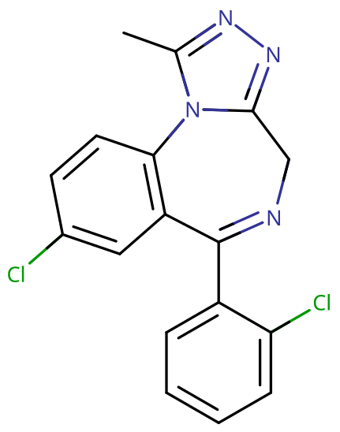

# 三唑仑

[◀返回](index.md)

!!! danger "联用危险"

    **当[苯二氮䓬类物质](../文档/药物分类/苯二氮䓬类物质.md)联用其他[抑制剂](../文档/药物分类/抑制剂.md)（如[阿片类药物](../文档/药物分类/阿片类药物.md)、[巴比妥类物质](../文档/药物分类/巴比妥类物质.md)、[加巴喷丁类物质](../文档/药物分类/加巴喷丁类物质.md)、[噻吩二氮䓬类物质](../文档/药物分类/噻吩二氮䓬类物质.md)、[酒精](酒精.md)或其他 [GABA](../文档/GABA.md) 能物质）时，可能导致致命的[药物过量](../文档/药物过量.md)。**[^1]

    强烈建议不要联用这些物质，尤其是在[中等](../文档/药物剂量分类.md#中等)到[严重](../文档/药物剂量分类.md#严重)剂量下。

| **化学信息**   | 三唑仑（Triazolam）                                                               |
| -------------- | --------------------------------------------------------------------------------- |
| 结构式         |                                                         |
| 分子式         | C17H12Cl2N4                           |
| CAS 号         | 28911-01-5                                                                        |
| **化学命名**   |                                                                                   |
| 常见名称       | 三唑仑（Triazolam）、海乐神、酣乐欣、Halcion, Triazolam                           |
| 取代名称       | Triazolam                                                                         |
| 系统命名法名称 | 8-Chloro-6-(2-chlorophenyl)-1-methyl-4H-[1,2,4]triazolo[4,3-a][1,4]benzodiazepine |
| **类别归属**   |                                                                                   |
| 精神活性分类   | _[抑制剂](../文档/药物分类/抑制剂.md)_                                            |
| 化学分类       | _[苯二氮䓬类物质](../文档/药物分类/苯二氮䓬类物质.md)_                            |

| [**给药途径**](../文档/给药途径.md)      | 🔽 [口服](../文档/给药途径.md#口服) |
| ---------------------------------------- | ----------------------------------- |
| [**剂量**](../文档/给药剂量.md)          |                                     |
| [阈值](../文档/药物剂量分类.md#阈值)     | 0.125 mg                            |
| [轻微](../文档/药物剂量分类.md#轻微)     | 0.125 \~ 0.25 mg                    |
| [中等](../文档/药物剂量分类.md#中等)     | 0.25 \~ 0.5 mg                      |
| [强烈](../文档/药物剂量分类.md#强烈)     | 0.5 \~ 0.75 mg                      |
| [严重](../文档/药物剂量分类.md#严重)     | 0.75 mg +                           |
| [**药效时长**](../文档/药效时长.md)      |                                     |
| [总时长](../文档/药效时长.md#总时长)     | 3 \~ 6 小时                         |
| [药效发作](../文档/药效时长.md#药效发作) | 20 \~ 30 分钟                       |
| [药效达峰](../文档/药效时长.md#药效达峰) | 1 \~ 2 小时                         |
| [药效褪去](../文档/药效时长.md#药效褪去) | 1 \~ 3 小时                         |
| [药效残余](../文档/药效时长.md#药效残余) | 1 \~ 12 小时                        |

- !!! warning "警告"

        由于个体体重、耐受性、新陈代谢和个人敏感度的差异，请务必从低剂量开始。参见[负责任的用药部分](../文档/负责任的用药索引页.md)。

    !!! info "[免责声明](../关于本站/免责声明.md)"

        本站的[给药剂量](../文档/给药剂量.md)信息收集自用户和[相关资源](../文档/科学信息索引页.md)，仅供教育目的使用。这不是医疗建议，应与其他来源核实以确保准确性。

**三唑仑** 是一种[苯二氮䓬类](../文档/药物分类/苯二氮䓬类物质.md)超短效[抑制剂](../文档/药物分类/抑制剂.md)，通常仅用作镇静剂治疗严重失眠，具有[抗焦虑](../药效/焦虑抑制.md)、[抗惊厥](../药效/癫痫发作抑制.md)、[镇静](../药效/镇静.md)和[健忘](../药效/失忆.md)的效果。[^2]

口服 0.5 mg 的三唑仑大致相当于 10 mg 的[地西泮](地西泮.md)。[^3]

长期使用者应注意[突然停用苯二氮䓬类药物](./文档/药物分类/苯二氮䓬类物质.md#停止使用与戒断)可能是危险的，甚至会危及生命，有时会导致癫痫发作或死亡。[^4] 我们强烈建议通过在较长一段时间内逐渐减少每天的服用量来减少剂量，而不是突然停止。[^5]

## 历史与文化

三唑仑最初于 1970 年获得专利，并于 1982 年在美国上市销售。[^6] 美国食品药品监督管理局（FDA）和其他几个国家认为低剂量使用是可以接受的。[^7]

三唑仑的非医疗用途：指为了获得快感而服用药物，或违背医疗建议长期持续给药的娱乐性使用。[^8] 该药物在英语国家以 Apo-Triazo、Halcion、Hypam 和 Trilam 等品牌销售。其他（策划药）名称包括 2'-chloroxanax、chloroxanax、triclazolam 和 chlorotriazolam。

## 化学

三唑仑是一种苯二氮䓬类药物。苯二氮䓬类药物包含一个苯环与一个二氮䓬环稠合，二氮䓬环是一个七元环，两个氮取代基位于 R1 和 R4 位置。分子量为 343.2 g/mol。

## 药理学

和其他苯二氮䓬类药物一样，三唑仑结合于 GABAA 受体上的苯二氮䓬靶点，作为 [GABA](../文档/GABA.md)A [受体](../文档/受体.md)的正变构调节剂（PAM），促进 GABA（大脑中主要的抑制性[神经递质](../文档/神经递质.md)）结合 GABAA 受体，[^9] 提高 Cl⁻ 通道开放频率，从而增强抑制性神经传递，产生[镇静](../药效/镇静.md)和[抗焦虑](../药效/焦虑抑制.md)的效果。

苯二氮䓬类药物的[抗惊厥](../药效/癫痫发作抑制.md)特性可能部分或全部归因于与电压依赖性 Na+ 通道的结合，而不是 GABAA 受体上的苯二氮䓬靶点。[^10]

三唑仑是一种具有催眠特性的三唑苯二氮䓬类药物，提倡用于急性和慢性失眠、住院患者的情境性失眠以及与其他疾病状态相关的失眠。由于三唑仑在健康受试者中的半衰期相对较短，约为 2 \~ 3 小时，并且只有一种短效活性代谢物——α-羟基三唑仑，因此它似乎比长效药物如氟西泮（Flurazepam）、硝西泮（Nitrazepam）或[氟硝西泮](氟硝西泮.md)（Flunitrazepam）更适合作为催眠药，特别是当不希望在服药后第二天产生残留镇静作用时。[^11]

舌下给药后，三唑仑的生物利用度比口服同剂量平均增加 28%，这可能是因为绕过了首过效应。舌下给药同样可能会增强三唑仑的临床效果。[^12] 与大多数其他苯二氮䓬类药物不同，三唑仑的鼻腔生物利用度（98%）远高于其口服生物利用度（44%）。[^13]

三唑仑是一种短效苯二氮䓬类药物，具有亲脂性，通过氧化途径在肝脏代谢。[^14]

## 主观效应

三唑仑的总体精神状态被描述为强烈的镇静、放松、焦虑抑制和抑制力下降，类似于高剂量[地西泮](地西泮.md)的精神状态。

!!! info "[免责声明](../关于本站/免责声明.md)"

    _下列效应引用自 [**主观效应索引**](../药效/index.md)（**SEI**），这是一个基于轶事用户报告和个人分析的开放研究文献。因此，应带着健康的怀疑态度来看待它们。_

    _同样值得注意的是，这些效应不一定会以可预测或可靠的方式发生，尽管较高的剂量更可能引发全方位的效应。同样，**不良反应** 随着剂量的增加变得越来越可能，可能包括 **成瘾、严重伤害或死亡** ☠。_

- ### **身体效应** 
    - **[镇静](../药效/镇静.md)**：三唑仑会产生极度的镇静作用，通常会导致压倒性的嗜睡状态。在较高水平下，这会导致使用者突然感觉极度睡眠不足，好像几天没睡觉一样，迫使他们坐下来，感觉随时都要昏过去，而不是进行身体活动。这种睡眠不足的感觉与剂量成正比增加，最终变得足够强大，迫使人完全失去知觉。
    - **[头晕](../药效/头晕.md)**
    - **[肌肉松弛](../药效/肌肉松弛.md)**
    - **[运动控制丧失](../药效/运动控制丧失.md)**
    - **[呼吸抑制](../药效/呼吸抑制.md)**
    - **[癫痫发作抑制](../药效/癫痫发作抑制.md)**
    - **[心率减慢](../药效/心率减慢.md)**
    - **[血压降低](../药效/血压降低.md)**
    - **[躯体沉重感](../药效/躯体沉重感.md)**：已知三唑仑会引起身体沉重的感觉。这种效应的范围可以从低剂量的运动障碍和移动困难，到高剂量的完全嗜睡或无法站立或移动。
    - **[躯体欣快感](../药效/躯体欣快感.md)**：三唑仑带来的欣快感比其他[苯二氮䓬类物质](../文档/药物分类/苯二氮䓬类物质.md)（如[阿普唑仑](阿普唑仑.md)）明显更强。
    - **[口干](../药效/口干.md)**

- ### **矛盾效应** 

    对苯二氮䓬药物的矛盾反应，例如癫痫发作增加（在癫痫患者中）、攻击性、焦虑增加、暴力行为、冲动控制丧失、易怒和自杀行为有时会发生（尽管在普通人群中很少见，发生率低于 1%）。[^15] [^16] 这些矛盾效应在娱乐性滥用者、精神障碍患者、儿童和高剂量治疗方案的患者中发生频率更高。[^17] [^18]

- ### **[认知效应](../药效/认知效应.md)** 

    三唑仑的认知效应可以分解为几个部分，这些部分随着剂量的增加而逐渐增强。它包含大量典型的[抑制剂](../文档/药物分类/抑制剂.md)认知效应。

    这些认知效应中最突出的通常包括：

    - **[失忆](../药效/失忆.md)**
    - **[认知欣快](../药效/认知欣快.md)**：三唑仑带来的认知欣快感比其他[苯二氮䓬类物质](../文档/药物分类/苯二氮䓬类物质.md)（如[阿普唑仑](阿普唑仑.md)）明显更强。
    - **[焦虑抑制](../药效/焦虑抑制.md)**
    - **[思维减速](../药效/思维减速.md)**
    - **[分析能力抑制](../药效/分析能力抑制.md)**
    - **[去抑制](../药效/去抑制.md)**
    - **[强迫性补量](../药效/强迫性补量.md)**：由于其持续时间短和清醒错觉，有报告称会出现强迫性补量。
    - **[情感抑制](../药效/情感抑制.md)**：虽然这种化合物主要抑制焦虑，但它也会以一种独特但强度低于[抗精神病药](../文档/抗精神病药.md)的方式迟钝其他情绪。
    - **[清醒错觉](../药效/妄想.md)**：这是指尽管有明显的证据表明情况相反（如严重的认知障碍和无法与他人充分交流），但仍错误地认为自己完全清醒。这最常发生在严重剂量下。
    - **[记忆抑制](../药效/记忆抑制.md)**：三唑仑主要抑制短期记忆，导致健忘和/或行为混乱。
    - **[混乱](../药效/混乱.md)**：在严重剂量下，三唑仑会导致思维混乱。这种效应是药物在严重剂量下抑制基本认知功能（如理解力、记忆力和推理能力）的结果。
    - **[动力抑制](../药效/动力抑制.md)**：由于三唑仑的严重镇静和嗜睡作用，在这种化合物作用下，进行任何需要移动或大量努力的活动可能都很困难，特别是在较高剂量下。
    - **[语言能力抑制](../药效/语言能力抑制.md)**：三唑仑会导致说话含糊不清，难以清晰或连贯地表达词语。
    - **[梦境强化](../药效/梦境强化.md)**：虽然大多数人报告说像三唑仑这样的苯二氮䓬类药物倾向于导致无梦睡眠状态，但也报告了相反的效果，并且似乎在使用者经历 GABA 能物质（酒精是一个著名的例子）戒断时特别普遍。目前这些差异的原因尚不清楚。

- ### **药效残余** 
    - **[反跳性焦虑](../药效/焦虑.md)**：反跳性焦虑是[缓解焦虑](../药效/焦虑抑制.md)物质（如[苯二氮䓬类物质](../文档/药物分类/苯二氮䓬类物质.md)）常见的观察到的效应。它通常与处于物质影响下的总时长以及在给定时期内的总消耗量相对应，这种效应很容易导致依赖和成瘾的循环。
    - **[残留睡意](../药效/困倦.md)**：虽然苯二氮䓬类药物可以用作有效的[助眠](../文档/催眠药.md)辅助剂，但其效果可能会持续到第二天早上，这可能导致使用者在长达几个小时的时间里感到"昏昏沉沉"或"迟钝"。
    - **[梦境强化](../药效/梦境强化.md)** 或 **[梦境抑制](../药效/梦境抑制.md)**
    - **[残留睡意](../药效/困倦.md)**
    - **[思维减速](../药效/思维减速.md)**
    - **[思维混乱](../药效/思维混乱.md)**
    - **[易怒](../药效/易怒.md)**

### 体验报告

目前我们的[报告索引](../报告/index.md)中没有关于该物质效果的体验报告。你可以在[本站 Github 仓库](https://github.com/SalviaSWC/FreeODwiki)提交你自己的体验报告。

其他的体验报告可以在这里找到：

- [Erowid Experience Vaults: Triazolam](https://erowid.org/experiences/subs/exp_Pharms_Triazolam.shtml)

## 使用

### 制备方法

- **[液体容量给药法](../文档/液体容量给药法.md)**：如果你的苯二氮䓬类药物是粉末状的，由于其极高的效力，即使使用精密的天平也难以准确称量。为了避免这种情况，可以将苯二氮䓬类药物按体积溶解到溶液中，并根据教程中的方法说明准确给药，点击[这里](../文档/液体容量给药法.md)查看。

## 毒性与危害潜力

|                                                                 |
| :-----------------------------------------------------------------------------------------------------------------------------: |
| 2010 年 ISCD 研究根据药物危害专家的陈述对各种药物（合法和非法）进行的排名表。苯二氮䓬类物质被发现是总体上第 10 位最危险的药物。 |

|                                    |
| :-----------------------------------------------------------------------------: |
| 显示苯二氮䓬类药物与其他药物相比的相对身体危害、社会危害和依赖性的雷达图。[^19] |

更多信息：[研究用化学品 § 毒性与危害潜力](../文档/研究用化学品.md)

相对于剂量，三唑仑的毒性可能较低。[^2] 然而，当与[酒精](酒精.md)或[阿片类药物](../文档/药物分类/阿片类药物.md)等[抑制剂](../文档/药物分类/抑制剂.md)混合使用时，它具有潜在的[致死性](../药效/呼吸抑制.md)。

### 致死剂量

三唑仑的口服 LD50（半数致死剂量）在小鼠中为 1,080 mg/kg，在大鼠中超过 7,500 mg/kg。[^20]

### 耐受性与成瘾潜力

三唑仑在生理和心理上都极易成瘾。

连续使用几天后，会对镇静催眠效果产生耐受性。停止使用后，耐受性会在 7 \~ 14 天内恢复到基线。然而，在某些情况下，这可能需要更长的时间，具体取决于长期使用的持续时间和强度。

在稳定给药几周或更长时间后突然停止使用，可能会出现戒断症状或反弹症状，可能需要逐渐减少剂量。有关以受控方式从苯二氮䓬类药物中逐渐减量的更多信息，请参阅[本指南](http://www.benzo.org.uk/manual/bzcha02.htm)。

苯二氮䓬类药物[戒断反应](../文档/药物戒断反应.md)可是出了名的难受；对于经常使用的人来说，如果不经过数周的剂量递减就停止使用，可能会危及生命。存在[高血压](../药效/血压升高.md)、[癫痫发作](../文档/癫痫发作.md)和死亡的风险增加。[^4] 在戒断期间应避免使用降低癫痫发作阈值的药物，如[曲马多](曲马多.md)。

三唑仑与所有[苯二氮䓬类物质](../文档/药物分类/苯二氮䓬类物质.md)都存在交叉耐受性，这意味着在服用它之后，所有苯二氮䓬类药物的效果都会降低。

### 危险的药物联用

!!! warning "警告"

    _许多精神活性物质在单独使用时相对安全，但与某些其他物质联用可能会突然变得危险甚至危及生命。_

    _请务必进行独立研究（例如 [Google](https://www.google.com)、[DuckDuckGo](https://www.duckduckgo.com)、[PubMed](https://pubmed.ncbi.nlm.nih.gov/)），确保多种物质的组合是安全的。部分列出的相互作用来自 [TripSit](https://combo.tripsit.me)。_

- **[抑制剂](../文档/药物分类/抑制剂.md)**（_[1,4-丁二醇](1,4-丁二醇.md)、[2M2B](2M2B.md)、[酒精](酒精.md)、[巴比妥类物质](../文档/药物分类/巴比妥类物质.md)、[GHB](GHB.md)/[GBL](GBL.md)、[甲喹酮](甲喹酮.md)、[阿片类药物](../文档/药物分类/阿片类药物.md)_）：这种组合会导致危险甚至致命程度的[呼吸抑制](../药效/呼吸抑制.md)。这些物质会增强彼此引起的[肌肉松弛](../药效/肌肉松弛.md)、[镇静](../药效/镇静.md)和[失忆](../药效/失忆.md)，并在高剂量下导致意外的意识丧失。在无意识状态下呕吐和由此导致的窒息死亡风险也会增加。如果发生这种情况，使用者应尝试以[恢复体位](../文档/恢复体位.md)入睡，或让朋友帮助将其移动到该体位。
- **[解离剂](../文档/药物分类/解离剂.md)**：这种组合会导致在无意识状态下呕吐和由此导致的窒息死亡风险增加。如果发生这种情况，使用者应尝试以[恢复体位](../文档/恢复体位.md)入睡，或让朋友帮助将其移动到该体位。
- **[兴奋剂](../文档/药物分类/兴奋剂.md)**：将苯二氮䓬类药物与[兴奋剂](../文档/药物分类/兴奋剂.md)结合使用是危险的，因为存在过度中毒的风险。兴奋剂会降低苯二氮䓬类药物的[镇静](../药效/镇静.md)作用，这是大多数人用来确定其中毒程度的主要因素。一旦兴奋剂失效，苯二氮䓬类药物的作用将显著增强，导致加剧的[去抑制](../药效/去抑制.md)等其他效应。如果联用，应严格限制每小时苯二氮䓬类药物的摄入量。如果不监测补水，这种组合也可能导致严重的脱水。
- 酮康唑和伊曲康唑对三唑仑的药代动力学有深远影响。这种协同作用可能导致潜在危险的效果增强。[^21]

### 药物过量

当大量服用[苯二氮䓬类药物](../文档/药物分类/苯二氮䓬类物质.md)或与其他抑制剂同时服用时，可能会发生苯二氮䓬类药物过量。这与其他 GABA 能抑制剂如[巴比妥类物质](../文档/药物分类/巴比妥类物质.md)和[酒精](酒精.md)尤其危险，因为它们作用相似，但结合在 GABAA 受体上不同的变构位点。因此，它们的效果会相互增强。苯二氮䓬类药物增加了 GABAA 受体上氯离子通道打开的频率，而巴比妥类药物增加了它们打开的持续时间，这意味着当两者都被摄入时，离子通道将更频繁地打开并保持打开更长时间。[^22] 苯二氮䓬类药物过量是一种医疗紧急情况，如果不及时和适当地治疗，可能会导致昏迷、永久性脑损伤或死亡。

苯二氮䓬类药物过量的症状可能包括严重的[思维减速](../药效/思维减速.md)、[说话含糊不清](../药效/语言能力抑制.md)、[混乱](../药效/混乱.md)、[妄想](../药效/妄想.md)、[呼吸抑制](../药效/呼吸抑制.md)、昏迷或死亡。苯二氮䓬类药物过量可以在医院环境中得到有效治疗，结果通常良好。苯二氮䓬类药物过量有时用氟马西尼治疗，这是一种 GABAA 受体拮抗剂。[^23] 然而，护理主要是支持性的。

## 法律地位

国际方面，根据《精神药物公约》，三唑仑是附表 IV 药物。

- **中国大陆**：根据《麻醉药品和精神药品管理条例》，三唑仑被列入第二类精神药品，属于管制药品。[^26]
- **奥地利**：根据 AMG（Arzneimittelgesetz Österreich），三唑仑用于医疗用途是合法的，但根据 SMG（Suchtmittelgesetz Österreich），在没有处方的情况下销售或拥有是非法的。
- **加拿大**：三唑仑是附表 III 受控物质，仅凭处方提供。
- **德国**：截至 1986 年 8 月 1 日，三唑仑受 Anlage III BtMG（_麻醉品法，附表 III_）管制。[^24] 它只能在麻醉品处方表格上开具，但每种剂型中含有不超过 0.25 mg 三唑仑的制剂除外。[^25]
- **英国**：三唑仑在英国用于医疗用途是合法的。
- **美国**：根据美国《受控物质法》，三唑仑是附表 IV 药物。

## 另见

- [负责任的用药](../文档/负责任的用药索引页.md)
    - [液体容量给药法](../文档/液体容量给药法.md)
- [精神活性物质索引](../文档/药物全索引.md)
- [地西泮](地西泮.md)
- [阿普唑仑](阿普唑仑.md)
- [苯二氮䓬类物质](../文档/药物分类/苯二氮䓬类物质.md)
- [抑制剂](../文档/药物分类/抑制剂.md)

## 外部链接

- [Triazolam (Wikipedia)](https://en.wikipedia.org/wiki/Triazolam)
- [Triazolam (PsychonautWiki Talk)](https://psychonautwiki.org/wiki/Talk:Triazolam)
- [Triazolam (Erowid Vault)](https://erowid.org/pharms/triazolam/triazolam.shtml)
- [Triazolam (Isomer Design)](https://isomerdesign.com/PiHKAL/explore.php?domain=pk&id=3034)
- [Triazolam (DrugBank)](https://go.drugbank.com/drugs/DB00897)
- [Triazolam (Drugs.com)](https://www.drugs.com/mtm/triazolam.html)
- [Triazolam (Drugs-Forum)](https://drugs-forum.com/wiki/Triazolam)

## 参考文献

[^1]: [_Risks of Combining Depressants - TripSit_](https://tripsit.me/combining-depressants/)

[^2]: Benzodiazepine metabolism: an analytical perspective (PubMed.gov / NCBI) | <http://www.ncbi.nlm.nih.gov/pubmed/18855614>

[^3]: <http://drugs.tripsit.me/triazolam>

[^4]: A fatal case of benzodiazepine withdrawal. (PubMed.gov / NCBI) | <http://www.ncbi.nlm.nih.gov/pubmed/19465812>

[^5]: Canadian Guideline for Safe and Effective Use of Opioids for Chronic Non-Cancer Pain - Appendix B-6: Benzodiazepine Tapering | <http://nationalpaincentre.mcmaster.ca/opioid/cgop_b_app_b06.html>

[^6]: Shorter, Edward (2005). A Historical Dictionary of Psychiatry. Oxford University Press.

[^7]: Wishart, David (2006). "Triazolam". DrugBank. Retrieved 2006-03-23.

[^8]: Griffiths RR, Johnson MW (2005). "Relative abuse liability of hypnotic drugs: a conceptual framework and algorithm for differentiating among compounds". J Clin Psychiatry. 66 Suppl 9: 31–41. PMID 16336040.

[^9]: Benzodiazepine interactions with GABA receptors (PubMed.gov / NCBI) | <http://www.ncbi.nlm.nih.gov/pubmed/6147796>

[^10]: Benzodiazepines, but not beta carbolines, limit high frequency repetitive firing of action potentials of spinal cord neurons in cell culture. (PubMed.gov / NCBI) | <http://www.ncbi.nlm.nih.gov/pubmed/2450203>

[^11]: <https://www.sigmaaldrich.com/catalog/papers/6114852>

[^12]: <https://www.ncbi.nlm.nih.gov/pubmed/3958225>

[^13]: <https://jpharmsci.org/article/S0022-3549(15)48710-6/pdf>

[^14]: Oelschläger H. (1989-07-04). "Chemical and pharmacologic aspects of benzodiazepines". Schweiz Rundsch Med Prax. 78 (27–28): 766–72. PMID 2570451.

[^15]: <http://www.ncbi.nlm.nih.gov/pubmed/18922233> | Saïas T, Gallarda T | Paradoxical aggressive reactions to benzodiazepine use: a review

[^16]: Paton C | Benzodiazepines and disinhibition: a review | Psychiatr Bull R Coll Psychiatr | <http://pb.rcpsych.org/cgi/reprint/26/12/460.pdf>

[^17]: Bond AJ | Drug-induced behavioural disinhibition: incidence, mechanisms and therapeutic implications | CNS Drugs

[^18]: Drummer OH | Benzodiazepines—effects on human performance and behavior | Forensic Sci Rev

[^19]: Development of a rational scale to assess the harm of drugs of potential misuse (ScienceDirect) | <http://www.sciencedirect.com/science/article/pii/S0140673607604644>

[^20]: <https://roempp.thieme.de/roempp4.0/do/data/RD-20-02690>

[^21]: Varhe A, Olkkola KT, Neuvonen PJ (December 1994). "Oral triazolam is potentially hazardous to patients receiving systemic antimycotics ketoconazole or itraconazole". Clin. Pharmacol. Ther. 56 (6 Pt 1): 601–7.

[^22]: Barbiturates and benzodiazepine effects | <https://www.ncbi.nlm.nih.gov/pubmed/2471436>

[^23]: Flumazenil, a benzodiazepine antagonist | <https://www.ncbi.nlm.nih.gov/pubmed/8306565>

[^24]: ["Zweite Verordnung zur Änderung betäubungsmittelrechtlicher Vorschriften"](http://www.bgbl.de/xaver/bgbl/start.xav?startbk=Bundesanzeiger_BGBl&jumpTo=bgbl186s1099.pdf) (PDF) (in German). Bundesanzeiger Verlag. Retrieved December 26, 2019.

[^25]: ["Anlage III BtMG"](https://www.gesetze-im-internet.de/btmg_1981/anlage_iii.html) (in German). Bundesministerium der Justiz und für Verbraucherschutz. Retrieved December 26, 2019.

[^26]: [国家药监局 公安部 国家卫生健康委关于发布药用类麻醉药品和精神药品目录的公告（2025年第55号）](https://www.nmpa.gov.cn/xxgk/ggtg/ypggtg/ypqtggtg/20250728092519123.html)