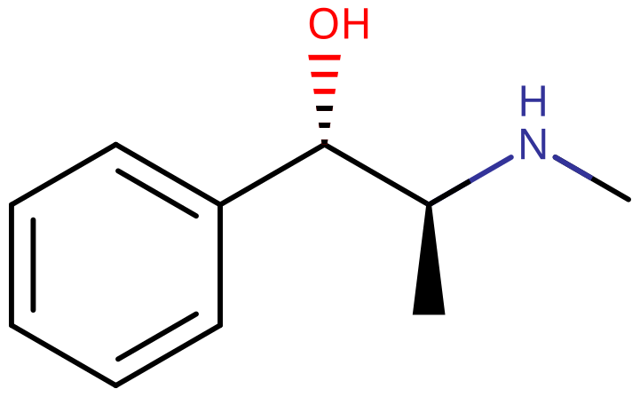

# 伪麻黄碱

[◀返回](index.md)

| **化学信息** | 伪麻黄碱（Pseudoephedrine）                                                |
| ------------ | -------------------------------------------------------------------------- |
| 结构式       |                                            |
| 分子式       | C10H15NO                                             |
| CAS 号       | 90-82-4                                                                    |
| **化学命名** |                                                                            |
| 常见名称     | 伪麻黄碱（Pseudoephedrine）、pseudo、Sudafed（苏达菲）、伪麻黄素、假麻黄碱 |
| 取代名称     | (1S,2S)-2-(methylamino)-1-phenylpropan-1-ol                                |
| **分类归属** |                                                                            |
| 精神活性分类 | _[兴奋剂](../文档/药物分类/兴奋剂.md)_                                     |
| 化学分类     | _[苯丙胺类物质](../文档/药物分类/苯丙胺类物质.md)_                         |

| [**给药途径**](../文档/给药途径.md)      | 🔽 [口服](../文档/给药途径.md#口服) |
| ---------------------------------------- | ----------------------------------- |
| [**剂量**](../文档/给药剂量.md)          |                                     |
| [阈值](../文档/药物剂量分类.md#阈值)     | 30 mg                               |
| [轻微](../文档/药物剂量分类.md#轻微)     | 30 \~ 60 mg                         |
| [中等](../文档/药物剂量分类.md#中等)     | 60 \~ 120 mg                        |
| [强烈](../文档/药物剂量分类.md#强烈)     | 120 \~ 180 mg                       |
| [严重](../文档/药物剂量分类.md#严重)     | 180 mg +                            |
| [**药效时长**](../文档/药效时长.md)      |                                     |
| [总时长](../文档/药效时长.md#总时长)     | 2 \~ 5 小时                         |
| [药效发作](../文档/药效时长.md#药效发作) | 20 \~ 90 分钟                       |
| [药效残余](../文档/药效时长.md#药效残余) | 2 \~ 4 小时                         |

- !!! warning "警告"

        由于个体体重、耐受性、新陈代谢和个人敏感度的差异，请务必从低剂量开始。参见[负责任的用药部分](../文档/负责任的用药索引页.md)。

    !!! info "[免责声明](../关于本站/免责声明.md)"

        本站的[给药剂量](../文档/给药剂量.md)信息收集自用户和[相关资源](../文档/科学信息索引页.md)，仅供教育目的使用。这不是医疗建议，应与其他来源核实以确保准确性。

**伪麻黄碱** 是一种[苯乙胺类](../文档/药物分类/苯乙胺类物质.md)和[苯丙胺类](../文档/药物分类/苯丙胺类物质.md)化学结构的拟交感神经药物。它可以用作鼻/窦减充血剂，也可以作为[兴奋剂](../文档/药物分类/兴奋剂.md)，或者在较高剂量下作为促醒剂使用。

伪麻黄碱在结构上与[甲基苯丙胺](甲基苯丙胺.md)密切相关，尽管它的中枢神经系统作用比苯丙胺类物质弱得多，但持续时间更长。它的外周兴奋剂作用类似于但弱于[肾上腺素](../文档/肾上腺素.md)，后者是肾上腺在体内产生的一种[激素](../文档/激素.md)。

## 历史与文化

伪麻黄碱天然存在于麻黄植物中，该植物含有[麻黄碱](麻黄碱.md)和伪麻黄碱。伪麻黄碱作为非处方药用于鼻腔减充血剂，通常与其他药物如非甾体抗炎药（NSAIDs）、对乙酰氨基酚、右美沙芬、愈创甘油醚和各种抗组胺药合用。伪麻黄碱被用作甲基苯丙胺和[甲卡西酮](甲卡西酮.md)的前体。因此，伪麻黄碱在世界大部分地区受到严格监管，要么被存放在柜台后面，要么仅凭处方提供，要么完全被禁止。

有报道称伪麻黄碱被超说明书用于其兴奋特性。例如，据报道，长途卡车司机和运动员使用伪麻黄碱作为[兴奋剂](../文档/药物分类/兴奋剂.md)来提高他们的警觉性和意识状态。

伪麻黄碱在经济条件适合出口的中国、印度的制药厂大量生产。

## 化学

伪麻黄碱是一种[取代苯丙胺类物质](../文档/药物分类/苯丙胺类物质.md)和结构上的[甲基苯丙胺](甲基苯丙胺.md)类似物。伪麻黄碱是[麻黄碱](麻黄碱.md)的非对映异构体，很容易被还原成甲基苯丙胺或氧化成[甲卡西酮](甲卡西酮.md)。

右旋 (+)- 或 d- 对映体是 (1<em>S</em>,2<em>S</em>)-伪麻黄碱，而左旋 (-)- 或 l- 形式是 (1<em>R</em>,2<em>R</em>)-伪麻黄碱。

在过时的 d/l 系统中，(+)-伪麻黄碱也被称为 l-伪麻黄碱，(-)-伪麻黄碱被称为 d-伪麻黄碱。

d/l 系统（小写大写字母）和 d/l 系统（小写字母）经常被混淆。结果是右旋 d-伪麻黄碱被错误地命名为 d-伪麻黄碱，左旋 l-麻黄碱（非对映异构体）被错误地命名为 l-麻黄碱。

两种对映体的 IUPAC 名称分别为 (1<em>S</em>,2<em>S</em>)- 和 (1<em>R</em>,2<em>R</em>)-2-甲氨基-1-苯基丙-1-醇。两者的同义词是 _psi_-麻黄碱和 _threo_-麻黄碱。

伪麻黄碱是用作药物物质时的 (+)-形式的国际非专利名称。

## 药理学

伪麻黄碱是一种拟交感神经胺，具有直接和间接的混合作用机制。它间接刺激 α-肾上腺素能受体，促使神经元颗粒释放内源性[去甲肾上腺素](../文档/去甲肾上腺素.md)。它还直接刺激 β-肾上腺素能受体。它增加了 α、β1 和 β2 [肾上腺素](../文档/肾上腺素.md) [受体](../文档/受体.md)处的儿茶酚胺活性。

它与麻黄碱非常相似，但明显较弱，并且引起心动过速和增加收缩压的能力较低。它的中枢作用比[苯丙胺](苯丙胺.md)弱，而其外周作用类似于肾上腺素。

## 主观效应

!!! info "[免责声明](../关于本站/免责声明.md)"

    _下列效应引用自 [**主观效应索引**](../药效/index.md)（**SEI**），这是一个基于轶事用户报告和个人分析的开放研究文献。因此，应带着健康的怀疑态度来看待它们。_

    _同样值得注意的是，这些效应不一定会以可预测或可靠的方式发生，尽管较高的剂量更可能引发全方位的效应。同样，**不良反应** 随着剂量的增加变得越来越可能，可能包括 **成瘾、严重伤害或死亡** ☠。_

- ### **躯体效应** 
    - **[兴奋](../药效/兴奋.md)**：据报道，伪麻黄碱在中高剂量下具有轻微的刺激作用。据报道，这种[兴奋](../药效/兴奋.md)比[苯丙胺](苯丙胺.md)和[哌甲酯](哌甲酯.md)等其他兴奋剂弱，但比[咖啡因](咖啡因.md)或[尼古丁](尼古丁.md)强。
    - **[镇静](../药效/镇静.md)**：在高剂量至过高剂量下，伪麻黄碱可能会引起嗜睡。
    - **[支气管扩张](../药效/支气管扩张.md)**
    - **[强迫性补量](../药效/强迫性补量.md)**
    - **[食欲抑制](../药效/食欲抑制.md)**
    - **[耐力增强](../药效/耐力增强.md)**
    - **[躯体欣快感](../药效/躯体欣快感.md)**：伪麻黄碱能够产生轻微的躯体[欣快感](../药效/躯体欣快感.md)。据报道，这种效应在非耐受用户中比[咖啡因](咖啡因.md)略强，但明显弱于[苯丙胺](苯丙胺.md)等其他[兴奋剂](../文档/药物分类/兴奋剂.md)。
    - **[恶心](../药效/恶心.md)**：据报道，高剂量伪麻黄碱会引起恶心。
    - **[口干](../药效/口干.md)**
    - **[血管收缩](../药效/血管收缩.md)**：这种效应在伪麻黄碱中很明显，其主要的治疗用途是收缩鼻腔中发炎的血管。
    - **[瞳孔扩大](../药效/瞳孔扩大.md)**：瞳孔扩大通常只在过高剂量下才会体验到。

- ### **[认知效应](../药效/认知效应.md)** 

    伪麻黄碱通常被描述为具有刺激性的思维空间。除强烈和严重剂量外，伪麻黄碱的认知效应通常较弱。还应注意，焦虑和负面的肾上腺素相关效应随剂量成比例增加。

    - **[认知欣快](../药效/认知欣快.md)**：据报道，伪麻黄碱产生的轻微认知[欣快感](../药效/认知欣快.md)强于[咖啡因](咖啡因.md)，但明显弱于[苯丙胺](苯丙胺.md)等其他[兴奋剂](../文档/药物分类/兴奋剂.md)。
    - **[焦虑](../药效/焦虑.md)**
    - **[专注力强化](../药效/专注力强化.md)**
    - **[记忆增强](../药效/记忆增强.md)**
    - **[思维加速](../药效/思维加速.md)**
    - **[音乐欣赏能力增强](../药效/音乐欣赏能力增强.md)**
    - **[自我膨胀](../药效/自我膨胀.md)**

- ### **药效残余** 

    与[药效达峰](../文档/药效时长.md)期间发生的效应相比，[兴奋剂](../文档/药物分类/兴奋剂.md)体验[药效褪去](../文档/药效时长.md)期间发生的效应通常感觉负面和不舒服。这通常被称为「下头」（comedown），是由于[神经递质](../文档/神经递质.md)耗尽而发生的。其效应通常包括：
    
    - **[焦虑](../药效/焦虑.md)**
    - **[食欲抑制](../药效/食欲抑制.md)**
    - **[认知疲劳](../药效/认知疲劳.md)**
    - **[抑郁](../药效/抑郁.md)**
    - **[易怒](../药效/易怒.md)**
    - **[动力抑制](../药效/动力抑制.md)**
    - **[思维减速](../药效/思维减速.md)**
    - **[清醒](../药效/清醒.md)**：在一些用户中，重复服用一系列伪麻黄碱后的[失眠](../文档/催眠药.md)可能会持续超过一天。

### 体验报告

目前我们的[报告索引](../报告/index.md)中关于该物质效果的体验报告：

1. [终止trip失败反而high了一下午](../报告/终止trip失败反而high了一下午.md)

你可以在[本站 Github 仓库](https://github.com/SalviaSWC/FreeODwiki)提交你自己的体验报告。其他的体验报告可以在这里找到：

- [Erowid Experience Vaults: Pseudoephedrine](https://www.erowid.org/experiences/subs/exp_Pseudoephedrine.shtml)

## 毒性与伤害潜力

### 致死剂量

盐酸伪麻黄碱在大鼠中的口服 LD50（半数致死量）为 1,674 mg/kg。

### 耐受性与成瘾潜力

与其他[兴奋剂](../文档/药物分类/兴奋剂.md)一样，长期使用伪麻黄碱可被视为具有中度成瘾性，并能够导致某些用户产生心理依赖。

重复和频繁使用后，很快就会对伪麻黄碱的效应产生耐受性。伪麻黄碱与其他[多巴胺能](../文档/多巴胺.md)[兴奋剂](../文档/药物分类/兴奋剂.md)存在交叉耐受性，这意味着在服用伪麻黄碱后，大多数其他[兴奋剂](../文档/药物分类/兴奋剂.md)化合物的效果会降低。

### 危险药物联用

!!! warning "警告"

    _许多精神活性物质在单独使用时相对安全，但与某些其他物质联用可能会突然变得危险甚至危及生命。_

    _请务必进行独立研究（例如 [Google](https://www.google.com)、[DuckDuckGo](https://www.duckduckgo.com)、[PubMed](https://pubmed.ncbi.nlm.nih.gov/)），确保多种物质的组合是安全的。部分列出的相互作用来自 [TripSit](https://combo.tripsit.me)。_

- **[MAOIs](../文档/单胺氧化酶抑制剂.md)**：合用或最近使用（14 天内）的单胺氧化酶抑制剂可能引起严重的高血压。
- **[25x-NBOMe](25I-NBOMe.md) & [25x-NBOH](25B-NBOH.md)**：25x 类化合物具有高度刺激性，对身体有很大负担。应严格避免与伪麻黄碱联用，因为存在过度[兴奋](../药效/兴奋.md)和心脏负荷的风险。这可能导致[血压升高](../药效/血压升高.md)、[血管收缩](../药效/血管收缩.md)、惊恐发作、[思维循环](../药效/思维循环.md)、[癫痫发作](../文档/癫痫发作.md)，极端情况下会导致心力衰竭。
- **[酒精](酒精.md)**：将酒精与[兴奋剂](../文档/药物分类/兴奋剂.md)结合使用可能很危险，因为存在意外过度中毒的风险。兴奋剂会掩盖酒精的[抑制](../文档/药物分类/抑制剂.md)作用，而这正是大多数人用来评估自己中毒程度的依据。一旦兴奋剂消退，[抑制](../文档/药物分类/抑制剂.md)作用将不再受对抗，这可能导致断片和严重的[呼吸抑制](../药效/呼吸抑制.md)。如果混合使用，用户应严格限制自己每小时只喝一定量的酒精。
- **[右美沙芬](右美沙芬.md)**：应避免与右美沙芬联用，因为它对[血清素](../文档/血清素.md)和[去甲肾上腺素](../文档/去甲肾上腺素.md)再摄取有抑制作用。存在[惊恐发作](../药效/惊恐发作.md)和高血压危象的风险增加，或者与血清素释放剂（[MDMA](MDMA.md)、[甲基酮](甲卡西酮.md)、[甲氧麻黄酮](4-MMC.md)等）联用时出现[血清素综合征](../文档/血清素综合征.md)的风险。请仔细监测血压并避免剧烈的体力活动。
- **[MDMA](MDMA.md)**：当存在其他[兴奋剂](../文档/药物分类/兴奋剂.md)时，MDMA 的任何神经毒性效应都可能会增加。还存在血压过高和心脏负荷（心脏毒性）的风险。
- **[MXE](MXE.md)**：一些报告表明，与 MXE 联用可能会危险地升高血压，并增加[躁狂](../药效/躁狂.md)和[精神病发作](../药效/精神病发作.md)的风险。
- **[解离剂](../文档/药物分类/解离剂.md)**：这两类药物都有引起[妄想](../药效/妄想.md)、[躁狂](../药效/躁狂.md)和[精神病发作](../药效/精神病发作.md)的风险，联用时这些风险可能会倍增。
- **[兴奋剂](../文档/药物分类/兴奋剂.md)**：伪麻黄碱与[可卡因](可卡因.md)等其他[兴奋剂](../文档/药物分类/兴奋剂.md)联用可能很危险，因为它们会将[心率](../药效/心率增快.md)和[血压](../药效/血压升高.md)提高到危险水平。
- **[曲马多](曲马多.md)**：已知曲马多会降低癫痫发作阈值 [^1]，与兴奋剂联用可能会进一步增加这种风险。

## 法律地位

在 21 世纪初，由于伪麻黄碱常被用作非法生产[甲基苯丙胺](甲基苯丙胺.md)的前体，许多国家开始将其放在柜台后面，要求处方或完全禁止。

- **中国大陆**：伪麻黄碱被列为第一类易制毒化学品。[^14] 单位剂量麻黄碱类药物含量大于 30 mg（不含 30 mg）的含麻黄碱类复方制剂，列入必须凭处方销售的处方药管理。医疗机构应当严格按照《处方管理办法》开具处方。药品零售企业必须凭执业医师开具的处方销售上述药品。[^15]
- **澳大利亚**：伪麻黄碱含量在 800 mg（液体形式）或 720 mg 及以下属于附表 3（仅限药剂师），否则属于附表 4（仅限处方）。[^2]
- **墨西哥**：由于伪麻黄碱作为合成甲基苯丙胺的前体而被广泛使用，因此被列为非法。[^3]
- **加拿大**：唯一活性成分为伪麻黄碱的产品必须存放在药房柜台后面。含有伪麻黄碱以及其他活性成分的产品可以陈列在商店货架上，但只能在有药剂师在场的情况下在药房出售。[^4] [^5] 含有伪麻黄碱和咖啡因的产品被禁止。
- **哥伦比亚**：哥伦比亚政府于 2010 年禁止伪麻黄碱贸易。[^6]
- **日本**：根据日本《兴奋剂管制法》，含有超过 10% 伪麻黄碱的药物是被禁止的。[^7]
- **荷兰**：由于担心不良心脏副作用，伪麻黄碱于 1989 年停止销售。[^8]
- **新西兰**：伪麻黄碱目前被归类为仅限药剂师药物，咨询药剂师后即可获得。[^9]
- **土耳其**：含有伪麻黄碱的药物仅凭处方提供。[^10]
- **英国**：伪麻黄碱可在合格药剂师的监督下作为非处方药获得，或凭处方获得。2007 年，针对麻黄碱和伪麻黄碱被转移用于非法制造甲基苯丙胺的担忧，MHRA 引入了自愿限制，限制非处方药销售每笔交易总共不超过 720 毫克伪麻黄碱的一盒。[^11]
- **美国**：由于伪麻黄碱被用于非法生产甲基苯丙胺，因此受到联邦监管。大多数州要求伪麻黄碱在「柜台后面」出售，并限制可出售的数量。俄勒冈州和密西西比州以前要求购买含有伪麻黄碱的产品必须持有处方，但截至 2022 年 1 月 1 日，这些限制已被废除。[^12] [^13]

## 另见

- [负责任的用药](../文档/负责任的用药索引页.md)
- [兴奋剂](../文档/药物分类/兴奋剂.md)
- [甲基苯丙胺](甲基苯丙胺.md)
- [甲卡西酮](甲卡西酮.md)

## 外部链接

- [Pseudoephedrine (Wikipedia)](https://en.wikipedia.org/wiki/Pseudoephedrine)
- [Pseudoephedrine (PsychonautWiki Talk)](https://psychonautwiki.org/wiki/Talk:Pseudoephedrine)
- [Pseudoephedrine (Erowid Vault)](https://www.erowid.org/chemicals/pseudoephedrine/)
- [Pseudoephedrine (DrugBank)](https://go.drugbank.com/drugs/DB00852)

## 引用文献

[^1]: Talaie, H.; Panahandeh, R.; Fayaznouri, M. R.; Asadi, Z.; Abdollahi, M. (2009). "Dose-independent occurrence of seizure with tramadol". _Journal of Medical Toxicology_. **5** (2): 63–67. [doi](http://en.wikipedia.org/wiki/Digital_object_identifier):[10.1007/BF03161089](..//doi.org/10.1007%2FBF03161089). [eISSN](http://en.wikipedia.org/wiki/International_Standard_Serial_Number#Electronic_ISSN) [1937-6995](..//www.worldcat.org/issn/1937-6995). [ISSN](http://en.wikipedia.org/wiki/International_Standard_Serial_Number) [1556-9039](..//www.worldcat.org/issn/1556-9039). [OCLC](http://en.wikipedia.org/wiki/OCLC) [163567183](..//www.worldcat.org/oclc/163567183).

[^2]: <https://www.legislation.gov.au/Details/F2023L01294>

[^3]: <http://www.eluniversal.com.mx/notas/465055.html>

[^4]: <https://web.archive.org/web/20151025125803/http://pharmacytechniciansletter.therapeuticresearch.com/(S(uvxrnu55cowfcdintotjyq45))/mobile/Newsletter.aspx?nidchk=1&cs=&s=PTL&vo=1&dd=271114&dt=2&vodd=3>

[^5]: <https://web.archive.org/web/20160618165544/http://www.familyhealthonline.ca/fho/pharmacycare/PC_OTCdrugs_fhb07.asp>

[^6]: <http://www.eltiempo.com/archivo/documento/CMS-5824648>

[^7]: ["Customs Information"](http://www.seattle.us.emb-japan.go.jp/about/import_restrictions.html). _Consulate-General of Japan in Seattle_. Retrieved 27 August 2015.

[^8]: <https://www.in-pharmatechnologist.com/Article/2007/09/03/Pseudoephedrine-drugs-still-OTC>

[^9]: <https://www.health.govt.nz/regulation-legislation/medicines-control/controlled-drugs/pseudoephedrine-cold-and-flu-medicines>

[^10]: <https://web.archive.org/web/20140311224333/http://www.istanbulsaglik.gov.tr/w/sb/ecz/ykmrecete/belge/normal_recete_verilmesi.pdf>

[^11]: <http://www.mhra.gov.uk/home/idcplg?IdcService=GET_FILE&dDocName=CON014095&RevisionSelectionMethod=LatestReleased>

[^12]: <http://www.wlox.com/Global/story.asp?S=11919990>

[^13]: <https://www.nytimes.com/2010/11/16/opinion/16bovett.html>

[^14]: [易制毒化学品管理条例](https://www.gov.cn/gongbao/content/2016/content_5139415.htm)．中华人民共和国中央人民政府

[^15]: [国家食品药品监督管理局 公安部 卫生部 关于加强含麻黄碱类复方制剂管理有关事宜的通知](https://www.nmpa.gov.cn/xxgk/fgwj/gzwj/gzwjyp/20120904120001401.html). 国食药监办[2012]260号
