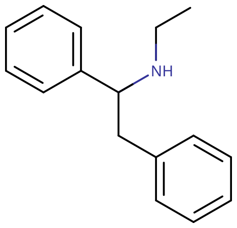

# 依芬尼定

[◀返回](index.md)

!!! info "信息"

    请勿将依芬尼定（Ephenidine）与[麻黄碱](麻黄碱.md)（Ephedrine）或[麻黄酮](甲卡西酮.md)（Ephedrone）混淆哦。

| **化学信息** | 依芬尼定（Ephenidine）                                                 |
| ------------ | -------------------------------------------------------- |
| 结构式       |                               |
| 分子式       | C16H19N                            |
| CAS 号       | 60951-19-1 6272-97-5（盐酸盐）                        |
| **化学命名** |                                                          |
| 常用名称     | 依芬尼定（Ephenidine）、NEDPA、EPE                         |
| 取代名称     | 依芬尼丁                                                 |
| 系统命名     | N-Ethyl-1,2-diphenylethylamine                           |
| **类别归属** |                                                          |
| 精神活性分类 | [解离剂](../文档/药物分类/解离剂.md)                     |
| 化学分类     | [二芳基乙胺类物质](../文档/药物分类/二芳基乙胺类物质.md) |

| [**给药途径**](../文档/给药途径.md)    | 🔽 [口服](../文档/给药途径.md#口服) |
| -------------------------------------- | ---------------------------------- |
| [**给药剂量**](../文档/给药剂量.md)    |                                    |
| [阈值](/文档/药物剂量分类.md#阈值)     | 30 mg                              |
| [轻微](/文档/药物剂量分类.md#轻微)     | 30 \~ 70 mg                        |
| [中等](/文档/药物剂量分类.md#中等)     | 70 \~ 100 mg                       |
| [强烈](/文档/药物剂量分类.md#强烈)     | 100 \~ 150 mg                      |
| [严重](/文档/药物剂量分类.md#严重)     | 150 mg +                           |
| [**药效时长**](../文档/药效时长.md)    |                                    |
| [总时长](/文档/药效时长.md#总时长)     | 5 \~ 7 小时                        |
| [药效发作](/文档/药效时长.md#药效发作) | 10 \~ 30 分钟                      |
| [**药物联用**](#危险的药物联用)        |                                    |
| [兴奋剂](../文档/药物分类/兴奋剂.md)   | 💔 联用危险                        |
| [抑制剂](../文档/药物分类/抑制剂.md)   | 💔 联用危险                        |

- !!! warning "警告"

        由于个体体重、耐受性、新陈代谢和个人敏感度的差异，请务必从低剂量开始。参见[负责任的用药部分](../文档/负责任的用药索引页.md)。

    !!! info "[免责声明](../关于本站/免责声明.md)"

        本站的[给药剂量](../文档/给药剂量.md)信息收集自用户和[相关资源](../文档/科学信息索引页.md)，仅供教育目的使用。这不是医疗建议，应与其他来源核实以确保准确性。

**依芬尼定**（亦称 **NEDPA** 或 **EPE**）是一种较少为人所知的[二芳基乙胺类](../文档/药物分类/二芳基乙胺类物质.md)新型[解离剂](../文档/药物分类/解离剂.md)。依芬尼定是一种 [NMDA 受体拮抗剂](../文档/药物分类/NMDA受体拮抗剂类药物.md)，[^1] 在结构上与[地芬尼丁](地芬尼丁.md)和[甲氧芬尼定](甲氧芬尼定.md)等二芳基乙胺类物质相关。它显著的效应包括镇静、幻觉、麻醉以及灵魂出窍状态，也就是所谓的「解离性麻醉」。

依芬尼定及其相关的二芳基乙胺类物质曾作为神经毒性损伤的治疗手段在人类身上进行过研究。[^2] [^3] [^4] [^5] [^6] 直到 2013 年英国禁止[芳基环己胺类物质](../文档/药物分类/芳基环己胺类物质.md)后，它才出现在在线[研究用化学品](../文档/研究用化学品.md)市场上。[^7] 尽管用户反映其效果有显著不同，但它当时还是与[地芬尼丁](地芬尼丁.md)和[甲氧芬尼定](甲氧芬尼定.md)一起被作为 [MXE](MXE.md) 的替代品进行销售的。

目前关于依芬尼定的药理特性、代谢和毒性的数据非常少，人类使用史也极其有限。二芳基乙胺类物质的滥用与多起致命和非致命的药物过量案例有关。[^1] 许多报告表明，它们可能带来与传统解离剂不同的风险。如果使用这种物质，强烈建议采取[伤害减少措施](../文档/负责任的用药索引页.md)。

## 历史与文化

依芬尼定被描述为一种[策划药](../文档/研究用化学品.md)。策划药是指模仿常用违禁物质的功能和结构特征，以规避政府监管的物质。[^8] [^9]

## 化学

依芬尼定属于[二芳基乙胺类物质](../文档/药物分类/二芳基乙胺类物质.md)。它包含一个取代的[苯乙胺](../文档/药物分类/苯乙胺类物质.md)骨架，其 Rα 位结合了一个额外的苯环。一个乙基链结合在苯乙胺的末端胺 RN 上。依芬尼定在结构上与[地芬尼丁](地芬尼丁.md)和 [MXP](甲氧芬尼定.md) 类似，但它不是[哌啶类](../文档/药物分类/哌啶类物质.md)[解离剂](../文档/药物分类/解离剂.md)。依芬尼定与[地芬尼丁](地芬尼丁.md)和 [MXP](甲氧芬尼定.md) 共有二苯基乙胺骨架，但缺少哌啶取代基。

## 药理学

更多信息请参见：[NMDA 受体拮抗剂](../文档/药物分类/NMDA受体拮抗剂类药物.md)

依芬尼定作为 [NMDA 受体](../文档/受体.md)的[拮抗剂](../文档/受体拮抗剂.md)起作用（Ki = 66.4 nM）。[^10] [^11] [^12] [^13] [^14] NMDA（N-甲基-D-天冬氨酸）受体是谷氨酸的主要受体亚型之一，而谷氨酸是中枢神经系统（CNS）中主要的兴奋性神经递质。当 NMDA 通道被阻断时，会导致感觉丧失（麻醉）、移动困难（固定），在较高剂量下，会产生相当于 [K-hole](../药效/视觉分离.md#空洞、空间与虚空) 的效果。

依芬尼定对[多巴胺](../文档/多巴胺.md)和[去甲肾上腺素](../文档/去甲肾上腺素.md)转运蛋白也具有较弱的亲和力（分别为 379 nM 和 841 nM），并能结合 σ1 受体（629 nM）和 σ2 受体（722 nM）位点。[^15]

## 主观效应

据报告，依芬尼定在雾化吸入或抽吸时起效更快，半衰期更短。当以这种方式使用时，如果加热过度，怀疑具有致癌性。一些用户报告得出结论，雾化吸入和直肠给药所需的剂量仅为该用户普通口服剂量的 20% 左右。

!!! info "[免责声明](../关于本站/免责声明.md)"

    _下列效应引用自 [**主观效应索引**](../药效/index.md)（**SEI**），这是一个基于轶事用户报告和个人分析的开放研究文献。因此，应带着健康的怀疑态度来看待它们。_

    _同样值得注意的是，这些效应不一定会以可预测或可靠的方式发生，尽管较高的剂量更可能引发全方位的效应。同样，**不良反应** 随着剂量的增加变得越来越可能，可能包括 **成瘾、严重伤害或死亡** ☠。_

- ### **躯体效应** 
    - **[兴奋](../药效/兴奋.md)**：这种化合物在低剂量下会产生刺激效果，但强度低于[地芬尼丁](地芬尼丁.md)或[甲氧芬尼定](甲氧芬尼定.md)。
    - **[触觉分离](../药效/视觉分离.md)**
    - **[空间定向障碍](../药效/空间定向障碍.md)**
    - **[镇痛](../药效/镇痛.md)**
    - **[咳嗽抑制](../药效/咳嗽抑制.md)**
    - **[食欲抑制](../药效/食欲抑制.md)**
    - **[恶心](../药效/恶心.md)**：即使在相似的剂量范围内，这种效应的出现也不太稳定。
    - **[重力感改变](../药效/重力感改变.md)**
    - **[自发性躯体感觉](../药效/自发性躯体感觉.md)**：依芬尼定的「躯体快感」是一种柔和且令人愉悦的刺痛感，它是静止的、全方位的，没有特定的位置。
    - **[触觉抑制](../药效/触觉抑制.md)**：这会部分或完全抑制人的触觉，使肢体产生麻木感。这是该物质麻醉特性的原因。
    - **[运动控制丧失](../药效/运动控制丧失.md)**：在依芬尼定的体验中，大肌肉和小肌肉的运动控制以及平衡和协调能力的丧失非常普遍，在高剂量下尤为强烈。这意味着在药效发作前应该坐下来（除非你有经验），以防摔倒受伤。
    - **[躯体轻盈感](../药效/躯体轻盈感.md)**：这会产生身体正在漂浮并变得完全无重的感觉。这种效应具有奇妙的刺激性，在中小剂量下，通过让身体感觉轻盈、移动毫不费力，从而鼓励体力活动。
    - **[步态改变](../药效/运动控制丧失.md)**：依芬尼定通常会导致走路等动作被感知为自动化的和机械化的。
    - **[躯体自主](../药效/躯体自主.md)**
    - **[心率增快](../药效/心率增快.md)**
    - **[性高潮抑制](../药效/性高潮抑制.md)**

- ### **视觉效应** 

    #### 抑制
    - **[视觉分离](../药效/视觉分离.md)**：最终会产生类似于著名的 K-hole 的效果，或者更具体地说，是[空洞、空间与虚空](../药效/视觉分离.md#空洞、空间与虚空)以及[结构体](../药效/视觉分离.md#结构体)。然而值得注意的是，与[氯胺酮](氯胺酮.md)或 [MXE](MXE.md) 等更传统的[解离剂](../文档/药物分类/解离剂.md)相比，必须摄入特别大的剂量才能达到这种成分的最深状态。
    - **[视觉锐度抑制](../药效/视觉锐度抑制.md)**
    - **[复视](../药效/复视.md)**：这种成分在中等到高剂量下很普遍，除非闭上一只眼睛，否则无法阅读。
    - **[模式识别抑制](../药效/模式识别抑制.md)**：这种效应通常发生在高剂量下，使人无法识别和解释可感知的视觉数据。
    - **[帧率抑制](../药效/视觉加工减慢.md)**

    #### 扭曲
    - **[漂移](../药效/漂移.md)**（[融化](../药效/漂移.md#融化)、[流动](../药效/漂移.md#流动)、[呼吸](../药效/漂移.md#呼吸)和[变形](../药效/漂移.md#变形)）：与其他[解离剂](../文档/药物分类/解离剂.md)相比，这种效应比[氯胺酮](氯胺酮.md)、[MXE](MXE.md)、[地芬尼丁](地芬尼丁.md)和[甲氧芬尼定](甲氧芬尼定.md)更明显。视觉漂移在运动上简单、缓慢且平滑，外观上是静态的，风格上是不真实的/卡通式的。
    - **[透视扭曲](../药效/透视扭曲.md)**
    - **[环境球体化](../药效/环境球体化.md)**
    - **[环境立体主义](../药效/环境立体主义.md)**
    - **[环境切片](../药效/环境切片.md)**

    #### [几何](../药效/几何.md)

    与[氯胺酮](氯胺酮.md)、[MXE](MXE.md)、[甲氧芬尼定](甲氧芬尼定.md)和[地芬尼丁](地芬尼丁.md)相比，依芬尼定中的视觉几何图形可以被描述为非常独特且具有迷幻感。它比 [右美沙芬](右美沙芬.md) 的细节要少得多。它不会超过 5 级，可以全面描述为：复杂度简单、风格算法化、感觉合成、组织无结构、光线昏暗、方案多彩、阴影亮泽、边缘柔和、尺寸微小、速度缓慢、运动平滑、圆角和棱角均匀、深度沉浸且强度一致。

    #### 幻觉状态

    在高剂量下，依芬尼定可以产生全方位的、高级别的幻觉状态，其方式比许多其他常用的[迷幻剂](../文档/药物分类/迷幻剂.md)更不一致且更难复现。这些效应包括：
    
    - **[内部幻觉](../药效/内部幻觉.md)**（[自主实体](../药效/自主实体.md)；[场景、布景和景观](../药效/场景、布景和景观.md)；[视角幻觉](../药效/视角幻觉.md)以及[情景与情节](../药效/情景与情节.md)）：与其他[解离剂](../文档/药物分类/解离剂.md)相比，这种效应在高剂量下可能发生，但比在[迷幻剂](../文档/药物分类/迷幻剂.md)和[谵妄剂](../文档/药物分类/谵妄剂.md)中发现的相同效应要少见得多。它可以全面描述为：可信度具有谵妄感、风格固定、内容上新体验和记忆重放均等、可控性自主且风格扎实。

- ### **认知效应** 

    依芬尼定的一般思维空间通常被描述为与 [右美沙芬](右美沙芬.md) 和[氯胺酮](氯胺酮.md)相比特别欣快且清醒。具体的认知效应可以细分为以下几个独立的子成分：

    - **[思维加速](../药效/思维加速.md)** 与 **[思维减速](../药效/思维减速.md)**
    - **[人格解体](../药效/人格解体.md)**
    - **[现实感丧失](../药效/现实感丧失.md)**
    - **[梦境强化](../药效/梦境强化.md)**
    - **[意识脱离](../药效/视觉分离.md)**
    - **[记忆抑制](../药效/记忆抑制.md)**
        - **[自我死亡](../药效/自我死亡.md)**：发生在高剂量下。
    - **[自我膨胀](../药效/自我膨胀.md)**：发生在低剂量下，其强度低于[甲氧麻黄酮](4-MMC.md)、[甲基苯丙胺](甲基苯丙胺.md)或[可卡因](可卡因.md)。
    - **[动机增强](../药效/动机增强.md)**：发生在低剂量下。
    - **[分析能力抑制](../药效/分析能力抑制.md)**
    - **[时间扭曲](../药效/时间扭曲.md)**：这会产生时间流逝比清醒时慢得多的错觉。例如，用户可能会觉得已经过去了一小时或几个小时，而实际上只过了几分钟。
    - **[认知欣快](../药效/认知欣快.md)**
    - **[新奇感增强](../药效/新奇感增强.md)**
    - **[创造力增强](../药效/创造力增强.md)**
    - **[内省增强](../药效/内省增强.md)**
    - **[既视感](../药效/既视感.md)**
    - **[自我替换](../药效/自我替换.md)**
    - **[概念性思维](../药效/概念性思维.md)**
    - **[强迫性补量](../药效/强迫性补量.md)**
    - **[焦虑抑制](../药效/焦虑抑制.md)**
    - **[去抑制](../药效/去抑制.md)**
    - **[失忆](../药效/失忆.md)**
    - **[音乐欣赏能力增强](../药效/音乐欣赏能力增强.md)**
    - **[个人意义强化](../药效/个人意义强化.md)**
    - **[性欲减退](../药效/性欲减退.md)**

- ### **听觉效应** 
    - **[听觉锐度增强](../药效/听觉锐度增强.md)**
    - **[听觉锐度抑制](../药效/听觉锐度抑制.md)**
    - **[听觉扭曲](../药效/听觉扭曲.md)**
    - **[听觉幻觉](../药效/听觉幻觉.md)**

- ### **超个人效应** 
    - **[存在主义自我实现](../药效/存在主义自我实现.md)**

### 体验报告

目前我们的[报告索引](../报告/index.md)中没有关于该物质效果的体验报告。你可以在[本站 Github 仓库](https://github.com/SalviaSWC/FreeODwiki)提交你自己的体验报告。

其他的体验报告可以在这里找到：

- PsychonautWiki：
    1. [Experience: 105mg Ephenidine - An Intense Emotional Experience](https://psychonautwiki.org/wiki/Experience:_105mg_Ephenidine_-_An_Intense_Emotional_Experience)
    2. [Experience:800-900mg Ephenidine + unknown quantity flubroalzolam - Multiday Insanity](https://psychonautwiki.org/wiki/Experience:800-900mg_Ephenidine_%2B_unknown_quantity_flubroalzolam_-_Multiday_Insanity)
    3. [Experience:Ephenidine (115 mg, oral) - Feeling Like A Raspberry](<https://psychonautwiki.org/wiki/Experience:Ephenidine_%28115_mg,_oral%29_-_Feeling_Like_A_Raspberry>)
    4. [Experience:Ephenidine:185mg - A Weird and Rewarding Trip](https://psychonautwiki.org/wiki/Experience:Ephenidine:185mg_-_A_Weird_and_Rewarding_Trip)
- [Erowid Experience Vaults: Ephenidine](https://www.erowid.org/experiences/subs/exp_Ephenidine.shtml)

## 毒性与危害潜力

更多信息请参见：[研究用化学品 § 毒性与危害潜力](../文档/研究用化学品.md) 以及 [负责任的使用 § 致幻剂](../文档/关于本站/观前提醒.md)

目前似乎还没有在任何科学背景下研究过娱乐性使用依芬尼定的毒性和长期健康影响，确切的毒性剂量尚不清楚。这是因为依芬尼定的人类使用史非常短。

尝试过依芬尼定的人的轶事报告表明，仅仅尝试这种药物本身（低至中等剂量并偶尔使用）似乎没有归因于它的负面健康影响（但没有什么能完全保证）。在摄入之前，应该始终进行独立的调研，以确保两种或多种物质的联用是安全的。

### 耐受性与成瘾潜力

与其他 NMDA 受体拮抗剂一样，长期使用依芬尼定可被认为具有中度成瘾性，并具有很高的滥用潜力，且能够在某些用户中引起心理依赖。当产生毒瘾后，如果用户突然停止使用，可能会出现渴望和[戒断反应](../文档/药物戒断反应.md)。

长期重复使用会对依芬尼定的许多效应产生耐受性。这导致用户必须使用越来越大的剂量才能达到相同的效果。之后，在停止使用的情况下，大约需要 3 \~ 7 天耐受性会降低一半，1 \~ 2 周可恢复到基线。依芬尼定与所有[解离剂](../文档/药物分类/解离剂.md)都存在交叉耐受性，这意味着在使用依芬尼定后，所有[解离剂](../文档/药物分类/解离剂.md)的效果都会降低。

### 危险的药物联用

!!! warning "警告"

    _许多精神活性物质在单独使用时相对安全，但与某些其他物质联用可能会突然变得危险甚至危及生命。_

    _请务必进行独立研究（例如 [Google](https://www.google.com)、[DuckDuckGo](https://www.duckduckgo.com)、[PubMed](https://pubmed.ncbi.nlm.nih.gov/)），确保多种物质的组合是安全的。部分列出的相互作用来自 [TripSit](https://combo.tripsit.me)。_

- **[兴奋剂](../文档/药物分类/兴奋剂.md)**：兴奋剂和解离剂都有引起[焦虑](../药效/焦虑.md)、[躁狂](../药效/躁狂.md)、[妄想](../药效/妄想.md)和[精神病发作](../药效/精神病发作.md)等不良心理反应的风险，当这两种物质联用时，这些风险会加剧。
- **[抑制剂](../文档/药物分类/抑制剂.md)**：因为两者都会抑制呼吸系统，这种联用可能导致突然昏迷、呕吐并因随之而来的窒息而窒息死亡的风险增加。如果发生[恶心](../药效/恶心.md)或呕吐，用户应尝试以[恢复体位](../文档/恢复体位.md)入睡，或让朋友将其置于该体位。

## 法律状态

由于依芬尼定是违禁阿片类药物左非他胺的结构异构体，因此在某些国家是非法的。[^16] [^17]

- **中国大陆**：未列管。
- **加拿大**：截至 2016 年 3 月，MT-45 及其类似物（依芬尼定是其中之一）属于附表 I 管制物质。[^18] 未经法律授权持有最高可判处 7 年监禁。只有执法机构、持有豁免许可的人员或经部长授权的机构方可持有该药物。
- **德国**：根据 NpSG（《新精神活性物质法》），依芬尼定作为 2-苯乙胺（[苯乙胺类物质](../文档/药物分类/苯乙胺类物质.md)）的衍生物受到管制。[^19]
- **瑞典**：瑞典公共卫生署于 2015 年 6 月建议将依芬尼定列为危险物质后，依芬尼定自 2015 年 8 月起成为管制物质。[^20]
- **瑞士**：依芬尼定是 Verzeichnis E 下明确列出的管制物质。[^21]
- **土耳其**：依芬尼定被归类为药物，持有、生产、供应或进口均属违法。[^22]
- **英国**：根据 2016 年 5 月 26 日生效的《精神活性物质法》，在英国生产、供应或进口依芬尼定均属违法。[^23]
- **美国**：依芬尼定可能被视为 SPA（左非他胺）的位置异构体，而左非他胺是附表 IV 药物。[^24] 然而，附表法律文本中的异构体条款很少（如果有的话）被用于起诉。

## 另见

- [负责任的使用](../文档/关于本站/观前提醒.md)
- [研究用化学品](../文档/研究用化学品.md)
- [解离剂](../文档/药物分类/解离剂.md)
- [二芳基乙胺类物质](../文档/药物分类/二芳基乙胺类物质.md)
- 地芬尼丁
- [甲氧芬尼定](甲氧芬尼定.md)

## 外部链接

- [Ephenidine (Wikipedia)](https://en.wikipedia.org/wiki/Ephenidine)
- [Ephenidine (PsychonautWiki)](https://psychonautwiki.org/wiki/Ephenidine)
- [Ephenidine (Isomer Design)](https://isomerdesign.com/PiHKAL/explore.php?id=726)

### 社区

- [依芬尼定 (N-ethyl-1,2-diphenylethylamine) 大讨论帖 (Bluelight)](<http://www.bluelight.org/vb/threads/766110-The-Big-amp-Dandy-Ephenidine-(N-ethyl-1-2-diphenylethylamine)-Thread>)

## 文献

- Wallach, J., Kang, H., Colestock, T., Morris, H., Bortolotto, Z. A., Collingridge, G. L., ... & Adejare, A. (2016). Pharmacological investigations of the dissociative ‘legal highs’ diphenidine, methoxphenidine and analogues. PLoS One, 11(6), e0157021. <https://doi.org/10.1371/journal.pone.0157021>
- Morris, H., & Wallach, J. (2014). From PCP to MXE: A comprehensive review of the non-medical use of dissociative drugs. Drug Testing and Analysis, 6(7–8), 614–632. <https://doi.org/10.1002/dta.1620>
- Wink, Carina S. D., et al. “Lefetamine‐Derived Designer Drugs N‐Ethyl‐1,2‐Diphenylethylamine (NEDPA) and N‐Iso‐Propyl‐1,2‐Diphenylethylamine (NPDPA): Metabolism and Detectability in Rat Urine Using GC‐MS, LC‐MSn and LC‐HR‐MS/MS.” _Drug Testing and Analysis_, John Wiley & Sons, Ltd, 3 Mar. 2014, <https://onlinelibrary.wiley.com/doi/abs/10.1002/dta.1621>.
- “Toxicokinetics of Lefetamine and Derived Diphenylethylamine Designer Drugs-Contribution of Human Cytochrome P450 Isozymes to Their Main Phase I Metabolic Steps.” Toxicology Letters, Elsevier, 11 Aug. 2015, https://www.sciencedirect.com/science/article/pii/S0378427415300333.
- “Ephenidine: A New Psychoactive Agent with Ketamine-like NMDA Receptor Antagonist Properties.” Neuropharmacology, Pergamon, 9 Aug. 2016, <https://www.sciencedirect.com/science/article/pii/S0028390816303392>.
- Eiden, Céline, et al. “Ephenidine, Diphenidine, and Methoxphenidine Complications Reported to the French Addictovigilance Network.” Fundamental & Clinical Pharmacology, John Wiley & Sons, Ltd (10.1111), 23 July 2018, <https://onlinelibrary.wiley.com/doi/abs/10.1111/fcp.12395>.

## 引用文献

[^1]: Wallach, J., Kang, H., Colestock, T., Morris, H., Bortolotto, Z. A., Collingridge, G. L., Lodge, D., Halberstadt, A. L., Brandt, S. D., Adejare, A. (17 June 2016). Lee, J., ed. ["Pharmacological Investigations of the Dissociative 'Legal Highs' Diphenidine, Methoxphenidine and Analogues"](https://dx.plos.org/10.1371/journal.pone.0157021). PLOS ONE. **11** (6): e0157021. [doi](http://en.wikipedia.org/wiki/Digital_object_identifier):[10.1371/journal.pone.0157021](https://doi.org/10.1371%2Fjournal.pone.0157021). [ISSN](http://en.wikipedia.org/wiki/International_Standard_Serial_Number) [1932-6203](https://www.worldcat.org/issn/1932-6203).

[^2]: Nancy M. Gray; Brian K. Cheng (6 April 1994). ["Patent EP 0346791 - 1,2-diarylethylamines for treatment of neurotoxic injury"](https://www.surechembl.org/document/EP-0346791-B1/). G.D. Searle, LLC – via SureChEMBL.

[^3]: Michael L. Berger; Anna Schweifer; Patrick Rebernik; Friedrich Hammerschmidt (May 2009). ["NMDA receptor affinities of 1,2-diphenylethylamine and 1-(1,2-diphenylethyl)piperidine enantiomers and of related compounds"](http://www.sciencedirect.com/science/article/pii/S0968089609002624). Bioorganic & Medicinal Chemistry. **17** (1): 3456–3462. [doi](http://en.wikipedia.org/wiki/Digital_object_identifier):[10.1016/j.bmc.2009.03.025](https://doi.org/10.1016%2Fj.bmc.2009.03.025). [PMID](http://en.wikipedia.org/wiki/PubMed_Identifier) 19345586.

[^4]: Jason Wallach; Pierce V. Kavanagh; Gavin McLaughlin; Noreen Morris; John D. Power; Simon P. Elliott; Marion S. Mercier; David Lodge; Hamilton Morris; Nicola M. Dempster; Simon D. Brandt (May 2015). ["Preparation and characterization of the 'research chemical' diphenidine, its pyrrolidine analogue, and their 2,2-diphenylethyl isomers"](http://onlinelibrary.wiley.com/doi/10.1002/dta.1689/abstract). Drug Testing and Analysis. 7 (5): 358–367. [doi](http://en.wikipedia.org/wiki/Digital_object_identifier):[10.1002/dta.1689](https://doi.org/10.1002%2Fdta.1689). [PMID](http://en.wikipedia.org/wiki/PubMed_Identifier) [25044512](https://www.ncbi.nlm.nih.gov/pubmed/25044512).

[^5]: Thurkauf, Andrew; Monn, James; Mattson, Marienna V.; Jacobson, Arthur E.; Rice, Kenner C. (1989). ["Structural and conformational aspects of the binding of aryl-alkyl amines to the phencyclidine binding site"](http://archives.drugabuse.gov/pdf/monographs/95.pdf) (PDF). NIDA research monograph. 95: 51–56. [ISSN](http://en.wikipedia.org/wiki/International_Standard_Serial_Number) [1046-9516](https://www.worldcat.org/issn/1046-9516). [PMID](http://en.wikipedia.org/wiki/PubMed_Identifier) [2561843](https://www.ncbi.nlm.nih.gov/pubmed/2561843).

[^6]: Goodson, L. H.; Wiegand, C. J. W.; Splitter, Janet S. (November 1946). ["Analgesics. I. N-Alkylated-1,2-diphenylethylamines Prepared by the Leuckart Reaction"](http://pubs.acs.org/doi/abs/10.1021/ja01215a018). Journal of the American Chemical Society. 68 (11): 2174–2175. [doi](http://en.wikipedia.org/wiki/Digital_object_identifier):[10.1021/ja01215a018](https://doi.org/10.1021%2Fja01215a018). [PMID](http://en.wikipedia.org/wiki/PubMed_Identifier) [21002222](https://www.ncbi.nlm.nih.gov/pubmed/21002222).

[^7]: McLaughlin, G., Morris, N., Kavanagh, P. V., Power, J. D., O’Brien, J., Talbot, B., Elliott, S. P., Wallach, J., Hoang, K., Morris, H., Brandt, S. D. (January 2016). ["Test purchase, synthesis, and characterization of 2-methoxydiphenidine (MXP) and differentiation from its meta - and para -substituted isomers: Characterization of 2-, 3- and 4-methoxydiphenidine isomers"](https://onlinelibrary.wiley.com/doi/10.1002/dta.1800). Drug Testing and Analysis. 8 (1): 98–109. [doi](http://en.wikipedia.org/wiki/Digital_object_identifier):[10.1002/dta.1800](https://doi.org/10.1002%2Fdta.1800). [ISSN](http://en.wikipedia.org/wiki/International_Standard_Serial_Number) [1942-7603](https://www.worldcat.org/issn/1942-7603).

[^8]: Morris, H., Wallach, J. (August 2014). "From PCP to MXE: a comprehensive review of the non-medical use of dissociative drugs". Drug Testing and Analysis. 6 (7–8): 614–632. [doi](http://en.wikipedia.org/wiki/Digital_object_identifier):[10.1002/dta.1620](https://doi.org/10.1002%2Fdta.1620). [ISSN](http://en.wikipedia.org/wiki/International_Standard_Serial_Number) [1942-7611](https://www.worldcat.org/issn/1942-7611).

[^9]: Van Hout, M. C., Hearne, E. (March 2015). ""Word of mouse": indigenous harm reduction and online consumerism of the synthetic compound methoxphenidine". Journal of Psychoactive Drugs. 47 (1): 30–41. [doi](http://en.wikipedia.org/wiki/Digital_object_identifier):[10.1080/02791072.2014.974002](https://doi.org/10.1080%2F02791072.2014.974002). [ISSN](http://en.wikipedia.org/wiki/International_Standard_Serial_Number) [0279-1072](https://www.worldcat.org/issn/0279-1072).

[^10]: Nancy M. Gray; Brian K. Cheng (6 April 1994). ["Patent EP 0346791 - 1,2-diarylethylamines for treatment of neurotoxic injury"](https://www.surechembl.org/document/EP-0346791-B1/). G.D. Searle, LLC – via SureChEMBL.

[^11]: Michael L. Berger; Anna Schweifer; Patrick Rebernik; Friedrich Hammerschmidt (May 2009). ["NMDA receptor affinities of 1,2-diphenylethylamine and 1-(1,2-diphenylethyl)piperidine enantiomers and of related compounds"](http://www.sciencedirect.com/science/article/pii/S0968089609002624). Bioorganic & Medicinal Chemistry. 17 (1): 3456–3462. [doi](http://en.wikipedia.org/wiki/Digital_object_identifier):[10.1016/j.bmc.2009.03.025](https://doi.org/10.1016%2Fj.bmc.2009.03.025). [PMID](http://en.wikipedia.org/wiki/PubMed_Identifier) [19345586](https://www.ncbi.nlm.nih.gov/pubmed/19345586).

[^12]: Jason Wallach; Pierce V. Kavanagh; Gavin McLaughlin; Noreen Morris; John D. Power; Simon P. Elliott; Marion S. Mercier; David Lodge; Hamilton Morris; Nicola M. Dempster; Simon D. Brandt (May 2015). ["Preparation and characterization of the 'research chemical' diphenidine, its pyrrolidine analogue, and their 2,2-diphenylethyl isomers"](http://onlinelibrary.wiley.com/doi/10.1002/dta.1689/abstract). Drug Testing and Analysis. 7 (5): 358–367. [doi](http://en.wikipedia.org/wiki/Digital_object_identifier):[10.1002/dta.1689](https://doi.org/10.1002%2Fdta.1689). [PMID](http://en.wikipedia.org/wiki/PubMed_Identifier) [25044512](https://www.ncbi.nlm.nih.gov/pubmed/25044512).

[^13]: Thurkauf, Andrew; Monn, James; Mattson, Marienna V.; Jacobson, Arthur E.; Rice, Kenner C. (1989). ["Structural and conformational aspects of the binding of aryl-alkyl amines to the phencyclidine binding site"](http://archives.drugabuse.gov/pdf/monographs/95.pdf) (PDF). NIDA research monograph. 95: 51–56. [ISSN](http://en.wikipedia.org/wiki/International_Standard_Serial_Number) [1046-9516](https://www.worldcat.org/issn/1046-9516). [PMID](http://en.wikipedia.org/wiki/PubMed_Identifier) [2561843](https://www.ncbi.nlm.nih.gov/pubmed/2561843).

[^14]: Goodson, L. H.; Wiegand, C. J. W.; Splitter, Janet S. (November 1946). ["Analgesics. I. N-Alkylated-1,2-diphenylethylamines Prepared by the Leuckart Reaction"](http://pubs.acs.org/doi/abs/10.1021/ja01215a018). Journal of the American Chemical Society. 68 (11): 2174–2175. [doi](http://en.wikipedia.org/wiki/Digital_object_identifier):[10.1021/ja01215a018](https://doi.org/10.1021%2Fja01215a018). [PMID](http://en.wikipedia.org/wiki/PubMed_Identifier) [21002222](https://www.ncbi.nlm.nih.gov/pubmed/21002222).

[^15]: Kang, Heather; Park, Pojeong; Bortolotto, Zuner A.; Brandt, Simon D.; Colestock, Tristan; Wallach, Jason; Collingridge, Graham L.; Lodge, David (2016). ["Ephenidine: A new psychoactive agent with ketamine-like NMDA receptor antagonist properties"](http://www.sciencedirect.com/science/article/pii/S0028390816303392). Neuropharmacology. 112 (Pt A): 144–149. [doi](http://en.wikipedia.org/wiki/Digital_object_identifier):[10.1016/j.neuropharm.2016.08.004](https://doi.org/10.1016%2Fj.neuropharm.2016.08.004). PMC [5084681](https://www.ncbi.nlm.nih.gov/pmc/articles/PMC5084681). [PMID](http://en.wikipedia.org/wiki/PubMed_Identifier) [27520396](https://www.ncbi.nlm.nih.gov/pubmed/27520396).

[^16]: Wink, C. S. D., Meyer, G. M. J., Wissenbach, D. K., Jacobsen-Bauer, A., Meyer, M. R., Maurer, H. H. (October 2014). "Lefetamine-derived designer drugs N-ethyl-1,2-diphenylethylamine (NEDPA) and N-iso-propyl-1,2-diphenylethylamine (NPDPA): metabolism and detectability in rat urine using GC-MS, LC-MSn and LC-HR-MS/MS". Drug Testing and Analysis. 6 (10): 1038–1048. [doi](http://en.wikipedia.org/wiki/Digital_object_identifier):[10.1002/dta.1621](https://doi.org/10.1002%2Fdta.1621). [ISSN](http://en.wikipedia.org/wiki/International_Standard_Serial_Number) [1942-7611](https://www.worldcat.org/issn/1942-7611).

[^17]: Wink, C. S. D., Meyer, G. M. J., Meyer, M. R., Maurer, H. H. (4 November 2015). "Toxicokinetics of lefetamine and derived diphenylethylamine designer drugs-Contribution of human cytochrome P450 isozymes to their main phase I metabolic steps". Toxicology Letters. 238 (3): 39–44. [doi](http://en.wikipedia.org/wiki/Digital_object_identifier):[10.1016/j.toxlet.2015.08.012](https://doi.org/10.1016%2Fj.toxlet.2015.08.012). [ISSN](http://en.wikipedia.org/wiki/International_Standard_Serial_Number) [1879-3169](https://www.worldcat.org/issn/1879-3169).

[^18]: Government of Canada, P. W. and G. S. C. (2016), [Canada Gazette – Regulations Amending the Food and Drug Regulations (Parts G and J — Lefetamine, AH-7921, MT-45 and W-18](https://canadagazette.gc.ca/rp-pr/p2/2016/2016-06-01/html/sor-dors106-eng.html)

[^19]: ["Neue-psychoaktive-Stoffe-Gesetz (NpSG)"](https://www.gesetze-im-internet.de/npsg/NpSG.pdf) [New Psychoactive Substances Act (NpSG)] (PDF) (in German). Bundesamt für Justiz [Federal Office of Justice]. November 21, 2016. Retrieved August 14, 2020.

[^20]: [Nyhetsarkiv — Folkhälsomyndighete](https://www.folkhalsomyndigheten.se/nyheter-och-press/nyhetsarkiv/)

[^21]: ["Verordnung des EDI über die Verzeichnisse der Betäubungsmittel, psychotropen Stoffe, Vorläuferstoffe und Hilfschemikalien"](https://www.admin.ch/opc/de/classified-compilation/20101220/index.html) (in German). Bundeskanzlei [Federal Chancellery of Switzerland]. Retrieved January 1, 2020.

[^22]: <https://resmigazete.gov.tr/eskiler/2017/01/20170112-8.pdf>

[^23]: [Psychoactive Substances Act 2016](https://www.legislation.gov.uk/ukpga/2016/2/contents/enacted)

[^24]: DEA website | <http://www.deadiversion.usdoj.gov/21cfr/cfr/1308/1308_14.htm>
