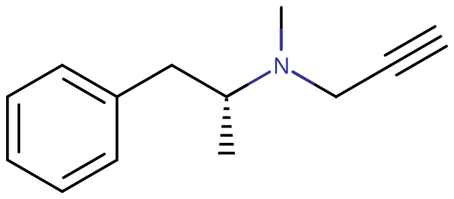
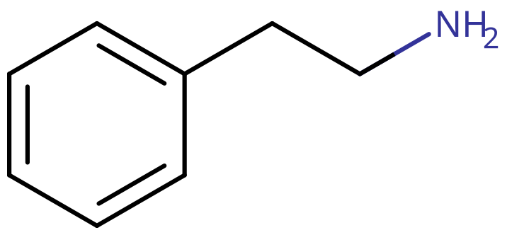

# 司来吉兰 + 苯乙胺

[◀返回](index.md)

!!! quote " "

    **两个必须一起使用才有效果，否则无效**

    **苯乙胺约等式：司来吉兰 + 苯乙胺 ≈ 苯丙胺**

**司来吉兰** 是一种不可逆的第一代[单胺](../文档/单胺.md)氧化酶 B 抑制剂，用于治疗 ADHD、抗原发性帕金森药。<mark>**服用司来吉兰后 14 天内避免吃含酪胺的食物，小心酪胺反应带来的[高血压](../药效/血压升高.md)。**</mark>

**苯乙胺** 是一种[生物碱](../文档/药物分类/生物碱类物质.md)与[单胺](../文档/单胺.md)类[神经递质](../文档/神经递质.md)，在人脑中有神经调节物质、神经递质的作用。

| **化学信息** | 司来吉兰（Selegiline）                             | 苯乙胺（PEA）                                      |
| ------------ | -------------------------------------------------- | -------------------------------------------------- |
| 结构式       |                         |                     |
| 分子式       | C13H17N                      | C8H11N                       |
| CAS 号       | 14611-51-9 14611-52-0（盐酸盐）                  | 64-04-0 156-28-5（盐酸盐）                       |
| **化学命名** |                                                    |                                                    |
| 常见名称     | 司来吉兰（Selegiline）、咪多吡（Eldepryl）、金思平 | 苯乙胺（Phenethylamine）、2-苯乙胺、β-苯乙胺、PEA  |
| 取代名称     | L-Deprenyl, N-Propargyl-L-methamphetamine          | Phenethylamine                                     |
| 系统命名     | phenylisopropyl-N-methylpropinylamine              | 2-Phenylethylamine                                 |
| **类别归属** |                                                    |                                                    |
| 精神活性分类 | _[兴奋剂](../文档/药物分类/兴奋剂.md)_             | _[兴奋剂](../文档/药物分类/兴奋剂.md)_             |
| 化学分类     | _[单胺氧化酶抑制剂](../文档/单胺氧化酶抑制剂.md)_  | _[苯乙胺类物质](../文档/药物分类/苯乙胺类物质.md)_ |

苯乙胺大多情况下以盐酸盐的形式出现在人们的视野。

!!! warning "对 2-苯乙胺盐酸盐发出酸蚀性警告"

    - 若您口服，建议搭配胃舒平、钙片或苏打水缓解；
    - 若您鼻腔吸收时感到呛痛难忍，请使用苏打水或肥皂水冲洗鼻腔内部。若您在操作时不慎灼伤皮肤，请立刻用大量清水冲洗，随后用肥皂涂抹灼伤部位；
    - 若您操作时不慎进入眼部，请使用大量清水冲洗，随后用低浓度的小苏打溶液或低浓度肥皂水冲洗眼部，最后再用清水冲洗；严重不适者请立即就医。

## 作用机理

!!! info "信息"

    苯乙胺单独服用没有精神效果，因为其还未进入[血脑屏障](../文档/血脑屏障.md)就已被肠道、肝脏的单胺氧化酶消灭殆尽，少量进入[血脑屏障](../文档/血脑屏障.md)的也仅仅只能作用 10 分钟，还没有副作用来得大……

苯乙胺绝大部分经由单胺氧化酶（主要是 MAO-B，其次 MAO-A）代谢，极少部分由醛脱氢酶（ALDH）、多巴胺β-羟化酶（DBH）、CYP2D6 代谢。

医用剂量下，司来吉兰选择性抑制 MAO-B，防止摄入的苯乙胺被迅速代谢，如此苯乙胺就能顺利进入大脑，提高[去甲肾上腺素](../文档/去甲肾上腺素.md)和[多巴胺](../文档/多巴胺.md)水平。

未使用[单胺氧化酶抑制剂](../文档/单胺氧化酶抑制剂.md)（MAOI，下同）：仅 5 \~ 10 min（分钟）左右就会被代谢掉，您甚至不会感到效果。

使用 MAOI（注：以下均为主编自身体验，实际情况可能因体质而异，通常，您的持续时长会比主编长些），含服 0.5t 司来吉兰（2.5 mg）后，口服 800 mg 效果持续约 20 \~ 50 min；含服 1t（5 mg）司来吉兰后，口服 800 mg 效果持续约 30 \~ 90 min。

## 酪胺反应

单胺氧化酶分 2 种：

- MAO-A：主要与[血清素](../文档/血清素.md)（5-HT）、[去甲肾上腺素](../文档/去甲肾上腺素.md)（NE）、[多巴胺](../文档/多巴胺.md)（DA）、酪胺有关，主要针对抑郁领域。
- MAO-B：主要与苯乙胺、[多巴胺](../文档/多巴胺.md)有关，主要针对帕金森领域。

其中[多巴胺](../文档/多巴胺.md)均能通过两种 MAO 代谢，酪胺主要是 MAO-A，苯乙胺主要是 MAO-B。

肠道和肝脏中的单胺氧化酶（主要是 MAO-A）可防止外源性胺类物质吸收引发[高血压](../药效/血压升高.md)危象（酪胺反应）。如果胺类物质大量进入血液循环，将被[肾上腺素](../文档/肾上腺素.md)能[神经元](../文档/神经元.md)吸收，置换囊胞储存位点中的[去甲肾上腺素](../文档/去甲肾上腺素.md)，后者释放入血，可引起[血压升高](../药效/血压升高.md)等反应。

司来吉兰对 MAO-B 亲和力大于 MAO-A。医用剂量下选择性抑制 MAO-B，对 MAO-A 的抑制不明显。因此进食新鲜且适量的含酪胺食物一般不会引起严重的不良反应，不必太过于忌口肉蛋奶产品，保持日常的摄入是没问题的，更何况来点皓齿的优质蛋白很幸福不是么？

大剂量（20 mg/日以上）下司来吉兰失去选择性，同时抑制 MAO-A 和 MAO-B。此时如果摄入酪胺，可突发高血压危象，其严重程度视摄入的酪胺量、胃排空的速率以及服用 MAOI 和摄入酪胺之间的间隔时间长短而定。

!!! warning "尽管司来吉兰在医疗剂量下并不会产生严重的酪胺反应，但我们还是对如下食物发出风险警告（期待补充）"

    - **高风险物质（服用后一周内禁止食用）**：奶酪芝士等乳酪产品，红葡萄酒，酱油，酸菜，泡菜，发酵腌制的香肠、鱼类与牛肉等酵母制品，鲱鱼，金枪鱼以及任何非医用量的含胺基团感冒/咳嗽药 ~~（你知道我要说什么）~~。
    - **中风险物质（即使吃了也只引发轻度低血压）**：太熟的水果，鱼类，牛肉，大量蛋奶及其制品，蛋白粉，过量[酒精](酒精.md)，医疗剂量下治疗[低血压](../药效/血压降低.md)的药品以及其他具有高蛋白含量的制品的大量摄入。
    - **低风险物质（关于主编按不住嘴吃了列表上的一些食品但什么也没发生这档事）**：正常食用量的牛肉、鱼肉等肉类，蛋奶制品，适量[酒精](酒精.md)，低量感冒药，医疗剂量下的普通抗焦虑安眠药物，医疗量下的 [SSRI](../文档/SSRI.md)、[SNRI](../文档/血清素-去甲肾上腺素再摄取抑制剂.md)、NDRI、SNDRI 类药品。

又可参考[酪胺饮食 - 反苯环丙胺](反苯环丙胺.md#_5)，相较于非选择性的[反苯环丙胺](反苯环丙胺.md)，司来吉兰还是很安全的，不必过度恐慌酪胺。

## 摄入方式

**口服**  
胶囊送服或泡水饮用，其中泡水饮用的起效速度与吸收率稍优于胶囊送服，约 20 \~ 40 min 起效。

**鼻腔吸收**

!!! warnin "注意"

    **注：相较于口服的用量减半，由于盐酸盐的酸含量很高（甚至占比高于[金刚烷胺](金刚烷胺.md)），可能灼伤鼻腔，酌情考虑。**

10 秒至 2 分钟内起效，吸收率约是口服的两倍。不推荐，对鼻子刺激很大很难受。即便如此，请不要一次性将所有药物吸完，先吸入少量即可（一次吸完可能会有危险）再等药效减弱后补充吸入一些。

**舌下含服**  
不可行，第一，它苦死了；第二，容易灼伤口腔。

**直肠给药**  
溶于水制成灌肠液后灌入肛门（你认真的？不怕辣屁眼？）

## [联用](../文档/多药联用列表.md)指南

<mark>**时刻注重血压和心跳，稍有不慎请拨打 120，[高血压](../药效/血压升高.md)推荐使用降压药硝苯地平**</mark>

请务必把药物研磨成非常细的粉末，并将司来吉兰与苯乙胺混合均匀后在吸入鼻腔内侧而不是肺中

### 联用摄入方式

**舌下司来吉兰 + 口服苯乙胺**：含服司来吉兰 15 min 后，口服苯乙胺。  
**鼻吸司来吉兰 + 口服苯乙胺**：磨碎司来吉兰片剂至粉末。口服苯乙胺 15 min 后，鼻吸司来吉兰。亦可分两次鼻吸司来吉兰，开始时鼻吸一半，药效渐退时鼻吸另一半。  
**鼻吸司来吉兰 + 鼻吸苯乙胺**：磨碎司来吉兰片剂至粉末，鼻吸司来吉兰。5 min 后鼻吸苯乙胺，40 min 后再补充鼻吸苯乙胺，一次性不超过 0.2 g。

### 剂量

**口服轻度剂量：0.5t 司来吉兰 + 0.2 \~ 0.4 g 苯乙胺（装胶囊或者泡水）**  
**口服中度剂量：1t 司来吉兰 + 0.4 \~ 0.8 g 苯乙胺（装胶囊或者泡水）**  
**口服重度剂量：1t 司来吉兰 + 0.8 g 及以上苯乙胺（装胶囊或者泡水）**  
**口服危险剂量：重度剂量及以上**

_实际上剂量我故意写低了很多，考虑到安全_

## 主观效果

精神方面，[欣快](../药效/认知欣快.md)，幸福感，[镇定感](../药效/镇静.md)（类似于长跑后的无力），[性欲强烈增加](../药效/性欲增强.md)，轻程度的[眩晕](../药效/头晕.md)，在较低剂量苯乙胺下（200 mg 以下）可以一定程度改善[专注度](../药效/专注力强化.md)。

生理方面，[面部潮红](../药效/皮肤潮红.md)，[身体燥热](../药效/体温升高.md)，[汗量增大](../药效/出汗增加.md)，性延时（这点主编更倾向于是司来吉兰的作用

总之就是要高潮了、温暖欣快的刺痛感、既刺激又[镇静](../药效/镇静.md)、全身发软，颅内高潮，恋爱脑，[外部幻觉](../药效/外部幻觉.md)（?）、[内部幻觉](../药效/内部幻觉.md)（?）、[触觉增强](../药效/触觉增强.md)、[焦虑抑制](../药效/焦虑抑制.md)、[同理心、感情和社交能力增强](../药效/共情、情感和社交能力增强.md)、[沉浸感增强](../药效/沉浸感强化.md)、增强[性欲增强](../药效/性欲增强.md)等等（我的语言能力描绘不出来）

## 副作用

- [高血压](../药效/血压升高.md)：注意 [高血压危象](https://www.mayoclinic.org/zh-hans/diseases-conditions/high-blood-pressure/expert-answers)
- [低血压](../药效/血压降低.md)（没错，尤其是体位性低血压）：[MAOIs](../文档/单胺氧化酶抑制剂.md) 常见副作用，联用多种 MAOI 更是可能严重低血压。
- [头痛](../药效/头痛.md)
- [发热](../药效/体温升高.md)

药效时：[心率加快](../药效/心率增快.md)（这会带来低血压的风险），呼吸急促，[恶心](../药效/恶心.md)甚至[呕吐](../药效/呕吐.md)（在安全情况下，这通常是由于它那高含量的酸导致的，请阅读置顶警告），偶见激越并可能诱发[躁狂](../药效/躁狂.md)发作，偶见[四肢抽动](../药效/肌肉颤动.md)。

药效后：[降智](../药效/认知减退.md)，由落差感带来的[情绪低沉](../药效/抑郁.md)，[食欲下降](../药效/食欲抑制.md)，肠胃不适，[腹泻](../药效/腹泻.md)，[头痛](../药效/头痛.md)（在高剂量以上多发），偶见[焦虑](../药效/焦虑.md)，偶见失眠，若鼻腔吸收还会带来鼻腔疼痛，鼻塞。

危险剂量下（根据主编一次 3h 内服下总计 4g 的经历整理）：[心动过速](../药效/心率增快.md)（一度干到 170+），[心率失齐](../药效/心律异常.md)（在几分钟内心率由 170+ 掉至 70+），呼吸急促并最终[呼吸困难](../药效/呼吸抑制.md)，[谵妄](../药效/谵妄.md)，[呕吐](../药效/呕吐.md)，[四肢抽动](../药效/肌肉颤动.md)，强烈[头痛](../药效/头痛.md)（并在药后持续了一天多），持续了约两日的[食欲低沉](../药效/食欲抑制.md)、肠胃不适与[腹泻](../药效/腹泻.md)，持续了一日的强烈[情绪低沉](../药效/抑郁.md)

## 自我保护

### 仪器

- 毫克称

- 心率/血压计

### 作用迅速的降压药

- **硝苯地平片**：钙离子通道阻滞剂。口服后 15 min 起效，30 min 达到峰值，持续时间 4 \~ 8 h。**不要舌下含服**，降压过快容易脑卒中、心肌梗死。
- **盐酸拉贝洛尔片**：α、β [受体](../文档/受体.md)阻滞剂。口服后 2 \~ 4 h 达到峰值，持续时间 8 \~ 12 h。

### 消化道

- **甲氧氯普胺片**：可选。少量，用来避免[恶心](../药效/恶心.md)反酸。

## 尿检假阳

苯乙胺衍生物实在疯狂至极！随便拎几个都是高危地带产品。2 号位插一个甲基，它就成了臭名昭著的[苯丙胺](苯丙胺.md)；倘若再往 N 号位插一个甲基，那就成为恐怖至极的[冰毒](甲基苯丙胺.md)。苯环 3, 4, 5 号位上各插个甲氧基，它就成为了[麦司卡林](麦斯卡林.md)。[卡西酮](卡西酮.md)是它的好兄长，[哌醋甲酯](哌甲酯.md) 是它的好姐姐，[MDMA](MDMA.md) 是它的老大哥……

司来吉兰化学名为 (R)-N-α-二甲基-N-(2-丙炔基)苯乙胺，其代谢产物是[左旋苯丙胺](苯丙胺.md)和[左旋甲基苯丙胺](甲基苯丙胺.md)（基本不回脑部发挥作用），导致[苯丙胺](苯丙胺.md)、[冰毒](甲基苯丙胺.md)尿检呈假阳性。下一代同类药物——雷沙吉兰无此问题，国内主流电商平台有售。

## [药物相互作用](../文档/危险药物联用.md)（司来吉兰）

1. 可能延长及增强赛庚啶的抗胆碱能作用，不要[联用](../文档/多药联用列表.md)两者。
2. 联用间接拟交感神经药物（如间羟胺、[麻黄碱](麻黄碱.md)）可引起严重低血压。
3. 联用其他 MAOI 可能引起严重低血压。
4. 联用胰岛素、口服降糖药可刺激胰岛素分泌，引起过度低血糖。
5. 联用安非拉酮可引起安非拉酮中毒，表现为[惊厥](../药效/癫痫发作.md)烦躁不安及精神症状。
6. 联用有中枢抑制作用的药物（如[镇静](../药效/镇静.md)催眠药、麻醉药）可出现低血压，增强中枢抑制或[呼吸抑制](../药效/呼吸抑制.md)作用。
7. 联用哌替啶、[曲马多](曲马多.md)、[美沙酮](美沙酮.md)、[右丙氧芬](右丙氧芬.md)可引起[兴奋](../药效/兴奋.md)、[出汗过多](../药效/出汗增加.md)、肌强直及严重高血压，少数情况可发生[呼吸抑制](../药效/呼吸抑制.md)昏迷、[惊厥](../药效/癫痫发作.md)、[高热](../药效/体温升高.md)、血管性虚脱甚至死亡。与司来吉兰服用至少间隔两周。
8. 联用三环类[抗抑郁药](../文档/抗抑郁药.md)曾有引起[出汗增加](../药效/出汗增加.md)、[高血压](../药效/血压升高.md)、低血压、[眩晕](../药效/头晕.md)、激越、行为及精神状态改变、[高热](../药效/体温升高.md)、[抽搐](../药效/肌肉痉挛.md)及震颤的报道。应谨慎，与司来吉兰服用至少间隔两周。
9. 联用 **[SSRIs](../文档/SSRI.md)**（如氟西汀、舍曲林、帕罗西汀）曾有引起类似[血清素综合征](../文档/血清素综合征.md)的报道，表现为[脸红](../药效/皮肤潮红.md)、[流汗](../药效/出汗增加.md)、[眩晕](../药效/头晕.md)、心悸、[高热](../药效/体温升高.md)、[惊厥](../药效/癫痫发作.md)、低血压或低血压，震颤，共济失调及精神变化（澈越、错乱及[幻觉](../药效/幻觉状态.md)）甚至[谵妄](../药效/谵妄.md)及昏迷。与司来吉兰服用间隔至少两周，而其中氟西汀停药至少 5 周后才可开始服用司来吉兰。
10. 联用左旋多巴时，可使心血管过度兴奋，[多巴胺](../文档/多巴胺.md)与[去甲肾上腺素](../文档/去甲肾上腺素.md)水平升高，导致低血压或增加死亡率。宜减量司来吉兰。
11. 联用 β [肾上腺素](../文档/肾上腺素.md)[受体激动药](../文档/受体激动剂.md)可使出现兴奋、[心动过速](../药效/心率增快.md)、轻度[躁狂](../药效/躁狂.md)的风险增加。
12. 不要联用[略氨酸](酪氨酸.md)、甲基多巴、[哌甲酯](哌甲酯.md)，否则可出现低血压危象（[头痛](../药效/头痛.md)、心悸、颈强直）。
13. 不要联用马普替林，可改变儿茶酚胺的再摄取和代谢，出现神经毒性或癫痛发作。
14. 不要联用 **[右美沙芬](右美沙芬.md)**，可导致[精神病](../药效/精神病发作.md)或行为异常。
15. 联用[米氮平](米氮平.md)、贯叶连翘、卡马西平、奥卡西平、环苯扎林、**[安非他酮](安非他酮.md)** 可增加严重不良反应的风险。
16. [饮酒](酒精.md)可加重中枢神经系统不良反应（如疲劳、头晕，个别患者发生意识模糊或视物模糊）。
17. HRT 药物使司来吉兰血药峰值浓度上升。炔雌醇可抑制司来吉兰的首过代谢，使司来吉兰口服生物利用度增高。

## 恋爱激素苯乙胺：让你一见钟情的源头

爱的巧克力理论：1980 年代早期，研究者同时也是 1983 年畅销书籍《爱的化学》（The Chemistry of Love）的作者迈克尔·莱柏温兹（Michael Liebowitz）对记者谈论到「巧克力富含苯乙胺」。这后来成为《纽约时报》文章的焦点，并且让电报服务者产生兴趣，后来更引起许多杂志自由工作者的兴趣，并发展至今日知名的「爱情的巧克力理论」（chocolate theory of love）。然而，如之前所提的，苯乙胺会很快地被单胺氧化酶所新陈代谢，防止其有效地集中到达脑部，因此并不能贡献显而易见的精神方面的效果。

失恋者与巧克力：苯乙胺是一种神经[兴奋剂](../文档/药物分类/兴奋剂.md)，它能让人感到一种极度兴奋的感觉，使人觉得更加有精力、信心和勇气。

这也是心理医生建议失恋者吃点巧克力的原因，因为巧克力富含苯乙胺，可以提高因失恋骤然降低的苯乙胺水平，从而改善苦闷[抑郁](../药效/抑郁.md)的情绪。

苯乙胺与[血清素](../文档/血清素.md)：苯乙胺并非完全有益，苯乙胺的泛滥，会稀释了用来控制情感的神经化学物质——血清素，让[血清素](../文档/血清素.md)水平偏低，而缺乏血清素会导致人变得[焦虑](../药效/焦虑.md)多疑甚至于抑郁失眠

所以到底是由我们幸福了所以才让各项「快乐激素」升高了，还是说「快乐激素」升高所以才造就了我们的幸福？主编认为这取决于个人了。如果我们能够去积极生活，通过自己的各种积极活动行为去获取到幸福，那似乎才是我们的个人自由意志去掌控了身心；而如果我们沦为[多巴胺](../文档/多巴胺.md)的奴隶，那想必才是真的完全为激素所支配了吧

## 苯乙胺与肠道菌群失调或呈正相关

肠道菌群是生长在人体肠道内部的正常微生物，如乳酸菌、双歧杆菌等等，这些微生物与人类的和谐共生维持了我们肠道的健康，而甚至有一些研究表明肠道菌群是否稳定和人情绪的积极与否有着强烈的关联。

胃肠道中的多巴胺 D2 [受体](../文档/受体.md)被过度激活时，将影响胃肠道菌群的稳定性。有文章表明肠道上皮细胞上的多巴胺受体介导了菌群与宿主的相互联系。亦有有文章表明，由瘤胃球菌产生的苯乙胺及[色胺类物质](../文档/药物分类/色胺类物质.md)扰乱了肠道菌群的稳定性，使肠道菌群失调，并进一步引发了[腹泻](../药效/腹泻.md)型肠易激综合征，甚至于在肠易激综合征之上增强了患者的胰岛素抵抗性诱发2型糖尿病。

因此，我们可以认为口服苯乙胺会引发肠道菌群的失调，主编最直观的感受就是恰完的几天内排便时总是稀的。

## 后记

上面是苯乙胺搭配司来吉兰的常规用法，下面要介绍的才是wiki主和朋友试过的最强药效

高度（高潮）剂量：苯乙胺 800mg 以上 2g 以下，推荐 1 \~ 1.5g（一定要泡水，胶囊吸收率没有直接泡水强），1t 司来吉兰磨成细粉鼻吸，1t [安非他酮](安非他酮.md)研磨鼻吸，并混合均匀

服用方法：和轻中计量不一样，先喝苯乙胺溶液（加一点水就能溶解完）等苯乙胺感觉上来后在吸入少量司来吉兰与[安非他酮](安非他酮.md)混合粉末，等待药效，如果药效减少了就再吸一点

PS：也可以选择药效更好的[反苯](反苯环丙胺.md)来代替司来吉兰

再次重要提示：鼻吸起效时间极快，吸收率很高，所以请不要一次将所有的药吸完（可能会有危险）而是应该等药效减弱后再补充吸入一些，请将司来吉兰与苯乙胺混合均匀后在吸入鼻腔内侧而不是肺里，请务必把药物研磨成非常细的粉末

## 外部链接

- [苯乙胺 - 维基百科](https://zh.wikipedia.org/wiki/%E8%8B%AF%E4%B9%99%E8%83%BA)
- [Selegiline - Wikipedia](https://en.wikipedia.org/wiki/Selegiline)
- [反苯环丙胺 - 反解离百科](https://fanjieli.org/1-%E8%8D%AF%E7%89%A9%E4%BB%AC/%E5%8F%8D%E8%8B%AF%E7%8E%AF%E4%B8%99%E8%83%BA/)