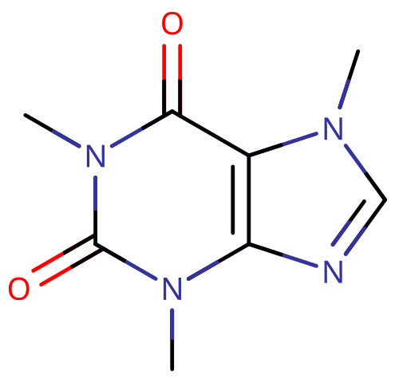
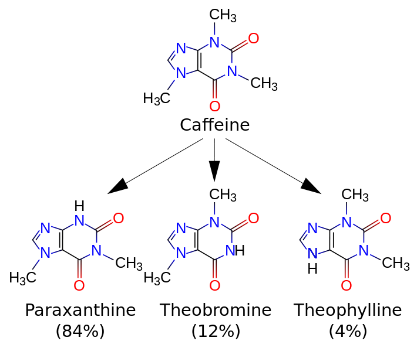
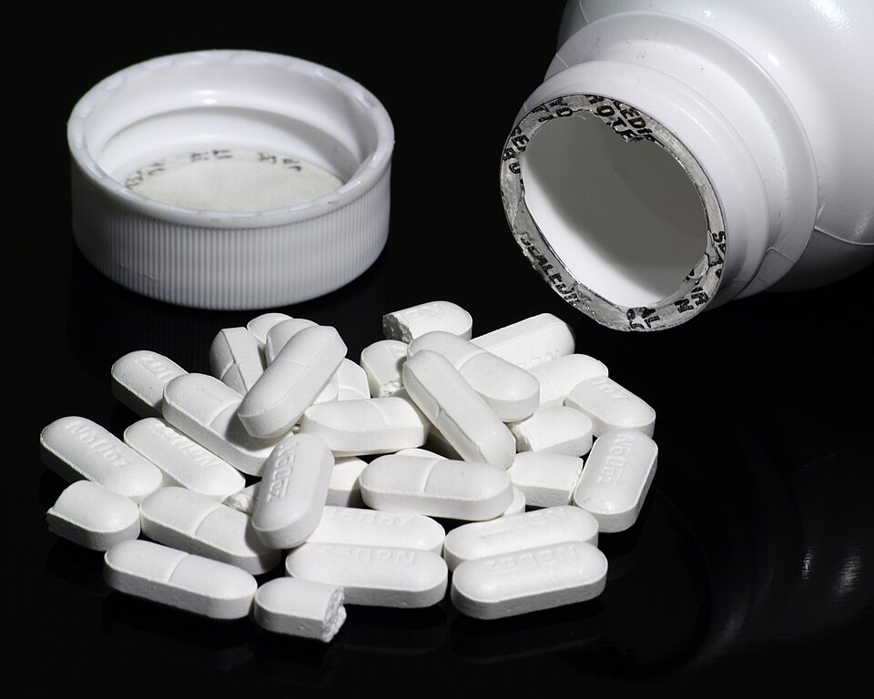
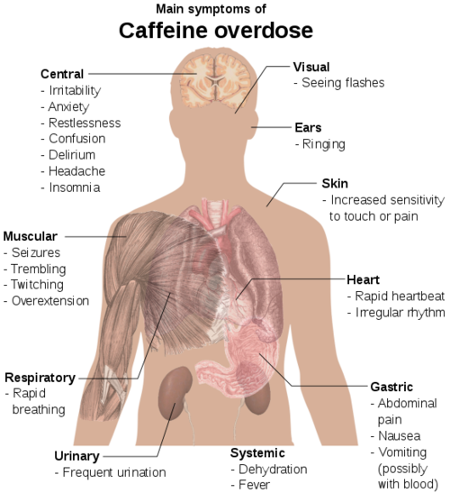

# 咖啡因

[◀返回](index.md)

| **化学信息** | 咖啡因（Caffeine）                                    |
| ------------ | ----------------------------------------------------- |
| 结构式       |                              |
| 分子式       | C8H10N4O2 |
| CAS 号       | 58-08-2                                               |
| **化学命名** |                                                       |
| 常见名称     | 咖啡因（Caffeine）、咖啡碱                            |
| 取代名称     | 1,3,7-Trimethylxanthine[^1]                           |
| 系统命名     | 1,3,7-Trimethylpurine-2,6-dione[^1]                   |
| **分类归属** |                                                       |
| 精神活性分类 | _[兴奋剂](../文档/药物分类/兴奋剂.md)_                |
| 化学分类     | _[黄嘌呤](../文档/药物分类/黄嘌呤类物质.md)_          |

| [**给药途径**](../文档/给药途径.md)      | 🔽 [口服](../文档/给药途径.md#口服) | 🔽 [鼻吸](../文档/给药途径.md#鼻吸)    | 🔽 [抽吸](../文档/给药途径.md#抽吸) |
| ---------------------------------------- | ----------------------------------- | -------------------------------------- | ----------------------------------- |
| 生物利用度                               | \~ 100%                             | 较差的水溶性极大限制了其通过鼻粘膜吸收 | 蒸汽吸入（燃烧抽吸无效）            |
| [**剂量**](../文档/给药剂量.md)          |                                     |                                        |                                     |
| [阈值](../文档/药物剂量分类.md#阈值)     | 10 mg                               | 2.5 mg                                 | 25 mg                               |
| [轻微](../文档/药物剂量分类.md#轻微)     | 20 \~ 50 mg                         | 10 \~ 25 mg                            | 25 \~ 75 mg                         |
| [中等](../文档/药物剂量分类.md#中等)     | 50 \~ 150 mg                        | 25 \~ 40 mg                            | 75 \~ 125 mg                        |
| [强烈](../文档/药物剂量分类.md#强烈)     | 150 \~ 500 mg                       | 40 \~ 80 mg                            | 125 \~ 175 mg                       |
| [严重](../文档/药物剂量分类.md#严重)     | 500 mg +                            | 80 mg +                                | 175 mg +                            |
| [**药效时长**](../文档/药效时长.md)      |                                     |                                        |                                     |
| [总时长](../文档/药效时长.md#总时长)     | 2 \~ 5 小时                         | 1 \~ 2.5 小时                          | 45 \~ 70 分钟                       |
| [药效发作](../文档/药效时长.md#药效发作) | 5 \~ 10 分钟                        | 0.5 \~ 2 分钟                          | 2 \~ 5 分钟                         |
| [药效上升](../文档/药效时长.md#药效上升) | 10 \~ 60 分钟                       | 0.5 \~ 2 分钟                          |                                     |
| [药效达峰](../文档/药效时长.md#药效达峰) | 1 \~ 2 小时                         | 0.5 \~ 1 小时                          | 10 \~ 20 分钟                       |
| [药效褪去](../文档/药效时长.md#药效褪去) | 6 \~ 10 小时                        | 6 \~ 10 小时                           | 30 \~ 45 分钟                       |
| [药效残余](../文档/药效时长.md#药效残余) | 2 \~ 4 小时                         | 6 \~ 24 小时                           | 2 \~ 4 小时                         |

| [**药物联用**](#危险的药物联用) |             |
| ------------------------------- | ----------- |
| DOx                             | ⚠️ 谨慎联用 |
| 25x-NBOMe                       | ⚠️ 谨慎联用 |
| αMT                             | ⚠️ 谨慎联用 |
| 苯环己哌啶（PCP）               | ⚠️ 谨慎联用 |
| 苯丙胺类物质                    | ⚠️ 谨慎联用 |
| MDMA                            | ⚠️ 谨慎联用 |
| 可卡因                          | ⚠️ 谨慎联用 |
| 锂                              | ⚠️ 谨慎联用 |

!!! warning "警告"

    由于个体体重、耐受性、新陈代谢和个人敏感度的差异，请务必从低剂量开始。参见[负责任的用药部分](../文档/负责任的用药索引页.md)。

!!! info "[免责声明](../关于本站/免责声明.md)"

    本站的[给药剂量](../文档/给药剂量.md)信息收集自用户和[相关资源](../文档/科学信息索引页.md)，仅供教育目的使用。这不是医疗建议，应与其他来源核实以确保准确性。

**咖啡因** 是一种天然存在的[黄嘌呤类](../文档/药物分类/黄嘌呤类物质.md) [兴奋剂](../文档/药物分类/兴奋剂.md)。它显著的效果包括[兴奋](../药效/兴奋.md)、[清醒](../药效/清醒.md)、[专注力强化](../药效/专注力强化.md)和[动机增强](../药效/动机增强.md)。它是世界上消费最广泛的[精神活性物质](../文档/药物分类/精神活性物质.md)。

咖啡因存在于某些植物的种子、叶子和果实中，数量不等，它在植物中起着天然杀虫剂的作用，还能增强授粉者的奖励记忆。[^2] [^3] [^4] 人类最常通过饮用从咖啡树种子和茶树叶子中提取的浸泡液来摄入它，也会通过各种含有可乐果衍生产品的食品和饮料摄入。

与许多其他精神活性药物不同，咖啡因在世界上几乎所有地方都是合法且不受管制的。含有咖啡因的饮料，如咖啡、茶、软饮料和能量饮料，非常受欢迎。咖啡因是世界上最常用的药物，北美 90% 的成年人每天都在使用。据估计，全球咖啡因消费量为每年 12 万吨，使其成为世界上最受欢迎的精神活性物质。这相当于每个人每天喝一杯含咖啡因的饮料。[^5]

## 历史与文化

关于喝咖啡或了解咖啡树的最早可信证据出现在 15 世纪中叶的也门苏菲派修道院中。[^6] 苏菲派僧侣喝咖啡是为了在吟诵上帝之名时帮助集中注意力，甚至达到精神上的陶醉。[^7]

咖啡因也存在于茶叶中。茶道是整个[东亚](https://en.wikipedia.org/wiki/East_Asian_tea_ceremony)（特别是[日本](https://en.wikipedia.org/wiki/Japanese_tea_ceremony)、[韩国](https://en.wikipedia.org/wiki/Korean_tea_ceremony)和其他地区）都在实行的传统习俗。

## 化学

**咖啡因** 是一种具有[取代黄嘌呤](../文档/药物分类/取代黄嘌呤类物质.md)核心的[生物碱](../文档/药物分类/生物碱类物质.md)。黄嘌呤是一种取代嘌呤，由两个稠合环组成：一个嘧啶环和一个咪唑环。嘧啶是一个六元环，在 R1 和 R3 处有氮取代基；咪唑是一个五元环，在 R1 和 R3 处有氮取代基。黄嘌呤包含双键连接到 R2 和 R6 的氧基团。咖啡因在其结构的 R1、R3 和 R7 处包含额外的甲基取代。这些基团结合在黄嘌呤骨架的开放氮基团上。它是一种非手性芳香族化合物。

咖啡因的黄嘌呤核心包含两个稠合环，一个嘧啶二酮和一个咪唑。嘧啶二酮反过来包含两个酰胺官能团，它们主要以两性离子共振形式存在，氮原子与相邻的酰胺碳原子双键连接。因此，嘧啶二酮环系统内的所有六个原子都是 sp2 杂化且平面的。因此，咖啡因的稠合 5,6 环核心总共包含 10 个 π 电子，根据休克尔规则，它是芳香族的。[^8]

纯无水咖啡因是一种味苦、白色、无味的粉末，熔点为 235 \~ 238℃。咖啡因在室温下微溶于水（2 g/100 mL），但在沸水中非常易溶（66 g/100 mL）。它也微溶于乙醇（1.5 g/100 mL）。它是弱碱性的（共轭酸的 pKa 约为 0.6），需要强酸才能使其质子化。咖啡因不包含任何立体中心，因此被归类为非手性分子。[^9]

## 药理学

在没有咖啡因且人处于清醒和警觉状态时，（中枢神经系统）神经元中存在的腺苷很少。随着持续的清醒状态，腺苷会随着时间的推移在神经元突触中积累，进而结合并激活某些中枢神经系统神经元上的腺苷受体；当这些受体被激活时，会产生细胞反应，最终增加嗜睡感。当摄入咖啡因时，它会拮抗腺苷受体；换句话说，咖啡因通过阻断腺苷与受体结合的位置，阻止腺苷激活受体。结果就是，咖啡因暂时阻止或缓解了嗜睡，从而维持或恢复了警觉性。[^10]

咖啡因的主要作用机制是作为腺苷 A1 和 A2A [受体](../文档/受体拮抗剂.md)的非选择性[拮抗剂](../文档/受体拮抗剂.md)。在清醒期间，大脑中的[神经递质](../文档/神经递质.md)腺苷水平稳步上升，引发疲劳和困倦。咖啡因分子在结构上与腺苷相似，这使其能够结合细胞表面的腺苷受体而不激活它们，从而充当竞争性抑制剂。[^11]

除此之外，咖啡因对大多数其他主要神经递质也有影响，包括[多巴胺](../文档/多巴胺.md)、[乙酰胆碱](../文档/乙酰胆碱.md)、[血清素](../文档/血清素.md)，在大剂量下还会影响[去甲肾上腺素](../文档/去甲肾上腺素.md)，[^12] 并在小程度上影响[肾上腺素](../文档/肾上腺素.md)、[谷氨酸](../文档/谷氨酸.md)和皮质醇。研究表明，咖啡因可使去甲肾上腺素增加约 75%，多巴胺增加 100%，肾上腺素增加 207%，谷氨酸增加 100%。[^13] [^14] 在超过 500 毫克的高剂量下，咖啡因会抑制 [GABA](../文档/GABA.md) 神经传递。咖啡因对 GABA 的减少会导致高剂量下的焦虑、失眠、心率和呼吸频率增加。

来自咖啡或其他饮料的咖啡因在摄入后 45 分钟内被小肠吸收，并分布到全身组织。血液浓度在 1 \~ 2 小时内达到峰值。它通过一级动力学消除。咖啡因也可以通过直肠吸收，例如麦角胺酒石酸盐和咖啡因的栓剂（用于缓解偏头痛）以及氯丁醇和咖啡因的栓剂（用于治疗剧烈呕吐）。然而，直肠吸收不如口服有效：最大浓度（Cmax）和吸收总量（AUC）都约为口服量的 30%（即 $\frac{2}{7}$）。[^15]

咖啡因是腺苷 A2A 受体的拮抗剂，敲除小鼠的研究特别指出 A2A 受体的拮抗作用是咖啡因产生促醒作用的原因。腹外侧视前区（VLPO）中 A2A 受体的拮抗作用减少了对结节乳头体核的抑制性 GABA 神经传递，这是一个组胺能投射核，其激活依赖性地促进觉醒。这种对结节乳头体核的去抑制是咖啡因产生促醒作用的下游机制。咖啡因是所有四种腺苷受体亚型（A1、A2A、A2B 和 A3）的拮抗剂，尽管效力各不相同。咖啡因对人类腺苷受体的亲和力（KD）值分别为：A1 为 12 μM，A2A 为 2.4 μM，A2B 为 13 μM，A3 为 80 μM。[^16]

|  |
| :-----------------------------------------: |
|             咖啡因代谢物放大图              |

### 代谢产物

咖啡因在肝脏中通过细胞色素 P450 氧化酶系统代谢，特别是通过 CYP1A2 同工酶，代谢成三种二甲基黄嘌呤，[^17] 每种都对身体有其自身的影响：

- 副黄嘌呤（84%）：增加脂解作用，导致血浆中甘油和游离脂肪酸水平升高。
- 可可碱（12%）：扩张血管并增加尿量。可可碱也是可可豆（也就是巧克力）中的主要[生物碱](../文档/药物分类/生物碱类物质.md)。
- 茶碱（4%）：舒张支气管平滑肌，用于治疗哮喘。然而，茶碱的治疗剂量比咖啡因代谢达到的水平要大好多倍。

## 主观效应

!!! info "[免责声明](../关于本站/免责声明.md)"

    _下列效应引用自 [**主观效应索引**](../药效/index.md)（**SEI**），这是一个基于轶事用户报告和个人分析的开放研究文献。因此，应带着健康的怀疑态度来看待它们。_

    _同样值得注意的是，这些效应不一定会以可预测或可靠的方式发生，尽管较高的剂量更可能引发全方位的效应。同样，**不良反应** 随着剂量的增加变得越来越可能，可能包括 **成瘾、严重伤害或死亡** ☠。_

- ### **[躯体效应](../药效/躯体效应.md)** 
    - **[兴奋](../药效/兴奋.md)**：据报道，咖啡因具有轻微到中等的活力和刺激感，与传统的娱乐性兴奋剂（如[苯丙胺](苯丙胺.md)、[MDMA](MDMA.md) 或[可卡因](可卡因.md)）相比，其强度要弱得多。这鼓励了诸如做家务和重复性任务之类的身体活动，否则这些活动会很无聊和费力。咖啡因呈现的特定刺激风格可以描述为“强迫性的”。这意味着在较高剂量下，随着下颌紧咬、不自主的身体抖动和振动出现，很难或不可能保持静止，导致全身剧烈颤抖、双手不稳和普遍缺乏运动控制。
    - **[身体欣快感](../药效/躯体欣快感.md)**：据报道，咖啡因会在非耐受用户中产生非常轻微的身体欣快感，特别是当他们已经休息得很好的时候。
    - **[食欲抑制](../药效/食欲抑制.md)**
    - **[支气管扩张](../药效/支气管扩张.md)**：咖啡因是一种有效的支气管扩张剂。在对患有哮喘的成年人进行的临床测试中，在相当低的剂量下（低于 5mg/kg 体重），咖啡因已被证明能提供肺功能的小幅改善。[^18]
    - **[头晕](../药效/头晕.md)**：除非剂量过高或在疲劳或低血糖时服用，否则这种效应并不常见。
    - **[尿频](../药效/尿频.md)**：当给前几天没有摄入咖啡因的人服用相当于 2 \~ 3 杯咖啡的咖啡因剂量时，他们的尿量会轻微增加。[^19] 然而，大多数摄入咖啡因的人每天都在摄入。经常使用咖啡因的人已被证明对利尿作用产生了很强的耐受性。[^19]
    - **[头痛](../药效/头痛.md)** 和 **头痛抑制**：咖啡因在轻微和常规剂量下可以抑制头痛，但在较高剂量下可能会引起头痛。这可能是因为它同时具有[血管收缩](../药效/血管扩张.md)和[血管扩张](../药效/血管扩张.md)的作用。
    - **[血压升高](../药效/血压升高.md)**[^20]
    - **[心率增快](../药效/心率增快.md)**[^21]
    - **[出汗增加](../药效/出汗增加.md)**
    - **[恶心](../药效/恶心.md)**：据报道，中度到极度的恶心会发生，通常是在较高剂量下。
    - **[耐力增强](../药效/耐力增强.md)**：与其他[兴奋剂](../文档/药物分类/兴奋剂.md)（如[苯丙胺](苯丙胺.md)）相比，这种效应相对温和。
    - **[触觉增强](../药效/触觉增强.md)**
    - **[磨牙](../药效/磨牙.md)**：这种效应不像在其他[兴奋剂](../文档/药物分类/兴奋剂.md)（如[苯丙胺](苯丙胺.md)或 [MDMA](MDMA.md)）上那样持续发生。
    - **[血管收缩](../药效/血管收缩.md)**[^22] 和 **[血管扩张](../药效/血管扩张.md)**[^23]：虽然咖啡因充当轻微的血管收缩剂，但其代谢物可可碱是一种血管扩张剂，这些效应被认为会相互抵消。

- ### **[认知效应](../药效/认知效应.md)** 

    虽然副作用在低到中等剂量下通常很轻微，但在较高剂量或长时间使用时，它们越来越可能表现出来。这在体验的消退期尤其如此。

    最突出的这些认知效应通常包括：

    - **[分析能力增强](../药效/分析能力增强.md)**
    - **[焦虑](../药效/焦虑.md)**
    - **[认知欣快](../药效/认知欣快.md)**：当这种效应发生时，与大多数精神活性[兴奋剂](../文档/药物分类/兴奋剂.md)相比通常是温和的，通常只发生在耐受性低的人身上。
    - **[认知不快](../药效/认知不快.md)**：这种效应通常只在极高剂量下发生。
    - **[强迫性补量](../药效/强迫性补量.md)**：这种效应不如[尼古丁](尼古丁.md)或[可卡因](可卡因.md)那样持久。
    - **[自我膨胀](../药效/自我膨胀.md)**
    - **[专注力强化](../药效/专注力强化.md)**：这个成分在低到中等剂量下最有效，因为任何更高的剂量通常都会损害注意力。
    - **[性欲增强](../药效/性欲增强.md)**
    - **[音乐欣赏能力增强](../药效/音乐欣赏能力增强.md)**：虽然咖啡因能够产生这种效果，但并不像传统[兴奋剂](../文档/药物分类/兴奋剂.md)或[共情剂](../文档/药物分类/共情剂.md)那样可靠。
    - **[易怒](../药效/易怒.md)**
    - **[记忆增强](../药效/记忆增强.md)**
    - **[动机增强](../药效/动机增强.md)**
    - **[思维加速](../药效/思维加速.md)**
    - **[清醒](../药效/清醒.md)**

- ### **药效残余** 

    在[兴奋剂](../文档/药物分类/兴奋剂.md)体验的[药效褪去](../文档/药效时长.md#Offset)期间发生的效果，与[药效达峰](../文档/药效时长.md#Peak)期间发生的效果相比，通常感觉消极和不舒服。咖啡因阻断腺苷[受体](../文档/受体拮抗剂.md)，这导致腺苷在其[药效达峰](../文档/药效时长.md#Peak)期间积聚。在[药效褪去](../文档/药效时长.md#Offset)体验期间，积聚的腺苷以比平时更高的强度激活先前被阻断的受体，导致许多不愉快的效应。这通常被称为“下头”（comedown）。与[多巴胺能](../文档/多巴胺.md)[兴奋剂](../文档/药物分类/兴奋剂.md)（如[苯丙胺](苯丙胺.md)和[可卡因](可卡因.md)）相比，咖啡因的下头通常不那么强烈。其效应通常包括：
    
    - **[焦虑](../药效/焦虑.md)**
    - **[认知疲劳](../药效/认知疲劳.md)**
    - **[抑郁](../药效/抑郁.md)**
    - **[易怒](../药效/易怒.md)**
    - **[动力抑制](../药效/动力抑制.md)**
    - **[思维减速](../药效/思维减速.md)**
    - **[清醒](../药效/清醒.md)**

### 体验报告

目前我们的[报告索引](../报告/index.md)中没有关于该物质效果的体验报告。你可以在[本站 Github 仓库](https://github.com/SalviaSWC/FreeODwiki)提交你自己的体验报告。

其他的体验报告可以在这里找到：

- PsychonautWiki：
    1. [Experience:Caffeine (1G, oral) - Not doing that again](https://psychonautwiki.org/wiki/Experience:Caffeine_%281G,_oral%29_-_Not_doing_that_again)
    2. [Experience:Caffeine (~125 mg) + Nicotine (4.5 mg) - Essential performance boost](https://psychonautwiki.org/wiki/Experience:Caffeine_%28~125_mg%29_%2B_Nicotine_%284.5_mg%29_-_Essential_performance_boost)
    3. [Experience:Caffeine - very high dose](https://psychonautwiki.org/wiki/Experience:Caffeine_-_very_high_dose)
- [Erowid Experience Vaults: Caffeine](https://www.erowid.org/experiences/subs/exp_Caffeine.shtml)

## 形式

|  |
| :--------------------------------------------------------------------------------------------------------------------------------: |
|                                   NoDoz 咖啡因片，每片含 200 mg 咖啡因，由诺华消费者健康公司分销                                   |

咖啡因不仅存在于咖啡和茶中，还存在于现成的形式中，如药用级咖啡因片（有时还有[咖啡因贴片](https://en.wikipedia.org/wiki/Caffeine_patch)），使其成为一种广泛获得的兴奋剂。

## 毒性与危害潜力

咖啡因并未被发现会导致脑损伤，相对于剂量而言，其毒性极低。与咖啡因接触相关的身体副作用相对较少。各种研究表明，在适当的背景下以合理的剂量使用，它不会产生任何类型的负面认知、精神或有毒的身体后果。

### 致死剂量

极端过量可能导致死亡。[^24] [^25] 大鼠口服的 LD50（半数致死量）为 192 mg/kg。人类咖啡因的 LD50 取决于个人敏感度，但估计约为 150 \~ 200 mg/kg，或普通成年人大约 80 至 100 杯咖啡。[^26] 虽然通过普通咖啡达到咖啡因的致死剂量很困难，但通过咖啡因药丸或干粉摄入更容易达到高剂量，而且在代谢咖啡因能力受损的个体中，致死剂量可能更低。

|  |
| :-----------------------------------------------------------------------------------------------------------------------------------------: |
|                                                            咖啡因过量的主要症状                                                             |

### 焦虑障碍

[咖啡因诱发的焦虑障碍](https://en.wikipedia.org/wiki/Caffeine-induced_anxiety_disorder)是一种由过量摄入咖啡因引发或加剧焦虑症状的状况。高摄入量（> 400mg）可能导致恐慌发作，特别是在易感人群中，并可能使现有的焦虑症恶化。[^27]

### 睡眠障碍

[咖啡因诱发的睡眠障碍](https://en.wikipedia.org/wiki/Caffeine-induced_sleep_disorder)是一种由于过量摄入兴奋剂咖啡因导致的精神疾病。

### 依赖性与滥用潜力

[咖啡因依赖](https://en.wikipedia.org/wiki/Caffeine_dependence)可能随着经常食用而发展，导致渴望，并在突然停止时产生[戒断效应](../文档/药物戒断反应.md)，但滥用潜力较低。虽然与其他物质相比，它的滥用潜力较低，但习惯性使用者可能会因为这些依赖相关的效应而难以戒烟。

长期和反复使用会对咖啡因的许多效应产生耐受性。这导致使用者必须服用越来越大的剂量才能达到相同的效果。耐受性形成后，大约需要 3 \~ 7 天才能将耐受性减少一半，1 \~ 2 周才能恢复到基线（在不再进一步摄入的情况下）。咖啡因与腺苷受体拮抗剂存在交叉耐受性，这意味着在摄入咖啡因后，某些[兴奋剂](../文档/药物分类/兴奋剂.md)如[苦茶碱](苦茶碱.md)和可可碱的效果会降低。

#### 咖啡因中毒

[咖啡因中毒](https://en.wikipedia.org/wiki/Caffeinism)是由于过量摄入咖啡因引起的中毒状态。当一个人从任何来源摄入大量咖啡因（例如，一次超过 400 \~ 500 mg）时，这种综合症经常发生。

#### 戒断症状

戒断症状——包括头痛、易怒、无法集中注意力、嗜睡、失眠以及胃部、上半身和关节疼痛——可能在停止摄入咖啡因后 12 到 24 小时内出现，在约 48 小时达到高峰，通常持续 2 到 9 天。[^28] 52% 的人在停止摄入咖啡因两天后会出现戒断性头痛，在此之前他们平均每天摄入 235 mg 咖啡因。[^29] 在长期饮用咖啡的人群中，也有报道出现抑郁和焦虑增加、恶心、呕吐、身体疼痛和对含咖啡因饮料的强烈渴望等症状。同伴的知识、支持和互动可能有助于戒断。

### 精神病

主条目：[兴奋剂精神病](../文档/兴奋剂精神病.md)

[咖啡因诱发的精神病](https://en.wikipedia.org/wiki/Caffeine-induced_psychosis)虽然罕见，但可能在高剂量或长期滥用时发生。它可以诱发健康人的[精神病](../药效/精神病发作.md)，并使精神分裂症患者的病情恶化。[^30] [^31] 研究表明，咖啡因可以增强[甲基苯丙胺](甲基苯丙胺.md)的作用，这也可以诱发精神病。[^32] [^33]

### 危险的药物联用

!!! warning "警告"

    _许多精神活性物质在单独使用时相对安全，但与某些其他物质联用可能会突然变得危险甚至危及生命。_

    _请务必进行独立研究（例如 [Google](https://www.google.com)、[DuckDuckGo](https://www.duckduckgo.com)、[PubMed](https://pubmed.ncbi.nlm.nih.gov/)），确保多种物质的组合是安全的。部分列出的相互作用来自 [TripSit](https://combo.tripsit.me)。_

- **DOx**：高剂量的咖啡因可能会引起焦虑，这在致幻旅程中较难控制，而且由于两者都有刺激性，可能会引起一些身体不适。
- **25x-NBOMe**：咖啡因可能会激发迷幻药物的自然刺激作用，使其变得不舒服。高剂量可能会引起在致幻旅程中难以处理的焦虑。
- **αMT**：高剂量的咖啡因可能会引起焦虑，这在致幻旅程中较难控制，而且由于两者都有刺激性，这种组合可能会引起一些身体不适。
- **苯环己哌啶（PCP）**：这种组合的细节尚不清楚，但 PCP 通常以不可预测的方式相互作用。
- **苯丙胺类物质**：这种兴奋剂的组合通常是不必要的，并且可能会增加心脏负担，以及可能引起焦虑和更大的身体不适。
- **MDMA**：咖啡因与 MDMA 一起使用并不是真的必要，并且会增加 MDMA 的任何神经毒性作用。
- **可卡因**：两者都是兴奋剂，有心动过速、高血压的风险，极少数情况下会导致心力衰竭。

## 法律地位

咖啡因在世界几乎所有地方都是合法的。然而，因为它是一种精神活性物质，所以经常受到管制。

- **中国大陆**：对咖啡因实行「分类分级管制」的特殊模式，将高纯度化工合成咖啡因/单方制剂列为第二类精神药品进行严格管控，而天然植物中自然含有的咖啡因（咖啡、茶叶等）以及通过天然浸出液提取的咖啡因则未纳入同等强度的管制范围，同时仅允许可乐型碳酸饮料以食品添加剂形式限量使用提纯咖啡因。
- **美国**：食品和药物管理局（FDA）限制饮料中的咖啡因含量不得超过 0.02%。[^34] 除非它们被列为膳食补充剂。[^35]

## 另见

- [负责任的用药](../文档/负责任的用药索引页.md)
- [兴奋剂](../文档/药物分类/兴奋剂.md)
- [益智药](../文档/药物分类/益智药.md)
- [黄嘌呤类](../文档/药物分类/黄嘌呤类物质.md)
- 可可碱
- [8-氯茶碱](8-氯茶碱.md)

## 外部链接

- [Caffeine (Wikipedia)](https://en.wikipedia.org/wiki/Caffeine)
- [Caffeine (PsychonautWiki)](https://psychonautwiki.org/wiki/Caffeine)
- [Caffeine (Erowid Vault)](https://erowid.org/chemicals/caffeine/)
- [Caffeine (Isomer Design)](https://isomerdesign.com/PiHKAL/explore.php?id=3743)
- [Caffeine (DrugBank)](https://go.drugbank.com/drugs/DB00201)
- [Caffeine (Drugs-Forum)](https://drugs-forum.com/wiki/Caffeine)
- [Caffeine (Drugs.com)](https://www.drugs.com/caffeine.html)

## 文献

- Nehlig, A., Daval, J. L., & Debry, G. (1992). Caffeine and the central nervous system: mechanisms of action, biochemical, metabolic and psychostimulant effects. Brain Research Reviews, 17(2), 139-170. PMID: 1356551

## 参考资料

[^1]: PubChem, [Caffeine](https://pubchem.ncbi.nlm.nih.gov/compound/2519)

[^2]: Ashihara, H. (2004). ["Distribution and biosynthesis of caffeine in plants"](https://imrpress.com/journal/FBL/9/2/10.2741/1367). _Frontiers in Bioscience_. **9** (1–3): 1864. [doi](http://en.wikipedia.org/wiki/Digital_object_identifier 'wikipedia:Digital object identifier'):[10.2741/1367](..//doi.org/10.2741%2F1367). [ISSN](http://en.wikipedia.org/wiki/International_Standard_Serial_Number 'wikipedia:International Standard Serial Number') [1093-9946](..//www.worldcat.org/issn/1093-9946).

[^3]: Nathanson, J. A. (12 October 1984). ["Caffeine and Related Methylxanthines: Possible Naturally Occurring Pesticides"](https://www.science.org/doi/10.1126/science.6207592). _Science_. **226** (4671): 184–187. [doi](http://en.wikipedia.org/wiki/Digital_object_identifier 'wikipedia:Digital object identifier'):[10.1126/science.6207592](..//doi.org/10.1126%2Fscience.6207592). [ISSN](http://en.wikipedia.org/wiki/International_Standard_Serial_Number 'wikipedia:International Standard Serial Number') [0036-8075](..//www.worldcat.org/issn/0036-8075).

[^4]: Wright, G. A., Baker, D. D., Palmer, M. J., Stabler, D., Mustard, J. A., Power, E. F., Borland, A. M., Stevenson, P. C. (8 March 2013). ["Caffeine in Floral Nectar Enhances a Pollinator's Memory of Reward"](https://www.science.org/doi/10.1126/science.1228806). _Science_. **339** (6124): 1202–1204. [doi](http://en.wikipedia.org/wiki/Digital_object_identifier 'wikipedia:Digital object identifier'):[10.1126/science.1228806](..//doi.org/10.1126%2Fscience.1228806). [ISSN](http://en.wikipedia.org/wiki/International_Standard_Serial_Number 'wikipedia:International Standard Serial Number') [0036-8075](..//www.worldcat.org/issn/0036-8075).

[^5]: What's your poison? Caffeine | <http://www.abc.net.au/quantum/poison/caffeine/caffeine.htm>

[^6]: Weinberg, Bennett Alan; Bealer, Bonnie K. (2001). [_The world of caffeine_](https://books.google.com/books?id=Qyz5CnOaH9oC&q=coffee+goat+ethiopia+Kaldi&pg=PA3). Routledge. pp. 3–4. [ISBN](http://en.wikipedia.org/wiki/International_Standard_Book_Number 'wikipedia:International Standard Book Number') [978-0-415-92723-9](http://en.wikipedia.org/wiki/Special:BookSources/978-0-415-92723-9 'wikipedia:Special:BookSources/978-0-415-92723-9').

[^7]: McHugo, John (18 April 2013). ["How a drink downed by Arab mystics went global"](http://www.bbc.com/news/magazine-22190802). _BBC News_.

[^8]: Keskineva N., [_Chemistry of Caffeine_](https://www.yumpu.com/en/document/view/39758795/chemistry-of-caffeine-quantum-east-stroudsburg-university), East Stroudsburg University

[^9]: Vallombroso, T. (2001). _Organic chemistry: pearls of wisdom_. Boston Medical Pub. [ISBN](http://en.wikipedia.org/wiki/International_Standard_Book_Number 'wikipedia:International Standard Book Number') [9781584090168](http://en.wikipedia.org/wiki/Special:BookSources/9781584090168 'wikipedia:Special:BookSources/9781584090168').

[^10]: "Caffeine". _DrugBank_. University of Alberta. 16 September 2013. Retrieved 8 August 2014.

[^11]: Fisone, G., Borgkvist, A., Usiello, A. (1 April 2004). ["Caffeine as a psychomotor stimulant: mechanism of action"](https://doi.org/10.1007/s00018-003-3269-3). _Cellular and Molecular Life Sciences CMLS_. **61** (7): 857–872. [doi](http://en.wikipedia.org/wiki/Digital_object_identifier 'wikipedia:Digital object identifier'):[10.1007/s00018-003-3269-3](..//doi.org/10.1007%2Fs00018-003-3269-3). [ISSN](http://en.wikipedia.org/wiki/International_Standard_Serial_Number 'wikipedia:International Standard Serial Number') [1420-9071](..//www.worldcat.org/issn/1420-9071).

[^12]: [_Caffeine & Neurotransmitters – WORLD OF CAFFINE_](https://worldofcaffeine.com/caffeine-and-neurotransmitters/)

[^13]: <https://www.nejm.org/doi/full/10.1056/NEJM197801262980403>

[^14]: <https://www.jneurosci.org/content/22/15/6321>

[^15]: Teekachunhatean, S., Tosri, N., Rojanasthien, N., Srichairatanakool, S., Sangdee, C. (4 March 2013). ["Pharmacokinetics of Caffeine following a Single Administration of Coffee Enema versus Oral Coffee Consumption in Healthy Male Subjects"](https://www.hindawi.com/journals/isrn/2013/147238/). _ISRN Pharmacology_. **2013**: 1–7. [doi](http://en.wikipedia.org/wiki/Digital_object_identifier 'wikipedia:Digital object identifier'):[10.1155/2013/147238](..//doi.org/10.1155%2F2013%2F147238). [ISSN](http://en.wikipedia.org/wiki/International_Standard_Serial_Number 'wikipedia:International Standard Serial Number') [2090-5173](..//www.worldcat.org/issn/2090-5173).

[^16]: Froestl, W., Muhs, A., Pfeifer, A. (14 November 2012). ["Cognitive Enhancers (Nootropics). Part 1: Drugs Interacting with Receptors"](https://www.medra.org/servlet/aliasResolver?alias=iospress&doi=10.3233/JAD-2012-121186). _Journal of Alzheimer’s Disease_. **32** (4): 793–887. [doi](http://en.wikipedia.org/wiki/Digital_object_identifier 'wikipedia:Digital object identifier'):[10.3233/JAD-2012-121186](..//doi.org/10.3233%2FJAD-2012-121186). [ISSN](http://en.wikipedia.org/wiki/International_Standard_Serial_Number 'wikipedia:International Standard Serial Number') [1875-8908](..//www.worldcat.org/issn/1875-8908).

[^17]: The Pharmacogenetics and Pharmacogenomics Knowledge Base | <https://www.pharmgkb.org/drug/PA448710#biotransformation>

[^18]: Welsh, E. J., Bara, A., Barley, E., Cates, C. J. (20 January 2010). Cochrane Airways Group, ed. ["Caffeine for asthma"](https://doi.wiley.com/10.1002/14651858.CD001112.pub2). _Cochrane Database of Systematic Reviews_. [doi](http://en.wikipedia.org/wiki/Digital_object_identifier 'wikipedia:Digital object identifier'):[10.1002/14651858.CD001112.pub2](..//doi.org/10.1002%2F14651858.CD001112.pub2). [ISSN](http://en.wikipedia.org/wiki/International_Standard_Serial_Number 'wikipedia:International Standard Serial Number') [1465-1858](..//www.worldcat.org/issn/1465-1858).

[^19]: Maughan, R. J., Griffin, J. (December 2003). ["Caffeine ingestion and fluid balance: a review"](http://doi.wiley.com/10.1046/j.1365-277X.2003.00477.x). _Journal of Human Nutrition and Dietetics_. **16** (6): 411–420. [doi](http://en.wikipedia.org/wiki/Digital_object_identifier 'wikipedia:Digital object identifier'):[10.1046/j.1365-277X.2003.00477.x](..//doi.org/10.1046%2Fj.1365-277X.2003.00477.x). [ISSN](http://en.wikipedia.org/wiki/International_Standard_Serial_Number 'wikipedia:International Standard Serial Number') [0952-3871](..//www.worldcat.org/issn/0952-3871).

[^20]: Nurminen, M. L., Niittynen, L., Korpela, R., Vapaatalo, H. (November 1999). "Coffee, caffeine and blood pressure: a critical review". _European Journal of Clinical Nutrition_. **53** (11): 831–839. [doi](http://en.wikipedia.org/wiki/Digital_object_identifier 'wikipedia:Digital object identifier'):[10.1038/sj.ejcn.1600899](..//doi.org/10.1038%2Fsj.ejcn.1600899). [ISSN](http://en.wikipedia.org/wiki/International_Standard_Serial_Number 'wikipedia:International Standard Serial Number') [0954-3007](..//www.worldcat.org/issn/0954-3007).

[^21]: Green, P. J., Suls, J. (1 April 1996). ["The effects of caffeine on ambulatory blood pressure, heart rate, and mood in coffee drinkers"](https://doi.org/10.1007/BF01857602). _Journal of Behavioral Medicine_. **19** (2): 111–128. [doi](http://en.wikipedia.org/wiki/Digital_object_identifier 'wikipedia:Digital object identifier'):[10.1007/BF01857602](..//doi.org/10.1007%2FBF01857602). [ISSN](http://en.wikipedia.org/wiki/International_Standard_Serial_Number 'wikipedia:International Standard Serial Number') [1573-3521](..//www.worldcat.org/issn/1573-3521).

[^22]: Addicott, M. A., Yang, L. L., Peiffer, A. M., Burnett, L. R., Burdette, J. H., Chen, M. Y., Hayasaka, S., Kraft, R. A., Maldjian, J. A., Laurienti, P. J. (13 February 2009). ["The effect of daily caffeine use on cerebral blood flow: How much caffeine can we tolerate?"](https://www.ncbi.nlm.nih.gov/pmc/articles/PMC2748160/). _Human Brain Mapping_. **30** (10): 3102–3114. [doi](http://en.wikipedia.org/wiki/Digital_object_identifier 'wikipedia:Digital object identifier'):[10.1002/hbm.20732](..//doi.org/10.1002%2Fhbm.20732). [ISSN](http://en.wikipedia.org/wiki/International_Standard_Serial_Number 'wikipedia:International Standard Serial Number') [1065-9471](..//www.worldcat.org/issn/1065-9471).

[^23]: Bogaard, B. van den, Draijer, R., Westerhof, B. E., Meiracker, A. H. van den, Montfrans, G. A. van, Born, B.-J. H. van den (November 2010). ["Effects on Peripheral and Central Blood Pressure of Cocoa With Natural or High-Dose Theobromine"](https://www.ahajournals.org/doi/full/10.1161/HYPERTENSIONAHA.110.158139). _Hypertension_. **56** (5): 839–846. [doi](http://en.wikipedia.org/wiki/Digital_object_identifier 'wikipedia:Digital object identifier'):[10.1161/HYPERTENSIONAHA.110.158139](..//doi.org/10.1161%2FHYPERTENSIONAHA.110.158139).

[^24]: Holmgren, P., Nordén-Pettersson, L., Ahlner, J. (January 2004). ["Caffeine fatalities—four case reports"](https://linkinghub.elsevier.com/retrieve/pii/S0379073803004171). _Forensic Science International_. **139** (1): 71–73. [doi](http://en.wikipedia.org/wiki/Digital_object_identifier 'wikipedia:Digital object identifier'):[10.1016/j.forsciint.2003.09.019](..//doi.org/10.1016%2Fj.forsciint.2003.09.019). [ISSN](http://en.wikipedia.org/wiki/International_Standard_Serial_Number 'wikipedia:International Standard Serial Number') [0379-0738](..//www.worldcat.org/issn/0379-0738).

[^25]: Alstott, R. L., Miller, A. J., Forney, R. B. (April 1973). "Report of a human fatality due to caffeine". _Journal of Forensic Sciences_. **18** (2): 135–137. [ISSN](http://en.wikipedia.org/wiki/International_Standard_Serial_Number 'wikipedia:International Standard Serial Number') [0022-1198](..//www.worldcat.org/issn/0022-1198).

[^26]: Peters, J. M. (6 May 1967). ["Factors Affecting Caffeine Toxicity: A Review of the Literature"](https://onlinelibrary.wiley.com/doi/10.1002/j.1552-4604.1967.tb00034.x). _The Journal of Clinical Pharmacology and The Journal of New Drugs_. **7** (3): 131–141. [doi](http://en.wikipedia.org/wiki/Digital_object_identifier 'wikipedia:Digital object identifier'):[10.1002/j.1552-4604.1967.tb00034.x](..//doi.org/10.1002%2Fj.1552-4604.1967.tb00034.x). [ISSN](http://en.wikipedia.org/wiki/International_Standard_Serial_Number 'wikipedia:International Standard Serial Number') [0095-9863](..//www.worldcat.org/issn/0095-9863).

[^27]: Klevebrant, Lisa; Frick, Andreas (2022-01-01). "Effects of caffeine on anxiety and panic attacks in patients with panic disorder: A systematic review and meta-analysis". _General Hospital Psychiatry_ (in English). **74**: 22–31. [doi](http://en.wikipedia.org/wiki/Digital_object_identifier 'wikipedia:Digital object identifier'):[10.1016/j.genhosppsych.2021.11.005](..//doi.org/10.1016%2Fj.genhosppsych.2021.11.005) . [ISSN](http://en.wikipedia.org/wiki/International_Standard_Serial_Number 'wikipedia:International Standard Serial Number') [0163-8343](..//www.worldcat.org/issn/0163-8343). [PMID](http://en.wikipedia.org/wiki/PubMed_Identifier 'wikipedia:PubMed Identifier') [34871964](..//www.ncbi.nlm.nih.gov/pubmed/34871964).

[^28]: Juliano, L. M., Griffiths, R. R. (October 2004). ["A critical review of caffeine withdrawal: empirical validation of symptoms and signs, incidence, severity, and associated features"](http://link.springer.com/10.1007/s00213-004-2000-x). _Psychopharmacology_. **176** (1): 1–29. [doi](http://en.wikipedia.org/wiki/Digital_object_identifier 'wikipedia:Digital object identifier'):[10.1007/s00213-004-2000-x](..//doi.org/10.1007%2Fs00213-004-2000-x). [ISSN](http://en.wikipedia.org/wiki/International_Standard_Serial_Number 'wikipedia:International Standard Serial Number') [0033-3158](..//www.worldcat.org/issn/0033-3158).

[^29]: Silverman, K., Evans, S. M., Strain, E. C., Griffiths, R. R. (15 October 1992). ["Withdrawal Syndrome after the Double-Blind Cessation of Caffeine Consumption"](https://doi.org/10.1056/NEJM199210153271601). _New England Journal of Medicine_. **327** (16): 1109–1114. [doi](http://en.wikipedia.org/wiki/Digital_object_identifier 'wikipedia:Digital object identifier'):[10.1056/NEJM199210153271601](..//doi.org/10.1056%2FNEJM199210153271601). [ISSN](http://en.wikipedia.org/wiki/International_Standard_Serial_Number 'wikipedia:International Standard Serial Number') [0028-4793](..//www.worldcat.org/issn/0028-4793).

[^30]: Hedges, D. W., Woon, F. L., Hoopes, S. P. (March 2009). "Caffeine-induced psychosis". _CNS spectrums_. **14** (3): 127–129. [doi](http://en.wikipedia.org/wiki/Digital_object_identifier 'wikipedia:Digital object identifier'):[10.1017/s1092852900020101](..//doi.org/10.1017%2Fs1092852900020101). [ISSN](http://en.wikipedia.org/wiki/International_Standard_Serial_Number 'wikipedia:International Standard Serial Number') [1092-8529](..//www.worldcat.org/issn/1092-8529).

[^31]: Cerimele, J. M., Stern, A. P., Jutras-Aswad, D. (March 2010). ["Psychosis Following Excessive Ingestion of Energy Drinks in a Patient With Schizophrenia"](https://ajp.psychiatryonline.org/doi/abs/10.1176/appi.ajp.2009.09101456). _American Journal of Psychiatry_. **167** (3): 353–353. [doi](http://en.wikipedia.org/wiki/Digital_object_identifier 'wikipedia:Digital object identifier'):[10.1176/appi.ajp.2009.09101456](..//doi.org/10.1176%2Fappi.ajp.2009.09101456). [ISSN](http://en.wikipedia.org/wiki/International_Standard_Serial_Number 'wikipedia:International Standard Serial Number') [0002-953X](..//www.worldcat.org/issn/0002-953X).

[^32]: Kuribara, H. (October 1994). "Caffeine enhances the stimulant effect of methamphetamine, but may not affect induction of methamphetamine sensitization of ambulation in mice". _Psychopharmacology_. **116** (2): 125–129. [doi](http://en.wikipedia.org/wiki/Digital_object_identifier 'wikipedia:Digital object identifier'):[10.1007/BF02245053](..//doi.org/10.1007%2FBF02245053). [ISSN](http://en.wikipedia.org/wiki/International_Standard_Serial_Number 'wikipedia:International Standard Serial Number') [0033-3158](..//www.worldcat.org/issn/0033-3158).

[^33]: Fujii, W., Kuribara, H., Tadokoro, S. (June 1989). "Interaction between caffeine and methamphetamine by means of ambulatory activity in mice". _Yakubutsu, Seishin, Kodo = Japanese Journal of Psychopharmacology_. **9** (2): 225–231. [ISSN](http://en.wikipedia.org/wiki/International_Standard_Serial_Number 'wikipedia:International Standard Serial Number') [0285-5313](..//www.worldcat.org/issn/0285-5313).

[^34]: [_CFR - Code of Federal Regulations Title 21_](https://www.accessdata.fda.gov/scripts/cdrh/cfdocs/cfCFR/CFRSearch.cfm?fr=182.1180&SearchTerm=caffeine)

[^35]: Consumer Q&A: Caffeine-Containing Dietary Supplements | <http://crnusa.org/caffeine/Q+A.html>
