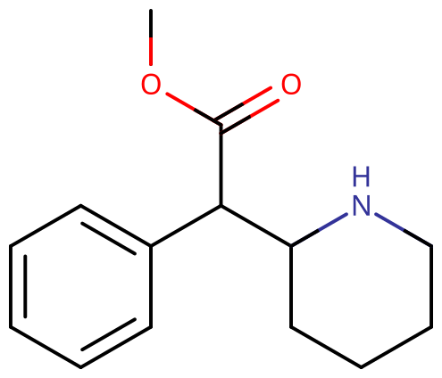

# 哌甲酯

[◀返回](index.md)

!!! quote " "

    上生物课中，讲到神经调节......

    生物老师（_敲黑板_）：这是可卡因，会抑制多巴胺转运体，导致多巴胺浓度异常升高，属于毒品！同学们珍爱生命远离毒品哈

    过了一会儿……

    生物老师（_若有所思_）：这是哌甲酯，是聪明药！毕竟就算你熬夜刷题，突触不兴奋也没有用哈。我们医学系的学生，每逢期末考试，经常给自己开一瓶哌甲酯用来刷题，很管用！

| **化学信息** | 哌甲酯（Methylphenidate）                                   |
| ------------ | ----------------------------------------------------------- |
| 结构式       |                             |
| 分子式       | C14H19NO2                  |
| CAS 号       | 113-45-1 298-59-9（盐酸盐）                              |
| **化学命名** |                                                             |
| 常见名称     | 哌甲酯（Methylphenidate）、MPH、MPD、哌醋甲酯               |
| 商品名       | 利他林（Ritalin，速释）、专注达（Concerta，缓释）、Methylin |
| 系统命名     | Methyl 2-phenyl-2-piperidin-2-ylacetate                     |
| **类别归属** |                                                             |
| 精神活性类别 | _[兴奋剂](../文档/药物分类/兴奋剂.md)_                      |
| 化学类别     | _[苄基哌啶类物质](../文档/药物分类/苄基哌啶类物质.md)_      |

| [**给药途径**](../文档/给药途径.md)      | 🔽 [口服](../文档/给药途径.md#口服) | 🔽 [鼻吸](../文档/给药途径.md#鼻吸) |
| ---------------------------------------- | ----------------------------------- | ----------------------------------- |
| 生物利用度                               | 11 \~ 52%[^1]                       |                                     |
| [**给药剂量**](../文档/给药剂量.md)      |                                     |                                     |
| [阈值](../文档/药物剂量分类.md#阈值)     | 5 mg                                | 1 mg                                |
| [轻微](../文档/药物剂量分类.md#轻微)     | 10 \~ 20 mg                         | 2 \~ 10 mg                          |
| [中等](../文档/药物剂量分类.md#中等)     | 20 \~ 40 mg                         | 10 \~ 30 mg                         |
| [强烈](../文档/药物剂量分类.md#强烈)     | 40 \~ 60 mg                         | 30 \~ 60 mg                         |
| [严重](../文档/药物剂量分类.md#严重)     | 60 mg +                             | 60 mg +                             |
| [**药效时长**](../文档/药效时长.md)      |                                     |                                     |
| [总时长](../文档/药效时长.md#总时长)     | 2.5 \~ 4 小时                       | 2 \~ 4 小时                         |
| [药效发作](../文档/药效时长.md#药效发作) | 30 \~ 60 分钟                       | 5 \~ 20 分钟                        |
| [药效上升](../文档/药效时长.md#药效上升) | 20 \~ 45 分钟                       | 15 \~ 40 分钟                       |
| [药效达峰](../文档/药效时长.md#药效达峰) | 60 \~ 90 分钟                       | 30 \~ 45 分钟                       |
| [药效褪去](../文档/药效时长.md#药效褪去) | 45 \~ 60 分钟                       | 2 \~ 4 小时                         |
| [药效残余](../文档/药效时长.md#药效残余) | 2 \~ 6 小时                         | 1 \~ 4 小时                         |

| [**药物联用**](#危险的相互作用) |             |
| ------------------------------- | ----------- |
| 酒精                            | ⚠️ 谨慎联用 |
| MXE                             | ⛔ 严禁联用 |
| 解离剂                          | ⚠️ 谨慎联用 |
| DXM                             | 💔 联用危险 |
| MDMA                            | 💔 联用危险 |
| 兴奋剂                          | 💔 联用危险 |
| 25x-NBOMe                       | 💔 联用危险 |
| 25x-NBOH                        | 💔 联用危险 |
| 曲马多                          | 💔 联用危险 |
| 单胺氧化酶抑制剂                | ⛔ 严禁联用 |

- !!! warning "警告"

        由于个体体重、耐受性、新陈代谢和个人敏感度的差异，请务必从低剂量开始。参见[负责任的用药部分](../文档/负责任的用药索引页.md)。

    !!! info "[免责声明](../关于本站/免责声明.md)"

        本站的[给药剂量](../文档/给药剂量.md)信息收集自用户和[相关资源](../文档/科学信息索引页.md)，仅供教育目的使用。这不是医疗建议，应与其他来源核实以确保准确性。

**哌甲酯** 是哌啶类的一种经典强效[兴奋剂](../文档/药物分类/兴奋剂.md)物质。它是[苄基哌啶类物质](../文档/药物分类/苄基哌啶类物质.md)的母体化合物，这是一个包括[乙基哌甲酯](EPH.md)、[异丙基哌甲酯](IPPH.md)等在内的兴奋剂家族。其作用机制涉及增加[神经递质](../文档/神经递质.md) [多巴胺](../文档/多巴胺.md)和[去甲肾上腺素](../文档/去甲肾上腺素.md)的浓度。

它于 1944 年首次合成，并于 1955 年在美国获准用于医疗用途。最初由瑞士公司 CIBA（现为诺华）销售。[^2] 它被批准用于治疗注意力缺陷多动障碍（ADHD）和发作性睡病。患有或不患有 ADHD 的学生经常将其用作认知增强剂和学习辅助剂。

[主观效应](../药效/index.md)包括[兴奋](../药效/兴奋.md)、[专注力强化](../药效/专注力强化.md)、[动机增强](../药效/动机增强.md)、[性欲增强](../药效/性欲增强.md)、[食欲抑制](../药效/食欲抑制.md)和[欣快](../药效/认知欣快.md)。通常口服，但也可以[鼻吸或直肠给药](../文档/给药途径.md)。其效应与苯丙胺相当；然而，据报道它产生的欣快感较少，而且通常娱乐价值较低。一些用户还报告说，相对于苯丙胺，它会产生更强烈的药效消退感，尤其是在高剂量下。

它具有中等的滥用潜力。长期使用（即高剂量、重复给药）与[强迫性补量](../药效/强迫性补量.md)、不断升级的耐受性和心理依赖有关。

## 历史与文化

该化合物于 1944 年由化学家 Leandro Panizzon 首次合成，并于 1954 年由瑞士公司 CIBA（现为诺华）以 Ritalin（利他林）的名称销售。Ritalin 这个名字源于 Panizzon 妻子的名字，即 Marguerite，昵称 Rita，[^3] 她使用利他林来弥补低血压。[^4]

直到 1954 年，哌甲酯才被报道为一种兴奋剂。[^5] 该药物于 1957 年在美国引入医疗用途。[^6] 虽然最初用于缓解[巴比妥类物质](../文档/药物分类/巴比妥类物质.md)引起的昏迷、发作性睡病和抑郁症。[^7] 后来它被用来治疗老年人的记忆缺陷。[^8] 随着医学和心理健康界对 ADHD 诊断的更好理解和更普遍接受，其产量和处方量仅在 1990 年代显着增加，尤其是在美国。[^9]

2000 年，Alza Corporation 获得美国 FDA 批准销售 Concerta（专注达），这是一种哌甲酯的缓释剂型。[^10] [^11]

据估计，2013 年全球使用的哌甲酯剂量比 2012 年增加了 66%。[^12] 2022 年，它是美国第 32 大常用处方药，处方量超过 1700 万份。[^13] 它可以作为仿制药获得。[^14]

## 化学

哌甲酯是[取代苯乙胺](../文档/药物分类/苯乙胺类物质.md)和[取代哌啶](../文档/药物分类/苄基哌啶类物质.md)类的一种合成分子。它包含一个苯乙胺核心，其苯环通过乙基链结合到一个氨基（-NH2）上。

它在结构上类似于[苯丙胺](苯丙胺.md)，在其 Rα 位置有一个取代基，该取代基被结合到一个[哌啶](../文档/药物分类/苄基哌啶类物质.md)环中，终止于苯乙胺链的末端胺。此外，它的结构中包含一个结合到 Rβ 的甲基羧酸酯。

### 右哌甲酯

哌甲酯是一种手性化合物，大概是作为外消旋混合物生产的。它有一种对映纯形式也作为药物出售；右旋对映纯形式被称为 **右哌甲酯**（dexmethylphenidate），通常以 **Focalin** 和 **Focalin XR** 的名称出售。

哌甲酯可能有四种异构体，因为该分子有两个手性中心。区分出一对苏式异构体和一对赤式异构体，其中主要是 d-苏式-哌甲酯表现出药理学所需的效应。[^15]

赤式非对映异构体是 _升压_ 胺，这是苏式非对映异构体所不具备的特性。当该药物首次推出时，它是作为赤式：苏式非对映异构体的 4:1 混合物出售的，但后来被重新配制为仅包含苏式非对映异构体。「TMP」指的是不含任何赤式非对映异构体的苏式产品，即 (±)-苏式-哌甲酯。由于苏式异构体在能量上更有利，因此很容易差向异构化掉任何不需要的赤式异构体。

仅包含右旋哌甲酯的药物有时被称为 d-TMP，尽管这个名称很少使用，更常用的是右旋哌甲酯、d-MPH 或 d-苏式-哌甲酯。已经发表了一篇关于对映体纯 _(2R,2'R)-(+)-苏式_-哌甲酯盐酸盐合成的综述。[^16]

|  |
| :---------------------------------------------: |
|              骨架式中的右旋哌甲酯               |

## 药理学

哌甲酯主要作为一种[去甲肾上腺素](../文档/去甲肾上腺素.md)-[多巴胺](../文档/多巴胺.md) [再摄取抑制剂](../文档/神经递质再摄取抑制剂.md)（NDRIs）发挥作用。它在调节多巴胺水平方面最活跃，其次是去甲肾上腺素。[^17] 哌甲酯结合并阻断多巴胺转运体和去甲肾上腺素转运体。[^18]

虽然[苯丙胺](苯丙胺.md)和哌甲酯都是多巴胺能药物，但值得注意的是它们的作用方式有些不同。具体来说，哌甲酯是一种多巴胺再摄取抑制剂，而苯丙胺既是[多巴胺](../文档/多巴胺.md)和[去甲肾上腺素](../文档/去甲肾上腺素.md)的释放剂，也是它们的再摄取抑制剂。每种药物对去甲肾上腺素都有相应的效应，这比它们对多巴胺的效应要弱。

哌甲酯在多巴胺-去甲肾上腺素释放方面的作用机制仍有争议，但与大多数其他苯乙胺衍生物根本不同，因为哌甲酯被认为会增加一般的放电率，而苯丙胺通过激活 TAAR1 降低放电率并逆转单胺的流动。[^18] [^19] [^20] [^21]

## 主观效应

!!! info "[免责声明](../关于本站/免责声明.md)"

    _下列效应引用自 [**主观效应索引**](../药效/index.md)（**SEI**），这是一个基于轶事用户报告和个人分析的开放研究文献。因此，应带着健康的怀疑态度来看待它们。_

    _同样值得注意的是，这些效应不一定会以可预测或可靠的方式发生，尽管较高的剂量更可能引发全方位的效应。同样，**不良反应** 随着剂量的增加变得越来越可能，可能包括 **成瘾、严重伤害或死亡** ☠。_

- ### **[躯体效应](../药效/躯体效应.md)** 
    - **[兴奋](../药效/兴奋.md)**：哌甲酯通常被报道为具有高度的能量和独特的刺激性，类似于[苯丙胺](苯丙胺.md)或[可卡因](可卡因.md)，并且比[莫达非尼](莫达非尼.md)和[咖啡因](咖啡因.md)更强。在中低剂量下，它鼓励一般的生产力，但在较高剂量下，它可以鼓励体育活动，如跳舞、社交、跑步或清洁。哌甲酯呈现的特定刺激风格可以描述为强迫性的。这意味着在较高剂量下，随着下颌紧咬、不自主的身体颤抖和振动出现，变得难以或无法保持静止，导致全身剧烈颤抖、手部不稳和普遍缺乏运动控制。
    - **[自发性躯体感觉](../药效/自发性躯体感觉.md)**
    - **[心率增快](../药效/心率增快.md)**[^22] [^23]
    - **[心律异常](../药效/心律异常.md)**[^22] [^23]
    - **[脱水](../药效/脱水.md)**
    - **[尿频](../药效/尿频.md)**
    - **[口干](../药效/口干.md)**
    - **[食欲抑制](../药效/食欲抑制.md)**[^23]
    - **[出汗增加](../药效/出汗增加.md)**
    - **[恶心](../药效/恶心.md)**[^23]：可能发生在高剂量下，尽管往往会在短时间内消退。
    - **[头晕](../药效/头晕.md)**[^23]
    - **[磨牙](../药效/磨牙.md)**：高剂量下可能会出现磨牙。然而，它比 [MDMA](MDMA.md) 的强度要小。
    - **[血管收缩](../药效/血管收缩.md)**
    - **[性欲增强](../药效/性欲增强.md)**：高剂量的哌甲酯可以增加性欲。
    - **[瞳孔扩大](../药效/瞳孔扩大.md)**：这种效应仅在中等到高剂量以及低光照下才会体验到，并且在药效消退期更为突出。

- ### **[认知效应](../药效/认知效应.md)** 
    - **[焦虑](../药效/焦虑.md)**：据报道，焦虑的发生频率略高于其他常见兴奋剂，如[苯丙胺](苯丙胺.md)或[可卡因](可卡因.md)。
    - **[认知欣快](../药效/认知欣快.md)**：与[可卡因](可卡因.md)等其他强效兴奋剂相比，哌甲酯的认知效应通常被主观感知为更加清醒和「功能性」。
    - **[自我膨胀](../药效/自我膨胀.md)**
    - **[情感抑制](../药效/情感抑制.md)**：这通常在轻微和中等剂量下最强烈，并且更多地来自医疗用途而非娱乐用途的报告。
    - **[现实感丧失](../药效/现实感丧失.md)**：这种效应通常在中/高剂量下报告。
    - **[专注力强化](../药效/专注力强化.md)**：这种成分在低到中等剂量下最有效，因为任何更高的剂量通常都会损害注意力。
    - **[清醒](../药效/清醒.md)**
    - **[记忆增强](../药效/记忆增强.md)**：治疗剂量的哌甲酯可以改善正常功能个体和 ADHD 患者在工作记忆测试中的表现。[^24]
    - **[时间扭曲](../药效/时间扭曲.md)**：这可以描述为体验到时间加速和流逝得比清醒时快得多的感觉。
    - **[思维加速](../药效/思维加速.md)**
    - **[思维组织](../药效/思维组织.md)**
    - **[分析能力增强](../药效/分析能力增强.md)**
    - **[动机增强](../药效/动机增强.md)**
    - **[暗示性抑制](../药效/暗示性抑制.md)**
    - **[音乐欣赏能力增强](../药效/音乐欣赏能力增强.md)**：与其他常见兴奋剂如[苯丙胺](苯丙胺.md)或[可卡因](可卡因.md)相比，据报道这种效应相对温和或仅在较高剂量下出现。
    - **[强迫性补量](../药效/强迫性补量.md)**：据报道有强迫性补量行为，但频率低于其他常见兴奋剂如[苯丙胺](苯丙胺.md)或[可卡因](可卡因.md)，并且通常发生在重剂量或非口服给药时。

- ### **药效残余** 

    [兴奋剂](../文档/药物分类/兴奋剂.md) 体验的[药效褪去](../文档/药效时长.md)期间发生的效应，与[药效达峰](../文档/药效时长.md)期间发生的效应相比，通常感觉是负面和不舒服的。这通常被称为「下头」（comedown），是由于[神经递质](../文档/神经递质.md)耗尽造成的。其效应通常包括：

    - **[焦虑](../药效/焦虑.md)**
    - **[认知疲劳](../药效/认知疲劳.md)**
    - **[抑郁](../药效/抑郁.md)**
    - **[易怒](../药效/易怒.md)**
    - **[动力抑制](../药效/动力抑制.md)**
    - **[心率增快](../药效/心率增快.md)**
    - **[思维减速](../药效/思维减速.md)**
    - **[清醒](../药效/清醒.md)**

    与 [苯丙胺](苯丙胺.md) 和 [咖啡因](咖啡因.md) 等其他兴奋剂相比，哌甲酯的后遗症更严重，类似于 [MDMA](MDMA.md)。

### 体验报告

目前我们的[报告索引](../报告/index.md)中关于该物质效果的体验报告：

1. [专注达-盐酸哌甲酯缓释片](../报告/专注达-盐酸哌甲酯缓释片.md)

你可以在[本站 Github 仓库](https://github.com/SalviaSWC/FreeODwiki)提交你自己的体验报告。其他的体验报告可以在这里找到：

- PsychonautWiki：
    1. [Experience: Ritalin 110mg (oral)](https://psychonautwiki.org/wiki/Experience:_Ritalin_110mg_%28oral%29)
    2. [Experience:Methylphenidate (45mg, Insufflated) - Phenomenal Focus Aid](https://psychonautwiki.org/wiki/Experience:Methylphenidate_%2845mg,_Insufflated%29_-_Phenomenal_Focus_Aid)
    3. [Experience:Methylphenidate (Insufflated) - Clear Headed Stimulation](https://psychonautwiki.org/wiki/Experience:Methylphenidate_%28Insufflated%29_-_Clear_Headed_Stimulation)
    4. [Experience:Pregabalin (450mg, oral) + Methylphenidate (20mg, oral) - Gaba Flipping](https://psychonautwiki.org/wiki/Experience:Pregabalin_%28450mg,_oral%29_%2B_Methylphenidate_%2820mg,_oral%29_-_Gaba_Flipping)
- [Erowid Experience Vaults: Methylphenidate](https://www.erowid.org/experiences/subs/exp_Pharms_Methylphenidate.shtml)

## 毒性和危害潜力

|                          |
| :-------------------------------------------------------------------: |
| 雷达图显示了哌甲酯与其他药物相比的相对身体危害、社会危害和依赖性[^25] |

哌甲酯的中毒剂量被认为是超过 2 mg/kg 或 60 mg 的速释制剂，或超过 4 mg/kg 或 120 mg 的完整缓释制剂。[^26] 在一项研究的大多数案例中，哌甲酯过量没有症状或仅表现出轻微症状，即使在 6 岁以下的儿童中也是如此。

然而，研究中有相当一部分（31%）患者出现了典型的兴奋剂过量症状，最常见的是心动过速、激越和矛盾的嗜睡。[^27] 在 2012 年国家毒物数据系统报告中，报告了 9,787 次哌甲酯暴露，其中 1,609 次报告没有不良反应，1,009 次报告轻微反应，662 次报告中度反应，33 次报告主要症状，没有导致死亡的病例。[^28]

### 依赖和滥用潜力

就其耐受性而言，哌甲酯可以连续多天长期使用，并且经常被处方以此方式使用。长期重复使用会对哌甲酯的许多效应产生耐受性。这导致使用者必须服用越来越大的剂量才能达到相同的效应。[^29]

在急性（即一次性）暴露的情况下，通常需要大约 3 \~ 7 天才能使耐受性减半，1 \~ 2 周才能恢复到基线（在没有进一步消耗的情况下）。哌甲酯与所有多巴胺能兴奋剂都存在交叉耐受性，这意味着在消耗哌甲酯后，所有兴奋剂的效应都会降低。

与其他[兴奋剂](../文档/药物分类/兴奋剂.md)一样，长期使用哌甲酯可被视为具有中度成瘾性，具有很高的滥用潜力，并且能够导致某些使用者产生心理依赖。当成瘾形成时，如果一个人突然停止使用，可能会出现渴望和[戒断反应](../文档/药物戒断反应.md)。

由于其对多巴胺转运体的作用，哌甲酯具有一定的滥用潜力。像其他[兴奋剂](../文档/药物分类/兴奋剂.md)一样，哌甲酯会增加大脑中的[多巴胺](../文档/多巴胺.md)水平。然而，在治疗剂量下，这种增加是缓慢的，因此即使静脉注射也很少出现欣快感。[^30] 因此，哌甲酯的滥用和成瘾潜力显着低于其他多巴胺能兴奋剂。[^30] [^31]

当哌甲酯被压碎并[鼻吸](../文档/给药途径.md)或[注射](../文档/给药途径.md)时，滥用潜力会增加。[^32]。但应注意，由于药丸中的填充物，这可能会损害鼻腔，静脉注射会导致[肺气肿](https://en.wikipedia.org/wiki/Emphysema)（一种下呼吸道疾病，当由利他林片剂引起时也称为[利他林肺](https://en.wikipedia.org/wiki/Emphysema#Ritalin_lung)。静脉注射哌甲酯（通常以利他林销售并广泛用作治疗注意力缺陷多动障碍的兴奋剂药物）会导致称为[利他林肺](https://en.wikipedia.org/wiki/Emphysema#Ritalin_lung)的肺气肿改变。

滥用哌甲酯的主要来源是从合法处方转移，而不是非法合成。那些出于医疗目的使用哌甲酯的人通常按指示口服，而鼻内和静脉注射是娱乐用途的首选方式。[^33]

### 精神病

主条目：[兴奋剂精神病](../文档/兴奋剂精神病.md)

长期使用（即高剂量、重复给药）可能会增加[精神病](../文档/精神病发作.md)的风险。[^32] [^34] 短期哌甲酯治疗的安全性已经确立，短期临床试验显示在治疗剂量水平下哌甲酯诱发的精神病发生率非常低（0.1%）。[^35]

哌甲酯引起的精神病症状可能包括[听幻觉](../药效/听觉幻觉.md)、[视幻觉](../药效/外部幻觉.md)、伤害自己的冲动、严重的[焦虑](../药效/焦虑.md)、[躁狂](../药效/躁狂.md)、[去抑制](../药效/去抑制.md)、[偏执和夸大妄想](../药效/妄想.md)、[混乱](../药效/混乱.md)、[情感抑制](../药效/情感抑制.md)、攻击性增加和[易怒](../药效/易怒.md)。

### 与酒精联用

口服哌甲酯的生物利用度较低，约为 30%。如果与酒精（乙醇）一起服用，右旋哌甲酯的血浆水平会增加高达 40%。[^36] 还会形成一种称为[乙基哌啶](乙基哌啶.md)的代谢物。[^37]

#### 酒精诱导的剂量倾泻 (AIDD)

!!! danger "危险"

    将酒精与缓释剂型药物结合使用可能是危险的。

这种剂量倾泻效应是指当通过缓释剂型给药并同时摄入乙醇时，大量给定药物的意外快速释放。[^38] 这被认为是一个药学缺点，因为它会通过增加吸收和血清浓度超过药物的治疗窗口而导致药物诱导的毒性风险很高。防止这种相互作用的最佳方法是避免同时摄入这两种物质，或使用特定的抗 AIDD 控释制剂。

体外数据表明，某些缓释兴奋剂在酒精存在下可能会经历剂量倾泻。这是一个令人担忧的问题，因为 ADHD 患者群体有酗酒的风险。服用缓释兴奋剂和酒精时发生剂量倾泻的可能性可能会给 ADHD 患者带来意外和危险的副作用。[^39]

缓释配方的一个例子包括哌甲酯药物品牌 Concerta（专注达）。

### 危险的相互作用

!!! warning "警告"

    _许多精神活性物质在单独使用时相对安全，但与某些其他物质联用可能会突然变得危险甚至危及生命。_

    _请务必进行独立研究（例如 [Google](https://www.google.com)、[DuckDuckGo](https://www.duckduckgo.com)、[PubMed](https://pubmed.ncbi.nlm.nih.gov/)），确保多种物质的组合是安全的。部分列出的相互作用来自 [TripSit](https://combo.tripsit.me)。_

- **[25x-NBOMe](25I-NBOMe.md) & [25x-NBOH](25B-NBOH.md)**：25x 化合物具有高度刺激性和身体压力。应严格避免与哌甲酯联用，因为存在过度[兴奋](../药效/兴奋.md)和心脏压力的风险。这可能导致[血压升高](../药效/血压升高.md)、[血管收缩](../药效/血管收缩.md)、惊恐发作、[思维循环](../药效/思维循环.md)、[癫痫发作](../文档/癫痫发作.md)，在极端情况下会导致心力衰竭。
- **[酒精](酒精.md)**：将酒精与[兴奋剂](../文档/药物分类/兴奋剂.md) 结合使用可能是危险的，因为存在意外过度中毒的风险。兴奋剂会掩盖酒精的[抑制剂](../文档/药物分类/抑制剂.md)效应，这是大多数人用来评估其中毒程度的方法。一旦兴奋剂消退，[抑制剂](../文档/药物分类/抑制剂.md) 效应将不再受阻，这可能导致断片和严重的[呼吸抑制](../药效/呼吸抑制.md)。如果混合使用，使用者应严格限制自己每小时只喝一定量的酒精。
- **[DXM](右美沙芬.md)**：应避免与 DXM 联用，因为它对[血清素](../文档/血清素.md)和[去甲肾上腺素](../文档/去甲肾上腺素.md)再摄取有抑制作用。这会增加[惊恐发作](../药效/惊恐发作.md)和高血压危象的风险，或与血清素释放剂（[MDMA](MDMA.md)、[甲基酮](甲基酮.md)、[甲卡西酮](甲卡西酮.md)等）一起使用时增加[血清素综合征](../文档/血清素综合征.md)的风险。仔细监测血压，避免剧烈的体育活动。
- **[MDMA](MDMA.md)**：当存在其他[兴奋剂](../文档/药物分类/兴奋剂.md)时，MDMA 的任何神经毒性效应都可能会增加。还存在血压过高和心脏压力（心脏毒性）的风险。
- **[MXE](MXE.md)**：一些报告表明，与 MXE 联用可能会危险地增加血压，并增加[躁狂](../药效/躁狂.md)和[精神病](../药效/精神病发作.md)的风险。
- **[解离剂](../文档/药物分类/解离剂.md)**：这两类药物都有[妄想](../药效/妄想.md)、[躁狂](../药效/躁狂.md)和[精神病](../药效/精神病发作.md)的风险，联用时这些风险可能会倍增。
- **[兴奋剂](../文档/药物分类/兴奋剂.md)**：哌甲酯与[可卡因](可卡因.md)等其他[兴奋剂](../文档/药物分类/兴奋剂.md)联用可能是危险的，因为它们会将[心率](../药效/心率增快.md)和[血压](../药效/血压升高.md)增加到危险水平。
- **[曲马多](曲马多.md)**：已知曲马多会降低癫痫发作阈值[^40]，与兴奋剂联用可能会进一步增加这种风险。
- **[单胺氧化酶抑制剂](../文档/单胺氧化酶抑制剂.md)**：这种组合可能会将多巴胺等神经递质的量增加到危险甚至致命的水平。例子包括[骆驼蓬](骆驼蓬.md)（Syrian rue）、[_卡皮木_](死藤水.md)（Banisteriopsis caapi）和一些[抗抑郁药](../文档/抗抑郁药.md)。[^41]

## 法律地位

在国际上，根据精神药物公约，哌甲酯是附表 II 药物。[^42]

- **中国大陆**：属于第一类精神药品，[^52] 管制措施与其他精神兴奋剂（如苯丙胺、莫达非尼）相同。不过不同于其他第一类精神药品和麻醉药品的是，哌甲酯控缓释制剂用于治疗注意缺陷多动障碍，可一次处方 30 日量（而非一般精麻药品控缓释制剂的 7 日量）。[^53] [^54]
- **澳大利亚**：哌甲酯是「附表 8」受控物质。此类药物在分发前必须保存在可锁定的保险箱中，未经处方持有将面临巨额罚款甚至监禁。[^43]
- **奥地利**：根据 AMG（Arzneimittelgesetz Österreich），哌甲酯用于医疗用途是合法的，但根据 SMG（Suchtmittelgesetz Österreich），未经处方销售或持有是非法的。
- **加拿大**：哌甲酯被列入受控药物和物质法案的附表 III（连同 LSD、致幻蘑菇和麦司卡林）。[^44] 根据食品和药物法案下的食品和药物法规 G 部分（G.01.002 节），未经处方持有是非法的。
- **法国**：哌甲酯被列为 stupéfiant，即公认的滥用药物。它只能在麻醉品处方表格上开具。[^45]
- **德国**：根据 BtMG 的 Anlage III，哌甲酯是一种受控物质。它只能在麻醉品处方表格上开具。[^46]
- **新西兰**：哌甲酯是 B2 类受控物质。非法持有可被判处六个月监禁，分发可被判处 14 年监禁。
- **瑞典**：哌甲酯是具有公认医疗价值的清单 II 受控物质。未经处方持有最高可判处三年监禁。[^47]
- **瑞士**：哌甲酯是 Verzeichnis A 下特别命名的受控物质。允许医疗用途。[^48]
- **土耳其**：哌甲酯是仅限「红色处方」的物质[^49]，未经处方销售或持有是非法的。
- **英国**：哌甲酯是受控的「B 类」物质。未经处方持有将被判处最高 5 年监禁和/或无上限罚款，供应将被判处 14 年监禁和/或无上限罚款。[^50]
- **美国**：哌甲酯被归类为附表 II 受控物质，该名称用于具有公认医疗价值但具有高滥用潜力的物质。

一个普遍的误解是哌甲酯可能导致药物筛查中苯丙胺的假阳性。然而，实验室研究未发现免疫测定交叉反应。[^51]

## 另见

- [负责任的用药](../文档/负责任的用药索引页.md)
- [兴奋剂](../文档/药物分类/兴奋剂.md)
- [苯丙胺](苯丙胺.md)

## 外部链接

- [Methylphenidate (Wikipedia)](http://en.wikipedia.org/wiki/Methylphenidate)
- [Methylphenidate (PsychonautWiki)](https://psychonautwiki.org/wiki/Methylphenidate)
- [Methylphenidate (Erowid Vault)](https://www.erowid.org/pharms/methylphenidate/)
- [Methylphenidate (Isomer Design)](https://isomerdesign.com/PiHKAL/explore.php?id=565)
- [Methylphenidate (DrugBank)](https://go.drugbank.com/drugs/DB00422)
- [Dexmethylphenidate (DrugBank)](https://go.drugbank.com/drugs/DB06701)
- [Methylphenidate (Drugs-Forum)](https://drugs-forum.com/wiki/Methylphenidate)

## 文献

- Leonard, B. E., McCartan, D., White, J., & King, D. J. (2004). Methylphenidate: a review of its neuropharmacological, neuropsychological and adverse clinical effects. Human Psychopharmacology: Clinical and Experimental, 19(3), 151-180. <https://doi.org/10.1002/hup.579>

## 引用文献

[^1]: "<https://s3-us-west-2.amazonaws.com/drugbank/cite_this/attachments/files/000/004/483/original/Health_Canada_-_Ritalin.PDF?1556050208>"

[^2]: Lange, K. W., Reichl, S., Lange, K. M., Tucha, L., Tucha, O. (December 2010). ["The history of attention deficit hyperactivity disorder"](http://link.springer.com/10.1007/s12402-010-0045-8). _ADHD Attention Deficit and Hyperactivity Disorders_. **2** (4): 241–255. [doi](http://en.wikipedia.org/wiki/Digital_object_identifier):[10.1007/s12402-010-0045-8](..//doi.org/10.1007%2Fs12402-010-0045-8). [ISSN](http://en.wikipedia.org/wiki/International_Standard_Serial_Number) [1866-6116](..//www.worldcat.org/issn/1866-6116).

[^3]: <https://pmc.ncbi.nlm.nih.gov/articles/PMC3000907/#Sec8>

[^4]: Richard L. Myers <https://books.google.com/books?id=a4DuGVwyN6cC&q=named+ritalin+after+his+wife&pg=PA178> ABC-CLIO. p. 178. ISBN 978-0-313-33758-1.

[^5]: Heal DJ, Pierce DM (2006). "Methylphenidate and its isomers: their role in the treatment of attention-deficit hyperactivity disorder using a transdermal delivery system". _CNS Drugs_. **20** (9): 713–738. doi:[10.2165/00023210-200620090-00002](https://link.springer.com/article/10.2165/00023210-200620090-00002). [PMID 16953648.](https://pubmed.ncbi.nlm.nih.gov/16953648/) [S2CID 39535277.](https://www.semanticscholar.org/paper/Methylphenidate-and-its-Isomers-Heal-Pierce/b19872ac87ae24e3cd161a1719d192b9fccffa1b)

[^6]: Wood S, Sage JR, Shuman T, Anagnostaras SG (2014). "Psychostimulants and cognition: A continuum of behavioral and cognitive activation". _Pharmacol Rev_. **66** (1): 193–221. <https://pmc.ncbi.nlm.nih.gov/articles/PMC3880463/>

[^7]: Myers RL (August 2007). [_The 100 Most Important Chemical Compounds: A reference guide_.](https://archive.org/details/100mostimportant0000myer) ABC-CLIO. p. 178. [ISBN](<../w/index.php?title=ISBN_(identifier)&action=edit&redlink=1> 'ISBN (identifier) (page does not exist)') [978-0-313-33758-1](../wiki/Special:BookSources/978-0-313-33758-1 'Special:BookSources/978-0-313-33758-1').

[^8]: Stolerman I (2010). _Encyclopedia of Psychopharmacology_. Berlin, DE / London, UK: Springer. p. 763. ISBN [978-3-540-68698-9](../wiki/Special:BookSources/978-3-540-68698-9 'Special:BookSources/978-3-540-68698-9').

[^9]: Woodworth T (16 May 2000). [DEA Congressional Testimony (Report)](https://web.archive.org/web/20071012061712/http://www.dea.gov/pubs/cngrtest/ct051600.htm). U.S. Drug Enforcement Administration. Archived from [the original](https://www.dea.gov/pubs/cngrtest/ct051600.htm) on 12 October 2007. Retrieved 2 November 2007.

[^10]: ["Concerta- methylphenidate hydrochloride tablet, extended release"](https://dailymed.nlm.nih.gov/dailymed/drugInfo.cfm?setid=1a88218c-5b18-4220-8f56-526de1a276cd). _DailyMed_. 1 July 2021.

[^11]: ["Newly Approved Drug Therapies (637) Concerta, Alza".](https://web.archive.org/web/20101216171133/http://centerwatch.com/drug-information/fda-approvals/drug-details.aspx?DrugID=637) _CenterWatch_. Archived from [the original](https://www.centerwatch.com/drug-information/fda-approvals/drug-details.aspx?DrugID=637) on 16 December 2010. Retrieved 30 April 2011.

[^12]: ["Narcotics monitoring board reports 66% increase in global consumption of methylphenidate"](http://www.pharmaceutical-journal.com/news-and-analysis/news-in-brief/narcotics-monitoring-board-reports-66-increase-in-global-consumption-of-methylphenidate/20068042.article). _The Pharmaceutical Journal_. 2015. [doi](http://en.wikipedia.org/wiki/Digital_object_identifier):[10.1211/PJ.2015.20068042](..//doi.org/10.1211%2FPJ.2015.20068042). [ISSN](http://en.wikipedia.org/wiki/International_Standard_Serial_Number) [2053-6186](..//www.worldcat.org/issn/2053-6186).

[^13]: ["Methylphenidate Drug Usage Statistics, United States, 2013 - 2022"](https://clincalc.com/DrugStats/Drugs/Methylphenidate). _ClinCalc_. Retrieved 30 August 2024.

[^14]: ["Methylphenidate Hydrochloride Monograph for Professionals".](https://www.drugs.com/monograph/methylphenidate.html) _Drugs.com_. AHFS. Archived from [the original](https://web.archive.org/web/20181003194029/https://www.drugs.com/monograph/methylphenidate-hydrochloride.html) on 19 December 2018. Retrieved 19 December 2018.

[^15]: Heal, D. J., Pierce, D. M. (2006). ["Methylphenidate and its Isomers: Their Role in the Treatment of Attention-Deficit Hyperactivity Disorder Using a Transdermal Delivery System"](http://link.springer.com/10.2165/00023210-200620090-00002). _CNS Drugs_. **20** (9): 713–738. [doi](http://en.wikipedia.org/wiki/Digital_object_identifier):[10.2165/00023210-200620090-00002](..//doi.org/10.2165%2F00023210-200620090-00002). [ISSN](http://en.wikipedia.org/wiki/International_Standard_Serial_Number) [1172-7047](..//www.worldcat.org/issn/1172-7047).

[^16]: Prashad, M. (July 2001). [<379::AID-ADSC379>3.0.CO;2-4 "Approaches to the Preparation of Enantiomerically Pure (2R,2′R)-(+)-threo-Methylphenidate Hydrochloride"](<https://onlinelibrary.wiley.com/doi/10.1002/1615-4169(200107)343:5>). _Advanced Synthesis & Catalysis_. **343** (5): 379–392. [doi](http://en.wikipedia.org/wiki/Digital_object_identifier):[10.1002/1615-4169(200107)343:5<379::AID-ADSC379>3.0.CO;2-4](..//doi.org/10.1002%2F1615-4169%28200107%29343%3A5%3C379%3A%3AAID-ADSC379%3E3.0.CO%3B2-4). [ISSN](http://en.wikipedia.org/wiki/International_Standard_Serial_Number) [1615-4150](..//www.worldcat.org/issn/1615-4150).

[^17]: Heal, D. J., Pierce, D. M. (1 September 2006). ["Methylphenidate and its Isomers"](https://doi.org/10.2165/00023210-200620090-00002). _CNS Drugs_. **20** (9): 713–738. [doi](http://en.wikipedia.org/wiki/Digital_object_identifier):[10.2165/00023210-200620090-00002](..//doi.org/10.2165%2F00023210-200620090-00002). [ISSN](http://en.wikipedia.org/wiki/International_Standard_Serial_Number) [1179-1934](..//www.worldcat.org/issn/1179-1934).

[^18]: Iversen, L. (January 2006). ["Neurotransmitter transporters and their impact on the development of psychopharmacology"](https://www.ncbi.nlm.nih.gov/pmc/articles/PMC1760736/). _British Journal of Pharmacology_. **147** (Suppl 1): S82–S88. [doi](http://en.wikipedia.org/wiki/Digital_object_identifier):[10.1038/sj.bjp.0706428](..//doi.org/10.1038%2Fsj.bjp.0706428). [ISSN](http://en.wikipedia.org/wiki/International_Standard_Serial_Number) [0007-1188](..//www.worldcat.org/issn/0007-1188).

[^19]: Volkow, N. D., Wang, G. J., Fowler, J. S., Gatley, S. J., Logan, J., Ding, Y. S., Hitzemann, R., Pappas, N. (October 1998). "Dopamine transporter occupancies in the human brain induced by therapeutic doses of oral methylphenidate". _The American Journal of Psychiatry_. **155** (10): 1325–1331. [doi](http://en.wikipedia.org/wiki/Digital_object_identifier):[10.1176/ajp.155.10.1325](..//doi.org/10.1176%2Fajp.155.10.1325). [ISSN](http://en.wikipedia.org/wiki/International_Standard_Serial_Number) [0002-953X](..//www.worldcat.org/issn/0002-953X).

[^20]: Focalin XR review | <http://www.pharma.us.novartis.com/product/pi/pdf/focalinXR.pdf>

[^21]: Concerta Xl slow release | <http://www.medicines.org.uk/emc/medicine/8382/SPC/Concerta#PHARMACOLOGICAL_PROPSSPC>

[^22]: Montastruc, F., Montastruc, G., Montastruc, J.-L., Revet, A. (22 June 2016). ["Cardiovascular safety of methylphenidate should also be considered in adults"](https://www.bmj.com/lookup/doi/10.1136/bmj.i3418). _BMJ_: i3418. [doi](http://en.wikipedia.org/wiki/Digital_object_identifier):[10.1136/bmj.i3418](..//doi.org/10.1136%2Fbmj.i3418). [ISSN](http://en.wikipedia.org/wiki/International_Standard_Serial_Number) [1756-1833](..//www.worldcat.org/issn/1756-1833).

[^23]: Leonard, B. E., McCartan, D., White, J., King, D. J. (April 2004). ["Methylphenidate: a review of its neuropharmacological, neuropsychological and adverse clinical effects"](https://onlinelibrary.wiley.com/doi/10.1002/hup.579). _Human Psychopharmacology: Clinical and Experimental_. **19** (3): 151–180. [doi](http://en.wikipedia.org/wiki/Digital_object_identifier):[10.1002/hup.579](..//doi.org/10.1002%2Fhup.579). [ISSN](http://en.wikipedia.org/wiki/International_Standard_Serial_Number) [0885-6222](..//www.worldcat.org/issn/0885-6222).

[^24]: Nestler, E. J., Hyman, S. E., Malenka, R. C. (2009). _Molecular neuropharmacology: a foundation for clinical neuroscience_ (2nd ed ed.). McGraw-Hill Medical. [ISBN](http://en.wikipedia.org/wiki/International_Standard_Book_Number) [9780071481274](http://en.wikipedia.org/wiki/Special:BookSources/9780071481274). CS1 maint: Extra text ([link](../w/index.php?title=Category:CS1_maint:_Extra_text&action=edit&redlink=1 'Category:CS1 maint: Extra text (page does not exist)'))

[^25]: Nutt, D., King, L. A., Saulsbury, W., Blakemore, C. (24 March 2007). ["Development of a rational scale to assess the harm of drugs of potential misuse"](https://www.sciencedirect.com/science/article/pii/S0140673607604644). _The Lancet_. **369** (9566): 1047–1053. [doi](http://en.wikipedia.org/wiki/Digital_object_identifier):[10.1016/S0140-6736(07)60464-4](..//doi.org/10.1016%2FS0140-6736%2807%2960464-4). [ISSN](http://en.wikipedia.org/wiki/International_Standard_Serial_Number) [0140-6736](..//www.worldcat.org/issn/0140-6736).

[^26]: Scharman, E. J., Erdman, A. R., Cobaugh, D. J., Olson, K. R., Woolf, A. D., Caravati, E. M., Chyka, P. A., Booze, L. L., Manoguerra, A. S., Nelson, L. S., Christianson, G., Troutman, W. G., American Association of Poison Control Centers (November 2007). "Methylphenidate poisoning: an evidence-based consensus guideline for out-of-hospital management". _Clinical Toxicology (Philadelphia, Pa.)_. **45** (7): 737–752. [doi](http://en.wikipedia.org/wiki/Digital_object_identifier):[10.1080/15563650701665175](..//doi.org/10.1080%2F15563650701665175). [ISSN](http://en.wikipedia.org/wiki/International_Standard_Serial_Number) [1556-3650](..//www.worldcat.org/issn/1556-3650).

[^27]: White, S. R., Yadao, C. M. (1 December 2000). ["Characterization of Methylphenidate Exposures Reported to a Regional Poison Control Center"](http://archpedi.jamanetwork.com/article.aspx?doi=10.1001/archpedi.154.12.1199). _Archives of Pediatrics & Adolescent Medicine_. **154** (12): 1199. [doi](http://en.wikipedia.org/wiki/Digital_object_identifier):[10.1001/archpedi.154.12.1199](..//doi.org/10.1001%2Farchpedi.154.12.1199). [ISSN](http://en.wikipedia.org/wiki/International_Standard_Serial_Number) [1072-4710](..//www.worldcat.org/issn/1072-4710).

[^28]: 2012 Annual Report of the American Association of Poison Control Centers ’ National Poison Data System (NPDS): 28th Annual Report | <https://aapcc.s3.amazonaws.com/pdfs/annual_reports/2012_NPDS_Annual_Report.pdf>

[^29]: Swanson, J., Gupta, S., Guinta, D., Flynn, D., Agler, D., Lerner, M., Williams, L., Shoulson, I., Wigal, S. (September 1999). "Acute tolerance to methylphenidate in the treatment of attention deficit hyperactivity disorder in children". _Clinical Pharmacology and Therapeutics_. **66** (3): 295–305. [doi](http://en.wikipedia.org/wiki/Digital_object_identifier):[10.1016/S0009-9236(99)70038-X](..//doi.org/10.1016%2FS0009-9236%2899%2970038-X). [ISSN](http://en.wikipedia.org/wiki/International_Standard_Serial_Number) [0009-9236](..//www.worldcat.org/issn/0009-9236).

[^30]: Volkow, N. D., Wang, G. J., Fowler, J. S., Gatley, S. J., Logan, J., Ding, Y. S., Dewey, S. L., Hitzemann, R., Gifford, A. N., Pappas, N. R. (January 1999). "Blockade of striatal dopamine transporters by intravenous methylphenidate is not sufficient to induce self-reports of "high"". _The Journal of Pharmacology and Experimental Therapeutics_. **288** (1): 14–20. [ISSN](http://en.wikipedia.org/wiki/International_Standard_Serial_Number) [0022-3565](..//www.worldcat.org/issn/0022-3565).

[^31]: Volkow, N. D., Swanson, J. M. (November 2003). ["Variables That Affect the Clinical Use and Abuse of Methylphenidate in the Treatment of ADHD"](https://ajp.psychiatryonline.org/doi/abs/10.1176/appi.ajp.160.11.1909). _American Journal of Psychiatry_. **160** (11): 1909–1918. [doi](http://en.wikipedia.org/wiki/Digital_object_identifier):[10.1176/appi.ajp.160.11.1909](..//doi.org/10.1176%2Fappi.ajp.160.11.1909). [ISSN](http://en.wikipedia.org/wiki/International_Standard_Serial_Number) [0002-953X](..//www.worldcat.org/issn/0002-953X).

[^32]: Morton, W. A., Stockton, G. G. (October 2000). ["Methylphenidate Abuse and Psychiatric Side Effects"](https://www.ncbi.nlm.nih.gov/pmc/articles/PMC181133/). _Primary Care Companion to The Journal of Clinical Psychiatry_. **2** (5): 159–164. [ISSN](http://en.wikipedia.org/wiki/International_Standard_Serial_Number) [1523-5998](..//www.worldcat.org/issn/1523-5998).

[^33]: Klein-Schwartz, W. (April 2002). ["Abuse and toxicity of methylphenidate:"](http://journals.lww.com/00008480-200204000-00013). _Current Opinion in Pediatrics_. **14** (2): 219–223. [doi](http://en.wikipedia.org/wiki/Digital_object_identifier):[10.1097/00008480-200204000-00013](..//doi.org/10.1097%2F00008480-200204000-00013). [ISSN](http://en.wikipedia.org/wiki/International_Standard_Serial_Number) [1040-8703](..//www.worldcat.org/issn/1040-8703).

[^34]: Spensley, J., Rockwell, D. A. (20 April 1972). ["Psychosis during Methylphenidate Abuse"](https://doi.org/10.1056/NEJM197204202861607). _New England Journal of Medicine_. **286** (16): 880–881. [doi](http://en.wikipedia.org/wiki/Digital_object_identifier):[10.1056/NEJM197204202861607](..//doi.org/10.1056%2FNEJM197204202861607). [ISSN](http://en.wikipedia.org/wiki/International_Standard_Serial_Number) [0028-4793](..//www.worldcat.org/issn/0028-4793).

[^35]: Ritalin & Ritalin-SR Prescribing Information | <http://www.pharma.us.novartis.com/product/pi/pdf/ritalin_ritalin-sr.pdf>

[^36]: Patrick, K., Straughn, A., Minhinnett, R., Yeatts, S., Herrin, A., DeVane, C., Malcolm, R., Janis, G., Markowitz, J. (March 2007). ["Influence of Ethanol and Gender on Methylphenidate Pharmacokinetics and Pharmacodynamics"](https://www.ncbi.nlm.nih.gov/pmc/articles/PMC3188424/). _Clinical pharmacology and therapeutics_. **81** (3): 346–353. [doi](http://en.wikipedia.org/wiki/Digital_object_identifier):[10.1038/sj.clpt.6100082](..//doi.org/10.1038%2Fsj.clpt.6100082). [ISSN](http://en.wikipedia.org/wiki/International_Standard_Serial_Number) [0009-9236](..//www.worldcat.org/issn/0009-9236).

[^37]: Markowitz, J. S., DeVane, C. L., Boulton, D. W., Nahas, Z., Risch, S. C., Diamond, F., Patrick, K. S. (June 2000). "Ethylphenidate formation in human subjects after the administration of a single dose of methylphenidate and ethanol". _Drug Metabolism and Disposition: The Biological Fate of Chemicals_. **28** (6): 620–624. [ISSN](http://en.wikipedia.org/wiki/International_Standard_Serial_Number) [0090-9556](..//www.worldcat.org/issn/0090-9556).

[^38]: D'Souza S, Mayock S, Salt A (December 2017). "A review of in vivo and in vitro aspects of alcohol-induced dose dumping". _AAPS Open_ (in English). **3** (1). [doi](http://en.wikipedia.org/wiki/Digital_object_identifier):[10.1186/s41120-017-0014-9](..//doi.org/10.1186%2Fs41120-017-0014-9) . [ISSN](http://en.wikipedia.org/wiki/International_Standard_Serial_Number) [2364-9534](..//www.worldcat.org/issn/2364-9534).

[^39]: Jain, R; Stark, JG (September 2016). "Safety and efficacy considerations due to misuse of extended-release formulations of stimulant medications". _Postgraduate medicine_. **128** (7): 672–81. [doi](http://en.wikipedia.org/wiki/Digital_object_identifier):[10.1080/00325481.2016.1218259](..//doi.org/10.1080%2F00325481.2016.1218259). [PMID](http://en.wikipedia.org/wiki/PubMed_Identifier) [27467139](..//www.ncbi.nlm.nih.gov/pubmed/27467139).

[^40]: Talaie, H.; Panahandeh, R.; Fayaznouri, M. R.; Asadi, Z.; Abdollahi, M. (2009). "Dose-independent occurrence of seizure with tramadol". _Journal of Medical Toxicology_. **5** (2): 63–67. [doi](http://en.wikipedia.org/wiki/Digital_object_identifier):[10.1007/BF03161089](..//doi.org/10.1007%2FBF03161089). [eISSN](http://en.wikipedia.org/wiki/International_Standard_Serial_Number#Electronic_ISSN) [1937-6995](..//www.worldcat.org/issn/1937-6995). [ISSN](http://en.wikipedia.org/wiki/International_Standard_Serial_Number) [1556-9039](..//www.worldcat.org/issn/1556-9039). [OCLC](http://en.wikipedia.org/wiki/OCLC) [163567183](..//www.worldcat.org/oclc/163567183).

[^41]: Gillman, P. K. (2005). ["Monoamine oxidase inhibitors, opioid analgesics and serotonin toxicity"](<https://bjanaesthesia.org/article/S0007-0912(17)34956-5/fulltext>). _British Journal of Anaesthesia_. **95** (4): 434–441. [doi](http://en.wikipedia.org/wiki/Digital_object_identifier):[10.1093/bja/aei210](..//doi.org/10.1093%2Fbja%2Faei210) . [eISSN](http://en.wikipedia.org/wiki/International_Standard_Serial_Number#Electronic_ISSN) [1471-6771](..//www.worldcat.org/issn/1471-6771). [ISSN](http://en.wikipedia.org/wiki/International_Standard_Serial_Number) [0007-0912](..//www.worldcat.org/issn/0007-0912). [OCLC](http://en.wikipedia.org/wiki/OCLC) [01537271](..//www.worldcat.org/oclc/01537271). [PMID](http://en.wikipedia.org/wiki/PubMed_Identifier) [16051647](..//www.ncbi.nlm.nih.gov/pubmed/16051647).

[^42]: "Green List: Annex to the annual statistical report on psychotropic substances (form P)" (PDF). Archived from the original (PDF) on 31 August 2012. (1.63 MB) 23rd edition. August 2003. International Narcotics Board, Vienna International Centre. Retrieved 2 March 2006.

[^43]: ["POISONS STANDARD DECEMBER 2019"](https://www.legislation.gov.au/Details/F2019L01471). Office of Parliamentary Counsel. Retrieved December 24, 2019.

[^44]: ["SCHEDULE III"](https://web.archive.org/web/20110416090043/http://laws-lois.justice.gc.ca/eng/acts/C-38.8/page-32.html#h-28). Department of Justice. Archived from [the original](http://laws-lois.justice.gc.ca/eng/acts/C-38.8/page-32.html#h-28) on April 16, 2011. Retrieved December 24, 2019.

[^45]: [_Arrêté du 22 février 1990 fixant la liste des substances classées comme stupéfiants_](https://www.legifrance.gouv.fr/loda/id/JORFTEXT000000533085/2020-11-20/)

[^46]: [_Anlage III BtMG - Einzelnorm_](http://www.gesetze-im-internet.de/btmg_1981/anlage_iii.html)

[^47]: [_Narkotikastrafflag (1968:64) (NSL), Lagen.nu_](https://lagen.nu/1968:64)

[^48]: ["Verordnung des EDI über die Verzeichnisse der Betäubungsmittel, psychotropen Stoffe, Vorläuferstoffe und Hilfschemikalien"](https://www.admin.ch/opc/de/classified-compilation/20101220/index.html) (in German). Bundeskanzlei [Federal Chancellery of Switzerland]. Retrieved January 1, 2020.

[^49]: <https://www.titck.gov.tr/dinamikmodul/43>

[^50]: [_Misuse of Drugs Act 1971_](https://www.legislation.gov.uk/ukpga/1971/38/schedule/2)

[^51]: Breindahl, Torben; Hindersson, Peter (2012). "Methylphenidate is Distinguished from Amphetamine in Drug-of-Abuse Testing". _Journal of Analytical Toxicology_. **36** (7): 538–539. [doi](http://en.wikipedia.org/wiki/Digital_object_identifier):[10.1093/jat/bks056](..//doi.org/10.1093%2Fjat%2Fbks056). [ISSN](http://en.wikipedia.org/wiki/International_Standard_Serial_Number) [0146-4760](..//www.worldcat.org/issn/0146-4760).

[^52]: 国家食品药品监督管理局. [精神药品品种目录（2007年版）](https://news.pharmnet.com.cn/news/2007/10/31/211646.html). 医药网. 2007-10-31 [2013-02-04]. （原始内容[存档](https://web.archive.org/web/20200702221441/http://news.pharmnet.com.cn/news/2007/10/31/211646.html)于2020-07-02）.

[^53]: [关于延长派醋甲酯缓释剂治疗注意缺陷多动障碍处方限定时间的通知*药事政策及法规*资讯中心\_湖南药事服务网](http://www.hnysfww.com/article.php?id=2265). www.hnysfww.com. [2021-07-08]. （原始内容[存档](https://web.archive.org/web/20210803214829/http://www.hnysfww.com/article.php?id=2265)于2021-08-03）.

[^54]: [转发省卫生厅办公室转发卫生部办公厅关于延长派醋甲酯缓释剂治疗注意缺陷多动障碍处方限定时间的通知](http://www.jxyongfeng.gov.cn/xxgk-show-712891.html). 永丰县卫生局办公室. 2012-02-09. （原始内容[存档](https://web.archive.org/web/20211024024154/http://www.jxyongfeng.gov.cn/xxgk-show-712891.html)于2021-10-24）.
