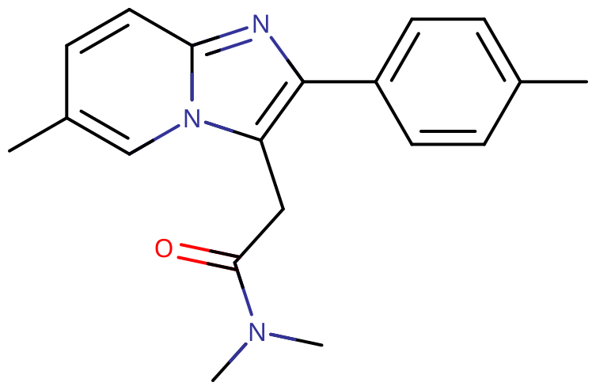

# 唑吡坦

[◀返回](index.md)

??? info "警惕新型毒品！"

    

!!! danger "联用危险"

    **当 [GABA](../文档/GABA.md) 能物质联用其他[抑制剂](../文档/药物分类/抑制剂.md)（如[阿片类药物](../文档/药物分类/阿片类药物.md)、[苯二氮䓬类物质](../文档/药物分类/苯二氮䓬类物质.md)、[巴比妥类物质](../文档/药物分类/巴比妥类物质.md)、[加巴喷丁类物质](../文档/药物分类/加巴喷丁类物质.md)、[噻吩二氮䓬类物质](../文档/药物分类/噻吩二氮䓬类物质.md)或[酒精](酒精.md)等）时，可能会发生致命[过量](../文档/药物过量.md)。**[^1]

    强烈建议不要联用这些物质，特别是在[中等](../文档/药物剂量分类.md#中等)到[严重](../文档/药物剂量分类.md#严重)剂量下。

| **化学信息** | 唑吡坦（Zolpidem）                                                                         |
| ------------ | ------------------------------------------------------------------------------------------ |
| 结构式       |                                                                   |
| 分子式       | C19H21N3O                                                 |
| CAS 号       | 82626-48-0 99294-93-6（酒石酸盐）                                                       |
| **化学命名** |                                                                                            |
| 常见名称     | 唑吡坦（Zolpidem）、思诺思（Stilnox，原研药商品名）、Ambien、Intermezzo、Edluar、Zolpimist |
| 取代名称     | Zolpidem                                                                                   |
| 系统命名     | N,N-dimethyl-2-(6-methyl-2-p-tolylimidazo[1,2-a]pyridin-3-yl)acetamide                     |
| **类别归属** |                                                                                            |
| 精神活性分类 | _[抑制剂](../文档/药物分类/抑制剂.md) / [致幻剂](../文档/药物分类/致幻剂.md)_              |
| 化学分类     | _咪唑吡啶_                                                                                 |

| [**给药途径**](../文档/给药途径.md)      | 🔽 [口服](../文档/给药途径.md#口服) |
| ---------------------------------------- | ----------------------------------- |
| [**剂量**](../文档/给药剂量.md)          |                                     |
| [阈值](../文档/药物剂量分类.md#阈值)     | 5 mg                                |
| [轻微](../文档/药物剂量分类.md#轻微)     | 10 \~ 20 mg                         |
| [中等](../文档/药物剂量分类.md#中等)     | 20 \~ 30 mg                         |
| [强烈](../文档/药物剂量分类.md#强烈)     | 30 \~ 50 mg                         |
| [严重](../文档/药物剂量分类.md#严重)     | 50 mg +                             |
| [**药效时长**](../文档/药效时长.md)      |                                     |
| [总时长](../文档/药效时长.md#总时长)     | 5 \~ 10 小时                        |
| [药效发作](../文档/药效时长.md#药效发作) | 15 \~ 45 分钟                       |
| [药效上升](../文档/药效时长.md#药效上升) | 30 \~ 45 分钟                       |
| [药效达峰](../文档/药效时长.md#药效达峰) | 3 \~ 6 小时                         |
| [药效褪去](../文档/药效时长.md#药效褪去) | 4 \~ 5 小时                         |
| [药效残余](../文档/药效时长.md#药效残余) | 2 \~ 4 小时                         |

- !!! warning "警告"

        由于个体体重、耐受性、新陈代谢和个人敏感度的差异，请务必从低剂量开始。参见[负责任的用药部分](../文档/负责任的用药索引页.md)。

    !!! info "[免责声明](../关于本站/免责声明.md)"

        本站的[给药剂量](../文档/给药剂量.md)信息收集自用户和[相关资源](../文档/科学信息索引页.md)，仅供教育目的使用。这不是医疗建议，应与其他来源核实以确保准确性。

**唑吡坦** 是一种非[苯二氮䓬类](../文档/药物分类/苯二氮䓬类物质.md)超短效[催眠药](../文档/催眠药.md)、[GABA](../文档/GABA.md)A 受体正[变构调节剂](../文档/受体激动剂.html#变构调节剂)（PAM），主要用于治疗[失眠](../药效/镇静.md)。[^2] [^3] 它属于包括[佐匹克隆](佐匹克隆.md)和[扎来普隆](扎来普隆.md)在内的 Z-drugs（因为 3 种药物英文名都以 Z 开头），这些药物最初被认为比苯二氮䓬类药物更不容易上瘾和/或形成习惯。但随着药物成瘾和依赖病例的积累，这种看法在过去几年中发生了转变。

当以娱乐剂量服用时，据报道它会产生强大且常见的古怪非典型[致幻](../文档/药物分类/致幻剂.md)、[解离](../文档/药物分类/解离剂.md)、[谵妄](../文档/药物分类/谵妄剂.md)甚至[迷幻](../文档/药物分类/迷幻剂.md)效果。

唑吡坦不应饱腹服用，建议仅短期使用。通常不建议每天或连续使用该药物。

## 化学

唑吡坦是一种咪唑并吡啶类的催眠非苯二氮䓬类药物。这类药物因具有咪唑成分而得名，咪唑是一个五元环，具有两个非相邻的氮成分，与吡啶环融合，吡啶环是一个六元含氮环，与咪唑基团共享一个氮。

GABAA 激动的咪唑并吡啶类药物如唑吡坦通常与吡唑并嘧啶和环吡酮一起归类为「非苯二氮䓬类药物」，因为它们具有相似的效果。

唑吡坦的三种合成方法很常见。4-甲基苯乙酮是常用的前体。将其溴化并与 2-氨基-5-甲基吡啶反应生成咪唑并吡啶。从这里开始，反应使用各种试剂来完成合成，涉及亚硫酰氯或氰化钠。这些试剂处理起来具有挑战性，需要彻底的安全评估。[^4] 虽然这种安全程序在工业中很常见，但它们使得秘密制造变得困难。

氰化钠反应的许多主要副产物已被表征，包括二聚体和曼尼希产物。[^5]

## 药理学

唑吡坦与 [GABA](../文档/GABA.md)-BZ 受体系统相互作用，[^6] 并具有传统[苯二氮䓬类药物](../文档/药物分类/苯二氮䓬类物质.md)的一些药理特性。

与苯二氮䓬类药物非选择性地结合所有苯二氮䓬靶点不同，唑吡坦优先结合含 α1 亚基的 GABAA 受体上的苯二氮䓬靶点（旧称 BZ1/ω1/Ω1 受体），对 α2 和 α3 亚基的亲和力比对 α1 亚基低 10 倍，且对含 α5、α7、γ1 和 γ3 亚基的受体没有表现出明显的亲和力，[^29] [^30] 并与绝大多数苯二氮䓬类药物一样，它对含 α4 和 α6 亚基的受体也没有亲和力。[^31]

含 α1 亚基的苯二氮䓬靶点位点主要存在于大脑中，而含 α2、α3、α4、α5、α6 亚基的苯二氮䓬靶点（旧称 BZ2/ω2/Ω2）主要存在于脊髓中，因此唑吡坦更易于与位于大脑而不是脊髓中的 GABAA 受体结合。[^32] 这种选择性赋予了唑吡坦非常弱的[抗焦虑](../药效/焦虑抑制.md)、[肌肉松弛](../药效/肌肉松弛.md)和[抗惊厥](../药效/癫痫发作抑制.md)作用，但具有非常强的[催眠](../文档/催眠药.md)或[镇静](../药效/镇静.md)特性。[^7]

与扎来普隆类似，唑吡坦可能增加慢波睡眠，但对第二睡眠期没有影响。[^33]

唑吡坦古怪的致幻作用药理机制尚不清楚，似乎也并未直接研究过。值得注意唑吡坦对区域活动的影响可能与其他致幻性 GABA 类药物重叠，例如[毒蝇碱](毒蝇碱.md)，这是致幻性[毒蝇伞](赛洛辛蘑菇.md)中的活性化合物。

## 主观效应

唑吡坦的主观效应似乎因人而异，有些使用者完全没有幻觉，而另一些使用者即使在较低剂量下也会出现幻觉。一般来说，娱乐性唑吡坦剂量的特征与[右美沙芬](右美沙芬.md)、[苯海拉明](苯海拉明.md)、[阿普唑仑](阿普唑仑.md)和赛洛辛相当。它也与致幻剂[毒蝇伞](赛洛辛蘑菇.md)非常相似。

它包含许多[苯二氮䓬类药物](../文档/药物分类/苯二氮䓬类物质.md)的躯体和认知效应，并具有与[右美沙芬](右美沙芬.md)最相似的中度[分离](../药效/分离效应.md)状态。这伴随着古怪的思维模式和类似于[谵妄剂](../文档/药物分类/谵妄剂.md)的[外部幻觉](../药效/外部幻觉.md)，以及最类似于[迷幻剂](../文档/药物分类/迷幻剂.md)的[视觉扭曲](../药效/视觉扭曲.md)。这使得唑吡坦成为一种极其独特和不可预测的[致幻剂](../文档/药物分类/致幻剂.md)，使用时建议有陪同者监护。

!!! info "[免责声明](../关于本站/免责声明.md)"

    _下列效应引用自 [**主观效应索引**](../药效/index.md)（**SEI**），这是一个基于轶事用户报告和个人分析的开放研究文献。因此，应带着健康的怀疑态度来看待它们。_

    _同样值得注意的是，这些效应不一定会以可预测或可靠的方式发生，尽管较高的剂量更可能引发全方位的效应。同样，**不良反应** 随着剂量的增加变得越来越可能，可能包括 **成瘾、严重伤害或死亡** ☠。_

- ### **[躯体效应](../药效/躯体效应.md)** 

    唑吡坦的躯体效应几乎与[阿普唑仑](阿普唑仑.md)等[苯二氮䓬类药物](../文档/药物分类/苯二氮䓬类物质.md)相同，尽管[肌肉松弛](../药效/肌肉松弛.md)较弱。它们可以分为几个部分。

    这些描述如下，通常包括：

    - **[镇静](../药效/镇静.md)**：这种化合物中存在的镇静作用比其他 [GABA 类](../文档/GABA.md)[抑制剂](../文档/药物分类/抑制剂.md)按比例比较其其他效果时要强得多。这就是为什么唑吡坦通常被作为助眠剂处方给那些与失眠作斗争的人。
    - **[躯体欣快感](../药效/躯体欣快感.md)**：这表现为一种温暖、柔和的光芒，从使用者的身体中心散发出来。
    - **[食欲增强](../药效/食欲增强.md)**：许多唑吡坦使用者报告说，在“睡着”的时候会暴饮暴食各种奇怪的食物混合物，醒来后对该活动几乎没有或根本没有记忆。这可能是由于唑吡坦的认知效应，如[去抑制](../药效/去抑制.md)和[失忆](../药效/失忆.md)造成的。[^8]
    - **[重力感改变](../药效/重力感改变.md)**：这不像[解离剂](../文档/药物分类/解离剂.md)或[鼠尾草](鼠尾草素甲.md)那样强烈或明显。
    - **[味觉幻觉](../药效/味觉幻觉.md)**
    - **[头晕](../药效/头晕.md)**
    - **[恶心](../药效/恶心.md)**：在中等至严重剂量下，胃部可能会感到轻微不适。一旦使用者呕吐，这种感觉就会消失。
    - **[肌肉松弛](../药效/肌肉松弛.md)**：虽然肌肉松弛确实存在，但通常只在严重剂量下表现出来，并且比苯二氮䓬类药物弱得多。
    - **[运动控制丧失](../药效/运动控制丧失.md)**
    - **[呼吸抑制](../药效/呼吸抑制.md)**
    - **[心率增快](../药效/心率增快.md)**：唑吡坦可以增加心率。
    - **[血压升高](../药效/血压升高.md)**：唑吡坦可以增加血压。
    - **[触觉幻觉](../药效/触觉幻觉.md)**

- ### **[分离效应](../药效/分离效应.md)** 
    - **[视觉分离](../药效/视觉分离.md)**：这种效果仅在中等至严重娱乐剂量下出现，并且与[右美沙芬](右美沙芬.md)和[氯胺酮](氯胺酮.md)等[解离剂](../文档/药物分类/解离剂.md)相当。它通常导致感觉自己的视觉是遥远的或模糊的，并且是通过屏幕或窗户观看的。然而，它不像传统解离剂那样能够产生高端的视觉分离，如[孔洞、空间和空虚](../药效/视觉分离.md)或[幻觉结构](../药效/视觉分离.md)。这可能是由于唑吡坦的镇静作用在剂量远低于达到这种状态所需的剂量时就使用户失去知觉。
    - **[意识分离](../药效/意识分离.md)**：这种效果仅在中等至严重娱乐剂量下出现，并且与[右美沙芬](右美沙芬.md)和[氯胺酮](氯胺酮.md)等[解离剂](../文档/药物分类/解离剂.md)相当。然而，它不像解离剂那样能够产生高端的认知分离。这可能是由于唑吡坦的镇静作用在剂量远低于达到这种状态所需的剂量时就使用户失去知觉。

- ### **[视觉效应](../药效/视觉效应.md)** 

    唑吡坦的视觉效果与[谵妄剂](../文档/药物分类/谵妄剂.md)、[解离剂](../文档/药物分类/解离剂.md)和[迷幻剂](../文档/药物分类/迷幻剂.md)的某些方面相当。在较低剂量下，这些效果表现为简单的[视觉抑制](../药效/视觉抑制.md)，但在较高剂量下，它们可能会升级为古怪和独特的全面复杂的幻觉状态。

    - **[视觉锐度抑制](../药效/视觉锐度抑制.md)**
        - **[视雪症](../药效/视觉迷雾.md)**
    - **[残影](../药效/残影.md)**：这些可能会在周边视觉中自发产生。
    - **[深度感知扭曲](../药效/深度感知扭曲.md)**
    - **[复视](../药效/复视.md)**：唑吡坦产生的复视可能适用于整个视野，或者仅适用于单个或多个物体，有时伴随着[变形](../药效/视觉变形.md)。
    - **[放大](../药效/放大.md)**
    - **[物体激活](../药效/物体激活.md)**
    - **[物体改变](../药效/物体改变.md)**
    - **[周边信息误判](../药效/周边信息误判.md)**
    - **[变形](../药效/视觉变形.md)**
    - **[视觉锐度抑制](../药效/视觉锐度抑制.md)**
    - **[漂移](../药效/漂移.md)**：在严重剂量下，这种化合物可能会导致风景、墙壁、物体和人看起来融化和扭曲，这种方式与传统的[迷幻剂](../文档/药物分类/迷幻剂.md)如赛洛辛或 [LSD](LSD.md) 相当。
    - **[几何](../药效/几何.md)**：唑吡坦产生的几何形状与[右美沙芬](右美沙芬.md)有相似之处，通常在抖动和静止之间转换。
    - **[内部幻觉](../药效/内部幻觉.md)**（_[自主实体](../药效/自主实体.md)_; _[场景、布景和景观](../药效/场景、布景和景观.md)_; _[视角幻觉](../药效/视角幻觉.md)_ 和 _[情景与情节](../药效/情景与情节.md)_）：这种化合物上的内部幻觉可以描述为生动的梦境般的状态，风格类似于[谵妄剂](../文档/药物分类/谵妄剂.md)。这种效果通常在中等剂量下短暂自发地发生，但随着剂量的增加，其发生和持续时间逐渐延长，最终变得包罗万象。它可以通过其[变化](../药效/内部幻觉.md#Variations)全面描述为：在可信度上是谵妄的，在风格上是互动的，在内容上是新体验和记忆重播相当的，在可控性上是自主的，在风格上是坚实的。
    - **[外部幻觉](../药效/外部幻觉.md)**（_[自主实体](../药效/自主实体.md)_; _[场景、布景和景观](../药效/场景、布景和景观.md)_; _[视角幻觉](../药效/视角幻觉.md)_ 和 _[情景与情节](../药效/情景与情节.md)_）：与其他类别的[致幻剂](../文档/药物分类/致幻剂.md)相比，这种效果仅在严重剂量下发生，并且与[苯海拉明](苯海拉明.md)和[曼陀罗](曼陀罗.md)等[谵妄剂](../文档/药物分类/谵妄剂.md)相当。这种效果可以通过其[变化](../药效/外部幻觉.md#Variations)全面描述为：在可信度上是谵妄的，在可控性上是自主的，在风格上是坚实的。这些幻觉最常见的主题包括日常发生的事情，如与不在场的人交谈，以及不可能发生的事情，如无生命的物体复活或[影子人](../药效/影子人.md)。
    - **[影子人](../药效/影子人.md)**

- ### **[认知效应](../药效/认知效应.md)** 

    唑吡坦的认知效应与[苯二氮䓬类药物](../文档/药物分类/苯二氮䓬类物质.md)相当，尽管[焦虑抑制](../药效/焦虑抑制.md)较弱。在更严重的娱乐剂量下，通常与谵妄剂相关的其他效果可能会出现。这些包括[思维混乱](../药效/思维混乱.md)和[妄想](../药效/妄想.md)。具体效果可以分为几个部分。

    这些描述如下，通常包括：

    - **[失忆](../药效/失忆.md)**：唑吡坦后的失忆因人而异，有些人这种效应不明显，而另一些人即使在低剂量或治疗剂量下也会经历长时间的完全断片。有许多古怪行为的案例，人们无法回忆起整个事件。
    - **[焦虑抑制](../药效/焦虑抑制.md)**：虽然焦虑抑制确实存在，但通常只在严重剂量下表现出来，并且比苯二氮䓬类药物弱得多。
    - **[强迫性补量](../药效/强迫性补量.md)**
    - **[认知欣快](../药效/认知欣快.md)**
    - **[精神病发作](../药效/精神病发作.md)**
    - **[妄想](../药效/妄想.md)**：在严重剂量下，这种效果可能会以与传统谵妄剂相当的方式出现。它通常伴随着[外部幻觉](../药效/外部幻觉.md)，这往往会加强一个人对妄想的信念。[^9] [^10]
    - **[清醒错觉](../药效/妄想.md)**（注：Delusions of sobriety 对应妄想或特定的清醒错觉条目，若无特定条目则指向妄想）：这是指尽管有明显的相反证据，如严重的认知障碍和无法与他人充分沟通，但仍错误地认为自己完全清醒。它最常发生在严重剂量下。体验报告表明，唑吡坦可能会引发与苯二氮䓬类药物同等或更强烈的这些错觉。
    - **[去抑制](../药效/去抑制.md)**
    - **[梦境强化](../药效/梦境强化.md)**
    - **[情绪强化](../药效/情绪强化.md)**：一些用户报告唑吡坦会增加情绪和共情，特别是快乐和悲伤。
    - **[共情、情感和社交能力增强](../药效/共情、情感和社交能力增强.md)**：这种效果远不如 [MDMA](MDMA.md) 和 [2C-B](2C-B.md) 等共情剂强烈，但在性质上是谵妄的。
    - **[狂笑](../药效/狂笑.md)**
    - **[躁狂](../药效/躁狂.md)**
    - **[既视感](../药效/既视感.md)**：自发的记忆重播融入思维模式并产生强烈的既视感。
    - **[混乱](../药效/混乱.md)**
    - **[音乐欣赏能力增强](../药效/音乐欣赏能力增强.md)**
    - **[性欲增强](../药效/性欲增强.md)**
    - **[暗示性强化](../药效/暗示性强化.md)**
    - **[分析能力抑制](../药效/分析能力抑制.md)**
    - **[情感抑制](../药效/情感抑制.md)**
    - **[语言能力抑制](../药效/语言能力抑制.md)**：在严重剂量的唑吡坦下，一个人可能会发现他们有明显的困难以连贯的方式表达他们的想法。
    - **[记忆抑制](../药效/记忆抑制.md)**：在严重剂量下，许多用户发现他们无法回忆起 10 或 30 秒前的事情，因为他们的短期记忆受到抑制。这可能会导致混乱、重复行为和[思维循环](../药效/思维循环.md)。
    - **[困倦](../药效/困倦.md)**
    - **[思维减速](../药效/思维减速.md)**
    - **[思维混乱](../药效/思维混乱.md)**：这种效果在严重剂量下出现，并且往往与去抑制和妄想协同作用，导致古怪的决策过程或思维过程，这些过程通常不符合性格，一旦使用者从体验中清醒过来，就没有什么意义了。
    - **[时间扭曲](../药效/时间扭曲.md)**：类似于[苯二氮䓬类药物](../文档/药物分类/苯二氮䓬类物质.md)，时间可能会感觉比平时过得快。

- ### **[听觉效应](../药效/听觉效应.md)** 
    - **[听觉幻觉](../药效/听觉幻觉.md)**：在严重剂量下，一个人可能会体验到想象中的声音，如声音或音乐，有时融入环境声音或音乐中。这些通常伴随着[外部幻觉](../药效/外部幻觉.md)和[妄想](../药效/妄想.md)。
    - **[听觉锐度增强](../药效/听觉锐度增强.md)**

### 体验报告

目前我们的[报告索引](../报告/index.md)中关于该物质效果的体验报告：

1. [一次唑吡坦的尝试](../报告/一次唑吡坦的尝试.md)
2. [5mgMK-801 + 10mg 唑吡坦——最社死的一天](../报告/5mgMK-801+10mgsns.md)

你可以在[本站 Github 仓库](https://github.com/SalviaSWC/FreeODwiki)提交你自己的体验报告。其他的体验报告可以在这里找到：

- PsychonautWiki：
    1. [Experience:40mg Zolpidem / 20mg Diazepam - Please Don't Do This](https://psychonautwiki.org/wiki/Experience:40mg_Zolpidem_/_20mg_Diazepam_-_Please_Don%27t_Do_This)
    2. [Experience:60mg Zolpidem - A Delirious Adventure](https://psychonautwiki.org/wiki/Experience:60mg_Zolpidem_-_A_Delirious_Adventure)
- [Erowid Experience Vaults: Zolpidem](https://www.erowid.org/experiences/subs/exp_Pharms_Zolpidem.shtml)

## 毒性与危害潜力

更多信息：[负责任的用药 § 致幻剂](../文档/负责任的用药索引页.md)

相对于剂量，唑吡坦的毒性较低。[^11] 然而，当与[酒精](酒精.md)或[阿片类药物](../文档/药物分类/阿片类药物.md)等[抑制剂](../文档/药物分类/抑制剂.md)混合使用时，它具有潜在的[致死性](../药效/呼吸抑制.md)。

据报道，唑吡坦引起[精神病发作](../药效/精神病发作.md)、[妄想](../药效/妄想.md)和谵妄的比率明显高于 [LSD](LSD.md)、[氯胺酮](氯胺酮.md)或 [DMT](DMT.md) 等其他[致幻剂](../文档/药物分类/致幻剂.md)。网上有大量的体验报告描述了滥用药物后的谵妄、失忆、古怪行为、[^12] 梦游、[^13] 酒后驾驶[^13] [^14] 和其他严重后果。在许多情况下，这导致了住院、逮捕、[^15] 车祸、[^16] 漫长的法庭案件甚至死亡。[^17]

### 耐受性和成瘾潜力

唑吡坦具有中度成瘾性。对 36 个人类病例报告的回顾发现，报告的对唑吡坦的依赖性低于苯二氮䓬类药物。[^18]

在稳定服用几周或更长时间后突然停止使用可能会出现戒断症状或反弹症状，可能需要逐渐减少剂量。[^19] 有关以受控方式逐渐减少唑吡坦的更多信息，请参阅[本指南](http://www.benzo.org.uk/manual/bzcha02.htm)，同时请记住它是针对苯二氮䓬类药物的。

虽然依赖性的建立比苯二氮䓬类药物慢，但停止定期娱乐性剂量的唑吡坦似乎与苯二氮䓬类[药物戒断](../文档/药物戒断反应.md)一样困难；[^19] 对于经常使用的人来说，如果不经过几周的时间逐渐减少剂量就停止使用，可能会危及生命。这也是[高血压](../药效/血压升高.md)、[癫痫发作](../药效/癫痫发作.md)和死亡的风险增加。[^20] 在戒断期间应避免使用降低癫痫发作阈值的药物，如[曲马多](曲马多.md)。

### 危险的相互作用

虽然许多药物单独使用是安全的，但当与其他物质结合使用时，它们可能会变得危险甚至危及生命。下面的列表包含一些常见的潜在危险组合，但可能不包括所有组合。某些组合在各自低剂量下可能是安全的，但仍会增加死亡的潜在风险。在消费之前，应始终进行[独立研究](https://www.google.com/)以确保两种或多种物质的组合是安全的。

- **[抑制剂](../文档/药物分类/抑制剂.md)**（_[1,4-丁二醇](1,4-丁二醇.md)、[2-甲基 -2-丁醇](2M2B.md)、[酒精](酒精.md)、[巴比妥类物质](../文档/药物分类/巴比妥类物质.md)、[GHB](GHB.md)/[GBL](GBL.md)、[甲喹酮](甲喹酮.md)、[阿片类药物](../文档/药物分类/阿片类药物.md)、[苯二氮䓬类物质](../文档/药物分类/苯二氮䓬类物质.md)_）：这种组合可能导致危险甚至致命水平的[呼吸抑制](../药效/呼吸抑制.md)。这些物质会增强彼此引起的[肌肉松弛](../药效/肌肉松弛.md)、[镇静](../药效/镇静.md)和[失忆](../药效/失忆.md)，并可能导致高剂量下的意外意识丧失。在无意识期间呕吐和由此导致的窒息死亡的风险也会增加。如果发生这种情况，使用者应尝试以[恢复体位](../文档/恢复体位.md)入睡或让朋友将其移入该体位。
- **[解离剂](../文档/药物分类/解离剂.md)**：这种组合可能导致在无意识期间呕吐和由此导致的窒息死亡的风险增加。如果发生这种情况，使用者应尝试以[恢复体位](../文档/恢复体位.md)入睡或让朋友将其移入该体位。
- **[兴奋剂](../文档/药物分类/兴奋剂.md)**：将唑吡坦与[兴奋剂](../文档/药物分类/兴奋剂.md)结合使用是危险的，因为存在过度中毒的风险。兴奋剂会降低唑吡坦的[镇静](../药效/镇静.md)作用，这是大多数人在确定其中毒程度时考虑的主要因素。一旦兴奋剂失效，唑吡坦的效果将显著增加，导致[去抑制](../药效/去抑制.md)加剧以及[其他效果](唑吡坦.md#主观效应)。如果结合使用，一个人应严格限制自己每隔几小时只服用一定量的唑吡坦。如果不监测水分补充，这种组合也可能导致严重脱水。

## 法律地位

在国际上，根据《精神药物公约》，唑吡坦是附表 IV 物质。[^21]

- **中国大陆**：根据《麻醉药品和精神药品管理条例》，唑吡坦被列入第二类精神药品，属于管制药品。[^22] 一般每人一次开 7 天量的处方。[^23]
- **澳大利亚**：唑吡坦仅凭处方提供。
- **加拿大**：唑吡坦仅凭处方提供。
- **德国**：唑吡坦是 BtMG 附件 III 下的受控物质。它只能在麻醉品处方表格上开具。口服制剂有一个例外，每单位含有高达 8.5 毫克的唑吡坦，可以在常规处方表格上开具。[^24]
- **荷兰**：唑吡坦仅凭处方提供。
- **俄罗斯**：在俄罗斯，自 2013 年以来，唑吡坦是附表 III 受控物质。[^25]
- **瑞士**：唑吡坦是 Verzeichnis B 下特别列出的受控物质。允许药用。[^26]
- **荷兰**：唑吡坦是鸦片法清单 2 的物质。[^27]
- **英国**：自 2003 年以来，唑吡坦在英国一直是 C 类药物。[^28] 持有（没有合法处方）、供应、生产或进口是非法的。
- **美国**：唑吡坦被列为附表 IV 药物，因为有证据表明该药物具有类似于[苯二氮䓬类药物](../文档/药物分类/苯二氮䓬类物质.md)的成瘾特性。

## 另见

- [负责任的用药](../文档/负责任的用药索引页.md)
- [致幻剂](../文档/药物分类/致幻剂.md)
- [谵妄剂](../文档/药物分类/谵妄剂.md)

## 外部链接

- [Zolpidem (Wikipedia)](https://en.wikipedia.org/wiki/Zolpidem)
- [Zolpidem (PsychonautWiki)](https://psychonautwiki.org/wiki/Zolpidem)
- [Zolpidem (Erowid Vault)](https://www.erowid.org/pharms/zolpidem/zolpidem.shtml)
- [Zolpidem (Isomer Design)](https://isomerdesign.com/PiHKAL/explore.php?id=3360)
- [Zolpidem (DrugBank)](https://go.drugbank.com/drugs/DB00425)
- [Zolpidem (Drugs.com)](https://www.drugs.com/zolpidem.html)
- [The Ambien Walrus Collection](http://ambien.blogspot.com/2010/12/ambien-walrus-collection.html)

## 引用文献

[^1]: [_Risks of Combining Depressants - TripSit_](https://tripsit.me/combining-depressants/)

[^2]: <http://www.drugs.com/zolpidem.html> | Zolpidem (Drugs.com)

[^3]: Du, B., Shan, A., Zhong, X., Zhang, Y., Chen, D., Cai, K. (March 2014). ["Zolpidem Arouses Patients in Vegetative State After Brain Injury: Quantitative Evaluation and Indications"](https://linkinghub.elsevier.com/retrieve/pii/S0002962915303827). _The American Journal of the Medical Sciences_. **347** (3): 178–182. [doi](http://en.wikipedia.org/wiki/Digital_object_identifier):[10.1097/MAJ.0b013e318287c79c](https://doi.org/10.1097%2FMAJ.0b013e318287c79c). [ISSN](http://en.wikipedia.org/wiki/International_Standard_Serial_Number) [0002-9629](https://www.worldcat.org/issn/0002-9629).

[^4]: Johnson, D. S., Li, J. J., eds. (2007). _The art of drug synthesis_. Wiley-Interscience. ISBN [9780471752158](http://en.wikipedia.org/wiki/Special:BookSources/9780471752158).

[^5]: Sumalatha, Y., Reddy, P. P., Reddy, R., Satyanarayana, B. (7 April 2009). ["Synthesis and spectral characterization of zolpidem related substances - hypnotic agent"](https://www.arkat-usa.org/arkivoc-journal/browse-arkivoc/ark.5550190.0010.714). _Arkivoc_. **2009** (7): 143–149. [doi](http://en.wikipedia.org/wiki/Digital_object_identifier):[10.3998/ark.5550190.0010.714](https://doi.org/10.3998%2Fark.5550190.0010.714). [ISSN](http://en.wikipedia.org/wiki/International_Standard_Serial_Number) [1551-7012](https://www.worldcat.org/issn/1551-7012).

[^6]: Kovacic, P., Somanathan, R. (2009). ["Zolpidem, a clinical hypnotic that affects electronic transfer, alters synaptic activity through potential GABA receptors in the nervous system without significant free radical generation"](https://www.ncbi.nlm.nih.gov/pmc/articles/PMC2763231/). _Oxidative Medicine and Cellular Longevity_. **2** (1): 52–57. [ISSN](http://en.wikipedia.org/wiki/International_Standard_Serial_Number) [1942-0900](https://www.worldcat.org/issn/1942-0900).

[^7]: Salvà, P., Costa, J. (September 1995). "Clinical pharmacokinetics and pharmacodynamics of zolpidem. Therapeutic implications". _Clinical Pharmacokinetics_. **29** (3): 142–153. [doi](http://en.wikipedia.org/wiki/Digital_object_identifier):[10.2165/00003088-199529030-00002](https://doi.org/10.2165%2F00003088-199529030-00002). [ISSN](http://en.wikipedia.org/wiki/International_Standard_Serial_Number) [0312-5963](https://www.worldcat.org/issn/0312-5963).

[^8]: DeNoon, D. J., [_Ambien Linked to “Sleep Eating”_](https://www.webmd.com/sleep-disorders/news/20060315/ambien-linked-to-sleep-eating)

[^9]: [_Ambien, delusions, and violence: Is there a link?, Psychology Today_](https://www.psychologytoday.com/us/blog/the-measure-madness/201005/ambien-delusions-and-violence-is-there-link)

[^10]: [_Side Effects of Ambien (Zolpidem Tartrate), Warnings, Uses_](https://www.rxlist.com/ambien-side-effects-drug-center.htm)

[^11]: PubChem, [_Zolpidem_](https://pubchem.ncbi.nlm.nih.gov/compound/5732)

[^12]: /r/ambien (reddit) | <https://www.reddit.com/r/ambien/top/>

[^13]: Hoque, R., Chesson, A. L. (15 October 2009). ["Zolpidem-Induced Sleepwalking, Sleep Related Eating Disorder, and Sleep-Driving: Fluorine-18-Flourodeoxyglucose Positron Emission Tomography Analysis, and a Literature Review of Other Unexpected Clinical Effects of Zolpidem"](https://www.ncbi.nlm.nih.gov/pmc/articles/PMC2762721/). _Journal of Clinical Sleep Medicine : JCSM : Official Publication of the American Academy of Sleep Medicine_. **5** (5): 471–476. [ISSN](http://en.wikipedia.org/wiki/International_Standard_Serial_Number) [1550-9389](https://www.worldcat.org/issn/1550-9389).

[^14]: <http://www.nhcriminaldefense.com/auto_accident_injury.html>

[^15]: [_Passengers recount horror as Air Force vet threatens to bring down transatlantic Delta flight_](https://www.nydailynews.com/news/national/passengers-recount-horror-air-force-vet-threatens-bring-transatlantic-delta-flight-article-1.169677)

[^16]: News, A. B. C., [_Kerry Kennedy Says Ambien “Overtook” Her, Causing Car Crash_](https://abcnews.go.com/US/kerry-kennedy-ambien-overtook-causing-car-crash/story?id=22679672)

[^17]: [_The Disturbing Side Effect Of The No. 1 Prescription Sleep Aid_](https://www.huffpost.com/entry/ambien-side-effect-sleepwalking-sleep-aid_n_4589743), 2014

[^18]: Hajak, G., Müller, W. E., Wittchen, H. U., Pittrow, D., Kirch, W. (October 2003). ["Abuse and dependence potential for the non-benzodiazepine hypnotics zolpidem and zopiclone: a review of case reports and epidemiological data: Abuse and dependence of zolpidem and zopiclone"](http://doi.wiley.com/10.1046/j.1360-0443.2003.00491.x). _Addiction_. **98** (10): 1371–1378. [doi](http://en.wikipedia.org/wiki/Digital_object_identifier):10.1046/j.1360-0443.2003.00491.x. [ISSN](http://en.wikipedia.org/wiki/International_Standard_Serial_Number) 0965-2140.

[^19]: Sethi, P. K., Khandelwal, D. C. (February 2005). "Zolpidem at supratherapeutic doses can cause drug abuse, dependence and withdrawal seizure". _The Journal of the Association of Physicians of India_. **53**: 139–140. [ISSN](http://en.wikipedia.org/wiki/International_Standard_Serial_Number) [0004-5772](https://www.worldcat.org/issn/0004-5772).

[^20]: Lann, M. A., Molina, D. K. (June 2009). "A fatal case of benzodiazepine withdrawal". _The American Journal of Forensic Medicine and Pathology_. **30** (2): 177–179. [doi](http://en.wikipedia.org/wiki/Digital_object_identifier):[10.1097/PAF.0b013e3181875aa0](https://doi.org/10.1097%2FPAF.0b013e3181875aa0). [ISSN](http://en.wikipedia.org/wiki/International_Standard_Serial_Number) [1533-404X](https://www.worldcat.org/issn/1533-404X).

[^21]: ["List of psychotropic substances under international control (Green List)"](http://web.archive.org/web/20070302130637/http://www.incb.org/pdf/e/list/green.pdf) (PDF) (23rd ed.). International Narcotics Control Board (INCB). August 2003. Archived from [the original](http://www.incb.org/pdf/e/list/green.pdf) (PDF) on March 2, 2007.

[^22]: 《麻醉药品和精神药品品种目录（2023 版）》-国有资产管理处 (tjnu.edu.cn)

[^23]: 卫生部关于印发《麻醉药品、精神药品处方管理规定》的通知 麻醉药品、精神药品处方管理规定\_\_2006 年第 28 号国务院公报\*中国政府网 (www.gov.cn)

[^24]: [_Anlage III BtMG - Einzelnorm_](http://www.gesetze-im-internet.de/btmg_1981/anlage_iii.html)

[^25]: [_Постановление Правительства РФ от 04.02.2013 N 78 “О внесении изменений в некоторые акты Правительства Российской Федерации” - КонсультантПлюс_](https://www.consultant.ru/cons/cgi/online.cgi?req=doc&base=LAW&n=141744&dst=100002&date=02.12.2019)

[^26]: ["Verordnung des EDI über die Verzeichnisse der Betäubungsmittel, psychotropen Stoffe, Vorläuferstoffe und Hilfschemikalien"](https://www.admin.ch/opc/de/classified-compilation/20101220/index.html) (in German). Bundeskanzlei [Federal Chancellery of Switzerland]. Retrieved January 1, 2020.

[^27]: [_Opiumwet, Lijst II (Dutch)_](https://wetten.overheid.nl/BWBR0001941/2023-09-12#BijlageII), 2023

[^28]: [_The Misuse of Drugs Act 1971 (Modification) Order 2003_](https://www.legislation.gov.uk/uksi/2003/1243/contents/made)

[^29]: Pritchett DB, Seeburg PH (May 1990). "Gamma-aminobutyric acidA receptor alpha 5-subunit creates novel type II benzodiazepine receptor pharmacology". Journal of Neurochemistry. **54** (5): 1802–4. [doi](http://en.wikipedia.org/wiki/Digital_object_identifier):[10.1111/j.1471-4159.1990.tb01237.x](https://doi.org/10.1111%2Fj.1471-4159.1990.tb01237.x). [PMID](http://en.wikipedia.org/wiki/PubMed_Identifier) [2157817](https://pubmed.ncbi.nlm.nih.gov/2157817). [S2CID](<https://en.wikipedia.org/wiki/S2CID_(identifier)>) [86674799](https://api.semanticscholar.org/CorpusID:86674799).

[^30]: Smith AJ, Alder L, Silk J, Adkins C, Fletcher AE, Scales T, et al. (May 2001). "Effect of alpha subunit on allosteric modulation of ion channel function in stably expressed human recombinant gamma-aminobutyric acid(A) receptors determined using (36)Cl ion flux". Molecular Pharmacology. **59** (5): 1108–18. [doi](http://en.wikipedia.org/wiki/Digital_object_identifier):[10.1124/mol.59.5.1108](https://doi.org/10.1124%2Fmol.59.5.1108). [PMID](http://en.wikipedia.org/wiki/PubMed_Identifier) [11306694](https://pubmed.ncbi.nlm.nih.gov/11306694). [S2CID](<https://en.wikipedia.org/wiki/S2CID_(identifier)>) [86156878](https://api.semanticscholar.org/CorpusID:86156878).

[^31]: Wafford KA, Thompson SA, Thomas D, Sikela J, Wilcox AS, Whiting PJ (September 1996). ["Functional characterization of human gamma-aminobutyric acidA receptors containing the alpha 4 subunit"](http://molpharm.aspetjournals.org/cgi/content/abstract/50/3/670). Molecular Pharmacology. 50 (3): 670–8. [doi](http://en.wikipedia.org/wiki/Digital_object_identifier):[10.1016/S0026-895X(25)09339-3](https://doi.org/10.1016%2FS0026-895X%2825%2909339-3). [PMID](http://en.wikipedia.org/wiki/PubMed_Identifier) [8794909](https://pubmed.ncbi.nlm.nih.gov/8794909). [Archived](https://web.archive.org/web/20090108105647/http://molpharm.aspetjournals.org/cgi/content/abstract/50/3/670) from the original on 8 January 2009. Retrieved 7 October 2007.

[^32]: Rowlett JK, Woolverton WL. [Assessment of benzodiazepine receptor heterogeneity in vivo: apparent pA2 and pKB analyses from behavioral studies](http://link.springer.de/link/service/journals/00213/bibs/6128001/61280001.htm). Psychopharmacology. November 1996, **128** (1): 1–16. [PMID](http://en.wikipedia.org/wiki/PubMed_Identifier) [8944400](https://www.ncbi.nlm.nih.gov/pubmed/8944400). [S2CID](<https://en.wikipedia.org/wiki/S2CID_(identifier)>) [25654504](https://api.semanticscholar.org/CorpusID:25654504). [doi](http://en.wikipedia.org/wiki/Digital_object_identifier):[10.1007/s002130050103](https://doi.org/10.1007%2Fs002130050103). （原始内容[存档](https://web.archive.org/web/20020112111228/http://link.springer.de/link/service/journals/00213/bibs/6128001/61280001.htm)于2002-01-12）.

[^33]: Noguchi H, Kitazumi K, Mori M, Shiba T. Electroencephalographic properties of zaleplon, a non-benzodiazepine sedative/hypnotic, in rats. Journal of Pharmacological Sciences. March 2004, **94** (3): 246–51. [PMID](http://en.wikipedia.org/wiki/PubMed_Identifier) [15037809](https://www.ncbi.nlm.nih.gov/pubmed/15037809). [doi](http://en.wikipedia.org/wiki/Digital_object_identifier):[10.1254/jphs.94.246](https://doi.org/10.1254%2Fjphs.94.246). "WARNING: The reference indicates that zaleplon-Sonata, not zolpidem, increases Slow-wave sleep"
