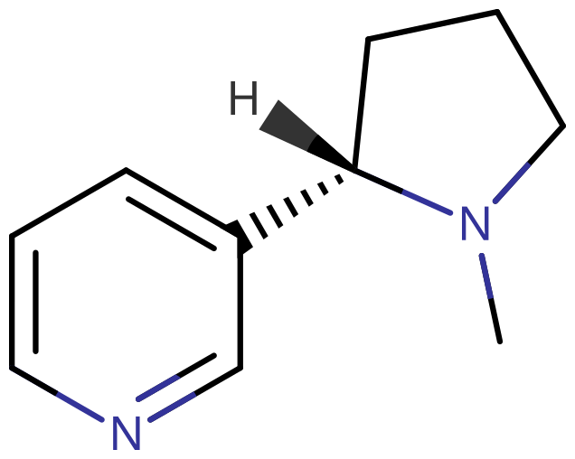
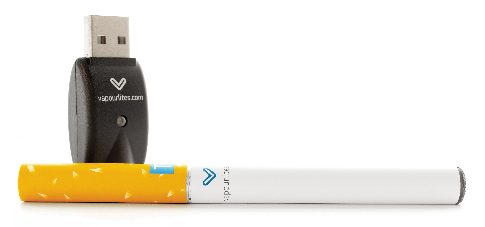
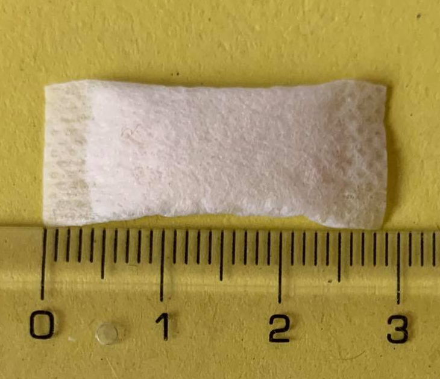
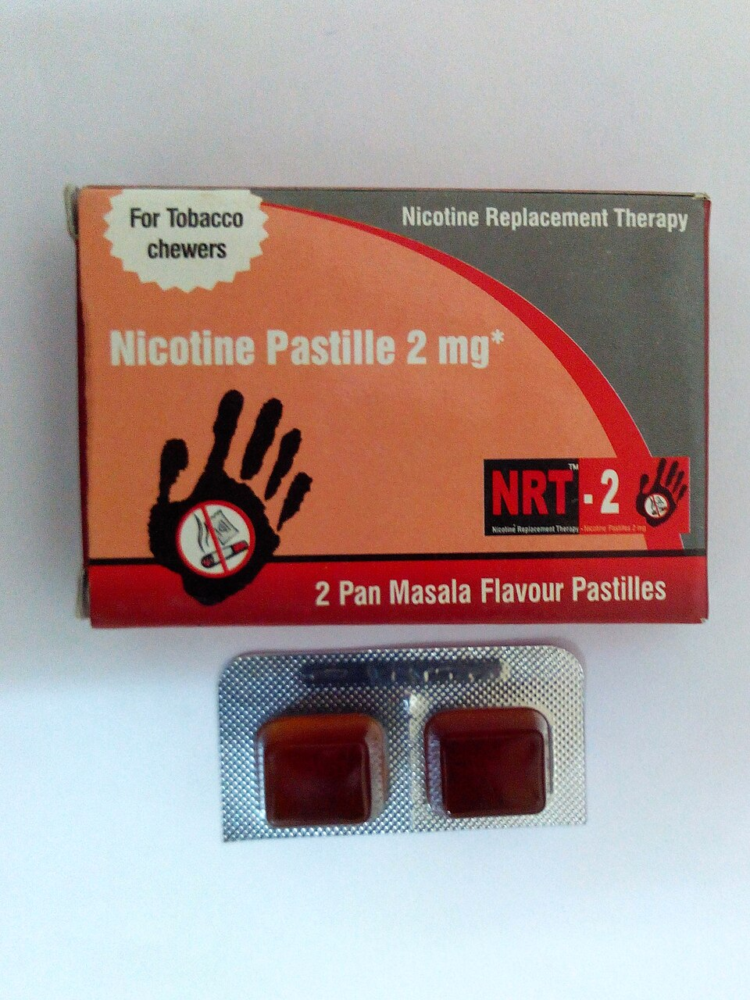

# 尼古丁

[◀返回](index.md)

??? info "B 站网友的锐评，一语道破天机！"

    

!!! danger "致癌风险"

    尼古丁在口腔和胃中可反应形成 N-亚硝基降烟碱（NNN），[^1] 这是一种已知的 <mark>**1 级致癌物**</mark>，[^2] 非烟草形式的尼古丁摄入也可能在致癌过程中发挥作用。[^3] 即使是口服尼古丁替代疗法产品理论上也可能增加癌症风险。

    **为了健康**：按照说明使用尼古丁贴片不会带来这种风险，因为 NNN 形成不会通过皮肤吸收发生。

| **化学信息** | 尼古丁（Nicotine）                                        |
| ------------ | --------------------------------------------------------- |
| 结构式       |                                  |
| 分子式       | C10H14N2                 |
| CAS 号       | 54-11-5                                                   |
| **化学命名** |                                                           |
| 常见名称     | 尼古丁（Nicotine）、烟碱、烟草素                          |
| 系统命名     | (S)-3-[1-Methylpyrrolidin-2-yl]pyridine                   |
| **类别归属** |                                                           |
| 精神活性分类 | _[兴奋剂](../文档/药物分类/兴奋剂.md)_                    |
| 化学分类     | _吡啶 / [吡咯烷类物质](../文档/药物分类/吡咯烷类物质.md)_ |

| [**给药途径**](../文档/给药途径.md)      | 🔽 抽吸       | 🔽 口服         | 🔽 颊部给药   |
| ---------------------------------------- | ------------- | --------------- | ------------- |
| [**剂量**](../文档/药物剂量分类.md)      |               |                 |               |
| [阈值](../文档/药物剂量分类.md#阈值)     | 0.2 mg        | 0.2 mg          | 0.2 mg        |
| [轻微](../文档/药物剂量分类.md#轻微)     | 0.3 \~ 0.8 mg | 1 \~ 3 mg       | 0.5 \~ 2 mg   |
| [中等](../文档/药物剂量分类.md#中等)     | 0.8 \~ 1.5 mg | 3 \~ 5 mg       | 2 \~ 4 mg     |
| [强烈](../文档/药物剂量分类.md#强烈)     | 1.5 \~ 3.5 mg | 5 \~ 7 mg       | 4 \~ 6 mg     |
| [严重](../文档/药物剂量分类.md#严重)     | 3.5 mg +      | 7 mg +          | 6 mg +        |
| [**药效时长**](../文档/药效时长.md)      |               |                 |               |
| [总时长](../文档/药效时长.md#总时长)     | 1 \~ 3 小时   | 5 \~ 7 小时     | 45 \~ 90 分钟 |
| [药效发作](../文档/药效时长.md#药效发作) | 5 \~ 20 秒    | 20 \~ 40 分钟   | 3 \~ 15 分钟  |
| [药效上升](../文档/药效时长.md#药效上升) | 5 \~ 10 秒    | 60 \~ 90 分钟   | 3 \~ 15 分钟  |
| [药效达峰](../文档/药效时长.md#药效达峰) | 2 \~ 5 分钟   | 60 \~ 90 分钟   | 5 \~ 20 分钟  |
| [药效褪去](../文档/药效时长.md#药效褪去) | 1 \~ 2 小时   | 2.5 \~ 3.5 小时 | 1 \~ 2 小时   |
| [药效残余](../文档/药效时长.md#药效残余) | 1 \~ 3 小时   | 2 \~ 4 小时     | 2 \~ 6 小时   |

- !!! warning "警告"

        由于个体体重、耐受性、新陈代谢和个人敏感度的差异，请务必从低剂量开始。参见[负责任的用药部分](../文档/负责任的用药索引页.md)。

    !!! info "[免责声明](../关于本站/免责声明.md)"

        本站的[给药剂量](../文档/给药剂量.md)信息收集自用户和[相关资源](../文档/科学信息索引页.md)，仅供教育目的使用。这不是医疗建议，应与其他来源核实以确保准确性。

**尼古丁** 是一种天然存在的生物碱，由于它能同时影响多种生物系统，因此既有兴奋作用也有抑制作用。[^4] [^81]

尼古丁属于吡啶和吡咯烷类物质。它是茄科植物中最主要的生物碱，[^5] 通过与烟碱型乙酰胆碱受体（nAChRs）结合来发挥作用。[^6]

作为尼古丁电子烟和烟草（香烟、雪茄、鼻烟、口含烟）中的主要精神活性成分，尼古丁是世界上使用最广泛的物质之一。[^7] 它也被用作抗食草剂来阻止植物被捕食，过去还曾用作杀虫剂。[^8]

**主观效应** 包括[兴奋](../药效/兴奋.md)、[专注力强化](../药效/专注力强化.md)、[动机增强](../药效/动机增强.md)、[焦虑抑制](../药效/焦虑抑制.md)以及轻微的[认知欣快](../药效/认知欣快.md)。与其它物质相比，它的兴奋和焦虑抑制效果比较温和，不过仍然可能促使[强迫性补量](../药效/强迫性补量.md)。

与其他许多精神活性物质不同，烟草形式的尼古丁据报告具有独特的双相效应：短促吸入时产生兴奋剂效果，而深吸则产生放松效果。尼古丁过量（即使是轻度）据报告非常不舒服，会导致明显的[恶心](../药效/恶心.md)和头晕。

尼古丁已被充分研究，已知具有高度成瘾性。在足够高的剂量下，它可能致命，不过严重或致命过量的情况很少见。尼古丁过量的解毒剂是抗胆碱能药物阿托品，它是一种存在于颠茄和曼陀罗中的托烷类生物碱。尼古丁成瘾的主要危害与慢性烟草吸食的负面健康影响有关，包括心脏病和各种癌症。虽然吸烟与癌症之间的联系已得到充分证实，但研究也发现尼古丁在癌症发生过程中发生多种作用。[^9]

尼古丁贴片和含尼古丁的口香糖目前正用于尼古丁替代疗法，帮助烟草使用者戒烟。

## 历史与文化

粗制的尼古丁在 1571 年已为人所知，1828 年获得纯化形式；1843 年确定正确分子式，1904 年报告了首次实验室合成。

烟草（_Nicotiana rustica_）已被马帕乔人（南美洲）[^10] 和老挝人（越南）用于精神目的。

### 皮图里

[皮图里](https://en.wikipedia.org/wiki/Pituri)（亦称 mingkulpa）[^11] 是一种由叶子和木灰混合而成的传统咀嚼物，被澳大利亚原住民广泛用作[兴奋剂](../文档/药物分类/兴奋剂.md)（或在[长期使用](https://en.wikipedia.org/wiki/Drug_titration)后用作[抑制剂](../文档/药物分类/抑制剂.md)）。起初，尼古丁作为兴奋剂发挥作用，促进大脑和其他身体部位中乙酰胆碱、去甲肾上腺素、多巴胺、β-内啡肽和血清素等化学物质的产生或可用性。不过，在持续使用后，身体维持这些化学物质高水平的能力暂时耗尽，尼古丁开始作为抑制剂发挥作用，高剂量时可能诱发昏迷或恍惚状态。[^11]

这种咀嚼物会不时被咀嚼，并长时间置于下唇或脸颊后方，那里的薄皮肤富含血管，能轻易吸收尼古丁。它可以与他人分享，从一个人传给另一个人，直到回到主人手中。它也可以被压在耳后、胸下或头带/臂带下方——可能起到尼古丁贴片的作用。新鲜的咀嚼物可以在睡觉时准备并含在嘴里，因此对一些咀嚼者来说尼古丁吸收是持续的。

#### 剂量

「用于皮图里的干叶 Nicotiana spp. 分析显示，尼古丁含量可高达 11 mg/g」。[^12] 相比之下，尼古丁袋或浸渍烟草的尼古丁含量通常直接标在包装上，以 mg/g 为单位，通常在 4 到 14 mg/g 之间。

## 化学

尼古丁（3-[(2S)-1-甲基吡咯烷-2-基]吡啶）是一种天然存在的双环化合物，由吡啶环连接到吡咯烷环的第二个碳上，氮上有一个甲基取代基。吡啶是一个不饱和的六元环，在结构上与苯相关，但含有一个氮原子。尼古丁还含有一个[取代吡咯烷](../文档/药物分类/吡咯烷类物质.md)环，这是一个饱和的五元环，含有一个氮原子。这些环由吡啶环的 R3 位连接到吡咯烷环的 R2 位。

尼古丁的两种光学对映异构体都具有活性，其中天然存在的左旋对映异构体活性更高且毒性更大。在其碱性形式下，它是一种可与水混溶的油状液体。不过，作为含氮碱，尼古丁在酸化时很容易形成稳定的水溶性盐。

## 药理学

尼古丁通过激动烟碱型乙酰胆碱受体产生其兴奋效果，导致肝脏释放葡萄糖，肾上腺髓质释放肾上腺素（adrenaline）。

一旦到达大脑，尼古丁就会刺激多种神经递质和激素的释放，包括乙酰胆碱、去甲肾上腺素、肾上腺素、精氨酸加压素、血清素、多巴胺和 β-内啡肽[^13] [^14] ，这些负责其大部分精神活性效果。

通过提高大脑中乙酰胆碱的水平，尼古丁增强专注力。去甲肾上腺素的释放导致警觉性和唤醒度增加。在低剂量下，尼古丁增强去甲肾上腺素和多巴胺的作用，产生典型的心理兴奋。尼古丁也有镇静效果，这是由 β-内啡肽（减少焦虑）的释放以及血清素和阿片类物质的作用增强引起的。

### 生物利用度

- [口服](../文档/给药途径.md#口服)：20% \~ 45%
- [鼻吸](../文档/给药途径.md#鼻吸)：53%
- [经皮](../文档/给药途径.md#经皮)：68%

### 代谢

单剂量给药时，尼古丁的半衰期为 1 \~ 2 小时，其活性代谢物（可替宁）半衰期为 20 小时。尼古丁和可替宁进一步被 UGT2B10 葡萄糖醛酸化。[^15]

## 主观效应

!!! info "[免责声明](../关于本站/免责声明.md)"

    _下列效应引用自 [**主观效应索引**](../药效/index.md)（**SEI**），这是一个基于轶事用户报告和个人分析的开放研究文献。因此，应带着健康的怀疑态度来看待它们。_

    _同样值得注意的是，这些效应不一定会以可预测或可靠的方式发生，尽管较高的剂量更可能引发全方位的效应。同样，**不良反应** 随着剂量的增加变得越来越可能，可能包括 **成瘾、严重伤害或死亡** ☠。_

- ### **躯体效应** 
    - **[兴奋](../药效/兴奋.md)** & **[镇静](../药效/镇静.md)**：尼古丁的兴奋效果远不如其他兴奋剂（如[咖啡因](咖啡因.md)或[苯丙胺](苯丙胺.md)）明显。不过，在较高剂量下，尼古丁会抑制神经传递，产生中度镇静效果。
    - **[头晕](../药效/头晕.md)**：在高剂量或没有耐受性的使用者中，尼古丁可能让人感到头晕或轻飘飘。
    - **[心律异常](../药效/心律异常.md)**：在高剂量下，尼古丁可能引发心率升高甚至心悸。
    - **[血压升高](../药效/血压升高.md)**
    - **[心率增快](../药效/心率增快.md)**
    - **[出汗增加](../药效/出汗增加.md)**
    - **[唾液分泌增加](../药效/唾液分泌增加.md)** 或 **[口干](../药效/口干.md)**：高剂量尼古丁时口干很少发生，但比大麻引起的口干温和。
    - **[恶心](../药效/恶心.md)**：这种效应往往仅在过高剂量且耐受性低时才明显。
    - **[躯体欣快感](../药效/躯体欣快感.md)**：尼古丁的躯体欣快感在使用者耐受性低时更常发生。规律使用后，这种效应仅在停用后高或正常剂量时出现。值得注意的是，它不如 MDMA、可卡因或其他兴奋剂的躯体欣快感明显。
    - **[食欲抑制](../药效/食欲抑制.md)**
    - **[瞳孔缩小](../药效/瞳孔缩小.md)**
    - **[血管收缩](../药效/血管收缩.md)**

- ### **认知效应** 
    - **[焦虑](../药效/焦虑.md)** 和 **[焦虑抑制](../药效/焦虑抑制.md)**：低剂量尼古丁产生兴奋效果，可能引起焦虑。高剂量则刺激释放 β-内啡肽（体内的一种阿片类物质），从而缓解焦虑。
    - **[强迫性补量](../药效/强迫性补量.md)**
    - **[认知欣快](../药效/认知欣快.md)**
    - **[共情、情感和社交能力增强](../药效/共情、情感和社交能力增强.md)**：尼古丁会增加社交性
    - **[梦境强化](../药效/梦境强化.md)**[^16]
    - **[专注力强化](../药效/专注力强化.md)**
    - **[性欲增强](../药效/性欲增强.md)**：尼古丁由于对多巴胺传递的影响，具有诱发性唤起增强的能力。
    - **[音乐欣赏能力增强](../药效/音乐欣赏能力增强.md)**：这种效应在与[致幻剂](../文档/药物分类/致幻剂.md)或其他[兴奋剂](../文档/药物分类/兴奋剂.md)[物质](../文档/研究用化学品.md)联合使用时最明显。
    - **[记忆增强](../药效/记忆增强.md)**
    - **[动机增强](../药效/动机增强.md)**
    - **[思维加速](../药效/思维加速.md)**
    - **[清醒](../药效/清醒.md)**

### 体验报告

目前我们的[报告索引](../报告/index.md)中没有关于该物质效果的体验报告。你可以在[本站 Github 仓库](https://github.com/SalviaSWC/FreeODwiki)提交你自己的体验报告。

其他的体验报告可以在这里找到：

- PsychonautWiki：
    1. [Experience:Caffeine (~125 mg) + Nicotine (4.5 mg) - Essential performance boost](https://psychonautwiki.org/wiki/Experience:Caffeine_%28~125_mg%29_%2B_Nicotine_%284.5_mg%29_-_Essential_performance_boost)
    2. [Experience:Datura and nicotine smoked - 4 and ~15 hits; was actually quite pleasant](https://psychonautwiki.org/wiki/Experience:Datura_and_nicotine_smoked_-_4_and_~15_hits;_was_actually_quite_pleasant)
    3. [Experience:LSD (~500μg, sublingual) + Noopept - Mind Reset](https://psychonautwiki.org/wiki/Experience:LSD_%28~500%CE%BCg,_sublingual%29_%2B_Noopept_-_Mind_Reset)
    4. [Experience:Nicotine (tobacco, very small amount) - Kind of underwhelming](https://psychonautwiki.org/wiki/Experience:Nicotine_%28tobacco,_very_small_amount%29_-_Kind_of_underwhelming)
    5. [Experience:Salvia divinorum (1 gram plain leaf, smoked. Combination with DXM, Nitrous, and Tobacco) - A journey into godhood with Diviner's Sage](https://psychonautwiki.org/wiki/Experience:Salvia_divinorum_%281_gram_plain_leaf,_smoked._Combination_with_DXM,_Nitrous,_and_Tobacco%29_-_A_journey_into_godhood_with_Diviner%27s_Sage)
- [Erowid Experience Vaults: Nicotine](https://www.erowid.org/experiences/subs/exp_Nicotine.shtml)

## 形式

主要参见：[烟草产品列表 (Wikipedia)](https://en.wikipedia.org/wiki/List_of_tobacco_products)

!!! info "信息"

    尼古丁替代疗法（NRT）产品如尼古丁含片、口香糖、舌下片或口腔喷雾提供了一种方便的方式来输送受控水平的尼古丁并减少致癌颗粒，与烟草产品或非烟草尼古丁产品（如电子烟或尼古丁袋）形成对比。

    [皮图里](https://en.wikipedia.org/wiki/Pituri)（以及其他植物如[_Nicotiana rustica_](https://en.wikipedia.org/wiki/Nicotiana_rustica)）是澳大利亚原住民传统使用的尼古丁兴奋剂，由澳大利亚烟草植物制成，而 NRT 产品是现代用于戒烟的医学工具。不过，NRT 可能被用作受控皮图里仪式的尼古丁来源（例如 4 mg 尼古丁咀嚼胶，见「表 2」[此处](https://www.ncbi.nlm.nih.gov/pmc/articles/PMC2944156/)），为传统基于烟草的方法提供更安全、更规范的替代品。

### 仅含尼古丁的产品

仅含尼古丁产品中的尼古丁通常使用从[烟草](#烟草)植物中提取的尼古丁——而烟草行业与伦理问题有关。

#### 电子烟

最近，以液体形式（通常称为电子液）用于电子烟汽化的尼古丁已流行起来，作为吸烟的替代品。非法和不受监管的电子烟可能含有各种可能危险的添加剂，如：二乙酰（与称为闭塞性细支气管炎或俗称「爆米花肺」的肺病有关的化学物质）、二乙二醇（用于防冻剂的成分，与肺病有关）、重金属（通常是镍、锡或铅）、苯（汽车尾气中的 VOC）和丙烯醛（一种除草剂，可导致不可逆的肺损伤）。[^17] 但需要注意的是，爆米花肺通常与电子烟无关，这些成分通常不在电子烟或电子液中发现。[^18]

世界卫生组织（WHO）2023 年的一份报告发现，有 34 个国家[禁止销售电子烟](https://en.wikipedia.org/wiki/Regulation_of_electronic_cigarettes)。[^19]

|  |
| :------------------------------------------------------------------------------------------------: |
|                                     第一代电子烟，形似传统香烟                                     |

#### 尼古丁袋

[尼古丁袋](https://en.wikipedia.org/wiki/Nicotine_pouch)是通常由植物纤维制成的白色袋子，含有尼古丁和其他成分。它们不含[烟草](烟草.md)叶、尘或茎。[^20] 尼古丁可能来自烟草植物或合成。尼古丁袋被描述为类似于或无烟草版的鼻烟。[^20] [^21] [^22]

|  |
| :------------------------------------------------------------------: |
|                          单个 3cm 尼古丁袋                           |

#### 尼古丁替代疗法 (NRT)

[尼古丁替代疗法](https://en.wikipedia.org/wiki/Nicotine_replacement_therapy)产品含有标准化剂量的纯化尼古丁。它们旨在帮助希望停止使用烟草产品（如香烟）的人。常见产品包括舌下含片和喷雾、皮肤贴片、吸入器以及用于口服或与蒸发器一起使用的溶液。

|  |
| :---------------------------------------------------------: |
|                         尼古丁含片                          |

| NRT 类型                                                                    | 设备/包装                                 | 可用性 | 工作原理[^23] [^24]                                                                     |
| --------------------------------------------------------------------------- | ----------------------------------------- | ------ | --------------------------------------------------------------------------------------- |
| [贴片](https://en.wikipedia.org/wiki/Nicotine_patch)                        | 袋                                        | 非处方 | 16 或 24 小时持续释放经皮贴片                                                           |
| [含片](https://en.wikipedia.org/wiki/Nicotine_lozenge)                      | 泡罩包装                                  | 非处方 | 20 到 30 分钟缓释剂量片剂，含尼古丁聚克里莱克斯                                         |
| 舌下片                                                                      | 泡罩包装                                  | 非处方 | 快速溶解，通过硬糖释放尼古丁                                                            |
| [尼古丁口香糖](https://en.wikipedia.org/wiki/Nicotine_gum)                  | 泡罩包装                                  | 非处方 | 咀嚼口香糖以缓释剂量释放尼古丁                                                          |
| 口腔喷雾                                                                    | 口腔喷雾瓶                                | 非处方 | 将雾喷入口腔进行颊部给药                                                                |
| 蒸气吸入器                                                                  | Nicorette 吸入器：含 10 mg 尼古丁一次性筒 | 非处方 | 形似香烟；一次性筒含约 10 mg 尼古丁（约释放 40%）。通过吸嘴多次吸入即可输送足够尼古丁。 |
| 加压[定量吸入器](https://en.wikipedia.org/wiki/Metered-dose_inhaler)（pMDI） |                                           | 处方   | 通过吸嘴吸入输送尼古丁                                                                  |
| [鼻喷雾](https://en.wikipedia.org/wiki/Nicotine_nasal_spray)                | 鼻喷雾瓶                                  | 处方   | 将泵瓶喷入鼻腔输送尼古丁                                                                |
| 牙签                                                                        |                                           | 非处方 |                                                                                         |

#### 草本烟草

##### 草本香烟

[草本香烟](https://en.wikipedia.org/wiki/Herbal_cigarette)（也称为无烟草香烟或无尼古丁香烟）通常不含任何烟草或尼古丁，而是由各种草药和/或其他植物材料混合而成。[^25] 草本香烟可能携带致癌物。

##### 草本无烟烟草

[草本无烟烟草](https://en.wikipedia.org/wiki/Herbal_smokeless_tobacco)是模仿无烟烟草（咀嚼烟草、浸渍烟草、鼻烟、鼻烟袋等）类型但不含烟草和尼古丁的产品，或可能含尼古丁但不含烟草。与草本香烟和电子烟一样，它们常被用作戒烟辅助。[^26] 草本无烟烟草使用是使用无烟烟草的替代品，可能帮助使用者戒烟。

#### 蒸发器

液体浓缩蒸发器可与含尼古丁的蒸发液一起使用。

干草蒸发器专为不同草药的特定最佳温度范围设计。烟草的燃烧温度远高于蒸发器中使用的大多数草药。在干草蒸发器中使用烟草可能导致燃烧，这违背了蒸发（避免烟雾）的目的，并可能产生有害副产物。

### 烟草

|                                                          |
| :----------------------------------------------------------------------------------------------------------------------: |
| 2010 年 ISCD 研究中的表格，根据药物危害专家的陈述对各种药物（合法和非法）进行排名。烟草被发现是总体第六危险的药物。[^27] |

尼古丁最常见的来源是 _Nicotiana tabacum_，占其干重的 0.6% - 3.0%。[^28] 它也存在于其他 **夜影**（_Solanaceae_）物种中，如 **阿兹特克烟草**（_Nicotiana rustica_）。

工业烟草生产引发伦理担忧。森林砍伐、童工和工人健康风险是主要问题。例如，工人在处理未熟化烟叶时可能通过皮肤直接吸收尼古丁而经历一种称为[绿烟病](https://en.wikipedia.org/wiki/Green_Tobacco_Sickness)（GTS）的尼古丁中毒。

#### 加热烟草产品

[加热烟草产品](https://en.wikipedia.org/wiki/Heated_tobacco_product)（HTP）[^77] 是一种[烟草](烟草.md)产品，以低于传统香烟的温度加热烟草。[^61] 这些产品含有尼古丁，这是一种高度成瘾的化学物质。[^61] 热量产生气溶胶或烟雾供吸入，其中含有尼古丁和其他化学物质。[^62] [^42] [^61] HTP 也可能含有烟草中没有的添加剂，包括调味化学物质。[^63] [^61] HTP 通常将烟草加热到 600℃（1100℉）以下的温度，低于传统香烟。[^61] [^39] [^64] [^65]

干草蒸发器和加热烟草产品之间的关键区别在于，蒸发器加热松散植物材料（如同草药）以避免燃烧，而加热烟草产品使用预填充烟草棒/胶囊，旨在加热而非燃烧烟草以释放尼古丁。不过，一些[加热烟草产品](https://en.wikipedia.org/wiki/List_of_heated_tobacco_products)（例如一些 [PAX 产品](https://en.wikipedia.org/wiki/Pax_Labs)）被设计为可同时用于烟草和[大麻](大麻.md)芽。

#### 抽吸烟草

通用抽吸烟草旁边是品牌和预包装的 Newport 薄荷香烟，大号。

「烟草烟雾中 7000 多种化学物质中，至少 250 种已知有害，包括氢氰酸、一氧化碳和氨。」——[美国国家癌症研究所](https://www.cancer.gov/about-cancer/causes-prevention/risk/tobacco/cessation-fact-sheet)

用于抽吸的烟草最常以香烟形式销售，但也可能以雪茄形式销售，雪茄与香烟的区别在于使用烟草叶包裹而非纸包裹。用于手工卷香烟和雪茄或在烟斗/水烟中抽吸的散装烟草也常见。

- 灌肠（直肠）
    - [烟草烟雾灌肠](https://en.wikipedia.org/wiki/Tobacco_smoke_enema)（伪科学）
- 吸入
    - [香烟](https://en.wikipedia.org/wiki/Cigarette)：
        - [比迪烟](https://en.wikipedia.org/wiki/Beedi)
        - [克雷特克烟](https://en.wikipedia.org/wiki/Kretek)
        - [手工卷香烟](https://en.wikipedia.org/wiki/Roll-your-own_cigarette)
    - [雪茄](https://en.wikipedia.org/wiki/Cigar)：
        - [钝头雪茄](<https://en.wikipedia.org/wiki/Blunt_(cigar)>)
        - [小雪茄](https://en.wikipedia.org/wiki/Cigarillos)
    - [烟斗抽烟](https://en.wikipedia.org/wiki/Pipe_smoking)
        - [Dokha](https://en.wikipedia.org/wiki/Dokha)，用 [midwakh](https://en.wikipedia.org/wiki/Midwakh) 烟斗抽吸的烟草
        - Kizami，用 [kiseru](https://en.wikipedia.org/wiki/Kiseru) 烟斗抽吸的烟草
        - [Muʽassel](https://en.wikipedia.org/wiki/Mu%CA%BDassel)，用水烟 [hookah](https://en.wikipedia.org/wiki/Hookah) 烟斗抽吸的烟草

#### 无烟烟草

截至 2017 年，世界卫生组织指出“无烟烟草使用是全球烟草问题的重要组成部分。”[^66] 截至 2015 年，美国癌症协会指出“使用任何种类的吐出或无烟烟草都是重大健康风险。它比吸烟烟草致死性低，但‘致死性较低’与安全相差甚远。”[^67]

无烟烟草类型包括：

- 混合给药途径：
    - [Kuber](<https://en.wikipedia.org/wiki/Kuber_(tobacco)>)，一种以高度成瘾性和独特伪装成口气清新剂的呈现方式而闻名的无烟烟草产品。[^68] 使用者通常将其添加到茶中或直接在下唇下放置一撮食用。
- 鼻腔给药：
    - [鼻烟](<https://en.wikipedia.org/wiki/Snuff_(tobacco)>)，一种被吸入或「鼻吸」到鼻腔的烟草。传统上，使用称为[鼻烟勺](https://en.wikipedia.org/wiki/Snuff_spoon)的专用工具。不过，现代使用者可能只需用拇指和食指捏取鼻烟或使用预计量包装。
- 口腔黏膜（[颊部](https://en.wikipedia.org/wiki/Buccal_administration)、[唇下](https://en.wikipedia.org/wiki/Sublabial_administration)或[舌下](https://en.wikipedia.org/wiki/Sublingual_administration)）：
    - [咀嚼烟草](https://en.wikipedia.org/wiki/Chewing_tobacco)，一种被咀嚼的烟草
    - [奶油鼻烟](https://en.wikipedia.org/wiki/Creamy_snuff)，一种作为牙齿卫生辅助品销售的液体烟草混合物，但用于娱乐
    - [浸渍烟草](https://en.wikipedia.org/wiki/Dipping_tobacco)，一种置于下唇或上唇和牙龈之间的烟草。这种烟草形式（印地语：Khaini）在印度次大陆常见。[^69] 它是印度第二常见的烟草消费形式，仅次于香烟吸烟。[^70]
    - [可溶烟草](https://en.wikipedia.org/wiki/Dissolvable_tobacco)，咀嚼烟草的一种变体，可在口中完全溶解
    - [Gutka](https://en.wikipedia.org/wiki/Gutka)，在南亚销售的烟草、槟榔和各种调味品的混合物
    - [Iqmik](https://en.wikipedia.org/wiki/Iqmik)，一种阿拉斯加烟草产品，还含有朋克灰
    - [Naswar](https://en.wikipedia.org/wiki/Naswar)，一种类似浸渍烟草的阿富汗烟草产品
    - **[皮图里](https://en.wikipedia.org/wiki/Pituri)，一种传统由澳大利亚烟草植物制成的含尼古丁物质，被澳大利亚原住民用于咀嚼并置于下唇和牙龈之间。他们以高剂量使用它来诱发昏迷或恍惚状态。[^71]**
    - [鼻烟袋](https://en.wikipedia.org/wiki/Snus)，类似于浸渍烟草，不过烟草置于上唇下，无需吐出
    - 烟草咀嚼口香糖（例如 [Big League Chew](https://en.wikipedia.org/wiki/Big_League_Chew)），一种含烟草的咀嚼口香糖
    - Toombak 和 shammah，在北非、东非和阿拉伯半岛发现的制剂
- 局部：
    - [局部烟草糊](https://en.wikipedia.org/wiki/Topical_tobacco_paste)，一种涂抹在皮肤上并通过真皮吸收的糊剂

## 毒性和危害潜力

尼古丁能刺激末梢血管收缩，心跳加快、血压上升和呼吸变快，促进高血压、中风等心血管疾病的发生。

最近的证据表明，尼古丁可导致正常口腔上皮细胞中 DNA 畸变的细胞数增加，最终导致其转化为恶性，同时还会导致细胞的凋亡及其他病变。还有研究发现，暴露于尼古丁中的犬的口咽组织也会发生如棘皮病、角化过度、上皮细胞厚度增加和黏膜黑色素沉积等 DNA 损伤表现。[^78] [^79] [^80]

尼古丁所存在的烟草制品，比如香烟、雪茄、烟斗等，以及其他含有尼古丁的吸烟和咀嚼产品中，含有大量有害的化学物质和致癌物质。因此，吸烟或使用这些含有尼古丁的制品与癌症的风险密切相关。[^81]

### 致死剂量

尼古丁属高毒类物质，经口大鼠尼古丁 LD50 为 50 mg/kg，小鼠尼古丁 LD50 为 3.3 mg/kg，而在人类的估计口服 LD50 为 6.5 \~ 13 mg/kg，这远低于许多其他常见兴奋剂，因此通过吸烟烟草不太可能达到过量。不过，与贴片或口香糖等其他尼古丁来源联合给药可能有危险。

尼古丁很容易通过皮肤进入血液，因此处理纯形式时应采取安全预防措施。

用于电子烟设备的调味电子液对儿童构成特殊危险，已有记录儿童误食电子液产品导致致命后果的案例。[^73]

### 耐受性和成瘾潜力

尼古丁激活大脑的奖励系统（_中脑边缘通路_），这是其成瘾性的原因。因此，烟草吸烟极具成瘾性且滥用潜力高。当成瘾形成后，如果一个人突然停止使用，可能会出现渴求和[戒断效应](../文档/药物戒断反应.md)。

与许多其他成瘾物质一样，慢性使用尼古丁会下调[多巴胺](../文档/多巴胺.md)和其他兴奋性神经递质的产生，并使[烟碱型乙酰胆碱](../文档/乙酰胆碱.md) [受体](../文档/受体.md)脱敏。作为回应，大脑会上调呈现的受体数量。净效果是对奖励系统敏感性增加；这与可卡因和海洛因等成瘾物质引起的敏感性降低相反。

在一些人中，只需一两支香烟即可达到 100% 耐受性。这意味着吸烟时的头晕减少。尼古丁离开系统非常迅速。大脑中尼古丁的半衰期约为 90 分钟。在 8 或 9 小时内，大脑会完全清除活性药物。[^74]

随着长期和重复使用，对该化合物效应的耐受性迅速发展。这导致使用者必须给予越来越大的剂量才能达到相同效果。在此之后，耐受性降低一半需要约 3 \~ 7 天，恢复到基线需要 1 \~ 2 周（在没有进一步消耗的情况下）。尼古丁与其他[多巴胺能](../文档/多巴胺.md)[兴奋剂](../文档/药物分类/兴奋剂.md)没有交叉耐受性，这意味着使用尼古丁后所有[兴奋剂](../文档/药物分类/兴奋剂.md)都不会有减弱的效果。

停用尼古丁后，受体可能需要几个月才能恢复到基线。

### 妊娠

尼古丁已被指出会增加先天缺陷的频率，并与儿童注意缺陷多动障碍的增加相关。

## 法律地位

尼古丁在全世界几乎所有地方都是合法的，是最受欢迎的物质之一。烟草产品的销售通常仅限于成人，并且往往被征收重税。

- **澳大利亚：** 从 2021 年 10 月 1 日起，盐或游离碱形式的尼古丁（包括溶液）未经许可和许可不得进口到该国。这也包括可填充尼古丁荚和任何含尼古丁的电子烟产品。[^75]
- **不丹：** 烟草产品合法，但其公共使用仅限于特定吸烟友好区域。[^76]

## 另见

- [负责任的用药](../文档/负责任的用药索引页.md)
- [兴奋剂](../文档/药物分类/兴奋剂.md)
- [取代吡咯烷类物质](../文档/药物分类/吡咯烷类物质.md)

## 外部链接

- [Nicotine (Wikipedia)](http://en.wikipedia.org/wiki/Nicotine)
- [Nicotine (PsychonautWiki)](https://psychonautwiki.org/wiki/Nicotine)
- [Nicotine (Erowid Vault)](http://www.erowid.org/chemicals/nicotine/)
- [Nicotine (Isomer Design)](https://isomerdesign.com/PiHKAL/explore.php?id=3692)
- [Nicotine (DrugBank)](https://go.drugbank.com/drugs/DB00184)
- [Nicotine (Drugs-Forum)](https://drugs-forum.com/wiki/Nicotine)

## 参考文献

[^1]: Knezevich A, Muzic J, Hatsukami DK, Hecht SS, Stepanov I (February 2013). ["Nornicotine nitrosation in saliva and its relation to endogenous synthesis of N'-nitrosonornicotine in humans"](https://www.ncbi.nlm.nih.gov/pmc/articles/PMC3611998). _Nicotine & Tobacco Research_. **15** (2): 591–5. [doi](http://en.wikipedia.org/wiki/Digital_object_identifier 'wikipedia:Digital object identifier'):[10.1093/ntr/nts172](https://doi.org/10.1093%2Fntr%2Fnts172). [PMC](http://en.wikipedia.org/wiki/PubMed_Central 'wikipedia:PubMed Central') [3611998](https://www.ncbi.nlm.nih.gov/pmc/articles/PMC3611998). [PMID](http://en.wikipedia.org/wiki/PubMed_Identifier 'wikipedia:PubMed Identifier') [22923602](https://www.ncbi.nlm.nih.gov/pubmed/22923602).

[^2]: ["List of Classifications – IARC Monographs on the Identification of Carcinogenic Hazards to Humans"](https://monographs.iarc.fr/list-of-classifications). _monographs.iarc.fr_. Retrieved 2020-07-22.

[^3]: Sanner T, Grimsrud TK (2015-08-31). ["Nicotine: Carcinogenicity and Effects on Response to Cancer Treatment - A Review"](https://www.ncbi.nlm.nih.gov/pmc/articles/PMC4553893). _Frontiers in Oncology_. **5**: 196. [doi](http://en.wikipedia.org/wiki/Digital_object_identifier 'wikipedia:Digital object identifier'):[10.3389/fonc.2015.00196](https://doi.org/10.3389%2Ffonc.2015.00196). [PMC](http://en.wikipedia.org/wiki/PubMed_Central 'wikipedia:PubMed Central') [4553893](https://www.ncbi.nlm.nih.gov/pmc/articles/PMC4553893). [PMID](http://en.wikipedia.org/wiki/PubMed_Identifier 'wikipedia:PubMed Identifier') [26380225](https://www.ncbi.nlm.nih.gov/pubmed/26380225).

[^4]: Cholinergic Drugs I - Nicotinic and Muscarinic Receptors - Chemistry LibreTexts <https://chem.libretexts.org/Bookshelves/Biological_Chemistry/Supplemental_Modules_(Biological_Chemistry)/Medicinal_Chemistry/Cholinergic_Drugs_I_-_Nicotinic_and_Muscarinic_Receptors>

[^5]: Siegmund, B., Leitner, E., Pfannhauser, W. (1 August 1999). ["Determination of the Nicotine Content of Various Edible Nightshades (Solanaceae) and Their Products and Estimation of the Associated Dietary Nicotine Intake"](https://pubs.acs.org/doi/10.1021/jf990089w). _Journal of Agricultural and Food Chemistry_. **47** (8): 3113–3120. [doi](http://en.wikipedia.org/wiki/Digital_object_identifier 'wikipedia:Digital object identifier'):[10.1021/jf990089w](https://doi.org/10.1021%2Fjf990089w). [ISSN](http://en.wikipedia.org/wiki/International_Standard_Serial_Number 'wikipedia:International Standard Serial Number') [0021-8561](https://www.worldcat.org/issn/0021-8561).

[^6]: PubChem, [_Nicotine_](https://pubchem.ncbi.nlm.nih.gov/compound/89594), retrieved 14 August 2020

[^7]: National Institute on Drug Abuse (2021), [_Cigarettes and Other Tobacco Products DrugFacts_](https://nida.nih.gov/publications/drugfacts/cigarettes-other-tobacco-products)

[^8]: Tomizawa, M., Casida, J. E. (22 September 2005). ["NEONICOTINOID INSECTICIDE TOXICOLOGY: Mechanisms of Selective Action"](https://www.annualreviews.org/doi/10.1146/annurev.pharmtox.45.120403.095930). _Annual Review of Pharmacology and Toxicology_. **45** (1): 247–268. [doi](http://en.wikipedia.org/wiki/Digital_object_identifier 'wikipedia:Digital object identifier'):[10.1146/annurev.pharmtox.45.120403.095930](https://doi.org/10.1146%2Fannurev.pharmtox.45.120403.095930). [ISSN](http://en.wikipedia.org/wiki/International_Standard_Serial_Number 'wikipedia:International Standard Serial Number') [0362-1642](https://www.worldcat.org/issn/0362-1642).

[^9]: Mishra, A., Chaturvedi, P., Datta, S., Sinukumar, S., Joshi, P., Garg, A. (January 2015). ["Harmful effects of nicotine"](http://www.thieme-connect.de/DOI/DOI?10.4103/0971-5851.151771). _Indian Journal of Medical and Paediatric Oncology_. **36** (01): 24–31. [doi](http://en.wikipedia.org/wiki/Digital_object_identifier 'wikipedia:Digital object identifier'):[10.4103/0971-5851.151771](https://doi.org/10.4103%2F0971-5851.151771). [ISSN](http://en.wikipedia.org/wiki/International_Standard_Serial_Number 'wikipedia:International Standard Serial Number') [0971-5851](https://www.worldcat.org/issn/0971-5851).

[^10]: "Shamanic Tobaccos". _Food of the Gods: The Search for the Original Tree of Knowledge - A Radical History of Plants, Drugs, and Human Evolution_. Bantam. 1992. p. 196. [ISBN](http://en.wikipedia.org/wiki/International_Standard_Book_Number 'wikipedia:International Standard Book Number') [0-553-37130-4](http://en.wikipedia.org/wiki/Special:BookSources/0-553-37130-4 'wikipedia:Special:BookSources/0-553-37130-4').

[^11]: Ratsch, Angela; Mason, Andrea; Rive, Linda; Bogossian, Fiona; Steadman, Kathryn (2017). ["The Pituri Learning Circle: Central Australian Aboriginal women's knowledge and practices around the use of Nicotiana SPP. As a chewing tobacco"](https://www.rrh.org.au/journal/article/4044). _Rural and Remote Health_. **17** (3): 4044. [doi](http://en.wikipedia.org/wiki/Digital_object_identifier 'wikipedia:Digital object identifier'):[10.22605/RRH4044](https://doi.org/10.22605%2FRRH4044). [PMID](http://en.wikipedia.org/wiki/PubMed_Identifier 'wikipedia:PubMed Identifier') [28780876](https://www.ncbi.nlm.nih.gov/pubmed/28780876).

[^12]: Ratsch, A; Bogossian, F; Burmeister, EA; Ryu, B; Steadman, KJ (23 November 2022). ["Higher blood nicotine concentrations following smokeless tobacco (pituri) and cigarette use linked to adverse pregnancy outcomes for Central Australian Aboriginal pregnancies"](https://www.ncbi.nlm.nih.gov/pmc/articles/PMC9685874). _BMC public health_. **22** (1): 2157. [doi](http://en.wikipedia.org/wiki/Digital_object_identifier 'wikipedia:Digital object identifier'):[10.1186/s12889-022-14609-4](https://doi.org/10.1186%2Fs12889-022-14609-4). [PMC](http://en.wikipedia.org/wiki/PubMed_Central 'wikipedia:PubMed Central') [9685874](https://www.ncbi.nlm.nih.gov/pmc/articles/PMC9685874). [PMID](http://en.wikipedia.org/wiki/PubMed_Identifier 'wikipedia:PubMed Identifier') [36419022](https://www.ncbi.nlm.nih.gov/pubmed/36419022).

[^13]: Pomerleau, O. F., Pomerleau, C. S. (December 1984). ["Neuroregulators and the reinforcement of smoking: Towards a biobehavioral explanation"](https://linkinghub.elsevier.com/retrieve/pii/0149763484900071). _Neuroscience & Biobehavioral Reviews_. **8** (4): 503–513. [doi](http://en.wikipedia.org/wiki/Digital_object_identifier 'wikipedia:Digital object identifier'):[10.1016/0149-7634(84)90007-1](https://doi.org/10.1016%2F0149-7634%2884%2990007-1). [ISSN](http://en.wikipedia.org/wiki/International_Standard_Serial_Number 'wikipedia:International Standard Serial Number') [0149-7634](https://www.worldcat.org/issn/0149-7634).

[^14]: Pomerleau, O. F., Rosecrans, J. (January 1989). ["Neuroregulatory effects of nicotine"](https://linkinghub.elsevier.com/retrieve/pii/0306453089900401). _Psychoneuroendocrinology_. **14** (6): 407–423. [doi](http://en.wikipedia.org/wiki/Digital_object_identifier 'wikipedia:Digital object identifier'):[10.1016/0306-4530(89)90040-1](https://doi.org/10.1016%2F0306-4530%2889%2990040-1). [ISSN](http://en.wikipedia.org/wiki/International_Standard_Serial_Number 'wikipedia:International Standard Serial Number') [0306-4530](https://www.worldcat.org/issn/0306-4530).

[^15]: Chen, G., Blevins-Primeau, A. S., Dellinger, R. W., Muscat, J. E., Lazarus, P. (1 October 2007). "Glucuronidation of nicotine and cotinine by UGT2B10: loss of function by the UGT2B10 Codon 67 (Asp>Tyr) polymorphism". _Cancer Research_. **67** (19): 9024–9029. [doi](http://en.wikipedia.org/wiki/Digital_object_identifier 'wikipedia:Digital object identifier'):[10.1158/0008-5472.CAN-07-2245](https://doi.org/10.1158%2F0008-5472.CAN-07-2245). [ISSN](http://en.wikipedia.org/wiki/International_Standard_Serial_Number 'wikipedia:International Standard Serial Number') [0008-5472](https://www.worldcat.org/issn/0008-5472).

[^16]: Page, F., Coleman, G., Conduit, R. (30 July 2006). ["The effect of transdermal nicotine patches on sleep and dreams"](https://www.sciencedirect.com/science/article/pii/S0031938406001697). _Physiology & Behavior_. **88** (4): 425–432. [doi](http://en.wikipedia.org/wiki/Digital_object_identifier 'wikipedia:Digital object identifier'):[10.1016/j.physbeh.2006.04.009](https://doi.org/10.1016%2Fj.physbeh.2006.04.009). [ISSN](http://en.wikipedia.org/wiki/International_Standard_Serial_Number 'wikipedia:International Standard Serial Number') [0031-9384](https://www.worldcat.org/issn/0031-9384).

[^17]: [_What’s in an E-Cigarette?_](https://www.lung.org/quit-smoking/e-cigarettes-vaping/whats-in-an-e-cigarette)

[^18]: [_Addressing common myths about vaping_](https://ash.org.uk/uploads/Addressing-common-myths-about-vaping-ASH-brief.pdf?v=1691052025) (PDF)

[^19]: ["New Report: WHO urges urgent government actions to protect youth and prevent the uptake of e-cigarettes"](https://www.who.int/laos/news/detail/14-02-2024-new-report--who-urges-urgent-government-actions-to-protect-youth-and-prevent-the-uptake-of-e-cigarettes). *www.who.int* (in English).

[^20]: Robichaud, Meagan O.; Seidenberg, Andrew B.; Byron, M. Justin (21 November 2019). ["Tobacco companies introduce 'tobacco-free' nicotine pouches"](https://www.ncbi.nlm.nih.gov/pmc/articles/PMC7239723). _Tobacco Control_. **29** (e1): e145–e146. [doi](http://en.wikipedia.org/wiki/Digital_object_identifier 'wikipedia:Digital object identifier'):[10.1136/tobaccocontrol-2019-055321](https://doi.org/10.1136%2Ftobaccocontrol-2019-055321). [PMC](http://en.wikipedia.org/wiki/PubMed_Central 'wikipedia:PubMed Central') [7239723](https://www.ncbi.nlm.nih.gov/pmc/articles/PMC7239723). [PMID](http://en.wikipedia.org/wiki/PubMed_Identifier 'wikipedia:PubMed Identifier') [31753961](https://www.ncbi.nlm.nih.gov/pubmed/31753961).

[^21]: Klausen, Marte (2018-07-25). ["Bråstans for snus uten tobakk"](https://www.dagbladet.no/a/70044417). _Dagbladet.no_ (in Norwegian). Retrieved 2020-02-02.

[^22]: ["LYFT \| Vitt utan Tobak! \| Nettotobak!"](https://www.nettotobak.com/varumarken/lyft). _Nettotobak.com_ (in English). Retrieved 2020-02-03. LYFT är det senaste inom helvitt snus

[^23]: CDCTobaccoFree (2019-06-04). ["Learn About Nicotine Replacement Therapy"](https://web.archive.org/web/20190615044756/https://www.cdc.gov/tobacco/campaign/tips/quit-smoking/guide/explore-medications.html). _Centers for Disease Control and Prevention_ (in English). Archived from [the original](https://www.cdc.gov/tobacco/campaign/tips/quit-smoking/guide/explore-medications.html) on 2019-06-15. Retrieved 2019-10-28.

[^24]: Nonprescription Drugs Advisory Committee (September 18, 2019). ["Nicotine Mouth Spray, 1 mg"](https://www.fda.gov/media/131058/download) (PDF). *www.fda.gov*.

[^25]: ["Alert over herbal cigarettes"](http://news.bbc.co.uk/2/hi/health/background_briefings/smoking/272145.stm). BBC News. February 5, 1999.

[^26]: Waters, Larry. ["Is Swedish Tobacco-Free & Nicotine-Free Snus still Swedish Snus?"](https://snuscentral.org/snus-news/mr-unz-reports/item/351-is-swedish-tobacco-free-nicotine-free-snus-still-swedish-snus.html).

[^27]: Nutt DJ, King LA, Phillips LD (November 2010). "Drug harms in the UK: a multicriteria decision analysis". _Lancet_. **376** (9752): 1558–1565. [CiteSeerX](http://en.wikipedia.org/wiki/CiteSeerX 'wikipedia:CiteSeerX') [10.1.1.690.1283](https://citeseerx.ist.psu.edu/viewdoc/summary?doi=10.1.1.690.1283). [doi](http://en.wikipedia.org/wiki/Digital_object_identifier 'wikipedia:Digital object identifier'):[10.1016/S0140-6736(10)61462-6](https://doi.org/10.1016%2FS0140-6736%2810%2961462-6). [PMID](http://en.wikipedia.org/wiki/PubMed_Identifier 'wikipedia:PubMed Identifier') [21036393](https://www.ncbi.nlm.nih.gov/pubmed/21036393).

[^28]: Hossain, A. M., Salehuddin, S. M. (1 July 2013). ["Analytical determination of nicotine in tobacco leaves by gas chromatography–mass spectrometry"](https://www.sciencedirect.com/science/article/pii/S187853521000211X). _Arabian Journal of Chemistry_. **6** (3): 275–278. [doi](http://en.wikipedia.org/wiki/Digital_object_identifier 'wikipedia:Digital object identifier'):[10.1016/j.arabjc.2010.10.006](https://doi.org/10.1016%2Fj.arabjc.2010.10.006). [ISSN](http://en.wikipedia.org/wiki/International_Standard_Serial_Number 'wikipedia:International Standard Serial Number') [1878-5352](https://www.worldcat.org/issn/1878-5352).

[^29]: Leigh, Noel J; Tran, Phillip L; O’Connor, Richard J; Goniewicz, Maciej Lukasz (2018). ["Cytotoxic effects of heated tobacco products (HTP) on human bronchial epithelial cells"](https://www.ncbi.nlm.nih.gov/pmc/articles/PMC6252481). _Tobacco Control_. **27** (Suppl 1): s26–s29. [doi](http://en.wikipedia.org/wiki/Digital_object_identifier 'wikipedia:Digital object identifier'):[10.1136/tobaccocontrol-2018-054317](https://doi.org/10.1136%2Ftobaccocontrol-2018-054317). [ISSN](http://en.wikipedia.org/wiki/International_Standard_Serial_Number 'wikipedia:International Standard Serial Number') [0964-4563](https://www.worldcat.org/issn/0964-4563). [PMC](http://en.wikipedia.org/wiki/PubMed_Central 'wikipedia:PubMed Central') [6252481](https://www.ncbi.nlm.nih.gov/pmc/articles/PMC6252481). [PMID](http://en.wikipedia.org/wiki/PubMed_Identifier 'wikipedia:PubMed Identifier') [30185530](https://www.ncbi.nlm.nih.gov/pubmed/30185530).

[^30]: Kary, Tiffany (18 April 2019). ["Philip Morris says it doesn't want you to buy its cigarettes, but will IQOS help it survive?"](https://www.japantimes.co.jp/news/2019/04/18/business/corporate-business/philip-morris-says-doesnt-want-buy-cigarettes-will-iqos-help-survive/#.XUdag25Fw5s). The Japan Times. Bloomberg News.

[^31]: Jenssen, Brian P.; Walley, Susan C.; McGrath-Morrow, Sharon A. (2017). "Heat-not-Burn Tobacco Products: Tobacco Industry Claims No Substitute for Science". _Pediatrics_. **141** (1): e20172383. [doi](http://en.wikipedia.org/wiki/Digital_object_identifier 'wikipedia:Digital object identifier'):[10.1542/peds.2017-2383](https://doi.org/10.1542%2Fpeds.2017-2383). [ISSN](http://en.wikipedia.org/wiki/International_Standard_Serial_Number 'wikipedia:International Standard Serial Number') [0031-4005](https://www.worldcat.org/issn/0031-4005). [PMID](http://en.wikipedia.org/wiki/PubMed_Identifier 'wikipedia:PubMed Identifier') [29233936](https://www.ncbi.nlm.nih.gov/pubmed/29233936).

[^32]: Belushkin, M.; Esposito, M.; Jaccard, G.; Jeannet, C.; Korneliou, A.; Tafin Djoko, D. (2018). "Role of testing standards in smoke-free product assessments". _Regulatory Toxicology and Pharmacology_. **98**: 1–8. [doi](http://en.wikipedia.org/wiki/Digital_object_identifier 'wikipedia:Digital object identifier'):[10.1016/j.yrtph.2018.06.021](https://doi.org/10.1016%2Fj.yrtph.2018.06.021). [ISSN](http://en.wikipedia.org/wiki/International_Standard_Serial_Number 'wikipedia:International Standard Serial Number') [0273-2300](https://www.worldcat.org/issn/0273-2300). [PMID](http://en.wikipedia.org/wiki/PubMed_Identifier 'wikipedia:PubMed Identifier') [29983383](https://www.ncbi.nlm.nih.gov/pubmed/29983383).

[^33]: Kamada, Takahiro; Yamashita, Yosuke; Tomioka, Hiromi (2016). ["Acute eosinophilic pneumonia following heat-not-burn cigarette smoking"](https://www.ncbi.nlm.nih.gov/pmc/articles/PMC5167280). _Respirology Case Reports_. **4** (6): e00190. [doi](http://en.wikipedia.org/wiki/Digital_object_identifier 'wikipedia:Digital object identifier'):[10.1002/rcr2.190](https://doi.org/10.1002%2Frcr2.190). [ISSN](http://en.wikipedia.org/wiki/International_Standard_Serial_Number 'wikipedia:International Standard Serial Number') [2051-3380](https://www.worldcat.org/issn/2051-3380). [PMC](http://en.wikipedia.org/wiki/PubMed_Central 'wikipedia:PubMed Central') [5167280](https://www.ncbi.nlm.nih.gov/pmc/articles/PMC5167280). [PMID](http://en.wikipedia.org/wiki/PubMed_Identifier 'wikipedia:PubMed Identifier') [28031826](https://www.ncbi.nlm.nih.gov/pubmed/28031826).

[^34]: Meg Neal (2 January 2015). ["What Is a Heat-Not-Burn Cigarette and Can It Help You Quit?"](https://gizmodo.com/what-is-a-heat-not-burn-cigarette-and-can-it-help-you-q-1676879928).

[^35]: Simonavicius, Erikas; McNeill, Ann; Shahab, Lion; Brose, Leonie S (2018). ["Heat-not-burn tobacco products: a systematic literature review"](https://www.ncbi.nlm.nih.gov/pmc/articles/PMC6824610). _Tobacco Control_. **28** (5): tobaccocontrol–2018–054419. [doi](http://en.wikipedia.org/wiki/Digital_object_identifier 'wikipedia:Digital object identifier'):[10.1136/tobaccocontrol-2018-054419](https://doi.org/10.1136%2Ftobaccocontrol-2018-054419). [ISSN](http://en.wikipedia.org/wiki/International_Standard_Serial_Number 'wikipedia:International Standard Serial Number') [0964-4563](https://www.worldcat.org/issn/0964-4563). [PMC](http://en.wikipedia.org/wiki/PubMed_Central 'wikipedia:PubMed Central') [6824610](https://www.ncbi.nlm.nih.gov/pmc/articles/PMC6824610). [PMID](http://en.wikipedia.org/wiki/PubMed_Identifier 'wikipedia:PubMed Identifier') [30181382](https://www.ncbi.nlm.nih.gov/pubmed/30181382).

[^36]: Mallock, Nadja; Böss, Lisa; Burk, Robert; Danziger, Martin; Welsch, Tanja; Hahn, Harald; Trieu, Hai-Linh; Hahn, Jürgen; Pieper, Elke; Henkler-Stephani, Frank; Hutzler, Christoph; Luch, Andreas (2018). ["Levels of selected analytes in the emissions of "heat not burn" tobacco products that are relevant to assess human health risks"](https://www.ncbi.nlm.nih.gov/pmc/articles/PMC6002459). _Archives of Toxicology_. **92** (6): 2145–2149. [doi](http://en.wikipedia.org/wiki/Digital_object_identifier 'wikipedia:Digital object identifier'):[10.1007/s00204-018-2215-y](https://doi.org/10.1007%2Fs00204-018-2215-y). [ISSN](http://en.wikipedia.org/wiki/International_Standard_Serial_Number 'wikipedia:International Standard Serial Number') [0340-5761](https://www.worldcat.org/issn/0340-5761). [PMC](http://en.wikipedia.org/wiki/PubMed_Central 'wikipedia:PubMed Central') [6002459](https://www.ncbi.nlm.nih.gov/pmc/articles/PMC6002459). [PMID](http://en.wikipedia.org/wiki/PubMed_Identifier 'wikipedia:PubMed Identifier') [29730817](https://www.ncbi.nlm.nih.gov/pubmed/29730817).

[^37]: Paumgartten, Francisco J.R. (2018). ["A critical appraisal of the harm reduction argument for heat-not-burn tobacco products"](https://www.ncbi.nlm.nih.gov/pmc/articles/PMC6386018). _Revista Panamericana de Salud Pública_. **42**: e161. [doi](http://en.wikipedia.org/wiki/Digital_object_identifier 'wikipedia:Digital object identifier'):[10.26633/RPSP.2018.161](https://doi.org/10.26633%2FRPSP.2018.161). [ISSN](http://en.wikipedia.org/wiki/International_Standard_Serial_Number 'wikipedia:International Standard Serial Number') [1020-4989](https://www.worldcat.org/issn/1020-4989). [PMC](http://en.wikipedia.org/wiki/PubMed_Central 'wikipedia:PubMed Central') [6386018](https://www.ncbi.nlm.nih.gov/pmc/articles/PMC6386018). [PMID](http://en.wikipedia.org/wiki/PubMed_Identifier 'wikipedia:PubMed Identifier') [31093189](https://www.ncbi.nlm.nih.gov/pubmed/31093189).

[^38]: Kaur, Gurjot; Muthumalage, Thivanka; Rahman, Irfan (2018). ["Mechanisms of toxicity and biomarkers of flavoring and flavor enhancing chemicals in emerging tobacco and non-tobacco products"](https://www.ncbi.nlm.nih.gov/pmc/articles/PMC6549714). _Toxicology Letters_. **288**: 143–155. [doi](http://en.wikipedia.org/wiki/Digital_object_identifier 'wikipedia:Digital object identifier'):[10.1016/j.toxlet.2018.02.025](https://doi.org/10.1016%2Fj.toxlet.2018.02.025). [ISSN](http://en.wikipedia.org/wiki/International_Standard_Serial_Number 'wikipedia:International Standard Serial Number') [0378-4274](https://www.worldcat.org/issn/0378-4274). [PMC](http://en.wikipedia.org/wiki/PubMed_Central 'wikipedia:PubMed Central') [6549714](https://www.ncbi.nlm.nih.gov/pmc/articles/PMC6549714). [PMID](http://en.wikipedia.org/wiki/PubMed_Identifier 'wikipedia:PubMed Identifier') [29481849](https://www.ncbi.nlm.nih.gov/pubmed/29481849).

[^39]: Pieper, Elke; Mallock, Nadja; Henkler-Stephani, Frank; Luch, Andreas (2018). "Tabakerhitzer als neues Produkt der Tabakindustrie: Gesundheitliche Risiken" ["Heat not burn" tobacco devices as new tobacco industry products: health risks]. _Bundesgesundheitsblatt - Gesundheitsforschung - Gesundheitsschutz_ (in German). **61** (11): 1422–1428. [doi](http://en.wikipedia.org/wiki/Digital_object_identifier 'wikipedia:Digital object identifier'):[10.1007/s00103-018-2823-y](https://doi.org/10.1007%2Fs00103-018-2823-y). [ISSN](http://en.wikipedia.org/wiki/International_Standard_Serial_Number 'wikipedia:International Standard Serial Number') [1436-9990](https://www.worldcat.org/issn/1436-9990). [PMID](http://en.wikipedia.org/wiki/PubMed_Identifier 'wikipedia:PubMed Identifier') [30284624](https://www.ncbi.nlm.nih.gov/pubmed/30284624).

[^40]: Caruana, Diane (25 October 2017). ["BAT to launch its HnB device in Russia"](https://www.vapingpost.com/2017/10/25/bat-to-launch-its-hnb-device-in-russia/). VapingPost.

[^41]: Caruana, Diane (25 September 2018). ["BAT Launches Glo in Ukraine"](https://www.vapingpost.com/2018/09/25/bat-launches-glo-in-ukraine/). VapingPost.

[^42]: Dautzenberg, B.; Dautzenberg, M.-D. (2018). "Le tabac chauffé : revue systématique de la littérature" [Systematic analysis of the scientific literature on heated tobacco]. _Revue des Maladies Respiratoires_ (in French). **36** (1): 82–103. [doi](http://en.wikipedia.org/wiki/Digital_object_identifier 'wikipedia:Digital object identifier'):[10.1016/j.rmr.2018.10.010](https://doi.org/10.1016%2Fj.rmr.2018.10.010). [ISSN](http://en.wikipedia.org/wiki/International_Standard_Serial_Number 'wikipedia:International Standard Serial Number') [0761-8425](https://www.worldcat.org/issn/0761-8425). [PMID](http://en.wikipedia.org/wiki/PubMed_Identifier 'wikipedia:PubMed Identifier') [30429092](https://www.ncbi.nlm.nih.gov/pubmed/30429092).

[^43]: Jenssen, Brian P.; Boykan, Rachel (2019). ["Electronic Cigarettes and Youth in the United States: A Call to Action (at the Local, National and Global Levels)"](https://www.ncbi.nlm.nih.gov/pmc/articles/PMC6406299). _Children_. **6** (2): 30. [doi](http://en.wikipedia.org/wiki/Digital_object_identifier 'wikipedia:Digital object identifier'):[10.3390/children6020030](https://doi.org/10.3390%2Fchildren6020030). [ISSN](http://en.wikipedia.org/wiki/International_Standard_Serial_Number 'wikipedia:International Standard Serial Number') [2227-9067](https://www.worldcat.org/issn/2227-9067). [PMC](http://en.wikipedia.org/wiki/PubMed_Central 'wikipedia:PubMed Central') [6406299](https://www.ncbi.nlm.nih.gov/pmc/articles/PMC6406299). [PMID](http://en.wikipedia.org/wiki/PubMed_Identifier 'wikipedia:PubMed Identifier') [30791645](https://www.ncbi.nlm.nih.gov/pubmed/30791645).

[^44]: Craver, Richard (2 August 2015). ["Reynolds' decision to stop marketing of heated cigarette Revo illustrates challenges in selling adult smokers on new products"](https://www.journalnow.com/business/reynolds-decision-to-stop-marketing-of-heated-cigarette-revo-illustrates/article_afc1a516-29dc-55a5-8a54-75bd32cddd60.html). Winston-Salem Journal.

[^45]: Jeong, Won Tae; Cho, Hyun Ki; Lee, Hyung Ryeol; Song, Ki Hoon; Lim, Heung Bin (2019). "Comparison of the content of tobacco alkaloids and tobacco-specific nitrosamines in 'heat-not-burn' tobacco products before and after aerosol generation". _Inhalation Toxicology_. **30** (13–14): 527–533. [doi](http://en.wikipedia.org/wiki/Digital_object_identifier 'wikipedia:Digital object identifier'):[10.1080/08958378.2019.1572840](https://doi.org/10.1080%2F08958378.2019.1572840). [ISSN](http://en.wikipedia.org/wiki/International_Standard_Serial_Number 'wikipedia:International Standard Serial Number') [0895-8378](https://www.worldcat.org/issn/0895-8378). [PMID](http://en.wikipedia.org/wiki/PubMed_Identifier 'wikipedia:PubMed Identifier') [30741569](https://www.ncbi.nlm.nih.gov/pubmed/30741569).

[^46]: Staal, Yvonne CM; van de Nobelen, Suzanne; Havermans, Anne; Talhout, Reinskje (2018). ["New Tobacco and Tobacco-Related Products: Early Detection of Product Development, Marketing Strategies, and Consumer Interest"](https://www.ncbi.nlm.nih.gov/pmc/articles/PMC5996176). _JMIR Public Health and Surveillance_. **4** (2): e55. [doi](http://en.wikipedia.org/wiki/Digital_object_identifier 'wikipedia:Digital object identifier'):[10.2196/publichealth.7359](https://doi.org/10.2196%2Fpublichealth.7359). [ISSN](http://en.wikipedia.org/wiki/International_Standard_Serial_Number 'wikipedia:International Standard Serial Number') [2369-2960](https://www.worldcat.org/issn/2369-2960). [PMC](http://en.wikipedia.org/wiki/PubMed_Central 'wikipedia:PubMed Central') [5996176](https://www.ncbi.nlm.nih.gov/pmc/articles/PMC5996176). [PMID](http://en.wikipedia.org/wiki/PubMed_Identifier 'wikipedia:PubMed Identifier') [29807884](https://www.ncbi.nlm.nih.gov/pubmed/29807884).

[^47]: St.Helen, Gideon; Jacob III, Peyton; Nardone, Natalie; Benowitz, Neal L (2018). ["IQOS: examination of Philip Morris International's claim of reduced exposure"](https://www.ncbi.nlm.nih.gov/pmc/articles/PMC6252487). _Tobacco Control_. **27** (Suppl 1): s30–s36. [doi](http://en.wikipedia.org/wiki/Digital_object_identifier 'wikipedia:Digital object identifier'):[10.1136/tobaccocontrol-2018-054321](https://doi.org/10.1136%2Ftobaccocontrol-2018-054321). [ISSN](http://en.wikipedia.org/wiki/International_Standard_Serial_Number 'wikipedia:International Standard Serial Number') [0964-4563](https://www.worldcat.org/issn/0964-4563). [PMC](http://en.wikipedia.org/wiki/PubMed_Central 'wikipedia:PubMed Central') [6252487](https://www.ncbi.nlm.nih.gov/pmc/articles/PMC6252487). [PMID](http://en.wikipedia.org/wiki/PubMed_Identifier 'wikipedia:PubMed Identifier') [30158205](https://www.ncbi.nlm.nih.gov/pubmed/30158205).

[^48]: Lindson-Hawley, Nicola; Hartmann-Boyce, Jamie; Fanshawe, Thomas R; Begh, Rachna; Farley, Amanda; Lancaster, Tim (2016). ["Interventions to reduce harm from continued tobacco use"](https://www.ncbi.nlm.nih.gov/pmc/articles/PMC6463938). _Cochrane Database of Systematic Reviews_. **10** (12): CD005231. [doi](http://en.wikipedia.org/wiki/Digital_object_identifier 'wikipedia:Digital object identifier'):[10.1002/14651858.CD005231.pub3](https://doi.org/10.1002%2F14651858.CD005231.pub3). [ISSN](http://en.wikipedia.org/wiki/International_Standard_Serial_Number 'wikipedia:International Standard Serial Number') [1465-1858](https://www.worldcat.org/issn/1465-1858). [PMC](http://en.wikipedia.org/wiki/PubMed_Central 'wikipedia:PubMed Central') [6463938](https://www.ncbi.nlm.nih.gov/pmc/articles/PMC6463938). [PMID](http://en.wikipedia.org/wiki/PubMed_Identifier 'wikipedia:PubMed Identifier') [27734465](https://www.ncbi.nlm.nih.gov/pubmed/27734465).

[^49]: Elias, Jesse; Dutra, Lauren M; St. Helen, Gideon; Ling, Pamela M (2018). ["Revolution or redux? Assessing IQOS through a precursor product"](https://www.ncbi.nlm.nih.gov/pmc/articles/PMC6238084). _Tobacco Control_. **27** (Suppl 1): s102–s110. [doi](http://en.wikipedia.org/wiki/Digital_object_identifier 'wikipedia:Digital object identifier'):[10.1136/tobaccocontrol-2018-054327](https://doi.org/10.1136%2Ftobaccocontrol-2018-054327). [ISSN](http://en.wikipedia.org/wiki/International_Standard_Serial_Number 'wikipedia:International Standard Serial Number') [0964-4563](https://www.worldcat.org/issn/0964-4563). [PMC](http://en.wikipedia.org/wiki/PubMed_Central 'wikipedia:PubMed Central') [6238084](https://www.ncbi.nlm.nih.gov/pmc/articles/PMC6238084). [PMID](http://en.wikipedia.org/wiki/PubMed_Identifier 'wikipedia:PubMed Identifier') [30305324](https://www.ncbi.nlm.nih.gov/pubmed/30305324).

[^50]: Pacitto, A.; Stabile, L.; Scungio, M.; Rizza, V.; Buonanno, G. (2018). "Characterization of airborne particles emitted by an electrically heated tobacco smoking system". _Environmental Pollution_. **240**: 248–254. [doi](http://en.wikipedia.org/wiki/Digital_object_identifier 'wikipedia:Digital object identifier'):[10.1016/j.envpol.2018.04.137](https://doi.org/10.1016%2Fj.envpol.2018.04.137). [ISSN](http://en.wikipedia.org/wiki/International_Standard_Serial_Number 'wikipedia:International Standard Serial Number') [0269-7491](https://www.worldcat.org/issn/0269-7491). [PMID](http://en.wikipedia.org/wiki/PubMed_Identifier 'wikipedia:PubMed Identifier') [29747109](https://www.ncbi.nlm.nih.gov/pubmed/29747109).

[^51]: ["How are Non-Combusted Cigarettes, Sometimes Called Heat-Not-Burn Products, Different from E-Cigarettes and Cigarettes?"](https://www.fda.gov/tobacco-products/ctp-newsroom/how-are-non-combusted-cigarettes-sometimes-called-heat-not-burn-products-different-e-cigarettes-and). United States Food and Drug Administration. 16 May 2019.

[^52]: [RIVM 2016](#CITEREFRIVM2016), p. 36.

[^53]: [McNeill 2018](#CITEREFMcNeill2018), p. 30.

[^54]: Kaunelienė, Violeta; Meišutovič-Akhtarieva, Marija; Martuzevičius, Dainius (2018). "A review of the impacts of tobacco heating system on indoor air quality versus conventional pollution sources". _Chemosphere_. **206**: 568–578. [Bibcode](http://en.wikipedia.org/wiki/Bibcode 'wikipedia:Bibcode'):[2018Chmsp.206..568K](http://adsabs.harvard.edu/abs/2018Chmsp.206..568K). [doi](http://en.wikipedia.org/wiki/Digital_object_identifier 'wikipedia:Digital object identifier'):[10.1016/j.chemosphere.2018.05.039](https://doi.org/10.1016%2Fj.chemosphere.2018.05.039). [ISSN](http://en.wikipedia.org/wiki/International_Standard_Serial_Number 'wikipedia:International Standard Serial Number') [0045-6535](https://www.worldcat.org/issn/0045-6535). [PMID](http://en.wikipedia.org/wiki/PubMed_Identifier 'wikipedia:PubMed Identifier') [29778082](https://www.ncbi.nlm.nih.gov/pubmed/29778082).

[^55]: Haig, Matt (2003). [_Brand Failures: The Truth about the 100 Biggest Branding Mistakes of All Time_](https://books.google.com/books?id=6o7SrLdgx8gC&pg=PA51). Kogan Page Publishers. [ISBN](http://en.wikipedia.org/wiki/International_Standard_Book_Number 'wikipedia:International Standard Book Number') [978-0-7494-4433-4](http://en.wikipedia.org/wiki/Special:BookSources/978-0-7494-4433-4 'wikipedia:Special:BookSources/978-0-7494-4433-4').

[^56]: ["Philip Morris' Smokeless Tobacco Stick Shouldn't Be Marketed As Safer Than Cigarettes, FDA Panel Says"](https://khn.org/morning-breakout/philip-morris-smokeless-tobacco-stick-shouldnt-be-marketed-as-safer-than-cigarettes-fda-panel-says/). Kaiser Health News. 26 January 2018.

[^57]: ["Tobacco company charged over importing prohibited product"](https://www.nzherald.co.nz/nz/news/article.cfm?c_id=1&objectid=11858402). The New Zealand Herald. 18 May 2017.

[^58]: Lopez, Alexa A.; Hiler, Marzena; Maloney, Sarah; Eissenberg, Thomas; Breland, Alison B. (2016). ["Expanding clinical laboratory tobacco product evaluation methods to loose-leaf tobacco vaporizers"](https://www.ncbi.nlm.nih.gov/pmc/articles/PMC5140724). _Drug and Alcohol Dependence_. **169**: 33–40. [doi](http://en.wikipedia.org/wiki/Digital_object_identifier 'wikipedia:Digital object identifier'):[10.1016/j.drugalcdep.2016.10.005](https://doi.org/10.1016%2Fj.drugalcdep.2016.10.005). [ISSN](http://en.wikipedia.org/wiki/International_Standard_Serial_Number 'wikipedia:International Standard Serial Number') [0376-8716](https://www.worldcat.org/issn/0376-8716). [PMC](http://en.wikipedia.org/wiki/PubMed_Central 'wikipedia:PubMed Central') [5140724](https://www.ncbi.nlm.nih.gov/pmc/articles/PMC5140724). [PMID](http://en.wikipedia.org/wiki/PubMed_Identifier 'wikipedia:PubMed Identifier') [27768968](https://www.ncbi.nlm.nih.gov/pubmed/27768968).

[^59]: Queloz, Sébastien; Etter, Jean-François (2019). ["An online survey of users of tobacco vaporizers, reasons and modes of utilization, perceived advantages and perceived risks"](https://www.ncbi.nlm.nih.gov/pmc/articles/PMC6537171). _BMC Public Health_. **19** (1): 642. [doi](http://en.wikipedia.org/wiki/Digital_object_identifier 'wikipedia:Digital object identifier'):[10.1186/s12889-019-6957-0](https://doi.org/10.1186%2Fs12889-019-6957-0). [ISSN](http://en.wikipedia.org/wiki/International_Standard_Serial_Number 'wikipedia:International Standard Serial Number') [1471-2458](https://www.worldcat.org/issn/1471-2458). [PMC](http://en.wikipedia.org/wiki/PubMed_Central 'wikipedia:PubMed Central') [6537171](https://www.ncbi.nlm.nih.gov/pmc/articles/PMC6537171). [PMID](http://en.wikipedia.org/wiki/PubMed_Identifier 'wikipedia:PubMed Identifier') [31133009](https://www.ncbi.nlm.nih.gov/pubmed/31133009).

[^60]: Unger, Michael; Unger, Darian W. (2018). ["E-cigarettes/electronic nicotine delivery systems: a word of caution on health and new product development"](https://www.ncbi.nlm.nih.gov/pmc/articles/PMC6178300). _Journal of Thoracic Disease_. **10** (S22): S2588–S2592. [doi](http://en.wikipedia.org/wiki/Digital_object_identifier 'wikipedia:Digital object identifier'):[10.21037/jtd.2018.07.99](https://doi.org/10.21037%2Fjtd.2018.07.99). [ISSN](http://en.wikipedia.org/wiki/International_Standard_Serial_Number 'wikipedia:International Standard Serial Number') [2072-1439](https://www.worldcat.org/issn/2072-1439). [PMC](http://en.wikipedia.org/wiki/PubMed_Central 'wikipedia:PubMed Central') [6178300](https://www.ncbi.nlm.nih.gov/pmc/articles/PMC6178300). [PMID](http://en.wikipedia.org/wiki/PubMed_Identifier 'wikipedia:PubMed Identifier') [30345095](https://www.ncbi.nlm.nih.gov/pubmed/30345095).

[^61]: ["Heated tobacco products (HTPs) information sheet"](https://www.who.int/tobacco/publications/prod_regulation/heated-tobacco-products/en/). World Health Organization. May 2018.

[^62]: [WHO 2019](#CITEREFWHO2019), p. 54.

[^63]: St.Helen, Gideon; Jacob III, Peyton; Nardone, Natalie; Benowitz, Neal L (November 2018). ["IQOS: examination of Philip Morris International's claim of reduced exposure"](https://www.ncbi.nlm.nih.gov/pmc/articles/PMC6252487). _Tobacco Control_ (in English). **27** (Suppl 1): s30–s36. [doi](http://en.wikipedia.org/wiki/Digital_object_identifier 'wikipedia:Digital object identifier'):[10.1136/tobaccocontrol-2018-054321](https://doi.org/10.1136%2Ftobaccocontrol-2018-054321). [ISSN](http://en.wikipedia.org/wiki/International_Standard_Serial_Number 'wikipedia:International Standard Serial Number') [0964-4563](https://www.worldcat.org/issn/0964-4563). [PMC](http://en.wikipedia.org/wiki/PubMed_Central 'wikipedia:PubMed Central') [6252487](https://www.ncbi.nlm.nih.gov/pmc/articles/PMC6252487). [PMID](http://en.wikipedia.org/wiki/PubMed_Identifier 'wikipedia:PubMed Identifier') [30158205](https://www.ncbi.nlm.nih.gov/pubmed/30158205).

[^64]: Caputi, TL (24 August 2016). "Industry watch: heat-not-burn tobacco products are about to reach their boiling point". _Tobacco Control_. **26** (5): 609–610. [doi](http://en.wikipedia.org/wiki/Digital_object_identifier 'wikipedia:Digital object identifier'):[10.1136/tobaccocontrol-2016-053264](https://doi.org/10.1136%2Ftobaccocontrol-2016-053264). [PMID](http://en.wikipedia.org/wiki/PubMed_Identifier 'wikipedia:PubMed Identifier') [27558827](https://www.ncbi.nlm.nih.gov/pubmed/27558827).

[^65]: Li, Gerard; Saad, Sonia; Oliver, Brian; Chen, Hui (2018). ["Heat or Burn? Impacts of Intrauterine Tobacco Smoke and E-Cigarette Vapor Exposure on the Offspring's Health Outcome"](https://www.ncbi.nlm.nih.gov/pmc/articles/PMC6160993). _Toxics_. **6** (3): 43. [doi](http://en.wikipedia.org/wiki/Digital_object_identifier 'wikipedia:Digital object identifier'):[10.3390/toxics6030043](https://doi.org/10.3390%2Ftoxics6030043). [ISSN](http://en.wikipedia.org/wiki/International_Standard_Serial_Number 'wikipedia:International Standard Serial Number') [2305-6304](https://www.worldcat.org/issn/2305-6304). [PMC](http://en.wikipedia.org/wiki/PubMed_Central 'wikipedia:PubMed Central') [6160993](https://www.ncbi.nlm.nih.gov/pmc/articles/PMC6160993). [PMID](http://en.wikipedia.org/wiki/PubMed_Identifier 'wikipedia:PubMed Identifier') [30071638](https://www.ncbi.nlm.nih.gov/pubmed/30071638).

[^66]: ["Recommendation on smokeless tobacco products"](http://apps.who.int/iris/bitstream/10665/42658/1/9241590556.pdf) (PDF). World Health Organization. 2017. pp. 1–9.

[^67]: ["Health Risks of Smokeless Tobacco"](https://www.cancer.org/cancer/cancer-causes/tobacco-and-cancer/smokeless-tobacco.html). American Cancer Society. 13 November 2015.

[^68]: Kinyanjui, Maureen (22 May 2023). ["'Kuber is killing families!' Concerned Alai warns government"](https://mpasho.co.ke/news/2023-05-22-kuber-is-killing-families-concerned-alai-warns-government/). _Mpasho_. Retrieved 27 December 2023.

[^69]: ["Smokeless tobacco (SLT) products"](https://extranet.who.int/fctcapps/fctcapps/fctc/kh/slt/news/smokeless-tobacco-slt-products). _extranet.who.int_. Retrieved 2024-02-23.

[^70]: Saddichha, Sahoo; Khess, Christoday Raja Jayant (January 2010). ["Prevalence of tobacco use among young adult males in India: a community-based epidemiological study"](https://pubmed.ncbi.nlm.nih.gov/20141401/). _The American Journal of Drug and Alcohol Abuse_. **36** (1): 73–77. [doi](http://en.wikipedia.org/wiki/Digital_object_identifier 'wikipedia:Digital object identifier'):[10.3109/00952990903575814](https://doi.org/10.3109%2F00952990903575814). [ISSN](http://en.wikipedia.org/wiki/International_Standard_Serial_Number 'wikipedia:International Standard Serial Number') [1097-9891](https://www.worldcat.org/issn/1097-9891). [PMID](http://en.wikipedia.org/wiki/PubMed_Identifier 'wikipedia:PubMed Identifier') [20141401](https://www.ncbi.nlm.nih.gov/pubmed/20141401).

[^71]: atsch, A; Steadman, KJ; Bogossian, F (2010). ["The pituri story: a review of the historical literature surrounding traditional Australian Aboriginal use of nicotine in Central Australia"](https://www.ncbi.nlm.nih.gov/pmc/articles/PMC2944156). _Journal of Ethnobiology and Ethnomedicine_. **6**: 26. [doi](http://en.wikipedia.org/wiki/Digital_object_identifier 'wikipedia:Digital object identifier'):[10.1186/1746-4269-6-26](https://doi.org/10.1186%2F1746-4269-6-26). [PMC](http://en.wikipedia.org/wiki/PubMed_Central 'wikipedia:PubMed Central') [2944156](https://www.ncbi.nlm.nih.gov/pmc/articles/PMC2944156). [PMID](http://en.wikipedia.org/wiki/PubMed_Identifier 'wikipedia:PubMed Identifier') [20831827](https://www.ncbi.nlm.nih.gov/pubmed/20831827).

[^72]: ["Smokeless Tobacco: Health Effects"](https://www.cdc.gov/tobacco/data_statistics/fact_sheets/smokeless/health_effects/index.htm). Centers for Disease Control and Prevention. 1 December 2016.

[^73]: Seo, A. D., Kim, D. C., Yu, H. J., Kang, M. J. (December 2016). ["Accidental ingestion of E-cigarette liquid nicotine in a 15-month-old child: an infant mortality case of nicotine intoxication"](https://www.ncbi.nlm.nih.gov/pmc/articles/PMC5300914/). _Korean Journal of Pediatrics_. **59** (12): 490–493. [doi](http://en.wikipedia.org/wiki/Digital_object_identifier 'wikipedia:Digital object identifier'):[10.3345/kjp.2016.59.12.490](https://doi.org/10.3345%2Fkjp.2016.59.12.490). [ISSN](http://en.wikipedia.org/wiki/International_Standard_Serial_Number 'wikipedia:International Standard Serial Number') [1738-1061](https://www.worldcat.org/issn/1738-1061).

[^74]: Perkins, K. A. (1 November 2002). ["Chronic tolerance to nicotine in humans and its relationship to tobacco dependence"](https://academic.oup.com/ntr/article-lookup/doi/10.1080/1462220021000018425). _Nicotine & Tobacco Research_. **4** (4): 405–422. [doi](http://en.wikipedia.org/wiki/Digital_object_identifier 'wikipedia:Digital object identifier'):[10.1080/1462220021000018425](https://doi.org/10.1080%2F1462220021000018425). [ISSN](http://en.wikipedia.org/wiki/International_Standard_Serial_Number 'wikipedia:International Standard Serial Number') [1462-2203](https://www.worldcat.org/issn/1462-2203).

[^75]: TGA Vaping and Nicotine Import Ban \| <https://www.tga.gov.au/behind-news/prohibition-importing-e-cigarettes-containing-vaporiser-nicotine>

[^76]: Tobacco Control Act of Bhutan, 2010 (in both Dzongkha and English), government of Bhutan. [PDF file](http://www.searo.who.int/tobacco/data/bhu-10.pdf)

[^77]: Also variously known as a partially combustion heat-not-burn product, heat-not-burn device, heat-not-burn tobacco product (HNB), Heat-not-Burn tobacco product, heat-not-burn cigarette (HC), heat-not-burn cig, HNB tobacco product, HnB tobacco product, HNB product, HnB product, heat-not-burn tobacco device, heat-not-burn system, HnB system, heat-not-burn (HNB) device, heat-not-burn device, HNB device, HnB tobacco device, HnB device, and Ukraine. In France, glo uses tobacco sticks called Neostiks. HNB cigarette, heated cigarette, HTP cigarette, cigarette-like product, mini-cigarette, electronic heated tobacco product, electronically-heated cigarette smoking system (EHCSS), electrically heated cigarette smoking system, electrically heated tobacco system, non-combusted cigarette, non-combusted tobacco product, tobacco heating cigarette, tobacco heating product, tobacco heating system (THS), smokeless cigarette, smokeless tobacco stick, tobacco stick product, loose-leaf tobacco vaporizer (LLTV), tobacco vaporizer, or T-vapor.

[^78]: 黄碧莹,张强.尼古丁在口腔癌发生、发展中的作用机制及研究进展[J].口腔颌面外科杂志,2023,33(01):46-48.

[^79]: 叶鑫鑫. 尼古丁经TAK1/NF-κB信号通路激活促口腔鳞癌细胞增殖、迁移和侵袭的研究[D].南昌大学,2023.

[^80]: 郭晓娟,袁杰,王胜朝等.尼古丁对成牙本质细胞凋亡影响的实验研究[J].牙体牙髓牙周病学杂志,2015,25(07):400-403+399.

[^81]: 冯玉麟，徐治波．烟草工业与人类健康． 四川大学出版社．2013-11．249-250
