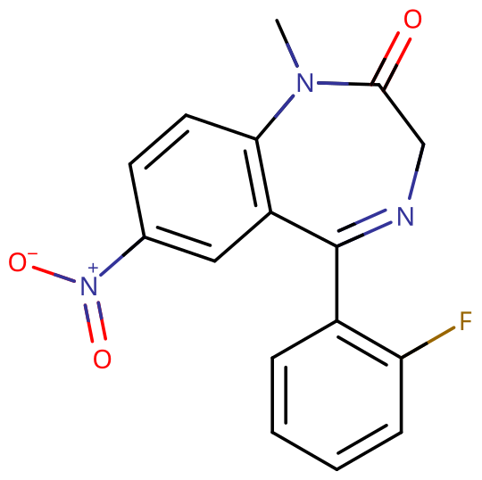
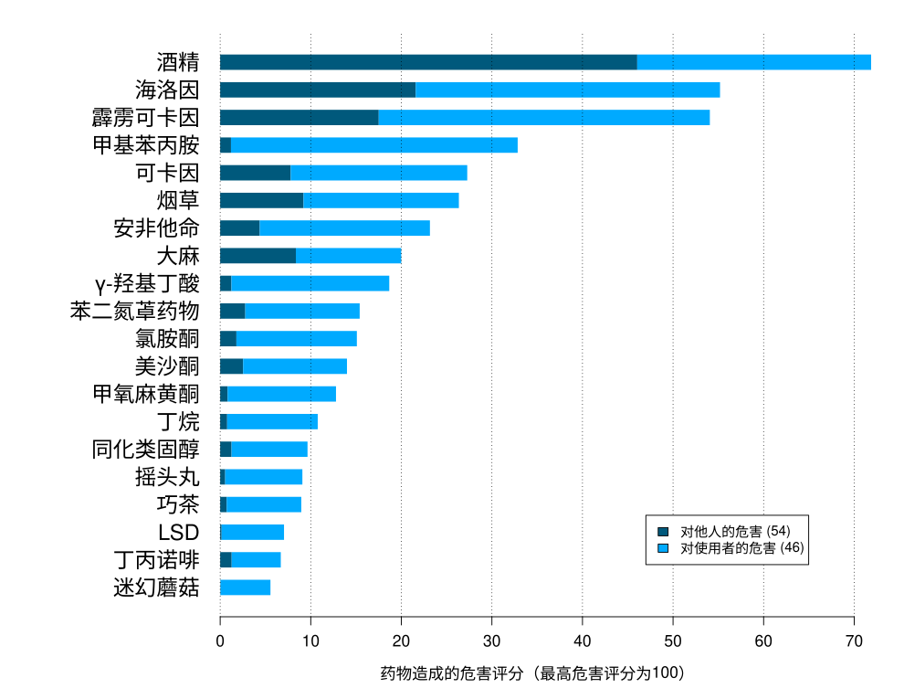
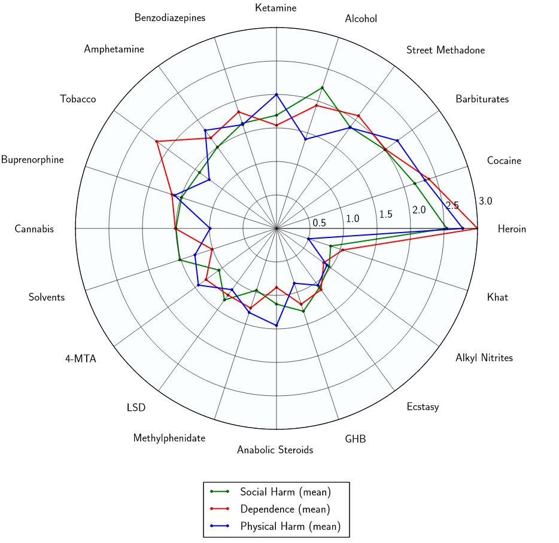

# 氟硝西泮

[◀返回](index.md)

!!! danger "联用危险"

    **当[苯二氮䓬类物质](../文档/药物分类/苯二氮䓬类物质.md)联用其他[抑制剂](../文档/药物分类/抑制剂.md)（如[阿片类药物](../文档/药物分类/阿片类药物.md)、[巴比妥类物质](../文档/药物分类/巴比妥类物质.md)、[加巴喷丁类物质](../文档/药物分类/加巴喷丁类物质.md)、[噻吩二氮䓬类物质](../文档/药物分类/噻吩二氮䓬类物质.md)、[酒精](酒精.md)或其他 [GABA](../文档/GABA.md) 能物质）时，可能导致致命的[药物过量](../文档/药物过量.md)。**[^1]

    强烈建议不要联用这些物质，尤其是在[中等](../文档/药物剂量分类.md#中等)到[严重](../文档/药物剂量分类.md#严重)剂量下。

| **化学信息** | 氟硝西泮（Flunitrazepam）                                                                                                                                                                                 |
| ------------ | --------------------------------------------------------------------------------------------------------------------------------------------------------------------------------------------------------- |
| 结构式       |                                                                                                                                                                             |
| 分子式       | C16H12FN3O3                                                                                                                                                   |
| CAS 号       | 1622-62-4                                                                                                                                                                                                 |
| **化学命名** |                                                                                                                                                                                                           |
| 常用名称     | 氟硝西泮（Flunitrazepam）、FM2、氟硝安定、氟硝基安定、罗眠乐（Rohypnol）、十字架、Roofies、Roches、Ruffies、Circles、Forget Pill、Forget Me Pill、La Rocha、Mexican Valium、R2、Roach 2、Rophies、Wolfies |
| 取代名称     | Flunitrazepam                                                                                                                                                                                             |
| 系统命名     | 5-(2-fluorophenyl)-1-methyl-7-nitro-3H-1,4-benzodiazepin-2-one                                                                                                                                            |
| **类别归属** |                                                                                                                                                                                                           |
| 精神活性分类 | [抑制剂](../文档/药物分类/抑制剂.md)                                                                                                                                                                      |
| 化学分类     | [苯二氮䓬类](../文档/药物分类/苯二氮䓬类物质.md)                                                                                                                                                          |

| [**给药途径**](../文档/给药途径.md)      | 🔽 [口服](../文档/给药途径.md#口服) |
| ---------------------------------------- | ----------------------------------- |
| [**给药剂量**](../文档/给药剂量.md)      |                                     |
| [阈值](../文档/药物剂量分类.md#阈值)     | 0.2 \~ 0.5 mg                       |
| [轻微](../文档/药物剂量分类.md#轻微)     | 0.5 \~ 1 mg                         |
| [中等](../文档/药物剂量分类.md#中等)     | 1 \~ 3 mg                           |
| [强烈](../文档/药物剂量分类.md#强烈)     | 3 \~ 4 mg                           |
| [严重](../文档/药物剂量分类.md#严重)     | 4 \~ 6 mg +                         |
| [**药效时长**](../文档/药效时长.md)      |                                     |
| [总时长](../文档/药效时长.md#总时长)     | 14 \~ 24 小时                       |
| [药效发作](../文档/药效时长.md#药效发作) | 20 \~ 30 分钟                       |
| [药效褪去](../文档/药效时长.md#药效褪去) | 8 ~ 14 小时                         |
| [药效残余](../文档/药效时长.md#药效褪去) | 2 \~ 24 小时                        |

- !!! warning "警告"

        由于个体体重、耐受性、新陈代谢和个人敏感度的差异，请务必从低剂量开始。参见[负责任的用药部分](../文档/负责任的用药索引页.md)。

    !!! info "[免责声明](../关于本站/免责声明.md)"

        本站的[给药剂量](../文档/给药剂量.md)信息收集自使用者和[相关资源](../文档/科学信息索引页.md)，仅供教育目的使用。这不是医疗建议，应与其他来源核实以确保准确性。

**氟硝西泮** 是一种[苯二氮䓬类](../文档/药物分类/苯二氮䓬类物质.md)长效[抑制剂](../文档/药物分类/抑制剂.md)，可用于术前麻醉诱导（但术后可能发生长时间嗜睡，不宜作为常规诱导）及各种失眠症。主要有[催眠](../文档/催眠药.md)和[失忆](../药效/失忆.md)作用，同时也产生[抗焦虑](../药效/焦虑抑制.md)、[抗惊厥](../药效/癫痫发作抑制.md)和[镇静](../药效/镇静.md)效果。[^2] 常被不法分子用于谋杀、迷奸、迷抢等案（事）件。

氟硝西泮因含在口中时舌头会变蓝，泡在酒水或饮料里会泛起蓝色，又名「蓝精灵」，取 Flunitrazepam 的首尾字母加原剂型每片两毫克而简称为 FM2。

氟硝西泮于 1972 年由 Hoffmann-La Roche 首次合成。在一些国家，它用于短期治疗[失眠](../药效/index.md)和作为术前镇静剂。按重量计算，它的效力大约是[地西泮](地西泮.md)的 10 倍。

长期使用者应注意[突然停用苯二氮䓬类药物](../文档/药物分类/苯二氮䓬类物质.md#停止使用与戒断)是危险的，有时会导致癫痫发作或死亡。[^3] 强烈建议通过在很长一段时间内逐渐减少每天服用的量来逐渐减少剂量，而不是突然停止。[^4]

此外长期使用会心理及生理上瘾产生戒断性，因为大量使用会有快感，而且价格便宜所以被很多人药物滥用，也可视作毒品。在中国大陆，氟硝西泮属于第二类精神药品，目前没有获批上市。未经批准携带氟硝西泮入境，可能涉嫌走私毒品罪。

## 历史与文化

氟硝西泮是在罗氏公司作为 Leo Sternbach 领导的苯二氮䓬类药物研究的一部分被发现的。它于 1974 年首次上市，并于 1975 年以 Rohypnol 的名义进入欧洲商业市场。在 1980 年代，它开始在其他国家上市。[^5]

它可能更广为人知的是约会强奸药 Rohypnol（街头名称为"roofie"）。1998 年，由于药物滥用和娱乐用途，罗氏公司修改了他们的 1 毫克药片，使其更难溶解并添加了蓝色染料，以便更容易在饮料中检测到。[^6]

在瑞典的研究中，氟硝西泮是自杀中使用的第二常见的药物，约占案例的 16%。在一项对 1587 例死亡的瑞典回顾性研究中，有 159 例发现了苯二氮䓬类药物。在涉及苯二氮䓬类药物的自杀中，与自然死亡相比，氟硝西泮和[硝西泮](../文档/药物分类/硝西泮.md)出现的浓度明显更高。[^5]

## 化学

氟硝西泮被归类为硝基苯二氮䓬。它是硝西泮的氟化 N-甲基衍生物。其他硝基苯二氮䓬包括硝西泮（母体化合物）、硝甲西泮（甲氨基衍生物）和氯硝西泮（2'-氯化衍生物）。[^7]

## 药理学

和其他苯二氮䓬类药物一样，氟硝西泮结合 GABAA 受体上的苯二氮䓬靶点，作为 [GABA](../文档/GABA.md)A [受体](../文档/受体.md)的正变构调节剂（PAM），促进 GABA（大脑中主要的抑制性[神经递质](../文档/神经递质.md)）结合 GABAA 受体，[^8] 提高 Cl⁻ 通道开放频率，从而增强抑制性神经传递，产生[镇静](../药效/镇静.md)和[抗焦虑](../药效/焦虑抑制.md)的效果。

苯二氮䓬类药物的抗[惊厥](../药效/癫痫发作抑制.md)特性可能部分或全部归因于与电压依赖性 Na+ 通道的结合，而非 GABAA 受体上的苯二氮䓬靶点。[^9]

足量的氟硝西泮会诱导顺行性遗忘（个体无法记住他们在药物影响下经历的某些事件）。这种效果特别危险，如果氟硝西泮被用来协助实施性侵犯，因为受害者可能无法清楚地回忆起袭击、袭击者或袭击周围的事件。[^5]

口服摄入的氟硝西泮有 80% 被吸收，但栓剂形式的生物利用度接近 50%。[^5]

## 主观效应

!!! info "[免责声明](../关于本站/免责声明.md)"

    _下列效应引用自 [**主观效应索引**](../药效/index.md)（**SEI**），这是一个基于轶事用户报告和个人分析的开放研究文献。因此，应带着健康的怀疑态度来看待它们。_

    _同样值得注意的是，这些效应不一定会以可预测或可靠的方式发生，尽管较高的剂量更可能引发全方位的效应。同样，**不良反应** 随着剂量的增加变得越来越可能，可能包括 **成瘾、严重伤害或死亡** ☠。_

氟硝西泮的一般心理状态被描述为一种强烈的镇静、困倦、放松、焦虑抑制、记忆抑制和抑制力下降，类似于较高剂量的[地西泮](地西泮.md)和[替马西泮](替马西泮.md)的心理状态。

- ### **[身体效应](../药效/躯体效应.md)** 
    - **[镇静](../药效/镇静.md)**：氟硝西泮会产生极度的镇静，经常导致压倒性的嗜睡状态。在较高水平下，这会导致使用者突然感觉自己极度睡眠不足并且已经好几天没睡了，迫使他们坐下来并通常感觉自己一直处于昏倒的边缘，而不是进行身体活动。这种睡眠剥夺感与剂量成正比，最终变得强大到足以迫使人完全失去知觉。
    - **[头晕](../药效/头晕.md)**
    - **[恶心](../药效/恶心.md)**
    - **[肌肉松弛](../药效/肌肉松弛.md)**
    - **[运动控制丧失](../药效/运动控制丧失.md)**
    - **[呼吸抑制](../药效/呼吸抑制.md)**
    - **[癫痫发作抑制](../药效/癫痫发作抑制.md)**
    - **[心率减慢](../药效/心率减慢.md)**
    - **[血压降低](../药效/血压降低.md)**
    - **[躯体沉重感](../药效/躯体沉重感.md)**：已知氟硝西泮会引起身体沉重感。这种效果的范围可以从较低剂量的运动障碍和移动困难到高剂量的完全嗜睡或无法站立或移动。
    - **[躯体欣快感](../药效/躯体欣快感.md)**：氟硝西泮带来的欣快感明显强于其他[苯二氮䓬类](../文档/药物分类/苯二氮䓬类物质.md)如[阿普唑仑](阿普唑仑.md)带来的欣快感。
    - **[口干](../药效/口干.md)**

- ### **矛盾效应** 

    对苯二氮䓬类药物的矛盾反应，如癫痫发作增加（在癫痫患者中）、攻击性、焦虑增加、暴力行为、冲动控制丧失、易怒和自杀行为有时会发生（尽管它们在普通人群中很少见，发生率低于 1%）。[^10] [^11] 这些矛盾效应在娱乐性滥用者、精神障碍患者、儿童和高剂量治疗患者中发生的频率更高。[^12] [^13]

- ### **[认知效应](../药效/认知效应.md)** 

    氟硝西泮的认知效应可以分解为几个部分，这些部分与剂量成正比地逐渐增强。它包含大量典型的[抑制剂](../文档/药物分类/抑制剂.md)认知效应。

    这些认知效应中最突出的通常包括：

    - **[失忆](../药效/失忆.md)**：氟硝西泮可引起相当大的失忆。
    - **[认知欣快](../药效/认知欣快.md)**：氟硝西泮带来的认知欣快感明显强于其他[苯二氮䓬类](../文档/药物分类/苯二氮䓬类物质.md)如[阿普唑仑](阿普唑仑.md)带来的欣快感。
    - **[焦虑抑制](../药效/焦虑抑制.md)**
    - **[思维减速](../药效/思维减速.md)**
    - **[分析能力抑制](../药效/分析能力抑制.md)**
    - **[去抑制](../药效/去抑制.md)**
    - **[强迫性补量](../药效/强迫性补量.md)**
    - **[情感抑制](../药效/情感抑制.md)**：尽管这种化合物主要抑制焦虑，但它也会使其他情绪变得迟钝，其方式明显但不像[抗精神病药](../文档/抗精神病药.md)那样强烈。
    - **[清醒错觉](../药效/妄想.md)**：这是一种错误的信念，即尽管有明显的证据表明相反，例如严重的认知障碍和无法与他人充分交流，但一个人是完全清醒的。它最常发生在严重剂量下。
    - **[记忆抑制](../药效/记忆抑制.md)**：氟硝西泮主要抑制短期记忆，导致健忘和/或混乱的行为。
    - **[混乱](../药效/混乱.md)**：在严重剂量下，氟硝西泮会导致混乱。这种效果是由于药物在严重剂量下抑制基本认知功能（如理解力、记忆力和推理能力）的结果。
    - **[动力抑制](../药效/动力抑制.md)**：由于氟硝西泮的重度镇静和嗜睡，在这种化合物上进行任何类型的需要移动或大量努力的活动可能很难做到，尤其是在较高剂量下。
    - **[语言能力抑制](../药效/语言能力抑制.md)**：氟硝西泮导致言语不清，难以以清晰或连贯的方式交流单词。
    - **[梦境强化](../药效/梦境强化.md)**：虽然大多数人报告说像氟硝西泮这样的苯二氮䓬类药物往往会导致无梦睡眠状态，但也报道了相反的效果，并且似乎在使用者经历 GABA 能物质戒断时特别普遍（酒精就是一个显著的例子）。造成这些差异的原因目前尚不清楚。

- ### **药效残余** 
    - **[焦虑](../药效/焦虑.md)**（反跳性焦虑）：反跳性焦虑是[焦虑缓解](../药效/焦虑抑制.md)物质如[苯二氮䓬类](../文档/药物分类/苯二氮䓬类物质.md)常见的观察到的效果。它通常对应于在该物质影响下花费的总时间以及在给定时间内消耗的总量，这种效应很容易导致依赖和成瘾的循环。
    - **[困倦](../药效/困倦.md)**（残留困倦）：虽然苯二氮䓬类药物可用作有效的[助眠](../文档/催眠药.md)辅助剂，但其效果可能会持续到第二天早上，这可能导致使用者在数小时内感到"昏昏沉沉"或"迟钝"。
    - **[梦境强化](../药效/梦境强化.md)** 或 **[梦境抑制](../药效/梦境抑制.md)**
    - **[思维减速](../药效/思维减速.md)**
    - **[思维混乱](../药效/思维混乱.md)**
    - **[易怒](../药效/易怒.md)**

### 体验报告

目前我们的[报告索引](../报告/index.md)中没有关于该物质效果的体验报告。你可以在[本站 Github 仓库](https://github.com/SalviaSWC/FreeODwiki)提交你自己的体验报告。

其他的体验报告可以在这里找到：

- [Erowid Experience Vaults: Flunitrazepam](https://erowid.org/experiences/subs/exp_Pharms_Flunitrazepam.shtml)

## 用法

### 制备方法

- **[液体容量给药法](../文档/液体容量给药法.md)**：如果一个人的苯二氮䓬类药物是粉末形式，由于其极高的效力，即使使用最精密的秤也难以准确称量。为了避免这种情况，可以将苯二氮䓬类药物按体积溶解到溶液中，并根据本教程中链接的方法说明准确给药[这里](../文档/液体容量给药法.md)。

## 毒性和危害潜力

|                                                                 |
| :-----------------------------------------------------------------------------------------------------------------------------: |
| 2010 年 ISCD 研究根据药物危害专家的陈述对各种药物（合法和非法）进行的排名表。苯二氮䓬类物质被发现是总体上第 10 位最危险的药物。 |

|                                    |
| :-----------------------------------------------------------------------------: |
| 雷达图显示了苯二氮䓬类药物与其他药物相比的相对身体伤害、社会伤害和依赖性。[^14] |

更多信息：[研究用化学品 § 毒性和危害潜力](../文档/研究用化学品.md)

相对于剂量，氟硝西泮可能具有较低的毒性。[^2] 然而，当与[酒精](酒精.md)或[阿片类药物](../文档/药物分类/阿片类药物.md)等[抑制剂](../文档/药物分类/抑制剂.md)混合时，它是潜在[致命](../药效/呼吸抑制.md)的。

### 致死剂量

氟硝西泮的口服 [LD50](../文档/药物过量.md)（半数致死剂量）在小鼠中为 1,200 mg/kg，在大鼠中为 415 mg/kg。

### 耐受性和成瘾潜力

氟硝西泮极易产生生理和心理成瘾。

连续使用几天后，会对镇静催眠作用产生耐受性。停止后，耐受性会在 7 \~ 14 天内恢复到基线。然而，在某些情况下，这也可能需要更长的时间，这与一个人长期使用的持续时间和强度成正比。

在稳定给药几周或更长时间后突然停止使用，可能会出现戒断症状或反跳症状，可能需要逐渐减少剂量。有关以受控方式从苯二氮䓬类药物逐渐减量的更多信息，请参阅[本指南](http://www.benzo.org.uk/manual/bzcha02.htm)。

[苯二氮䓬类药物停药](../文档/药物戒断反应.md)是非常困难的；对于经常使用的个人来说，如果不经过数周的剂量逐渐减少而停止使用，可能会危及生命。存在[高血压](../药效/血压升高.md)、[癫痫发作](../文档/癫痫发作.md)和死亡的风险增加。[^3] 在戒断期间应避免使用降低癫痫发作阈值的药物，如[曲马多](曲马多.md)。

氟硝西泮与所有[苯二氮䓬类](../文档/药物分类/苯二氮䓬类物质.md)均表现出交叉耐受性，这意味着在服用它之后，所有苯二氮䓬类药物的效果都会降低。

### 危险药物联用

!!! warning "警告"

    _许多精神活性物质在单独使用时相对安全，但与某些其他物质联用可能会突然变得危险甚至危及生命。_

    _请务必进行独立研究（例如 [Google](https://www.google.com)、[DuckDuckGo](https://www.duckduckgo.com)、[PubMed](https://pubmed.ncbi.nlm.nih.gov/)），确保多种物质的组合是安全的。部分列出的相互作用来自 [TripSit](https://combo.tripsit.me)。_

- **[抑制剂](../文档/药物分类/抑制剂.md)**（_[1,4-丁二醇](1,4-丁二醇.md)、[2-甲基-2-丁醇](2M2B.md)、[酒精](酒精.md)、[巴比妥类](../文档/药物分类/巴比妥类物质.md)、[GHB](GHB.md)/[GBL](GBL.md)、[甲喹酮](甲喹酮.md)、[阿片类药物](../文档/药物分类/阿片类药物.md)_）：这种组合可能导致危险甚至致命水平的[呼吸抑制](../药效/呼吸抑制.md)。这些物质会增强彼此引起的[肌肉松弛](../药效/肌肉松弛.md)、[镇静](../药效/镇静.md)和[失忆](../药效/失忆.md)，在高剂量下可能导致意外的意识丧失。在意识丧失期间还有呕吐的风险，以及由此导致的窒息死亡。如果发生这种情况，使用者应尝试以[恢复体位](../文档/恢复体位.md)入睡或让朋友将他们移入该体位。
- **[解离剂](../文档/药物分类/解离剂.md)**：这种组合可能导致意识丧失期间呕吐的风险增加，以及由此导致的窒息死亡。如果发生这种情况，使用者应尝试以[恢复体位](../文档/恢复体位.md)入睡或让朋友将他们移入该体位。
- **[兴奋剂](../文档/药物分类/兴奋剂.md)**：将苯二氮䓬类药物与[兴奋剂](../文档/药物分类/兴奋剂.md)结合使用是危险的，因为存在过度中毒的风险。兴奋剂会降低苯二氮䓬类药物的[镇静](../药效/镇静.md)作用，这是大多数人在确定其中毒程度时考虑的主要因素。一旦兴奋剂消退，苯二氮䓬类药物的作用将显著增加，导致强烈的[去抑制](../药效/去抑制.md)以及[其他效果](../文档/药物分类/苯二氮䓬类物质.md#主观效应)。如果混合使用，应严格限制自己每小时只服用一定量的苯二氮䓬类药物。如果不监测水分补充，这种组合还可能导致严重脱水。

### 过量

当大量服用苯二氮䓬类药物或与其他抑制剂同时服用时，可能会发生苯二氮䓬类过量。这对于其他 GABA 能抑制剂如[巴比妥类](../文档/药物分类/巴比妥类物质.md)和[酒精](酒精.md)尤其危险，因为它们的作用相似，但结合在 GABAA 受体上不同的变构位点。因此它们的效果会相互增强。苯二氮䓬类增加了 GABAA 受体上氯离子通道开放的频率，而巴比妥类增加了它们开放的持续时间，这意味着当两者都被消耗时，离子通道会更频繁地开放并保持开放更长时间。[^15] 苯二氮䓬类过量是一种医疗紧急情况，如果不及时和适当地治疗，可能会导致昏迷、永久性脑损伤或死亡。

苯二氮䓬类过量的症状可能包括严重的[思维减速](../药效/思维减速.md)、[言语不清](../药效/语言能力抑制.md)、[混乱](../药效/混乱.md)、[妄想](../药效/妄想.md)、[呼吸抑制](../药效/呼吸抑制.md)、昏迷或死亡。苯二氮䓬类过量可以在医院环境中得到有效治疗，结果通常良好。苯二氮䓬类过量有时用[氟马西尼](氟马西尼.md)（一种 GABAA 受体拮抗剂）治疗。[^16] 然而，护理主要是支持性的。

## 法律地位

国际方面，根据 1971 年《精神药物公约》，氟硝西泮属于附表 III 药物。

- **中国大陆**：1987 年公布的《卫生部关于精神药物进出口管理规定的补充通知》附件《精神药品品种》中有「氟硝西泮（氟硝安定）」。1989 年公布的《卫生部关于贯彻执行〈精神药品管理办法〉的通知》附件《精神药品品种及分类》将「氟硝西泮」列入第二类精神药品管理。1996 年版、2005 年版、2007 年版、2013 年版、2025 年版《精神药品品种目录》均将「氟硝西泮」列入第二类精神药品管理。[^19] 目前，中国大陆没有批准氟硝西泮上市。未经批准携带氟硝西泮入境，可能涉嫌走私毒品罪。
- **日本**：氟硝西泮由日本制药公司中外制药以商品名罗眠乐（Rohypnol）销售，用于治疗失眠症以及用作麻醉前用药。[^20]
- **澳大利亚**：氟硝西泮是附表 8（S8）或受控药物。
- **奥地利**：根据 AMG（Arzneimittelgesetz Österreich），氟硝西泮用于医疗用途是合法的，根据 SMG（Suchtmittelgesetz Österreich），在没有处方的情况下出售或拥有是非法的。
- **加拿大**：氟硝西泮属于附表 I 管制物质，仅凭处方提供。
- **德国**：自 2011 年 11 月起，氟硝西泮受 BtMG 附表 3 管制，需要特殊处方。
- **瑞士**：氟硝西泮被列为受控麻醉物质，但在主要病例中也被少量处方作为助眠剂。氟硝西泮片剂仅有 1 mg 剂量，染成绿色和蓝色，当在溶解的饮料中摄入时，会使人的嘴巴明显变色。[^17]
- **英国**：根据《2001 年滥用药物条例》，氟硝西泮属于 C 类，附表 4 受控药物。[^18]
- **美国**：根据美国《管制物质法》，氟硝西泮属于附表 IV 药物，但不用于医疗。入境美国的旅客最多只能携带 30 天的用量。该药物必须在抵达美国时向美国海关申报。如果无法出示有效处方，海关可能会对该药物进行检查和扣押，旅客也可能面临刑事指控或被驱逐出境。

## 另见

- [负责任的用药](../文档/负责任的用药索引页.md)
    - [液体容量给药法](../文档/液体容量给药法.md)
- [精神活性物质索引](../文档/药物全索引.md)
- [氟硝唑仑](氟硝唑仑.md)
- [替马西泮](替马西泮.md)
- [苯二氮䓬类](../文档/药物分类/苯二氮䓬类物质.md)
- [抑制剂](../文档/药物分类/抑制剂.md)

## 外部链接

- [Flunitrazepam (Wikipedia)](https://en.wikipedia.org/wiki/Flunitrazepam#Use)
- [Flunitrazepam (PsychonautWiki)](https://psychonautwiki.org/wiki/Flunitrazepam)
- [Flunitrazepam (Erowid Vault)](https://erowid.org/pharms/flunitrazepam/)
- [Flunitrazepam (Isomer Design)](https://isomerdesign.com/PiHKAL/explore.php?id=3035&name=Flunitrazepam)
- [Flunitrazepam (DrugBank)](https://go.drugbank.com/drugs/DB01544)

## 引用文献

[^1]: [_Risks of Combining Depressants - TripSit_](https://tripsit.me/combining-depressants/)

[^2]: Mandrioli, R., Mercolini, L., Raggi, M. A. (October 2008). "Benzodiazepine metabolism: an analytical perspective". _Current Drug Metabolism_. **9** (8): 827–844. [doi](http://en.wikipedia.org/wiki/Digital_object_identifier):[10.2174/138920008786049258](https://doi.org/10.2174/138920008786049258). [ISSN](http://en.wikipedia.org/wiki/International_Standard_Serial_Number) [1389-2002](https://www.worldcat.org/issn/1389-2002)

[^3]: Lann, M. A., Molina, D. K. (June 2009). "A fatal case of benzodiazepine withdrawal". _The American Journal of Forensic Medicine and Pathology_. **30** (2): 177–179. [doi](http://en.wikipedia.org/wiki/Digital_object_identifier):[10.1097/PAF.0b013e3181875aa0](https://doi.org/10.1097/PAF.0b013e3181875aa0). [ISSN](http://en.wikipedia.org/wiki/International_Standard_Serial_Number) [1533-404X](https://www.worldcat.org/issn/1533-404X)

[^4]: Kahan, M., Wilson, L., Mailis-Gagnon, A., Srivastava, A. (November 2011). ["Canadian guideline for safe and effective use of opioids for chronic noncancer pain. Appendix B-6: Benzodiazepine Tapering"](https://www.ncbi.nlm.nih.gov/pmc/articles/PMC3215603/). _Canadian Family Physician_. **57** (11): 1269–1276. [ISSN](http://en.wikipedia.org/wiki/International_Standard_Serial_Number) [0008-350X](https://www.worldcat.org/issn/0008-350X)

[^5]: [_Flunitrazepam_](https://en.wikipedia.org/w/index.php?title=Flunitrazepam&oldid=1100552588), 2022

[^6]: [_Flunitrazepam - TripSit wiki_](https://wiki.tripsit.me/wiki/Flunitrazepam)

[^7]: Robertson, M. D., Drummer, O. H. (May 1995). "Postmortem drug metabolism by bacteria". _Journal of Forensic Sciences_. **40** (3): 382–386. [ISSN](http://en.wikipedia.org/wiki/International_Standard_Serial_Number) [0022-1198](https://www.worldcat.org/issn/0022-1198)

[^8]: Haefely, W. (29 June 1984). "Benzodiazepine interactions with GABA receptors". _Neuroscience Letters_. **47** (3): 201–206. [doi](http://en.wikipedia.org/wiki/Digital_object_identifier):[10.1016/0304-3940(84)90514-7](<https://doi.org/10.1016/0304-3940(84)90514-7>). [ISSN](http://en.wikipedia.org/wiki/International_Standard_Serial_Number) [0304-3940](https://www.worldcat.org/issn/0304-3940)

[^9]: McLean, M. J., Macdonald, R. L. (February 1988). "Benzodiazepines, but not beta carbolines, limit high frequency repetitive firing of action potentials of spinal cord neurons in cell culture". _The Journal of Pharmacology and Experimental Therapeutics_. **244** (2): 789–795. [ISSN](http://en.wikipedia.org/wiki/International_Standard_Serial_Number) [0022-3565](https://www.worldcat.org/issn/0022-3565)

[^10]: Saïas, T., Gallarda, T. (September 2008). "[Paradoxical aggressive reactions to benzodiazepine use: a review]". _L'Encephale_. **34** (4): 330–336. [doi](http://en.wikipedia.org/wiki/Digital_object_identifier):[10.1016/j.encep.2007.05.005](https://doi.org/10.1016/j.encep.2007.05.005). [ISSN](http://en.wikipedia.org/wiki/International_Standard_Serial_Number) [0013-7006](https://www.worldcat.org/issn/0013-7006)

[^11]: Paton, C. (December 2002). ["Benzodiazepines and disinhibition: a review"](https://www.cambridge.org/core/journals/psychiatric-bulletin/article/benzodiazepines-and-disinhibition-a-review/421AF197362B55EDF004700452BF3BC6). _Psychiatric Bulletin_. **26** (12): 460–462. [doi](http://en.wikipedia.org/wiki/Digital_object_identifier):[10.1192/pb.26.12.460](https://doi.org/10.1192/pb.26.12.460). [ISSN](http://en.wikipedia.org/wiki/International_Standard_Serial_Number) [0955-6036](https://www.worldcat.org/issn/0955-6036)

[^12]: Bond, A. J. (1 January 1998). ["Drug- Induced Behavioural Disinhibition"](https://doi.org/10.2165/00023210-199809010-00005). _CNS Drugs_. **9** (1): 41–57. [doi](http://en.wikipedia.org/wiki/Digital_object_identifier):[10.2165/00023210-199809010-00005](https://doi.org/10.2165/00023210-199809010-00005). [ISSN](http://en.wikipedia.org/wiki/International_Standard_Serial_Number) [1179-1934](https://www.worldcat.org/issn/1179-1934)

[^13]: Drummer, O. H. (February 2002). "Benzodiazepines - Effects on Human Performance and Behavior". _Forensic Science Review_. **14** (1–2): 1–14. [ISSN](http://en.wikipedia.org/wiki/International_Standard_Serial_Number) [1042-7201](https://www.worldcat.org/issn/1042-7201)

[^14]: Nutt, D., King, L. A., Saulsbury, W., Blakemore, C. (24 March 2007). ["Development of a rational scale to assess the harm of drugs of potential misuse"](https://www.sciencedirect.com/science/article/pii/S0140673607604644). _The Lancet_. **369** (9566): 1047–1053. [doi](http://en.wikipedia.org/wiki/Digital_object_identifier):[10.1016/S0140-6736(07)60464-4](<https://doi.org/10.1016/S0140-6736(07)60464-4>). [ISSN](http://en.wikipedia.org/wiki/International_Standard_Serial_Number) [0140-6736](https://www.worldcat.org/issn/0140-6736)

[^15]: Twyman, R. E., Rogers, C. J., Macdonald, R. L. (March 1989). "Differential regulation of gamma-aminobutyric acid receptor channels by diazepam and phenobarbital". _Annals of Neurology_. **25** (3): 213–220. [doi](http://en.wikipedia.org/wiki/Digital_object_identifier):[10.1002/ana.410250302](https://doi.org/10.1002/ana.410250302). [ISSN](http://en.wikipedia.org/wiki/International_Standard_Serial_Number) [0364-5134](https://www.worldcat.org/issn/0364-5134)

[^16]: Hoffman, E. J., Warren, E. W. (September 1993). "Flumazenil: a benzodiazepine antagonist". _Clinical Pharmacy_. **12** (9): 641–656; quiz 699–701. [ISSN](http://en.wikipedia.org/wiki/International_Standard_Serial_Number) [0278-2677](https://www.worldcat.org/issn/0278-2677)

[^17]: <https://fedlex.data.admin.ch/filestore/fedlex.data.admin.ch/eli/cc/2011/363/20161201/de/pdf-a/fedlex-data-admin-ch-eli-cc-2011-363-20161201-de-pdf-a.pdf>

[^18]: List of drugs currently controlled under the misuse of drugs legislation | <https://www.gov.uk/government/uploads/system/uploads/attachment_data/file/164222/controlled-drugs-list.pdf>

[^19]: [国家药监局 公安部 国家卫生健康委关于发布药用类麻醉药品和精神药品目录的公告（2025年第55号）](https://www.nmpa.gov.cn/xxgk/ggtg/ypggtg/ypqtggtg/20250728092519123.html)

[^20]: ["Kusuri-no-Shiori Drug Information Sheet"](http://www.rad-ar.or.jp/siori/english/kekka.cgi?n=1051). RAD-AR Council, Japan. October 2015. Archived from [the original](http://www.rad-ar.or.jp/siori/english/kekka.cgi?n=1051) on March 3, 2016. Retrieved June 13, 2016.
