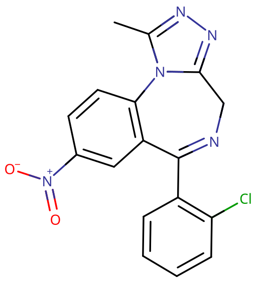

# 氯硝唑仑

[◀返回](index.md)

!!! danger "联用危险"

    **当[苯二氮䓬类物质](../文档/药物分类/苯二氮䓬类物质.md)联用其他[抑制剂](../文档/药物分类/抑制剂.md)（如[阿片类药物](../文档/药物分类/阿片类药物.md)、[巴比妥类物质](../文档/药物分类/巴比妥类物质.md)、[加巴喷丁类物质](../文档/药物分类/加巴喷丁类物质.md)、[噻吩二氮䓬类物质](../文档/药物分类/噻吩二氮䓬类物质.md)、[酒精](酒精.md)或其他 [GABA](../文档/GABA.md) 能物质）时，可能导致致命的[药物过量](../文档/药物过量.md)。**[^1]

    强烈建议不要联用这些物质，尤其是在[中等](../文档/药物剂量分类.md#中等)到[严重](../文档/药物剂量分类.md#严重)剂量下。

!!! info "信息"

    请勿与[氯硝西泮](氯硝西泮.md)混淆。

| **化学信息** | 氯硝唑仑（Clonazolam）                                                         |
| ------------ | ------------------------------------------------------------------------------ |
| 结构式       |                                                     |
| 分子式       | C17H12ClN5O2                       |
| CAS 号       | 33887-02-4                                                                     |
| **化学命名** |
| 常用名称     | 氯硝唑仑（Clonazolam）、Clonitrazolam、Clam、C-lam                             |
| 系统名称     | 6-(2-chlorophenyl)-1-methyl-8-nitro-4H-s-triazolo-(4,3-a)-(1,4)-benzodiazepine |
| **类别归属** |
| 精神活性分类 | _[抑制剂](../文档/药物分类/抑制剂.md)_                                         |
| 化学分类     | _[苯二氮䓬类物质](../文档/药物分类/苯二氮䓬类物质.md)_                         |

| [**给药途径**](../文档/给药途径.md)      | 🔽 [口服](../文档/给药途径.md#口服) |
| ---------------------------------------- | ----------------------------------- |
| [**剂量**](../文档/给药剂量.md)          |                                     |
| [阈值](../文档/药物剂量分类.md#阈值)     | 50 µg                               |
| [轻微](../文档/药物剂量分类.md#轻微)     | 75 \~ 200 µg                        |
| [中等](../文档/药物剂量分类.md#中等)     | 200 \~ 400 µg                       |
| [强烈](../文档/药物剂量分类.md#强烈)     | 400 \~ 999 µg                       |
| [严重](../文档/药物剂量分类.md#严重)     | 999 µg +                            |
| [**药效时长**](../文档/药效时长.md)      |                                     |
| [总时长](../文档/药效时长.md#总时长)     | 6 \~ 10 小时                        |
| [药效发作](../文档/药效时长.md#药效发作) | 10 \~ 30 分钟                       |

| [**相互作用**](#危险的相互作用) |             |
| ------------------------------- | ----------- |
| 兴奋剂                          | ⚠️ 谨慎联用 |
| 抑制剂                          | ⛔ 严禁联用 |
| 解离剂                          | ⛔ 严禁联用 |

- !!! warning "警告"

        由于个体体重、耐受性、新陈代谢和个人敏感度的差异，请务必从低剂量开始。参见[负责任的用药部分](../文档/负责任的用药索引页.md)。

    !!! info "[免责声明](../关于本站/免责声明.md)"

        本站的[给药剂量](../文档/给药剂量.md)信息收集自用户和[相关资源](../文档/科学信息索引页.md)，仅供教育目的使用。这不是医疗建议，应与其他来源核实以确保准确性。

**氯硝唑仑** 是一种新型的[苯二氮䓬类](../文档/药物分类/苯二氮䓬类物质.md)中效[抑制剂](../文档/药物分类/抑制剂.md)，具有[抗焦虑](../文档/药物分类/抗焦虑药.md)、[镇静](../药效/镇静.md)、[肌肉松弛](../药效/肌肉松弛.md)和[失忆](../药效/失忆.md)作用。这种化合物是[氯硝西泮](氯硝西泮.md)和[阿普唑仑](阿普唑仑.md)的新型衍生物（[研究用化学品](../文档/研究用化学品.md)，RC），从未被批准用于临床治疗，主要作为非法的娱乐性药物流通。氯硝唑仑的效力大约是阿普唑仑的 2.5 倍，具有中等长度的起效时间（20 \~ 60 分钟）。

氯硝唑仑的合成首次报道于 1971 年。它被描述为测试系列中最活跃的化合物。[^2] [^3]氯硝唑仑据称具有很高的效力，人们担心它和氟布溴唑仑可能比其他策划药苯二氮䓬类药物带来更高的风险，因为它们能够在低至 0.5 mg（500 µg）的口服剂量下产生强烈的镇静和失忆作用。[^4] 氯硝唑仑于 2014 年（欧洲）和 2016 年（美国）首次出现在娱乐毒品中。

关于这种物质的信息知之甚少，但最近它已变得很容易通过在线研究化学品供应商获得，并在那里作为[策划药](../文档/研究用化学品.md)出售。[^5] [^6]由于其极高的效力，它通常存在于吸墨纸上或[液体容量给药](../文档/液体容量给药法.md)的溶液中。摄入原始氯硝唑仑粉末是不安全的，因为它的效力在微克范围内，并且很容易导致多天的「断片」。

[突然停用苯二氮䓬类药物](../文档/药物分类/苯二氮䓬类物质.md#停止使用与戒断)可能会导致癫痫发作（在某些情况下可能危及生命[^7]），特别是对于长期大量使用的人来说。出于这个原因，建议在一段时间内逐渐降低每日剂量，而不是突然停止——这种技术被称为[减量戒断](../文档/减量戒断法.md)。[^8]

与其他苯二氮䓬类药物一样，氯硝唑仑具有高度的依赖性和成瘾潜力，以及类似[酒精](酒精.md)的诱发危险[去抑制](../药效/去抑制.md)和[断片](../药效/失忆.md)的副作用。

## 化学

氯硝唑仑是苯二氮䓬类药物。苯二氮䓬类药物包含一个与二氮䓬环稠合的苯环，二氮䓬环是一个七元环，两个氮成分位于 R1 和 R4 位置。氯硝唑仑的苄基环在 R8 处被硝基基团 -NO2 取代。此外，二氮䓬环在 R5 处与 2-氯化苯环键合。

氯硝唑仑还包含一个 1-甲基化的三唑环，该环与二氮䓬环的 R1 和 R2 稠合并没有并入其中。氯硝唑仑属于含有这种稠合三唑环的一类苯二氮䓬类物质，称为三唑苯二氮䓬，以后缀 -zolam（-唑仑）区分。氯硝唑仑也是一种硝基苯二氮䓬，这是含有硝基（-NO2）基团的苯二氮䓬类的一个亚类。其他硝基苯二氮䓬包括[氯硝西泮](氯硝西泮.md)和[氟硝西泮](氟硝西泮.md)。

## 药理学

和其他苯二氮䓬类药物一样，氯硝唑仑结合 GABAA 受体上的苯二氮䓬靶点，作为 [GABA](../文档/GABA.md)A [受体](../文档/受体.md)的正变构调节剂（PAM），促进 GABA（大脑中主要的抑制性[神经递质](../文档/神经递质.md)）结合 GABAA 受体，[^9] 提高 Cl⁻ 通道开放频率，从而增强抑制性神经传递，产生[镇静](../药效/镇静.md)和[抗焦虑](../药效/焦虑抑制.md)的效果。

苯二氮䓬类物质的[抗惊厥](../药效/癫痫发作抑制.md)特性可能部分或全部归因于结合到电压依赖性钠离子通道（VDSC）而不是苯二氮䓬靶点。[^10] 氯硝唑仑被羟基化，主要还原为 7-氨基苯二氮䓬，然后被乙酰化。

在一系列三唑苯二氮䓬类物质中，它是总体上最活跃的，有时证明在小鼠中小于 10 μg/kg 就有效。[^11]

## 主观效应

据报道，氯硝唑仑类似于阿普唑仑和其他苯二氮䓬类药物，会抑制情绪并在身体中产生中度至强烈的放松、愉悦和舒适感。这似乎更常出现在那些已有焦虑症的人身上。许多使用该化合物的轶事报告称其为最令人欣快的苯二氮䓬类药物之一。

氯硝唑仑的认知效应被认为主要是失忆，但也包括苯二氮䓬类药物常见的大多数其他典型效应。据报道，氯硝唑仑导致「断片」的比率高于其他苯二氮䓬类药物。

!!! info "[免责声明](../关于本站/免责声明.md)"

    _下列效应引用自 [**主观效应索引**](../药效/index.md)（**SEI**），这是一个基于轶事用户报告和个人分析的开放研究文献。因此，应带着健康的怀疑态度来看待它们。_

    _同样值得注意的是，这些效应不一定会以可预测或可靠的方式发生，尽管较高的剂量更可能引发全方位的效应。同样，**不良反应** 随着剂量的增加变得越来越可能，可能包括 **成瘾、严重伤害或死亡** ☠。_

- ### **身体效应** 
    - **[镇静](../药效/镇静.md)**：氯硝唑仑有可能产生极强的镇静作用，通常会导致压倒性的嗜睡状态。在较高水平下，这会导致用户突然感觉自己极度睡眠不足，好像已经好几天没睡觉了一样，迫使他们坐下来，通常感觉自己处于昏厥的边缘，而不是从事体育活动。这种睡眠不足的感觉与剂量成正比增加，最终变得足够强大，迫使人完全失去知觉。
    - **[肌肉松弛](../药效/肌肉松弛.md)**：与[阿普唑仑](阿普唑仑.md)等其他苯二氮䓬类药物相比，这种效应特别强。
    - **[运动控制丧失](../药效/运动控制丧失.md)**：与其他苯二氮䓬类药物相比，这种效应特别强。如果不小心，可能会非常快地失去平衡。由于严重无法走直线，有时必须抓住墙壁或栏杆。
    - **[头晕](../药效/头晕.md)**
    - **[性欲增强](../药效/性欲增强.md)**
    - **[呼吸抑制](../药效/呼吸抑制.md)**

- ### **视觉效应** 
    - **[视觉锐度抑制](../药效/视觉锐度抑制.md)**：像许多[抑制剂](../文档/药物分类/抑制剂.md)一样，氯硝唑仑已知在高剂量下会导致视力模糊或其他视觉敏锐度受抑。

- ### **反常效应** 

    对[苯二氮䓬类物质](../文档/药物分类/苯二氮䓬类物质.md)的反常反应，如癫痫发作增加（在癫痫患者中）、攻击性、焦虑增加、暴力行为、冲动控制丧失、易怒和自杀行为有时会发生（尽管它们在普通人群中很少见，发生率低于 1%）。[^12] [^13] 这些反常效应在娱乐性滥用者、精神障碍患者、儿童和高剂量治疗的患者中发生的频率更高。[^14] [^15]

- ### **[认知效应](../药效/认知效应.md)** 
    - **[焦虑抑制](../药效/焦虑抑制.md)**
    - **[失忆](../药效/失忆.md)**：据报道，氯硝唑仑导致“断片”的比率高于其他苯二氮䓬类药物。
    - **[去抑制](../药效/去抑制.md)**
    - **[欣快](../药效/认知欣快.md)**：相当一部分用户报告在受这种物质影响时感到明显的心理健康和舒适感。因为这对大多数用户来说不会经常或持续发生，推测这种效应只出现在那些基线焦虑水平异常高的人身上。然而，没有焦虑问题的人也报告氯硝唑仑令人欣快。
    - **[强迫性补量](../药效/强迫性补量.md)**
    - **[情感抑制](../药效/情感抑制.md)**：虽然这种化合物主要抑制焦虑，但它也以一种独特但不如抗精神病药强烈的方式迟钝化其他情绪。
    - **[清醒错觉](../药效/妄想.md)**：这是一种错误的信念，即尽管有明显的证据表明相反的情况，如严重的认知障碍和无法与他人充分交流，但仍认为自己完全清醒。这最常发生在严重剂量下。
    - **[记忆抑制](../药效/记忆抑制.md)**：氯硝唑仑主要抑制短期记忆，导致健忘和/或行为混乱。
    - **[分析能力抑制](../药效/分析能力抑制.md)**
    - **[动力抑制](../药效/动力抑制.md)**：由于氯硝唑仑的强烈镇静和嗜睡作用，在这种化合物作用下进行任何类型的需要移动或大量努力的活动可能很难做到，特别是在较高剂量下。
    - **[思维减速](../药效/思维减速.md)**
    - **[语言能力抑制](../药效/语言能力抑制.md)**：众所周知，氯硝唑仑和大多数苯二氮䓬类药物会导致口齿不清和难以清晰地表达词语。
    - **[困倦](../药效/困倦.md)**

- ### **药效残余** 
    - **[反跳性焦虑](../药效/焦虑.md)**：反跳性焦虑是[抗焦虑](../药效/焦虑抑制.md)物质如[苯二氮䓬类物质](../文档/药物分类/苯二氮䓬类物质.md)和[依替唑仑](依替唑仑.md)常见的观察效应。它通常与处于物质影响下的总持续时间以及在给定时期内的总消耗量相对应，这种效应很容易导致依赖和成瘾的循环。
    - **[梦境强化](../药效/梦境强化.md)** 或 **[梦境抑制](../药效/梦境抑制.md)**
    - **[残留困倦](../药效/困倦.md)**：虽然氯硝唑仑可以用作有效的[助眠](../文档/催眠药.md)辅助，但其效果可能会持续到第二天早上，这可能会导致用户在长达几个小时的时间里感到“昏昏沉沉”或“迟钝”。
    - **[思维减速](../药效/思维减速.md)**
    - **[思维混乱](../药效/思维混乱.md)**
    - **[易怒](../药效/易怒.md)**
    - **[动力抑制](../药效/动力抑制.md)**

### 体验报告

目前我们的[报告索引](../报告/index.md)中没有关于该物质效果的体验报告。你可以在[本站 Github 仓库](https://github.com/SalviaSWC/FreeODwiki)提交你自己的体验报告。

- PsychonautWiki：
    1. [Experience:3-MeO-PCP, LSD, Clonazolam, and Amphetamine - Excessive Amounts and Excessive Confusion](https://psychonautwiki.org/wiki/Experience:3-MeO-PCP,_LSD,_Clonazolam,_and_Amphetamine_-_Excessive_Amounts_and_Excessive_Confusion)
    2. [Experience:Clonazolam (2 mg, sublingual) - A peaceful, misunderstood benzodiazepine](https://psychonautwiki.org/wiki/Experience:Clonazolam_%282_mg,_sublingual%29_-_A_peaceful,_misunderstood_benzodiazepine)
    3. [Experience:Clonazolam + 2-methyl-AP-237 (unknown dosage) - Cardiac arrest](https://psychonautwiki.org/wiki/Experience:Clonazolam_%252B_2-methyl-AP-237_%28unknown_dosage%29_-_Cardiac_arrest)
- [Erowid Experience Vaults: Clonazolam](https://www.erowid.org/experiences/subs/exp_Clonazolam.shtml)

## 常见用法

### 制备方法

- **[液体容量给药法](../文档/液体容量给药法.md)**：如果你的苯二氮䓬类药物是粉末形式，由于它们极高的效力，如果没有最昂贵的秤，很难准确称量。氯硝唑仑特别需要准确称量和进行液体容量给药，因为它在微克范围内有效。为了避免不良反应，可以将[苯二氮䓬类物质](../文档/药物分类/苯二氮䓬类物质.md)按体积溶解到溶液中，并根据本教程[这里](../文档/液体容量给药法.md)链接的方法说明准确给药。

## 毒性与危害潜力

|                                                                 |
| :-----------------------------------------------------------------------------------------------------------------------------: |
| 2010 年 ISCD 研究根据药物危害专家的陈述对各种药物（合法和非法）进行的排名表。苯二氮䓬类物质被发现是总体上第 10 位最危险的药物。 |

|                                    |
| :-----------------------------------------------------------------------------: |
| 雷达图显示了苯二氮䓬类物质与其他药物相比的相对身体危害、社会危害和依赖性。[^16] |

更多信息：[研究用化学品 § 毒性与危害潜力](../文档/研究用化学品.md#毒性与危害潜力)

相对于剂量，氯硝唑仑的毒性可能较低。[^17] 然而，当与[酒精](酒精.md)或[阿片类药物](../文档/药物分类/阿片类药物.md)等[抑制剂](../文档/药物分类/抑制剂.md)混合使用时，它具有潜在的致死性。

强烈建议在使用该物质时采取[伤害减少措施](../文档/负责任的用药索引页.md)，例如[液体容量给药](../文档/液体容量给药法.md)，以确保准确给药。

### 耐药性和成瘾潜力

氯硝唑仑通常被认为具有极强的生理和心理成瘾性。

连续使用几天后，会对镇静催眠效应产生耐药性。停止使用后，耐药性会在 7 \~ 14 天内恢复到基线水平。然而，在某些情况下，这可能需要更长的时间，具体取决于长期使用的持续时间和强度。

氯硝唑仑与所有苯二氮䓬类药物存在交叉耐药性，在服用它之后，再使用其他所有苯二氮䓬类药物的效果都会降低。

### 停药与戒断

苯二氮䓬类药物的停药是出了名的难受；对于经常使用的人来说，如果不经过数周的剂量递减就停止使用，可能会危及生命。存在[高血压](../药效/血压升高.md)、[癫痫发作](../药效/癫痫发作.md)和死亡的风险增加。[^18] 在戒断期间应避免使用降低癫痫阈值的药物，如[曲马多](曲马多.md)。突然停药还会引起反跳性刺激，表现为[焦虑](../药效/焦虑.md)、[失眠](../药效/清醒.md)和烦躁不安。

如果希望在定期使用一段时间后停药，最安全的方法是在几周内每天减少极少量的剂量，直到接近戒断。如果使用短半衰期的苯二氮䓬类药物，如[阿普唑仑](阿普唑仑.md)或[依替唑仑](依替唑仑.md)，可以替换为长效品种，如[地西泮](地西泮.md)或[氯硝西泮](氯硝西泮.md)。症状可能仍然存在，但其严重程度将显著降低。

有关以受控方式从苯二氮䓬类药物中减量戒断的更多信息，请参阅[本指南](http://www.benzo.org.uk/manual/bzcha02.htm)。少量的[酒精](酒精.md)也可以帮助减轻症状，但在其他方面不能用作有效的减量戒断剂。

戒断症状的持续时间和严重程度取决于许多因素，包括所用物质的半衰期、耐药性和滥用的持续时间。对于持续时间较短的苯二氮䓬类药物，主要症状通常在停药后几天内开始，并持续约一周。半衰期较长的苯二氮䓬类药物将表现出起效缓慢且持续时间延长的戒断症状。

### 药物过量

苯二氮䓬类药物过量可能发生在极高剂量下，或者更常见的是与其它[抑制剂](../文档/药物分类/抑制剂.md)一起服用时。这种风险在与其他[GABA 能](../文档/GABA.md)抑制剂（如[巴比妥类物质](../文档/药物分类/巴比妥类物质.md)和[酒精](酒精.md)）一起使用时尤其存在，因为它们以类似的方式工作，但结合在 GABA 受体的不同位点上，导致显著的交叉增强作用。

苯二氮䓬类药物过量是一种医疗紧急情况，如果不及时治疗，可能会导致昏迷、永久性脑损伤或死亡。症状可能包括严重的[口齿不清](../药效/语言能力抑制.md)、[混乱](../药效/混乱.md)、[妄想](../药效/妄想.md)、[呼吸抑制](../药效/呼吸抑制.md)和无反应。用户看起来可能像是在梦游。由于判断力受损，用户也更容易消耗更多相同或另一种物质，这在其他物质过量期间通常看不到。

苯二氮䓬类药物过量可以在医院环境中得到有效治疗，结果通常良好。护理主要是支持性的，尽管过量有时用[氟马西尼](氟马西尼.md)（一种 GABA 拮抗剂[^19]）或在涉及其他物质时用[肾上腺素](../文档/肾上腺素.md)注射等额外程序治疗。

### 危险的相互作用

!!! warning "警告"

    _许多精神活性物质在单独使用时相对安全，但与某些其他物质联用可能会突然变得危险甚至危及生命。_

    _请务必进行独立研究（例如 [Google](https://www.google.com)、[DuckDuckGo](https://www.duckduckgo.com)、[PubMed](https://pubmed.ncbi.nlm.nih.gov/)），确保多种物质的组合是安全的。部分列出的相互作用来自 [TripSit](https://combo.tripsit.me)。_

- **抑制剂** （_[1,4-丁二醇](1,4-丁二醇.md)、[2M2B](2M2B.md)、[酒精](酒精.md)、[苯二氮䓬类物质](../文档/药物分类/苯二氮䓬类物质.md)、[巴比妥类物质](../文档/药物分类/巴比妥类物质.md)、[GHB](GHB.md)/[GBL](GBL.md)、[甲喹酮](甲喹酮.md)、[阿片类药物](../文档/药物分类/阿片类药物.md)_）：这种组合会增强彼此引起的[肌肉松弛](../药效/肌肉松弛.md)、[失忆](../药效/失忆.md)、[镇静](../药效/镇静.md)和[呼吸抑制](../药效/呼吸抑制.md)。在高剂量下，它可能导致突然、意外的意识丧失以及危险程度的呼吸抑制。在无意识状态下因呕吐物窒息的风险也会增加。如果在意识丧失之前发生[恶心](../药效/恶心.md)或呕吐，用户应尝试以[恢复体位](../文档/恢复体位.md)入睡，或让朋友帮助摆成该体位。
- **解离剂**：这种组合可能不可预测地增强彼此引起的[失忆](../药效/失忆.md)、[镇静](../药效/镇静.md)、[运动控制丧失](../药效/运动控制丧失.md)和[妄想](../药效/妄想.md)。它还可能导致突然的意识丧失，并伴有危险程度的[呼吸抑制](../药效/呼吸抑制.md)。如果在意识丧失之前发生[恶心](../药效/恶心.md)或呕吐，用户应尝试以[恢复体位](../文档/恢复体位.md)入睡，或让朋友帮助摆成该体位。
- **兴奋剂**：兴奋剂会掩盖抑制剂的[镇静](../药效/镇静.md)作用，这是大多数人用来衡量其中毒程度的主要因素。一旦兴奋剂作用消退，抑制剂的作用将显著增加，导致[去抑制](../药效/去抑制.md)加剧、[运动控制丧失](../药效/运动控制丧失.md)和危险的[断片状态](../药效/失忆.md)。如果液体的摄入没有受到密切监测，这种组合也可能导致严重脱水。如果选择混合使用这些物质，应严格限制自己每小时只服用一定量，直到达到最大阈值。

## 法律地位

- **中国大陆**：氯硝唑仑在中国大陆属于被严格监控的新型精神活性物质（策划药），虽未列入传统苯二氮䓬类药物目录，但按国家禁毒办政策，符合结构相似、功能替代的整类列管判定标准，纳入非药用类管制。
- **捷克共和国**：氯硝唑仑是附表 I（清单 4）物质。仅用于有限的研究目的或非常有限的治疗目的。（_Nařízení vlády č. 463/2013 Sb._ 第 1 条 d 款 2 项）[^20] [^21]
- **德国**：截至 2021 年 11 月 11 日，氯硝唑仑受 BTMG（麻醉品法）附表 II 管制。以投放市场为目的的生产和进口、对他人的管理、持有和交易均属非法。[^22] [^23] [^24]
- **日本**：氯硝唑仑在日本受《药事法》管制，持有或销售均属非法。[^25]
- **波兰**：氯硝唑仑在波兰属于 NPS 类药物，持有或分销均属非法。[^26]
- **俄罗斯**：自 2017 年起，氯硝唑仑成为附表 III 管制物质。[^27]
- **瑞典**：氯硝唑仑被归类为成瘾物质。生产、进口、交易和持有需要特别许可。[^28]
- **瑞士**：氯硝唑仑是 Verzeichnis E 下明确命名的管制物质。[^29]
- **荷兰**：氯硝唑仑是鸦片法清单 2 物质，属非法。[^30]
- **英国**：截至 2017 年 5 月 31 日，氯硝唑仑在英国属于 C 类药物，持有、生产或供应均属非法。[^31]
- **美国**：截至 2023 年 1 月 23 日，氯硝唑仑是附表 I 管制物质。[^32]
    - **俄勒冈州**：氯硝唑仑现在在俄勒冈州被归类为附表 I 物质。[^33]
    - **弗吉尼亚州**：氯硝唑仑现在在弗吉尼亚州被归类为附表 I 物质。[^34]

## 另见

- [负责任的用药](../文档/负责任的用药索引页.md)
    - [液体容量给药法](../文档/液体容量给药法.md)
- [研究用化学品](../文档/研究用化学品.md)
- [抑制剂](../文档/药物分类/抑制剂.md)
- [苯二氮䓬类物质](../文档/药物分类/苯二氮䓬类物质.md)
- [酒精](酒精.md)

## 外部链接

- [Clonazolam (Wikipedia)](https://en.wikipedia.org/wiki/Clonazolam)
- [Clonazolam (PsychonautWiki)](https://psychonautwiki.org/wiki/Clonazolam)
- [Clonazolam (Isomer Design)](https://isomerdesign.com/PiHKAL/explore.php?id=3036)
- [Clonazolam (DrugBank)](https://go.drugbank.com/drugs/DB14716)

## 引用文献

[^1]: [_Risks of Combining Depressants - TripSit_](https://tripsit.me/combining-depressants/)

[^2]: Hester, J. B., Rudzik, A. D., Kamdar, B. V. (November 1971). "6-phenyl-4H-s-triazolo[4,3-a][1,4]benzodiazepines which have central nervous system depressant activity". _Journal of Medicinal Chemistry_. **14** (11): 1078–1081. [doi](http://en.wikipedia.org/wiki/Digital_object_identifier 'wikipedia:Digital object identifier'):[10.1021/jm00293a015](https://doi.org/10.1021%2Fjm00293a015). [ISSN](http://en.wikipedia.org/wiki/International_Standard_Serial_Number 'wikipedia:International Standard Serial Number') [0022-2623](https://www.worldcat.org/issn/0022-2623).

[^3]: Borer, R., Gerecke, M. D., Kyburz, E. D., [_Triazolobenzazepines, process and intermediates for their preparation and medicines containing them_](https://patents.google.com/patent/EP0072029B1/en)

[^4]: Moosmann, B., King, L. A., Auwärter, V. (June 2015). "Designer benzodiazepines: A new challenge". _World psychiatry: official journal of the World Psychiatric Association (WPA)_. **14** (2): 248. [doi](http://en.wikipedia.org/wiki/Digital_object_identifier 'wikipedia:Digital object identifier'):[10.1002/wps.20236](https://doi.org/10.1002%2Fwps.20236). [ISSN](http://en.wikipedia.org/wiki/International_Standard_Serial_Number 'wikipedia:International Standard Serial Number') [1723-8617](https://www.worldcat.org/issn/1723-8617).

[^5]: Huppertz, L. M., Bisel, P., Westphal, F., Franz, F., Auwärter, V., Moosmann, B. (1 July 2015). ["Characterization of the four designer benzodiazepines clonazolam, deschloroetizolam, flubromazolam, and meclonazepam, and identification of their in vitro metabolites"](https://doi.org/10.1007/s11419-015-0277-6). _Forensic Toxicology_. **33** (2): 388–395. [doi](http://en.wikipedia.org/wiki/Digital_object_identifier 'wikipedia:Digital object identifier'):[10.1007/s11419-015-0277-6](https://doi.org/10.1007%2Fs11419-015-0277-6). [ISSN](http://en.wikipedia.org/wiki/International_Standard_Serial_Number 'wikipedia:International Standard Serial Number') [1860-8973](https://www.worldcat.org/issn/1860-8973).

[^6]: Meyer, M. R., Bergstrand, M. P., Helander, A., Beck, O. (May 2016). "Identification of main human urinary metabolites of the designer nitrobenzodiazepines clonazolam, meclonazepam, and nifoxipam by nano-liquid chromatography-high-resolution mass spectrometry for drug testing purposes". _Analytical and Bioanalytical Chemistry_. **408** (13): 3571–3591. [doi](http://en.wikipedia.org/wiki/Digital_object_identifier 'wikipedia:Digital object identifier'):[10.1007/s00216-016-9439-6](https://doi.org/10.1007%2Fs00216-016-9439-6). [ISSN](http://en.wikipedia.org/wiki/International_Standard_Serial_Number 'wikipedia:International Standard Serial Number') [1618-2650](https://www.worldcat.org/issn/1618-2650).

[^7]: Lann, M. A., Molina, D. K. (June 2009). "A fatal case of benzodiazepine withdrawal". _The American Journal of Forensic Medicine and Pathology_. **30** (2): 177–179. [doi](http://en.wikipedia.org/wiki/Digital_object_identifier 'wikipedia:Digital object identifier'):[10.1097/PAF.0b013e3181875aa0](https://doi.org/10.1097%2FPAF.0b013e3181875aa0). [ISSN](http://en.wikipedia.org/wiki/International_Standard_Serial_Number 'wikipedia:International Standard Serial Number') [1533-404X](https://www.worldcat.org/issn/1533-404X).

[^8]: Kahan, M., Wilson, L., Mailis-Gagnon, A., Srivastava, A., National Opioid Use Guideline Group (November 2011). "Canadian guideline for safe and effective use of opioids for chronic noncancer pain: clinical summary for family physicians. Appendix B-6: Benzodiazepine Tapering". _Canadian Family Physician_. **57** (11): 1269–1276. [ISSN](http://en.wikipedia.org/wiki/International_Standard_Serial_Number 'wikipedia:International Standard Serial Number') [1715-5258](https://www.worldcat.org/issn/1715-5258).

[^9]: Haefely, W. (29 June 1984). "Benzodiazepine interactions with GABA receptors". _Neuroscience Letters_. **47** (3): 201–206. [doi](http://en.wikipedia.org/wiki/Digital_object_identifier 'wikipedia:Digital object identifier'):[10.1016/0304-3940(84)90514-7](https://doi.org/10.1016%2F0304-3940%2884%2990514-7). [ISSN](http://en.wikipedia.org/wiki/International_Standard_Serial_Number 'wikipedia:International Standard Serial Number') [0304-3940](https://www.worldcat.org/issn/0304-3940).

[^10]: McLean, M. J., Macdonald, R. L. (February 1988). "Benzodiazepines, but not beta carbolines, limit high frequency repetitive firing of action potentials of spinal cord neurons in cell culture". _The Journal of Pharmacology and Experimental Therapeutics_. **244** (2): 789–795. [ISSN](http://en.wikipedia.org/wiki/International_Standard_Serial_Number 'wikipedia:International Standard Serial Number') [0022-3565](https://www.worldcat.org/issn/0022-3565).

[^11]: Hester, J. B., Rudzik, A. D., Kamdar, B. V. (November 1971). ["6-Phenyl-4H-s-triazolo[4,3-a][1,4]benzodiazepines which have central nervous system depressant activity"](https://pubs.acs.org/doi/abs/10.1021/jm00293a015). _Journal of Medicinal Chemistry_. **14** (11): 1078–1081. [doi](http://en.wikipedia.org/wiki/Digital_object_identifier 'wikipedia:Digital object identifier'):[10.1021/jm00293a015](https://doi.org/10.1021%2Fjm00293a015). [ISSN](http://en.wikipedia.org/wiki/International_Standard_Serial_Number 'wikipedia:International Standard Serial Number') [0022-2623](https://www.worldcat.org/issn/0022-2623).

[^12]: Saïas, T., Gallarda, T. (September 2008). "[Paradoxical aggressive reactions to benzodiazepine use: a review]". _L’Encephale_. **34** (4): 330–336. [doi](http://en.wikipedia.org/wiki/Digital_object_identifier 'wikipedia:Digital object identifier'):[10.1016/j.encep.2007.05.005](https://doi.org/10.1016%2Fj.encep.2007.05.005). [ISSN](http://en.wikipedia.org/wiki/International_Standard_Serial_Number 'wikipedia:International Standard Serial Number') [0013-7006](https://www.worldcat.org/issn/0013-7006).

[^13]: Paton, C. (December 2002). ["Benzodiazepines and disinhibition: a review"](https://www.cambridge.org/core/journals/psychiatric-bulletin/article/benzodiazepines-and-disinhibition-a-review/421AF197362B55EDF004700452BF3BC6). _Psychiatric Bulletin_. **26** (12): 460–462. [doi](http://en.wikipedia.org/wiki/Digital_object_identifier 'wikipedia:Digital object identifier'):[10.1192/pb.26.12.460](https://doi.org/10.1192%2Fpb.26.12.460). [ISSN](http://en.wikipedia.org/wiki/International_Standard_Serial_Number 'wikipedia:International Standard Serial Number') [0955-6036](https://www.worldcat.org/issn/0955-6036).

[^14]: Bond, A. J. (1 January 1998). ["Drug- Induced Behavioural Disinhibition"](https://doi.org/10.2165/00023210-199809010-00005). _CNS Drugs_. **9** (1): 41–57. [doi](http://en.wikipedia.org/wiki/Digital_object_identifier 'wikipedia:Digital object identifier'):[10.2165/00023210-199809010-00005](https://doi.org/10.2165%2F00023210-199809010-00005). [ISSN](http://en.wikipedia.org/wiki/International_Standard_Serial_Number 'wikipedia:International Standard Serial Number') [1179-1934](https://www.worldcat.org/issn/1179-1934).

[^15]: Drummer, O. H. (February 2002). "Benzodiazepines - Effects on Human Performance and Behavior". _Forensic Science Review_. **14** (1–2): 1–14. [ISSN](http://en.wikipedia.org/wiki/International_Standard_Serial_Number 'wikipedia:International Standard Serial Number') [1042-7201](https://www.worldcat.org/issn/1042-7201).

[^16]: Nutt, D., King, L. A., Saulsbury, W., Blakemore, C. (24 March 2007). ["Development of a rational scale to assess the harm of drugs of potential misuse"](https://www.sciencedirect.com/science/article/pii/S0140673607604644). _The Lancet_. **369** (9566): 1047–1053. [doi](http://en.wikipedia.org/wiki/Digital_object_identifier 'wikipedia:Digital object identifier'):[10.1016/S0140-6736(07)60464-4](https://doi.org/10.1016%2FS0140-6736%2807%2960464-4). [ISSN](http://en.wikipedia.org/wiki/International_Standard_Serial_Number 'wikipedia:International Standard Serial Number') [0140-6736](https://www.worldcat.org/issn/0140-6736).

[^17]: Mandrioli, R., Mercolini, L., Raggi, M. A. (October 2008). "Benzodiazepine metabolism: an analytical perspective". _Current Drug Metabolism_. **9** (8): 827–844. [doi](http://en.wikipedia.org/wiki/Digital_object_identifier 'wikipedia:Digital object identifier'):[10.2174/138920008786049258](https://doi.org/10.2174%2F138920008786049258). [ISSN](http://en.wikipedia.org/wiki/International_Standard_Serial_Number 'wikipedia:International Standard Serial Number') [1389-2002](https://www.worldcat.org/issn/1389-2002).

[^18]: Lann, M. A., Molina, D. K. (June 2009). "A fatal case of benzodiazepine withdrawal". _The American Journal of Forensic Medicine and Pathology_. **30** (2): 177–179. [doi](http://en.wikipedia.org/wiki/Digital_object_identifier 'wikipedia:Digital object identifier'):[10.1097/PAF.0b013e3181875aa0](https://doi.org/10.1097%2FPAF.0b013e3181875aa0). [ISSN](http://en.wikipedia.org/wiki/International_Standard_Serial_Number 'wikipedia:International Standard Serial Number') [1533-404X](https://www.worldcat.org/issn/1533-404X).

[^19]: Hoffman, E. J., Warren, E. W. (September 1993). "Flumazenil: a benzodiazepine antagonist". _Clinical Pharmacy_. **12** (9): 641–656; quiz 699–701. [ISSN](http://en.wikipedia.org/wiki/International_Standard_Serial_Number 'wikipedia:International Standard Serial Number') [0278-2677](https://www.worldcat.org/issn/0278-2677).

[^20]: <https://eur-lex.europa.eu/resource.html?uri=cellar:6b5e9beb-1d9b-11ea-95ab-01aa75ed71a1.0001.02/DOC_1&format=PDF>

[^21]: <https://www.zakonyprolidi.cz/cs/2013-463>

[^22]: ["Anlage NpSG"](https://www.gesetze-im-internet.de/npsg/anlage.html) (in German). Bundesministerium der Justiz und für Verbraucherschutz. Retrieved December 10, 2019.

[^23]: ["Verordnung zur Änderung der Anlage des Neue-psychoaktive-Stoffe-Gesetzes und von Anlagen des Betäubungsmittelgesetzes"](http://www.bgbl.de/xaver/bgbl/start.xav?startbk=Bundesanzeiger_BGBl&jumpTo=bgbl119s1083.pdf) (PDF). _Bundesgesetzblatt Jahrgang 2019 Teil I_ (in German). Bundesanzeiger Verlag. July 17, 2019. Retrieved December 28, 2019.

[^24]: ["§ 4 NpSG"](https://www.gesetze-im-internet.de/npsg/__4.html) (in German). Bundesministerium der Justiz und für Verbraucherschutz. Retrieved December 10, 2019.

[^25]: ["新たに8物質を麻薬等に指定し、規制の強化を図ります"](https://www.mhlw.go.jp/stf/houdou/0000212707_00003.html) (in Japanese). 厚生労働省 [Ministry of Health, Labour and Welfare (MHLW)]. Retrieved December 1, 2022.

[^26]: ["Rozporządzenie Ministra zdrowia z dnia 21 sierpnia 2019 r. zmieniające rozporządzenie w sprawie wykazu substancji psychotropowych, środków odurzających oraz nowych substancji psychoaktywnych"](http://prawo.sejm.gov.pl/isap.nsf/download.xsp/WDU20190001745/O/D20191745.pdf) (PDF) (in Polish).

[^27]: [_Постановление Правительства РФ от 12.07.2017 N 827 “О внесении изменений в некоторые акты Правительства Российской Федерации в связи с совершенствованием контроля за оборотом наркотических средств и психотропных веществ” - КонсультантПлюс_](https://www.consultant.ru/cons/cgi/online.cgi?req=doc&base=LAW&n=220067&dst=1000000001&date=02.12.2019)

[^28]: ["Förordning (1992:1554) om kontroll av narkotika"](http://rkrattsbaser.gov.se/sfst?bet=1992:1554) (in Swedish). Regeringskansliet. Retrieved December 27, 2019.

[^29]: ["Verordnung des EDI über die Verzeichnisse der Betäubungsmittel, psychotropen Stoffe, Vorläuferstoffe und Hilfschemikalien"](https://www.admin.ch/opc/de/classified-compilation/20101220/index.html) (in German). Bundeskanzlei [Federal Chancellery of Switzerland]. Retrieved January 1, 2020.

[^30]: [_Opiumwet, Lijst II (Dutch)_](https://wetten.overheid.nl/BWBR0001941/2023-09-12#BijlageII), 2023

[^31]: [_The Misuse of Drugs Act 1971 (Amendment) Order 2017_](https://www.legislation.gov.uk/uksi/2017/634/made)

[^32]: Schedules of Controlled Substances: Temporary Placement of Etizolam, Flualprazolam, Clonazolam, Flubromazolam, and Diclazepam in Schedule I | <https://www.federalregister.gov/documents/2022/12/23/2022-27278/schedules-of-controlled-substances-temporary-placement-of-etizolam-flualprazolam-clonazolam>

[^33]: [_Oregon Secretary of State Administrative Rules_](https://secure.sos.state.or.us/oard/displayDivisionRules.action?selectedDivision=3987)

[^34]: [_§ 54.1-3446. Schedule I_](https://law.lis.virginia.gov/vacode/title54.1/chapter34/section54.1-3446/)
