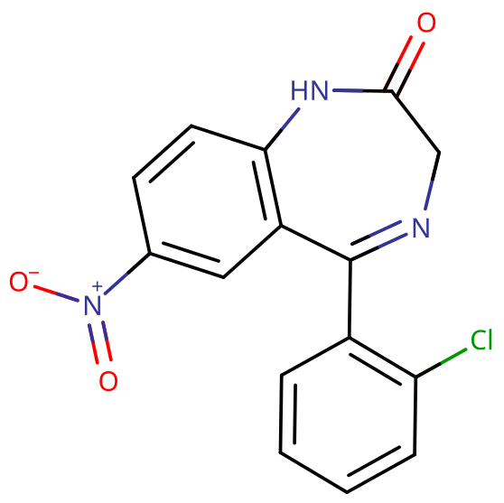
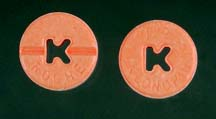
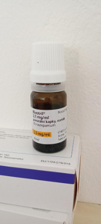

# 氯硝西泮

[◀返回](index.md)

!!! quote " 地铁八号线 @SS3B_0016・2023-12-20 01:40"

    或许我需要戒毒了。
    氯硝西泮对于我是药，但对于大部分人它是毒品。
    我对氯硝西泮的依赖性已经扩展到订立计划和落实计划都需要大量氯硝西泮支持。
    对于正常人已经超量几十倍了。
    氯硝西泮给我带来了许多常人不敢做的疯狂的计划并真正实施下去。
    但同时破坏了我大量记忆。
    几乎全靠提示才能记起来。

!!! danger "联用危险"

    **当[苯二氮䓬类物质](../文档/药物分类/苯二氮䓬类物质.md)联用其他[抑制剂](../文档/药物分类/抑制剂.md)（如[阿片类药物](../文档/药物分类/阿片类药物.md)、[巴比妥类物质](../文档/药物分类/巴比妥类物质.md)、[加巴喷丁类物质](../文档/药物分类/加巴喷丁类物质.md)、[噻吩二氮䓬类物质](../文档/药物分类/噻吩二氮䓬类物质.md)、[酒精](酒精.md)或其他 [GABA](../文档/GABA.md) 能物质）时，可能导致致命的[药物过量](../文档/药物过量.md)。**[^1]

    强烈建议不要联用这些物质，尤其是在[中等](../文档/药物剂量分类.md#中等)到[严重](../文档/药物剂量分类.md#严重)剂量下。

!!! info "信息"

    请勿与[氯硝唑仑](氯硝唑仑.md)混淆。

| **化学信息** | 氯硝西泮（Clonazepam）                                         |
| ------------ | -------------------------------------------------------------- |
| 结构式       |                                     |
| 分子式       | C15H10ClN3O3       |
| CAS 号       | 1622-61-3                                                      |
| **化学命名** |                                                                |
| 常见名称     | 氯硝西泮（Clonazepam）、Klonopin、K-Pins、Rivotril             |
| 取代名称     | Clonazepam                                                     |
| 系统命名     | 5-(2-Chlorophenyl)-7-nitro-2,3-dihydro-1,4-benzodiazepin-2-one |
| **类别归属** |                                                                |
| 精神活性分类 | _[抑制剂](../文档/药物分类/抑制剂.md)_                         |
| 化学分类     | _[苯二氮䓬类物质](../文档/药物分类/苯二氮䓬类物质.md)_         |

| [**给药途径**](../文档/给药途径.md)      | 🔽 [口服](../文档/给药途径.md#口服) |
| ---------------------------------------- | ----------------------------------- |
| 生物利用度                               | 90%[^2]                             |
| [**剂量**](../文档/给药剂量.md)          |                                     |
| [阈值](../文档/药物剂量分类.md#阈值)     | 0.10 mg                             |
| [轻微](../文档/药物剂量分类.md#轻微)     | 0.25 \~ 0.5 mg                      |
| [中等](../文档/药物剂量分类.md#中等)     | 0.5 \~ 1 mg                         |
| [强烈](../文档/药物剂量分类.md#强烈)     | 1 \~ 2 mg                           |
| [严重](../文档/药物剂量分类.md#严重)     | 2 mg +                              |
| [**药效时长**](../文档/药效时长.md)      |                                     |
| [总时长](../文档/药效时长.md#总时长)     | 8 \~ 12 小时                        |
| [药效发作](../文档/药效时长.md#药效发作) | 20 \~ 60 分钟                       |
| [药效达峰](../文档/药效时长.md#药效达峰) | 2 \~ 4 小时                         |
| [药效褪去](../文档/药效时长.md#药效褪去) | 3 \~ 6 小时                         |
| [药效残余](../文档/药效时长.md#药效残余) | 8 \~ 48 小时                        |

- !!! warning "警告"

        由于个体体重、耐受性、新陈代谢和个人敏感度的差异，请务必从低剂量开始。参见[负责任的用药部分](../文档/负责任的用药索引页.md)。

    !!! info "[免责声明](../关于本站/免责声明.md)"

        本站的[给药剂量](../文档/给药剂量.md)信息收集自用户和[相关资源](../文档/科学信息索引页.md)，仅供教育目的使用。这不是医疗建议，应与其他来源核实以确保准确性。

**氯硝西泮**[^3] 是一种[苯二氮䓬类](../文档/药物分类/苯二氮䓬类物质.md)长效精神活性物质，主要产生[抗焦虑](../药效/焦虑抑制.md)作用，但也具有[抗惊厥](../药效/癫痫发作抑制.md)、[肌肉松弛](../药效/肌肉松弛.md)、[致遗忘](../药效/失忆.md)、[镇静](../药效/镇静.md)、[抑制](../文档/药物分类/抑制剂.md)和[催眠](../文档/催眠药.md)效应。[^4] 它常被用于治疗惊恐障碍、广泛性焦虑障碍（GAD）和社会焦虑障碍（SAD），并获得了 FDA 的批准。在欧洲，它通常被批准用于治疗难治性癫痫。

氯硝西泮的消除半衰期为 30 \~ 40 小时[^5]，被认为是一种长效苯二氮䓬类药物。氯硝西泮起效迅速，口服给药后 1 \~ 4 小时达到血药峰值。

值得注意的是，对于长期规律使用的人来说，[突然停用苯二氮䓬类药物](../文档/药物分类/苯二氮䓬类物质.md#停止使用与戒断)可能会危及生命。[^6] 强烈建议通过在较长时间内逐渐减少每天的服用量来进行[减量](../文档/减量戒断法.md)，而不是突然停止服用。[^7] 不这样做可能会导致严重的健康问题甚至死亡。

|  |
| ------------------------------------------------- |
| 0.5 mg 的 Klonopin 药片                           |

|  |
| ----------------------------------------------- |
| 1 mg 的 Klonopin 药片                           |

|  |
| ----------------------------------------------------------------- |
| Rivotril 滴剂，2.5 mg/ml                                          |

## 化学

氯硝西泮属于苯二氮䓬类物质。苯二氮䓬类药物包含一个与二氮杂䓬环融合的苯环，二氮杂䓬环是一个七元环，两个氮组分分别位于 R1 和 R4 位置。氯硝西泮的苯环在 R8 位置被一个硝基（-NO2）取代。此外，二氮杂䓬环在 R5 位置与一个 2-氯苯环结合。氯硝西泮还在其二氮杂䓬环的 R2 位置含有一个双键结合的氧基，形成酮。这种在 R2 位置的氧取代是带有「-azepam」后缀的其他苯二氮䓬类药物的共同特征。

## 药理学

和其他苯二氮䓬类药物一样，氯硝西泮结合 GABAA 受体上的苯二氮䓬靶点，作为 [GABA](../文档/GABA.md)A [受体](../文档/受体.md)的正变构调节剂（PAM），促进 GABA（大脑中主要的抑制性[神经递质](../文档/神经递质.md)）结合 GABAA 受体，[^8] 提高 Cl⁻ 通道开放频率，从而增强抑制性神经传递，产生[镇静](../药效/镇静.md)和[抗焦虑](../药效/焦虑抑制.md)的效果。

苯二氮䓬类药物的[抗惊厥](../药效/癫痫发作抑制.md)特性可能部分或全部归功于与电压依赖性钠通道的结合，而不是苯二氮䓬受体。[^9]

## 主观效应

!!! info "[免责声明](../关于本站/免责声明.md)"

    _下列效应引用自 [**主观效应索引**](../药效/index.md)（**SEI**），这是一个基于轶事用户报告和个人分析的开放研究文献。因此，应带着健康的怀疑态度来看待它们。_

    _同样值得注意的是，这些效应不一定会以可预测或可靠的方式发生，尽管较高的剂量更可能引发全方位的效应。同样，**不良反应** 随着剂量的增加变得越来越可能，可能包括 **成瘾、严重伤害或死亡** ☠。_

- ### **[躯体效应](../药效/躯体效应.md)** 
    - **[镇静](../药效/镇静.md)**：在能量水平改变方面，这种药物具有极强的镇静潜力，通常会导致压倒性的嗜睡状态。在较高水平下，这会导致用户突然感觉自己极度睡眠不足，好像好几天没睡觉一样，迫使他们坐下来，通常感觉自己一直处于昏迷边缘，而不是从事体力活动。这种睡眠不足感与剂量成正比，最终变得强大到足以迫使人完全失去知觉。
    - **[头晕](../药效/头晕.md)**
    - **[肌肉松弛](../药效/肌肉松弛.md)**：与[阿普唑仑](阿普唑仑.md)相比，这种效应相对较强。
    - **[运动控制丧失](../药效/运动控制丧失.md)**：共济失调。
    - **[呼吸抑制](../药效/呼吸抑制.md)**
    - **[癫痫发作抑制](../药效/癫痫发作抑制.md)**
    - **[躯体欣快感](../药效/躯体欣快感.md)**：氯硝西泮与[阿普唑仑](阿普唑仑.md)类似，尽管会抑制情绪，但人们报告身体有中度到强烈的放松、愉悦和舒适感。这似乎在那些预先存在[焦虑](../药效/焦虑.md)的人身上表现得更频繁。然而，这并非对每个人都一致，有些用户报告完全没有欣快感。

- ### **[视觉效应](../药效/视觉效应.md)** 
    - **[视觉锐度抑制](../药效/视觉锐度抑制.md)**：像许多[抑制剂](../文档/药物分类/抑制剂.md)一样，已知氯硝西泮会导致视力模糊或其他视觉锐度抑制。

- ### **矛盾效应** 

    有时会出现对苯二氮䓬类药物的矛盾反应，如癫痫发作增加（在癫痫患者中）、攻击性、焦虑增加、暴力行为、冲动控制丧失、易怒和自杀行为（尽管在一般人群中很少见，发生率低于 1%）。[^10] [^11] 这些矛盾效应在娱乐性滥用者、精神障碍患者、儿童和接受高剂量治疗的患者中发生频率更高。[^12]

- ### **[认知效应](../药效/认知效应.md)** 

    氯硝西泮的认知效应可以分解为几个部分，这些部分随剂量成正比逐渐增强。许多人将氯硝西泮的一般心理状态描述为深度放松、焦虑抑制和去抑制。它包含大量典型的[抑制剂](../文档/药物分类/抑制剂.md)认知效应。

    最突出的认知效应通常包括：
    
    - **[记忆抑制](../药效/记忆抑制.md)**
    - **[焦虑抑制](../药效/焦虑抑制.md)**
    - **[思维减速](../药效/思维减速.md)**
    - **[分析能力抑制](../药效/分析能力抑制.md)**
    - **[清醒错觉](../药效/妄想.md)**：这是一种错误的信念，即尽管有明显的证据表明情况相反（如严重的认知受损和无法与他人充分沟通），但仍认为自己完全清醒。这最常发生在严重剂量下。
    - **[去抑制](../药效/去抑制.md)**
    - **[强迫性补量](../药效/强迫性补量.md)**
    - **[情感抑制](../药效/情感抑制.md)**：虽然这种化合物主要抑制焦虑，但它也会以一种不同于[抗精神病药](../文档/抗精神病药.md)但强度较低的方式迟钝其他情感。
    - **[梦境强化](../药效/梦境强化.md)**

- ### **药效残余** 
    - **[反弹焦虑](../药效/焦虑.md)**：反弹焦虑是像[苯二氮䓬类物质](../文档/药物分类/苯二氮䓬类物质.md)这样的[焦虑抑制](../药效/焦虑抑制.md)物质中常见的效应。它通常与在该物质影响下度过的总时长以及在给定时间内消耗的总量相对应，这种效应很容易导致依赖和成瘾的循环。
    - **[梦境强化](../药效/梦境强化.md)**[^13] 或 **[梦境抑制](../药效/梦境抑制.md)**
    - **[残留困倦](../药效/困倦.md)**：虽然苯二氮䓬类药物可以作为有效的[助眠](../文档/催眠药.md)工具，但它们的作用可能会持续到次日早晨，这可能会导致用户在长达数小时的时间里感到“昏昏沉沉”或“反应迟钝”。
    - **[思维减速](../药效/思维减速.md)**
    - **[思维组织](../药效/思维组织.md)**
    - **[易怒](../药效/易怒.md)**

### 体验报告

目前我们的[报告索引](../报告/index.md)中没有关于该物质效果的体验报告。你可以在[本站 Github 仓库](https://github.com/SalviaSWC/FreeODwiki)提交你自己的体验报告。

其他的体验报告可以在这里找到：

- PsychonautWiki：
    1. [Experience:4mg clonazepam - Notes](https://psychonautwiki.org/wiki/Experience:4mg_clonazepam_-_Notes)
    2. [Experience:A combination of tramadol, clonazepam, gabapentin, and dimenhydrinate](https://psychonautwiki.org/wiki/Experience:A_combination_of_tramadol,_clonazepam,_gabapentin,_and_dimenhydrinate)
- [Erowid Experience Vaults: Clonazepam](https://www.erowid.org/experiences/subs/exp_Pharms_Clonazepam.shtml)

## 毒性和伤害潜力

|                                                                 |
| :-----------------------------------------------------------------------------------------------------------------------------: |
| 2010 年 ISCD 研究根据药物危害专家的陈述对各种药物（合法和非法）进行的排名表。苯二氮䓬类物质被发现是总体上第 10 位最危险的药物。 |

|                                   |
| :-----------------------------------------------------------------------------: |
| 雷达图显示了苯二氮䓬类药物与其他药物相比的相对躯体伤害、社会伤害和依赖性。[^14] |

氯硝西泮相对于剂量而言毒性较低。[^15] 然而，当与[酒精](酒精.md)或[阿片类药物](../文档/药物分类/阿片类药物.md)等[抑制剂](../文档/药物分类/抑制剂.md)混合使用时，它具有潜在的[致死性](../药效/呼吸抑制.md)。

### 耐受性和成瘾潜力

氯硝西泮具有极强的生理和心理成瘾性。

在连续使用的几天内，会对镇静催眠作用产生耐受性。停止使用后，耐受性会在 7 \~ 14 天内恢复到基线。然而，在某些情况下，这可能需要更长的时间，其程度与长期使用的持续时间和强度成正比。

在稳定给药几周或更长时间后突然停止使用，可能会出现戒断症状或反弹症状，可能需要逐渐减量。有关以受控方式从苯二氮䓬类药物减量的更多信息，请参阅相关指南。

[苯二氮䓬类物质断药](../文档/药物分类/苯二氮䓬类物质.md#停止使用与戒断)是众所周知的困难；对于规律使用者来说，不经过数周的减量就停止使用可能会危及生命。存在[高血压](../药效/血压升高.md)、[癫痫发作](../药效/癫痫发作.md)和死亡的风险增加。[^6] 在戒断期间应避免使用降低癫痫发作阈值的药物，如[曲马多](曲马多.md)。

氯硝西泮与所有苯二氮䓬类药物存在交叉耐受性，在服用它之后，再使用其他所有苯二氮䓬类药物的效果都会降低。

### 药物过量

当服用极大量苯二氮䓬类药物或与其他抑制剂同时服用时，可能会发生苯二氮䓬类药物过量。这与其他 GABA 能抑制剂（如[巴比妥类物质](../文档/药物分类/巴比妥类物质.md)和[酒精](酒精.md)）联用时特别危险，因为它们的作用方式相似，但结合在 GABAA 受体上不同的变构位点，因此它们的作用会相互增强。苯二氮䓬类药物增加 GABAA 受体上氯离子孔开放的频率，而巴比妥类药物则增加它们开放的持续时间，这意味着当两者都服用时，离子孔将更频繁地开放并保持开放更长时间。[^16] 苯二氮䓬类药物过量是一种医疗紧急情况，如果不及时和正确治疗，可能会导致昏迷、永久性脑损伤或死亡。

苯二氮䓬类药物过量的症状可能包括严重的[思维减速](../药效/思维减速.md)、[语无伦次](../药效/语无伦次.md)、[混乱](../药效/混乱.md)、[妄想](../药效/妄想.md)、[呼吸抑制](../药效/呼吸抑制.md)、昏迷或死亡。苯二氮䓬类药物过量可以在医院环境中得到有效治疗，结果通常较好。苯二氮䓬类药物过量有时用氟马西尼治疗，这是一种 GABAA 受体拮抗剂[^17]，但护理主要还是支持性的。

### 危险相互作用

!!! warning "警告"

    _许多精神活性物质在单独使用时相对安全，但与某些其他物质联用可能会突然变得危险甚至危及生命。_

    _请务必进行独立研究（例如 [Google](https://www.google.com)、[DuckDuckGo](https://www.duckduckgo.com)、[PubMed](https://pubmed.ncbi.nlm.nih.gov/)），确保多种物质的组合是安全的。部分列出的相互作用来自 [TripSit](https://combo.tripsit.me)。_

- **[抑制剂](../文档/药物分类/抑制剂.md)**（_[1,4-丁二醇](1,4-丁二醇.md)、[2M2B](2M2B.md)、[酒精](酒精.md)、[苯二氮䓬类物质](../文档/药物分类/苯二氮䓬类物质.md)、[巴比妥类物质](../文档/药物分类/巴比妥类物质.md)、[GHB](GHB.md)/[GBL](GBL.md)、甲喹酮、[阿片类药物](../文档/药物分类/阿片类药物.md)_）：这种组合会增强彼此引起的[肌肉松弛](../药效/肌肉松弛.md)、[致遗忘](../药效/失忆.md)、[镇静](../药效/镇静.md)和[呼吸抑制](../药效/呼吸抑制.md)。在较高剂量下，它可能导致突然的、意外的意识丧失，并伴有危险程度的呼吸抑制。在昏迷状态下还存在因呕吐物窒息的风险增加。如果在失去知觉前发生[恶心](../药效/恶心.md)或呕吐，用户应尝试以[恢复体位](../文档/恢复体位.md)入睡，或让朋友将其移动到该体位。
- **[解离剂](../文档/药物分类/解离剂.md)**：这种组合会不可预测地增强彼此可能引起的[致遗忘](../药效/失忆.md)、[镇静](../药效/镇静.md)、[运动控制丧失](../药效/运动控制丧失.md)和[妄想](../药效/妄想.md)。它还可能导致突然的意识丧失，并伴有危险程度的[呼吸抑制](../药效/呼吸抑制.md)。如果在失去知觉前发生[恶心](../药效/恶心.md)或呕吐，用户应尝试以[恢复体位](../文档/恢复体位.md)入睡。
- **[兴奋剂](../文档/药物分类/兴奋剂.md)**：兴奋剂会掩盖抑制剂的[镇静](../药效/镇静.md)作用，而镇静作用是大多数人用来衡量其中毒程度的主要因素。一旦兴奋剂作用消失，抑制剂的作用将显著增加，导致更严重的[去抑制](../药效/去抑制.md)、[运动控制丧失](../药效/运动控制丧失.md)和危险的[失忆状态](../药效/失忆.md)。如果不密切监测液体摄入量，这种组合还可能导致严重的脱水。如果选择联用这些物质，应严格限制自己在预设的时间表内每小时仅服用一定量，直到达到最大阈值。

## 法律状态

在国际上，氯硝西泮被列入《联合国精神药物公约》附表 IV。[^18]

- **中国大陆**：根据《麻醉药品和精神药品管理条例》，氯硝西泮被列入第二类精神药品，属于管制药品。[^28]
- **澳大利亚**：氯硝西泮仅凭处方销售。
- **巴西**：氯硝西泮是一种“黑框”药物，仅凭处方销售。[^19]
- **加拿大**：氯硝西泮是附表 IV 药物。
- **捷克共和国**：氯硝西泮是附表 IV[^20]（列表 7）物质。
- **德国**：自 1986 年 8 月 1 日起，氯硝西泮受 BtMG（_麻醉品法，附表 III_）控制。[^22]
- **印度**：氯硝西泮在印度属于附表 H。
- **以色列**：氯硝西泮仅凭处方销售。
- **新西兰**：氯硝西泮是附表 3 受控药物。[^24]
- **挪威**：氯硝西泮仅凭处方销售。[^25]
- **俄罗斯**：自 2013 年 4 月起，氯硝西泮成为附表 III 受控物质。[^26]
- **瑞士**：氯硝西泮是在 Verzeichnis B 下明确命名的受控物质。允许医疗使用。[^27]
- **土耳其**：氯硝西泮是「绿色处方」物质[^28]，无处方销售或持有是违法的。
- **英国**：氯硝西泮是 C 类药物。[^29]
- **美国**：氯硝西泮是附表 IV 物质。

## 另见

- [负责任的用药](../文档/负责任的用药索引页.md)
- [精神活性物质索引](../文档/药物分类/药物全索引.md)
- [抑制剂](../文档/药物分类/抑制剂.md)
- [酒精](酒精.md)
- [苯二氮䓬类物质](../文档/药物分类/苯二氮䓬类物质.md)

## 外部链接

- [Clonazepam (Wikipedia)](https://en.wikipedia.org/wiki/Clonazepam)
- [Clonazepam (PsychonautWiki)](https://psychonautwiki.org/wiki/Clonazepam)
- [Clonazepam (Erowid Vault)](https://erowid.org/pharms/clonazepam/)
- [Clonazepam (DrugBank)](https://go.drugbank.com/drugs/DB01068)

## 引用文献

[^1]: [_Risks of Combining Depressants - TripSit_](https://tripsit.me/combining-depressants/)

[^2]: [_FDA Approved Labeling Text (October 2013)_](https://www.accessdata.fda.gov/drugsatfda_docs/label/2013/017533s053,020813s009lbl.pdf) (PDF)

[^3]: [_Patent US3123529_](https://www.freepatentsonline.com/3123529.pdf) (PDF)

[^4]: Cowen, P. J., Green, A. R., Nutt, D. J. (5 March 1981). "Ethyl beta-carboline carboxylate lowers seizure threshold and antagonizes flurazepam-induced sedation in rats". _Nature_. **290** (5801): 54–55. [doi:10.1038/290054a0](https://doi.org/10.1038/290054a0). [ISSN 0028-0836](https://www.worldcat.org/issn/0028-0836).

[^5]: Basit H, Kahwaji CI. Clonazepam. [Updated 2022 Sep 1]. In: StatPearls [NCBI](https://www.ncbi.nlm.nih.gov/books/NBK556010/)

[^6]: Lann, M. A., Molina, D. K. (June 2009). "A fatal case of benzodiazepine withdrawal". _The American Journal of Forensic Medicine and Pathology_. **30** (2): 177–179. [doi:10.1097/PAF.0b013e3181875aa0](https://doi.org/10.1097/PAF.0b013e3181875aa0). [ISSN 1533-404X](https://www.worldcat.org/issn/1533-404X).

[^7]: Kahan, M., Mailis-Gagnon, A., Tunks, E. (June 2011). "Canadian guideline for safe and effective use of opioids for chronic non-cancer pain: implications for pain physicians". _Pain Research & Management_. **16** (3): 157–158. [doi:10.1155/2011/434298](https://doi.org/10.1155/2011/434298). [ISSN 1203-6765](https://www.worldcat.org/issn/1203-6765).

[^8]: Haefely, W. (29 June 1984). "Benzodiazepine interactions with GABA receptors". _Neuroscience Letters_. **47** (3): 201–206. [doi:10.1016/0304-3940(84)90514-7](<https://doi.org/10.1016/0304-3940(84)90514-7>). [ISSN 0304-3940](https://www.worldcat.org/issn/0304-3940).

[^9]: McLean, M. J., Macdonald, R. L. (February 1988). "Benzodiazepines, but not beta carbolines, limit high frequency repetitive firing of action potentials of spinal cord neurons in cell culture". _The Journal of Pharmacology and Experimental Therapeutics_. **244** (2): 789–795. [ISSN 0022-3565](https://www.worldcat.org/issn/0022-3565).

[^10]: Saïas, T., Gallarda, T. (September 2008). "Paradoxical aggressive reactions to benzodiazepine use: a review". _L'Encephale_. **34** (4): 330–336. [doi:10.1016/j.encep.2007.05.005](https://doi.org/10.1016/j.encep.2007.05.005). [ISSN 0013-7006](https://www.worldcat.org/issn/0013-7006).

[^11]: Paton, C. (December 2002). ["Benzodiazepines and disinhibition: a review"](https://www.cambridge.org/core/journals/psychiatric-bulletin/article/benzodiazepines-and-disinhibition-a-review/421AF197362B55EDF004700452BF3BC6). _Psychiatric Bulletin_. **26** (12): 460–462. [doi:10.1192/pb.26.12.460](https://doi.org/10.1192/pb.26.12.460). [ISSN 0955-6036](https://www.worldcat.org/issn/0955-6036).

[^12]: Bond, A. J. (1 January 1998). ["Drug-Induced Behavioural Disinhibition"](https://doi.org/10.2165/00023210-199809010-00005). _CNS Drugs_. **9** (1): 41–57. [doi:10.2165/00023210-199809010-00005](https://doi.org/10.2165/00023210-199809010-00005). [ISSN 1179-1934](https://www.worldcat.org/issn/1179-1934).

[^13]: Goyal, S. (14 March 1970). "Drugs and dreams". _Canadian Medical Association Journal_. **102** (5): 524. [ISSN 0008-4409](https://www.worldcat.org/issn/0008-4409).

[^14]: Nutt, D., King, L. A., Saulsbury, W., Blakemore, C. (24 March 2007). ["Development of a rational scale to assess the harm of drugs of potential misuse"](https://www.sciencedirect.com/science/article/pii/S0140673607604644). _The Lancet_. **369** (9566): 1047–1053. [doi:10.1016/S0140-6736(07)60464-4](<https://doi.org/10.1016/S0140-6736(07)60464-4>). [ISSN 0140-6736](https://www.worldcat.org/issn/0140-6736).

[^15]: Mandrioli, R., Mercolini, L., Raggi, M. A. ["Benzodiazepine Metabolism: An Analytical Perspective"](https://www.eurekaselect.com/article/12780). _Current Drug Metabolism_. **9** (8): 827–844.

[^16]: Twyman, R. E., Rogers, C. J., Macdonald, R. L. (March 1989). "Differential regulation of gamma-aminobutyric acid receptor channels by diazepam and phenobarbital". _Annals of Neurology_. **25** (3): 213–220. [doi:10.1002/ana.410250302](https://doi.org/10.1002/ana.410250302). [ISSN 0364-5134](https://www.worldcat.org/issn/0364-5134).

[^17]: Hoffman, E. J., Warren, E. W. (September 1993). "Flumazenil: a benzodiazepine antagonist". _Clinical Pharmacy_. **12** (9): 641–656; quiz 699–701. [ISSN 0278-2677](https://www.worldcat.org/issn/0278-2677).

[^18]: ["List of Psychotropic Substances under International Control"](https://web.archive.org/web/20131219071757/http://www.incb.org/documents/Psychotropics/green_lists/Green_list_ENG_2014_85222_GHB.pdf) (PDF). International Narcotics Control Board. Archived from [the original](http://www.incb.org/documents/Psychotropics/green_lists/Green_list_ENG_2014_85222_GHB.pdf) (PDF) on December 19, 2013. Retrieved December 28, 2019.

[^19]: [Anvisa](http://www.anvisa.gov.br/datavisa/fila_bula/frmVisualizarBula.asp?pNuTransacao=8688542015&pIdAnexo=2876451)

[^20]: <https://eur-lex.europa.eu/resource.html?uri=cellar:6b5e9beb-1d9b-11ea-95ab-01aa75ed71a1.0001.02/DOC_1&format=PDF>

[^22]: ["Zweite Verordnung zur Änderung betäubungsmittelrechtlicher Vorschriften"](http://www.bgbl.de/xaver/bgbl/start.xav?startbk=Bundesanzeiger_BGBl&jumpTo=bgbl186s1099.pdf) (PDF) (in German). Bundesanzeiger Verlag. Retrieved December 26, 2019.

[^24]: [_Misuse of Drugs Act 1975 No 116 (as at 01 July 2022), Public Act Schedule 3 Class C controlled drugs – New Zealand Legislation_](https://www.legislation.govt.nz/act/public/1975/0116/latest/DLM436723.html)

[^25]: <https://www.felleskatalogen.no/medisin/rivotril-roche-563568>

[^26]: [_Постановление Правительства РФ от 04.02.2013 N 78 "О внесении изменений в некоторые акты Правительства Российской Федерации" - КонсультантПлюс_](https://www.consultant.ru/cons/cgi/online.cgi?req=doc&base=LAW&n=141744&dst=100005&date=02.12.2019)

[^27]: ["Verordnung des EDI über die Verzeichnisse der Betäubungsmittel, psychotropen Stoffe, Vorläuferstoffe und Hilfschemikalien"](https://www.admin.ch/opc/de/classified-compilation/20101220/index.html) (in German). Bundeskanzlei \[Federal Chancellery of Switzerland\]. Retrieved January 1, 2020.

[^28]: YEŞİL REÇETEYE TABİ İLAÇLAR | <https://www.titck.gov.tr/storage/Archive/2019/contentFile/01.04.2019%20SKRS%20Ye%C5%9Fil%20Re%C3%A7eteli%20%C4%B0la%C3%A7lar%20Aktif%20SON%20-%20G%C3%9CNCEL_58b1ff4a-2e1c-4867-bad7-eec855d6162a.pdf>

[^29]: [_List of most commonly encountered drugs currently controlled under the misuse of drugs legislation_](https://www.gov.uk/government/publications/controlled-drugs-list--2/list-of-most-commonly-encountered-drugs-currently-controlled-under-the-misuse-of-drugs-legislation)

[^33]: [国家药监局 公安部 国家卫生健康委关于发布药用类麻醉药品和精神药品目录的公告（2025年第55号）](https://www.nmpa.gov.cn/xxgk/ggtg/ypggtg/ypqtggtg/20250728092519123.html)