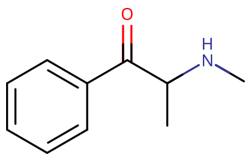

# 甲卡西酮

[◀返回](index.md)

!!! info "信息"

    请勿将麻黄酮（Ephedrone）与[麻黄碱](麻黄碱.md)（Ephedrine）或[依芬尼定](依芬尼定.md)（Ephenidine）混淆哦。

| **化学信息** | 甲卡西酮（Methcathinone）                                                                                                                        |
| ------------ | ------------------------------------------------------------------------------------------------------------------------------------------------ |
| 结构式       |                                                                                                                    |
| 分子式       | C10H13NO                                                                                                                   |
| CAS 号       | 5650-44-2 160977-88-8（R 型） 49656-78-2（R 型盐酸盐） 112117-24-5 (S 型) 66514-93-0 (S 型盐酸盐)                                    |
| **化学命名** |                                                                                                                                                  |
| 常见名称     | 甲卡西酮（Methcathinone）、麻黄酮（Ephedrone）、α-甲氨基苯丙酮、Methcat、Cat、Jeff、MCAT、MC、浴盐、丧尸药、长治筋、喵喵、象牙、光环、香草的天空 |
| 取代名称     | α-methylamino-propiophenone                                                                                                                      |
| 系统命名     | (RS)-2-(methylamino)-1-phenyl-propan-1-one                                                                                                       |
| **类别归属** |                                                                                                                                                  |
| 精神活性分类 | _[兴奋剂](../文档/药物分类/兴奋剂.md) / [共情剂](../文档/药物分类/共情剂.md)_                                                                    |
| 化学分类     | _[卡西酮类物质](../文档/药物分类/卡西酮类物质.md)_                                                                                               |

| [**给药途径**](../文档/给药途径.md)  | 🔽 [口服](../文档/给药途径.md) |
| ------------------------------------ | ------------------------------ |
| [**给药剂量**](../文档/给药剂量.md)  |                                |
| [阈值](../文档/药物剂量分类.md#阈值) | 25 mg                          |
| [轻微](../文档/药物剂量分类.md#轻微) | 50 \~ 100 mg                   |
| [中等](../文档/药物剂量分类.md#中等) | 100 \~ 200 mg                  |
| [强烈](../文档/药物剂量分类.md#强烈) | 200 \~ 300 mg                  |
| [严重](../文档/药物剂量分类.md#严重) | 300 mg +                       |
| [**药效时长**](../文档/药效时长.md)  |                                |
| [总时长](../文档/药效时长.md#总时长) | 4 \~ 6 小时                    |

- !!! warning "警告"

        由于个体体重、耐受性、新陈代谢和个人敏感度的差异，请务必从低剂量开始。参见[负责任的用药部分](../文档/负责任的用药索引页.md)。

    !!! info "[免责声明](../关于本站/免责声明.md)"

        本站的[给药剂量](../文档/给药剂量.md)信息收集自用户和[相关资源](../文档/科学信息索引页.md)，仅供教育目的使用。这不是医疗建议，应与其他来源核实以确保准确性。

**甲卡西酮**（亦称麻黄酮）是一种[卡西酮](../文档/药物分类/卡西酮类物质.md)化学类别的合成[兴奋剂](../文档/药物分类/兴奋剂.md)物质。它是一种[苯丙胺](苯丙胺.md)类似物，能产生标准的类苯丙胺的兴奋效果。它的结构和效果类似于东非[恰特草](恰特草.md)中发现的[卡西酮](卡西酮.md)化合物以及 [4-MMC](4-MMC.md)。

## 历史与文化

甲卡西酮于 1928 年在美国首次合成，并在苏联被用作抗抑郁药。它在中欧和东欧很常见，通常作为更知名的 [4-MMC](4-MMC.md) 出售，或者由含有[麻黄碱](麻黄碱.md)或[伪麻黄碱](伪麻黄碱.md)的非处方药（OTC）合成。1989 年，美国密歇根州出现滥用的现象。三年后的 1992 年，威斯康辛州也出现此类现象。2007 年，法国警方也在毒品中发现甲卡西酮。

## 化学

甲卡西酮由一个[苯乙胺](../文档/药物分类/苯乙胺类物质.md)核心组成，其苯环通过包含 β-酮基（这就是所谓的 **卡西酮** 分子）的乙基链与氨基（NH2）结合，并在 Rα 处有一个额外的甲基取代。它可以被认为是[甲基苯丙胺](甲基苯丙胺.md)的卡西酮同系物，因为它们具有相同的通式，区别仅在于增加了一个双键氧原子。

## 药理学

虽然甲卡西酮的效果尚未像[苯丙胺类物质](../文档/药物分类/苯丙胺类物质.md)那样得到同等水平的正式研究，但可以推测，像其他简单的[取代卡西酮类物质](../文档/药物分类/卡西酮类物质.md)一样，它最主要的作用是作为[去甲肾上腺素](../文档/去甲肾上腺素.md)-[多巴胺](../文档/多巴胺.md) [神经递质再摄取抑制剂](../文档/神经递质再摄取抑制剂.md)（NDRIs）。[^1] 这导致大脑中与奖励和快乐相关的关键区域内的去甲肾上腺素和多巴胺[神经递质](../文档/神经递质释放剂.md)水平有效增加，这是通过结合并部分阻断通常从突触间隙清除这些单胺的转运蛋白来实现的。这使得多巴胺和去甲肾上腺素积累到超内源性水平，从而产生兴奋、激励和欣快的效果。

## 主观效应

!!! info "[免责声明](../关于本站/免责声明.md)"

    _下列效应引用自 [**主观效应索引**](../药效/index.md)（**SEI**），这是一个基于轶事用户报告和个人分析的开放研究文献。因此，应带着健康的怀疑态度来看待它们。_

    _同样值得注意的是，这些效应不一定会以可预测或可靠的方式发生，尽管较高的剂量更可能引发全方位的效应。同样，**不良反应** 随着剂量的增加变得越来越可能，可能包括 **成瘾、严重伤害或死亡** ☠。_

- ### **[躯体效应](../药效/躯体效应.md)** 
    - **[兴奋](../药效/兴奋.md)**：据报道甲卡西酮具有极强的刺激性和活力。这种刺激的风格可以描述为「强迫性的」。这意味着在高剂量下，随着咬紧牙关、不自主的身体颤抖和震动出现，保持静止变得困难或不可能。
    - **[躯体欣快感](../药效/躯体欣快感.md)**：当负责任地使用（即合理的剂量和体验间隔）时，躯体欣快感非常突出，并且可能导致深刻的社交和身体去抑制感。
    - **[脱水](../药效/脱水.md)**：甲卡西酮体验期间的 **脱水** 通常比其他兴奋剂（如苯丙胺）**更严重**。因此，你必须格外小心并 **不断补充水分**，以免患上 [**横纹肌溶解症**](https://en.wikipedia.org/wiki/Rhabdomyolysis)。这通常通过观察你的身体来完成，如果有任何疼痛，如果你的肾脏感觉奇怪，或者你的尿液像茶一样呈黄色到黄绿色。请阅读维基并了解横纹肌溶解症，因为它是一件非常糟糕的事情，如果足够严重且长期不治疗，你可能会死于此。通常你可以通过观察尿液是否变黄来缓解它，如果是，并且你没有定期排尿，**每 15 或 30 分钟喝一杯水**（只要不喝太多导致水中毒），你的尿液应该会变得清澈。只要你保持水分，你的肾脏就会正常运作，你就会没事，在尿液变清后继续不断喝水，持续几个小时，但量稍微少一点，这样你就不会再遇到这个问题了。
    - **[心率增快](../药效/心率增快.md)**：心率的增加通常比其他兴奋剂（如甲基苯丙胺）**弱**。
    - **[出汗增加](../药效/出汗增加.md)**：排汗量 **非常高**。在炎热的地方或进行任何体力活动时，你会非常容易出汗。将甲卡西酮与[右美沙芬](右美沙芬.md)混合会让你实际上一直在滴汗。由于这种排汗增加，请务必补水，否则你会很快失去大量水分。
    - **[血压升高](../药效/血压升高.md)**
    - **[肌肉收缩](../药效/肌肉颤动.md)**：这些突然的肌肉收缩通常在 **药效褪去** 期间经历。这是由于大脑中多巴胺的缺乏，这复制了帕金森病的症状。这些震颤是 **暂时的**，会在几小时内消退。
    - **[肌肉痉挛](../药效/肌肉痉挛.md)**：通常发生在药效褪去期间。这是由于大脑中多巴胺的耗尽。
    - **[自发性躯体感觉](../药效/躯体欣快感.md)**：甲卡西酮的「身体嗨」可以被描述为一种中度到极度的欣快感，它包围着整个身体。在高剂量下，这种感觉可能会变得极其令人愉悦。这种感觉保持着持续的存在，随着起效稳步上升，并在达到峰值时达到极限。
    - **[胃痉挛](../药效/胃痉挛.md)**
    - **[触觉增强](../药效/触觉效应.md)**
    - **[磨牙](../药效/磨牙.md)**：当这种效应与欣快感一起出现时，通常会导致用户轻度或剧烈地咬紧下巴肌肉，有时甚至达到面部表情开始改变的程度。这有时俗称为 gurning，[^4] 通常只在中等至高剂量下经历。
    - **[血管收缩](../药效/血管收缩.md)**

- ### **[认知效应](../药效/认知效应.md)** 

    甲卡西酮的认知效应可以分解为几个部分，这些部分随着剂量的增加而逐渐增强。最突出的认知效应通常包括：

    - **[分析能力增强](../药效/认知效应.md)**
    - **[焦虑](../药效/焦虑.md)**
    - **[认知欣快](../药效/认知欣快.md)**：甲卡西酮极具刺激性和活力。
    - **[强迫性加药](../药效/强迫性加药.md)**
    - **[共情、爱意与社交能力增强](../药效/共情、爱意与社交能力增强.md)**：这种特殊效果虽然明显，但远不如传统的[共情剂](../文档/药物分类/共情剂.md)如 [MDMA](MDMA.md) 或 [2C-B](2C-B.md) 中的相同效果突出。
    - **[专注力增强](../药效/认知效应.md)**
    - **[性欲增强](../药效/性欲增强.md)** 或 **[性欲减退](../药效/性欲减退.md)**
    - **[音乐欣赏能力增强](../药效/听觉增强.md)**
    - **[记忆增强](../药效/认知效应.md)**
    - **[动机增强](../药效/动机增强.md)**
    - **[思维加速](../药效/认知效应.md)**
    - **[思维组织](../药效/认知效应.md)**
    - **[时间扭曲](../药效/认知效应.md)**
    - **[清醒](../药效/清醒.md)**
    - **[精神病](../药效/精神病发作.md)**
    - **[妄想](../药效/妄想.md)**

- ### **药效残余** 

    在[兴奋剂](../文档/药物分类/兴奋剂.md)体验的[药效褪去](../文档/药效下降期.md)期间发生的效果，与[药效达峰](../文档/药效达峰.md)期间发生的效果相比，通常感觉消极和不舒服。这通常被称为 Comedown，并且由于[神经递质](../文档/神经递质释放剂.md)耗尽而发生。其影响通常包括：
    
    - **[焦虑](../药效/焦虑.md)**
    - **[认知疲劳](../药效/认知效应.md)**
    - **[抑郁](../药效/认知效应.md)**
    - **[易怒](../药效/易怒.md)**
    - **[动机抑制](../药效/认知效应.md)**
    - **[思维减速](../药效/认知效应.md)**
    - **[清醒](../药效/清醒.md)**
    - **[快感缺失](../药效/快感缺失.md)**

### 体验报告

目前我们的[报告索引](../报告/index.md)中没有关于该物质效果的体验报告。你可以在[本站 Github 仓库](https://github.com/SalviaSWC/FreeODwiki)提交你自己的体验报告。

其他的体验报告可以在这里找到：

- [Erowid Experience Vaults: Methcathinone Reports](https://www.erowid.org/experiences/subs/exp_Methcathinone.shtml)

## 毒性与伤害潜力

甲卡西酮对使用者有较为明显的药理学和毒理学作用，可对人体健康产生较为严重伤害。

甲卡西酮可引起幻觉、鼻出血、鼻灼伤、恶心、呕吐和血液循环问题，出现皮疹、焦虑、偏执狂、痉挛和妄想。其他副作用还包括注意力差，短期记忆不足，心率增加，心跳异常，抑郁，出汗增加，瞳孔散大，无法正常的打开嘴巴和磨牙。英国国家成瘾中心调查资料显示，在甲卡西酮使用者中，51% 自述头疼，43% 出现心悸，27% 出现恶心，15% 有寒冷或手指发绀症状。

该物质能导致急性健康问题和毒品依赖，甚至造成死亡。2010 年，该毒品在英国和爱尔兰已至少造成 37 人死亡。

### 神经毒性

使用高锰酸钾氧化[麻黄碱](麻黄碱.md)或[伪麻黄碱](伪麻黄碱.md)制造的非法甲卡西酮与由[锰](https://en.wikipedia.org/wiki/Manganese)中毒引起的神经毒性有关。[^2]

### 依赖性与滥用潜力

甲卡西酮由于其高度成瘾的性质，经常会导致极端的[强迫性加药](../药效/强迫性加药.md)。强烈建议在使用该物质时采取[伤害减少措施](../文档/负责任的用药索引页.md)。

## 法律地位

在国际上，根据联合国 1971 年《精神药物公约》，甲卡西酮是一类管制物质。[^3]

- **中国大陆**：1996 年 10 月，卫生部将甲卡西酮规定为 I 类精神药品管理，2005 版和 2007 版《麻醉药品和精神药品品种目录》中甲卡西酮均被列入其中，不论生产还是销售都受到严格管制的，不存在合法生产、经营，也没有任何合法用途。
- **美国**：任何使用甲卡西酮的行为都是不允许的。甚至在没有缉毒局（Drug Enforcement Administration, DEA）的批准研究也是严厉禁止的。
- **英国**：甲卡西酮被列为 B 类药物，没有临床使用价值。
- **澳大利亚**：甲卡西酮是附表 9 管制物质。[^4]

## 另见

- [负责任的用药](../文档/负责任的用药索引页.md)
- [兴奋剂](../文档/药物分类/兴奋剂.md)
- [卡西酮类物质](../文档/药物分类/卡西酮类物质.md)
- [4-MMC](4-MMC.md)（Mephedrone）
- [3-MMC](3-MMC.md)
- [乙卡西酮](乙卡西酮.md)（Ethcathinone）
- [伪麻黄碱](伪麻黄碱.md)

## 外部链接

- [Methcathinone (Wikipedia)](https://en.wikipedia.org/wiki/Methcathinone)
- [Methcathinone (PsychonautWiki)](https://psychonautwiki.org/wiki/Methcathinone)
- [Methcathinone (Isomer Design)](https://isomerdesign.com/PiHKAL/explore.php?id=2003)
- [Methcathinone (DrugBank)](https://go.drugbank.com/drugs/DB15339)

## 参考文献

[^1]: Cathinone derivatives: A review of their chemistry, pharmacology and toxicology \| DOI 10\.1002/dta.31

[^2]: <https://www.nejm.org/doi/full/10.1056/NEJMoa072488>

[^3]: <https://www.incb.org/incb/en/psychotropics/green-list.html>

[^4]: ["POISONS STANDARD DECEMBER 2019"](https://www.legislation.gov.au/Details/F2019L01471). Office of Parliamentary Counsel. Retrieved December 19, 2019.
