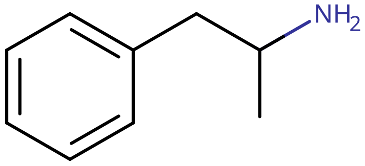

# 苯丙胺

[◀返回](index.md)

!!! quote " "

    《逃离塔科夫》中“思必得”的原型，在中国和大多数国家被用于军用兴奋剂。

| **化学信息** | 苯丙胺（Amphetamine）                                                             |
| ------------ | --------------------------------------------------------------------------------- |
| 结构式       |                                                       |
| 分子式       | C9H13N                                                      |
| CAS 号       | 300-62-9 2706-50-5（消旋盐酸盐）                                                 |
| **化学命名** |                                                                                   |
| 常用名称     | 苯丙胺、Amphetamine（安非他命）、α-甲基苯乙胺、苯基乙丙胺、amfetamine、Speed、Pep |
| 商品名       | Adderall（阿德拉）、Dexedrine、Tentin                                             |
| 取代名称     | α-甲基苯乙胺                                                                      |
| 系统命名     | (RS)-1-Phenylpropan-2-amine                                                       |
| **类别归属** |                                                                                   |
| 精神药效分类 | _[兴奋剂](../文档/药物分类/兴奋剂.md)_                                            |
| 化学分类     | _[苯乙胺类物质](../文档/药物分类/苯乙胺类物质.md)_                                |

| [**给药途径**](../文档/给药途径.md)      | 🔽 [口服](../文档/给药途径.md#口服) | 🔽 [鼻吸](../文档/给药途径.md#鼻吸) | 🔽 [静脉注射](../文档/给药途径.md#静脉注射) |
| ---------------------------------------- | ----------------------------------- | ----------------------------------- | ------------------------------------------- |
| 生物利用度                               | 75% +[^1]                           |                                     |                                             |
| [**剂量**](../文档/给药剂量.md)          |                                     |                                     |                                             |
| [阈值](../文档/药物剂量分类.md#阈值)     | 2.5 mg                              | 4 mg                                | 4 mg                                        |
| [轻微](../文档/药物剂量分类.md#轻微)     | 5 \~ 10 mg                          | 6 \~ 15 mg                          | 6 \~ 15 mg                                  |
| [中等](../文档/药物剂量分类.md#中等)     | 10 \~ 25 mg                         | 15 \~ 30 mg                         | 15 \~ 30 mg                                 |
| [强烈](../文档/药物剂量分类.md#强烈)     | 25 \~ 50 mg                         | 30 \~ 50 mg                         | 30 \~ 50 mg                                 |
| [严重](../文档/药物剂量分类.md#严重)     | 50 mg +                             | 50 mg +                             | 50 mg +                                     |
| [**药效时长**](../文档/药效时长.md)      |                                     |                                     |                                             |
| [总时长](../文档/药效时长.md#总时长)     | 6 \~ 8 小时                         | 3 \~ 6 小时                         | 3 \~ 6 小时                                 |
| [药效发作](../文档/药效时长.md#药效发作) | 30 \~ 45 分钟                       | 1 \~ 5 分钟                         | 2 \~ 10 秒                                  |
| [药效上升](../文档/药效时长.md#药效上升) | 30 \~ 135 分钟                      | 30 \~ 90 分钟                       | 2 \~ 10 秒                                  |
| [药效达峰](../文档/药效时长.md#药效达峰) | 2.5 \~ 4 小时                       | 1 \~ 2 小时                         | 2 \~ 4 小时                                 |
| [药效褪去](../文档/药效时长.md#药效褪去) | 2 \~ 3 小时                         | 1.5 \~ 3 小时                       | 1 \~ 2 小时                                 |
| [药效残余](../文档/药效时长.md#药效残余) | 3 \~ 6 小时                         | 2 \~ 4 小时                         |                                             |

!!! warning "警告"

    由于个体体重、耐受性、新陈代谢和个人敏感度的差异，请务必从低剂量开始。参见[负责任的用药部分](../文档/负责任的用药索引页.md)。

!!! info "[免责声明](../关于本站/免责声明.md)"

    本站的[给药剂量](../文档/给药剂量.md)信息收集自用户和[相关资源](../文档/科学信息索引页.md)，仅供教育目的使用。这不是医疗建议，应与其他来源核实以确保准确性。

**苯丙胺** 是[苯乙胺类物质](../文档/药物分类/苯乙胺类物质.md)中的经典[兴奋剂](../文档/药物分类/兴奋剂.md)物质，其作用机制涉及促进[神经递质](../文档/神经递质.md) [多巴胺](../文档/多巴胺.md)和[去甲肾上腺素](../文档/去甲肾上腺素.md)的释放。[^2]

它最初于 1887 年合成，但直到 1929 年才发现其精神兴奋作用。[^3] 在 20 世纪 30 年代，它以「Benzedrine」的名字作为减充血剂在柜台销售。[^4] 它曾被广泛用于治疗酒精宿醉、发作性睡病、抑郁症和肥胖症等一系列疾病。[^5] 由于成瘾和滥用问题，它最终被列入联合国 1971 年《精神药物公约》的管制物质清单。[^6]

苯丙胺现在主要是一种处方药，用于治疗注意力缺陷多动障碍（ADHD）、发作性睡病和肥胖症。[^7] [^8] 与其他兴奋剂一样，苯丙胺治疗可能与 ADHD 患者的神经保护有关，因为它减少了通常与未经治疗的 ADHD 受试者神经缺陷相关的神经递质缺乏。[^9] [^10] 此外，它还被广泛非法用作体能增强剂和娱乐性物质。

[主观效应](../药效/index.md)包括[兴奋](../药效/兴奋.md)、[专注力强化](../药效/专注力强化.md)、[动机增强](../药效/动机增强.md)、[性欲增强](../药效/性欲增强.md)、[食欲抑制](../药效/食欲抑制.md)和[欣快感](../药效/认知欣快.md)。它通常通过口服摄入，但也可以[鼻吸、注射或直肠给药](../文档/给药途径.md)。较低剂量倾向于提高专注力和生产力，而较高剂量倾向于增加社交能力、性欲和欣快感。

苯丙胺具有很高的滥用潜力。长期使用（即高剂量、重复给药）与[强迫性补量](../药效/强迫性补量.md)、耐受性升级和心理依赖有关。此外，滥用还与许多健康状况有关，特别是心血管问题，如[高血压](../药效/血压升高.md)和中风风险增加。[^11]

## 历史与文化

苯丙胺于 1887 年由罗马尼亚化学家 Lazăr Edeleanu 在德国首次合成，他将其命名为 _苯基异丙基胺_。[^12] 然而，直到 1927 年，当 Gordon Alles 独立重新合成并发现其具有拟交感神经特性时，其刺激作用才为人所知。[^13]

1933 年底，Smith, Kline and French 开始以 Benzedrine 的名义销售减充血吸入剂形式的苯丙胺。Benzedrine 硫酸盐在 3 年后推出，用于治疗各种医疗状况，包括发作性睡病、肥胖症、低血压、性欲低下和慢性疼痛。[^14]

在第二次世界大战期间，盟军和轴心国军队都广泛使用苯丙胺和甲基苯丙胺，因为它们具有刺激和增强体能的效果。[^15] [^16] 随着其成瘾性为人所知，各国政府开始对其销售进行严格控制。[^17]

苯丙胺仍被非法合成并在黑市上销售，主要是在欧洲国家。[^18] 在欧盟成员国中，2013 年有 120 万年轻人使用了非法苯丙胺或甲基苯丙胺。在 2012 年期间，在欧盟成员国境内缴获了约 5.9 公吨非法苯丙胺；[^18] 同期欧盟境内非法苯丙胺的「街头价格」为每克 6 \~ 38 欧元。[^18]

在欧洲以外，苯丙胺的非法市场远小于甲基苯丙胺和 MDMA 的市场。[^18]

## 化学

苯丙胺的化学结构由[苯乙胺](../文档/药物分类/苯乙胺类物质.md)组成，即一个苯环通过乙基链结合到一个氨基（-NH2）上，并在 Rα 处有一个额外的甲基取代。名字 amphetamine 由 <strong>α</strong>lpha<strong>m</strong>ethyl<strong>ph</strong>en<strong>et</strong>hyl<strong>amine</strong> 缩写而来。

它是[取代苯丙胺类物质](../文档/药物分类/苯丙胺类物质.md)的母体化合物，这是一个高度多样化的群体，包括[安非他酮](../文档/药物分类/卡西酮类物质.md)、[芬美曲嗪](../文档/药物分类/兴奋剂.md)、[甲基苯丙胺](甲基苯丙胺.md)、[MDMA](MDMA.md) 和 [DOx](../文档/药物分类/苯丙胺类物质.md) 系列。

在室温下，纯游离碱是一种流动、无色且易挥发的液体，具有特有的强烈胺味和辛辣的烧灼味。[^19]

### 异构体

苯丙胺是一种手性化合物。[消旋](../文档/异构体.md)苯丙胺（dl-amphetamine）包含两种光学[异构体](../文档/异构体.md)：

- **左旋苯丙胺** 是苯丙胺的「左手」对映体形式。
- [右旋苯丙胺](右旋苯丙胺.md)是苯丙胺的「右手」对映体形式。

Adderall（阿德拉）和许多其他混合苯丙胺盐制剂包含比例为 3:1 的右旋和左旋[对映体](../文档/异构体.md)。这是通过混合一份[消旋](../文档/异构体.md)苯丙胺和一份[右旋苯丙胺](右旋苯丙胺.md)实现的。

## 药理学

苯丙胺通过增加大脑奖励和执行功能通路中[神经递质](../文档/神经递质.md) [去甲肾上腺素](../文档/去甲肾上腺素.md)和[多巴胺](../文档/多巴胺.md)的信号传导活性来发挥其行为效应。苯丙胺的强化和动机作用主要是由于中脑边缘通路中多巴胺能活性的增强。[^20]

苯丙胺的欣快和运动刺激效应取决于它增加纹状体中突触[多巴胺](../文档/多巴胺.md)和[去甲肾上腺素](../文档/去甲肾上腺素.md)浓度的程度和速度。[^3]

它是微量胺相关受体 1（TAAR1）的强效[全激动剂](../文档/受体激动剂.md)，并与囊泡单胺转运蛋白 2（VMAT2）相互作用。[^21] [^22] [^23] 对 TAAR1 和 VMAT2 的联合作用导致突触中多巴胺和去甲肾上腺素浓度增加，从而刺激神经元活动。

[右旋苯丙胺](右旋苯丙胺.md)是比左旋苯丙胺更强效的 TAAR1 激动剂。[^24] 因此，右旋苯丙胺产生的中枢神经系统刺激比左旋苯丙胺大，大约多出三到四倍，但左旋苯丙胺具有稍强的心血管和外周效应。[^25] [^26]

苯丙胺的确切生物利用度尚不清楚，但据信口服超过 75%，注射或鼻吸更高。[^27] 其吸收和排泄可能取决于 pH 值。碱性形式更容易在肠道吸收，更不容易被肾脏移除，可能会增加其半衰期。[^27] 它由肾脏通过排泄移除，少量由肝酶移除。

## 主观效应

!!! info "[免责声明](../关于本站/免责声明.md)"

    _下列效应引用自 [**主观效应索引**](../药效/index.md)（**SEI**），这是一个基于轶事用户报告和个人分析的开放研究文献。因此，应带着健康的怀疑态度来看待它们。_

    _同样值得注意的是，这些效应不一定会以可预测或可靠的方式发生，尽管较高的剂量更可能引发全方位的效应。同样，**不良反应** 随着剂量的增加变得越来越可能，可能包括 **成瘾、严重伤害或死亡** ☠。_

- ### **[躯体效应](../药效/躯体效应.md)** 
    - **[兴奋](../药效/兴奋.md)**：据报告，苯丙胺非常有活力且具有刺激性。它可以鼓励体育活动，如跳舞、社交、跑步或打扫卫生。苯丙胺产生的这种特定风格的刺激可以被描述为强制性的。这意味着在较高剂量下，保持静止变得困难或不可能。会出现咬紧牙关、不自主的身体抖动和震动，导致全身极端颤抖、双手不稳以及精细运动控制的普遍丧失。在体验的药效褪去阶段，这会被轻微的疲劳和普遍的筋疲力尽所取代。
    - **[自发性躯体感觉](../药效/自发性躯体感觉.md)**：苯丙胺的「身体药效」可以被描述为遍布全身的中度欣快刺痛感。这种感觉保持一致的存在，并随着药效发作而稳步上升，一旦达到峰值就达到极限。
    - **[躯体欣快感](../药效/躯体欣快感.md)**
    - **[心律异常](../药效/心律异常.md)**[^28]
    - **[心率增快](../药效/心率增快.md)**[^28]
    - **[血压升高](../药效/血压升高.md)**：对于服用 40 mg 右旋苯丙胺的初次使用者，收缩压增加约 30 mmHg，舒张压增加约 20 mmHg。[^28] [^29]
    - **[食欲抑制](../药效/食欲抑制.md)**[^30]
    - **[支气管扩张](../药效/支气管扩张.md)**[^31]
    - **[脱水](../药效/脱水.md)**
    - **[口干](../药效/口干.md)**[^32]
    - **[尿频](../药效/尿频.md)**
    - **[排尿困难](../药效/排尿困难.md)**
    - **[体温升高](../药效/体温升高.md)**[^33]
    - **[出汗增加](../药效/出汗增加.md)**
    - **[躁狂](../药效/躁狂.md)**：苯丙胺可以在具有遗传倾向的个体中产生躁狂，例如那些处于双相情感障碍或精神分裂症谱系的人。高剂量和睡眠剥夺似乎会增加风险。
    - **[恶心](../药效/恶心.md)**：这可以通过在服药前和整个体验过程中进食来缓解。
    - **[瞳孔扩大](../药效/瞳孔扩大.md)**：这种效应仅在中高剂量以及光线不足的情况下出现，在药效下降期更为突出。
    - **[反射性晕厥](../药效/头晕.md)**：由于[心律异常](../药效/心律异常.md)导致血压突然下降，可能会经历这种情况。
    - **[耐力增强](../药效/耐力增强.md)**
    - **[磨牙](../药效/磨牙.md)**：高剂量下可能会出现磨牙。然而，它不如 [MDMA](MDMA.md) 那么强烈。
    - **[暂时性勃起功能障碍](../药效/暂时性勃起功能障碍.md)**
    - **[血管收缩](../药效/血管收缩.md)**[^34]：使用苯丙胺会导致血管收缩，导致血液无法到达身体的某些部位。这可能会导致刺痛或疼痛感、寒冷感、麻木、苍白或皮肤颜色变化，尤其是在手指和脚趾上。

- ### **[视觉效应](../药效/视觉效应.md)** 

    苯丙胺的视觉效应并不一致，仅在高剂量下才会轻微察觉。它们在某种程度上与[谵妄剂](../文档/药物分类/谵妄剂.md)的视觉效果相当，并且更容易在黑暗区域发生。

    #### 扭曲
    - **[漂移](../药效/漂移.md)**：这种效应通常很微妙，几乎察觉不到，仅在较高剂量或与[大麻](大麻.md)联用时才会发生。通常这包括 1-2 级的漂移。
    - **[亮度改变](../药效/亮度改变.md)**：由于其散瞳作用，苯丙胺可以使空间显得更亮。
    - **[视觉拖尾](../药效/视觉拖尾.md)**：低剂量下这种效应不明显。在大剂量时最为明显，尤其是当某人睡眠不足时，而这很容易被这种物质的其他效应所诱发。

    #### 幻觉状态
    - **[物体改变](../药效/物体改变.md)**：这种效应极少发生，通常仅在用户服用高剂量、药效正在褪去或异常长时间保持清醒时才会发生。当它们发生时，通常非常轻微。
    - **[几何](../药效/几何.md)**：一些苯丙胺及相关物质的使用者报告了这种效应，通常是在试图入睡的严重剂量下。它的变化可以描述为简单的、算法化的、合成的、昏暗的、多彩的、有光泽的、棱角分明的、缩小的、光滑的、成角度的、沉浸式的和渐进的。它通常发生在 3 级，但当与[大麻](大麻.md)或[右美沙芬](右美沙芬.md)等物质联用时，可能会进展到 4 级和 5 级。

- ### **[认知效应](../药效/认知效应.md)** 

    与 [可卡因](可卡因.md) 等其他强效 [兴奋剂](../文档/药物分类/兴奋剂.md) 相比，苯丙胺的认知效应在主观上通常被认为更加清醒和「功能性」。在低至中等剂量下，苯丙胺的思维状态在许多方面可以「模仿清醒」；从而导致用户甚至旁观者将效应误认为是更自然或平凡的刺激和专注状态。然而，被诊断患有 ADHD/ADD（某些脑区多巴胺和去甲肾上腺素缺乏）的个体对低或中等剂量苯丙胺的反应可能截然不同。

    - **[分析能力增强](../药效/分析能力增强.md)**：与其他常见兴奋剂相比，这种效应被认为更加一致和普遍。
    - **[认知欣快](../药效/认知欣快.md)**
    - **[强迫性补量](../药效/强迫性补量.md)**：这种行为效应通常不如可卡因明显，或者当苯丙胺是口服而非鼻吸时也不太明显。
    - **[自我膨胀](../药效/自我膨胀.md)**
    - **[情感抑制](../药效/情感抑制.md)**：这种效应通常在轻微和中等剂量或频繁使用时最为强烈，并且更多地见于医疗使用而非娱乐使用。
    - **[专注力强化](../药效/专注力强化.md)**：这种效应在低至中等剂量下最有效，因为任何更高的剂量通常会损害注意力，或导致用户过于活跃或焦躁而无法集中注意力。
    - **[性欲增强](../药效/性欲增强.md)**：虽然使用苯丙胺会导致性欲增强的感觉，但血管收缩可能导致难以达到或维持勃起。
    - **[音乐欣赏能力增强](../药效/音乐欣赏能力增强.md)**
    - **[易怒](../药效/易怒.md)**：这更有可能发生在较高剂量和/或药效下降期。
    - **[记忆增强](../药效/记忆增强.md)**
    - **[动机增强](../药效/动机增强.md)**：轶事表明，当这种物质中存在 **左旋苯丙胺** 异构体时，例如消旋苯丙胺或 Adderall 等苯丙胺盐混合物，这一成分似乎更为普遍。
    - **[精神病发作](../药效/精神病发作.md)**：这种效应仅发生在易感个体中，或在长期、高频使用后，或由于睡眠剥夺。然而，重复给予阈值/极低剂量（如 2.5mg）也可能与此效应有关，可能是由于「多巴胺超敏反应」假设。然而，这个话题有些争议和推测性。
    - **[暗示性抑制](../药效/暗示性抑制.md)**
    - **[思维加速](../药效/思维加速.md)**
    - **[思维组织](../药效/思维组织.md)**
    - **[时间扭曲](../药效/时间扭曲.md)**：这可以描述为由于多巴胺水平增加，时间感觉比平时清醒时过得快得多。
    - **[清醒](../药效/清醒.md)**：这一成分通常被认为比[甲基苯丙胺](甲基苯丙胺.md)弱，但比可卡因强。

- ### **药效残余** 

    在[兴奋剂](../文档/药物分类/兴奋剂.md)体验的[药效褪去](../文档/药效时长.md)期间发生的效应，与在[药效达峰](../文档/药效时长.md)期间发生的效应相比，通常感觉是负面且不舒服的。这通常被称为「药效下降期」或「崩溃」，并且由于[神经递质](../文档/神经递质.md)（特别是儿茶酚胺）耗尽而发生。其效应通常包括：
    
    - **[焦虑](../药效/焦虑.md)**：在某些用户的药效下降期，焦虑可能达到严重程度。
    - **[食欲抑制](../药效/食欲抑制.md)**
    - **[认知疲劳](../药效/认知疲劳.md)**
    - **[抑郁](../药效/抑郁.md)**
    - **[心率增快](../药效/心率增快.md)**[^29]：虽然苯丙胺的血液浓度和大多数主观效应在给药后约 3 小时最高，但心率在给药后 10 小时才达到峰值。
    - **[易怒](../药效/易怒.md)**
    - **[不宁腿](../药效/不宁腿.md)**
    - **[睡眠瘫痪](../药效/睡眠瘫痪.md)**：一些用户在摄入苯丙胺后注意到睡眠瘫痪。
    - **[梦境抑制](../药效/梦境抑制.md)**
    - **[思维减速](../药效/思维减速.md)**
    - **[清醒](../药效/清醒.md)**：在某些用户中，重复服用一系列苯丙胺剂量后的失眠可持续超过一天。
    - **[动力抑制](../药效/动力抑制.md)**：体验范围可以从轻微的缺乏动力到极端的无兴趣状态。这种效应在中等和严重剂量下更为突出。

### 体验报告

目前我们的[报告索引](../报告/index.md)中没有关于该物质效果的体验报告。你可以在[本站 Github 仓库](https://github.com/SalviaSWC/FreeODwiki)提交你自己的体验报告。

其他的体验报告可以在这里找到：

- [Experience:15mg Amphetamine (Oral) - Fairly Pleasant and Productive](https://psychonautwiki.org/wiki/Experience:15mg_Amphetamine_%28Oral%29_-_Fairly_Pleasant_and_Productive)
- [Experience:3-MeO-PCP, LSD, Clonazolam, and Amphetamine - Excessive Amounts and Excessive Confusion](https://psychonautwiki.org/wiki/Experience:3-MeO-PCP,_LSD,_Clonazolam,_and_Amphetamine_-_Excessive_Amounts_and_Excessive_Confusion)

## 毒性与危害潜力

|                                                        |
| :--------------------------------------------------------------------------------------------------------------------: |
| 2010 年 ISCD 研究根据药物危害专家的陈述对各种药物（合法和非法）进行的排名表。苯丙胺被发现是总体上第七大危险药物。[^35] |

|                |
| :---------------------------------------------------------: |
| 该雷达图显示了苯丙胺的相对躯体危害、社会危害和依赖性。[^36] |

截至 2014 年 3 月，没有证据表明苯丙胺对人类具有直接的神经毒性。[^37] 然而，高剂量苯丙胺可能会由于活性氧引起的氧化应激增加和多巴胺的自氧化而导致间接神经毒性。[^20] [^38] [^39]

在啮齿动物和灵长类动物中，足够高剂量的苯丙胺会导致多巴胺神经元受损，其特征是转运蛋白和受体功能降低。[^40] 高剂量苯丙胺暴露的神经毒性动物模型表明，高热（即核心体温 ≥ 40℃）的发生对于苯丙胺诱导的神经毒性的发展是必要的。[^41]

[褪黑素](褪黑素.md)已被证明可以预防（如果在服药前 30 分钟以上使用）并逆转苯丙胺诱导的大鼠黑质中 TH-pSer40 和 calpastatin 水平的神经毒性。[^42] [^43]

### 致死剂量

在研究中发现，大鼠中苯丙胺的 LD50（半数致死量）大约在 15 ~ 180 mg/kg，具体取决于研究。[^44] 尚未对人类进行正式研究，不清楚确切的毒性剂量。

### 依赖与滥用潜力

苯丙胺具有很高的滥用潜力，长期使用会导致心理依赖。

当产生依赖后，如果突然停止使用，可能会出现渴望和[戒断反应](../文档/药物戒断反应.md)。[^45] [^46] 戒断症状包括[偏执](../药效/偏执.md)、[抑郁](../药效/抑郁.md)、[梦境强化](../药效/梦境强化.md)、[焦虑](../药效/焦虑.md)、瘙痒、情绪波动、[易怒](../药效/易怒.md)、疲劳、[清醒](../药效/清醒.md)（失眠），以及对更多苯丙胺或其他[兴奋剂](../文档/药物分类/兴奋剂.md)的强烈渴望。

长期或沉重的娱乐性苯丙胺使用存在严重的成瘾风险，但在典型的医疗使用中不太可能产生。[^47] [^48] [^49]

长期和重复使用会对苯丙胺的许多效应产生耐受性。这导致用户必须服用越来越大的剂量才能达到相同的效果。单次给药后，耐受性降低到一半大约需要 3 \~ 7 天，回到基线（在不再消耗的情况下）大约需要 1 \~ 2 周。

苯丙胺与所有多巴胺能[兴奋剂](../文档/药物分类/兴奋剂.md)具有交叉耐受性，这意味着在消耗苯丙胺后，大多数兴奋剂的效果都会降低。

### 精神病

主条目：[兴奋剂精神病](../文档/兴奋剂精神病.md)

严重的苯丙胺过量会导致兴奋剂精神病，可能表现出多种症状（例如[偏执](../药效/偏执.md)、[外部幻觉](../药效/外部幻觉.md)、[妄想](../药效/妄想.md)）。[^50] 关于治疗苯丙胺滥用诱发的精神病的综述指出，约 5 \~ 15% 的用户无法完全康复。[^50] [^51] 同一综述断言，[抗精神病药](../文档/抗精神病药.md)物能有效解决急性苯丙胺精神病的症状。[^50] 治疗用途极少引发精神病。[^52]

### 危险的药物联用

!!! warning "警告"

    _许多精神活性物质在单独使用时相对安全，但与某些其他物质联用可能会突然变得危险甚至危及生命。_

    _请务必进行独立研究（例如 [Google](https://www.google.com)、[DuckDuckGo](https://www.duckduckgo.com)、[PubMed](https://pubmed.ncbi.nlm.nih.gov/)），确保多种物质的组合是安全的。部分列出的相互作用来自 [TripSit](https://combo.tripsit.me)。_

- **酒精**：在兴奋剂作用下饮酒被认为是危险的，因为它会降低酒精的镇静作用，而身体正是利用这种作用来衡量醉酒程度的。这通常导致过量饮酒且抑制力大大降低，增加肝损伤和脱水的风险。兴奋剂的作用还会让人在通常会昏迷的情况下继续饮酒，增加风险。如果你决定这样做，你应该设定每小时饮酒量的限制并坚持执行，请记住你会更少地感觉到酒精和兴奋剂的作用。
- **GHB**/**GBL**：兴奋剂增加呼吸频率，从而允许更高剂量的镇静剂。如果兴奋剂先失效，GHB/GBL 的抑制作用可能会压倒用户并导致呼吸停止。
- **阿片类药物**：兴奋剂增加呼吸频率，从而允许更高剂量的阿片类药物。如果兴奋剂先失效，阿片类药物可能会压倒患者并导致呼吸停止。
- **可卡因**：可卡因的奖赏效应由 DAT 抑制介导，并通过细胞膜增加多巴胺的胞吐作用。苯丙胺通过 pH 介导的置换机制逆转 DAT 的方向和细胞内囊泡转运的方向，从而排除通过胞吐作用释放多巴胺的常规机制，因为 Na+/K+ ATPase 效应被抑制。联用可卡因和苯丙胺会出现心脏效应，这是由于 SERT 介导的机制随后激活 5-HT2B 引起的，这是一种与血清素相关的瓣膜病效应。苯丙胺通常在滥用模型中引起高血压，这种组合会增加由于瓣膜操作期间血流紊乱而导致晕厥的机会。[^53] [^54]
- **大麻**：兴奋剂会增加[焦虑](../药效/焦虑.md)水平以及[思维循环](../药效/思维循环.md)和[偏执](../药效/偏执.md)的风险，这可能导致负面体验。
- **咖啡因**：这种兴奋剂组合通常被认为是不必要的，可能会增加心脏负担，并可能导致焦虑和身体不适。
- **曲马多**：曲马多和兴奋剂都会增加癫痫发作的风险。
- **右美沙芬**：这两种物质都会提高心率，在极端情况下，由这些物质引起的惊恐发作已导致更严重的心脏问题。
- **氯胺酮**：联用苯丙胺和氯胺酮可能导致类似于精神分裂症的精神病，但这是否比单独使用其中任何一种产生的精神病更严重仍有争议。这是由于苯丙胺能够减轻氯胺酮引起的工作记忆障碍。单独使用苯丙胺可能导致夸大、偏执或躯体妄想，对阴性症状几乎没有影响。而氯胺酮则会导致思维障碍、执行功能中断以及由概念改变引起的妄想。这些机制源于苯丙胺通过其多巴胺效应增加中脑边缘通路的多巴胺能活性，以及氯胺酮通过 NMDA 拮抗作用干扰中脑皮层通路的多巴胺能功能。两者联用，主要可能出现思维障碍伴随阳性症状。[^55]
- **PCP**：增加心动过速、高血压和躁狂状态的风险。
- **MXE**：增加心动过速、高血压和躁狂状态的风险。
- **迷幻剂**（例如 **_[LSD](LSD.md)、[麦斯卡林](麦斯卡林.md)、[赛洛西宾](赛洛西宾蘑菇.md)_**）：增加[焦虑](../药效/焦虑.md)、[偏执](../药效/偏执.md)和[思维循环](../药效/思维循环.md)的风险。
    - **25x-NBOMe**：苯丙胺类和 NBOMes 都会提供相当大的刺激，联用时可能导致心动过速、高血压、血管收缩，在极端情况下会导致心力衰竭。兴奋剂的致焦虑和聚焦作用在与迷幻剂联用时也不好，因为它们可能导致不愉快的思维循环。已知 NBOMes 会引起癫痫发作，兴奋剂会增加这种风险。
    - **2C-T-x**：怀疑具有轻微的 MAOI 特性。可能增加高血压危象的风险。
    - **5-MeO-xxT**：怀疑具有轻微的 MAOI 特性。可能增加高血压危象的风险。
    - **DOx**
- **αMT**：αMT 具有 MAOI 特性，可能与苯丙胺产生不利的相互作用。
- **MAOIs**：MAO-B 抑制剂可以不可预测地增加苯乙胺的效力和持续时间。MAO-A 抑制剂与苯丙胺联用可能导致高血压危象。

## 试剂检测结果

将化合物暴露于试剂中会产生颜色变化，这指示了被测试的化合物。

| 试剂       | 结果             |
| ---------- | ---------------- |
| Marquis    | 橙色 - 红色      |
| Mecke      | 无反应           |
| Mandelin   | 缓慢变（深）绿色 |
| Liebermann | 橙色 - 红色      |
| Froehde    | 无反应           |
| Robadope   | 粉红色           |
| Ehrlich    | 无反应           |
| Hofmann    | 无反应           |
| Simon’s    | 无反应           |
| Scott      | 无反应           |
| Folin      | 淡橙色           |

## 法律地位

在国际上，苯丙胺（及其异构体[右旋苯丙胺](右旋苯丙胺.md)和左旋苯丙胺）是联合国 1971 年《精神药物公约》下的二类管制物质。[^56]

- **中国大陆**：第一类精神药品。[^77]
- **澳大利亚**：苯丙胺是附表 8 管制物质。[^57] 截至 2023 年 10 月 28 日，在澳大利亚首都领地（ACT），1.5 克以下的个人持有量已去罪化。
- **奥地利**：根据 SMG（Suchtmittelgesetz Österreich），持有、生产和销售苯丙胺是非法的。[^58]
- **巴西**：苯丙胺是 A3 类精神物质。[^60]
- **加拿大**：苯丙胺在加拿大是附表 I 药物。[^61]
- **芬兰**：苯丙胺是违禁物质，根据芬兰麻醉品法，持有、购买、销售或制造苯丙胺是非法的。[^62]
- **法国**：苯丙胺被列为 stupéfiant（即公认的滥用药物）。持有、购买、销售或制造是非法的，且不可处方。[^63]
- **德国**：苯丙胺于 1941 年被列入《鸦片法》。[^64] 根据 1981 年的麻醉品法改革，它受 Anlage III BtMG 管制。只能通过麻醉品处方表开具。[^65]
- **日本**：在日本，即使是医疗用途也禁止使用苯丙胺。[^66]
- **卢森堡**：苯丙胺是娱乐用途的违禁物质。[^67]
- **荷兰**：苯丙胺是清单 I 管制物质。[^68]
- **新西兰**：苯丙胺是 B 类管制物质。[^69]
- **波兰**：苯丙胺是 II-P 组管制物质。[^70]
- **韩国**：为了遵守联合国精神药物公约，韩国禁止将苯丙胺用于医疗用途。[^71]
- **瑞典**：苯丙胺被联合国列为药物，包含在 1971 年精神药物公约的清单 P II 中，以及瑞典的清单 II 中。[^72]
- **瑞士**：苯丙胺是 Verzeichnis A 下明确提名的管制物质。允许医疗用途。[^73]
- **泰国**：根据 2012 年泰国麻醉品法，苯丙胺被列为第 1 类麻醉品。[^74]
- **英国**：苯丙胺在英国是 B 类药物。[^75]
- **美国**：苯丙胺在美国是附表 II 管制物质。[^76]

## 另见

- [负责任的用药](../文档/负责任的用药索引页.md)
- [兴奋剂](../文档/药物分类/兴奋剂.md)
- [取代苯丙胺类物质](../文档/药物分类/苯丙胺类物质.md)
- [甲基苯丙胺](甲基苯丙胺.md)
- [哌甲酯](哌甲酯.md)
- [MDMA](MDMA.md)

## 外部链接

- [Amphetamine (Wikipedia)](https://en.wikipedia.org/wiki/Amphetamine)
- [Amphetamine (PsychonautWiki)](https://psychonautwiki.org/wiki/Amphetamine)
- [Amphetamine (Erowid Vault)](https://erowid.org/chemicals/amphetamines/)
- [Amphetamine (DrugBank)](https://go.drugbank.com/drugs/DB00182)

## 引用文献

[^1]: [Drugbank - Amphetamine](https://go.drugbank.com/drugs/DB00182)

[^2]: Kish, S. J. (17 June 2008). ["Pharmacologic mechanisms of crystal meth"](http://www.cmaj.ca/cgi/doi/10.1503/cmaj.071675). Canadian Medical Association Journal. **178** (13): 1679–1682. [doi](http://en.wikipedia.org/wiki/Digital_object_identifier):[10.1503/cmaj.071675](https://doi.org/10.1503%2Fcmaj.071675). [ISSN](http://en.wikipedia.org/wiki/International_Standard_Serial_Number) [0820-3946](https://www.worldcat.org/issn/0820-3946).

[^3]: Heal, D. J., Smith, S. L., Gosden, J., Nutt, D. J. (June 2013). ["Amphetamine, past and present – a pharmacological and clinical perspective"](http://journals.sagepub.com/doi/10.1177/0269881113482532). Journal of Psychopharmacology. **27** (6): 479–496. [doi](http://en.wikipedia.org/wiki/Digital_object_identifier):[10.1177/0269881113482532](https://doi.org/10.1177%2F0269881113482532). [ISSN](http://en.wikipedia.org/wiki/International_Standard_Serial_Number) [0269-8811](https://www.worldcat.org/issn/0269-8811).

[^4]: Rasmussen, N. (21 February 2006). ["Making the First Anti-Depressant: Amphetamine in American Medicine, 1929-1950"](https://academic.oup.com/jhmas/article-lookup/doi/10.1093/jhmas/jrj039). Journal of the History of Medicine and Allied Sciences. **61** (3): 288–323. [doi](http://en.wikipedia.org/wiki/Digital_object_identifier):[10.1093/jhmas/jrj039](https://doi.org/10.1093%2Fjhmas%2Fjrj039). [ISSN](http://en.wikipedia.org/wiki/International_Standard_Serial_Number) [0022-5045](https://www.worldcat.org/issn/0022-5045).

[^5]: Angrist, B., Sudilovsky, A. (1978). "Stimulants". In Iversen, L. L., Iversen, S. D., Snyder, S. H. [Central Nervous System Stimulants: Historical Aspects and Clinical Effects](https://doi.org/10.1007/978-1-4757-0510-2_3). Handbook of Psychopharmacology. Springer US. pp. 99–165. [doi](http://en.wikipedia.org/wiki/Digital_object_identifier):[10.1007/978-1-4757-0510-2_3](https://doi.org/10.1007%2F978-1-4757-0510-2_3). [ISBN](http://en.wikipedia.org/wiki/International_Standard_Book_Number) [9781475705102](http://en.wikipedia.org/wiki/Special:BookSources/9781475705102).

[^6]: [United Nations Treaty Collection](https://treaties.un.org/Pages/ViewDetails.aspx?src=IND&mtdsg_no=VI-16&chapter=6&clang=_en)

[^7]: Hodgkins, P., Shaw, M., McCarthy, S., Sallee, F. R. (1 March 2012). "The pharmacology and clinical outcomes of amphetamines to treat ADHD: does composition matter?". CNS drugs. **26** (3): 245–268. [doi](http://en.wikipedia.org/wiki/Digital_object_identifier):[10.2165/11599630-000000000-00000](https://doi.org/10.2165%2F11599630-000000000-00000). [ISSN](http://en.wikipedia.org/wiki/International_Standard_Serial_Number) [1179-1934](https://www.worldcat.org/issn/1179-1934).

[^8]: Billiard, M. (June 2008). ["Narcolepsy: current treatment options and future approaches"](https://www.ncbi.nlm.nih.gov/pmc/articles/PMC2526380/). Neuropsychiatric Disease and Treatment. **4** (3): 557–566. [ISSN](http://en.wikipedia.org/wiki/International_Standard_Serial_Number) [1176-6328](https://www.worldcat.org/issn/1176-6328).

[^9]: Sobel, LJ., Bansal, R., Maia, TV., Sanchez, J., Mazzone, L., Durkin, K., Liu, J., Hao, X., Ivanov, I., Miller, A., Greenhill, LL., Peterson, BS. (1 August 2010). "Basal Ganglia Surface Morphology and the Effects of Stimulant Medications in Youth with Attention-Deficit/Hyperactivity Disorder". The American Journal of Psychiatry. **167** (8): 977–986. [doi](http://en.wikipedia.org/wiki/Digital_object_identifier):[10.1176/appi.ajp.2010.09091259](https://doi.org/10.1176%2Fappi.ajp.2010.09091259).

[^10]: Frodl, T., Skokauskas, N. (February 2012). "Meta-analysis of structural MRI studies in children and adults with attention deficit hyperactivity disorder indicates treatment effects". Acta Psychiatrica Scandinavica. **125** (2): 114–26. [doi](http://en.wikipedia.org/wiki/Digital_object_identifier):[10.1111/j.1600-0447.2011.01786.x](https://doi.org/10.1111%2Fj.1600-0447.2011.01786.x). [PMID](http://en.wikipedia.org/wiki/PubMed_Identifier) [22118249](https://www.ncbi.nlm.nih.gov/pubmed/22118249).

[^11]: Westover, A. N., McBride, S., Haley, R. W. (1 April 2007). ["Stroke in Young Adults Who Abuse Amphetamines or Cocaine: A Population-Based Study of Hospitalized Patients"](http://archpsyc.jamanetwork.com/article.aspx?doi=10.1001/archpsyc.64.4.495). Archives of General Psychiatry. **64** (4): 495. [doi](http://en.wikipedia.org/wiki/Digital_object_identifier):[10.1001/archpsyc.64.4.495](https://doi.org/10.1001%2Farchpsyc.64.4.495). [ISSN](http://en.wikipedia.org/wiki/International_Standard_Serial_Number) [0003-990X](https://www.worldcat.org/issn/0003-990X).

[^12]: Edeleano, L. (January 1887). ["Ueber einige Derivate der Phenylmethacrylsäure und der Phenylisobuttersäure"](https://onlinelibrary.wiley.com/doi/10.1002/cber.188702001142). Berichte der deutschen chemischen Gesellschaft. **20** (1): 616–622. [doi](http://en.wikipedia.org/wiki/Digital_object_identifier):[10.1002/cber.188702001142](https://doi.org/10.1002%2Fcber.188702001142). [ISSN](http://en.wikipedia.org/wiki/International_Standard_Serial_Number) [0365-9496](https://www.worldcat.org/issn/0365-9496).

[^13]: Sulzer, D., Sonders, M. S., Poulsen, N. W., Galli, A. (April 2005). ["Mechanisms of neurotransmitter release by amphetamines: A review"](https://linkinghub.elsevier.com/retrieve/pii/S0301008205000432). Progress in Neurobiology. **75** (6): 406–433. [doi](http://en.wikipedia.org/wiki/Digital_object_identifier):[10.1016/j.pneurobio.2005.04.003](https://doi.org/10.1016%2Fj.pneurobio.2005.04.003). [ISSN](http://en.wikipedia.org/wiki/International_Standard_Serial_Number) [0301-0082](https://www.worldcat.org/issn/0301-0082).

[^14]: Bett, W. R. (1 August 1946). ["Benzedrine Sulphate in Clinical Medicine"](https://pmj.bmj.com/lookup/doi/10.1136/pgmj.22.250.205). Postgraduate Medical Journal. **22** (250): 205–218. [doi](http://en.wikipedia.org/wiki/Digital_object_identifier):[10.1136/pgmj.22.250.205](https://doi.org/10.1136%2Fpgmj.22.250.205). [ISSN](http://en.wikipedia.org/wiki/International_Standard_Serial_Number) [0032-5473](https://www.worldcat.org/issn/0032-5473).

[^15]: Rasmussen, N. (September 2011). ["Medical Science and the Military: The Allies' Use of Amphetamine during World War II"](https://direct.mit.edu/jinh/article/42/2/205-233/50354). The Journal of Interdisciplinary History. **42** (2): 205–233. [doi](http://en.wikipedia.org/wiki/Digital_object_identifier):[10.1162/JINH_a_00212](https://doi.org/10.1162%2FJINH_a_00212). [ISSN](http://en.wikipedia.org/wiki/International_Standard_Serial_Number) [0022-1953](https://www.worldcat.org/issn/0022-1953).

[^16]: Defalque, R. J., Wright, A. J. (April 2011). ["Methamphetamine for Hitler's Germany: 1937 to 1945"](https://linkinghub.elsevier.com/retrieve/pii/S1522864911500162). Bulletin of Anesthesia History. **29** (2): 21–32. [doi](http://en.wikipedia.org/wiki/Digital_object_identifier):[10.1016/S1522-8649(11)50016-2](https://doi.org/10.1016%2FS1522-8649%2811%2950016-2). [ISSN](http://en.wikipedia.org/wiki/International_Standard_Serial_Number) [1522-8649](https://www.worldcat.org/issn/1522-8649).

[^17]: "Historical overview of methamphetamine". Vermont Department of Health. Government of Vermont. Archived from the original on 5 October 2012. Retrieved 29 January 2012.

[^18]: Mohan, J. (2014), [World Drug Report 2014](https://www.unodc.org/wdr2014/), United Nations Office on Drugs and Crime, retrieved 18 August 2014

[^19]: [PubChem - Amphetamine](https://pubchem.ncbi.nlm.nih.gov/compound/3007), National Center for Biotechnology Information, retrieved 13 October 2013

[^20]: Nestler, E. J., Hyman, S. E., Malenka, R. C. (2009). Molecular neuropharmacology: a foundation for clinical neuroscience (2nd ed ed.). McGraw-Hill Medical. [ISBN](http://en.wikipedia.org/wiki/International_Standard_Book_Number) [9780071481274](http://en.wikipedia.org/wiki/Special:BookSources/9780071481274).

[^21]: Miller, G. M. (January 2011). ["The Emerging Role of Trace Amine Associated Receptor 1 in the Functional Regulation of Monoamine Transporters and Dopaminergic Activity"](https://www.ncbi.nlm.nih.gov/pmc/articles/PMC3005101/). Journal of neurochemistry. **116** (2): 164–176. [doi](http://en.wikipedia.org/wiki/Digital_object_identifier):[10.1111/j.1471-4159.2010.07109.x](https://doi.org/10.1111%2Fj.1471-4159.2010.07109.x). [ISSN](http://en.wikipedia.org/wiki/International_Standard_Serial_Number) [0022-3042](https://www.worldcat.org/issn/0022-3042).

[^22]: [Drugbank - Amphetamine targets](http://www.drugbank.ca/drugs/DB00182#targets)

[^23]: TA1 receptor | <http://www.iuphar-db.org/DATABASE/ObjectDisplayForward?objectId=364>

[^24]: Lewin, A. H., Miller, G. M., Gilmour, B. (December 2011). ["Trace amine-associated receptor 1 is a stereoselective binding site for compounds in the amphetamine class"](https://linkinghub.elsevier.com/retrieve/pii/S0968089611008157). Bioorganic & Medicinal Chemistry. **19** (23): 7044–7048. [doi](http://en.wikipedia.org/wiki/Digital_object_identifier):[10.1016/j.bmc.2011.10.007](https://doi.org/10.1016%2Fj.bmc.2011.10.007). [ISSN](http://en.wikipedia.org/wiki/International_Standard_Serial_Number) [0968-0896](https://www.worldcat.org/issn/0968-0896).

[^25]: Goodman, L. S., Brunton, L. L., Chabner, B., Knollmann, B. C., eds. (2011). Goodman & Gilman’s pharmacological basis of therapeutics (12th ed ed.). McGraw-Hill. [ISBN](http://en.wikipedia.org/wiki/International_Standard_Book_Number) [9780071624428](http://en.wikipedia.org/wiki/Special:BookSources/9780071624428).

[^26]: Eiden, L. E., Weihe, E. (January 2011). ["VMAT2: a dynamic regulator of brain monoaminergic neuronal function interacting with drugs of abuse: VMAT2 and addiction"](https://onlinelibrary.wiley.com/doi/10.1111/j.1749-6632.2010.05906.x). Annals of the New York Academy of Sciences. **1216** (1): 86–98. [doi](http://en.wikipedia.org/wiki/Digital_object_identifier):[10.1111/j.1749-6632.2010.05906.x](https://doi.org/10.1111%2Fj.1749-6632.2010.05906.x). [ISSN](http://en.wikipedia.org/wiki/International_Standard_Serial_Number) [0077-8923](https://www.worldcat.org/issn/0077-8923).

[^27]: [DailyMed - ADDERALL XR- dextroamphetamine sulfate, dextroamphetamine saccharate, amphetamine sulfate and amphetamine aspartate capsule, extended release](https://dailymed.nlm.nih.gov/dailymed/drugInfo.cfm?setid=aff45863-ffe1-4d4f-8acf-c7081512a6c0)

[^28]: Sinha, A., Lewis, O., Kumar, R., Yeruva, S. L. H., Curry, B. H. (2016). ["Adult ADHD Medications and Their Cardiovascular Implications"](https://www.ncbi.nlm.nih.gov/pmc/articles/PMC4992783/). Case Reports in Cardiology. **2016**: 2343691. [doi](http://en.wikipedia.org/wiki/Digital_object_identifier):[10.1155/2016/2343691](https://doi.org/10.1155%2F2016%2F2343691). [ISSN](http://en.wikipedia.org/wiki/International_Standard_Serial_Number) [2090-6404](https://www.worldcat.org/issn/2090-6404).

[^29]: Dolder, P. C., Strajhar, P., Vizeli, P., Hammann, F., Odermatt, A., Liechti, M. E. (7 September 2017). ["Pharmacokinetics and Pharmacodynamics of Lisdexamfetamine Compared with D-Amphetamine in Healthy Subjects"](https://www.ncbi.nlm.nih.gov/pmc/articles/PMC5594082/). Frontiers in Pharmacology. **8**: 617. [doi](http://en.wikipedia.org/wiki/Digital_object_identifier):[10.3389/fphar.2017.00617](https://doi.org/10.3389%2Ffphar.2017.00617). [ISSN](http://en.wikipedia.org/wiki/International_Standard_Serial_Number) [1663-9812](https://www.worldcat.org/issn/1663-9812).

[^30]: Poulton, A. S., Hibbert, E. J., Champion, B. L., Nanan, R. K. H. (25 April 2016). ["Stimulants for the Control of Hedonic Appetite"](https://www.ncbi.nlm.nih.gov/pmc/articles/PMC4843092/). Frontiers in Pharmacology. **7**: 105. [doi](http://en.wikipedia.org/wiki/Digital_object_identifier):[10.3389/fphar.2016.00105](https://doi.org/10.3389%2Ffphar.2016.00105). [ISSN](http://en.wikipedia.org/wiki/International_Standard_Serial_Number) [1663-9812](https://www.worldcat.org/issn/1663-9812).

[^31]: Nelson, P. E., Moffat, A. C. "Amphetamines and Related Stimulants: Chemical, Biological, Clinical, and Sociological Aspects". [Detection and Identification of Amphetamine and Related Stimulants](https://www.taylorfrancis.com/chapters/edit/10.1201/9780429279843-2/detection-identification-amphetamine-related-stimulants-nelson-moffat).

[^32]: Biederman, J., Spencer, T. J., Wilens, T. E., Weisler, R. H., Read, S. C., Tulloch, S. J. (December 2005). "Long-term safety and effectiveness of mixed amphetamine salts extended release in adults with ADHD". CNS spectrums. **10** (12 Suppl 20): 16–25. [doi](http://en.wikipedia.org/wiki/Digital_object_identifier):[10.1017/s1092852900002406](https://doi.org/10.1017%2Fs1092852900002406). [ISSN](http://en.wikipedia.org/wiki/International_Standard_Serial_Number) [1092-8529](https://www.worldcat.org/issn/1092-8529).

[^33]: Pigeau, R, Naitoh, P, Buguet, A, McCann, C, Baranski, J, Taylor, M, Thompson, M, MacK, I (December 1995). "Modafinil, d-amphetamine and placebo during 64 hours of sustained mental work. I. Effects on mood, fatigue, cognitive performance and body temperature". Journal of Sleep Research. **4** (4): 212–228. [doi](http://en.wikipedia.org/wiki/Digital_object_identifier):[10.1111/j.1365-2869.1995.tb00172.x](https://doi.org/10.1111%2Fj.1365-2869.1995.tb00172.x). [ISSN](http://en.wikipedia.org/wiki/International_Standard_Serial_Number) [1365-2869](https://www.worldcat.org/issn/1365-2869).

[^34]: Broadley, K. J. (1 March 2010). ["The vascular effects of trace amines and amphetamines"](https://www.sciencedirect.com/science/article/pii/S0163725809002174). Pharmacology & Therapeutics. **125** (3): 363–375. [doi](http://en.wikipedia.org/wiki/Digital_object_identifier):[10.1016/j.pharmthera.2009.11.005](https://doi.org/10.1016%2Fj.pharmthera.2009.11.005). [ISSN](http://en.wikipedia.org/wiki/International_Standard_Serial_Number) [0163-7258](https://www.worldcat.org/issn/0163-7258).

[^35]: Nutt DJ, King LA, Phillips LD (November 2010). "Drug harms in the UK: a multicriteria decision analysis". Lancet. **376** (9752): 1558–1565. [CiteSeerX](http://en.wikipedia.org/wiki/CiteSeerX) [10.1.1.690.1283](https://citeseerx.ist.psu.edu/viewdoc/summary?doi=10.1.1.690.1283). [doi](http://en.wikipedia.org/wiki/Digital_object_identifier):[10.1016/S0140-6736(10)61462-6](https://doi.org/10.1016%2FS0140-6736%2810%2961462-6). [PMID](http://en.wikipedia.org/wiki/PubMed_Identifier) [21036393](https://www.ncbi.nlm.nih.gov/pubmed/21036393).

[^36]: Nutt, D., King, L. A., Saulsbury, W., Blakemore, C. (24 March 2007). ["Development of a rational scale to assess the harm of drugs of potential misuse"](https://www.sciencedirect.com/science/article/pii/S0140673607604644). The Lancet. **369** (9566): 1047–1053. [doi](http://en.wikipedia.org/wiki/Digital_object_identifier):[10.1016/S0140-6736(07)60464-4](https://doi.org/10.1016%2FS0140-6736%2807%2960464-4). [ISSN](http://en.wikipedia.org/wiki/International_Standard_Serial_Number) [0140-6736](https://www.worldcat.org/issn/0140-6736).

[^37]: Human health effects - Amphetamine | <http://toxnet.nlm.nih.gov/cgi-bin/sis/search/r?dbs+hsdb:@term+@rn+@rel+300-62-9>

[^38]: Carvalho, M., Carmo, H., Costa, V. M., Capela, J. P., Pontes, H., Remião, F., Carvalho, F., Bastos, M. de L. (1 August 2012). ["Toxicity of amphetamines: an update"](https://doi.org/10.1007/s00204-012-0815-5). Archives of Toxicology. **86** (8): 1167–1231. [doi](http://en.wikipedia.org/wiki/Digital_object_identifier):[10.1007/s00204-012-0815-5](https://doi.org/10.1007%2Fs00204-012-0815-5). [ISSN](http://en.wikipedia.org/wiki/International_Standard_Serial_Number) [1432-0738](https://www.worldcat.org/issn/1432-0738).

[^39]: Miyazaki, I., Asanuma, M. (June 2008). "Dopaminergic neuron-specific oxidative stress caused by dopamine itself". Acta Medica Okayama. **62** (3): 141–150. [doi](http://en.wikipedia.org/wiki/Digital_object_identifier):[10.18926/AMO/30942](https://doi.org/10.18926%2FAMO%2F30942). [ISSN](http://en.wikipedia.org/wiki/International_Standard_Serial_Number) [0386-300X](https://www.worldcat.org/issn/0386-300X).

[^40]: Advokat, C. (July 2007). ["Literature Review: Update on Amphetamine Neurotoxicity and Its Relevance to the Treatment of ADHD"](http://journals.sagepub.com/doi/10.1177/1087054706295605). Journal of Attention Disorders. **11** (1): 8–16. [doi](http://en.wikipedia.org/wiki/Digital_object_identifier):[10.1177/1087054706295605](https://doi.org/10.1177%2F1087054706295605). [ISSN](http://en.wikipedia.org/wiki/International_Standard_Serial_Number) [1087-0547](https://www.worldcat.org/issn/1087-0547).

[^41]: Bowyer, J. F., Hanig, J. P. (14 November 2014). ["Amphetamine- and methamphetamine-induced hyperthermia: Implications of the effects produced in brain vasculature and peripheral organs to forebrain neurotoxicity"](https://www.ncbi.nlm.nih.gov/pmc/articles/PMC5008711/). Temperature: Multidisciplinary Biomedical Journal. **1** (3): 172–182. [doi](http://en.wikipedia.org/wiki/Digital_object_identifier):[10.4161/23328940.2014.982049](https://doi.org/10.4161%2F23328940.2014.982049). [ISSN](http://en.wikipedia.org/wiki/International_Standard_Serial_Number) [2332-8940](https://www.worldcat.org/issn/2332-8940).

[^42]: Chetsawang, J., Mukda, S., Srimokra, R., Govitrapong, P., Chetsawang, B. (3 July 2017). ["Role of Melatonin in Reducing Amphetamine-Induced Degeneration in Substantia Nigra of Rats via Calpain and Calpastatin Interaction"](https://www.ncbi.nlm.nih.gov/pmc/articles/PMC5562346/). Journal of Experimental Neuroscience. **11**: 1179069517719237. [doi](http://en.wikipedia.org/wiki/Digital_object_identifier):[10.1177/1179069517719237](https://doi.org/10.1177%2F1179069517719237). [ISSN](http://en.wikipedia.org/wiki/International_Standard_Serial_Number) [1179-0695](https://www.worldcat.org/issn/1179-0695).

[^43]: Leeboonngam, T., Pramong, R., Sae-Ung, K., Govitrapong, P., Phansuwan-Pujito, P. (April 2018). "Neuroprotective effects of melatonin on amphetamine-induced dopaminergic fiber degeneration in the hippocampus of postnatal rats". Journal of Pineal Research. **64** (3). [doi](http://en.wikipedia.org/wiki/Digital_object_identifier):[10.1111/jpi.12456](https://doi.org/10.1111%2Fjpi.12456). [ISSN](http://en.wikipedia.org/wiki/International_Standard_Serial_Number) [1600-079X](https://www.worldcat.org/issn/1600-079X).

[^44]: Amphetamine - human health effects | <http://toxnet.nlm.nih.gov/cgi-bin/sis/search/a?dbs+hsdb:@term+@DOCNO+3287>

[^45]: [Amphetamines: Drug Use and Abuse: Merck Manual Home Edition](http://web.archive.org/web/20070217053619/http://www.merck.com/mmhe/sec07/ch108/ch108g.html), 2007

[^46]: Pérez-Mañá, C., Castells, X., Torrens, M., Capellà, D., Farre, M. (2 September 2013). Cochrane Drugs and Alcohol Group, ed. ["Efficacy of psychostimulant drugs for amphetamine abuse or dependence"](https://doi.wiley.com/10.1002/14651858.CD009695.pub2). Cochrane Database of Systematic Reviews. [doi](http://en.wikipedia.org/wiki/Digital_object_identifier):[10.1002/14651858.CD009695.pub2](https://doi.org/10.1002%2F14651858.CD009695.pub2). [ISSN](http://en.wikipedia.org/wiki/International_Standard_Serial_Number) [1465-1858](https://www.worldcat.org/issn/1465-1858).

[^47]: "Adderall XR Prescribing Information" | <http://www.accessdata.fda.gov/drugsatfda_docs/label/2013/021303s026lbl.pdf>

[^48]: Stolerman, I. P., ed. (2010). Encyclopedia of psychopharmacology. Springer. [ISBN](http://en.wikipedia.org/wiki/International_Standard_Book_Number) [9783540687092](http://en.wikipedia.org/wiki/Special:BookSources/9783540687092).

[^49]: "Miscellaneous Sympathomimetic Agonists" | <http://accessmedicine.mhmedical.com/content.aspx?bookid=374&sectionid=41266218&jumpsectionID=41268855>

[^50]: Shoptaw, S. J., Kao, U., Ling, W. (21 January 2009). Cochrane Drugs and Alcohol Group, ed. ["Treatment for amphetamine psychosis"](https://doi.wiley.com/10.1002/14651858.CD003026.pub3). Cochrane Database of Systematic Reviews. [doi](http://en.wikipedia.org/wiki/Digital_object_identifier):[10.1002/14651858.CD003026.pub3](https://doi.org/10.1002%2F14651858.CD003026.pub3). [ISSN](http://en.wikipedia.org/wiki/International_Standard_Serial_Number) [1465-1858](https://www.worldcat.org/issn/1465-1858).

[^51]: Hofmann, F. G. (1983). A handbook on drug and alcohol abuse: the biomedical aspects (2nd ed ed.). Oxford University Press. [ISBN](http://en.wikipedia.org/wiki/International_Standard_Book_Number) [9780195030563](http://en.wikipedia.org/wiki/Special:BookSources/9780195030563).

[^52]: <http://www.accessdata.fda.gov/drugsatfda_docs/label/2013/021303s026lbl.pdf>

[^53]: Greenwald, M. K., Lundahl, L. H., Steinmiller, C. L. (December 2010). ["Sustained Release d-Amphetamine Reduces Cocaine but not 'Speedball'-Seeking in Buprenorphine-Maintained Volunteers: A Test of Dual-Agonist Pharmacotherapy for Cocaine/Heroin Polydrug Abusers"](http://www.nature.com/articles/npp2010175). Neuropsychopharmacology. **35** (13): 2624–2637. [doi](http://en.wikipedia.org/wiki/Digital_object_identifier):[10.1038/npp.2010.175](https://doi.org/10.1038%2Fnpp.2010.175). [ISSN](http://en.wikipedia.org/wiki/International_Standard_Serial_Number) [0893-133X](https://www.worldcat.org/issn/0893-133X).

[^54]: Siciliano, C. A., Saha, K., Calipari, E. S., Fordahl, S. C., Chen, R., Khoshbouei, H., Jones, S. R. (10 January 2018). ["Amphetamine Reverses Escalated Cocaine Intake via Restoration of Dopamine Transporter Conformation"](https://www.jneurosci.org/lookup/doi/10.1523/JNEUROSCI.2604-17.2017). The Journal of Neuroscience. **38** (2): 484–497. [doi](http://en.wikipedia.org/wiki/Digital_object_identifier):[10.1523/JNEUROSCI.2604-17.2017](https://doi.org/10.1523%2FJNEUROSCI.2604-17.2017). [ISSN](http://en.wikipedia.org/wiki/International_Standard_Serial_Number) [0270-6474](https://www.worldcat.org/issn/0270-6474).

[^55]: Krystal, J. H., Perry, E. B., Gueorguieva, R., Belger, A., Madonick, S. H., Abi-Dargham, A., Cooper, T. B., MacDougall, L., Abi-Saab, W., D’Souza, D. C. (1 September 2005). ["Comparative and Interactive Human Psychopharmacologic Effects of Ketamine and Amphetamine: Implications for Glutamatergic and Dopaminergic Model Psychoses and Cognitive Function"](http://archpsyc.jamanetwork.com/article.aspx?doi=10.1001/archpsyc.62.9.985). Archives of General Psychiatry. **62** (9): 985. [doi](http://en.wikipedia.org/wiki/Digital_object_identifier):[10.1001/archpsyc.62.9.985](https://doi.org/10.1001%2Farchpsyc.62.9.985). [ISSN](http://en.wikipedia.org/wiki/International_Standard_Serial_Number) [0003-990X](https://www.worldcat.org/issn/0003-990X).

[^56]: ["CONVENTION ON PSYCHOTROPIC SUBSTANCES 1971"](http://www.emcdda.europa.eu/system/files/attachments/10451/convention_1971_en.pdf) (PDF). United Nations. Retrieved December 19, 2019.

[^57]: ["POISONS STANDARD DECEMBER 2019"](https://www.legislation.gov.au/Details/F2019L01471). Office of Parliamentary Counsel. Retrieved December 19, 2019.

[^58]: <https://www.health.act.gov.au/about-our-health-system/population-health/drug-law-reform>

[^59]: <https://www.ris.bka.gv.at/GeltendeFassung.wxe?Abfrage=Bundesnormen&Gesetzesnummer=10011053>

[^60]: <https://www.in.gov.br/en/web/dou/-/resolucao-rdc-n-784-de-31-de-marco-de-2023-474904992>

[^61]: Controlled Drugs and Substances Act | <http://laws-lois.justice.gc.ca/eng/acts/C-38.8/page-24.html#h-28>

[^62]: [Valtioneuvoston asetus huumausaineina pidettävistä aineista, valmisteista ja kasveista](https://www.finlex.fi/fi/laki/ajantasa/2008/20080543)

[^63]: [Arrêté du 22 février 1990 fixant la liste des substances classées comme stupéfiants](https://www.legifrance.gouv.fr/loda/id/JORFTEXT000000533085/2020-11-20/)

[^64]: ["Sechste Verordnung über die Unterstellung weiterer Stoffe unter die Bestimmungen des Opiumgesetzes"](https://upload.wikimedia.org/wikipedia/commons/e/ee/Deutsches_Reichsgesetzblatt_41T1_067_0328.jpg) (in German). Reichsministerium des Innern. Retrieved December 25, 2019.

[^65]: ["Anlage III BtMG"](https://www.gesetze-im-internet.de/btmg_1981/anlage_iii.html) (in German). Bundesministerium der Justiz und für Verbraucherschutz. Retrieved December 19, 2019.

[^66]: [UNODC - Bulletin on Narcotics - 1957 Issue 3 - 002](https://www.unodc.org/unodc/en/data-and-analysis/bulletin/bulletin_1957-01-01_3_page003.html)

[^67]: [Règlement grand-ducal du 20 mars 1974 concernant certaines substances psychotropes](https://legilux.public.lu/eli/etat/leg/rgd/1974/03/20/n1/jo)

[^68]: ["Opiumwet"](https://wetten.overheid.nl/BWBR0001941/2009-07-01) (in Dutch). Ministerie van Binnenlandse Zaken en Koninkrijksrelaties. Retrieved December 19, 2019.

[^69]: ["Schedule 2 - Class B controlled drugs"](http://www.legislation.govt.nz/act/public/1975/0116/latest/DLM436586.html). Parliamentary Counsel Office. Retrieved December 19, 2019.

[^70]: [Ustawa z dnia 24 kwietnia 2015 r. o zmianie ustawy o przeciwdziałaniu narkomanii oraz niektórych innych ustaw (Dz.U. z 2015 r. poz. 875).](https://isap.sejm.gov.pl/isap.nsf/DocDetails.xsp?id=WDU20150000875)

[^71]: <https://web.archive.org/web/20160331074842/https://treaties.un.org/pages/ViewDetails.aspx?src=TREATY&mtdsg_no=VI-16&chapter=6&lang=en>

[^72]: Läkemedelsverkets föreskrifter (LVFS 1997:12) om förteckningar över narkotika, konsoliderad version till och med LVFS 2010:1

[^73]: ["Verordnung des EDI über die Verzeichnisse der Betäubungsmittel, psychotropen Stoffe, Vorläuferstoffe und Hilfschemikalien"](https://www.admin.ch/opc/de/classified-compilation/20101220/index.html) (in German). Bundeskanzlei [Federal Chancellery of Switzerland]. Retrieved January 1, 2020.

[^74]: Thai Narcotic Act of 2012 | <http://narcotic.fda.moph.go.th/faq/upload/Thai%20Narcotic%20Act%202012.doc._37ef.pdf>

[^75]: [Misuse of Drugs Act 1971](http://narcotic.fda.moph.go.th/faq/upload/Thai%20Narcotic%20Act%202012.doc._37ef.pdf)

[^76]: Controlled Drugs and Substances Act | <http://www.fda.gov/regulatoryinformation/legislation/ucm148726.htm>

[^77]: [国家药监局 公安部 国家卫生健康委关于发布药用类麻醉药品和精神药品目录的公告（2025年第55号） ](https://www.nmpa.gov.cn/xxgk/ggtg/ypggtg/ypqtggtg/20250728092519123.html)
