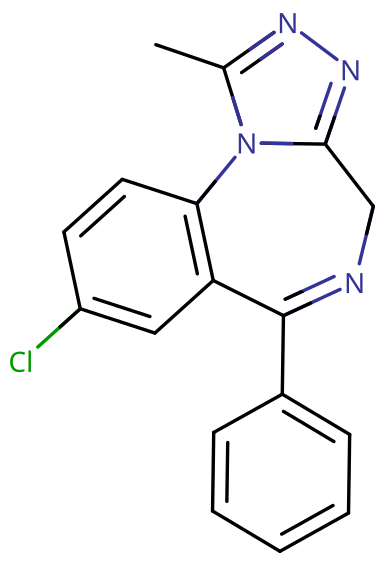

# 阿普唑仑

[◀返回](index.md)

!!! danger "联用危险"

    **当[苯二氮䓬类物质](../文档/药物分类/苯二氮䓬类物质.md)联用其他[抑制剂](../文档/药物分类/抑制剂.md)（如[阿片类药物](../文档/药物分类/阿片类药物.md)、[巴比妥类物质](../文档/药物分类/巴比妥类物质.md)、[加巴喷丁类物质](../文档/药物分类/加巴喷丁类物质.md)、[噻吩二氮䓬类物质](../文档/药物分类/噻吩二氮䓬类物质.md)、[酒精](酒精.md)或其他 [GABA](../文档/GABA.md) 能物质）时，可能导致致命的[药物过量](../文档/药物过量.md)。**[^1]

    强烈建议不要联用这些物质，尤其是在[中等](../文档/药物剂量分类.md#中等)到[严重](../文档/药物剂量分类.md#严重)剂量下。

| **化学信息** | 阿普唑仑（Alprazolam）                                                  |
| ------------ | ----------------------------------------------------------------------- |
| 结构式       |                                              |
| 分子式       | C17H13ClN4                             |
| CAS 号       | 28981-97-7                                                              |
| **化学命名** |                                                                         |
| 常见名称     | 阿普唑仑（Alprazolam）、赞安诺（Xanax）、Ksalol                         |
| 取代名称     | Alprazolam                                                              |
| 系统命名     | 8-Chloro-1-methyl-6-phenyl-4H-[1,2,4]triazolo[4,3-a][1,4]benzodiazepine |
| **类别归属** |                                                                         |
| 精神活性类别 | _[抑制剂](../文档/药物分类/抑制剂.md)_                                    |
| 化学类别     | _[苯二氮䓬类物质](../文档/药物分类/苯二氮䓬类物质.md)_                    |

| [**给药途径**](../文档/给药途径.md)      | 🔽 [口服](../文档/给药途径.md#口服) | 🔽 [鼻吸](../文档/给药途径.md#鼻吸) |
| ---------------------------------------- | ----------------------------------- | ----------------------------------- |
| [**剂量**](../文档/给药剂量.md)          |                                     |                                     |
| [阈值](../文档/药物剂量分类.md#阈值)     | 0.10 mg                             | 0.05 mg                             |
| [轻微](../文档/药物剂量分类.md#轻微)     | 0.25 \~ 0.5 mg                      | 0.05 \~ 0.25 mg                     |
| [中等](../文档/药物剂量分类.md#中等)     | 0.5 \~ 1.5 mg                       | 0.25 \~ 0.5 mg                      |
| [强烈](../文档/药物剂量分类.md#强烈)     | 1.5 \~ 2 mg                         | 0.5 \~ 1 mg                         |
| [严重](../文档/药物剂量分类.md#严重)     | 2 mg +                              | 1 mg +                              |
| [**药效时长**](../文档/药效时长.md)      |                                     |                                     |
| [总时长](../文档/药效时长.md#总时长)     | 6 \~ 8 小时[^2]                     | 4 \~ 5 小时[^2]                     |
| [药效发作](../文档/药效时长.md#药效发作) | 15 \~ 30 分钟                       | 5 \~ 10 秒                          |
| [药效上升](../文档/药效时长.md#药效上升) | 50 \~ 90 分钟                       | 5 \~ 10 分钟                        |
| [药效达峰](../文档/药效时长.md#药效达峰) | 1 \~ 2 小时                         | 1 \~ 2 小时                         |
| [药效褪去](../文档/药效时长.md#药效褪去) | 2 \~ 4 小时                         | 2 \~ 3 小时                         |
| [药效残余](../文档/药效时长.md#药效残余) | 6 \~ 24 小时                        |                                     |

| [**相互作用**](#危险的相互作用) |             |
| ------------------------------- | ----------- |
| 兴奋剂                          | ⚠️ 谨慎联用 |
| 抑制剂                          | ⛔ 严禁联用 |
| 解离剂                          | ⛔ 严禁联用 |

- !!! warning "警告"

        由于个体体重、耐受性、新陈代谢和个人敏感度的差异，请务必从低剂量开始。参见[负责任的用药部分](../文档/负责任的用药索引页.md)。

    !!! info "[免责声明](../关于本站/免责声明.md)"

        本站的[给药剂量](../文档/给药剂量.md)信息收集自用户和[相关资源](../文档/科学信息索引页.md)，仅供教育目的使用。这不是医疗建议，应与其他来源核实以确保准确性。

**阿普唑仑** 是一种[苯二氮䓬类](../文档/药物分类/苯二氮䓬类物质.md)[抑制剂](../文档/药物分类/抑制剂.md)。其特征性效应包括[焦虑抑制](../药效/焦虑抑制.md)、[镇静](../药效/镇静.md)、[去抑制](../药效/去抑制.md)和[肌肉松弛](../药效/肌肉松弛.md)。[^3]

与其他苯二氮䓬药物一样，阿普唑仑与 [GABA](../文档/GABA.md)A 受体上的特定位点结合。[^4] 它通常用于治疗惊恐障碍、广泛性焦虑症（GAD）或社交焦虑症（SAD）。[^5]

阿普唑仑起效快，症状缓解迅速。对于惊恐障碍，90% 的峰值效应在使用后第 1 小时内达到，完全峰值效应分别在 1.5 和 1.6 小时达到。[^6] [^7] 对于 GAD，达到峰值效果可能需要长达一周的时间。[^8]

对于长期定期使用的个体来说，[突然停用苯二氮䓬类物质](../文档/药物分类/苯二氮䓬类物质.md#停止使用与戒断)可能具有潜在危险甚至危及生命，有时会导致癫痫发作或死亡。[^9] 强烈建议通过在较长时间内逐渐降低每日服用量来[减量](../文档/减量戒断法.md)，而不是突然停药。[^10]

|  |
| :---------------------------------------------------: |
|           赞安诺（阿普唑仑）2 mg 三刻痕片剂           |

## 化学

阿普唑仑是苯二氮䓬类药物。苯二氮䓬类药物含有一个苯环与一个二氮䓬环稠合，二氮䓬环是一个七元环，两个氮原子位于 R1 和 R4 位置。阿普唑仑的苯环在 R8 位被一个氯基取代。此外，二氮䓬环在 R5 位与一个苯环相连。阿普唑仑还含有一个 1-甲基化的三唑环，与其二氮䓬环的 R1 和 R2 稠合并结合。阿普唑仑属于含有这种稠合三唑环的苯二氮䓬类，称为三唑苯二氮䓬类，以后缀「-唑仑」区分。

阿普唑仑在 R6 位被苯基取代，在 R8 位被氯原子取代，在 R1 位被甲基取代。它是三唑仑的类似物，两者的区别在于苯环「邻位」缺少一个氯原子。它溶于酒精，不溶于水。

## 药理学

和其他苯二氮䓬类药物一样，阿普唑仑结合 GABAA 受体上的苯二氮䓬靶点，作为 [GABA](../文档/GABA.md)A [受体](../文档/受体.md)的正变构调节剂（PAM），促进 GABA（大脑中主要的抑制性[神经递质](../文档/神经递质.md)）结合 GABAA 受体，[^11] 提高 Cl⁻ 通道开放频率，从而增强抑制性神经传递，产生[镇静](../药效/镇静.md)和[抗焦虑](../药效/焦虑抑制.md)的效果。

苯二氮䓬类的[抗惊厥](../药效/癫痫发作抑制.md)特性可能部分或全部归因于与电压依赖性 Na+ 通道的结合，而非苯二氮䓬受体。[^12]

阿普唑仑导致下丘脑-垂体-肾上腺轴的显著抑制。已证明阿普唑仑的给药会引起纹状体[多巴胺](../文档/多巴胺.md)浓度的增加。[^13] 这导致包括减少焦虑、肌肉松弛、抗抑郁和抗惊厥活性在内的效应。GABA 化学物质和受体系统介导阿普唑仑对神经系统的抑制或镇静效应。阿普唑仑与 GABAA 受体（一种氯离子通道）的结合增强了 GABA（一种神经递质）的效应。当 GABA 与 GABAA 受体结合时，通道打开，氯离子进入细胞，使其更难去极化。因此，阿普唑仑对突触传递有抑制作用，从而减少焦虑。[^14]

GABAA 受体由 19 种可能的亚基中的 5 个组成，由不同亚基组合组成的 GABAA 受体具有不同的特性、在大脑中的不同位置，以及重要的是，对苯二氮䓬类的不同活性。阿普唑仑和其他三唑苯二氮䓬类（如三唑仑）具有与其二氮䓬环稠合的三唑环，似乎具有抗抑郁特性。[^15] 这可能是由于与三环类抗抑郁药的相似性，因为它们有两个苯环与一个二氮䓬环稠合。阿普唑仑的治疗特性与其他苯二氮䓬类相似，包括抗焦虑、抗惊厥、肌肉松弛、催眠和遗忘作用；然而，它主要用作抗焦虑药。

与劳拉西泮相比，给予阿普唑仑已被证明会引起纹状体中细胞外多巴胺 D1 和 D2 浓度的统计学显著增加。[^13]

## 主观效应

阿普唑仑的一般精神状态被许多人描述为强烈的镇静、放松、焦虑抑制和抑制减少。

!!! info "[免责声明](../关于本站/免责声明.md)"

    _下列效应引用自 [**主观效应索引**](../药效/index.md)（**SEI**），这是一个基于轶事用户报告和个人分析的开放研究文献。因此，应带着健康的怀疑态度来看待它们。_

    _同样值得注意的是，这些效应不一定会以可预测或可靠的方式发生，尽管较高的剂量更可能引发全方位的效应。同样，**不良反应** 随着剂量的增加变得越来越可能，可能包括 **成瘾、严重伤害或死亡** ☠。_

- ### **[躯体效应](../药效/躯体效应.md)** 
    - **[镇静](../药效/镇静.md)**：阿普唑仑能够产生强烈的镇静作用，可能导致昏昏欲睡的状态。在较高水平时，这会导致用户突然感到极度睡眠不足，需要努力保持清醒。这种睡眠剥夺感与剂量成正比增加，最终变得足够强大，迫使用户进入深度无意识状态。
    - **[躯体沉重感](../药效/躯体沉重感.md)**：据报道，阿普唑仑会导致身体沉重感。这种效应在低剂量时可能表现为运动障碍和移动困难，在高剂量时可能表现为完全昏睡或无法站立或移动。
    - **[食欲增强](../药效/食欲增强.md)**：一些用户报告说，阿普唑仑能够以类似于[酒精](酒精.md)的方式增强食欲，并且与[大麻](大麻.md)有协同作用。
    - **[肌肉松弛](../药效/肌肉松弛.md)**：据报道，阿普唑仑产生中等程度的肌肉松弛，比[酒精](酒精.md)强但比[地西泮](地西泮.md)（安定）弱。
    - **[运动控制丧失](../药效/运动控制丧失.md)**：阿普唑仑以剂量依赖的方式损害运动控制，类似于[酒精](酒精.md)。较高剂量会显著增加因跌倒或撞到物体而造成身体伤害的风险。这种风险在楼梯和斜坡附近尤为突出。
    - **[呼吸抑制](../药效/呼吸抑制.md)**
    - **[头晕](../药效/头晕.md)**：较高剂量时有时会出现头晕，尽管通常比酒精的眩晕效应（俗称"天旋地转"）要轻。
    - **[癫痫发作抑制](../药效/癫痫发作抑制.md)**：由于其 [GABA 介导的](../文档/GABA.md)对神经系统的抑制作用，阿普唑仑具有抑制癫痫发作的特性。
    - **[口干](../药效/口干.md)**：虽然不常见，但阿普唑仑能够在某些用户中引起口干。这可能会使用户喝更多的水。这与脱水不同，因为它不被认为是危险的。[^16]

- ### **[认知效应](../药效/认知效应.md)** 
    - **[分析能力抑制](../药效/分析能力抑制.md)**
    - **[焦虑抑制](../药效/焦虑抑制.md)**
    - **[强迫性补量](../药效/强迫性补量.md)**：阿普唑仑产生[去抑制](../药效/去抑制.md)，加上其记忆抑制效应，很容易导致用户失去意识并不断补量，直到他们的供应耗尽或失去意识。如果用户同时服用[酒精](酒精.md)或其他[抑制剂](../文档/药物分类/抑制剂.md)，这种效应可能使用户面临因呼吸抑制而致命过量的风险。
    - **[混乱](../药效/混乱.md)**：阿普唑仑在严重剂量时可能导致混乱。这种效应是药物抑制基本认知功能（如理解、记忆和推理能力）的结果。
    - **[清醒妄想](../药效/妄想.md)**：这是一种错误的信念，认为自己完全清醒，尽管有明显的相反证据，如严重的认知障碍和无法与他人充分沟通。它最常发生在严重剂量时。
    - **[去抑制](../药效/去抑制.md)**
    - **[梦境抑制](../药效/梦境抑制.md)**：像阿普唑仑这样的苯二氮䓬类通常会抑制 REM 睡眠并抑制做梦体验。服用苯二氮䓬类后的睡眠通常被报告为深沉和恢复性的，尽管应该注意的是，实际睡眠质量较低，这就是为什么不建议将苯二氮䓬类作为长期睡眠辅助剂使用。
    - **[情感抑制](../药效/情感抑制.md)**：虽然阿普唑仑主要抑制焦虑，但它也以一种与[抗精神病药](../文档/抗精神病药.md)不同但不那么强烈的方式钝化其他情绪。
    - **[欣快](../药效/认知欣快.md)**：一部分用户报告在受此物质影响时感到明显的情绪幸福感和舒适感。因为这种情况不会在大多数用户中定期或一致地发生，推测这种效应只在那些基线焦虑水平异常高的人中表现出来。
    - **[语言能力抑制](../药效/语言能力抑制.md)**：阿普唑仑已知会导致言语不清和难以清晰表达词语。
    - **[记忆抑制](../药效/记忆抑制.md)**：阿普唑仑主要抑制短期记忆，导致健忘和/或行为混乱。
        - **[失忆](../药效/失忆.md)**：较高剂量的阿普唑仑很容易导致完全的短期失忆（断片），类似于高剂量酒精。
    - **[动力抑制](../药效/动力抑制.md)**：由于阿普唑仑的强烈镇静和昏睡作用，进行任何需要移动或大量努力的活动可能很困难，尤其是在较高剂量时。
    - **[困倦](../药效/困倦.md)**
    - **[思维减速](../药效/思维减速.md)**

- ### **[视觉效应](../药效/视觉效应.md)** 
    - **[视觉锐度抑制](../药效/视觉锐度抑制.md)**：像许多[抑制剂](../文档/药物分类/抑制剂.md)一样，阿普唑仑已知会导致视力模糊或其他视觉锐度抑制。

- ### **药效残余** 
    - **反弹性[焦虑](../药效/焦虑.md)**：反弹性焦虑是[焦虑缓解](../药效/焦虑抑制.md)物质（如苯二氮䓬类）常见的观察效应。它通常与在物质影响下花费的总时间以及在给定时期内消耗的总量相对应，这种效应很容易导致依赖和成瘾的循环。
    - **[梦境强化](../药效/梦境强化.md)**[^17]
    - **残余[困倦](../药效/困倦.md)**：虽然苯二氮䓬类可以用作有效的[催眠](../文档/催眠药.md)辅助剂，但其效应可能会持续到第二天早上，这可能导致用户在几个小时内感到"昏昏沉沉"或"迟钝"。
    - **[思维减速](../药效/思维减速.md)**
    - **[思维混乱](../药效/思维混乱.md)**
    - **[易怒](../药效/易怒.md)**

- ### 矛盾效应 

    对苯二氮䓬类药物的矛盾反应，如癫痫发作增加（在癫痫患者中）、攻击性、焦虑增加、暴力行为、冲动控制丧失、易怒和自杀行为有时会发生（尽管在一般人群中很少见，发生率低于 1%）。[^18] [^19] 这些矛盾效应在娱乐性滥用者、精神障碍患者、儿童和高剂量方案患者中发生频率更高。[^20] [^21]

### 体验报告

目前我们的[报告索引](../报告/index.md)中没有关于该物质效果的体验报告。你可以在[本站 Github 仓库](https://github.com/SalviaSWC/FreeODwiki)提交你自己的体验报告。

其他的体验报告可以在这里找到：

- PsychonautWiki：
    1. [Experience:15mg 4-AcO-DMT (oral) - the trees looked cool at least](https://psychonautwiki.org/wiki/Experience:15mg_4-AcO-DMT_%28oral%29_-_the_trees_looked_cool_at_least)
    2. [Experience:Alprazolam (24 mg) - Into the Void](https://psychonautwiki.org/wiki/Experience:Alprazolam_%2824_mg%29_-_Into_the_Void)
    3. [Experience:Alprazolam (~2mg on separate days, oral) - Not remembering going to sleep](https://psychonautwiki.org/wiki/Experience:Alprazolam_%28~2mg_on_separate_days,_oral%29_-_Not_remembering_going_to_sleep)
- [Erowid Experience Vaults: Alprazolam](https://www.erowid.org/experiences/subs/exp_Pharms_Alprazolam.shtml)

## 毒性与危害潜力

|                                                                 |
| :-----------------------------------------------------------------------------------------------------------------------------: |
| 2010 年 ISCD 研究根据药物危害专家的陈述对各种药物（合法和非法）进行的排名表。苯二氮䓬类物质被发现是总体上第 10 位最危险的药物。 |

|                              |
| :-----------------------------------------------------------------------: |
| 雷达图显示苯二氮䓬类与其他药物相比的相对身体危害、社会危害和依赖性。[^22] |

阿普唑仑相对于剂量具有低毒性。[^3] 然而，当与[抑制剂](../文档/药物分类/抑制剂.md)如[酒精](酒精.md)、[阿片类药物](../文档/药物分类/阿片类药物.md)或[巴比妥类物质](../文档/药物分类/巴比妥类物质.md)混合时，它可能是[致命的](../药效/呼吸抑制.md)。通过协同作用导致[呼吸抑制](../药效/呼吸抑制.md)增加。[^23]

大鼠的急性口服 LD50 为 331 \~ 2,171 mg/kg。其他动物实验表明，大剂量静脉注射阿普唑仑后可能发生心肺衰竭。

### 依赖性与滥用潜力

阿普唑仑在身体和心理上都极易成瘾。

对镇静催眠效应的耐受性会在连续使用几天内形成。[^24] 停药后，耐受性在 7 \~ 14 天内恢复到基线的一半。然而，在某些情况下，这可能需要更长的时间，与长期使用的持续时间和强度成正比。

阿普唑仑与所有苯二氮䓬药物存在交叉耐受性，这意味着在服用阿普唑仑后，所有苯二氮䓬类的效果都会减弱。

### 药物过量

极高剂量下可能会发生苯二氮䓬类药物过量，或者更常见的是，当它与其他[抑制剂](../文档/药物分类/抑制剂.md)一起服用时。这种风险在与其他 [GABA 能](../GABA受体.md)抑制剂（如[巴比妥类药物](苯巴比妥.md)和[酒精](酒精.md)）一起使用时尤其存在，因为它们以类似的方式工作，但与 GABAA 受体上的不同位点结合，导致显著的交叉增强效应。

苯二氮䓬类药物过量是一种医疗紧急情况，如果不及时治疗，可能导致昏迷、永久性脑损伤或死亡。症状可能包括严重的[言语不清](../药效/认知效应.md)、[困惑](../药效/混乱.md)、[错觉](../药效/清醒错觉.md)、[呼吸抑制](../药效/呼吸抑制.md)和无反应。使用者看起来可能像是在梦游。由于判断力受损，使用者也更容易消耗更多同种或另一种物质，这在其他物质过量期间通常看不到。

苯二氮䓬类药物过量可以在医院环境中得到有效治疗，结果通常良好。护理主要是支持性的，尽管有时会使用[氟马西尼](氟马西尼.md)（一种 GABAA 受体拮抗剂[^25]）或如果涉及其他物质，则进行额外的程序（如[肾上腺素](../肾上腺素受体.md)注射）来治疗过量。

### 停药

苯二氮䓬类药物的停药非常困难；对于规律使用的个人来说，如果在几周内不逐渐减少剂量而停用，可能会危及生命。存在[高血压](../药效/血压升高.md)、[癫痫发作](../药效/癫痫发作.md)和死亡的风险增加。[^26] 在戒断期间应避免使用降低癫痫发作阈值的物质，如[曲马多](曲马多.md)。突然停药也会引起反弹刺激，表现为[焦虑](../药效/焦虑.md)、[失眠](../药效/觉醒.md)和烦躁不安。

如果希望在一段时间的规律使用后停药，最安全的方法是在几周内每天减少极少量的剂量，直到接近戒断。如果使用短半衰期的苯二氮䓬类药物，如阿普唑仑或[依替唑仑](依替唑仑.md)，可以用长效品种如[地西泮](地西泮.md)或[氯硝西泮](氯硝西泮.md)代替。症状可能仍然存在，但其严重程度将显著降低。

有关以受控方式逐渐减少苯二氮䓬类药物的更多信息，请参阅[本指南](http://www.benzo.org.uk/manual/bzcha02.htm)。少量的[酒精](酒精.md)也可以帮助减轻症状，但除此之外不能用作有效的递减剂。

戒断症状的持续时间和严重程度取决于许多因素，包括所用物质的半衰期、耐受性和滥用的持续时间。对于持续时间较短的苯二氮䓬类药物，主要症状通常在停药后几天内开始，并持续约一周。半衰期较长的苯二氮䓬类药物将表现出起效缓慢且持续时间延长的戒断症状。

### 危险的相互作用

!!! warning "警告"

    _许多精神活性物质在单独使用时相对安全，但与某些其他物质联用可能会突然变得危险甚至危及生命。_

    _请务必进行独立研究（例如 [Google](https://www.google.com)、[DuckDuckGo](https://www.duckduckgo.com)、[PubMed](https://pubmed.ncbi.nlm.nih.gov/)），确保多种物质的组合是安全的。部分列出的相互作用来自 [TripSit](https://combo.tripsit.me)。_

- ⛔ **[抑制剂](../文档/药物分类/抑制剂.md)**（_[1,4-丁二醇](1,4-丁二醇.md)、[2M2B](2M2B.md)、[酒精](酒精.md)、[苯二氮䓬类药物](../文档/药物分类/苯二氮䓬类物质.md)、[巴比妥类药物](苯巴比妥.md)、[GHB](GHB.md)/[GBL](GBL.md)、[甲喹酮](甲喹酮.md)、[阿片类药物](../文档/药物分类/阿片类药物.md)_）：这种组合会增强彼此引起的[肌肉松弛](../药效/肌肉松弛.md)、[健忘](../药效/失忆.md)、[镇静](../药效/镇静.md)和[呼吸抑制](../药效/呼吸抑制.md)。在高剂量下，它会导致突然的、意想不到的意识丧失以及危险程度的呼吸抑制。在失去知觉时因呕吐物窒息的风险也会增加。如果在失去知觉前发生[恶心](../药效/恶心.md)或呕吐，使用者应尝试以[复苏体位](../文档/药物应对措施/应急处理.md)入睡或让朋友将其移入该体位。
- ⛔ **[解离剂](../文档/药物分类/解离剂.md)**：这种组合可以不可预测地增强彼此可能引起的[健忘](../药效/失忆.md)、[镇静](../药效/镇静.md)、[运动控制丧失](../药效/运动控制丧失.md)和[错觉](../药效/清醒错觉.md)。它还可能导致突然的意识丧失，并伴有危险程度的[呼吸抑制](../药效/呼吸抑制.md)。如果在失去知觉前发生[恶心](../药效/恶心.md)或呕吐，使用者应尝试以[复苏体位](../文档/药物应对措施/应急处理.md)入睡或让朋友将其移入该体位。
- 💔 **[兴奋剂](../文档/药物分类/兴奋剂.md)**：兴奋剂会掩盖抑制剂的[镇静](../药效/镇静.md)作用，这是大多数人用来衡量其中毒程度的主要因素。一旦兴奋剂的效应消退，抑制剂的效应将显著增加，导致[去抑制](../药效/去抑制.md)、[运动控制丧失](../药效/运动控制丧失.md)和危险的[断片状态](../药效/失忆.md)加剧。如果不同时密切监测体液摄入量，这种组合也可能导致严重脱水。如果选择联用这些物质，应严格限制自己按照预设的时间表每小时仅服用一定量，直到达到最大阈值。

## 法律地位

在国际上，阿普唑仑被列入联合国精神药物公约附表 IV。[^27]

- **中国大陆**：根据《麻醉药品和精神药品管理条例》，氯硝西泮被列入第二类精神药品，属于管制药品。[^44]
- **澳大利亚**：阿普唑仑最初是附表 4（仅限处方）药物；然而，截至 2014 年 1 月，它将成为附表 8 药物，受到更严格的处方要求限制。[^28]
- **奥地利**：根据 AMG，阿普唑仑用于医疗用途是合法的，但在没有根据 SMG 开具处方的情况下出售或拥有是非法的。
- **捷克**：阿普唑仑是附表 IV（清单 7）物质。仅凭「无蓝条」处方出售。[^29] [^30]
- **法国**：阿普唑仑是清单 I 物质，可凭处方获得。没有处方购买是非法的。[^31]
- **德国**：截至 1986 年 8 月 1 日，阿普唑仑受 Anlage III BtMG（_麻醉品法，附表 III_）管制。它只能在麻醉品处方单上开具，但每个剂型含有高达 1mg 阿普唑仑的制剂除外。[^32] [^33]
- **爱尔兰**：阿普唑仑是附表 4 药物。[^34]
- **意大利**：阿普唑仑是「Testo unico sulla droga（D.P.R. 309/90）」的附表IV药物（Tabella 4）。当用于医疗用途处方时，它属于药物部分 B 和 E。[^35] [^36]
- **俄罗斯**：在俄罗斯，自 2013 年起，阿普唑仑是附表 III 受控物质。[^37]
- **瑞典**：根据麻醉药品法（1968），阿普唑仑是清单 IV（附表 4）中的处方药。[^38]
- **瑞士**：阿普唑仑是 Verzeichnis B 下明确命名的受控物质。允许医疗使用。[^39]
- **土耳其**：阿普唑仑是仅限“绿色处方”的物质，如果没有处方出售或拥有则是非法的。[^40]
- **荷兰**：阿普唑仑是鸦片法清单 2 物质，可凭处方获得。[^41]
- **英国**：阿普唑仑被归类为受控药物，列于 2001 年滥用药物条例附表 IV 第一部分（CD Benz POM），允许凭有效处方持有。1971 年滥用药物法规定，没有处方拥有该药物是非法的，为此目的，它被归类为 C 类药物。[^42]
- **美国**：阿普唑仑是 DEA 分配给受控物质法案附表 IV 的处方药。[^43]

## 另见

- [负责任的用药](../文档/负责任的用药索引页.md)
    - [容量计量](../文档/负责任的用药索引页.md)
- [抑制剂](../文档/药物分类/抑制剂.md)
- [苯二氮䓬类物质](../文档/药物分类/苯二氮䓬类物质.md)
- [地西泮](地西泮.md) _（Valium）_
- [氯硝西泮](氯硝西泮.md) _（Klonopin）_

## 外部链接

- [Alprazolam (Wikipedia)](https://en.wikipedia.org/wiki/Alprazolam)
- [Alprazolam (PsychonautWiki)](https://psychonautwiki.org/wiki/Alprazolam)
- [Alprazolam (Erowid Vault)](https://erowid.org/pharms/alprazolam/alprazolam.shtml)
- [Alprazolam (Isomer Design)](https://isomerdesign.com/PiHKAL/explore.php?id=3001)
- [Alprazolam (DrugBank)](https://go.drugbank.com/drugs/DB00404)
- [Alprazolam (Drugs.com)](https://www.drugs.com/alprazolam.html)
- [Alprazolam (Drugs-Forum)](https://drugs-forum.com/wiki/Alprazolam)

## 延伸阅读

- [The Ashton Manual](https://www.benzo.org.uk/manual/index.htm)：关于长期使用苯二氮䓬类药物和依赖的安全戒断的有用信息

## 引用文献

[^1]: [_Risks of Combining Depressants - TripSit_](https://tripsit.me/combining-depressants/)

[^2]: Reissig, C. J., Harrison, J. A., Carter, L. P., Griffiths, R. R. (2015). ["Inhaled vs. oral alprazolam: subjective, behavioral and cognitive effects, and modestly increased abuse potential"](https://doi.org/10.1007/s00213-014-3721-0). _Psychopharmacology_. [doi](http://en.wikipedia.org/wiki/Digital_object_identifier 'wikipedia:Digital object identifier'):[10.1007/s00213-014-3721-0](https://doi.org/10.1007%2Fs00213-014-3721-0).

[^3]: Mandrioli, R., Mercolini, L., Raggi, M. A. (October 2008). "Benzodiazepine metabolism: an analytical perspective". _Current Drug Metabolism_. **9** (8): 827–844. [doi](http://en.wikipedia.org/wiki/Digital_object_identifier 'wikipedia:Digital object identifier'):[10.2174/138920008786049258](https://doi.org/10.2174%2F138920008786049258). [ISSN](http://en.wikipedia.org/wiki/International_Standard_Serial_Number 'wikipedia:International Standard Serial Number') [1389-2002](https://www.worldcat.org/issn/1389-2002).

[^4]: Nuss, P. (17 January 2015). ["Anxiety disorders and GABA neurotransmission: a disturbance of modulation"](https://www.ncbi.nlm.nih.gov/pmc/articles/PMC4303399/). _Neuropsychiatric Disease and Treatment_. **11**: 165–175. [doi](http://en.wikipedia.org/wiki/Digital_object_identifier 'wikipedia:Digital object identifier'):[10.2147/NDT.S58841](https://doi.org/10.2147%2FNDT.S58841). [ISSN](http://en.wikipedia.org/wiki/International_Standard_Serial_Number 'wikipedia:International Standard Serial Number') [1176-6328](https://www.worldcat.org/issn/1176-6328).

[^5]: FDA approved labeling for Xanax revision 08/23/2011 | <http://www.accessdata.fda.gov/drugsatfda_docs/label/2011/018276s045lbl.pdf>

[^6]: Smith, R. B., Kroboth, P. D., Vanderlugt, J. T., Phillips, J. P., Juhl, R. P. (1984). "Pharmacokinetics and pharmacodynamics of alprazolam after oral and IV administration". _Psychopharmacology_. **84** (4): 452–456. [doi](http://en.wikipedia.org/wiki/Digital_object_identifier 'wikipedia:Digital object identifier'):[10.1007/BF00431449](https://doi.org/10.1007%2FBF00431449). [ISSN](http://en.wikipedia.org/wiki/International_Standard_Serial_Number 'wikipedia:International Standard Serial Number') [0033-3158](https://www.worldcat.org/issn/0033-3158).

[^7]: Sheehan, D. V., Sheehan, K. H., Raj, B. A. (2007). "The speed of onset of action of alprazolam-XR compared to alprazolam-CT in panic disorder". _Psychopharmacology Bulletin_. **40** (2): 63–81. [ISSN](http://en.wikipedia.org/wiki/International_Standard_Serial_Number 'wikipedia:International Standard Serial Number') [0048-5764](https://www.worldcat.org/issn/0048-5764).

[^8]: Verster, J. C., Volkerts, E. R. (7 June 2006). ["Clinical Pharmacology, Clinical Efficacy, and Behavioral Toxicity of Alprazolam: A Review of the Literature"](https://onlinelibrary.wiley.com/doi/10.1111/j.1527-3458.2004.tb00003.x). _CNS Drug Reviews_. **10** (1): 45–76. [doi](http://en.wikipedia.org/wiki/Digital_object_identifier 'wikipedia:Digital object identifier'):[10.1111/j.1527-3458.2004.tb00003.x](https://doi.org/10.1111%2Fj.1527-3458.2004.tb00003.x). [ISSN](http://en.wikipedia.org/wiki/International_Standard_Serial_Number 'wikipedia:International Standard Serial Number') [1080-563X](https://www.worldcat.org/issn/1080-563X).

[^9]: Lann, M. A., Molina, D. K. (June 2009). "A fatal case of benzodiazepine withdrawal". _The American Journal of Forensic Medicine and Pathology_. **30** (2): 177–179. [doi](http://en.wikipedia.org/wiki/Digital_object_identifier 'wikipedia:Digital object identifier'):[10.1097/PAF.0b013e3181875aa0](https://doi.org/10.1097%2FPAF.0b013e3181875aa0). [ISSN](http://en.wikipedia.org/wiki/International_Standard_Serial_Number 'wikipedia:International Standard Serial Number') [1533-404X](https://www.worldcat.org/issn/1533-404X).

[^10]: Kahan, M., Wilson, L., Mailis-Gagnon, A., Srivastava, A. (November 2011). ["Canadian guideline for safe and effective use of opioids for chronic noncancer pain. Appendix B-6: Benzodiazepine Tapering"](https://www.ncbi.nlm.nih.gov/pmc/articles/PMC3215603/). _Canadian Family Physician_. **57** (11): 1269–1276. [ISSN](http://en.wikipedia.org/wiki/International_Standard_Serial_Number 'wikipedia:International Standard Serial Number') [0008-350X](https://www.worldcat.org/issn/0008-350X).

[^11]: Haefely, W. (29 June 1984). "Benzodiazepine interactions with GABA receptors". _Neuroscience Letters_. **47** (3): 201–206. [doi](http://en.wikipedia.org/wiki/Digital_object_identifier 'wikipedia:Digital object identifier'):[10.1016/0304-3940(84)90514-7](https://doi.org/10.1016%2F0304-3940%2884%2990514-7). [ISSN](http://en.wikipedia.org/wiki/International_Standard_Serial_Number 'wikipedia:International Standard Serial Number') [0304-3940](https://www.worldcat.org/issn/0304-3940).

[^12]: McLean, M. J., Macdonald, R. L. (February 1988). "Benzodiazepines, but not beta carbolines, limit high frequency repetitive firing of action potentials of spinal cord neurons in cell culture". _The Journal of Pharmacology and Experimental Therapeutics_. **244** (2): 789–795. [ISSN](http://en.wikipedia.org/wiki/International_Standard_Serial_Number 'wikipedia:International Standard Serial Number') [0022-3565](https://www.worldcat.org/issn/0022-3565).

[^13]: Bentué-Ferrer, D., Reymann, J. M., Tribut, O., Allain, H., Vasar, E., Bourin, M. (February 2001). "Role of dopaminergic and serotonergic systems on behavioral stimulatory effects of low-dose alprazolam and lorazepam". _European Neuropsychopharmacology: The Journal of the European College of Neuropsychopharmacology_. **11** (1): 41–50. [doi](http://en.wikipedia.org/wiki/Digital_object_identifier 'wikipedia:Digital object identifier'):[10.1016/s0924-977x(00)00137-1](https://doi.org/10.1016%2Fs0924-977x%2800%2900137-1). [ISSN](http://en.wikipedia.org/wiki/International_Standard_Serial_Number 'wikipedia:International Standard Serial Number') [0924-977X](https://www.worldcat.org/issn/0924-977X).

[^14]: Hitchings, A., Lonsdale, D., Burrage, D., Baker, E. (2014). _Top 100 drugs: clinical pharmacology and practical prescribing_. Churchill Livingstone. [ISBN](http://en.wikipedia.org/wiki/International_Standard_Book_Number 'wikipedia:International Standard Book Number') [9780702055164](http://en.wikipedia.org/wiki/Special:BookSources/9780702055164 'wikipedia:Special:BookSources/9780702055164').

[^15]: Barbee, J. G. (October 1993). "Memory, benzodiazepines, and anxiety: integration of theoretical and clinical perspectives". _The Journal of Clinical Psychiatry_. 54 Suppl: 86–97; discussion 98–101. [ISSN](http://en.wikipedia.org/wiki/International_Standard_Serial_Number 'wikipedia:International Standard Serial Number') [0160-6689](https://www.worldcat.org/issn/0160-6689).

[^16]: Elie R, Lamontagne Y (June 1984). "Alprazolam and diazepam in the treatment of generalized anxiety". Journal of Clinical Psychopharmacology. 4 (3): 125–9. <https://journals.lww.com/psychopharmacology/abstract/1984/06000/alprazolam_and_diazepam_in_the_treatment_of.2.aspx>

[^17]: Goyal, Sarita. "Drugs and Dreams." Indian Journal of Clinical Practice (n.d.): n. pag. Web. | <http://medind.nic.in/iaa/t13/i3/iaat13i3p624.pdf>

[^18]: Saïas, T., Gallarda, T. (September 2008). "\[Paradoxical aggressive reactions to benzodiazepine use: a review\]". _L’Encephale_. **34** (4): 330–336. [doi](http://en.wikipedia.org/wiki/Digital_object_identifier 'wikipedia:Digital object identifier'):[10.1016/j.encep.2007.05.005](https://doi.org/10.1016%2Fj.encep.2007.05.005). [ISSN](http://en.wikipedia.org/wiki/International_Standard_Serial_Number 'wikipedia:International Standard Serial Number') [0013-7006](https://www.worldcat.org/issn/0013-7006).

[^19]: Paton, C. (December 2002). ["Benzodiazepines and disinhibition: a review"](https://www.cambridge.org/core/journals/psychiatric-bulletin/article/benzodiazepines-and-disinhibition-a-review/421AF197362B55EDF004700452BF3BC6). _Psychiatric Bulletin_. **26** (12): 460–462. [doi](http://en.wikipedia.org/wiki/Digital_object_identifier 'wikipedia:Digital object identifier'):[10.1192/pb.26.12.460](https://doi.org/10.1192%2Fpb.26.12.460). [ISSN](http://en.wikipedia.org/wiki/International_Standard_Serial_Number 'wikipedia:International Standard Serial Number') [0955-6036](https://www.worldcat.org/issn/0955-6036).

[^20]: Bond, A. J. (1 January 1998). ["Drug- Induced Behavioural Disinhibition"](https://doi.org/10.2165/00023210-199809010-00005). _CNS Drugs_. **9** (1): 41–57. [doi](http://en.wikipedia.org/wiki/Digital_object_identifier 'wikipedia:Digital object identifier'):[10.2165/00023210-199809010-00005](https://doi.org/10.2165%2F00023210-199809010-00005). [ISSN](http://en.wikipedia.org/wiki/International_Standard_Serial_Number 'wikipedia:International Standard Serial Number') [1179-1934](https://www.worldcat.org/issn/1179-1934).

[^21]: Drummer, O. H. (February 2002). "Benzodiazepines - Effects on Human Performance and Behavior". _Forensic Science Review_. **14** (1–2): 1–14. [ISSN](http://en.wikipedia.org/wiki/International_Standard_Serial_Number 'wikipedia:International Standard Serial Number') [1042-7201](https://www.worldcat.org/issn/1042-7201).

[^22]: Nutt, D., King, L. A., Saulsbury, W., Blakemore, C. (24 March 2007). ["Development of a rational scale to assess the harm of drugs of potential misuse"](https://www.sciencedirect.com/science/article/pii/S0140673607604644). _The Lancet_. **369** (9566): 1047–1053. [doi](http://en.wikipedia.org/wiki/Digital_object_identifier 'wikipedia:Digital object identifier'):[10.1016/S0140-6736(07)60464-4](https://doi.org/10.1016%2FS0140-6736%2807%2960464-4). [ISSN](http://en.wikipedia.org/wiki/International_Standard_Serial_Number 'wikipedia:International Standard Serial Number') [0140-6736](https://www.worldcat.org/issn/0140-6736).

[^23]: Weaver MF. Prescription Sedative Misuse and Abuse. Yale J Biol Med. 2015 Sep;88(3):247-56. \[[PMC free article](https://www.ncbi.nlm.nih.gov/pmc/articles/PMC4553644/)\] \[[PubMed](https://pubmed.ncbi.nlm.nih.gov/26339207)\]

[^24]: Janicak, P. G., Marder, S. R., Pavuluri, M. N. (25 October 2010). _Principles and Practice of Psychopharmacotherapy_. Lippincott Williams & Wilkins. [ISBN](http://en.wikipedia.org/wiki/International_Standard_Book_Number 'wikipedia:International Standard Book Number') [9781605475653](http://en.wikipedia.org/wiki/Special:BookSources/9781605475653 'wikipedia:Special:BookSources/9781605475653').

[^25]: Hoffman, E. J., Warren, E. W. (September 1993). "Flumazenil: a benzodiazepine antagonist". _Clinical Pharmacy_. **12** (9): 641–656; quiz 699–701. [ISSN](http://en.wikipedia.org/wiki/International_Standard_Serial_Number 'wikipedia:International Standard Serial Number') [0278-2677](https://www.worldcat.org/issn/0278-2677).

[^26]: Lann, M. A., Molina, D. K. (June 2009). "A fatal case of benzodiazepine withdrawal". _The American Journal of Forensic Medicine and Pathology_. **30** (2): 177–179. [doi](http://en.wikipedia.org/wiki/Digital_object_identifier 'wikipedia:Digital object identifier'):[10.1097/PAF.0b013e3181875aa0](https://doi.org/10.1097%2FPAF.0b013e3181875aa0). [ISSN](http://en.wikipedia.org/wiki/International_Standard_Serial_Number 'wikipedia:International Standard Serial Number') [1533-404X](https://www.worldcat.org/issn/1533-404X).

[^27]: List of Psychotropic Substances under International Control | <http://www.incb.org/documents/Psychotropics/green_lists/Green_list_ENG_2014_85222_GHB.pdf>

[^28]: Alprazolam to be rescheduled from next year | <http://www.australiandoctor.com.au/news/latest-news/alprazolam-to-be-rescheduled-from-next-year>

[^29]: <https://eur-lex.europa.eu/resource.html?uri=cellar:6b5e9beb-1d9b-11ea-95ab-01aa75ed71a1.0001.02/DOC_1&format=PDF>

[^30]: <https://www.zakonyprolidi.cz/cs/2013-463>

[^31]: <https://www.vidal.fr/medicaments/gammes/alprazolam-biogaran-11672.html>

[^32]: ["Zweite Verordnung zur Änderung betäubungsmittelrechtlicher Vorschriften"](http://www.bgbl.de/xaver/bgbl/start.xav?startbk=Bundesanzeiger_BGBl&jumpTo=bgbl186s1099.pdf) (PDF) (in German). Bundesanzeiger Verlag. Retrieved December 26, 2019.

[^33]: ["Anlage III BtMG"](https://www.gesetze-im-internet.de/btmg_1981/anlage_iii.html) (in German). Bundesministerium der Justiz und für Verbraucherschutz. Retrieved December 26, 2019.

[^34]: eISB, [_Misuse Of Drugs (Amendment) Regulations_](https://www.irishstatutebook.ie/eli/1993/si/342/made/en/print)

[^35]: Tabella IV Sostanze stupefacenti <http://www.salute.gov.it/imgs/C_17_pagineAree_3729_listaFile_itemName_3_file.pdf>

[^36]: Tabella Medicinali D.P.R. 309/90 <http://www.salute.gov.it/imgs/C_17_pagineAree_3729_listaFile_itemName_4_file.xls>

[^37]: [_Постановление Правительства РФ от 04.02.2013 N 78 “О внесении изменений в некоторые акты Правительства Российской Федерации” - КонсультантПлюс_](https://www.consultant.ru/cons/cgi/online.cgi?req=doc&base=LAW&n=141744&dst=100005&date=02.12.2019)

[^38]: "Läkemedelsverkets föreskrifter (LVFS 2011:10) om förteckningar över narkotika" \[Medical Products Agency on the lists of drugs\] | <http://www.lakemedelsverket.se/upload/lvfs/konsoliderade/LVFS_2011_10_konsoliderad_tom_2012_6.pdf>

[^39]: ["Verordnung des EDI über die Verzeichnisse der Betäubungsmittel, psychotropen Stoffe, Vorläuferstoffe und Hilfschemikalien"](https://www.admin.ch/opc/de/classified-compilation/20101220/index.html) (in German). Bundeskanzlei \[Federal Chancellery of Switzerland\]. Retrieved January 1, 2020.

[^40]: YEŞİL REÇETEYE TABİ İLAÇLAR | <https://www.titck.gov.tr/storage/Archive/2019/contentFile/01.04.2019%20SKRS%20Ye%C5%9Fil%20Re%C3%A7eteli%20%C4%B0la%C3%A7lar%20Aktif%20SON%20-%20G%C3%9CNCEL_58b1ff4a-2e1c-4867-bad7-eec855d6162a.pdf>

[^41]: [_Opiumwet, Lijst II (Dutch)_](https://wetten.overheid.nl/BWBR0001941/2023-09-12#BijlageII), 2023

[^42]: [_Drugs licensing_](https://www.gov.uk/government/collections/drugs-licensing)

[^43]: DEA, Drug Scheduling | <http://www.deadiversion.usdoj.gov/schedules/index.html>

[^44]: [国家药监局 公安部 国家卫生健康委关于发布药用类麻醉药品和精神药品目录的公告（2025年第55号）](https://www.nmpa.gov.cn/xxgk/ggtg/ypggtg/ypqtggtg/20250728092519123.html)
