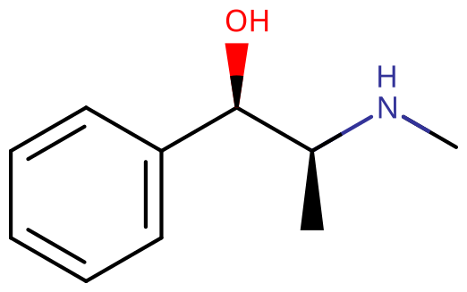

# 麻黄碱

[◀返回](index.md)

!!! info "信息"

    请勿将麻黄碱（Ephedrine）与[麻黄酮](甲卡西酮.md)（Ephedrone）或[依芬尼定](依芬尼定.md)（Ephenidine）混淆哦。

| **化学信息** | 麻黄碱（Ephedrine）                                 |
| ------------ | --------------------------------------------------- |
| 结构式       |                           |
| 分子式       | C10H15NO                      |
| CAS 号       | 299-42-3 50-98-6（盐酸盐） 134-72-5（硫酸盐） |
| **化学命名** |                                                     |
| 常见名称     | 麻黄碱（Ephedrine）、Ephedra                        |
| 取代名称     | (1R,2S)-2-(methylamino)-1-phenylpropan-1-ol         |
| **类别归属** |                                                     |
| 精神活性分类 | _[兴奋剂](../文档/药物分类/兴奋剂.md)_              |
| 化学分类     | _[苯丙胺类物质](../文档/药物分类/苯丙胺类物质.md)_  |

| [**给药途径**](../文档/给药途径.md)      | 🔽 [口服](../文档/给药途径.md#口服) |
| ---------------------------------------- | ----------------------------------- |
| [**给药剂量**](../文档/给药剂量.md)      |                                     |
| [阈值](../文档/药物剂量分类.md#阈值)     | 5 mg                                |
| [轻微](../文档/药物剂量分类.md#轻微)     | 10 \~ 20 mg                         |
| [中等](../文档/药物剂量分类.md#中等)     | 20 \~ 30 mg                         |
| [强烈](../文档/药物剂量分类.md#强烈)     | 30 \~ 50 mg                         |
| [严重](../文档/药物剂量分类.md#严重)     | 50 mg +                             |
| [**药效时长**](../文档/药效时长.md)      |                                     |
| [总时长](../文档/药效时长.md#总时长)     | 2 \~ 5 小时                         |
| [药效发作](../文档/药效时长.md#药效发作) | 20 \~ 90 分钟                       |
| [药效残余](../文档/药效时长.md#药效残余) | 2 \~ 4 小时                         |

- !!! warning "警告"

        由于个体体重、耐受性、新陈代谢和个人敏感度的差异，请务必从低剂量开始。参见[负责任的用药部分](../文档/负责任的用药索引页.md)。

    !!! info "[免责声明](../关于本站/免责声明.md)"

        本站的[给药剂量](../文档/给药剂量.md)信息收集自用户和[相关资源](../文档/科学信息索引页.md)，仅供教育目的使用。这不是医疗建议，应与其他来源核实以确保准确性。

**麻黄碱** 是一种天然存在的中枢神经系统[兴奋剂](../文档/药物分类/兴奋剂.md)，从植物木贼麻黄（Ephedra equisetina）中获得。通常用作兴奋剂、注意力辅助剂、减充血剂和[食欲抑制剂](../药效/食欲抑制.md)。它常用于预防脊髓麻醉期间的低血压。[^1]

麻黄碱在结构上与[甲基苯丙胺](甲基苯丙胺.md)和[伪麻黄碱](伪麻黄碱.md)密切相关，尽管它的中枢神经系统作用比[苯丙胺类物质](../文档/药物分类/苯丙胺类物质.md)弱得多，而且作用时间更长。它的外周兴奋作用类似于[肾上腺素](../文档/肾上腺素.md)，但不如肾上腺素强大，肾上腺素是肾上腺在体内产生的一种[激素](../文档/激素.md)。

## 历史与文化

麻黄碱的天然形式，在中医中被称为麻黄，自汉代（公元前 206 年 \~ 公元 220 年）以来在中国就有记载，作为一种抗哮喘药和[兴奋剂](../文档/药物分类/兴奋剂.md)。1885 年，日本有机化学家长井长义根据他对传统日本和中国草药的研究，首次完成了麻黄碱的化学合成。麻黄碱在中国的工业生产始于 1920 年代，当时默克公司开始以 ephetonin 的名称营销和销售该药物。1926 年至 1928 年间，从中国出口到西方的麻黄碱从 4 吨增加到 216 吨。麻黄碱成为一种非常流行和有效的哮喘治疗方法，特别是因为它与[肾上腺素](../文档/肾上腺素.md)（当时的标准疗法）不同，它可以口服。麻黄碱作为哮喘治疗方法在 1950 年代后期达到顶峰，从那时起，其治疗用途逐渐不可避免地下降。从主流医学中，麻黄碱进入了街头毒品和营养补充剂的灰色地带。麻黄和麻黄碱产品现在在许多国家被禁止或受到严格监管，因为它们是生产成瘾性化合物[甲基苯丙胺](甲基苯丙胺.md)的主要来源，[^2] 并且与心脏病发作和中风等严重不良事件有关。[^3]

## 化学

麻黄碱是一种[取代苯丙胺类物质](../文档/药物分类/苯丙胺类物质.md)和结构上的甲基苯丙胺类似物。它与甲基苯丙胺的区别仅在于存在一个羟基（-OH）。

麻黄碱是一种拟交感胺和取代苯丙胺。它的分子结构类似于苯丙醇胺、甲基苯丙胺和肾上腺素。在化学上，它是一种在麻黄属（麻黄科）的各种植物中发现的具有苯乙胺骨架的生物碱。它的主要作用是增加去甲肾上腺素在肾上腺素能受体上的活性。它通常以盐酸盐或硫酸盐的形式销售。

麻黄碱表现出光学异构现象，有两个手性中心，产生四种立体异构体。按照惯例，具有立体化学结构 (1R,2S) 和 (1S,2R) 的对映体对被称为麻黄碱，而具有立体化学结构 (1R,2R) 和 (1S,2S) 的对映体对被称为伪麻黄碱。麻黄碱是一种取代苯丙胺和结构上的甲基苯丙胺类似物。它与甲基苯丙胺的区别仅在于存在一个羟基（-OH）。

## 药理学

麻黄碱的主要作用机制是通过增加儿茶酚胺在 α、β1 和 β2 [肾上腺素能](../文档/肾上腺素.md) [受体](../文档/受体.md)上的活性。[^4] 它也作为一种 NDRAs（[去甲肾上腺素](../文档/去甲肾上腺素.md)-[多巴胺](../文档/多巴胺.md) [释放剂](../文档/神经递质释放剂.md)）。[^5]

麻黄碱是一种拟交感胺，作用于交感神经系统（SNS）的一部分。主要作用机制依赖于它通过增加突触后 α 和 β 受体上的去甲肾上腺素活性来间接刺激肾上腺素能受体系统。[^6] 是否存在与 α 受体的直接相互作用是不太可能的，但仍有争议。[^7] L-麻黄碱，特别是其立体异构体去甲伪麻黄碱（也存在于恰特草中）具有间接的拟交感神经作用，由于其能够穿过血脑屏障，它是一种类似于苯丙胺的中枢神经系统兴奋剂，但不那么明显，因为它在黑质中释放去甲肾上腺素和多巴胺。[^8]

与去甲麻黄碱相比，N-甲基的存在降低了在 α 受体上的结合亲和力。不过，麻黄碱的结合力比 N-甲基麻黄碱好，后者在氮原子上有一个额外的甲基。此外，羟基的空间取向对于受体结合和功能活性也很重要。[^9]

## 主观效应

!!! info "[免责声明](../关于本站/免责声明.md)"

    _下列效应引用自 [**主观效应索引**](../药效/index.md)（**SEI**），这是一个基于轶事用户报告和个人分析的开放研究文献。因此，应带着健康的怀疑态度来看待它们。_

    _同样值得注意的是，这些效应不一定会以可预测或可靠的方式发生，尽管较高的剂量更可能引发全方位的效应。同样，**不良反应** 随着剂量的增加变得越来越可能，可能包括 **成瘾、严重伤害或死亡** ☠。_

- ### **[躯体效应](../药效/躯体效应.md)** 
    - **[兴奋](../药效/兴奋.md)**
    - **[支气管扩张](../药效/支气管扩张.md)**
    - **[食欲抑制](../药效/食欲抑制.md)**
    - **[耐力增强](../药效/耐力增强.md)**：麻黄碱常被运动员和健美运动员用作体能增强剂。
    - **[躯体欣快感](../药效/躯体欣快感.md)**
    - **[恶心](../药效/恶心.md)**：在高剂量下
    - **[口干](../药效/口干.md)**
    - **[血管收缩](../药效/血管扩张.md)**（注：原文为 Vasoconstriction，此处链接指向血管扩张可能需确认，但根据文件树只有血管扩张，通常兴奋剂会导致血管收缩，若无对应文件则不翻译文件名或保留原意，但根据要求需翻译。此处暂且保留为血管收缩，若无链接则不加链接，或者指向身体效应索引。鉴于文件树无血管收缩，暂不加链接或指向相关。）
    - **[心率增快](../药效/心率增快.md)**：据报道，麻黄碱比其他苯丙胺类物质更能增加心率。
    - **[自发性躯体感觉](../药效/自发性躯体感觉.md)**
    - **[出汗增加](../药效/出汗增加.md)**
    - **[心律异常](../药效/心律异常.md)**：与其他苯丙胺类物质相比，麻黄碱更常被报道引起心悸。
    - **[体温升高](../药效/体温升高.md)**
    - **[瞳孔扩大](../药效/瞳孔扩大.md)**：这种效果比其他苯丙胺类物质更温和，频率更低。
    - **[磨牙](../药效/磨牙.md)**

- ### **[视觉效应](../药效/视觉效应.md)** 

    与其他苯丙胺类物质相比，麻黄碱很少被报道引起任何明显的视觉效果，这可能是由于相对于肾上腺素而言，它对多巴胺的影响较轻。然而，可能会发生轻微的增强和扭曲。

    #### 增强
    - **[视觉锐度增强](../药效/视觉锐度增强.md)**

    #### 扭曲
    - **[复视](../药效/复视.md)**

- ### **[认知效应](../药效/认知效应.md)** 
    - **[认知欣快](../药效/认知欣快.md)**：据报道，麻黄碱产生的欣快感类似于但比[苯丙胺](苯丙胺.md)产生的欣快感更强烈，但不如[甲基苯丙胺](甲基苯丙胺.md)或 [MDMA](MDMA.md) 产生的欣快感强烈。
    - **[共情、情感和社交能力增强](../药效/共情、情感和社交能力增强.md)**
    - **[焦虑](../药效/焦虑.md)**
    - **[易怒](../药效/易怒.md)**
    - **[专注力强化](../药效/专注力强化.md)**
    - **[记忆增强](../药效/记忆增强.md)**
    - **[思维加速](../药效/思维加速.md)**
    - **[音乐欣赏能力增强](../药效/音乐欣赏能力增强.md)**
    - **[自我膨胀](../药效/自我膨胀.md)**
    - **[时间压缩](../药效/时间扭曲.md)**：这种效果在麻黄碱中比在大多数其他兴奋剂中更强烈。
    - **[性欲增强](../药效/性欲增强.md)** 或 **[性欲减退](../药效/性欲减退.md)**：一些用户报告麻黄碱增强性欲，而另一些用户则经历性欲抑制。总的来说，麻黄碱对性欲的影响比其他苯丙胺类物质要温和。
    - **[动机增强](../药效/动机增强.md)**
    - **[情感抑制](../药效/情感抑制.md)**
    - **[清醒](../药效/清醒.md)**

### 体验报告

目前我们的[报告索引](../报告/index.md)中没有关于该物质效果的体验报告。你可以在[本站 Github 仓库](https://github.com/SalviaSWC/FreeODwiki)提交你自己的体验报告。

其他的体验报告可以在这里找到：

- [Erowid Experience Vaults: Ephedrine](https://www.erowid.org/experiences/subs/exp_Ephedrine.shtml)

## 毒性与危害潜力

与其他兴奋剂相比，麻黄碱对心血管系统有特别强的影响，其使用与心脏病发作、中风和心律失常有关。[^10]

大量长期使用可引起震颤、焦虑、失眠、头痛、心悸、发热感、出汗等不良反应。晚间服用时，常加服镇静催眠药如苯巴比妥以防失眠。

### 致死剂量

一名有两次自杀未遂史的 28 岁白人女性被她的同居丈夫发现死在家中。尸检结果除了胃内容物中有部分溶解的麻黄碱片剂外，没有显著发现。重要的毒理学发现包括血液中麻黄碱浓度为 11 mg/L，肝脏中为 24 mg/kg，肾脏中为 14 mg/kg，大脑中为 8.9 mg/kg。[^11]

### 耐受性和成瘾潜力

与其他[兴奋剂](../文档/药物分类/兴奋剂.md)一样，长期使用麻黄碱可被视为具有中度成瘾性，并且能够在某些使用者中引起心理依赖。

对麻黄碱效果的耐受性在重复和频繁使用后很快建立。麻黄碱与其他[多巴胺能](../文档/多巴胺.md) [兴奋剂](../文档/药物分类/兴奋剂.md)存在交叉耐受性，这意味着在消费麻黄碱后，大多数其他[兴奋剂](../文档/药物分类/兴奋剂.md)化合物的效果都会降低。

### 危险的相互作用

!!! warning "警告"

    _许多精神活性物质在单独使用时相对安全，但与某些其他物质联用可能会突然变得危险甚至危及生命。_

    _请务必进行独立研究（例如 [Google](https://www.google.com)、[DuckDuckGo](https://www.duckduckgo.com)、[PubMed](https://pubmed.ncbi.nlm.nih.gov/)），确保多种物质的组合是安全的。部分列出的相互作用来自 [TripSit](https://combo.tripsit.me)。_

麻黄碱的严重相互作用包括：碘苄胍 I 123、异卡波肼、利奈唑胺、苯乙肼、丙卡巴肼、雷沙吉兰、[司来吉兰](司来吉兰+苯乙胺.md)和[反苯环丙胺](反苯环丙胺.md)。[^12] 请咨询您的医疗保健专业人员或医生以获取更多医疗建议。

1. 麻黄碱与巴比妥类、苯海拉明、氨茶碱合用，通过后者的中枢抑制、抗过敏、抗胆碱、解除支气管痉挛及减少腺体分泌作用。
2. 忌与优降宁等单胺氧化酶抑制剂合用，以免引起血压过高。
3. 与肾上腺皮质激素合用，本品可增加它们的代谢清除率，须调整皮质激素的剂量。
4. 尿碱化剂，如制酸药、钙或镁的碳酸盐、枸橼酸盐、碳酸氢钠等，影响本品在尿中的排泄，增加本品的半衰期，延长作用时间，特别是如尿保持碱性几日或更长，患者大多致麻黄碱中毒，本品用量应调整。
5. 与 α 受体阻滞药如酚妥拉明、哌唑嗪、妥拉唑林以及酚噻嗪类药合用时，可对抗本品的加压作用。
6. 与全麻药如氯仿、氟烷、异氟烷等同用，可使心肌对拟交感胺类药反应更敏感，有发生室性心律失常危险，必须同用时，本品用量应减小。
7. 与三环类抗抑郁药如马普替林同用时，降低本品的加压作用
8. 与洋地黄苷类合用，可致心律失常。
9. 与麦角新碱、麦角胺或缩宫素同用，可加剧血管收缩，导致严重高血压或外围组织缺血。
10. 与多沙普仑同用，两者的加压作用均可增强。

## 法律地位

- **中国大陆**：麻黄碱被列为第一类易制毒化学品。[^13] 单位剂量麻黄碱类药物含量大于 30 mg（不含 30 mg）的含麻黄碱类复方制剂，列入必须凭处方销售的处方药管理。医疗机构应当严格按照《处方管理办法》开具处方。药品零售企业必须凭执业医师开具的处方销售上述药品。[^14]
- **加拿大**：麻黄碱可以作为非处方药出售，用于舒缓鼻塞，剂量为 8 毫克。
- **德国**：麻黄碱是处方药。[^15]
- **瑞典**：麻黄碱是处方药。[^16]
- **美国**：麻黄碱受 _2005 年反甲基苯丙胺流行法案_ 管制，可以在美国所有州的柜台后面购买。所有[伪麻黄碱](伪麻黄碱.md)、麻黄碱和苯丙醇胺的购买都保存在州数据库中，以确保没有人超过每日和每月的限额。每日限额为任何这些物质 3.6 克，每 30 天期间为 9 克。[^17] [伪麻黄碱](伪麻黄碱.md)产品也可以凭有效处方大量购买。

## 外部链接

- [Ephedrine (Wikipedia)](https://en.wikipedia.org/wiki/Ephedrine)
- [Ephedrine (PsychonautWiki)](https://psychonautwiki.org/wiki/Ephedrine)
- [Ephedrine (Erowid Vault)](https://www.erowid.org/chemicals/ephedrine/)
- [Ephedrine (Isomer Design)](https://isomerdesign.com/PiHKAL/explore.php?id=2000)
- [Ephedrine (DrugBank)](https://go.drugbank.com/drugs/DB01364)

## 引用文献

[^1]: "Ephedrine". The American Society of Health-System Pharmacists. Archived from the original on 2017-09-09. Retrieved 8 September 2017.

[^2]: The history of Ephedra (ma-huang). (PubMed.gov / NCBI) | <https://www.ncbi.nlm.nih.gov/pubmed/21365072>

[^3]: der Hooft CS & Stricker BH (2002) "Ephedrine and ephedra in weight loss products and other preparations" <https://europepmc.org/article/med/12148223>

[^4]: Pharmacological Effects of Ephedrine | <https://link.springer.com/referenceworkentry/10.1007/978-3-642-22144-6_41>

[^5]: Dopamine-mediated actions of ephedrine in the rat substantia nigra. (PubMed.gov / NCBI) | <https://www.ncbi.nlm.nih.gov/pubmed/16386715>

[^6]: Merck Manuals > EPHEDrine Archived 2011-03-24 at the Wayback Machine Last full review/revision January 2010

[^7]: Drew CD, Knight GT, Hughes DT, Bush M (September 1978). "Comparison of the effects of D-(-)-ephedrine and L-(+)-pseudoephedrine on the cardiovascular and respiratory systems in man". British Journal of Clinical Pharmacology. 6 (3): 221–5. doi:10.1111/j.1365-2125.1978.tb04588.x. PMC 1429447. PMID 687500.

[^8]: Munhall AC, Johnson SW (January 2006). "Dopamine-mediated actions of ephedrine in the rat substantia nigra". Brain Research. 1069 (1): 96–103. doi:10.1016/j.brainres.2005.11.044. PMID 16386715. S2CID 40626692.

[^9]: Guoyi Ma, et al. Pharmacological Effects of Ephedrine Alkaloids on Human {alpha}1- and {alpha}2-Adrenergic Receptor Subtypes Archived 2011-03-05 at the Wayback Machine J. Pharmacol. Exp. Ther. 322: pp. 214-221 (July 2007) PDF

[^10]: der Hooft CS & Stricker BH (2002) "Ephedrine and ephedra in weight loss products and other preparations" <https://europepmc.org/article/med/12148223>

[^11]: <https://pubmed.ncbi.nlm.nih.gov/8988594/>

[^12]: <https://www.rxlist.com/consumer_ephedrine/drugs-condition.htm>

[^13]: [易制毒化学品管理条例](https://www.gov.cn/gongbao/content/2016/content_5139415.htm)．中华人民共和国中央人民政府

[^14]: [国家食品药品监督管理局 公安部 卫生部 关于加强含麻黄碱类复方制剂管理有关事宜的通知](https://www.nmpa.gov.cn/xxgk/fgwj/gzwj/gzwjyp/20120904120001401.html). 国食药监办[2012]260号

[^15]: <https://www.buzer.de/gesetz/7048/index.htm>

[^16]: <https://www.fass.se/LIF/substance?substanceId=IDE4POC8U9CKGVERT1>

[^17]: Combat Methamphetamine Epidemic Act of 2005<https://www.deadiversion.usdoj.gov/meth/cma2005.htm>
